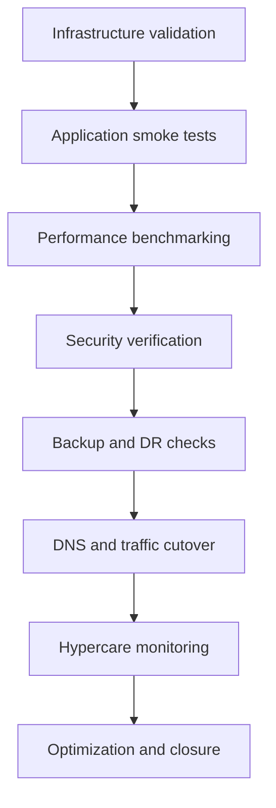
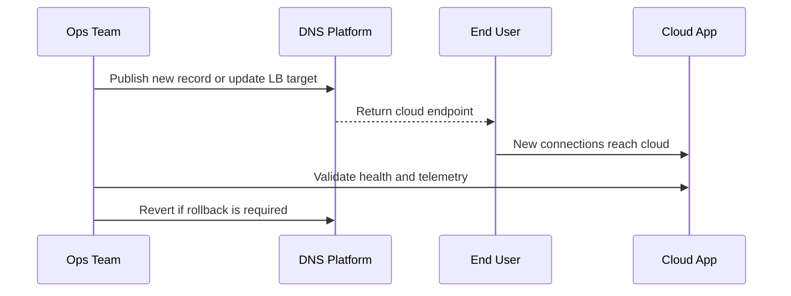
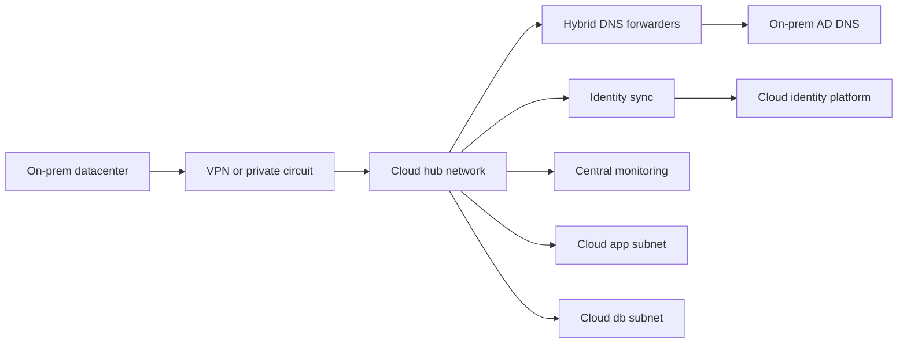

# Post-Migration Validation and Optimization

← Back to [16-cloud-migration.md](./16-cloud-migration.md)

Validation, cutover, hybrid operating models, hypercare, and optimization after landing in cloud.

---

## ✅ Post-Migration Steps

### 🧪 Validation and testing checklist

- Verify instance boots cleanly and core services are active.
- Validate application logins, transactions, background jobs, scheduled tasks, and integrations.
- Confirm mounted storage, permissions, encryption, and backup policy attachment.
- Test outbound access to SMTP, APIs, package repositories, and identity providers.
- Review firewall, NSG, Security Group, or GCP firewall hits to ensure no hidden dependency remains blocked.
- Check certificates, TLS chains, and private key access if offloaded services changed.
- Confirm monitoring dashboards and alert routes are receiving telemetry.
- Run failover or restore tests for at least one representative workload.



### 🌍 DNS cutover

1. Lower TTL well before cutover if business policy allows.
2. Prepare new A, AAAA, CNAME, or load balancer records in advance.
3. Use split-horizon or hybrid DNS carefully so on-premises and cloud systems resolve consistently during transition.
4. Update records only after application health checks pass in the target cloud.
5. Monitor authoritative and recursive resolver propagation.
6. Keep source environment available for rollback until business validation completes.

```bash
# Example validation commands after DNS cutover
dig +short app.example.com
nslookup app.example.com
curl -Ik https://app.example.com
openssl s_client -connect app.example.com:443 -servername app.example.com </dev/null
```



### 📈 Performance benchmarking

- Compare pre-migration and post-migration transaction latency.
- Test peak load, batch windows, cache warmup, and startup times.
- Measure network latency to retained on-premises dependencies.
- Record CPU, memory, disk, and network utilization for sizing corrections.
- Validate autoscaling or scale-up behavior where implemented.

```bash
# Basic Linux benchmarking examples
vmstat 1 5
iostat -xz 1 5
sar -n DEV 1 5
curl -w "dns:%{time_namelookup} connect:%{time_connect} tls:%{time_appconnect} ttfb:%{time_starttransfer} total:%{time_total}
" -o /dev/null -s https://app.example.com
```

### 📡 Monitoring setup

| Platform | Primary service | Key actions after migration |
| --- | --- | --- |
| Azure | Azure Monitor / Log Analytics / Application Insights | Enable VM insights, collect logs, create alerts, wire action groups |
| AWS | CloudWatch / CloudTrail / Systems Manager | Enable metrics, logs, alarms, dashboards, and runbooks |
| GCP | Cloud Monitoring / Cloud Logging / Ops Agent | Install agent, create uptime checks, alerting policies, and dashboards |

### 💾 Backup and DR configuration

- Set backup policy immediately after cutover; do not wait for the next sprint.
- Define retention by data class and compliance requirement.
- Test restore to alternate location or isolated network.
- Document DR topology: same-region, cross-zone, cross-region, or pilot-light.
- Review application-consistent snapshot support for databases and stateful apps.

### 💰 Cost optimization

- Right-size based on real utilization after 7, 30, and 90 days.
- Evaluate reservations, savings plans, committed use discounts, or Azure Reserved Instances.
- Move infrequently accessed data to lower-cost storage tiers.
- Remove unused public IPs, idle disks, test instances, and stale snapshots.
- Use tagging or labels to enforce cost allocation and accountability.
- Monitor inter-region and internet egress charges, especially for retained hybrid dependencies.

## 📊 Cloud Comparison Table

### 🆚 Feature-by-feature comparison

| Capability | Azure | AWS | GCP |
| --- | --- | --- | --- |
| Core identity | Microsoft Entra ID integration is strong for Microsoft estates | IAM with roles and policies is mature and granular | Cloud IAM with strong project and org hierarchy |
| Hybrid connectivity | VPN Gateway and ExpressRoute | Site-to-Site VPN and Direct Connect | Cloud VPN and Cloud Interconnect |
| VM migration tooling | Azure Migrate and ASR | Migration Hub and Application Migration Service | Migrate for Compute Engine |
| Monitoring | Azure Monitor, Log Analytics, Application Insights | CloudWatch, CloudTrail, X-Ray | Cloud Monitoring, Cloud Logging, Trace |
| Backup | Azure Backup and Recovery Services vaults | AWS Backup and snapshots | Backup and DR service, snapshots |
| Managed Kubernetes | AKS | EKS | GKE |
| Strengths often cited | Enterprise Microsoft alignment and hybrid story | Service breadth and ecosystem maturity | Data analytics, Kubernetes, and network simplicity |
| Common concern | Portal and RBAC complexity in large estates | Account sprawl and pricing complexity | Smaller service catalog in some enterprise niches |

### 💵 Pricing models

| Pricing topic | Azure | AWS | GCP |
| --- | --- | --- | --- |
| On-demand | Pay per use by second or hour depending on service | Pay per use, broad marketplace and instance families | Pay per use with sustained use benefits on many services |
| Commitment discounts | Reserved instances and savings plans equivalents | Reserved Instances and Savings Plans | Committed Use Discounts |
| Spot / preemptible | Spot VMs | Spot Instances | Spot VMs |
| Storage tiers | Hot, cool, archive and disk tiers | Standard, infrequent access, glacier-style tiers | Standard, nearline, coldline, archive |
| Cost management | Cost Management + budgets | Cost Explorer + budgets | Billing reports + budgets + recommender |

### 🔁 Equivalent services mapping

| Need | Azure | AWS | GCP |
| --- | --- | --- | --- |
| Virtual machines | Azure Virtual Machines | Amazon EC2 | Compute Engine |
| Object storage | Blob Storage | Amazon S3 | Cloud Storage |
| Block storage | Managed Disks | EBS | Persistent Disk |
| Managed SQL database | Azure SQL / SQL MI | RDS / Aurora | Cloud SQL / AlloyDB |
| Load balancing | Azure Load Balancer / Application Gateway | ELB / ALB / NLB | Cloud Load Balancing |
| Private networking | VNet | VPC | VPC |
| Identity | Microsoft Entra ID | IAM / IAM Identity Center | Cloud IAM / Cloud Identity |
| Secrets | Key Vault | Secrets Manager / Parameter Store | Secret Manager |
| Monitoring | Azure Monitor | CloudWatch | Cloud Monitoring |
| Backup | Azure Backup | AWS Backup | Backup and DR / snapshots |
| VPN | VPN Gateway | Site-to-Site VPN | Cloud VPN |
| Dedicated private link | ExpressRoute | Direct Connect | Cloud Interconnect |

## 🔗 Hybrid Cloud Setup

### 🔐 VPN connectivity

- VPN is usually the fastest way to begin a pilot or initial migration wave.
- Use it to validate routing, DNS forwarding, identity reachability, and management access before investing in dedicated circuits.
- Design with route summarization and failover in mind, and monitor tunnel SLA and packet loss.

### 🚄 ExpressRoute / Direct Connect / Cloud Interconnect

Dedicated connectivity is preferred for sustained high-throughput replication, latency-sensitive traffic, regulated workloads, and large-scale hybrid operations. It also reduces reliance on internet VPN paths during cutover windows.

| Provider | Service | When to use |
| --- | --- | --- |
| Azure | ExpressRoute | Enterprise hybrid connectivity, private peering, predictable latency |
| AWS | Direct Connect | Large migration waves, stable throughput, hybrid data transfer |
| GCP | Cloud Interconnect | High bandwidth hybrid links and shared services connectivity |

### 🧭 Hybrid DNS

- Keep authoritative zones and conditional forwarders documented before migration begins.
- Avoid split-brain surprises by testing resolution paths from both on-premises and cloud networks.
- Consider private DNS zones in cloud plus forwarding back to on-premises for retained services.
- Record which systems own forward and reverse zones, certificate validation flows, and TTL policies.



### 🧱 Hybrid operating model tips

- Keep source and target monitoring visible in one dashboard during migration waves.
- Prefer DNS names over hard-coded IP addresses so routing and endpoint ownership can change safely.
- Plan egress cost if cloud apps continue to call on-premises systems long-term.
- Use centralized certificate lifecycle management because hybrid apps often fail due to certificate chain mismatches.
- Design least-privilege firewall rules for both directions, not only inbound to the cloud.

## 🏢 Real-World Migration Scenarios

### Scenario 1: Three-tier customer portal to Azure

A manufacturing company runs a customer portal on VMware: two web VMs, two app VMs, and one SQL Server database. The business needs to close a secondary datacenter within six months, but the application cannot be refactored immediately. The chosen strategy is rehost for web and app tiers, and replatform for database into Azure SQL Managed Instance after the first wave.

1. Assess web and app VMs with Azure Migrate and verify readiness.
2. Deploy hub-and-spoke Azure network with VPN or ExpressRoute back to headquarters.
3. Replicate web and app VMs using ASR.
4. Run test failover in isolated subnet and validate AD login, file shares, and outbound SMTP.
5. Migrate SQL to a managed target in a later, tightly controlled step.
6. Move DNS records to Azure Application Gateway only after database connectivity is confirmed.
7. Enable Azure Monitor, Defender for Cloud, backup, and policy compliance dashboards.

### Scenario 2: ERP system to AWS with minimal downtime

A retail company runs an ERP application on Linux with Oracle database on separate VMs. It needs lower downtime than a weekend rebuild would allow. The team uses AWS Application Migration Service for app servers and a database-native replication pattern for the database. Direct Connect is provisioned to handle sustained replication and cutover traffic.

1. Create production and staging VPCs with private subnets and Transit Gateway attachment.
2. Install MGN agents on Linux app servers and start replication.
3. Build IAM roles and Systems Manager access to avoid direct internet-exposed SSH.
4. Replicate database using native tooling, test consistency, and define cutover freeze window.
5. Launch test EC2 instances and validate ERP transactions end to end.
6. Execute database cutover, launch final app instances, and switch ALB and DNS.
7. Use CloudWatch dashboards and AWS Backup from day one.

### Scenario 3: Analytics platform to GCP for modernization

A media company collects batch analytics workloads on self-managed Linux servers with high storage growth and periodic compute spikes. It chooses GCP because the long-term target includes BigQuery and GKE, but the first stage is a VM migration to reduce hardware dependence and stabilize operations.

1. Use Migrate for Compute Engine to move Linux workers into Compute Engine.
2. Place workloads in a Shared VPC and attach Cloud Monitoring and centralized logging.
3. Benchmark storage and network throughput because analytics jobs are bursty.
4. Gradually offload raw data into Cloud Storage and later refactor ETL steps into managed services.
5. Use labels for cost allocation by data product and department.
6. Implement snapshots and backup plans before retiring source storage.

### Scenario 4: Hybrid compliance workload retained on-premises with cloud DR

A financial services workload cannot move its production database due to regulatory and latency constraints, but the business wants cloud-based disaster recovery and cloud-hosted web services. The database is retained on-premises, while stateless application tiers move to cloud and consume the retained database over a private circuit.

1. Retain the regulated database on-premises for now.
2. Move stateless web and API tiers to the cloud.
3. Use ExpressRoute, Direct Connect, or Cloud Interconnect for stable private connectivity.
4. Implement strict firewall rules, mutual TLS, and end-to-end monitoring.
5. Benchmark round-trip latency before production go-live.
6. Create a future roadmap to refactor the database tier if regulation or architecture later permits.

### Appendix E: Monitoring minimums by workload tier

#### Web tier

- HTTP success rate
- TLS handshake errors
- Load balancer health
- CPU
- memory
- disk usage
- certificate expiry

#### Application tier

- Queue depth
- request latency
- error rate
- dependency timeout rate
- thread pool saturation
- memory pressure

#### Database tier

- Connection count
- replication lag
- read and write latency
- cache hit ratio
- backup success
- storage free space

#### Platform tier

- VPN or circuit health
- DNS success rate
- IAM auth failures
- configuration drift
- backup job success

### Appendix F: Service mapping quick reference

| Need | Azure | AWS | GCP |
| --- | --- | --- | --- |
| Directory sync | Microsoft Entra Connect | IAM Identity Center / AD Connector patterns | Cloud Identity / federation |
| Server backup | Azure Backup | AWS Backup | Backup and DR / snapshots |
| Policy governance | Azure Policy | AWS Config + SCPs | Org Policy + Config Validator patterns |
| Key management | Key Vault | KMS | Cloud KMS |
| Container registry | ACR | ECR | Artifact Registry |
| Message queue | Service Bus | SQS / SNS / MQ | Pub/Sub |

### Appendix G: Migration risk register examples

| Risk | Impact | Mitigation |
| --- | --- | --- |
| Undocumented dependency | High | Perform flow capture and owner interviews before scheduling wave |
| Bandwidth too low for replication | High | Seed data, compress traffic, or use dedicated connectivity |
| DNS inconsistency | Medium | Lower TTL and test resolution from all segments |
| Identity failure after cutover | High | Validate federation, group sync, and fallback admin path |
| Storage latency regression | High | Benchmark and choose suitable disk class before production |
| Cost overrun | Medium | Apply tags, budgets, and rightsizing review cadence |
| Security policy block | Medium | Review provider policies and required exceptions in advance |
| Backup gap after cutover | High | Attach backup policy as a mandatory go-live step |

### Appendix H: Expanded migration readiness matrix

- [ ] Executive sponsorship
- [ ] Budget approval
- [ ] Network connectivity
- [ ] Cloud IAM design
- [ ] Logging and monitoring
- [ ] Backup and DR
- [ ] Application testing
- [ ] Database migration plan
- [ ] Security sign-off
- [ ] Compliance evidence
- [ ] Cutover communications
- [ ] Rollback documentation

### Appendix I: Day-0, Day-1, Day-2 operations

| Phase | Focus |
| --- | --- |
| Day 0 | Build landing zone, connectivity, IAM, monitoring, backup, base images |
| Day 1 | Migrate workloads, validate functionality, perform cutover, enter hypercare |
| Day 2 | Optimize performance, automate patching, refine alerts, reduce cost, improve resilience |

### Appendix T: Final production go-live checklist

- [ ] All required teams are present in war room.
- [ ] Source system backup completed successfully.
- [ ] Replication status is healthy.
- [ ] Target instance is prepared and reachable.
- [ ] Monitoring dashboards are open.
- [ ] DNS commands are pre-staged.
- [ ] Application owner test script is ready.
- [ ] Rollback criteria are visible to all teams.
- [ ] Status update cadence agreed.
- [ ] Post-cutover ownership confirmed.

### Appendix U: Role-based cutover responsibilities

#### Migration lead

- Own the master runbook and timeline.
- Run go/no-go decision checks.
- Track change approvals and evidence.
- Coordinate war room communications.
- Maintain issue log and remediation owner.
- Authorize rollback if criteria are met.
- Confirm handoff into hypercare.
- Drive lessons-learned review.

#### Network engineer

- Validate VPN or private circuit health.
- Confirm route propagation and firewall policies.
- Stage load balancer updates.
- Validate DNS forwarding paths.
- Monitor packet loss and latency during cutover.
- Prepare rollback route changes.
- Confirm internet egress or proxy behavior.
- Capture flow evidence for closed issues.

#### Security engineer

- Verify IAM groups and privileged access.
- Confirm logging sinks and SIEM integration.
- Validate vulnerability coverage and agent health.
- Review temporary firewall exceptions.
- Check encryption and secret access.
- Approve policy exceptions with expiry.
- Review audit trail after cutover.
- Confirm backup encryption alignment.

#### Application owner

- Provide test script and business checkpoints.
- Attend test failover and production cutover.
- Validate login, transactions, and integrations.
- Approve performance acceptability.
- Communicate business acceptance result.
- Confirm batch jobs and reports.
- Document residual defects.
- Sign off for closure.

#### Database owner

- Validate replication lag and consistency.
- Freeze writes when required.
- Run data integrity queries.
- Verify backup and restore posture.
- Check client connectivity after cutover.
- Confirm maintenance jobs restart.
- Review performance regressions.
- Preserve rollback restore points.

#### Service desk

- Update support runbook and contact tree.
- Prepare incident templates and status messages.
- Watch for user-reported issues after DNS cutover.
- Route tickets to the war room quickly.
- Track closure of top incident categories.
- Update knowledge base articles.
- Confirm user communications are distributed.
- Collect field feedback after stabilization.

### Appendix V: Provider-specific go-live checkpoints

| Provider | Pre-cutover focus | Immediate validation | Rollback pivot |
| --- | --- | --- | --- |
| Azure | Subscription quotas and policy exemptions | VM boots, NIC IPs, NSGs, route tables, Azure Monitor, backup vault | ASR commit, DNS revert, or source service restart |
| AWS | Account SCPs, AMI or snapshot, VPC routes, security groups | EC2 state, Systems Manager, target group health, CloudWatch alarms, AWS Backup | ALB target revert, DNS revert, AMI relaunch, source restart |
| GCP | Project quotas, firewall rules, IAM bindings, snapshots | Compute Engine serial logs, load balancer health, Ops Agent, labels, backup plan | Instance template rollback, DNS revert, snapshot restore, source restart |

### Appendix W: Sample 14-day execution calendar

- **Day -14:** Freeze architecture decisions, lower TTL if permitted, and confirm support roster.
- **Day -13:** Validate quotas, network routes, and IAM group membership.
- **Day -12:** Run backup verification and snapshot checks.
- **Day -11:** Complete last dependency review with application owners.
- **Day -10:** Run test migration in isolated subnet.
- **Day -9:** Record defects and assign remediation owners.
- **Day -8:** Retest after fixes and update runbook timing.
- **Day -7:** Hold formal go-live readiness review.
- **Day -6:** Confirm monitoring dashboards and alert routing.
- **Day -5:** Validate rollback steps end to end.
- **Day -4:** Confirm final change approvals and stakeholder notices.
- **Day -3:** Check replication lag, source health, and circuit stability.
- **Day -2:** Rehearse war room roles and communication cadence.
- **Day -1:** Freeze non-essential changes and capture final baseline metrics.
- **Day 0:** Execute cutover, smoke tests, DNS update, and hypercare entry.
- **Day +1:** Review incidents, telemetry, and user feedback.
- **Day +7:** Close wave or schedule remediation backlog.

### Appendix X: Deep post-migration acceptance checklist

#### Platform

- [ ] Correct region and availability zone placement confirmed.
- [ ] Instance or VM sizing matches approved design.
- [ ] Hostname, tags, and labels are correct.
- [ ] Time synchronization is healthy.
- [ ] Disks are attached in expected order.
- [ ] Boot diagnostics or serial console is enabled.
- [ ] Guest agent is healthy.
- [ ] Configuration management reports success.
- [ ] Base hardening policy is applied.
- [ ] Break-glass admin path is documented.

#### Networking

- [ ] Primary IP matches design or DNS points to the correct endpoint.
- [ ] Default route is correct.
- [ ] Required inbound ports are reachable.
- [ ] Required outbound ports are reachable.
- [ ] Load balancer health checks pass.
- [ ] Private DNS records resolve correctly.
- [ ] Reverse lookup works where required.
- [ ] Proxy configuration works for updates and outbound calls.
- [ ] Firewall logs show expected flows.
- [ ] No unauthorized public exposure exists.

#### Identity and access

- [ ] Admin access works through approved path only.
- [ ] Least-privilege roles are attached.
- [ ] Service accounts use approved secret source.
- [ ] MFA is enforced for privileged users.
- [ ] SSH keys or certificates are rotated as required.
- [ ] Managed identity or instance role access is working.
- [ ] Local break-glass account is controlled and vaulted.
- [ ] Directory group membership is synchronized.
- [ ] Application authentication succeeds.
- [ ] Audit logs capture privileged actions.

#### Application

- [ ] Application starts automatically after reboot.
- [ ] Login flow succeeds.
- [ ] Core transaction completes successfully.
- [ ] Background jobs execute.
- [ ] Reports generate successfully.
- [ ] Outbound integrations respond normally.
- [ ] Inbound integrations reach the application.
- [ ] TLS certificates present correct chain.
- [ ] No hard-coded IP dependency remains broken.
- [ ] Error logs do not show new critical faults.

#### Data

- [ ] Database schema version is correct.
- [ ] Replication or restore state is healthy.
- [ ] Data integrity spot checks pass.
- [ ] Scheduled maintenance jobs are re-enabled.
- [ ] Storage latency is within target.
- [ ] Backup job completes successfully.
- [ ] Restore test is scheduled or completed.
- [ ] Retention policy is attached.
- [ ] Encryption at rest is confirmed.
- [ ] Data residency requirement is satisfied.

#### Observability

- [ ] Metrics arrive in central monitoring.
- [ ] Logs arrive in central logging.
- [ ] Critical alerts are enabled.
- [ ] Notification channels are tested.
- [ ] Dashboard reflects new resource IDs.
- [ ] Synthetic test passes.
- [ ] APM traces appear if used.
- [ ] Security findings are routed correctly.
- [ ] Cost dashboards show new workload allocation.
- [ ] Runbook links are attached to alerts.

#### Operations

- [ ] Patch policy is attached.
- [ ] Backup owner is assigned.
- [ ] On-call ownership is updated.
- [ ] Service desk documentation is updated.
- [ ] CMDB or inventory record is updated.
- [ ] Incident response playbook is updated.
- [ ] Change record contains final evidence.
- [ ] Rollback checkpoint expiry is recorded.
- [ ] Known issues list is published.
- [ ] Closure criteria are defined.

### Appendix Y: Cloud service decision hints

| Need | Prefer VM first when | Prefer managed service when |
| --- | --- | --- |
| Database | App expects OS-level control, custom agents, or unsupported extensions. | Team wants reduced ops burden and supported engine versions fit requirements. |
| File services | Protocol behavior or ACL migration needs close compatibility testing. | Object or managed file service meets application semantics. |
| Load balancing | Lift-and-shift requires minimal change to preserve traffic handling. | You want managed TLS, autoscaling, WAF, and simplified operations. |
| Identity integration | Legacy app requires direct domain join or local trust dependency. | Modern auth, federation, and centralized conditional access are feasible. |
| Backups | Existing tooling must remain temporarily during transition. | Cloud-native backups provide policy, vaulting, and restore speed needed. |
| Monitoring | Existing platform cannot be replaced during the first wave. | Cloud-native observability can cover required metrics, logs, and alerts. |

### Appendix Z: Lessons that improve later migration waves

- Standardize subnet patterns so teams do not redesign networking for every wave.
- Turn repeated manual checks into scripts or pipeline gates.
- Capture failed assumptions explicitly; they are often more valuable than success notes.
- Track access lead time because IAM delays are a common critical path.
- Baseline cost early so optimization is measured, not guessed.
- Retire unused workloads aggressively to reduce migration scope and spend.
- Treat DNS and certificates as first-class migration objects, not last-minute tasks.
- Build one reusable smoke-test pack per application family.
- Require backup attachment and monitoring as cutover exit criteria.
- Prefer dependency-based wave planning over org-chart-based wave planning.
