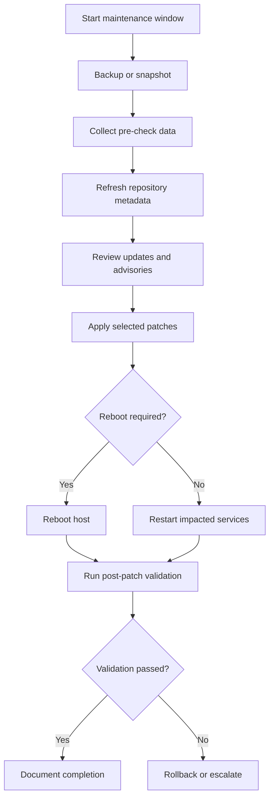
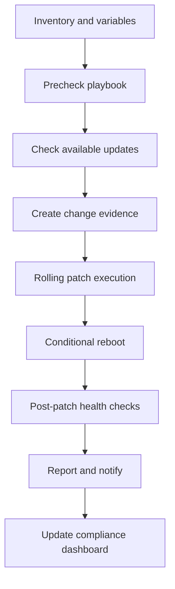
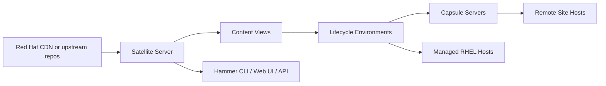
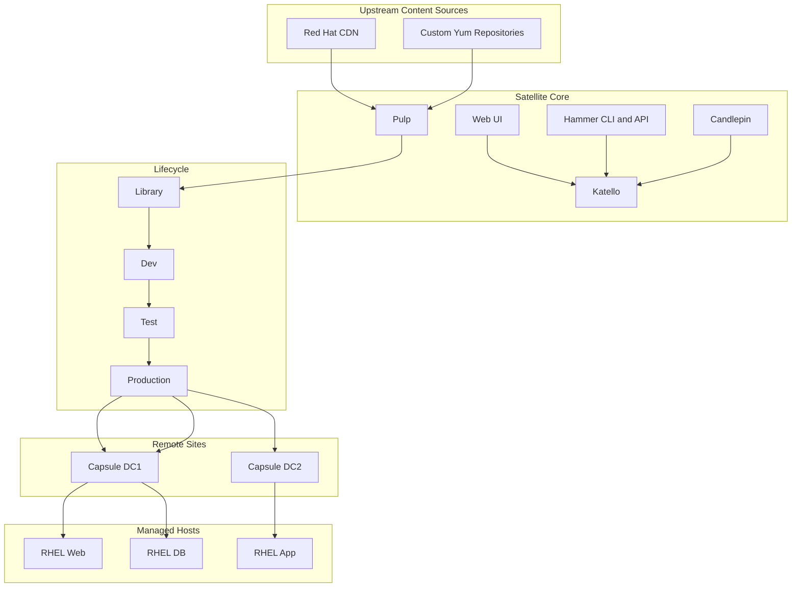
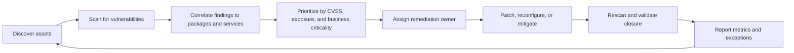
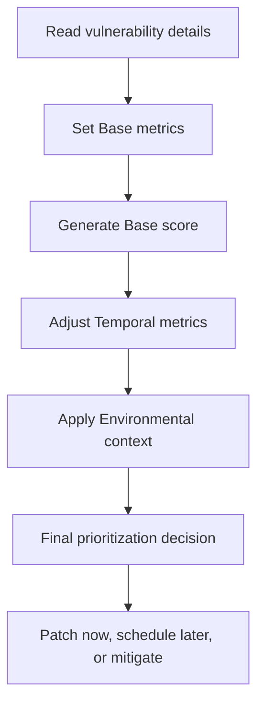
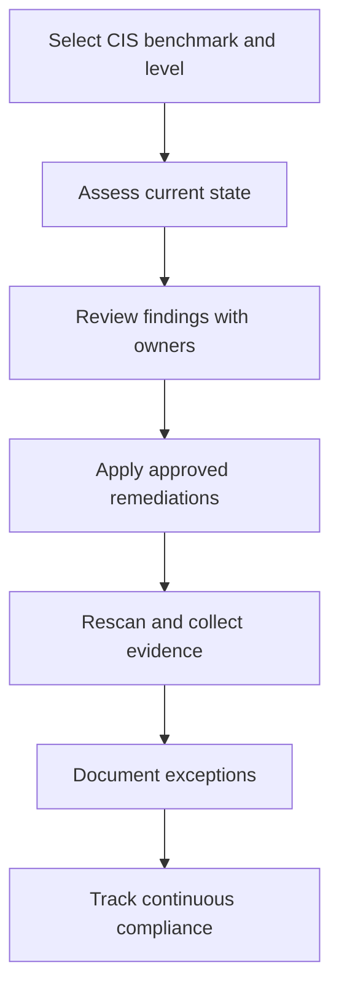
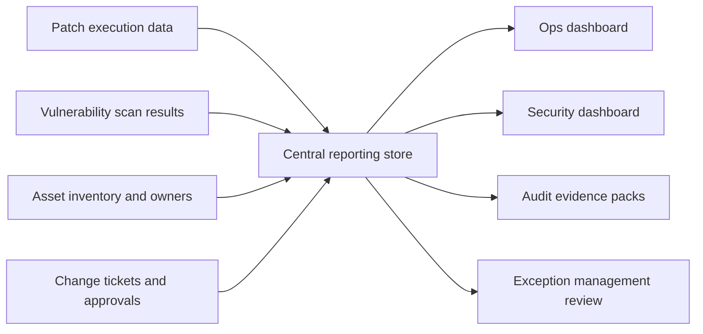
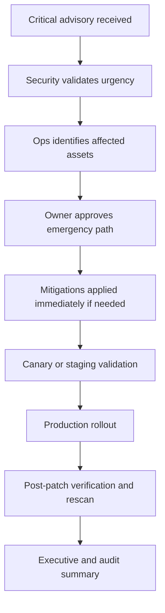

# Linux Patching, Vulnerability Management, CVE, CVSS, and CIS Benchmarks

> **📌 Disclaimer**: Any third-party logos, screenshots, or diagrams referenced in this document are used for educational purposes only. All trademarks belong to their respective owners.


CVE (Common Vulnerabilities and Exposures), CVSS (Common Vulnerability Scoring System), CIS (Center for Internet Security), NIST (National Institute of Standards and Technology), and NVD (National Vulnerability Database) are the main vulnerability-management abbreviations used throughout this guide.

A comprehensive operations guide for patching Linux systems, managing vulnerabilities, interpreting CVEs and CVSS scores, applying CIS Benchmarks, and building repeatable compliance reporting workflows.

---

## 🧭 Guide Objectives

- Explain patching fundamentals in operations-friendly language.
- Provide distro-specific patching steps for RHEL, Ubuntu, Debian, and SUSE.
- Show how to scale patching across fleets with Ansible and Red Hat Satellite.
- Connect patching activity to vulnerability management, CVE analysis, CVSS prioritization, and CIS compliance.
- Offer practical runbooks, checklists, diagrams, and audit-focused reporting examples.

## 📚 Table of Contents

1. Linux Patching Fundamentals
2. Single VM Patching
3. Multi-VM Patching with Ansible
4. Centralized Repository with Red Hat Satellite
5. Vulnerability Management
6. CVE (Common Vulnerabilities and Exposures)
7. CVSS (Common Vulnerability Scoring System)
8. CIS Benchmarks
9. Patch Compliance and Reporting
10. Appendix A: Command Quick Reference
11. Appendix B: Operational Checklists and Templates
12. Appendix C: Real-World Patching Scenarios
13. Appendix D: Troubleshooting FAQ
14. Appendix E: Glossary
15. Appendix F: Patching Cadence and SLA Matrix

## 🩹 1. Linux Patching Fundamentals

Linux patching is the controlled process of updating installed software, libraries, kernels, and configuration-dependent platform components to reduce risk and improve system stability.

### 🔍 What is patching and why it matters

- Patching closes known security weaknesses before attackers exploit them.
- Patching fixes functional defects that cause crashes, data corruption, or unpredictable performance.
- Patching delivers vendor-supported enhancements, hardware support, and compatibility updates.
- Patching keeps platforms aligned with support contracts, compliance obligations, and internal hardening baselines.
- Patching reduces operational drift by bringing systems back to a known supported state.

When teams delay patching, they are effectively choosing to accept risk. That risk may show up as ransomware, a failed audit, unsupported software during a critical outage, or application instability caused by running packages that are years behind vendor recommendations.

### 🧱 Types of patches

| Patch type | Primary purpose | Typical trigger | Examples | Operations note |
|---|---|---|---|---|
| Security patch | Reduce exploitability | Vendor releases advisory or errata | OpenSSL fix, sudo privilege escalation fix, kernel privilege escalation fix | Prioritize by exposure, exploitability, and business impact |
| Bugfix patch | Resolve defects or stability issues | Application crash, memory leak, service malfunction | systemd fix, glibc crash fix, filesystem corruption fix | Validate business apps because bugfixes can change behavior |
| Enhancement patch | Add capabilities or improve compatibility | Feature update, hardware enablement, new API behavior | new storage driver, improved network stack, updated package manager features | Treat as planned change; avoid bundling with emergency security windows |
| Hotfix | Targeted rapid correction | Critical incident or severe outage | single package replacement or one-off vendor advisory | Document exceptions and standardize later |
| Kernel patch | Update the core OS | Security advisory, hardware bug, scheduler fix | kernel, kernel-core, kernel-modules | May require reboot unless live patching is in place |
| Firmware or microcode update | Address hardware-level issues | Vendor bulletin, CPU microcode update | BIOS, BMC, microcode_ctl | Coordinate with hardware teams and maintenance windows |

### 🔄 Patch management lifecycle

```mermaid
flowchart LR
    A[Identify assets and owners] --> B[Monitor advisories and repositories]
    B --> C[Assess risk and business impact]
    C --> D[Test in dev or staging]
    D --> E[Approve change and schedule window]
    E --> F[Take backup or snapshot]
    F --> G[Deploy patch]
    G --> H[Reboot if required]
    H --> I[Validate service health]
    I --> J[Report compliance and exceptions]
    J --> K[Feed lessons into next cycle]
```



A mature lifecycle treats patching as a business process, not a single command. The command is only the execution step. Everything around it determines whether the patch activity is safe, auditable, and repeatable.

### 🧠 Patching best practices

- Maintain an accurate asset inventory with owner, environment, application tier, and maintenance group.
- Classify systems by criticality so patch urgency aligns with business risk.
- Separate emergency security patching from routine monthly maintenance to avoid process confusion.
- Test representative workloads in non-production before broad rollout.
- Use snapshots or backups where rollback is otherwise difficult.
- Document pre-checks, expected service restarts, reboot requirements, and validation steps.
- Apply patches in waves instead of updating every server simultaneously.
- Track exceptions with approved expiry dates rather than allowing open-ended deferrals.
- Record the exact packages updated and the validation evidence gathered afterward.
- Integrate patching with vulnerability scanning so remediation can be measured.

### 📅 Maintenance windows and change management

A maintenance window is the approved time block in which changes can be applied with minimized business disruption. Effective patching depends on good change management because even safe updates can restart services, change dependencies, or require reboots.

| Change element | Questions to answer | Example |
|---|---|---|
| Scope | Which hosts, environments, and services are included? | 12 RHEL web servers in production DMZ |
| Risk | What breaks if patching fails? | Customer portal outage or failed TLS handshake |
| Backout plan | How do we revert? | snapshot revert, package downgrade, boot previous kernel |
| Validation | How do we prove success? | health checks, login test, transaction test, monitoring green |
| Communication | Who needs notice? | application owner, service desk, NOC, security team |
| Approval | Who authorizes the change? | CAB, service owner, emergency approver |
| Timing | When can downtime occur? | Sunday 02:00-04:00 UTC |
| Evidence | What records must be retained? | ticket number, patch list, screenshots, console output |

### 🪟 Sample maintenance window workflow

1. Create or update the change ticket with impacted systems, patch set, rollback plan, and validation checklist.
2. Notify stakeholders and confirm application-level blackout requirements.
3. Freeze unrelated changes on the same systems to reduce troubleshooting noise.
4. Perform pre-checks: backups, snapshots, free space, repo reachability, current kernel, cluster health.
5. Apply patches in a low-risk canary system or staging first.
6. Execute production patching according to the approved order.
7. Reboot only where required or approved.
8. Run post-checks, verify monitoring, and obtain application owner confirmation.
9. Close the change with evidence and document any exceptions or follow-up actions.

### ⚠️ Common patching mistakes to avoid

- Patching without confirming backups or snapshots on systems with poor rollback options.
- Running full upgrades in production without reviewing available updates first.
- Ignoring service dependency changes such as database drivers, Python libraries, or Java runtime requirements.
- Updating clustered systems all at once and causing total service outage.
- Assuming a patch is complete without reboot verification or application health testing.
- Letting security exceptions accumulate without risk acceptance or remediation deadlines.
- Confusing package installation success with business validation success.

### 🌍 Real-world patching philosophy

In practice, patching is a balance among security urgency, service availability, and testing confidence. A public-facing bastion host with an actively exploited OpenSSH flaw should be patched faster than an isolated internal batch server with a moderate local-only issue. A database cluster may need a carefully staged rolling plan, while disposable autoscaled nodes should ideally be remediated through updated images rather than in-place patching.

## 🖥️ 2. Single VM Patching

Single VM patching is the foundation for all larger patch programs. If the team cannot patch one system safely and repeatably, automation at fleet scale will amplify mistakes rather than solve them.

### ✅ Pre-patch checklist

- Confirm change approval or emergency authorization.
- Verify recent backup, snapshot, or recovery point.
- Check available disk space in `/`, `/var`, `/boot`, and package cache locations.
- Verify repository access and DNS resolution.
- Capture current package versions and running kernel.
- Review application dependencies and maintenance instructions.
- Confirm console access in case network services fail after reboot.
- Identify whether the patch set requires service restarts or a reboot.
- Notify affected stakeholders if the host is customer-facing or business-critical.
- Ensure monitoring is in place so regressions are visible immediately.

```bash
# Basic pre-check snapshot
hostnamectl
uname -r
df -h
free -m
uptime
ip addr show
systemctl --failed
```

### 🗺️ Single VM patch workflow



### 🟥 RHEL and CentOS patching

RHEL 8/9 and modern CentOS Stream systems typically use `dnf`, while older RHEL/CentOS versions use `yum`. The operational concepts are the same: refresh metadata, review updates, apply selected packages or advisory-driven updates, then validate.

#### 📦 Checking available updates on RHEL-family systems

```bash
# Refresh metadata and list updates
sudo dnf check-update || true

# View summary of available errata and advisories
sudo dnf updateinfo summary

# List security advisories
sudo dnf updateinfo list security

# Show package details for a specific advisory or CVE
sudo dnf updateinfo info --advisory RHSA-2024:1234
sudo dnf updateinfo info --cves CVE-2024-12345
```

On older releases using `yum`, the equivalent commands are similar:
```bash
sudo yum check-update || true
sudo yum updateinfo summary
sudo yum updateinfo list security all
sudo yum updateinfo info all
```

#### 🔐 Applying security-only updates on RHEL-family systems

```bash
# Apply only security-related updates
sudo dnf upgrade --security -y

# Apply a specific advisory
sudo dnf upgrade --advisory=RHSA-2024:1234 -y

# Update a specific package only
sudo dnf upgrade openssl -y
```

For systems where `yum-plugin-security` is available:
```bash
sudo yum update --security -y
sudo yum update-minimal --security -y
```

#### 🧪 Reviewing transaction history and reboot requirements

```bash
# Show prior transactions
sudo dnf history list
sudo dnf history info last

# Check whether reboot is recommended
sudo dnf install -y dnf-utils || true
sudo needs-restarting -r

# See which services or processes need restart
sudo needs-restarting
```

If `needs-restarting -r` returns non-zero or explicitly states that a reboot is needed, schedule that reboot rather than assuming a service restart is enough.

#### 🧯 RHEL-family rollback examples

```bash
# Undo the last DNF transaction
sudo dnf history undo last -y

# Undo a specific transaction ID
sudo dnf history undo 145 -y

# Install a previous package version if required
sudo dnf downgrade openssl -y

# Boot the previous kernel from GRUB if the latest kernel fails
sudo grubby --info=ALL | grep '^index\|^kernel'
```

Rollback is safer when a snapshot or VM checkpoint exists. Package-manager rollback is useful, but complex transactions can be difficult to reverse cleanly if dependencies changed.

### �� Ubuntu and Debian patching

Ubuntu and Debian use `apt` family tools. The standard pattern is `apt update` to refresh metadata, followed by `apt upgrade` or `apt full-upgrade` depending on policy. Many environments also enable `unattended-upgrades` for security patches.

#### 📦 Checking available updates on Ubuntu and Debian

```bash
# Refresh package metadata
sudo apt update

# List upgradable packages
apt list --upgradable

# Simulate upgrade without making changes
sudo apt upgrade --simulate

# View package policy and candidate version
apt-cache policy openssl
apt-cache policy linux-image-generic
```

#### 🔐 Applying patches on Ubuntu and Debian

```bash
# Apply regular package upgrades
sudo apt upgrade -y

# Apply distribution-aware upgrades when dependencies must change
sudo apt full-upgrade -y

# Remove obsolete packages after validation
sudo apt autoremove -y
```

For security automation, enable `unattended-upgrades`:
```bash
sudo apt install -y unattended-upgrades apt-listchanges
sudo dpkg-reconfigure --priority=low unattended-upgrades

# Dry run
sudo unattended-upgrade --dry-run --debug

# Manual execution
sudo unattended-upgrade --debug
```

#### 🔍 Reboot and validation checks on Ubuntu and Debian

```bash
# Reboot-required indicator
cat /var/run/reboot-required || true
ls -l /var/run/reboot-required* || true

# Review package logs
sudo tail -100 /var/log/apt/history.log
sudo tail -100 /var/log/unattended-upgrades/unattended-upgrades.log
```

#### 🧯 Ubuntu and Debian rollback examples

```bash
# Install a previous package version if available in repositories
apt-cache madison openssl
sudo apt install openssl=3.0.2-0ubuntu1.16

# Hold a package to prevent immediate re-upgrade
sudo apt-mark hold openssl

# Remove package hold later
sudo apt-mark unhold openssl
```

True rollback is often easiest through VM snapshot recovery or image replacement. `apt` can install a prior version if the package is still available, but repository retention policies matter.

### 🟩 SUSE patching with zypper

SUSE Linux Enterprise Server commonly uses `zypper`, which distinguishes between updates and patches. In enterprise operations, `zypper patch` is often used to apply recommended and security patches according to repository metadata.

#### 📦 Checking updates on SUSE

```bash
# Refresh repositories
sudo zypper refresh

# List available updates
sudo zypper list-updates

# List available patches
sudo zypper list-patches

# Show only security patches
sudo zypper list-patches --category security
```

#### 🔐 Applying patches on SUSE

```bash
# Apply all relevant patches
sudo zypper patch -y

# Apply security-only patches
sudo zypper patch --category security -y

# Update all packages if policy allows
sudo zypper update -y
```

#### 🧯 SUSE rollback examples

```bash
# Review history
sudo zypper history

# Use Snapper on Btrfs-based systems
sudo snapper list
sudo snapper status
sudo snapper rollback <snapshot-number>

# Reboot after rollback if required
sudo reboot
```

### 🧾 Pre-patch data capture examples

```bash
# Service and process health
systemctl --failed
ps -ef | head
ss -tulpn

# Package baselines
rpm -qa | sort > /root/rpm-before.txt    # RHEL/SUSE family
# dpkg-query -W -f='${Package}	${Version}
' > /root/dpkg-before.txt  # Debian/Ubuntu

# Kernel and boot entries
uname -r
sudo grubby --default-kernel 2>/dev/null || true
```

Storing before-and-after evidence helps with troubleshooting and audits. Even simple outputs such as running kernel, failed services, and patch transaction logs are useful when something breaks later.

### 🔎 Post-patch verification

- Confirm package manager completed without dependency or scriptlet errors.
- Verify whether a reboot is required and perform it if approved.
- Check the running kernel after reboot with `uname -r`.
- Confirm target services are active and enabled.
- Review system logs for package post-install failures or service startup errors.
- Validate application transactions, API health checks, UI login, or cluster membership.
- Confirm monitoring, backups, and agents are functioning after patching.

```bash
# Generic post-checks
uname -r
uptime
systemctl --failed
journalctl -p err -b --no-pager | tail -100
curl -k https://localhost/health || true
```

### 🧬 Kernel patching and live patching with kpatch

Kernel updates often require a reboot because the running kernel image must be replaced. Live patching solutions like `kpatch` reduce downtime for selected critical fixes by patching a running kernel in memory. Live patching does not replace routine maintenance forever; it buys time and reduces emergency reboot pressure.

```bash
# Install kpatch on supported RHEL systems
sudo subscription-manager repos --enable=rhel-8-for-x86_64-baseos-rpms
sudo dnf install -y kpatch kpatch-dnf

# Enable the service
sudo systemctl enable --now kpatch.service

# List applied live patches
kpatch list

# Show running kernel
uname -r
```

Live patching caveats:
- It covers only specific kernel vulnerabilities for supported kernels.
- It does not replace full kernel maintenance across long time horizons.
- You still need scheduled reboots to align with supported kernel baselines.
- Validate vendor support statements before making live patching a core policy.

### ↩️ Rollback procedures and decision points

Rollback should be deliberate. Not every failed validation means immediate package downgrade. First determine whether the issue is application configuration, dependency drift, delayed service restart, or a genuine patch regression.

1. Stop the rollout after the first sign of repeated failure.
2. Capture logs, transaction IDs, and screenshots before changing anything else.
3. Decide whether the issue is isolated to one service, one package, or the entire host state.
4. If available, revert to snapshot or previous VM image for fastest recovery.
5. If snapshot recovery is not possible, use package-manager downgrade or boot the previous kernel.
6. Re-run post-checks to confirm rollback success.
7. Open a problem record so the failed patch can be retested and understood before the next window.

### 🧭 Example end-to-end single-host workflow

```bash
# RHEL example
sudo dnf check-update || true
sudo dnf updateinfo list security
sudo dnf upgrade --security -y
sudo needs-restarting -r || echo "Reboot recommended"
sudo reboot

# After reboot
uname -r
systemctl --failed
sudo journalctl -b --no-pager | tail -50
```

```bash
# Ubuntu example
sudo apt update
apt list --upgradable
sudo apt upgrade -y
[ -f /var/run/reboot-required ] && echo "Reboot required"
sudo reboot

# After reboot
uname -r
systemctl --failed
sudo journalctl -b --no-pager | tail -50
```

## 🤖 3. Multi-VM Patching with Ansible

Ansible makes patching consistent across fleets by centralizing inventory, variables, validation logic, and execution order. It is particularly effective when combined with host grouping, maintenance windows, and post-patch evidence collection.

### 📦 Inventory design for patch management

```ini
[prod_rhel_web]
web01 ansible_host=10.10.10.11
web02 ansible_host=10.10.10.12
web03 ansible_host=10.10.10.13

[prod_rhel_db]
db01 ansible_host=10.10.20.11
db02 ansible_host=10.10.20.12

[prod_ubuntu_app]
app01 ansible_host=10.10.30.11
app02 ansible_host=10.10.30.12

[rhel:children]
prod_rhel_web
prod_rhel_db

[ubuntu:children]
prod_ubuntu_app

[linux:children]
rhel
ubuntu
```

Useful inventory variables for patching include:
```yaml
# group_vars/all.yml
patch_window: monthly
patch_reboot_allowed: true
patch_security_only: false
patch_validation_url: https://localhost/health
patch_maintenance_contact: ops@example.com

# group_vars/rhel.yml
patch_pkg_mgr: dnf

# group_vars/ubuntu.yml
patch_pkg_mgr: apt
```

### 🧪 Playbook to check available updates

```yaml
---
- name: Check available updates
  hosts: linux
  become: true
  gather_facts: true
  tasks:
    - name: Refresh apt cache on Debian-family
      ansible.builtin.apt:
        update_cache: true
      when: ansible_facts.os_family == "Debian"

    - name: Check updates on RHEL-family
      ansible.builtin.command: dnf check-update
      register: dnf_check
      changed_when: false
      failed_when: dnf_check.rc not in [0, 100]
      when: ansible_facts.os_family == "RedHat"

    - name: Check updates on Debian-family
      ansible.builtin.command: apt list --upgradable
      register: apt_check
      changed_when: false
      when: ansible_facts.os_family == "Debian"

    - name: Check updates on SUSE-family
      ansible.builtin.command: zypper list-updates
      register: zypper_check
      changed_when: false
      when: ansible_facts.os_family == "Suse"

    - name: Print results
      ansible.builtin.debug:
        msg: >-
          {{ dnf_check.stdout | default(apt_check.stdout) | default(zypper_check.stdout) }}
```

### 🚀 Playbook to apply patches

```yaml
---
- name: Apply patches across Linux hosts
  hosts: linux
  become: true
  gather_facts: true
  tasks:
    - name: Patch RHEL-family systems
      ansible.builtin.dnf:
        name: "*"
        state: latest
        security: "{{ patch_security_only | bool }}"
        update_only: true
      when: ansible_facts.os_family == "RedHat"

    - name: Patch Debian-family systems
      ansible.builtin.apt:
        upgrade: dist
        update_cache: true
        autoremove: true
      when: ansible_facts.os_family == "Debian"

    - name: Patch SUSE-family systems
      community.general.zypper:
        name: '*'
        state: latest
        type: package
      when: ansible_facts.os_family == "Suse"
```

### 🔁 Playbook for rolling updates one server at a time

```yaml
---
- name: Rolling patch for web tier
  hosts: prod_rhel_web
  become: true
  serial: 1
  any_errors_fatal: true
  vars:
    load_balancer_api: https://lb01.example.com/api
  pre_tasks:
    - name: Disable node in load balancer
      ansible.builtin.uri:
        url: "{{ load_balancer_api }}/disable/{{ inventory_hostname }}"
        method: POST
        validate_certs: false
      delegate_to: localhost

    - name: Wait for connection drain
      ansible.builtin.pause:
        seconds: 30

  tasks:
    - name: Apply security updates
      ansible.builtin.dnf:
        name: "*"
        state: latest
        security: true
        update_only: true

    - name: Reboot if needed
      ansible.builtin.reboot:
        reboot_timeout: 1800
      when: ansible_facts.os_family == "RedHat"

    - name: Wait for HTTPS health endpoint
      ansible.builtin.uri:
        url: https://localhost/health
        method: GET
        validate_certs: false
      register: healthcheck
      until: healthcheck.status == 200
      retries: 20
      delay: 15

  post_tasks:
    - name: Re-enable node in load balancer
      ansible.builtin.uri:
        url: "{{ load_balancer_api }}/enable/{{ inventory_hostname }}"
        method: POST
        validate_certs: false
      delegate_to: localhost
```

### 🧰 Playbook for pre- and post-patch checks

```yaml
---
- name: Pre and post patch checks
  hosts: linux
  become: true
  gather_facts: true
  tasks:
    - name: Capture running kernel
      ansible.builtin.command: uname -r
      register: running_kernel
      changed_when: false

    - name: Check failed services
      ansible.builtin.command: systemctl --failed --no-legend
      register: failed_services
      changed_when: false
      failed_when: false

    - name: Check disk utilization
      ansible.builtin.command: df -h /
      register: root_df
      changed_when: false

    - name: Save report locally
      ansible.builtin.copy:
        dest: "/var/tmp/precheck-{{ inventory_hostname }}.txt"
        content: |
          host={{ inventory_hostname }}
          kernel={{ running_kernel.stdout }}
          failed_services={{ failed_services.stdout | default('none') }}
          root_df={{ root_df.stdout }}
```

For immutable evidence collection, many teams write results back to the controller using `delegate_to: localhost` and `copy` or `template` tasks that produce dated reports.

### 🔄 Playbook for reboot management

```yaml
---
- name: Reboot hosts only when required
  hosts: linux
  become: true
  gather_facts: false
  tasks:
    - name: Check reboot-required file on Debian-family
      ansible.builtin.stat:
        path: /var/run/reboot-required
      register: reboot_required_file
      when: ansible_os_family == "Debian"

    - name: Check reboot requirement on RHEL-family
      ansible.builtin.command: needs-restarting -r
      register: reboot_required_rhel
      changed_when: false
      failed_when: reboot_required_rhel.rc not in [0, 1]
      when: ansible_os_family == "RedHat"

    - name: Reboot Debian-family host
      ansible.builtin.reboot:
        reboot_timeout: 1800
      when:
        - ansible_os_family == "Debian"
        - reboot_required_file.stat.exists

    - name: Reboot RHEL-family host
      ansible.builtin.reboot:
        reboot_timeout: 1800
      when:
        - ansible_os_family == "RedHat"
        - reboot_required_rhel.rc == 1
```

### 🧩 Complete Ansible role structure for patching

```text
roles/
└── patching/
    ├── defaults/
    │   └── main.yml
    ├── vars/
    │   └── main.yml
    ├── tasks/
    │   ├── main.yml
    │   ├── precheck.yml
    │   ├── patch_rhel.yml
    │   ├── patch_debian.yml
    │   ├── patch_suse.yml
    │   ├── reboot.yml
    │   ├── postcheck.yml
    │   └── report.yml
    ├── handlers/
    │   └── main.yml
    ├── templates/
    │   └── patch-report.j2
    ├── files/
    └── README.md
```

```yaml
# roles/patching/tasks/main.yml
---
- name: Run prechecks
  ansible.builtin.include_tasks: precheck.yml

- name: Patch RHEL systems
  ansible.builtin.include_tasks: patch_rhel.yml
  when: ansible_facts.os_family == "RedHat"

- name: Patch Debian systems
  ansible.builtin.include_tasks: patch_debian.yml
  when: ansible_facts.os_family == "Debian"

- name: Patch SUSE systems
  ansible.builtin.include_tasks: patch_suse.yml
  when: ansible_facts.os_family == "Suse"

- name: Reboot when allowed
  ansible.builtin.include_tasks: reboot.yml
  when: patch_reboot_allowed | bool

- name: Run postchecks
  ansible.builtin.include_tasks: postcheck.yml

- name: Generate patch report
  ansible.builtin.include_tasks: report.yml
```

### 📅 Scheduling with ansible-pull or AWX/Tower

Scheduling turns patch automation into a repeatable service. The main design question is whether execution is controller-driven or node-driven.

| Option | Model | Best fit | Key note |
|---|---|---|---|
| AWX / Ansible Tower / Automation Controller | Central controller pushes jobs | Enterprise fleets with RBAC, approvals, inventory sync, reporting | Best for visibility and delegated operations |
| ansible-pull | Host pulls playbook from Git on schedule | Remote or intermittently connected sites | Requires strong Git hygiene and local credentials control |
| cron + ansible-playbook | Simple scheduled controller job | Small environments | Fast to start but limited in governance |
| CI/CD pipeline trigger | Job launched by pipeline or workflow | Image pipelines, GitOps workflows | Works well when patching is tied to infrastructure as code |

```bash
# Example ansible-pull cron entry
*/30 * * * * root ansible-pull -U https://git.example.com/ops/patching.git -C main site.yml -i localhost,
```

```yaml
# Example AWX survey inputs
patch_target_group: prod_rhel_web
patch_security_only: true
patch_reboot_allowed: true
change_ticket: CHG-2024-1042
maintenance_window: 2024-11-10T02:00Z
```

### 🧭 Ansible patch workflow



### 🛡️ Operational guidance for Ansible patching

- Use `serial` to preserve service availability on clustered or load-balanced workloads.
- Prefer explicit host groups rather than patching `all` in production.
- Separate “check available updates” playbooks from “apply updates” playbooks to support approvals.
- Record change ticket IDs and maintenance window IDs as variables so reports remain auditable.
- Store patch logs centrally and retain them according to audit policy.
- Treat reboots as first-class workflow steps, not an afterthought.

## 🛰️ 4. Centralized Repository with Red Hat Satellite

Red Hat Satellite is a lifecycle management platform for RHEL content, subscriptions, configuration, provisioning, and patch orchestration. It enables centralized control over what content systems see, when they see it, and how it moves from development to production.

### 🧭 What is Satellite? Architecture overview

- Satellite centrally manages RHEL repositories, content synchronization, host registration, patching, and reporting.
- Pulp handles content storage and synchronization.
- Katello extends content and subscription management capabilities.
- Candlepin manages subscriptions and entitlements.
- Capsules extend Satellite services to remote sites for scale and reduced WAN dependency.



### 🏗️ Satellite server setup and configuration

A full Satellite deployment includes installation, organization and location setup, manifest import, repository enablement, sync planning, content views, lifecycle environments, activation keys, and host registration procedures.

```bash
# Example high-level installation flow (exact steps vary by version)
sudo dnf module enable -y satellite:el8
sudo dnf install -y satellite
sudo satellite-installer --scenario satellite   --foreman-initial-organization "ExampleCorp"   --foreman-initial-location "PrimaryDC"   --foreman-initial-admin-username admin
```

```bash
# Hammer CLI examples
hammer organization list
hammer location list
hammer subscription upload --file ~/manifest.zip --organization "ExampleCorp"
hammer product list --organization "ExampleCorp"
```

### 📚 Content views and lifecycle environments

Content views let you define exactly which repositories, packages, errata, and versions are exposed to managed systems. Lifecycle environments represent promotion stages such as Library, Dev, Test, UAT, and Production.

```bash
# Create a lifecycle environment
hammer lifecycle-environment create   --name Dev   --organization "ExampleCorp"   --prior Library

# Create a content view
hammer content-view create   --name RHEL8-Base   --organization "ExampleCorp"

# Add a repository to the content view
hammer content-view add-repository   --name RHEL8-Base   --organization "ExampleCorp"   --repository "Red Hat Enterprise Linux 8 for x86_64 - BaseOS RPMs"

# Publish and promote
hammer content-view publish --name RHEL8-Base --organization "ExampleCorp"
hammer content-view version promote --content-view RHEL8-Base --to-lifecycle-environment Dev --organization "ExampleCorp"
```

Operationally, content views are what turn “all available vendor content” into “the approved content we expose to this environment.” That control is one of Satellite’s biggest strengths.

### 🧷 Registering clients to Satellite

```bash
# Install the Satellite CA consumer package from the Satellite server
sudo rpm -Uvh http://satellite.example.com/pub/katello-ca-consumer-latest.noarch.rpm

# Register the host using an activation key
sudo subscription-manager register   --org="ExampleCorp"   --activationkey="ak-rhel8-prod"

# Validate registration
sudo subscription-manager status
sudo subscription-manager identity
sudo dnf repolist
```

Good practice is to create activation keys per OS major version and environment. That keeps content access predictable and simplifies rebuild automation.

### 🔄 Content synchronization

```bash
# Sync a product repository
hammer repository synchronize   --name "Red Hat Enterprise Linux 8 for x86_64 - BaseOS RPMs"   --product "Red Hat Enterprise Linux for x86_64"   --organization "ExampleCorp"

# View repository sync status
hammer repository list --organization "ExampleCorp"
```

Synchronization strategy matters. Some teams sync continuously, others daily, and others only before monthly patch windows. The best choice depends on risk tolerance, bandwidth, and governance requirements.

### 📣 Errata management

Errata in Satellite map vendor advisories such as security advisories (RHSA), bugfix advisories (RHBA), and enhancement advisories (RHEA). This allows targeted remediation and reporting.

```bash
# Search errata
hammer erratum list --organization "ExampleCorp" --search "type = security"

# List applicable errata for a host
hammer host errata list --host web01.example.com

# Install errata on a host
hammer host errata apply   --host web01.example.com   --errata-ids RHSA-2024:1234,RHSA-2024:5678
```

### 🛠️ Patching through Satellite

1. Sync required repositories from Red Hat CDN or custom upstream sources.
2. Publish a content view version that contains approved package states and errata.
3. Promote the content view through Dev, Test, and Production environments.
4. Register hosts with activation keys tied to the correct lifecycle environment.
5. Use remote execution or integrated Ansible to apply updates or errata.
6. Review host-level compliance and outstanding errata reports.

```bash
# Example remote execution or host collection actions often complement Satellite workflows
hammer host list --organization "ExampleCorp" --search "content_view = RHEL8-Base"
hammer job-template list
```

### 📊 Reporting and compliance in Satellite

- Applicable errata reports show what each host still needs.
- Host collections help target patch campaigns by business service or environment.
- Lifecycle environment reports prove that production sees only promoted content.
- Subscription and repository reporting show whether systems are registered and receiving approved content.
- Satellite API and Hammer CLI output can be exported into dashboards or SIEM workflows.

### ⚖️ Satellite vs Foreman vs Spacewalk

| Platform | Status | Primary focus | Strengths | Considerations |
|---|---|---|---|---|
| Red Hat Satellite | Current commercial platform | Enterprise RHEL lifecycle and content management | Vendor support, deep RHEL integration, content views, capsules, errata, subscriptions | Licensing cost and operational complexity |
| Foreman + Katello | Open source upstream ecosystem | Lifecycle management for heterogeneous environments | Flexible, community-driven, strong provisioning features | Requires more self-support and integration effort |
| Spacewalk | Legacy / historical | Older package and system management platform | Important ancestor in the ecosystem | Superseded by newer platforms and not suitable for modern strategy |

### 🏢 Satellite architecture diagram



## 🛡️ 5. Vulnerability Management

A vulnerability is a weakness in software, configuration, architecture, or operational process that could be exploited to compromise confidentiality, integrity, or availability.

### 🔎 What is a vulnerability?

- A coding defect such as a buffer overflow or improper input validation.
- A weak configuration such as world-writable sensitive files or exposed administrative ports.
- A missing patch that leaves a known CVE exploitable.
- A design issue such as overly broad trust relationships or lack of network segmentation.
- A dependency problem such as a vulnerable library in a package or container image.

Vulnerability management is broader than patching. Some vulnerabilities are fixed by updating packages. Others require configuration changes, compensating controls, network restrictions, or architectural redesign.

### 🧰 Vulnerability scanning tools

| Tool | Category | Strengths | Typical Linux usage |
|---|---|---|---|
| OpenSCAP | Open source compliance and vulnerability scanning | Strong for SCAP content, XCCDF, OVAL, CIS-like policy checks | Local or remote host scans against OVAL and compliance profiles |
| Nessus | Commercial vulnerability scanner | Broad plugin coverage, network and agent-based options | Enterprise host and service vulnerability detection |
| Qualys | Cloud vulnerability management platform | Large-scale asset inventory, agent telemetry, compliance integration | Continuous scanning and risk dashboards |
| Trivy | Open source scanner | Fast scanning for containers, filesystems, IaC, and SBOMs | Useful for Linux hosts, images, and CI pipelines |

### 🔍 Scanning Linux systems for vulnerabilities

Scanning should be authenticated where possible because authenticated scans produce better package-level visibility. Unauthenticated network scans still matter, but they often miss package-state nuance or generate more false positives.

```bash
# OpenSCAP OVAL evaluation example
oscap oval eval   --results /root/oval-results.xml   --report /root/oval-report.html   /usr/share/xml/scap/ssg/content/ssg-rhel8-oval.xml
```

```bash
# OpenSCAP compliance evaluation example
oscap xccdf eval   --profile xccdf_org.ssgproject.content_profile_standard   --results /root/ssg-results.xml   --report /root/ssg-report.html   /usr/share/xml/scap/ssg/content/ssg-rhel8-ds.xml
```

```bash
# Trivy filesystem scan example
trivy fs --scanners vuln,misconfig --severity HIGH,CRITICAL /
```

```bash
# Example Qualys Cloud Agent service checks after deployment
sudo systemctl status qualys-cloud-agent
sudo /usr/local/qualys/cloud-agent/bin/qualys-cloud-agent.sh ActivationId=<ID> CustomerId=<CID>
```

For Nessus or Qualys, exact commands depend on whether you deploy an agent, use authenticated network scans, or integrate with a central manager. The important operational point is to keep credentials, agent status, and scan windows well controlled.

### 🧭 Vulnerability management lifecycle



### 🛠️ Remediation workflows

1. Validate the finding: confirm the package, version, service, and host are real and in scope.
2. Determine exploitability: internet-facing service, local-only flaw, authenticated requirement, or compensating control present.
3. Prioritize using CVSS, threat intelligence, active exploitation data, and asset criticality.
4. Choose remediation method: patch, configuration change, package removal, firewall restriction, or temporary mitigation.
5. Schedule work under standard or emergency change processes.
6. Apply remediation and collect evidence.
7. Rescan to confirm closure and document exceptions for unresolved findings.

### �� Practical prioritization model

| Risk signal | Questions to ask | Typical response |
|---|---|---|
| CVSS | Is the score high or critical? | Use as a baseline, not the only factor |
| Exposure | Is the service internet-facing or reachable from untrusted networks? | Escalate faster if yes |
| Exploit activity | Is there known active exploitation or public weaponized code? | Consider emergency patching |
| Asset criticality | Is the host part of revenue, identity, or regulated workflow? | Shorten remediation SLA |
| Compensating controls | Do WAF, firewall, SELinux, segmentation, or service disablement reduce exposure? | May justify temporary exception |
| Operational risk | Could the patch itself disrupt a critical service? | Test more carefully, use staged rollout |

## 🆔 6. CVE (Common Vulnerabilities and Exposures)

CVE is a public naming system for known cybersecurity vulnerabilities. A CVE entry provides a common identifier so vendors, scanners, advisories, and defenders can refer to the same issue consistently.

### 📘 What is CVE?

- Managed by the CVE Program with MITRE as a central coordinator.
- Assigns identifiers to publicly known vulnerabilities.
- Does not itself patch systems or score risk; it names and tracks the issue.
- Allows correlation across vendor advisories, NVD enrichments, scanner plugins, and internal tickets.

### 🔤 CVE ID format and structure

A CVE identifier follows the pattern `CVE-YYYY-NNNN...`.

| Part | Meaning | Example |
|---|---|---|
| CVE | Common Vulnerabilities and Exposures prefix | CVE |
| YYYY | Year of assignment or publication context | 2024 |
| NNNN... | Sequence number with variable length | 12345 |

```text
CVE-2024-12345
|   |    |
|   |    +-- Unique sequence number
|   +------- Year component
+----------- Identifier prefix
```

### 🔎 How to search CVEs

- MITRE CVE website for the canonical identifier record.
- NVD (National Vulnerability Database) for CVSS, CPE, references, and enrichment.
- Vendor advisories such as Red Hat, Ubuntu, SUSE, Oracle, Debian, or upstream project bulletins.
- Scanner platforms like Nessus and Qualys that map findings to CVEs.
- Package-manager advisory tools that expose applicable CVEs for installed packages.

```bash
# Example manual research flow
xdg-open https://cve.mitre.org/
xdg-open https://nvd.nist.gov/
```

### 🧪 How to check if your system is affected

1. Identify the vulnerable software package, version range, and conditions that make the CVE exploitable.
2. Check whether the package is installed on the host.
3. Verify the installed version and compare it to vendor-fixed versions.
4. Read vendor advisories carefully because backported fixes may not change upstream version numbers in obvious ways.
5. Confirm whether the vulnerable feature is enabled or exposed in your environment.
6. Scan or test the system using approved tools if additional validation is required.

Backporting is important on enterprise Linux. A package version may look older than upstream but still contain the security fix because the vendor patched the older package release.

### 🌍 CVE examples and real-world impact

| CVE | Component | Why it mattered | Operational lesson |
|---|---|---|---|
| CVE-2014-0160 | OpenSSL (Heartbleed) | Allowed memory disclosure from vulnerable TLS servers | Internet-facing crypto flaws require urgent certificate and key review |
| CVE-2016-5195 | Linux kernel (Dirty COW) | Local privilege escalation via race condition | Even local-only flaws matter on multi-user or compromised hosts |
| CVE-2021-3156 | sudo (Baron Samedit) | Privilege escalation through heap-based overflow | Core admin utilities must be patched quickly |
| CVE-2021-44228 | Log4j (Log4Shell) | Remote code execution in logging library | Dependencies hidden inside apps require asset and SBOM awareness |

### �� Commands to check CVEs on RHEL-family systems

```bash
# List known security advisories and CVEs relevant to available updates
sudo dnf updateinfo list cves
sudo dnf updateinfo info --cves CVE-2024-12345

# Query package changelog for CVE references
rpm -q --changelog openssl | grep -i CVE | tail -20

# Show installed version
rpm -q openssl sudo kernel

# Review Red Hat advisory applicability when subscribed
sudo yum updateinfo list cves all
```

### 🟧 Commands to check CVEs on Ubuntu and Debian

```bash
# Show installed package version
dpkg -l | egrep 'openssl|sudo|linux-image'
apt-cache policy openssl sudo

# Ubuntu Pro security status if available
sudo pro security-status
sudo ubuntu-security-status

# Review changelog for security references
apt changelog openssl | grep -i CVE

# Search package metadata
apt list --upgradable | grep -i openssl
```

On Ubuntu, vendor tools such as `pro fix CVE-YYYY-NNNN` may be available depending on subscription and release. Always validate what repositories and entitlements are active before relying on automation.

### 🧠 CVE triage tips

- Do not assume every CVE applies to your environment just because the package exists.
- Do not dismiss a CVE just because exploitation seems “local only”; lateral movement often starts from local footholds.
- Use vendor advisories as the source of truth for fixed package builds on enterprise distributions.
- Track exposure state: not affected, affected, mitigated, patched, exception approved.

## 📊 7. CVSS (Common Vulnerability Scoring System)

CVSS is a standardized framework for describing the severity of vulnerabilities. It helps teams estimate technical impact and exploitability, but it is not a complete business-risk model by itself.

### 📘 What is CVSS?

- Developed by the Forum of Incident Response and Security Teams (FIRST).
- Provides a numerical score from 0.0 to 10.0.
- Expresses severity through a vector string and derived score.
- Includes Base, Temporal, and Environmental metrics.

### 🧩 CVSS v3.1 scoring breakdown

| Metric group | What it represents | Examples |
|---|---|---|
| Base metrics | Intrinsic technical severity | Attack Vector, Privileges Required, Confidentiality impact |
| Temporal metrics | Factors that change over time | Exploit code maturity, remediation level, report confidence |
| Environmental metrics | Context inside your environment | Modified metrics, security requirements, asset-specific impact |

### 🧮 Base metrics reference table

| Metric | Abbrev | Common values | Meaning |
|---|---|---|---|
| Attack Vector | AV | N, A, L, P | How remotely or locally the vulnerability can be exploited |
| Attack Complexity | AC | L, H | Conditions beyond attacker control needed for exploit |
| Privileges Required | PR | N, L, H | Level of privileges needed before exploitation |
| User Interaction | UI | N, R | Whether another user must participate |
| Scope | S | U, C | Whether exploitation impacts only the vulnerable component or crosses boundaries |
| Confidentiality | C | N, L, H | Impact on data secrecy |
| Integrity | I | N, L, H | Impact on trustworthiness or correctness of data |
| Availability | A | N, L, H | Impact on service availability |

### ⏱️ Temporal and environmental metrics

| Metric | Abbrev | Purpose |
|---|---|---|
| Exploit Code Maturity | E | Reflects how available and reliable exploit code is |
| Remediation Level | RL | Accounts for fix availability such as official patch or workaround |
| Report Confidence | RC | Represents certainty of the vulnerability report |
| Confidentiality Requirement | CR | Importance of confidentiality in your environment |
| Integrity Requirement | IR | Importance of integrity in your environment |
| Availability Requirement | AR | Importance of availability in your environment |
| Modified metrics | MAV, MAC, MPR, MUI, MS, MC, MI, MA | Environmental overrides for local conditions |

### 🚦 CVSS score ranges and severity levels

| Score range | Severity | Typical response expectation |
|---|---|---|
| 0.0 | None | No action required |
| 0.1 - 3.9 | Low | Remediate in routine cycle |
| 4.0 - 6.9 | Medium | Remediate on scheduled basis with normal prioritization |
| 7.0 - 8.9 | High | Accelerate remediation, especially on exposed systems |
| 9.0 - 10.0 | Critical | Emergency review, rapid containment or patching likely required |

### 🧠 How to interpret CVSS scores correctly

- A high CVSS on an isolated offline lab host is usually less urgent than the same CVE on an internet-facing production gateway.
- A medium CVSS can still become urgent if active exploitation is observed in the wild.
- Environmental metrics matter for regulated systems, identity services, payment systems, and life-safety workloads.
- Use CVSS as a starting point for prioritization, not as the only decision rule.

### 🧾 Example CVSS vector interpretation

```text
CVSS:3.1/AV:N/AC:L/PR:N/UI:N/S:U/C:H/I:H/A:H

Interpretation:
- Network exploitable
- Low complexity
- No prior privileges required
- No user interaction required
- High impact to confidentiality, integrity, and availability
- Usually a very urgent finding on exposed systems
```

### 🧮 Using a CVSS calculator

1. Open a trusted CVSS v3.1 calculator such as the FIRST calculator or NVD interface.
2. Select each metric according to the vulnerability advisory details.
3. Review the vector string and resulting score.
4. Apply environmental adjustments for your asset if the calculator supports them.
5. Document the rationale in your ticket so prioritization is explainable later.

### 🗺️ CVSS scoring diagram



## 📐 8. CIS Benchmarks

CIS Benchmarks are consensus-based security configuration recommendations produced by the Center for Internet Security. They provide structured hardening guidance for operating systems, cloud platforms, network devices, databases, and more.

### 🏛️ What is CIS?

- CIS stands for Center for Internet Security.
- It publishes benchmarks, controls, and assessment tooling.
- Its guidance is widely used for baseline hardening and audit evidence.
- Benchmarks are implementation-oriented, mapping security principles into concrete settings.

### 🧱 CIS Benchmark structure

A benchmark is usually organized into recommendation sections such as filesystem configuration, services, network settings, logging, access control, auditing, and kernel parameters. Each recommendation includes rationale, audit steps, remediation instructions, and often impacts or exceptions to consider.

| Benchmark element | What it contains |
|---|---|
| Recommendation ID | A numbered control such as 1.1.1.1 |
| Title | Short description of the control |
| Profile level | Usually Level 1 or Level 2 |
| Rationale | Why the setting matters |
| Audit | How to verify compliance |
| Remediation | How to configure the control |
| Impact | Potential operational side effects |
| References | Links to standards or technical sources |

### 🎚️ CIS levels: Level 1 and Level 2

| Level | Intent | Typical use |
|---|---|---|
| Level 1 | Practical security with minimal impact | Broad baseline for most servers |
| Level 2 | Defense-in-depth with stronger restrictions | High-security environments after careful testing |

Level 2 is not “better by default.” It is stricter, but it may also affect usability or application compatibility. Always test before broad rollout.

### 🐧 How to apply CIS Benchmarks on Linux

1. Select the correct benchmark for your distro and version.
2. Decide whether Level 1 or Level 2 is appropriate for each environment.
3. Assess current compliance using CIS-CAT, OpenSCAP, or a vetted hardening role.
4. Review findings with system owners because some controls affect application behavior.
5. Apply remediations in a controlled order with rollback options.
6. Reassess and document any accepted exceptions.

### 🧪 CIS-CAT tool usage

```bash
# Example conceptual CIS-CAT execution (exact syntax depends on version and licensing)
./CIS-CAT.sh Assessor -benchmark /path/to/benchmark.xml -profile level1_server -html
```

CIS-CAT is commonly used to generate benchmark assessment reports. It is particularly useful when audit teams want a recognizable CIS-branded assessment output.

### 🛠️ OpenSCAP with CIS profiles

```bash
# List available profiles in a SCAP content data stream
oscap info /usr/share/xml/scap/ssg/content/ssg-rhel8-ds.xml

# Evaluate a CIS-like profile if available in content
oscap xccdf eval   --profile xccdf_org.ssgproject.content_profile_cis   --results /root/cis-results.xml   --report /root/cis-report.html   /usr/share/xml/scap/ssg/content/ssg-rhel8-ds.xml
```

Profile names vary by distribution content. Always inspect `oscap info` output on the actual host or content package to confirm the available profile identifiers.

### 🤖 Automated CIS hardening scripts and roles

Automation accelerates CIS adoption, but it also increases the chance of broad-impact mistakes if controls are applied blindly. Good practice is to use profiles, variables, and exceptions rather than one-size-fits-all hardening.

```yaml
# Example concept using an Ansible hardening role
- name: Apply CIS baseline
  hosts: rhel
  become: true
  roles:
    - role: rhel8_cis
      vars:
        cis_level: 1
        cis_rule_1_1_1_1: true
        cis_rule_3_3_5: false   # example exception
```

### 📋 CIS benchmark sections overview

| Section family | Examples of controls | Operational notes |
|---|---|---|
| Filesystem | Separate partitions, mount options, permissions | Can impact legacy application paths and package install behavior |
| Services | Disable unnecessary daemons | Confirm application dependencies first |
| Network | Kernel networking parameters, firewall defaults | Coordinate with network and application teams |
| Logging and auditing | rsyslog, journald, auditd settings | Retain logs according to policy and storage capacity |
| Access control | Password policy, sudo, SSH settings | Strongly affects admin workflows |
| Kernel hardening | sysctl values, module blacklisting | May impact hardware enablement and troubleshooting |
| File permissions | Sensitive file ownership and modes | Validate service accounts and automation tools |
| Authentication | PAM, lockout, MFA-related settings | Test with directory services and emergency accounts |

### 🔄 Compliance workflow diagram



### ⚠️ Practical CIS guidance

- Do not apply all Level 2 controls to production blindly.
- Separate baseline hardening from break-glass procedures so emergency access remains possible.
- Document exceptions with strong rationale and review them periodically.
- Use hardening automation in lower environments first and promote it like application code.
- Combine benchmark compliance with vulnerability management rather than treating them as separate worlds.

## 📈 9. Patch Compliance and Reporting

Patch compliance reporting translates technical patch activity into evidence for operations leadership, security teams, and auditors. The goal is to answer three questions clearly: what is patched, what is not, and what risk remains.

### 🧾 Generating patch compliance reports

- Package-manager reports show installed versions, advisories, and transaction history.
- Ansible reports show execution success, changed hosts, failed hosts, and validation results.
- Satellite reports show applicable errata, content view alignment, and host registration status.
- Scanner reports show remaining CVEs and compliance gaps after remediation.
- SIEM dashboards correlate patch events with detections and incident patterns.

```bash
# RHEL examples
sudo dnf history list
sudo dnf updateinfo summary installed
rpm -qa --last | head -50

# Ubuntu examples
grep -E 'Start-Date|End-Date|Upgrade:' /var/log/apt/history.log | tail -50
apt list --installed | head -50
```

### 🔌 Integration with SIEM

| Integration point | Why it matters | Examples |
|---|---|---|
| Syslog or journald forwarding | Patch and reboot events become searchable in centralized logs | Splunk, Elastic, Graylog |
| Scanner exports | Open findings can be correlated with asset context | Qualys API, Nessus export, OpenSCAP reports |
| Automation job logs | Execution history supports incident review and audit trails | AWX job templates, CI pipeline logs |
| CMDB enrichment | Dashboards can group compliance by owner or service | host owner, environment, business unit |
| Ticketing linkage | Auditors can trace change approval to execution evidence | ServiceNow, Jira, Remedy |

### 🏛️ Audit requirements: SOC 2, PCI-DSS, and HIPAA

| Framework | Patch-related expectation | Typical evidence |
|---|---|---|
| SOC 2 | Changes are controlled, approved, and monitored | change tickets, patch reports, vulnerability closure evidence |
| PCI-DSS | Security patches are installed in a timely manner on in-scope systems | scan reports, patch cycle reports, exception approvals |
| HIPAA | Systems handling protected health information are protected against known risks | risk assessments, remediation records, access control validation |
| Internal policy | Organization-specific SLAs and maintenance procedures are followed | monthly dashboards, CAB approvals, exception registers |

Auditors usually care less about your favorite command and more about repeatability, evidence retention, exception handling, and management oversight.

### 📊 Dashboard setup

Useful dashboard metrics include:
- Patch compliance percentage by environment, OS family, and application tier.
- Outstanding critical and high vulnerabilities by age.
- Hosts missing required reboot after patching.
- Exception count with expiry date and owner.
- Mean time to remediate by severity and business service.
- Top packages generating repeated remediation workload.
- Scan coverage versus total asset inventory.

### 🗺️ Reporting flow diagram



### 🧠 Reporting best practices

- Track exceptions with expiration dates and compensating controls.
- Segment dashboards by production versus non-production to avoid misleading averages.
- Measure both patch deployment and vulnerability closure; they are related but not identical.
- Retain raw evidence logs for deeper investigation when summary dashboards are questioned.
- Standardize severity definitions across operations and security teams.

## 📎 Appendix A: Command Quick Reference

This appendix condenses common commands into one place for operators who need a fast runbook view during maintenance windows.

### 🧷 RHEL and CentOS quick reference

| Task | Command |
|---|---|
| Refresh metadata | `sudo dnf makecache` |
| Check updates | `sudo dnf check-update || true` |
| List security advisories | `sudo dnf updateinfo list security` |
| Apply all updates | `sudo dnf upgrade -y` |
| Apply security updates only | `sudo dnf upgrade --security -y` |
| Show transaction history | `sudo dnf history list` |
| Check reboot need | `sudo needs-restarting -r` |
| Downgrade package | `sudo dnf downgrade <package> -y` |
| List installed kernels | `rpm -q kernel` |
| Show running kernel | `uname -r` |

### 🧷 Ubuntu and Debian quick reference

| Task | Command |
|---|---|
| Refresh metadata | `sudo apt update` |
| List upgradable packages | `apt list --upgradable` |
| Simulate upgrade | `sudo apt upgrade --simulate` |
| Apply upgrades | `sudo apt upgrade -y` |
| Apply dependency-aware upgrade | `sudo apt full-upgrade -y` |
| Remove unused packages | `sudo apt autoremove -y` |
| Check reboot-required flag | `ls -l /var/run/reboot-required*` |
| View package history | `sudo tail -100 /var/log/apt/history.log` |
| Show installed version | `apt-cache policy <package>` |
| Hold package version | `sudo apt-mark hold <package>` |

### 🧷 SUSE quick reference

| Task | Command |
|---|---|
| Refresh repositories | `sudo zypper refresh` |
| List updates | `sudo zypper list-updates` |
| List patches | `sudo zypper list-patches` |
| Apply patches | `sudo zypper patch -y` |
| Apply security patches | `sudo zypper patch --category security -y` |
| Show history | `sudo zypper history` |
| List Snapper snapshots | `sudo snapper list` |
| Rollback snapshot | `sudo snapper rollback <snapshot>` |
| Show package info | `zypper info <package>` |
| Verify repos | `zypper repos` |

### 🧷 OpenSCAP and vulnerability quick reference

| Task | Command |
|---|---|
| Show SCAP content info | `oscap info /usr/share/xml/scap/ssg/content/ssg-rhel8-ds.xml` |
| Run OVAL evaluation | `oscap oval eval --report report.html oval.xml` |
| Run XCCDF evaluation | `oscap xccdf eval --profile <profile> --report report.html ds.xml` |
| Scan filesystem with Trivy | `trivy fs --scanners vuln,misconfig /` |
| List RHEL CVEs | `sudo dnf updateinfo list cves` |
| Query package changelog for CVEs | `rpm -q --changelog <pkg> | grep CVE` |
| Ubuntu security status | `sudo pro security-status` |
| Check service state | `systemctl --failed` |
| Show critical logs since boot | `journalctl -p err -b --no-pager | tail -100` |
| Test local service health | `curl -k https://localhost/health` |

## 🗂️ Appendix B: Operational Checklists and Templates

### 📝 Pre-patch checklist template

- [ ] Change ticket approved and in correct implementation state.
- [ ] Business owner notified.
- [ ] Maintenance window confirmed.
- [ ] Recent backup or snapshot validated.
- [ ] Console or out-of-band access verified.
- [ ] Current package and kernel state captured.
- [ ] Disk space adequate in package and boot filesystems.
- [ ] Cluster or load balancer draining plan ready.
- [ ] Rollback method documented.
- [ ] Validation plan agreed with application owner.

### 📝 Post-patch checklist template

- [ ] Package transaction completed successfully.
- [ ] Required reboot performed or documented as not required.
- [ ] Running kernel verified if a kernel update occurred.
- [ ] Core services are active and healthy.
- [ ] Application smoke test passed.
- [ ] Monitoring agents and backup agents report healthy.
- [ ] Security scan rerun or scheduled.
- [ ] Patch evidence attached to change record.
- [ ] Any exceptions recorded with owner and expiry.
- [ ] Stakeholders informed of completion.

### 📄 Change record template

```text
Change ID:
Service / Application:
Environment:
Host list:
Patch scope:
Reason for change:
Risk assessment:
Backout plan:
Validation steps:
Maintenance window:
Approver:
Implementation engineer:
Evidence locations:
```

### 📣 Maintenance notification template

```text
Subject: Planned Linux Patching - <service> - <date/time>

Impact:
Expected user impact:
Systems affected:
Window start:
Window end:
Rollback plan:
Support contact:
Change ticket:
```

### 🚨 Emergency patch decision template

| Question | Decision prompt |
|---|---|
| Is the vulnerability actively exploited? | If yes, escalate urgency |
| Is the system internet-facing or otherwise highly exposed? | If yes, accelerate remediation |
| Is a vendor fix available now? | If yes, move to test or emergency approval |
| Can compensating controls reduce risk temporarily? | If yes, document them while patching is prepared |
| Does the patch require a reboot on a critical service? | If yes, plan rolling or standby failover approach |
| Is there a tested rollback path? | If no, improve recovery readiness before proceeding if time permits |

## 🌍 Appendix C: Real-World Patching Scenarios

These scenarios show how theory becomes operations. Each scenario includes context, approach, commands, verification, and rollback thinking.

### 🌐 Scenario 1: Monthly patching of an internet-facing RHEL web cluster

**Environment:** Three RHEL web servers behind a load balancer serving customer traffic.

**Risk profile:** Security exposure is high because the service is internet-facing. Availability must remain above 99.9 percent.

**Execution strategy:**
- Drain one node at a time from the load balancer.
- Apply security updates only during the first wave.
- Reboot the node if required, validate HTTPS health, then return it to service.
- Repeat sequentially until all nodes pass validation.

```bash
# Example on each node
sudo dnf updateinfo list security
sudo dnf upgrade --security -y
sudo needs-restarting -r || echo "No reboot required"
sudo reboot
```

**Validation checklist:**
- Check `/health` endpoint returns HTTP 200.
- Confirm node is back in load balancer rotation.
- Review `journalctl -b` for startup failures.
- Confirm customer synthetic monitoring remains green.

**Rollback and containment notes:**
- Keep prior VM snapshot for the first node.
- If the node fails health checks, remove it from rotation and revert snapshot or downgrade packages.
- Pause the campaign until root cause is understood.

**Operational lesson:**
Patching succeeds when technical steps, service context, and recovery planning are treated as one workflow rather than separate tasks.

### 🛠️ Scenario 2: Ubuntu application fleet with unattended-upgrades for security patches

**Environment:** Ten Ubuntu app servers running internal business APIs.

**Risk profile:** Patch consistency is poor when teams rely on manual SSH sessions.

**Execution strategy:**
- Enable unattended-upgrades for security repositories.
- Use a maintenance window for reboots rather than unscheduled daytime reboots.
- Collect package logs centrally.

```bash
sudo apt install -y unattended-upgrades apt-listchanges
sudo dpkg-reconfigure --priority=low unattended-upgrades
sudo unattended-upgrade --dry-run --debug
```

**Validation checklist:**
- Check `/var/log/unattended-upgrades/` for successful runs.
- Verify application services remain active after package changes.
- Review `/var/run/reboot-required` and coordinate reboot windows.

**Rollback and containment notes:**
- Restore from snapshot if app stack breaks after library upgrade.
- Temporarily hold affected packages while root cause is investigated.

**Operational lesson:**
Patching succeeds when technical steps, service context, and recovery planning are treated as one workflow rather than separate tasks.

### 🗄️ Scenario 3: Patching a two-node database cluster with minimal downtime

**Environment:** Two Linux VMs running a replicated database cluster.

**Risk profile:** Simultaneous reboot could create service outage or split-brain risk.

**Execution strategy:**
- Verify replication health before changes.
- Fail traffic to node B while patching node A.
- Rejoin node A, validate replication, then patch node B.
- Keep DBA on bridge during the change.

```bash
# OS patching example
sudo dnf upgrade --security -y
sudo reboot

# Example database health checks are product-specific
```

**Validation checklist:**
- Replication healthy before and after each node reboot.
- Database accepts writes after final failback.
- Latency and error metrics remain within baseline.

**Rollback and containment notes:**
- If a patched node fails to rejoin, fail all traffic to the healthy node and restore the broken node from snapshot if needed.

**Operational lesson:**
Patching succeeds when technical steps, service context, and recovery planning are treated as one workflow rather than separate tasks.

### 🚑 Scenario 4: Emergency kernel CVE remediation with kpatch

**Environment:** Critical RHEL systems supporting 24x7 transactions.

**Risk profile:** Immediate reboot during business hours is unacceptable, but exploit risk is high.

**Execution strategy:**
- Deploy vendor-supported live patch using kpatch.
- Schedule standard reboot and full kernel alignment in the next maintenance window.
- Track the temporary risk acceptance window explicitly.

```bash
sudo dnf install -y kpatch kpatch-dnf
sudo systemctl enable --now kpatch.service
kpatch list
```

**Validation checklist:**
- Confirm live patch is loaded.
- Check application latency and kernel logs.
- Verify emergency change record documents later reboot requirement.

**Rollback and containment notes:**
- Unload or revert live patch only under vendor guidance and only if the patch itself causes instability.

**Operational lesson:**
Patching succeeds when technical steps, service context, and recovery planning are treated as one workflow rather than separate tasks.

### 🛰️ Scenario 5: Satellite-managed RHEL production patch cycle

**Environment:** Hundreds of RHEL servers registered to Red Hat Satellite across Dev, Test, and Prod.

**Risk profile:** Uncontrolled repository exposure could lead to inconsistent package states.

**Execution strategy:**
- Sync repos to Satellite.
- Publish content view after testing.
- Promote content through lifecycle environments.
- Patch production only after approval.

```bash
hammer repository synchronize --name "Red Hat Enterprise Linux 8 for x86_64 - BaseOS RPMs" --product "Red Hat Enterprise Linux for x86_64" --organization "ExampleCorp"
hammer content-view publish --name RHEL8-Base --organization "ExampleCorp"
hammer content-view version promote --content-view RHEL8-Base --to-lifecycle-environment Prod --organization "ExampleCorp"
```

**Validation checklist:**
- Confirm production hosts are attached to the intended content view version.
- Review applicable errata counts after patching.
- Export compliance report for CAB records.

**Rollback and containment notes:**
- Republish or repromote previous content view version if a bad package set was approved.

**Operational lesson:**
Patching succeeds when technical steps, service context, and recovery planning are treated as one workflow rather than separate tasks.

### 🏝️ Scenario 6: Air-gapped patching for a regulated site

**Environment:** A disconnected environment with strict import controls.

**Risk profile:** Patches arrive less frequently and require careful repository curation.

**Execution strategy:**
- Mirror approved packages to a staging repo outside the air gap.
- Transfer signed content through approved media handling.
- Test in a representative disconnected environment before production deployment.

```bash
# Example concepts
reposync --download-metadata --repoid=rhel-8-baseos-rpms
createrepo /srv/mirror/rhel8-baseos
```

**Validation checklist:**
- Verify GPG signatures and repository metadata.
- Confirm disconnected hosts resolve the internal mirror only.
- Document chain of custody for imported content.

**Rollback and containment notes:**
- Restore prior mirror snapshot or remove newly published repository version.

**Operational lesson:**
Patching succeeds when technical steps, service context, and recovery planning are treated as one workflow rather than separate tasks.

### 🔐 Scenario 7: Remediating a Nessus finding for vulnerable OpenSSL

**Environment:** Mixed RHEL and Ubuntu web servers flagged by a scheduled scan.

**Risk profile:** TLS-related issues are high visibility and often externally reachable.

**Execution strategy:**
- Validate installed OpenSSL package versions and linked service impact.
- Patch in staging first.
- Restart or reload dependent services such as NGINX, Apache, HAProxy, or custom daemons.

```bash
# RHEL
rpm -q openssl
sudo dnf upgrade openssl -y

# Ubuntu
dpkg -l | grep openssl
sudo apt install --only-upgrade openssl -y
```

**Validation checklist:**
- Check scanner re-run clears the finding.
- Verify TLS handshakes and certificate presentation after service restart.
- Confirm no legacy ciphers were re-enabled accidentally.

**Rollback and containment notes:**
- Downgrade package only if service incompatibility occurs and no safer mitigation exists; otherwise revert VM snapshot.

**Operational lesson:**
Patching succeeds when technical steps, service context, and recovery planning are treated as one workflow rather than separate tasks.

### 📐 Scenario 8: CIS hardening before an external audit

**Environment:** A group of Linux jump hosts in audit scope.

**Risk profile:** Last-minute hardening can break admin workflows if not tested.

**Execution strategy:**
- Run CIS assessment first.
- Remediate Level 1 controls in lower environment.
- Create exception list for controls that conflict with operational requirements.

```bash
oscap info /usr/share/xml/scap/ssg/content/ssg-rhel8-ds.xml
oscap xccdf eval --profile xccdf_org.ssgproject.content_profile_cis --report cis-report.html /usr/share/xml/scap/ssg/content/ssg-rhel8-ds.xml
```

**Validation checklist:**
- Review score improvement after remediation.
- Test SSH, sudo, logging, and break-glass access.
- Attach assessment reports to audit evidence set.

**Rollback and containment notes:**
- Revert individual controls rather than backing out all hardening if only a small subset causes issues.

**Operational lesson:**
Patching succeeds when technical steps, service context, and recovery planning are treated as one workflow rather than separate tasks.

### 💳 Scenario 9: PCI weekend patch window for payment-processing systems

**Environment:** Linux hosts handling payment-related workloads in a segmented environment.

**Risk profile:** Regulated scope and high sensitivity require tight evidence collection.

**Execution strategy:**
- Perform pre-window authenticated scan.
- Patch systems in service order.
- Capture command outputs, screenshots, and ticket updates during the change.
- Run validation plus follow-up scan.

```bash
# Example evidence commands
sudo dnf history list
sudo dnf updateinfo summary installed
journalctl -b --no-pager | tail -50
```

**Validation checklist:**
- Compliance dashboard updated within the same reporting cycle.
- Remaining exceptions approved with expiration dates.
- Payment application transactions validated end-to-end.

**Rollback and containment notes:**
- Use tier-specific rollback plans, especially for databases and transaction brokers.

**Operational lesson:**
Patching succeeds when technical steps, service context, and recovery planning are treated as one workflow rather than separate tasks.

### ↩️ Scenario 10: Recovering from a failed patch after reboot

**Environment:** A single business-critical VM fails application startup after patching.

**Risk profile:** Extended outage while engineers troubleshoot under pressure.

**Execution strategy:**
- Use console access immediately.
- Capture logs before making more changes.
- Determine whether the issue is package regression, configuration drift, or service dependency failure.
- Decide between rollback and forward-fix.

```bash
# Useful triage commands
systemctl --failed
journalctl -xe --no-pager | tail -100
rpm -qa --last | head -50
uname -r
```

**Validation checklist:**
- Application owner confirms restored service.
- Monitoring and backups are healthy.
- Root cause analysis is opened before next cycle.

**Rollback and containment notes:**
- Boot prior kernel, undo DNF transaction, or restore VM snapshot depending on fastest safe recovery path.

**Operational lesson:**
Patching succeeds when technical steps, service context, and recovery planning are treated as one workflow rather than separate tasks.

### ☁️ Scenario 11: Golden image patching for autoscaled cloud nodes

**Environment:** Cloud worker nodes are replaced frequently from machine images.

**Risk profile:** In-place patching can drift from image pipeline standards.

**Execution strategy:**
- Patch the image pipeline first.
- Bake new approved image.
- Roll out by replacing instances instead of long-lived in-place updates where possible.

```bash
# Example build step inside image pipeline
sudo dnf upgrade -y
sudo systemctl disable --now unnecessary-service || true
```

**Validation checklist:**
- New instances launch healthy and register to monitoring.
- Old instances are drained and terminated.
- Image metadata records patch date and package baseline.

**Rollback and containment notes:**
- Revert autoscaling group launch template to previous image version.

**Operational lesson:**
Patching succeeds when technical steps, service context, and recovery planning are treated as one workflow rather than separate tasks.

### 📉 Scenario 12: Qualys-driven remediation sprint for legacy Linux servers

**Environment:** Older Linux servers with many medium and high findings.

**Risk profile:** Some findings may be false positives due to backported vendor fixes.

**Execution strategy:**
- Sort findings by exploitable exposure and patchability.
- Cross-check vendor advisories for backported fixes.
- Retire unsupported systems where patching is no longer sufficient.

```bash
# Backport verification examples
rpm -q --changelog glibc | grep -i CVE | tail -20
apt changelog sudo | grep -i CVE
```

**Validation checklist:**
- False positives documented with vendor references.
- Patchable items reduced first.
- Unsupported assets flagged for refresh or isolation.

**Rollback and containment notes:**
- Legacy rollback often depends on VM snapshots because package version retention may be limited.

**Operational lesson:**
Patching succeeds when technical steps, service context, and recovery planning are treated as one workflow rather than separate tasks.

## ❓ Appendix D: Troubleshooting FAQ

### ❔ Why does a scanner still show a CVE after patching?

- The scanner may use version comparison logic that does not understand vendor backports.
- The service may still be running an old process image and need restart or reboot.
- A secondary package or bundled library may remain vulnerable.
- Rescan timing may be delayed or cached.

### ❔ Why did the host not reboot even though a kernel package updated?

- The package manager does not automatically reboot by default in most enterprise workflows.
- A running kernel remains active until reboot.
- Use reboot-required indicators or tools such as `needs-restarting -r` to detect this state.

### ❔ Why does `dnf check-update` return exit code 100?

- On RHEL-family systems, exit code 100 commonly means updates are available.
- Treat it as expected behavior in automation rather than a failure.

### ❔ Why did patching fill `/boot`?

- Old kernel packages may not have been cleaned up.
- Systems with small boot partitions are especially sensitive.
- Always check space before large kernel update campaigns.

### ❔ Why is rollback harder than expected?

- Dependencies may have changed during the transaction.
- Prior package versions may no longer exist in enabled repos.
- Snapshot-based rollback is usually faster and safer for full-host recovery.

### ❔ Why do CIS controls break SSH access?

- Settings such as root login disablement, stricter PAM, or network restrictions may affect remote admin workflows.
- Test hardening in lower environments and preserve emergency access paths.

### ❔ Why does a package look old but still contain the fix?

- Enterprise vendors frequently backport security fixes without rebasing to the newest upstream version.
- Read vendor advisories and changelogs instead of assuming upstream version logic.

### ❔ Why does a patch window overrun?

- Insufficient pre-checks, slow reboots, application validation delays, or repo/network issues are common causes.
- Measure actual durations and improve the runbook each cycle.

### ❔ Why do load-balanced nodes fail health checks after patching?

- Application dependencies may have restarted in the wrong order.
- New libraries may require service reload or configuration adjustment.
- Kernel or firewall changes may affect local connectivity.

### ❔ Why does a vulnerability remain open when no patch exists?

- Not all vulnerabilities have immediate vendor fixes.
- Use mitigations such as disabling a feature, firewall rules, config changes, or service isolation while tracking the exception.

### ❔ Why should I patch staging before production if the vulnerability is critical?

- Staging validates package compatibility and helps prevent self-inflicted outages.
- For truly urgent cases, use abbreviated but still deliberate testing on a representative canary host.

### ❔ Why do package-manager transactions fail on one host only?

- Repo configuration drift, broken dependencies, stale metadata, or local filesystem issues may exist.
- Compare repository files and package history with a healthy peer.

### ❔ Why does `unattended-upgrades` not patch everything?

- Its scope depends on configured origins and policies.
- It is often aimed at security updates rather than arbitrary full distribution upgrades.

### ❔ Why is live patching not enough forever?

- Live patching covers only selected kernel issues and supported kernels.
- Periodic full kernel alignment and reboot remain necessary for long-term support posture.

### ❔ Why do auditors ask for exception registers?

- No environment patches 100 percent of findings immediately.
- Auditors want to see that unresolved risk is known, owned, time-bound, and approved.

### ❔ Why is vulnerability management broader than patching?

- Some issues are configuration weaknesses or design flaws, not missing packages.
- Mitigation may require network controls, account restrictions, or service redesign.

### ❔ Why do I need application-level testing after OS patching?

- Package updates can affect runtime libraries, ciphers, kernel behavior, and startup ordering.
- Service health is not the same as business functionality.

### ❔ Why do I need a change ticket for routine monthly patching?

- The ticket provides authorization, accountability, communication, and retained evidence.
- Even routine work benefits from formal tracking.

### ❔ Why do reboot flags differ across distros?

- Each distro exposes reboot-required state differently.
- Build automation that is distro-aware rather than assuming one method works everywhere.

### ❔ Why should dashboards track missing reboot counts?

- Many hosts appear patched on disk but still run vulnerable code in memory until reboot.
- Missing reboot counts expose this hidden risk.

## 📘 Appendix E: Glossary

### 📗 Advisory

A vendor notice describing a security, bugfix, or enhancement release.

Why it matters:
Advisory appears frequently in Linux operations, patching workflows, and audit conversations. Understanding it improves decision quality and communication between operations, security, and compliance teams.

### 📗 Agent-based scan

A scan using software installed on the host to collect local package and configuration data.

Why it matters:
Agent-based scan appears frequently in Linux operations, patching workflows, and audit conversations. Understanding it improves decision quality and communication between operations, security, and compliance teams.

### 📗 Air-gapped environment

A network-isolated environment with tightly controlled content import paths.

Why it matters:
Air-gapped environment appears frequently in Linux operations, patching workflows, and audit conversations. Understanding it improves decision quality and communication between operations, security, and compliance teams.

### 📗 Ansible inventory

A file or dynamic source that defines hosts and groups for automation.

Why it matters:
Ansible inventory appears frequently in Linux operations, patching workflows, and audit conversations. Understanding it improves decision quality and communication between operations, security, and compliance teams.

### 📗 Attack Vector

A CVSS metric indicating whether exploitation is network, adjacent, local, or physical.

Why it matters:
Attack Vector appears frequently in Linux operations, patching workflows, and audit conversations. Understanding it improves decision quality and communication between operations, security, and compliance teams.

### 📗 Activation key

A Satellite registration object that defines content and subscription behavior for hosts.

Why it matters:
Activation key appears frequently in Linux operations, patching workflows, and audit conversations. Understanding it improves decision quality and communication between operations, security, and compliance teams.

### 📗 Backport

A vendor fix applied to an older package version without adopting the latest upstream release.

Why it matters:
Backport appears frequently in Linux operations, patching workflows, and audit conversations. Understanding it improves decision quality and communication between operations, security, and compliance teams.

### 📗 Base metrics

The intrinsic CVSS metrics describing the technical severity of a vulnerability.

Why it matters:
Base metrics appears frequently in Linux operations, patching workflows, and audit conversations. Understanding it improves decision quality and communication between operations, security, and compliance teams.

### 📗 Baseline

The approved standard configuration or package level for a system class.

Why it matters:
Baseline appears frequently in Linux operations, patching workflows, and audit conversations. Understanding it improves decision quality and communication between operations, security, and compliance teams.

### 📗 Btrfs Snapper

A snapshot and rollback tool often used on SUSE systems.

Why it matters:
Btrfs Snapper appears frequently in Linux operations, patching workflows, and audit conversations. Understanding it improves decision quality and communication between operations, security, and compliance teams.

### 📗 CAB

Change Advisory Board, the governance body reviewing significant changes.

Why it matters:
CAB appears frequently in Linux operations, patching workflows, and audit conversations. Understanding it improves decision quality and communication between operations, security, and compliance teams.

### 📗 Canary host

A small initial target used to validate a change before broader rollout.

Why it matters:
Canary host appears frequently in Linux operations, patching workflows, and audit conversations. Understanding it improves decision quality and communication between operations, security, and compliance teams.

### 📗 Capsule

A Satellite component that extends content and management services to remote sites.

Why it matters:
Capsule appears frequently in Linux operations, patching workflows, and audit conversations. Understanding it improves decision quality and communication between operations, security, and compliance teams.

### 📗 CIS

Center for Internet Security.

Why it matters:
CIS appears frequently in Linux operations, patching workflows, and audit conversations. Understanding it improves decision quality and communication between operations, security, and compliance teams.

### 📗 CIS Benchmark

Consensus security configuration guidance for a technology platform.

Why it matters:
CIS Benchmark appears frequently in Linux operations, patching workflows, and audit conversations. Understanding it improves decision quality and communication between operations, security, and compliance teams.

### 📗 CIS-CAT

CIS Configuration Assessment Tool used to assess benchmark compliance.

Why it matters:
CIS-CAT appears frequently in Linux operations, patching workflows, and audit conversations. Understanding it improves decision quality and communication between operations, security, and compliance teams.

### 📗 CMDB

Configuration Management Database containing asset and service metadata.

Why it matters:
CMDB appears frequently in Linux operations, patching workflows, and audit conversations. Understanding it improves decision quality and communication between operations, security, and compliance teams.

### 📗 Compensating control

A measure that reduces risk when the preferred fix is unavailable or delayed.

Why it matters:
Compensating control appears frequently in Linux operations, patching workflows, and audit conversations. Understanding it improves decision quality and communication between operations, security, and compliance teams.

### 📗 Compliance drift

Movement away from approved baseline or benchmark state over time.

Why it matters:
Compliance drift appears frequently in Linux operations, patching workflows, and audit conversations. Understanding it improves decision quality and communication between operations, security, and compliance teams.

### 📗 Content view

A Satellite construct that defines approved package content versions.

Why it matters:
Content view appears frequently in Linux operations, patching workflows, and audit conversations. Understanding it improves decision quality and communication between operations, security, and compliance teams.

### 📗 CPE

Common Platform Enumeration, often used in NVD mappings.

Why it matters:
CPE appears frequently in Linux operations, patching workflows, and audit conversations. Understanding it improves decision quality and communication between operations, security, and compliance teams.

### 📗 Critical vulnerability

A finding typically scored 9.0-10.0 in CVSS and often needing urgent review.

Why it matters:
Critical vulnerability appears frequently in Linux operations, patching workflows, and audit conversations. Understanding it improves decision quality and communication between operations, security, and compliance teams.

### 📗 CVE

Common Vulnerabilities and Exposures identifier.

Why it matters:
CVE appears frequently in Linux operations, patching workflows, and audit conversations. Understanding it improves decision quality and communication between operations, security, and compliance teams.

### 📗 CVSS

Common Vulnerability Scoring System.

Why it matters:
CVSS appears frequently in Linux operations, patching workflows, and audit conversations. Understanding it improves decision quality and communication between operations, security, and compliance teams.

### 📗 Change window

The approved period during which changes can be implemented.

Why it matters:
Change window appears frequently in Linux operations, patching workflows, and audit conversations. Understanding it improves decision quality and communication between operations, security, and compliance teams.

### 📗 Dependency drift

Unexpected package or library differences across supposedly similar systems.

Why it matters:
Dependency drift appears frequently in Linux operations, patching workflows, and audit conversations. Understanding it improves decision quality and communication between operations, security, and compliance teams.

### 📗 Errata

Vendor advisory metadata describing package fixes and affected systems.

Why it matters:
Errata appears frequently in Linux operations, patching workflows, and audit conversations. Understanding it improves decision quality and communication between operations, security, and compliance teams.

### 📗 Environmental metrics

CVSS metrics adjusted to the realities of a specific environment.

Why it matters:
Environmental metrics appears frequently in Linux operations, patching workflows, and audit conversations. Understanding it improves decision quality and communication between operations, security, and compliance teams.

### 📗 Exception register

A tracked list of accepted but unresolved risks or control deviations.

Why it matters:
Exception register appears frequently in Linux operations, patching workflows, and audit conversations. Understanding it improves decision quality and communication between operations, security, and compliance teams.

### 📗 Exploitability

The practical likelihood or ease with which a weakness can be used.

Why it matters:
Exploitability appears frequently in Linux operations, patching workflows, and audit conversations. Understanding it improves decision quality and communication between operations, security, and compliance teams.

### 📗 Foreman

An open source lifecycle and systems management platform related to Satellite.

Why it matters:
Foreman appears frequently in Linux operations, patching workflows, and audit conversations. Understanding it improves decision quality and communication between operations, security, and compliance teams.

### 📗 Golden image

A prebuilt machine image intended for repeatable deployment.

Why it matters:
Golden image appears frequently in Linux operations, patching workflows, and audit conversations. Understanding it improves decision quality and communication between operations, security, and compliance teams.

### 📗 GPG signature

Cryptographic signature used to verify package or repository integrity.

Why it matters:
GPG signature appears frequently in Linux operations, patching workflows, and audit conversations. Understanding it improves decision quality and communication between operations, security, and compliance teams.

### 📗 Hardening

Reducing attack surface by strengthening configuration and disabling unnecessary capabilities.

Why it matters:
Hardening appears frequently in Linux operations, patching workflows, and audit conversations. Understanding it improves decision quality and communication between operations, security, and compliance teams.

### 📗 Health check

A technical test proving a service is operating correctly after change.

Why it matters:
Health check appears frequently in Linux operations, patching workflows, and audit conversations. Understanding it improves decision quality and communication between operations, security, and compliance teams.

### 📗 Host collection

A Satellite grouping construct for managed systems.

Why it matters:
Host collection appears frequently in Linux operations, patching workflows, and audit conversations. Understanding it improves decision quality and communication between operations, security, and compliance teams.

### 📗 Immutable infrastructure

Infrastructure replaced rather than updated in place.

Why it matters:
Immutable infrastructure appears frequently in Linux operations, patching workflows, and audit conversations. Understanding it improves decision quality and communication between operations, security, and compliance teams.

### 📗 Incident

An unplanned interruption or reduction in service quality.

Why it matters:
Incident appears frequently in Linux operations, patching workflows, and audit conversations. Understanding it improves decision quality and communication between operations, security, and compliance teams.

### 📗 Kernel live patching

Applying selected kernel fixes without immediate reboot.

Why it matters:
Kernel live patching appears frequently in Linux operations, patching workflows, and audit conversations. Understanding it improves decision quality and communication between operations, security, and compliance teams.

### 📗 Lifecycle environment

A promotion stage for approved content, such as Dev or Prod.

Why it matters:
Lifecycle environment appears frequently in Linux operations, patching workflows, and audit conversations. Understanding it improves decision quality and communication between operations, security, and compliance teams.

### 📗 Maintenance window

A scheduled period reserved for planned operations work.

Why it matters:
Maintenance window appears frequently in Linux operations, patching workflows, and audit conversations. Understanding it improves decision quality and communication between operations, security, and compliance teams.

### 📗 Mean time to remediate

Average time required to close a security finding.

Why it matters:
Mean time to remediate appears frequently in Linux operations, patching workflows, and audit conversations. Understanding it improves decision quality and communication between operations, security, and compliance teams.

### 📗 Mitigation

A temporary or partial reduction of risk when full remediation is not yet done.

Why it matters:
Mitigation appears frequently in Linux operations, patching workflows, and audit conversations. Understanding it improves decision quality and communication between operations, security, and compliance teams.

### 📗 Nessus

A widely used commercial vulnerability scanner.

Why it matters:
Nessus appears frequently in Linux operations, patching workflows, and audit conversations. Understanding it improves decision quality and communication between operations, security, and compliance teams.

### 📗 NVD

National Vulnerability Database, which enriches CVE data.

Why it matters:
NVD appears frequently in Linux operations, patching workflows, and audit conversations. Understanding it improves decision quality and communication between operations, security, and compliance teams.

### 📗 OpenSCAP

An open source implementation of SCAP standards for vulnerability and compliance scanning.

Why it matters:
OpenSCAP appears frequently in Linux operations, patching workflows, and audit conversations. Understanding it improves decision quality and communication between operations, security, and compliance teams.

### 📗 OVAL

Open Vulnerability and Assessment Language.

Why it matters:
OVAL appears frequently in Linux operations, patching workflows, and audit conversations. Understanding it improves decision quality and communication between operations, security, and compliance teams.

### 📗 Out-of-band access

Console or remote management path that remains available if the OS network stack fails.

Why it matters:
Out-of-band access appears frequently in Linux operations, patching workflows, and audit conversations. Understanding it improves decision quality and communication between operations, security, and compliance teams.

### 📗 Patch

An update intended to fix, improve, or harden software.

Why it matters:
Patch appears frequently in Linux operations, patching workflows, and audit conversations. Understanding it improves decision quality and communication between operations, security, and compliance teams.

### 📗 Patch cycle

A recurring operational schedule for review and deployment of updates.

Why it matters:
Patch cycle appears frequently in Linux operations, patching workflows, and audit conversations. Understanding it improves decision quality and communication between operations, security, and compliance teams.

### 📗 Patch compliance

The degree to which systems meet patching requirements.

Why it matters:
Patch compliance appears frequently in Linux operations, patching workflows, and audit conversations. Understanding it improves decision quality and communication between operations, security, and compliance teams.

### 📗 Patch exception

An approved temporary deferral of a required patch.

Why it matters:
Patch exception appears frequently in Linux operations, patching workflows, and audit conversations. Understanding it improves decision quality and communication between operations, security, and compliance teams.

### 📗 Pulp

The content backend used by Satellite and Katello.

Why it matters:
Pulp appears frequently in Linux operations, patching workflows, and audit conversations. Understanding it improves decision quality and communication between operations, security, and compliance teams.

### 📗 Qualys

A commercial cloud-based vulnerability management platform.

Why it matters:
Qualys appears frequently in Linux operations, patching workflows, and audit conversations. Understanding it improves decision quality and communication between operations, security, and compliance teams.

### 📗 Remediation

The action that resolves or reduces a vulnerability.

Why it matters:
Remediation appears frequently in Linux operations, patching workflows, and audit conversations. Understanding it improves decision quality and communication between operations, security, and compliance teams.

### 📗 Remote execution

Running commands on managed hosts through a central orchestration platform.

Why it matters:
Remote execution appears frequently in Linux operations, patching workflows, and audit conversations. Understanding it improves decision quality and communication between operations, security, and compliance teams.

### 📗 Rescan

A follow-up scan used to validate remediation success.

Why it matters:
Rescan appears frequently in Linux operations, patching workflows, and audit conversations. Understanding it improves decision quality and communication between operations, security, and compliance teams.

### 📗 Risk acceptance

Formal acknowledgement that a known risk remains temporarily or permanently.

Why it matters:
Risk acceptance appears frequently in Linux operations, patching workflows, and audit conversations. Understanding it improves decision quality and communication between operations, security, and compliance teams.

### 📗 Rollback

Returning a system to a previous known-good state.

Why it matters:
Rollback appears frequently in Linux operations, patching workflows, and audit conversations. Understanding it improves decision quality and communication between operations, security, and compliance teams.

### 📗 SCAP

Security Content Automation Protocol.

Why it matters:
SCAP appears frequently in Linux operations, patching workflows, and audit conversations. Understanding it improves decision quality and communication between operations, security, and compliance teams.

### 📗 Satellite

Red Hat Satellite, the enterprise lifecycle management platform for RHEL.

Why it matters:
Satellite appears frequently in Linux operations, patching workflows, and audit conversations. Understanding it improves decision quality and communication between operations, security, and compliance teams.

### 📗 Scope

In CVSS, whether impact remains within one component or crosses boundaries.

Why it matters:
Scope appears frequently in Linux operations, patching workflows, and audit conversations. Understanding it improves decision quality and communication between operations, security, and compliance teams.

### 📗 Serial patching

Updating systems in small batches or one at a time.

Why it matters:
Serial patching appears frequently in Linux operations, patching workflows, and audit conversations. Understanding it improves decision quality and communication between operations, security, and compliance teams.

### 📗 SIEM

Security Information and Event Management platform.

Why it matters:
SIEM appears frequently in Linux operations, patching workflows, and audit conversations. Understanding it improves decision quality and communication between operations, security, and compliance teams.

### 📗 Snapshot

A point-in-time VM or filesystem state used for recovery.

Why it matters:
Snapshot appears frequently in Linux operations, patching workflows, and audit conversations. Understanding it improves decision quality and communication between operations, security, and compliance teams.

### 📗 Spacewalk

A historical predecessor in the Linux lifecycle management ecosystem.

Why it matters:
Spacewalk appears frequently in Linux operations, patching workflows, and audit conversations. Understanding it improves decision quality and communication between operations, security, and compliance teams.

### 📗 Staging

A pre-production environment used for representative testing.

Why it matters:
Staging appears frequently in Linux operations, patching workflows, and audit conversations. Understanding it improves decision quality and communication between operations, security, and compliance teams.

### 📗 Temporal metrics

CVSS metrics reflecting changing conditions like exploit code maturity.

Why it matters:
Temporal metrics appears frequently in Linux operations, patching workflows, and audit conversations. Understanding it improves decision quality and communication between operations, security, and compliance teams.

### 📗 Threat intelligence

Context about adversary activity, exploitation trends, and campaign relevance.

Why it matters:
Threat intelligence appears frequently in Linux operations, patching workflows, and audit conversations. Understanding it improves decision quality and communication between operations, security, and compliance teams.

### 📗 Trivy

An open source scanner for vulnerabilities, misconfigurations, and more.

Why it matters:
Trivy appears frequently in Linux operations, patching workflows, and audit conversations. Understanding it improves decision quality and communication between operations, security, and compliance teams.

### 📗 Unattended-upgrades

Ubuntu and Debian package automation for selected updates.

Why it matters:
Unattended-upgrades appears frequently in Linux operations, patching workflows, and audit conversations. Understanding it improves decision quality and communication between operations, security, and compliance teams.

### 📗 Validation

Post-change checks confirming technical and business success.

Why it matters:
Validation appears frequently in Linux operations, patching workflows, and audit conversations. Understanding it improves decision quality and communication between operations, security, and compliance teams.

### 📗 Vulnerability

A weakness that can be exploited or otherwise used to compromise a system.

Why it matters:
Vulnerability appears frequently in Linux operations, patching workflows, and audit conversations. Understanding it improves decision quality and communication between operations, security, and compliance teams.

### 📗 Vulnerability scanner

A tool that detects known weaknesses or misconfigurations.

Why it matters:
Vulnerability scanner appears frequently in Linux operations, patching workflows, and audit conversations. Understanding it improves decision quality and communication between operations, security, and compliance teams.

### 📗 XCCDF

Extensible Configuration Checklist Description Format.

Why it matters:
XCCDF appears frequently in Linux operations, patching workflows, and audit conversations. Understanding it improves decision quality and communication between operations, security, and compliance teams.

### 📗 Yum history

Transaction history for older RHEL-family package operations.

Why it matters:
Yum history appears frequently in Linux operations, patching workflows, and audit conversations. Understanding it improves decision quality and communication between operations, security, and compliance teams.

### 📗 Zypper

Package manager used on SUSE Linux systems.

Why it matters:
Zypper appears frequently in Linux operations, patching workflows, and audit conversations. Understanding it improves decision quality and communication between operations, security, and compliance teams.

## 🧠 Supplementary Study Notes

### 📝 Testing philosophy

Testing philosophy note 1: Mature Linux operations teams document the expected behavior, validation method, rollback path, and ownership for this area so patching remains predictable at scale.
Testing philosophy note 2: Mature Linux operations teams document the expected behavior, validation method, rollback path, and ownership for this area so patching remains predictable at scale.
Testing philosophy note 3: Mature Linux operations teams document the expected behavior, validation method, rollback path, and ownership for this area so patching remains predictable at scale.
Testing philosophy note 4: Mature Linux operations teams document the expected behavior, validation method, rollback path, and ownership for this area so patching remains predictable at scale.
Testing philosophy note 5: Mature Linux operations teams document the expected behavior, validation method, rollback path, and ownership for this area so patching remains predictable at scale.
Testing philosophy note 6: Mature Linux operations teams document the expected behavior, validation method, rollback path, and ownership for this area so patching remains predictable at scale.
Testing philosophy note 7: Mature Linux operations teams document the expected behavior, validation method, rollback path, and ownership for this area so patching remains predictable at scale.
Testing philosophy note 8: Mature Linux operations teams document the expected behavior, validation method, rollback path, and ownership for this area so patching remains predictable at scale.
Testing philosophy note 9: Mature Linux operations teams document the expected behavior, validation method, rollback path, and ownership for this area so patching remains predictable at scale.
Testing philosophy note 10: Mature Linux operations teams document the expected behavior, validation method, rollback path, and ownership for this area so patching remains predictable at scale.
Testing philosophy note 11: Mature Linux operations teams document the expected behavior, validation method, rollback path, and ownership for this area so patching remains predictable at scale.
Testing philosophy note 12: Mature Linux operations teams document the expected behavior, validation method, rollback path, and ownership for this area so patching remains predictable at scale.
Testing philosophy note 13: Mature Linux operations teams document the expected behavior, validation method, rollback path, and ownership for this area so patching remains predictable at scale.
Testing philosophy note 14: Mature Linux operations teams document the expected behavior, validation method, rollback path, and ownership for this area so patching remains predictable at scale.
Testing philosophy note 15: Mature Linux operations teams document the expected behavior, validation method, rollback path, and ownership for this area so patching remains predictable at scale.
Testing philosophy note 16: Mature Linux operations teams document the expected behavior, validation method, rollback path, and ownership for this area so patching remains predictable at scale.
Testing philosophy note 17: Mature Linux operations teams document the expected behavior, validation method, rollback path, and ownership for this area so patching remains predictable at scale.
Testing philosophy note 18: Mature Linux operations teams document the expected behavior, validation method, rollback path, and ownership for this area so patching remains predictable at scale.
Testing philosophy note 19: Mature Linux operations teams document the expected behavior, validation method, rollback path, and ownership for this area so patching remains predictable at scale.
Testing philosophy note 20: Mature Linux operations teams document the expected behavior, validation method, rollback path, and ownership for this area so patching remains predictable at scale.

### 📝 Emergency change handling

Emergency change handling note 1: Mature Linux operations teams document the expected behavior, validation method, rollback path, and ownership for this area so patching remains predictable at scale.
Emergency change handling note 2: Mature Linux operations teams document the expected behavior, validation method, rollback path, and ownership for this area so patching remains predictable at scale.
Emergency change handling note 3: Mature Linux operations teams document the expected behavior, validation method, rollback path, and ownership for this area so patching remains predictable at scale.
Emergency change handling note 4: Mature Linux operations teams document the expected behavior, validation method, rollback path, and ownership for this area so patching remains predictable at scale.
Emergency change handling note 5: Mature Linux operations teams document the expected behavior, validation method, rollback path, and ownership for this area so patching remains predictable at scale.
Emergency change handling note 6: Mature Linux operations teams document the expected behavior, validation method, rollback path, and ownership for this area so patching remains predictable at scale.
Emergency change handling note 7: Mature Linux operations teams document the expected behavior, validation method, rollback path, and ownership for this area so patching remains predictable at scale.
Emergency change handling note 8: Mature Linux operations teams document the expected behavior, validation method, rollback path, and ownership for this area so patching remains predictable at scale.
Emergency change handling note 9: Mature Linux operations teams document the expected behavior, validation method, rollback path, and ownership for this area so patching remains predictable at scale.
Emergency change handling note 10: Mature Linux operations teams document the expected behavior, validation method, rollback path, and ownership for this area so patching remains predictable at scale.
Emergency change handling note 11: Mature Linux operations teams document the expected behavior, validation method, rollback path, and ownership for this area so patching remains predictable at scale.
Emergency change handling note 12: Mature Linux operations teams document the expected behavior, validation method, rollback path, and ownership for this area so patching remains predictable at scale.
Emergency change handling note 13: Mature Linux operations teams document the expected behavior, validation method, rollback path, and ownership for this area so patching remains predictable at scale.
Emergency change handling note 14: Mature Linux operations teams document the expected behavior, validation method, rollback path, and ownership for this area so patching remains predictable at scale.
Emergency change handling note 15: Mature Linux operations teams document the expected behavior, validation method, rollback path, and ownership for this area so patching remains predictable at scale.
Emergency change handling note 16: Mature Linux operations teams document the expected behavior, validation method, rollback path, and ownership for this area so patching remains predictable at scale.
Emergency change handling note 17: Mature Linux operations teams document the expected behavior, validation method, rollback path, and ownership for this area so patching remains predictable at scale.
Emergency change handling note 18: Mature Linux operations teams document the expected behavior, validation method, rollback path, and ownership for this area so patching remains predictable at scale.
Emergency change handling note 19: Mature Linux operations teams document the expected behavior, validation method, rollback path, and ownership for this area so patching remains predictable at scale.
Emergency change handling note 20: Mature Linux operations teams document the expected behavior, validation method, rollback path, and ownership for this area so patching remains predictable at scale.

### 📝 Package repository hygiene

Package repository hygiene note 1: Mature Linux operations teams document the expected behavior, validation method, rollback path, and ownership for this area so patching remains predictable at scale.
Package repository hygiene note 2: Mature Linux operations teams document the expected behavior, validation method, rollback path, and ownership for this area so patching remains predictable at scale.
Package repository hygiene note 3: Mature Linux operations teams document the expected behavior, validation method, rollback path, and ownership for this area so patching remains predictable at scale.
Package repository hygiene note 4: Mature Linux operations teams document the expected behavior, validation method, rollback path, and ownership for this area so patching remains predictable at scale.
Package repository hygiene note 5: Mature Linux operations teams document the expected behavior, validation method, rollback path, and ownership for this area so patching remains predictable at scale.
Package repository hygiene note 6: Mature Linux operations teams document the expected behavior, validation method, rollback path, and ownership for this area so patching remains predictable at scale.
Package repository hygiene note 7: Mature Linux operations teams document the expected behavior, validation method, rollback path, and ownership for this area so patching remains predictable at scale.
Package repository hygiene note 8: Mature Linux operations teams document the expected behavior, validation method, rollback path, and ownership for this area so patching remains predictable at scale.
Package repository hygiene note 9: Mature Linux operations teams document the expected behavior, validation method, rollback path, and ownership for this area so patching remains predictable at scale.
Package repository hygiene note 10: Mature Linux operations teams document the expected behavior, validation method, rollback path, and ownership for this area so patching remains predictable at scale.
Package repository hygiene note 11: Mature Linux operations teams document the expected behavior, validation method, rollback path, and ownership for this area so patching remains predictable at scale.
Package repository hygiene note 12: Mature Linux operations teams document the expected behavior, validation method, rollback path, and ownership for this area so patching remains predictable at scale.
Package repository hygiene note 13: Mature Linux operations teams document the expected behavior, validation method, rollback path, and ownership for this area so patching remains predictable at scale.
Package repository hygiene note 14: Mature Linux operations teams document the expected behavior, validation method, rollback path, and ownership for this area so patching remains predictable at scale.
Package repository hygiene note 15: Mature Linux operations teams document the expected behavior, validation method, rollback path, and ownership for this area so patching remains predictable at scale.
Package repository hygiene note 16: Mature Linux operations teams document the expected behavior, validation method, rollback path, and ownership for this area so patching remains predictable at scale.
Package repository hygiene note 17: Mature Linux operations teams document the expected behavior, validation method, rollback path, and ownership for this area so patching remains predictable at scale.
Package repository hygiene note 18: Mature Linux operations teams document the expected behavior, validation method, rollback path, and ownership for this area so patching remains predictable at scale.
Package repository hygiene note 19: Mature Linux operations teams document the expected behavior, validation method, rollback path, and ownership for this area so patching remains predictable at scale.
Package repository hygiene note 20: Mature Linux operations teams document the expected behavior, validation method, rollback path, and ownership for this area so patching remains predictable at scale.

### 📝 Reboot planning

Reboot planning note 1: Mature Linux operations teams document the expected behavior, validation method, rollback path, and ownership for this area so patching remains predictable at scale.
Reboot planning note 2: Mature Linux operations teams document the expected behavior, validation method, rollback path, and ownership for this area so patching remains predictable at scale.
Reboot planning note 3: Mature Linux operations teams document the expected behavior, validation method, rollback path, and ownership for this area so patching remains predictable at scale.
Reboot planning note 4: Mature Linux operations teams document the expected behavior, validation method, rollback path, and ownership for this area so patching remains predictable at scale.
Reboot planning note 5: Mature Linux operations teams document the expected behavior, validation method, rollback path, and ownership for this area so patching remains predictable at scale.
Reboot planning note 6: Mature Linux operations teams document the expected behavior, validation method, rollback path, and ownership for this area so patching remains predictable at scale.
Reboot planning note 7: Mature Linux operations teams document the expected behavior, validation method, rollback path, and ownership for this area so patching remains predictable at scale.
Reboot planning note 8: Mature Linux operations teams document the expected behavior, validation method, rollback path, and ownership for this area so patching remains predictable at scale.
Reboot planning note 9: Mature Linux operations teams document the expected behavior, validation method, rollback path, and ownership for this area so patching remains predictable at scale.
Reboot planning note 10: Mature Linux operations teams document the expected behavior, validation method, rollback path, and ownership for this area so patching remains predictable at scale.
Reboot planning note 11: Mature Linux operations teams document the expected behavior, validation method, rollback path, and ownership for this area so patching remains predictable at scale.
Reboot planning note 12: Mature Linux operations teams document the expected behavior, validation method, rollback path, and ownership for this area so patching remains predictable at scale.
Reboot planning note 13: Mature Linux operations teams document the expected behavior, validation method, rollback path, and ownership for this area so patching remains predictable at scale.
Reboot planning note 14: Mature Linux operations teams document the expected behavior, validation method, rollback path, and ownership for this area so patching remains predictable at scale.
Reboot planning note 15: Mature Linux operations teams document the expected behavior, validation method, rollback path, and ownership for this area so patching remains predictable at scale.
Reboot planning note 16: Mature Linux operations teams document the expected behavior, validation method, rollback path, and ownership for this area so patching remains predictable at scale.
Reboot planning note 17: Mature Linux operations teams document the expected behavior, validation method, rollback path, and ownership for this area so patching remains predictable at scale.
Reboot planning note 18: Mature Linux operations teams document the expected behavior, validation method, rollback path, and ownership for this area so patching remains predictable at scale.
Reboot planning note 19: Mature Linux operations teams document the expected behavior, validation method, rollback path, and ownership for this area so patching remains predictable at scale.
Reboot planning note 20: Mature Linux operations teams document the expected behavior, validation method, rollback path, and ownership for this area so patching remains predictable at scale.

### 📝 Audit evidence retention

Audit evidence retention note 1: Mature Linux operations teams document the expected behavior, validation method, rollback path, and ownership for this area so patching remains predictable at scale.
Audit evidence retention note 2: Mature Linux operations teams document the expected behavior, validation method, rollback path, and ownership for this area so patching remains predictable at scale.
Audit evidence retention note 3: Mature Linux operations teams document the expected behavior, validation method, rollback path, and ownership for this area so patching remains predictable at scale.
Audit evidence retention note 4: Mature Linux operations teams document the expected behavior, validation method, rollback path, and ownership for this area so patching remains predictable at scale.
Audit evidence retention note 5: Mature Linux operations teams document the expected behavior, validation method, rollback path, and ownership for this area so patching remains predictable at scale.
Audit evidence retention note 6: Mature Linux operations teams document the expected behavior, validation method, rollback path, and ownership for this area so patching remains predictable at scale.
Audit evidence retention note 7: Mature Linux operations teams document the expected behavior, validation method, rollback path, and ownership for this area so patching remains predictable at scale.
Audit evidence retention note 8: Mature Linux operations teams document the expected behavior, validation method, rollback path, and ownership for this area so patching remains predictable at scale.
Audit evidence retention note 9: Mature Linux operations teams document the expected behavior, validation method, rollback path, and ownership for this area so patching remains predictable at scale.
Audit evidence retention note 10: Mature Linux operations teams document the expected behavior, validation method, rollback path, and ownership for this area so patching remains predictable at scale.
Audit evidence retention note 11: Mature Linux operations teams document the expected behavior, validation method, rollback path, and ownership for this area so patching remains predictable at scale.
Audit evidence retention note 12: Mature Linux operations teams document the expected behavior, validation method, rollback path, and ownership for this area so patching remains predictable at scale.
Audit evidence retention note 13: Mature Linux operations teams document the expected behavior, validation method, rollback path, and ownership for this area so patching remains predictable at scale.
Audit evidence retention note 14: Mature Linux operations teams document the expected behavior, validation method, rollback path, and ownership for this area so patching remains predictable at scale.
Audit evidence retention note 15: Mature Linux operations teams document the expected behavior, validation method, rollback path, and ownership for this area so patching remains predictable at scale.
Audit evidence retention note 16: Mature Linux operations teams document the expected behavior, validation method, rollback path, and ownership for this area so patching remains predictable at scale.
Audit evidence retention note 17: Mature Linux operations teams document the expected behavior, validation method, rollback path, and ownership for this area so patching remains predictable at scale.
Audit evidence retention note 18: Mature Linux operations teams document the expected behavior, validation method, rollback path, and ownership for this area so patching remains predictable at scale.
Audit evidence retention note 19: Mature Linux operations teams document the expected behavior, validation method, rollback path, and ownership for this area so patching remains predictable at scale.
Audit evidence retention note 20: Mature Linux operations teams document the expected behavior, validation method, rollback path, and ownership for this area so patching remains predictable at scale.

### 📝 Stakeholder communication

Stakeholder communication note 1: Mature Linux operations teams document the expected behavior, validation method, rollback path, and ownership for this area so patching remains predictable at scale.
Stakeholder communication note 2: Mature Linux operations teams document the expected behavior, validation method, rollback path, and ownership for this area so patching remains predictable at scale.
Stakeholder communication note 3: Mature Linux operations teams document the expected behavior, validation method, rollback path, and ownership for this area so patching remains predictable at scale.
Stakeholder communication note 4: Mature Linux operations teams document the expected behavior, validation method, rollback path, and ownership for this area so patching remains predictable at scale.
Stakeholder communication note 5: Mature Linux operations teams document the expected behavior, validation method, rollback path, and ownership for this area so patching remains predictable at scale.
Stakeholder communication note 6: Mature Linux operations teams document the expected behavior, validation method, rollback path, and ownership for this area so patching remains predictable at scale.
Stakeholder communication note 7: Mature Linux operations teams document the expected behavior, validation method, rollback path, and ownership for this area so patching remains predictable at scale.
Stakeholder communication note 8: Mature Linux operations teams document the expected behavior, validation method, rollback path, and ownership for this area so patching remains predictable at scale.
Stakeholder communication note 9: Mature Linux operations teams document the expected behavior, validation method, rollback path, and ownership for this area so patching remains predictable at scale.
Stakeholder communication note 10: Mature Linux operations teams document the expected behavior, validation method, rollback path, and ownership for this area so patching remains predictable at scale.
Stakeholder communication note 11: Mature Linux operations teams document the expected behavior, validation method, rollback path, and ownership for this area so patching remains predictable at scale.
Stakeholder communication note 12: Mature Linux operations teams document the expected behavior, validation method, rollback path, and ownership for this area so patching remains predictable at scale.
Stakeholder communication note 13: Mature Linux operations teams document the expected behavior, validation method, rollback path, and ownership for this area so patching remains predictable at scale.
Stakeholder communication note 14: Mature Linux operations teams document the expected behavior, validation method, rollback path, and ownership for this area so patching remains predictable at scale.
Stakeholder communication note 15: Mature Linux operations teams document the expected behavior, validation method, rollback path, and ownership for this area so patching remains predictable at scale.
Stakeholder communication note 16: Mature Linux operations teams document the expected behavior, validation method, rollback path, and ownership for this area so patching remains predictable at scale.
Stakeholder communication note 17: Mature Linux operations teams document the expected behavior, validation method, rollback path, and ownership for this area so patching remains predictable at scale.
Stakeholder communication note 18: Mature Linux operations teams document the expected behavior, validation method, rollback path, and ownership for this area so patching remains predictable at scale.
Stakeholder communication note 19: Mature Linux operations teams document the expected behavior, validation method, rollback path, and ownership for this area so patching remains predictable at scale.
Stakeholder communication note 20: Mature Linux operations teams document the expected behavior, validation method, rollback path, and ownership for this area so patching remains predictable at scale.

### 📝 Cluster-aware patching

Cluster-aware patching note 1: Mature Linux operations teams document the expected behavior, validation method, rollback path, and ownership for this area so patching remains predictable at scale.
Cluster-aware patching note 2: Mature Linux operations teams document the expected behavior, validation method, rollback path, and ownership for this area so patching remains predictable at scale.
Cluster-aware patching note 3: Mature Linux operations teams document the expected behavior, validation method, rollback path, and ownership for this area so patching remains predictable at scale.
Cluster-aware patching note 4: Mature Linux operations teams document the expected behavior, validation method, rollback path, and ownership for this area so patching remains predictable at scale.
Cluster-aware patching note 5: Mature Linux operations teams document the expected behavior, validation method, rollback path, and ownership for this area so patching remains predictable at scale.
Cluster-aware patching note 6: Mature Linux operations teams document the expected behavior, validation method, rollback path, and ownership for this area so patching remains predictable at scale.
Cluster-aware patching note 7: Mature Linux operations teams document the expected behavior, validation method, rollback path, and ownership for this area so patching remains predictable at scale.
Cluster-aware patching note 8: Mature Linux operations teams document the expected behavior, validation method, rollback path, and ownership for this area so patching remains predictable at scale.
Cluster-aware patching note 9: Mature Linux operations teams document the expected behavior, validation method, rollback path, and ownership for this area so patching remains predictable at scale.
Cluster-aware patching note 10: Mature Linux operations teams document the expected behavior, validation method, rollback path, and ownership for this area so patching remains predictable at scale.
Cluster-aware patching note 11: Mature Linux operations teams document the expected behavior, validation method, rollback path, and ownership for this area so patching remains predictable at scale.
Cluster-aware patching note 12: Mature Linux operations teams document the expected behavior, validation method, rollback path, and ownership for this area so patching remains predictable at scale.
Cluster-aware patching note 13: Mature Linux operations teams document the expected behavior, validation method, rollback path, and ownership for this area so patching remains predictable at scale.
Cluster-aware patching note 14: Mature Linux operations teams document the expected behavior, validation method, rollback path, and ownership for this area so patching remains predictable at scale.
Cluster-aware patching note 15: Mature Linux operations teams document the expected behavior, validation method, rollback path, and ownership for this area so patching remains predictable at scale.
Cluster-aware patching note 16: Mature Linux operations teams document the expected behavior, validation method, rollback path, and ownership for this area so patching remains predictable at scale.
Cluster-aware patching note 17: Mature Linux operations teams document the expected behavior, validation method, rollback path, and ownership for this area so patching remains predictable at scale.
Cluster-aware patching note 18: Mature Linux operations teams document the expected behavior, validation method, rollback path, and ownership for this area so patching remains predictable at scale.
Cluster-aware patching note 19: Mature Linux operations teams document the expected behavior, validation method, rollback path, and ownership for this area so patching remains predictable at scale.
Cluster-aware patching note 20: Mature Linux operations teams document the expected behavior, validation method, rollback path, and ownership for this area so patching remains predictable at scale.

### 📝 Service health validation

Service health validation note 1: Mature Linux operations teams document the expected behavior, validation method, rollback path, and ownership for this area so patching remains predictable at scale.
Service health validation note 2: Mature Linux operations teams document the expected behavior, validation method, rollback path, and ownership for this area so patching remains predictable at scale.
Service health validation note 3: Mature Linux operations teams document the expected behavior, validation method, rollback path, and ownership for this area so patching remains predictable at scale.
Service health validation note 4: Mature Linux operations teams document the expected behavior, validation method, rollback path, and ownership for this area so patching remains predictable at scale.
Service health validation note 5: Mature Linux operations teams document the expected behavior, validation method, rollback path, and ownership for this area so patching remains predictable at scale.
Service health validation note 6: Mature Linux operations teams document the expected behavior, validation method, rollback path, and ownership for this area so patching remains predictable at scale.
Service health validation note 7: Mature Linux operations teams document the expected behavior, validation method, rollback path, and ownership for this area so patching remains predictable at scale.
Service health validation note 8: Mature Linux operations teams document the expected behavior, validation method, rollback path, and ownership for this area so patching remains predictable at scale.
Service health validation note 9: Mature Linux operations teams document the expected behavior, validation method, rollback path, and ownership for this area so patching remains predictable at scale.
Service health validation note 10: Mature Linux operations teams document the expected behavior, validation method, rollback path, and ownership for this area so patching remains predictable at scale.
Service health validation note 11: Mature Linux operations teams document the expected behavior, validation method, rollback path, and ownership for this area so patching remains predictable at scale.
Service health validation note 12: Mature Linux operations teams document the expected behavior, validation method, rollback path, and ownership for this area so patching remains predictable at scale.
Service health validation note 13: Mature Linux operations teams document the expected behavior, validation method, rollback path, and ownership for this area so patching remains predictable at scale.
Service health validation note 14: Mature Linux operations teams document the expected behavior, validation method, rollback path, and ownership for this area so patching remains predictable at scale.
Service health validation note 15: Mature Linux operations teams document the expected behavior, validation method, rollback path, and ownership for this area so patching remains predictable at scale.
Service health validation note 16: Mature Linux operations teams document the expected behavior, validation method, rollback path, and ownership for this area so patching remains predictable at scale.
Service health validation note 17: Mature Linux operations teams document the expected behavior, validation method, rollback path, and ownership for this area so patching remains predictable at scale.
Service health validation note 18: Mature Linux operations teams document the expected behavior, validation method, rollback path, and ownership for this area so patching remains predictable at scale.
Service health validation note 19: Mature Linux operations teams document the expected behavior, validation method, rollback path, and ownership for this area so patching remains predictable at scale.
Service health validation note 20: Mature Linux operations teams document the expected behavior, validation method, rollback path, and ownership for this area so patching remains predictable at scale.

### 📝 Backport verification

Backport verification note 1: Mature Linux operations teams document the expected behavior, validation method, rollback path, and ownership for this area so patching remains predictable at scale.
Backport verification note 2: Mature Linux operations teams document the expected behavior, validation method, rollback path, and ownership for this area so patching remains predictable at scale.
Backport verification note 3: Mature Linux operations teams document the expected behavior, validation method, rollback path, and ownership for this area so patching remains predictable at scale.
Backport verification note 4: Mature Linux operations teams document the expected behavior, validation method, rollback path, and ownership for this area so patching remains predictable at scale.
Backport verification note 5: Mature Linux operations teams document the expected behavior, validation method, rollback path, and ownership for this area so patching remains predictable at scale.
Backport verification note 6: Mature Linux operations teams document the expected behavior, validation method, rollback path, and ownership for this area so patching remains predictable at scale.
Backport verification note 7: Mature Linux operations teams document the expected behavior, validation method, rollback path, and ownership for this area so patching remains predictable at scale.
Backport verification note 8: Mature Linux operations teams document the expected behavior, validation method, rollback path, and ownership for this area so patching remains predictable at scale.
Backport verification note 9: Mature Linux operations teams document the expected behavior, validation method, rollback path, and ownership for this area so patching remains predictable at scale.
Backport verification note 10: Mature Linux operations teams document the expected behavior, validation method, rollback path, and ownership for this area so patching remains predictable at scale.
Backport verification note 11: Mature Linux operations teams document the expected behavior, validation method, rollback path, and ownership for this area so patching remains predictable at scale.
Backport verification note 12: Mature Linux operations teams document the expected behavior, validation method, rollback path, and ownership for this area so patching remains predictable at scale.
Backport verification note 13: Mature Linux operations teams document the expected behavior, validation method, rollback path, and ownership for this area so patching remains predictable at scale.
Backport verification note 14: Mature Linux operations teams document the expected behavior, validation method, rollback path, and ownership for this area so patching remains predictable at scale.
Backport verification note 15: Mature Linux operations teams document the expected behavior, validation method, rollback path, and ownership for this area so patching remains predictable at scale.
Backport verification note 16: Mature Linux operations teams document the expected behavior, validation method, rollback path, and ownership for this area so patching remains predictable at scale.
Backport verification note 17: Mature Linux operations teams document the expected behavior, validation method, rollback path, and ownership for this area so patching remains predictable at scale.
Backport verification note 18: Mature Linux operations teams document the expected behavior, validation method, rollback path, and ownership for this area so patching remains predictable at scale.
Backport verification note 19: Mature Linux operations teams document the expected behavior, validation method, rollback path, and ownership for this area so patching remains predictable at scale.
Backport verification note 20: Mature Linux operations teams document the expected behavior, validation method, rollback path, and ownership for this area so patching remains predictable at scale.

### 📝 Container and host alignment

Container and host alignment note 1: Mature Linux operations teams document the expected behavior, validation method, rollback path, and ownership for this area so patching remains predictable at scale.
Container and host alignment note 2: Mature Linux operations teams document the expected behavior, validation method, rollback path, and ownership for this area so patching remains predictable at scale.
Container and host alignment note 3: Mature Linux operations teams document the expected behavior, validation method, rollback path, and ownership for this area so patching remains predictable at scale.
Container and host alignment note 4: Mature Linux operations teams document the expected behavior, validation method, rollback path, and ownership for this area so patching remains predictable at scale.
Container and host alignment note 5: Mature Linux operations teams document the expected behavior, validation method, rollback path, and ownership for this area so patching remains predictable at scale.
Container and host alignment note 6: Mature Linux operations teams document the expected behavior, validation method, rollback path, and ownership for this area so patching remains predictable at scale.
Container and host alignment note 7: Mature Linux operations teams document the expected behavior, validation method, rollback path, and ownership for this area so patching remains predictable at scale.
Container and host alignment note 8: Mature Linux operations teams document the expected behavior, validation method, rollback path, and ownership for this area so patching remains predictable at scale.
Container and host alignment note 9: Mature Linux operations teams document the expected behavior, validation method, rollback path, and ownership for this area so patching remains predictable at scale.
Container and host alignment note 10: Mature Linux operations teams document the expected behavior, validation method, rollback path, and ownership for this area so patching remains predictable at scale.
Container and host alignment note 11: Mature Linux operations teams document the expected behavior, validation method, rollback path, and ownership for this area so patching remains predictable at scale.
Container and host alignment note 12: Mature Linux operations teams document the expected behavior, validation method, rollback path, and ownership for this area so patching remains predictable at scale.
Container and host alignment note 13: Mature Linux operations teams document the expected behavior, validation method, rollback path, and ownership for this area so patching remains predictable at scale.
Container and host alignment note 14: Mature Linux operations teams document the expected behavior, validation method, rollback path, and ownership for this area so patching remains predictable at scale.
Container and host alignment note 15: Mature Linux operations teams document the expected behavior, validation method, rollback path, and ownership for this area so patching remains predictable at scale.
Container and host alignment note 16: Mature Linux operations teams document the expected behavior, validation method, rollback path, and ownership for this area so patching remains predictable at scale.
Container and host alignment note 17: Mature Linux operations teams document the expected behavior, validation method, rollback path, and ownership for this area so patching remains predictable at scale.
Container and host alignment note 18: Mature Linux operations teams document the expected behavior, validation method, rollback path, and ownership for this area so patching remains predictable at scale.
Container and host alignment note 19: Mature Linux operations teams document the expected behavior, validation method, rollback path, and ownership for this area so patching remains predictable at scale.
Container and host alignment note 20: Mature Linux operations teams document the expected behavior, validation method, rollback path, and ownership for this area so patching remains predictable at scale.

### 📝 Cloud and on-prem differences

Cloud and on-prem differences note 1: Mature Linux operations teams document the expected behavior, validation method, rollback path, and ownership for this area so patching remains predictable at scale.
Cloud and on-prem differences note 2: Mature Linux operations teams document the expected behavior, validation method, rollback path, and ownership for this area so patching remains predictable at scale.
Cloud and on-prem differences note 3: Mature Linux operations teams document the expected behavior, validation method, rollback path, and ownership for this area so patching remains predictable at scale.
Cloud and on-prem differences note 4: Mature Linux operations teams document the expected behavior, validation method, rollback path, and ownership for this area so patching remains predictable at scale.
Cloud and on-prem differences note 5: Mature Linux operations teams document the expected behavior, validation method, rollback path, and ownership for this area so patching remains predictable at scale.
Cloud and on-prem differences note 6: Mature Linux operations teams document the expected behavior, validation method, rollback path, and ownership for this area so patching remains predictable at scale.
Cloud and on-prem differences note 7: Mature Linux operations teams document the expected behavior, validation method, rollback path, and ownership for this area so patching remains predictable at scale.
Cloud and on-prem differences note 8: Mature Linux operations teams document the expected behavior, validation method, rollback path, and ownership for this area so patching remains predictable at scale.
Cloud and on-prem differences note 9: Mature Linux operations teams document the expected behavior, validation method, rollback path, and ownership for this area so patching remains predictable at scale.
Cloud and on-prem differences note 10: Mature Linux operations teams document the expected behavior, validation method, rollback path, and ownership for this area so patching remains predictable at scale.
Cloud and on-prem differences note 11: Mature Linux operations teams document the expected behavior, validation method, rollback path, and ownership for this area so patching remains predictable at scale.
Cloud and on-prem differences note 12: Mature Linux operations teams document the expected behavior, validation method, rollback path, and ownership for this area so patching remains predictable at scale.
Cloud and on-prem differences note 13: Mature Linux operations teams document the expected behavior, validation method, rollback path, and ownership for this area so patching remains predictable at scale.
Cloud and on-prem differences note 14: Mature Linux operations teams document the expected behavior, validation method, rollback path, and ownership for this area so patching remains predictable at scale.
Cloud and on-prem differences note 15: Mature Linux operations teams document the expected behavior, validation method, rollback path, and ownership for this area so patching remains predictable at scale.
Cloud and on-prem differences note 16: Mature Linux operations teams document the expected behavior, validation method, rollback path, and ownership for this area so patching remains predictable at scale.
Cloud and on-prem differences note 17: Mature Linux operations teams document the expected behavior, validation method, rollback path, and ownership for this area so patching remains predictable at scale.
Cloud and on-prem differences note 18: Mature Linux operations teams document the expected behavior, validation method, rollback path, and ownership for this area so patching remains predictable at scale.
Cloud and on-prem differences note 19: Mature Linux operations teams document the expected behavior, validation method, rollback path, and ownership for this area so patching remains predictable at scale.
Cloud and on-prem differences note 20: Mature Linux operations teams document the expected behavior, validation method, rollback path, and ownership for this area so patching remains predictable at scale.

### 📝 Exception management

Exception management note 1: Mature Linux operations teams document the expected behavior, validation method, rollback path, and ownership for this area so patching remains predictable at scale.
Exception management note 2: Mature Linux operations teams document the expected behavior, validation method, rollback path, and ownership for this area so patching remains predictable at scale.
Exception management note 3: Mature Linux operations teams document the expected behavior, validation method, rollback path, and ownership for this area so patching remains predictable at scale.
Exception management note 4: Mature Linux operations teams document the expected behavior, validation method, rollback path, and ownership for this area so patching remains predictable at scale.
Exception management note 5: Mature Linux operations teams document the expected behavior, validation method, rollback path, and ownership for this area so patching remains predictable at scale.
Exception management note 6: Mature Linux operations teams document the expected behavior, validation method, rollback path, and ownership for this area so patching remains predictable at scale.
Exception management note 7: Mature Linux operations teams document the expected behavior, validation method, rollback path, and ownership for this area so patching remains predictable at scale.
Exception management note 8: Mature Linux operations teams document the expected behavior, validation method, rollback path, and ownership for this area so patching remains predictable at scale.
Exception management note 9: Mature Linux operations teams document the expected behavior, validation method, rollback path, and ownership for this area so patching remains predictable at scale.
Exception management note 10: Mature Linux operations teams document the expected behavior, validation method, rollback path, and ownership for this area so patching remains predictable at scale.
Exception management note 11: Mature Linux operations teams document the expected behavior, validation method, rollback path, and ownership for this area so patching remains predictable at scale.
Exception management note 12: Mature Linux operations teams document the expected behavior, validation method, rollback path, and ownership for this area so patching remains predictable at scale.
Exception management note 13: Mature Linux operations teams document the expected behavior, validation method, rollback path, and ownership for this area so patching remains predictable at scale.
Exception management note 14: Mature Linux operations teams document the expected behavior, validation method, rollback path, and ownership for this area so patching remains predictable at scale.
Exception management note 15: Mature Linux operations teams document the expected behavior, validation method, rollback path, and ownership for this area so patching remains predictable at scale.
Exception management note 16: Mature Linux operations teams document the expected behavior, validation method, rollback path, and ownership for this area so patching remains predictable at scale.
Exception management note 17: Mature Linux operations teams document the expected behavior, validation method, rollback path, and ownership for this area so patching remains predictable at scale.
Exception management note 18: Mature Linux operations teams document the expected behavior, validation method, rollback path, and ownership for this area so patching remains predictable at scale.
Exception management note 19: Mature Linux operations teams document the expected behavior, validation method, rollback path, and ownership for this area so patching remains predictable at scale.
Exception management note 20: Mature Linux operations teams document the expected behavior, validation method, rollback path, and ownership for this area so patching remains predictable at scale.

## 🗓️ Appendix F: Patching Cadence and SLA Matrix

This appendix gives operators a compact way to align vulnerability severity, host criticality, and maintenance rhythm.

### 📅 Example patch cadence by asset type

| Asset type | Typical cadence | Emergency trigger | Preferred method | Notes |
|---|---|---|---|---|
| Internet-facing web servers | Weekly review, monthly standard patching | Active exploitation or critical remote CVE | Rolling update with load balancer drain | Keep health checks and synthetic monitoring ready |
| Internal application servers | Monthly | High-risk middleware or auth-related flaw | Serial update by application tier | Coordinate with app owner for smoke tests |
| Database clusters | Monthly with strict sequencing | Critical data exposure or privilege escalation | Node-by-node patching with DBA oversight | Protect quorum and replication health |
| Jump hosts and bastions | Monthly, often accelerated | SSH, sudo, PAM, kernel, or auth flaw | Fast-track patching with canary | These systems are high-value admin paths |
| Build servers and CI workers | Monthly | Toolchain or credential-handling flaw | Image rebuild or blue/green worker rotation | Recreate ephemeral workers where possible |
| Container worker nodes | Monthly or image-driven | Kernel, container runtime, or cgroup flaw | Replace nodes from updated images | Prefer immutable rollout |
| DMZ proxies and gateways | Monthly, often weekly review | TLS, reverse proxy, or kernel flaw | One-at-a-time cutover | Validate certificates and routing |
| Audit-scope regulated hosts | Monthly with retained evidence | Auditor-directed urgent fix or critical CVE | Controlled change with detailed logging | Keep screenshots, logs, and approvals |

### ⏱️ Example remediation SLA matrix

| Severity / context | Example target | Typical handling approach |
|---|---|---|
| Critical + internet-facing + active exploitation | 24 to 72 hours | Emergency change, canary first if feasible, compensating controls immediately |
| Critical + internal only | 3 to 7 days | Accelerated maintenance, strong validation, potential segmentation while patching |
| High + internet-facing | 7 to 14 days | Prioritized within next patch window or earlier |
| High + internal | 14 to 30 days | Standard patch cycle with owner approval |
| Medium | 30 to 60 days | Routine backlog with exposure review |
| Low | Best-effort routine cycle | Bundle with normal lifecycle work |
| No patch available | Case-by-case exception | Document mitigation, monitoring, and expiry review |

### 👥 Stakeholder matrix

| Stakeholder | What they care about | Evidence they usually need |
|---|---|---|
| Linux operations | Safe execution and recovery | Runbooks, package logs, reboot status |
| Security team | Risk reduction and closure | CVE status, rescan results, exceptions |
| Application owner | Service continuity | Smoke tests, transaction results, downtime summary |
| Service desk / NOC | User impact and communication | Maintenance notice, status updates, completion summary |
| Audit / compliance | Control effectiveness | Change approvals, reports, retained evidence |
| Leadership | Trend and accountability | Dashboard metrics, SLA attainment, risk summaries |

### 🚨 Emergency patch communication flow



### 📌 Daily, weekly, and monthly operating rhythm

#### Daily review items

- Review newly published vendor security advisories.
- Check dashboards for hosts missing required reboot.
- Review scanner feeds for newly exploitable critical findings.
- Confirm repo synchronization jobs completed successfully.
- Verify no patch automation jobs failed overnight.
- Confirm exception records nearing expiry are being reviewed.
- Look for hosts that missed their scheduled maintenance wave.
- Check for package-manager lock or corruption alerts.
- Review emergency change backlog.
- Confirm business-critical services remain healthy after prior patch windows.

#### Weekly review items

- Validate patch group membership for newly onboarded hosts.
- Review age of critical and high findings by service owner.
- Confirm staging or canary environments reflect production baselines.
- Reconcile asset inventory against scanning coverage.
- Review Satellite sync and content view promotion health.
- Review AWX or Ansible job success trends.
- Confirm backups and snapshots are functioning for patch targets.
- Test rollback procedure on a non-production representative system.
- Verify monitoring checks still match service reality after application changes.
- Review exception trends for repeat problem packages.

#### Monthly review items

- Execute standard patch cycle across approved server groups.
- Publish and promote approved Satellite content views.
- Review vulnerability remediation SLA attainment.
- Update audit evidence packs for regulated systems.
- Confirm documented owners for every unpatched exception.
- Review kernel reboot backlog and reduce stale hosts.
- Validate CIS benchmark assessment schedule and drift reports.
- Identify packages causing repeated incident or regression patterns.
- Refine patching runbooks with lessons learned.
- Present summary metrics to operations and security leadership.

### 🧠 Practical interpretation notes

- A strong SLA is only credible if the team can prove discovery time, assignment time, remediation time, and closure time.
- Monthly patching is common, but it must be complemented by an emergency path for actively exploited or critical exposures.
- Patch cadence should reflect both asset criticality and recoverability.
- Immutable workloads often achieve better consistency through image rotation rather than ad hoc in-place updates.
- Exception volume is itself a metric. High exception counts usually signal weak ownership, poor testing, or unsupported platforms.

### ✅ Mini decision checklist

- [ ] Is the vulnerability exposed to untrusted networks?
- [ ] Is there active exploitation or reliable exploit code?
- [ ] Is a vendor-supported fix available now?
- [ ] Can a canary or staging system validate the patch quickly?
- [ ] Is the rollback path faster than the forward-fix path?
- [ ] Does the maintenance window need to be accelerated?
- [ ] Do we need to notify audit or compliance stakeholders?
- [ ] Are compensating controls active until patch completion?
- [ ] Has a post-patch rescan been scheduled?
- [ ] Has evidence retention been planned before the work starts?
