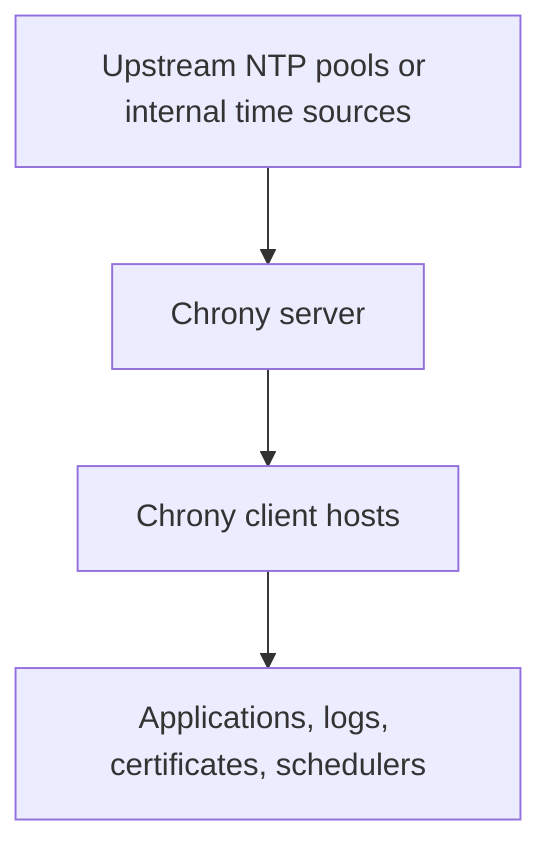

# Time Synchronization (NTP/Chrony)

---

<a id="time-synchronization-ntpchrony"></a>
## ⏱️ Time Synchronization (NTP/Chrony)

### Why time synchronization matters
Accurate system time is a foundational operational dependency.

Bad time breaks or degrades:
- Log correlation during incidents.
- TLS certificates and mutual authentication.
- Kerberos and directory-integrated authentication.
- Database replication and transaction ordering.
- Monitoring, alerting, and metrics timelines.
- Scheduled tasks and maintenance windows.

Production takeaway:
- Time drift is not a cosmetic issue.
- Treat time service health as part of baseline host reliability.

### Why Chrony is preferred
Chrony is the preferred NTP implementation on many modern Linux systems because it:
- Synchronizes quickly after boot.
- Handles intermittent connectivity well.
- Works well on VMs and laptops.
- Provides good diagnostics with `chronyc`.
- Is the default or recommended choice on many enterprise distributions.

### Time synchronization model



### Install Chrony
Ubuntu and Debian:

```bash
sudo apt update
sudo apt install -y chrony
```

RHEL-family:

```bash
sudo dnf install -y chrony
```

Enable the service:

```bash
sudo systemctl enable --now chrony
sudo systemctl enable --now chronyd
```

Use the unit name present on your distribution.

### Basic client configuration
Ubuntu and Debian typically use `/etc/chrony/chrony.conf`.
RHEL-family commonly uses `/etc/chrony.conf`.

Example internet-connected client configuration:

```conf
pool 0.pool.ntp.org iburst
pool 1.pool.ntp.org iburst
pool 2.pool.ntp.org iburst
pool 3.pool.ntp.org iburst

driftfile /var/lib/chrony/chrony.drift
rtcsync
makestep 1.0 3
leapsectz right/UTC
```

What these directives mean:
- `pool ... iburst` accelerates initial sync.
- `driftfile` tracks clock drift characteristics.
- `rtcsync` periodically synchronizes the hardware clock.
- `makestep 1.0 3` permits larger corrections during early sync.

### Internal NTP server configuration
In enterprise environments, clients often sync to internal chrony servers instead of public pools.

Example client config pointing to internal servers:

```conf
server ntp01.example.internal iburst
server ntp02.example.internal iburst

driftfile /var/lib/chrony/chrony.drift
rtcsync
makestep 1.0 3
```

Example internal chrony server configuration:

```conf
pool 0.pool.ntp.org iburst
pool 1.pool.ntp.org iburst
pool 2.pool.ntp.org iburst

allow 192.168.1.0/24
local stratum 10

driftfile /var/lib/chrony/chrony.drift
rtcsync
makestep 1.0 3
logdir /var/log/chrony
```

Important note:
- `local stratum 10` can let the host continue serving time if upstream sources disappear.
- Use it only when your policy allows that fallback behavior.

### Restart after changes

```bash
sudo systemctl restart chrony
sudo systemctl restart chronyd
```

### Firewall requirements for a time server
If the host serves time to other clients, allow UDP 123.

RHEL-family with firewalld:

```bash
sudo firewall-cmd --permanent --add-service=ntp
sudo firewall-cmd --reload
```

### Checking synchronization status
Use `timedatectl` for a quick overview:

```bash
timedatectl status
```

Use `chronyc` for detailed health:

```bash
chronyc tracking
chronyc sources -v
chronyc sourcestats -v
chronyc activity
```

What to look for in `chronyc tracking`:
- Small last offset.
- Reasonable RMS offset.
- Stable frequency correction.
- A valid reference ID.
- `Leap status     : Normal`.

What to look for in `chronyc sources -v`:
- At least one reachable source.
- A source marked with `*` for the selected current source.
- Low reachability problems or long delays only when expected.

### Forcing an immediate correction
If a host is significantly out of sync and your change window allows it:

```bash
sudo chronyc makestep
```

Use caution on systems with time-sensitive applications. Large time jumps can affect running workloads.

### Ensuring NTP is enabled through system tools
On many systems:

```bash
sudo timedatectl set-ntp true
```

Verify:

```bash
timedatectl
```

### Time zone management
Time synchronization handles clock correctness. Time zone settings control display and interpretation.

View current settings:

```bash
timedatectl
```

List zones:

```bash
timedatectl list-timezones | grep -i utc
```

Set a zone:

```bash
sudo timedatectl set-timezone UTC
```

Production guidance:
- Use UTC on servers unless a strong policy says otherwise.
- Keep logs and monitoring systems consistent.

### Hardware clock considerations
On virtual machines, the hypervisor may influence guest timekeeping.

Useful checks:

```bash
hwclock --show
```

Recommendations:
- Let chrony manage synchronization.
- Avoid manual `date` commands except for break-glass recovery.
- Verify hypervisor guest tools are not conflicting with NTP policy.

### Common Chrony and NTP troubleshooting

#### System is not synchronized
Check:
- Network reachability to NTP servers.
- DNS resolution for configured sources.
- Firewall access to UDP 123.
- Whether the service is active.

Commands:

```bash
systemctl status chrony chronyd
chronyc tracking
chronyc sources -v
ping -c 4 ntp01.example.internal
```

#### Large time drift after boot
Possible causes:
- VM resumed from a long pause.
- Clock drift on unstable hardware.
- Service did not start early enough.
- No reachable upstream servers.

Mitigations:
- Use `iburst`.
- Allow `makestep` for early boot correction.
- Review virtualization host time behavior.

#### Clients cannot query an internal chrony server
Check:
- Server has `allow` rules for the client subnet.
- Firewall allows UDP 123.
- The server is actually listening and synchronized.

Useful commands:

```bash
sudo ss -uapn | grep :123
sudo journalctl -u chrony -u chronyd --since -30m
chronyc clients
```

#### Time is synchronized but logs look wrong
Check:
- Time zone differences between hosts.
- Container runtime time settings.
- Log pipeline parsing assumptions.
- Application-local formatting and locale settings.

### Chrony best practices
- Prefer internal time servers for fleets.
- Keep at least two or more upstream sources.
- Use UTC on servers.
- Monitor offset and reachability.
- Test time health after VM template deployment.
- Avoid competing time synchronization tools.
- Document approved NTP sources.

### Chrony operational checklist
- Confirm the service is enabled at boot.
- Confirm the host selects a healthy source.
- Confirm client subnets can reach internal NTP servers.
- Verify time on critical hosts after patching or VM migrations.
- Review drift and offset for outliers.
- Keep time zone policy standardized.

### Chrony quick reference

```bash
# Install
sudo apt install chrony
sudo dnf install chrony

# Enable
sudo systemctl enable --now chrony
sudo systemctl enable --now chronyd

# Health
timedatectl status
chronyc tracking
chronyc sources -v
chronyc sourcestats -v

# Correct
sudo chronyc makestep
```
