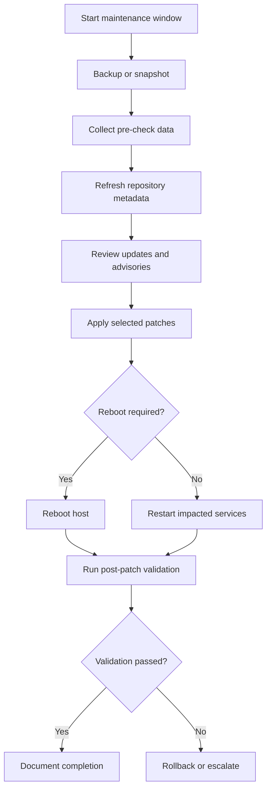

# Patch Management

← Back to [17-patching-and-vulnerabilities.md](./17-patching-and-vulnerabilities.md)

Linux patching lifecycle, single-host procedures, and change-window discipline.

---

## 🩹 1. Linux Patching Fundamentals

Linux patching is the controlled process of updating installed software, libraries, kernels, and configuration-dependent platform components to reduce risk and improve system stability.

### 🔍 What is patching and why it matters

- Patching closes known security weaknesses before attackers exploit them.
- Patching fixes functional defects that cause crashes, data corruption, or unpredictable performance.
- Patching delivers vendor-supported enhancements, hardware support, and compatibility updates.
- Patching keeps platforms aligned with support contracts, compliance obligations, and internal hardening baselines.
- Patching reduces operational drift by bringing systems back to a known supported state.

When teams delay patching, they are effectively choosing to accept risk. That risk may show up as ransomware, a failed audit, unsupported software during a critical outage, or application instability caused by running packages that are years behind vendor recommendations.

### 🧱 Types of patches

| Patch type | Primary purpose | Typical trigger | Examples | Operations note |
|---|---|---|---|---|
| Security patch | Reduce exploitability | Vendor releases advisory or errata | OpenSSL fix, sudo privilege escalation fix, kernel privilege escalation fix | Prioritize by exposure, exploitability, and business impact |
| Bugfix patch | Resolve defects or stability issues | Application crash, memory leak, service malfunction | systemd fix, glibc crash fix, filesystem corruption fix | Validate business apps because bugfixes can change behavior |
| Enhancement patch | Add capabilities or improve compatibility | Feature update, hardware enablement, new API behavior | new storage driver, improved network stack, updated package manager features | Treat as planned change; avoid bundling with emergency security windows |
| Hotfix | Targeted rapid correction | Critical incident or severe outage | single package replacement or one-off vendor advisory | Document exceptions and standardize later |
| Kernel patch | Update the core OS | Security advisory, hardware bug, scheduler fix | kernel, kernel-core, kernel-modules | May require reboot unless live patching is in place |
| Firmware or microcode update | Address hardware-level issues | Vendor bulletin, CPU microcode update | BIOS, BMC, microcode_ctl | Coordinate with hardware teams and maintenance windows |

### 🔄 Patch management lifecycle


A mature lifecycle treats patching as a business process, not a single command. The command is only the execution step. Everything around it determines whether the patch activity is safe, auditable, and repeatable.

### 🧠 Patching best practices

- Maintain an accurate asset inventory with owner, environment, application tier, and maintenance group.
- Classify systems by criticality so patch urgency aligns with business risk.
- Separate emergency security patching from routine monthly maintenance to avoid process confusion.
- Test representative workloads in non-production before broad rollout.
- Use snapshots or backups where rollback is otherwise difficult.
- Document pre-checks, expected service restarts, reboot requirements, and validation steps.
- Apply patches in waves instead of updating every server simultaneously.
- Track exceptions with approved expiry dates rather than allowing open-ended deferrals.
- Record the exact packages updated and the validation evidence gathered afterward.
- Integrate patching with vulnerability scanning so remediation can be measured.

### 📅 Maintenance windows and change management

A maintenance window is the approved time block in which changes can be applied with minimized business disruption. Effective patching depends on good change management because even safe updates can restart services, change dependencies, or require reboots.

| Change element | Questions to answer | Example |
|---|---|---|
| Scope | Which hosts, environments, and services are included? | 12 RHEL web servers in production DMZ |
| Risk | What breaks if patching fails? | Customer portal outage or failed TLS handshake |
| Backout plan | How do we revert? | snapshot revert, package downgrade, boot previous kernel |
| Validation | How do we prove success? | health checks, login test, transaction test, monitoring green |
| Communication | Who needs notice? | application owner, service desk, NOC, security team |
| Approval | Who authorizes the change? | CAB, service owner, emergency approver |
| Timing | When can downtime occur? | Sunday 02:00-04:00 UTC |
| Evidence | What records must be retained? | ticket number, patch list, screenshots, console output |

### 🪟 Sample maintenance window workflow

1. Create or update the change ticket with impacted systems, patch set, rollback plan, and validation checklist.
2. Notify stakeholders and confirm application-level blackout requirements.
3. Freeze unrelated changes on the same systems to reduce troubleshooting noise.
4. Perform pre-checks: backups, snapshots, free space, repo reachability, current kernel, cluster health.
5. Apply patches in a low-risk canary system or staging first.
6. Execute production patching according to the approved order.
7. Reboot only where required or approved.
8. Run post-checks, verify monitoring, and obtain application owner confirmation.
9. Close the change with evidence and document any exceptions or follow-up actions.

### ⚠️ Common patching mistakes to avoid

- Patching without confirming backups or snapshots on systems with poor rollback options.
- Running full upgrades in production without reviewing available updates first.
- Ignoring service dependency changes such as database drivers, Python libraries, or Java runtime requirements.
- Updating clustered systems all at once and causing total service outage.
- Assuming a patch is complete without reboot verification or application health testing.
- Letting security exceptions accumulate without risk acceptance or remediation deadlines.
- Confusing package installation success with business validation success.

### 🌍 Real-world patching philosophy

In practice, patching is a balance among security urgency, service availability, and testing confidence. A public-facing bastion host with an actively exploited OpenSSH flaw should be patched faster than an isolated internal batch server with a moderate local-only issue. A database cluster may need a carefully staged rolling plan, while disposable autoscaled nodes should ideally be remediated through updated images rather than in-place patching.

## 🖥️ 2. Single VM Patching

Single VM patching is the foundation for all larger patch programs. If the team cannot patch one system safely and repeatably, automation at fleet scale will amplify mistakes rather than solve them.

### ✅ Pre-patch checklist

- Confirm change approval or emergency authorization.
- Verify recent backup, snapshot, or recovery point.
- Check available disk space in `/`, `/var`, `/boot`, and package cache locations.
- Verify repository access and DNS resolution.
- Capture current package versions and running kernel.
- Review application dependencies and maintenance instructions.
- Confirm console access in case network services fail after reboot.
- Identify whether the patch set requires service restarts or a reboot.
- Notify affected stakeholders if the host is customer-facing or business-critical.
- Ensure monitoring is in place so regressions are visible immediately.

```bash
# Basic pre-check snapshot
hostnamectl
uname -r
df -h
free -m
uptime
ip addr show
systemctl --failed
```

### 🗺️ Single VM patch workflow



### 🟥 RHEL and CentOS patching

RHEL 8/9 and modern CentOS Stream systems typically use `dnf`, while older RHEL/CentOS versions use `yum`. The operational concepts are the same: refresh metadata, review updates, apply selected packages or advisory-driven updates, then validate.

#### 📦 Checking available updates on RHEL-family systems

```bash
# Refresh metadata and list updates
sudo dnf check-update || true

# View summary of available errata and advisories
sudo dnf updateinfo summary

# List security advisories
sudo dnf updateinfo list security

# Show package details for a specific advisory or CVE
sudo dnf updateinfo info --advisory RHSA-2024:1234
sudo dnf updateinfo info --cves CVE-2024-12345
```

On older releases using `yum`, the equivalent commands are similar:
```bash
sudo yum check-update || true
sudo yum updateinfo summary
sudo yum updateinfo list security all
sudo yum updateinfo info all
```

#### 🔐 Applying security-only updates on RHEL-family systems

```bash
# Apply only security-related updates
sudo dnf upgrade --security -y

# Apply a specific advisory
sudo dnf upgrade --advisory=RHSA-2024:1234 -y

# Update a specific package only
sudo dnf upgrade openssl -y
```

For systems where `yum-plugin-security` is available:
```bash
sudo yum update --security -y
sudo yum update-minimal --security -y
```

#### 🧪 Reviewing transaction history and reboot requirements

```bash
# Show prior transactions
sudo dnf history list
sudo dnf history info last

# Check whether reboot is recommended
sudo dnf install -y dnf-utils || true
sudo needs-restarting -r

# See which services or processes need restart
sudo needs-restarting
```

If `needs-restarting -r` returns non-zero or explicitly states that a reboot is needed, schedule that reboot rather than assuming a service restart is enough.

#### 🧯 RHEL-family rollback examples

```bash
# Undo the last DNF transaction
sudo dnf history undo last -y

# Undo a specific transaction ID
sudo dnf history undo 145 -y

# Install a previous package version if required
sudo dnf downgrade openssl -y

# Boot the previous kernel from GRUB if the latest kernel fails
sudo grubby --info=ALL | grep '^index\|^kernel'
```

Rollback is safer when a snapshot or VM checkpoint exists. Package-manager rollback is useful, but complex transactions can be difficult to reverse cleanly if dependencies changed.

### �� Ubuntu and Debian patching

Ubuntu and Debian use `apt` family tools. The standard pattern is `apt update` to refresh metadata, followed by `apt upgrade` or `apt full-upgrade` depending on policy. Many environments also enable `unattended-upgrades` for security patches.

#### 📦 Checking available updates on Ubuntu and Debian

```bash
# Refresh package metadata
sudo apt update

# List upgradable packages
apt list --upgradable

# Simulate upgrade without making changes
sudo apt upgrade --simulate

# View package policy and candidate version
apt-cache policy openssl
apt-cache policy linux-image-generic
```

#### 🔐 Applying patches on Ubuntu and Debian

```bash
# Apply regular package upgrades
sudo apt upgrade -y

# Apply distribution-aware upgrades when dependencies must change
sudo apt full-upgrade -y

# Remove obsolete packages after validation
sudo apt autoremove -y
```

For security automation, enable `unattended-upgrades`:
```bash
sudo apt install -y unattended-upgrades apt-listchanges
sudo dpkg-reconfigure --priority=low unattended-upgrades

# Dry run
sudo unattended-upgrade --dry-run --debug

# Manual execution
sudo unattended-upgrade --debug
```

#### 🔍 Reboot and validation checks on Ubuntu and Debian

```bash
# Reboot-required indicator
cat /var/run/reboot-required || true
ls -l /var/run/reboot-required* || true

# Review package logs
sudo tail -100 /var/log/apt/history.log
sudo tail -100 /var/log/unattended-upgrades/unattended-upgrades.log
```

#### 🧯 Ubuntu and Debian rollback examples

```bash
# Install a previous package version if available in repositories
apt-cache madison openssl
sudo apt install openssl=3.0.2-0ubuntu1.16

# Hold a package to prevent immediate re-upgrade
sudo apt-mark hold openssl

# Remove package hold later
sudo apt-mark unhold openssl
```

True rollback is often easiest through VM snapshot recovery or image replacement. `apt` can install a prior version if the package is still available, but repository retention policies matter.

### 🟩 SUSE patching with zypper

SUSE Linux Enterprise Server commonly uses `zypper`, which distinguishes between updates and patches. In enterprise operations, `zypper patch` is often used to apply recommended and security patches according to repository metadata.

#### 📦 Checking updates on SUSE

```bash
# Refresh repositories
sudo zypper refresh

# List available updates
sudo zypper list-updates

# List available patches
sudo zypper list-patches

# Show only security patches
sudo zypper list-patches --category security
```

#### 🔐 Applying patches on SUSE

```bash
# Apply all relevant patches
sudo zypper patch -y

# Apply security-only patches
sudo zypper patch --category security -y

# Update all packages if policy allows
sudo zypper update -y
```

#### 🧯 SUSE rollback examples

```bash
# Review history
sudo zypper history

# Use Snapper on Btrfs-based systems
sudo snapper list
sudo snapper status
sudo snapper rollback <snapshot-number>

# Reboot after rollback if required
sudo reboot
```

### 🧾 Pre-patch data capture examples

```bash
# Service and process health
systemctl --failed
ps -ef | head
ss -tulpn

# Package baselines
rpm -qa | sort > /root/rpm-before.txt    # RHEL/SUSE family
# dpkg-query -W -f='${Package}	${Version}
' > /root/dpkg-before.txt  # Debian/Ubuntu

# Kernel and boot entries
uname -r
sudo grubby --default-kernel 2>/dev/null || true
```

Storing before-and-after evidence helps with troubleshooting and audits. Even simple outputs such as running kernel, failed services, and patch transaction logs are useful when something breaks later.

### 🔎 Post-patch verification

- Confirm package manager completed without dependency or scriptlet errors.
- Verify whether a reboot is required and perform it if approved.
- Check the running kernel after reboot with `uname -r`.
- Confirm target services are active and enabled.
- Review system logs for package post-install failures or service startup errors.
- Validate application transactions, API health checks, UI login, or cluster membership.
- Confirm monitoring, backups, and agents are functioning after patching.

```bash
# Generic post-checks
uname -r
uptime
systemctl --failed
journalctl -p err -b --no-pager | tail -100
curl -k https://localhost/health || true
```

### 🧬 Kernel patching and live patching with kpatch

Kernel updates often require a reboot because the running kernel image must be replaced. Live patching solutions like `kpatch` reduce downtime for selected critical fixes by patching a running kernel in memory. Live patching does not replace routine maintenance forever; it buys time and reduces emergency reboot pressure.

```bash
# Install kpatch on supported RHEL systems
sudo subscription-manager repos --enable=rhel-8-for-x86_64-baseos-rpms
sudo dnf install -y kpatch kpatch-dnf

# Enable the service
sudo systemctl enable --now kpatch.service

# List applied live patches
kpatch list

# Show running kernel
uname -r
```

Live patching caveats:
- It covers only specific kernel vulnerabilities for supported kernels.
- It does not replace full kernel maintenance across long time horizons.
- You still need scheduled reboots to align with supported kernel baselines.
- Validate vendor support statements before making live patching a core policy.

### ↩️ Rollback procedures and decision points

Rollback should be deliberate. Not every failed validation means immediate package downgrade. First determine whether the issue is application configuration, dependency drift, delayed service restart, or a genuine patch regression.

1. Stop the rollout after the first sign of repeated failure.
2. Capture logs, transaction IDs, and screenshots before changing anything else.
3. Decide whether the issue is isolated to one service, one package, or the entire host state.
4. If available, revert to snapshot or previous VM image for fastest recovery.
5. If snapshot recovery is not possible, use package-manager downgrade or boot the previous kernel.
6. Re-run post-checks to confirm rollback success.
7. Open a problem record so the failed patch can be retested and understood before the next window.

### 🧭 Example end-to-end single-host workflow

```bash
# RHEL example
sudo dnf check-update || true
sudo dnf updateinfo list security
sudo dnf upgrade --security -y
sudo needs-restarting -r || echo "Reboot recommended"
sudo reboot

# After reboot
uname -r
systemctl --failed
sudo journalctl -b --no-pager | tail -50
```

```bash
# Ubuntu example
sudo apt update
apt list --upgradable
sudo apt upgrade -y
[ -f /var/run/reboot-required ] && echo "Reboot required"
sudo reboot

# After reboot
uname -r
systemctl --failed
sudo journalctl -b --no-pager | tail -50
```
