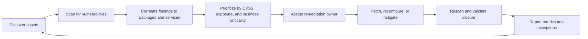
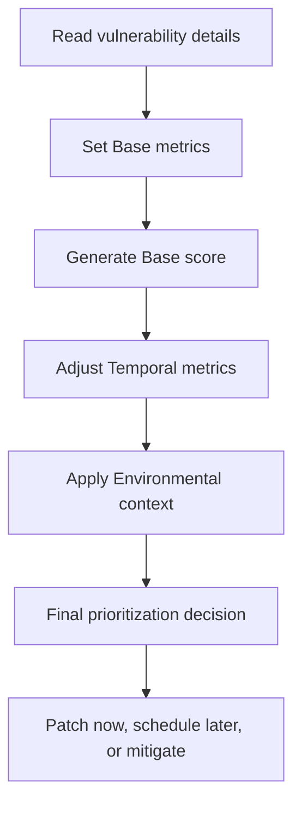
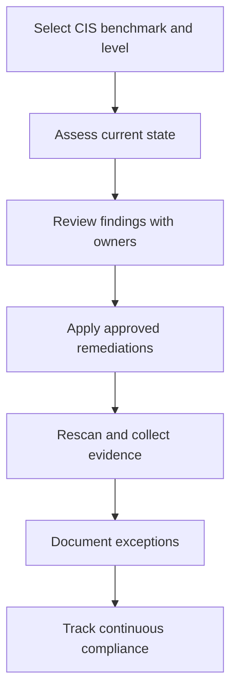

# Vulnerability Scanning and Prioritization

← Back to [17-patching-and-vulnerabilities.md](./17-patching-and-vulnerabilities.md)

Scanning workflows, CVE/CVSS interpretation, CIS alignment, and remediation prioritization.

---

## 🛡️ 5. Vulnerability Management

A vulnerability is a weakness in software, configuration, architecture, or operational process that could be exploited to compromise confidentiality, integrity, or availability.

### 🔎 What is a vulnerability?

- A coding defect such as a buffer overflow or improper input validation.
- A weak configuration such as world-writable sensitive files or exposed administrative ports.
- A missing patch that leaves a known CVE exploitable.
- A design issue such as overly broad trust relationships or lack of network segmentation.
- A dependency problem such as a vulnerable library in a package or container image.

Vulnerability management is broader than patching. Some vulnerabilities are fixed by updating packages. Others require configuration changes, compensating controls, network restrictions, or architectural redesign.

### 🧰 Vulnerability scanning tools

| Tool | Category | Strengths | Typical Linux usage |
|---|---|---|---|
| OpenSCAP | Open source compliance and vulnerability scanning | Strong for SCAP content, XCCDF, OVAL, CIS-like policy checks | Local or remote host scans against OVAL and compliance profiles |
| Nessus | Commercial vulnerability scanner | Broad plugin coverage, network and agent-based options | Enterprise host and service vulnerability detection |
| Qualys | Cloud vulnerability management platform | Large-scale asset inventory, agent telemetry, compliance integration | Continuous scanning and risk dashboards |
| Trivy | Open source scanner | Fast scanning for containers, filesystems, IaC, and SBOMs | Useful for Linux hosts, images, and CI pipelines |

### 🔍 Scanning Linux systems for vulnerabilities

Scanning should be authenticated where possible because authenticated scans produce better package-level visibility. Unauthenticated network scans still matter, but they often miss package-state nuance or generate more false positives.

```bash
# OpenSCAP OVAL evaluation example
oscap oval eval   --results /root/oval-results.xml   --report /root/oval-report.html   /usr/share/xml/scap/ssg/content/ssg-rhel8-oval.xml
```

```bash
# OpenSCAP compliance evaluation example
oscap xccdf eval   --profile xccdf_org.ssgproject.content_profile_standard   --results /root/ssg-results.xml   --report /root/ssg-report.html   /usr/share/xml/scap/ssg/content/ssg-rhel8-ds.xml
```

```bash
# Trivy filesystem scan example
trivy fs --scanners vuln,misconfig --severity HIGH,CRITICAL /
```

```bash
# Example Qualys Cloud Agent service checks after deployment
sudo systemctl status qualys-cloud-agent
sudo /usr/local/qualys/cloud-agent/bin/qualys-cloud-agent.sh ActivationId=<ID> CustomerId=<CID>
```

For Nessus or Qualys, exact commands depend on whether you deploy an agent, use authenticated network scans, or integrate with a central manager. The important operational point is to keep credentials, agent status, and scan windows well controlled.

### 🧭 Vulnerability management lifecycle



### 🛠️ Remediation workflows

1. Validate the finding: confirm the package, version, service, and host are real and in scope.
2. Determine exploitability: internet-facing service, local-only flaw, authenticated requirement, or compensating control present.
3. Prioritize using CVSS, threat intelligence, active exploitation data, and asset criticality.
4. Choose remediation method: patch, configuration change, package removal, firewall restriction, or temporary mitigation.
5. Schedule work under standard or emergency change processes.
6. Apply remediation and collect evidence.
7. Rescan to confirm closure and document exceptions for unresolved findings.

### �� Practical prioritization model

| Risk signal | Questions to ask | Typical response |
|---|---|---|
| CVSS | Is the score high or critical? | Use as a baseline, not the only factor |
| Exposure | Is the service internet-facing or reachable from untrusted networks? | Escalate faster if yes |
| Exploit activity | Is there known active exploitation or public weaponized code? | Consider emergency patching |
| Asset criticality | Is the host part of revenue, identity, or regulated workflow? | Shorten remediation SLA |
| Compensating controls | Do WAF, firewall, SELinux, segmentation, or service disablement reduce exposure? | May justify temporary exception |
| Operational risk | Could the patch itself disrupt a critical service? | Test more carefully, use staged rollout |

## 🆔 6. CVE (Common Vulnerabilities and Exposures)

CVE is a public naming system for known cybersecurity vulnerabilities. A CVE entry provides a common identifier so vendors, scanners, advisories, and defenders can refer to the same issue consistently.

### 📘 What is CVE?

- Managed by the CVE Program with MITRE as a central coordinator.
- Assigns identifiers to publicly known vulnerabilities.
- Does not itself patch systems or score risk; it names and tracks the issue.
- Allows correlation across vendor advisories, NVD enrichments, scanner plugins, and internal tickets.

### 🔤 CVE ID format and structure

A CVE identifier follows the pattern `CVE-YYYY-NNNN...`.

| Part | Meaning | Example |
|---|---|---|
| CVE | Common Vulnerabilities and Exposures prefix | CVE |
| YYYY | Year of assignment or publication context | 2024 |
| NNNN... | Sequence number with variable length | 12345 |

```text
CVE-2024-12345
|   |    |
|   |    +-- Unique sequence number
|   +------- Year component
+----------- Identifier prefix
```

### 🔎 How to search CVEs

- MITRE CVE website for the canonical identifier record.
- NVD (National Vulnerability Database) for CVSS, CPE, references, and enrichment.
- Vendor advisories such as Red Hat, Ubuntu, SUSE, Oracle, Debian, or upstream project bulletins.
- Scanner platforms like Nessus and Qualys that map findings to CVEs.
- Package-manager advisory tools that expose applicable CVEs for installed packages.

```bash
# Example manual research flow
xdg-open https://cve.mitre.org/
xdg-open https://nvd.nist.gov/
```

### 🧪 How to check if your system is affected

1. Identify the vulnerable software package, version range, and conditions that make the CVE exploitable.
2. Check whether the package is installed on the host.
3. Verify the installed version and compare it to vendor-fixed versions.
4. Read vendor advisories carefully because backported fixes may not change upstream version numbers in obvious ways.
5. Confirm whether the vulnerable feature is enabled or exposed in your environment.
6. Scan or test the system using approved tools if additional validation is required.

Backporting is important on enterprise Linux. A package version may look older than upstream but still contain the security fix because the vendor patched the older package release.

### 🌍 CVE examples and real-world impact

| CVE | Component | Why it mattered | Operational lesson |
|---|---|---|---|
| CVE-2014-0160 | OpenSSL (Heartbleed) | Allowed memory disclosure from vulnerable TLS servers | Internet-facing crypto flaws require urgent certificate and key review |
| CVE-2016-5195 | Linux kernel (Dirty COW) | Local privilege escalation via race condition | Even local-only flaws matter on multi-user or compromised hosts |
| CVE-2021-3156 | sudo (Baron Samedit) | Privilege escalation through heap-based overflow | Core admin utilities must be patched quickly |
| CVE-2021-44228 | Log4j (Log4Shell) | Remote code execution in logging library | Dependencies hidden inside apps require asset and SBOM awareness |

### �� Commands to check CVEs on RHEL-family systems

```bash
# List known security advisories and CVEs relevant to available updates
sudo dnf updateinfo list cves
sudo dnf updateinfo info --cves CVE-2024-12345

# Query package changelog for CVE references
rpm -q --changelog openssl | grep -i CVE | tail -20

# Show installed version
rpm -q openssl sudo kernel

# Review Red Hat advisory applicability when subscribed
sudo yum updateinfo list cves all
```

### 🟧 Commands to check CVEs on Ubuntu and Debian

```bash
# Show installed package version
dpkg -l | egrep 'openssl|sudo|linux-image'
apt-cache policy openssl sudo

# Ubuntu Pro security status if available
sudo pro security-status
sudo ubuntu-security-status

# Review changelog for security references
apt changelog openssl | grep -i CVE

# Search package metadata
apt list --upgradable | grep -i openssl
```

On Ubuntu, vendor tools such as `pro fix CVE-YYYY-NNNN` may be available depending on subscription and release. Always validate what repositories and entitlements are active before relying on automation.

### 🧠 CVE triage tips

- Do not assume every CVE applies to your environment just because the package exists.
- Do not dismiss a CVE just because exploitation seems “local only”; lateral movement often starts from local footholds.
- Use vendor advisories as the source of truth for fixed package builds on enterprise distributions.
- Track exposure state: not affected, affected, mitigated, patched, exception approved.

## 📊 7. CVSS (Common Vulnerability Scoring System)

CVSS is a standardized framework for describing the severity of vulnerabilities. It helps teams estimate technical impact and exploitability, but it is not a complete business-risk model by itself.

### 📘 What is CVSS?

- Developed by the Forum of Incident Response and Security Teams (FIRST).
- Provides a numerical score from 0.0 to 10.0.
- Expresses severity through a vector string and derived score.
- Includes Base, Temporal, and Environmental metrics.

### 🧩 CVSS v3.1 scoring breakdown

| Metric group | What it represents | Examples |
|---|---|---|
| Base metrics | Intrinsic technical severity | Attack Vector, Privileges Required, Confidentiality impact |
| Temporal metrics | Factors that change over time | Exploit code maturity, remediation level, report confidence |
| Environmental metrics | Context inside your environment | Modified metrics, security requirements, asset-specific impact |

### 🧮 Base metrics reference table

| Metric | Abbrev | Common values | Meaning |
|---|---|---|---|
| Attack Vector | AV | N, A, L, P | How remotely or locally the vulnerability can be exploited |
| Attack Complexity | AC | L, H | Conditions beyond attacker control needed for exploit |
| Privileges Required | PR | N, L, H | Level of privileges needed before exploitation |
| User Interaction | UI | N, R | Whether another user must participate |
| Scope | S | U, C | Whether exploitation impacts only the vulnerable component or crosses boundaries |
| Confidentiality | C | N, L, H | Impact on data secrecy |
| Integrity | I | N, L, H | Impact on trustworthiness or correctness of data |
| Availability | A | N, L, H | Impact on service availability |

### ⏱️ Temporal and environmental metrics

| Metric | Abbrev | Purpose |
|---|---|---|
| Exploit Code Maturity | E | Reflects how available and reliable exploit code is |
| Remediation Level | RL | Accounts for fix availability such as official patch or workaround |
| Report Confidence | RC | Represents certainty of the vulnerability report |
| Confidentiality Requirement | CR | Importance of confidentiality in your environment |
| Integrity Requirement | IR | Importance of integrity in your environment |
| Availability Requirement | AR | Importance of availability in your environment |
| Modified metrics | MAV, MAC, MPR, MUI, MS, MC, MI, MA | Environmental overrides for local conditions |

### 🚦 CVSS score ranges and severity levels

| Score range | Severity | Typical response expectation |
|---|---|---|
| 0.0 | None | No action required |
| 0.1 - 3.9 | Low | Remediate in routine cycle |
| 4.0 - 6.9 | Medium | Remediate on scheduled basis with normal prioritization |
| 7.0 - 8.9 | High | Accelerate remediation, especially on exposed systems |
| 9.0 - 10.0 | Critical | Emergency review, rapid containment or patching likely required |

### 🧠 How to interpret CVSS scores correctly

- A high CVSS on an isolated offline lab host is usually less urgent than the same CVE on an internet-facing production gateway.
- A medium CVSS can still become urgent if active exploitation is observed in the wild.
- Environmental metrics matter for regulated systems, identity services, payment systems, and life-safety workloads.
- Use CVSS as a starting point for prioritization, not as the only decision rule.

### 🧾 Example CVSS vector interpretation

```text
CVSS:3.1/AV:N/AC:L/PR:N/UI:N/S:U/C:H/I:H/A:H

Interpretation:
- Network exploitable
- Low complexity
- No prior privileges required
- No user interaction required
- High impact to confidentiality, integrity, and availability
- Usually a very urgent finding on exposed systems
```

### 🧮 Using a CVSS calculator

1. Open a trusted CVSS v3.1 calculator such as the FIRST calculator or NVD interface.
2. Select each metric according to the vulnerability advisory details.
3. Review the vector string and resulting score.
4. Apply environmental adjustments for your asset if the calculator supports them.
5. Document the rationale in your ticket so prioritization is explainable later.

### 🗺️ CVSS scoring diagram



## 📐 8. CIS Benchmarks

CIS Benchmarks are consensus-based security configuration recommendations produced by the Center for Internet Security. They provide structured hardening guidance for operating systems, cloud platforms, network devices, databases, and more.

### 🏛️ What is CIS?

- CIS stands for Center for Internet Security.
- It publishes benchmarks, controls, and assessment tooling.
- Its guidance is widely used for baseline hardening and audit evidence.
- Benchmarks are implementation-oriented, mapping security principles into concrete settings.

### 🧱 CIS Benchmark structure

A benchmark is usually organized into recommendation sections such as filesystem configuration, services, network settings, logging, access control, auditing, and kernel parameters. Each recommendation includes rationale, audit steps, remediation instructions, and often impacts or exceptions to consider.

| Benchmark element | What it contains |
|---|---|
| Recommendation ID | A numbered control such as 1.1.1.1 |
| Title | Short description of the control |
| Profile level | Usually Level 1 or Level 2 |
| Rationale | Why the setting matters |
| Audit | How to verify compliance |
| Remediation | How to configure the control |
| Impact | Potential operational side effects |
| References | Links to standards or technical sources |

### 🎚️ CIS levels: Level 1 and Level 2

| Level | Intent | Typical use |
|---|---|---|
| Level 1 | Practical security with minimal impact | Broad baseline for most servers |
| Level 2 | Defense-in-depth with stronger restrictions | High-security environments after careful testing |

Level 2 is not “better by default.” It is stricter, but it may also affect usability or application compatibility. Always test before broad rollout.

### 🐧 How to apply CIS Benchmarks on Linux

1. Select the correct benchmark for your distro and version.
2. Decide whether Level 1 or Level 2 is appropriate for each environment.
3. Assess current compliance using CIS-CAT, OpenSCAP, or a vetted hardening role.
4. Review findings with system owners because some controls affect application behavior.
5. Apply remediations in a controlled order with rollback options.
6. Reassess and document any accepted exceptions.

### 🧪 CIS-CAT tool usage

```bash
# Example conceptual CIS-CAT execution (exact syntax depends on version and licensing)
./CIS-CAT.sh Assessor -benchmark /path/to/benchmark.xml -profile level1_server -html
```

CIS-CAT is commonly used to generate benchmark assessment reports. It is particularly useful when audit teams want a recognizable CIS-branded assessment output.

### 🛠️ OpenSCAP with CIS profiles

```bash
# List available profiles in a SCAP content data stream
oscap info /usr/share/xml/scap/ssg/content/ssg-rhel8-ds.xml

# Evaluate a CIS-like profile if available in content
oscap xccdf eval   --profile xccdf_org.ssgproject.content_profile_cis   --results /root/cis-results.xml   --report /root/cis-report.html   /usr/share/xml/scap/ssg/content/ssg-rhel8-ds.xml
```

Profile names vary by distribution content. Always inspect `oscap info` output on the actual host or content package to confirm the available profile identifiers.

### 🤖 Automated CIS hardening scripts and roles

Automation accelerates CIS adoption, but it also increases the chance of broad-impact mistakes if controls are applied blindly. Good practice is to use profiles, variables, and exceptions rather than one-size-fits-all hardening.

```yaml
# Example concept using an Ansible hardening role
- name: Apply CIS baseline
  hosts: rhel
  become: true
  roles:
    - role: rhel8_cis
      vars:
        cis_level: 1
        cis_rule_1_1_1_1: true
        cis_rule_3_3_5: false   # example exception
```

### 📋 CIS benchmark sections overview

| Section family | Examples of controls | Operational notes |
|---|---|---|
| Filesystem | Separate partitions, mount options, permissions | Can impact legacy application paths and package install behavior |
| Services | Disable unnecessary daemons | Confirm application dependencies first |
| Network | Kernel networking parameters, firewall defaults | Coordinate with network and application teams |
| Logging and auditing | rsyslog, journald, auditd settings | Retain logs according to policy and storage capacity |
| Access control | Password policy, sudo, SSH settings | Strongly affects admin workflows |
| Kernel hardening | sysctl values, module blacklisting | May impact hardware enablement and troubleshooting |
| File permissions | Sensitive file ownership and modes | Validate service accounts and automation tools |
| Authentication | PAM, lockout, MFA-related settings | Test with directory services and emergency accounts |

### 🔄 Compliance workflow diagram



### ⚠️ Practical CIS guidance

- Do not apply all Level 2 controls to production blindly.
- Separate baseline hardening from break-glass procedures so emergency access remains possible.
- Document exceptions with strong rationale and review them periodically.
- Use hardening automation in lower environments first and promote it like application code.
- Combine benchmark compliance with vulnerability management rather than treating them as separate worlds.
