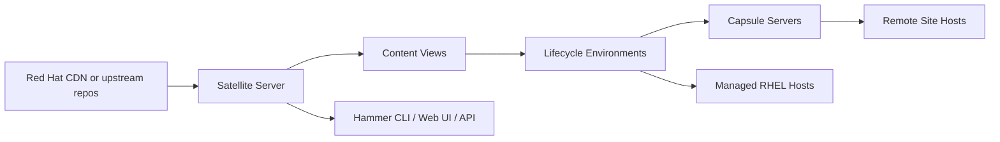
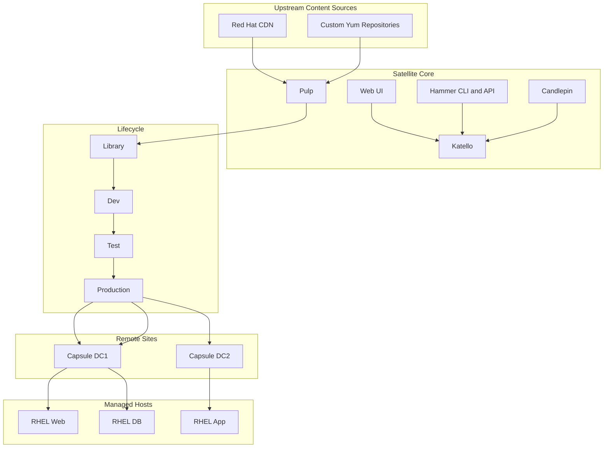

# Satellite, Repositories, and Compliance Templates

← Back to [17-patching-and-vulnerabilities.md](./17-patching-and-vulnerabilities.md)

Repository governance with Red Hat Satellite plus supporting quick-reference templates.

---

## 🛰️ 4. Centralized Repository with Red Hat Satellite

Red Hat Satellite is a lifecycle management platform for RHEL content, subscriptions, configuration, provisioning, and patch orchestration. It enables centralized control over what content systems see, when they see it, and how it moves from development to production.

### 🧭 What is Satellite? Architecture overview

- Satellite centrally manages RHEL repositories, content synchronization, host registration, patching, and reporting.
- Pulp handles content storage and synchronization.
- Katello extends content and subscription management capabilities.
- Candlepin manages subscriptions and entitlements.
- Capsules extend Satellite services to remote sites for scale and reduced WAN dependency.



### 🏗️ Satellite server setup and configuration

A full Satellite deployment includes installation, organization and location setup, manifest import, repository enablement, sync planning, content views, lifecycle environments, activation keys, and host registration procedures.

```bash
# Example high-level installation flow (exact steps vary by version)
sudo dnf module enable -y satellite:el8
sudo dnf install -y satellite
sudo satellite-installer --scenario satellite   --foreman-initial-organization "ExampleCorp"   --foreman-initial-location "PrimaryDC"   --foreman-initial-admin-username admin
```

```bash
# Hammer CLI examples
hammer organization list
hammer location list
hammer subscription upload --file ~/manifest.zip --organization "ExampleCorp"
hammer product list --organization "ExampleCorp"
```

### 📚 Content views and lifecycle environments

Content views let you define exactly which repositories, packages, errata, and versions are exposed to managed systems. Lifecycle environments represent promotion stages such as Library, Dev, Test, UAT, and Production.

```bash
# Create a lifecycle environment
hammer lifecycle-environment create   --name Dev   --organization "ExampleCorp"   --prior Library

# Create a content view
hammer content-view create   --name RHEL8-Base   --organization "ExampleCorp"

# Add a repository to the content view
hammer content-view add-repository   --name RHEL8-Base   --organization "ExampleCorp"   --repository "Red Hat Enterprise Linux 8 for x86_64 - BaseOS RPMs"

# Publish and promote
hammer content-view publish --name RHEL8-Base --organization "ExampleCorp"
hammer content-view version promote --content-view RHEL8-Base --to-lifecycle-environment Dev --organization "ExampleCorp"
```

Operationally, content views are what turn “all available vendor content” into “the approved content we expose to this environment.” That control is one of Satellite’s biggest strengths.

### 🧷 Registering clients to Satellite

```bash
# Install the Satellite CA consumer package from the Satellite server
sudo rpm -Uvh http://satellite.example.com/pub/katello-ca-consumer-latest.noarch.rpm

# Register the host using an activation key
sudo subscription-manager register   --org="ExampleCorp"   --activationkey="ak-rhel8-prod"

# Validate registration
sudo subscription-manager status
sudo subscription-manager identity
sudo dnf repolist
```

Good practice is to create activation keys per OS major version and environment. That keeps content access predictable and simplifies rebuild automation.

### 🔄 Content synchronization

```bash
# Sync a product repository
hammer repository synchronize   --name "Red Hat Enterprise Linux 8 for x86_64 - BaseOS RPMs"   --product "Red Hat Enterprise Linux for x86_64"   --organization "ExampleCorp"

# View repository sync status
hammer repository list --organization "ExampleCorp"
```

Synchronization strategy matters. Some teams sync continuously, others daily, and others only before monthly patch windows. The best choice depends on risk tolerance, bandwidth, and governance requirements.

### 📣 Errata management

Errata in Satellite map vendor advisories such as security advisories (RHSA), bugfix advisories (RHBA), and enhancement advisories (RHEA). This allows targeted remediation and reporting.

```bash
# Search errata
hammer erratum list --organization "ExampleCorp" --search "type = security"

# List applicable errata for a host
hammer host errata list --host web01.example.com

# Install errata on a host
hammer host errata apply   --host web01.example.com   --errata-ids RHSA-2024:1234,RHSA-2024:5678
```

### 🛠️ Patching through Satellite

1. Sync required repositories from Red Hat CDN or custom upstream sources.
2. Publish a content view version that contains approved package states and errata.
3. Promote the content view through Dev, Test, and Production environments.
4. Register hosts with activation keys tied to the correct lifecycle environment.
5. Use remote execution or integrated Ansible to apply updates or errata.
6. Review host-level compliance and outstanding errata reports.

```bash
# Example remote execution or host collection actions often complement Satellite workflows
hammer host list --organization "ExampleCorp" --search "content_view = RHEL8-Base"
hammer job-template list
```

### 📊 Reporting and compliance in Satellite

- Applicable errata reports show what each host still needs.
- Host collections help target patch campaigns by business service or environment.
- Lifecycle environment reports prove that production sees only promoted content.
- Subscription and repository reporting show whether systems are registered and receiving approved content.
- Satellite API and Hammer CLI output can be exported into dashboards or SIEM workflows.

### ⚖️ Satellite vs Foreman vs Spacewalk

| Platform | Status | Primary focus | Strengths | Considerations |
|---|---|---|---|---|
| Red Hat Satellite | Current commercial platform | Enterprise RHEL lifecycle and content management | Vendor support, deep RHEL integration, content views, capsules, errata, subscriptions | Licensing cost and operational complexity |
| Foreman + Katello | Open source upstream ecosystem | Lifecycle management for heterogeneous environments | Flexible, community-driven, strong provisioning features | Requires more self-support and integration effort |
| Spacewalk | Legacy / historical | Older package and system management platform | Important ancestor in the ecosystem | Superseded by newer platforms and not suitable for modern strategy |

### 🏢 Satellite architecture diagram



## 📎 Appendix A: Command Quick Reference

This appendix condenses common commands into one place for operators who need a fast runbook view during maintenance windows.

### 🧷 RHEL and CentOS quick reference

| Task | Command |
|---|---|
| Refresh metadata | `sudo dnf makecache` |
| Check updates | `sudo dnf check-update || true` |
| List security advisories | `sudo dnf updateinfo list security` |
| Apply all updates | `sudo dnf upgrade -y` |
| Apply security updates only | `sudo dnf upgrade --security -y` |
| Show transaction history | `sudo dnf history list` |
| Check reboot need | `sudo needs-restarting -r` |
| Downgrade package | `sudo dnf downgrade <package> -y` |
| List installed kernels | `rpm -q kernel` |
| Show running kernel | `uname -r` |

### 🧷 Ubuntu and Debian quick reference

| Task | Command |
|---|---|
| Refresh metadata | `sudo apt update` |
| List upgradable packages | `apt list --upgradable` |
| Simulate upgrade | `sudo apt upgrade --simulate` |
| Apply upgrades | `sudo apt upgrade -y` |
| Apply dependency-aware upgrade | `sudo apt full-upgrade -y` |
| Remove unused packages | `sudo apt autoremove -y` |
| Check reboot-required flag | `ls -l /var/run/reboot-required*` |
| View package history | `sudo tail -100 /var/log/apt/history.log` |
| Show installed version | `apt-cache policy <package>` |
| Hold package version | `sudo apt-mark hold <package>` |

### 🧷 SUSE quick reference

| Task | Command |
|---|---|
| Refresh repositories | `sudo zypper refresh` |
| List updates | `sudo zypper list-updates` |
| List patches | `sudo zypper list-patches` |
| Apply patches | `sudo zypper patch -y` |
| Apply security patches | `sudo zypper patch --category security -y` |
| Show history | `sudo zypper history` |
| List Snapper snapshots | `sudo snapper list` |
| Rollback snapshot | `sudo snapper rollback <snapshot>` |
| Show package info | `zypper info <package>` |
| Verify repos | `zypper repos` |

### 🧷 OpenSCAP and vulnerability quick reference

| Task | Command |
|---|---|
| Show SCAP content info | `oscap info /usr/share/xml/scap/ssg/content/ssg-rhel8-ds.xml` |
| Run OVAL evaluation | `oscap oval eval --report report.html oval.xml` |
| Run XCCDF evaluation | `oscap xccdf eval --profile <profile> --report report.html ds.xml` |
| Scan filesystem with Trivy | `trivy fs --scanners vuln,misconfig /` |
| List RHEL CVEs | `sudo dnf updateinfo list cves` |
| Query package changelog for CVEs | `rpm -q --changelog <pkg> | grep CVE` |
| Ubuntu security status | `sudo pro security-status` |
| Check service state | `systemctl --failed` |
| Show critical logs since boot | `journalctl -p err -b --no-pager | tail -100` |
| Test local service health | `curl -k https://localhost/health` |

## 🗂️ Appendix B: Operational Checklists and Templates

### 📝 Pre-patch checklist template

- [ ] Change ticket approved and in correct implementation state.
- [ ] Business owner notified.
- [ ] Maintenance window confirmed.
- [ ] Recent backup or snapshot validated.
- [ ] Console or out-of-band access verified.
- [ ] Current package and kernel state captured.
- [ ] Disk space adequate in package and boot filesystems.
- [ ] Cluster or load balancer draining plan ready.
- [ ] Rollback method documented.
- [ ] Validation plan agreed with application owner.

### 📝 Post-patch checklist template

- [ ] Package transaction completed successfully.
- [ ] Required reboot performed or documented as not required.
- [ ] Running kernel verified if a kernel update occurred.
- [ ] Core services are active and healthy.
- [ ] Application smoke test passed.
- [ ] Monitoring agents and backup agents report healthy.
- [ ] Security scan rerun or scheduled.
- [ ] Patch evidence attached to change record.
- [ ] Any exceptions recorded with owner and expiry.
- [ ] Stakeholders informed of completion.

### 📄 Change record template

```text
Change ID:
Service / Application:
Environment:
Host list:
Patch scope:
Reason for change:
Risk assessment:
Backout plan:
Validation steps:
Maintenance window:
Approver:
Implementation engineer:
Evidence locations:
```

### 📣 Maintenance notification template

```text
Subject: Planned Linux Patching - <service> - <date/time>

Impact:
Expected user impact:
Systems affected:
Window start:
Window end:
Rollback plan:
Support contact:
Change ticket:
```

### 🚨 Emergency patch decision template

| Question | Decision prompt |
|---|---|
| Is the vulnerability actively exploited? | If yes, escalate urgency |
| Is the system internet-facing or otherwise highly exposed? | If yes, accelerate remediation |
| Is a vendor fix available now? | If yes, move to test or emergency approval |
| Can compensating controls reduce risk temporarily? | If yes, document them while patching is prepared |
| Does the patch require a reboot on a critical service? | If yes, plan rolling or standby failover approach |
| Is there a tested rollback path? | If no, improve recovery readiness before proceeding if time permits |
