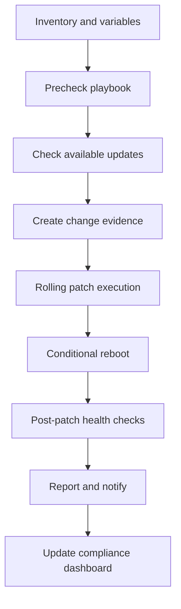
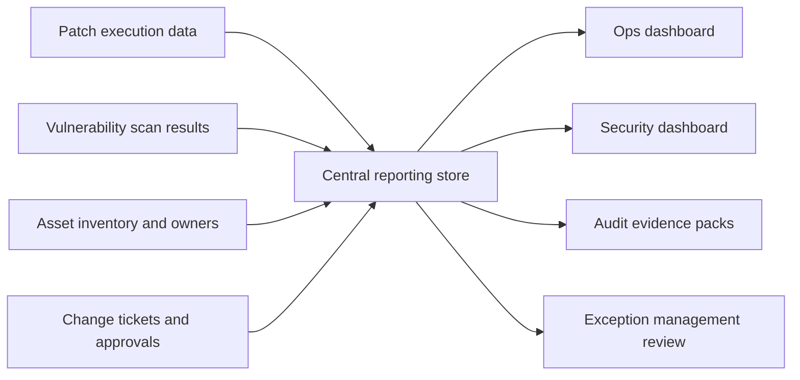

# Patching at Scale

← Back to [17-patching-and-vulnerabilities.md](./17-patching-and-vulnerabilities.md)

Multi-host automation, Ansible patch orchestration, and reporting integration for fleet operations.

---

## 🤖 3. Multi-VM Patching with Ansible

Ansible makes patching consistent across fleets by centralizing inventory, variables, validation logic, and execution order. It is particularly effective when combined with host grouping, maintenance windows, and post-patch evidence collection.

### 📦 Inventory design for patch management

```ini
[prod_rhel_web]
web01 ansible_host=10.10.10.11
web02 ansible_host=10.10.10.12
web03 ansible_host=10.10.10.13

[prod_rhel_db]
db01 ansible_host=10.10.20.11
db02 ansible_host=10.10.20.12

[prod_ubuntu_app]
app01 ansible_host=10.10.30.11
app02 ansible_host=10.10.30.12

[rhel:children]
prod_rhel_web
prod_rhel_db

[ubuntu:children]
prod_ubuntu_app

[linux:children]
rhel
ubuntu
```

Useful inventory variables for patching include:
```yaml
# group_vars/all.yml
patch_window: monthly
patch_reboot_allowed: true
patch_security_only: false
patch_validation_url: https://localhost/health
patch_maintenance_contact: ops@example.com

# group_vars/rhel.yml
patch_pkg_mgr: dnf

# group_vars/ubuntu.yml
patch_pkg_mgr: apt
```

### 🧪 Playbook to check available updates

```yaml
---
- name: Check available updates
  hosts: linux
  become: true
  gather_facts: true
  tasks:
    - name: Refresh apt cache on Debian-family
      ansible.builtin.apt:
        update_cache: true
      when: ansible_facts.os_family == "Debian"

    - name: Check updates on RHEL-family
      ansible.builtin.command: dnf check-update
      register: dnf_check
      changed_when: false
      failed_when: dnf_check.rc not in [0, 100]
      when: ansible_facts.os_family == "RedHat"

    - name: Check updates on Debian-family
      ansible.builtin.command: apt list --upgradable
      register: apt_check
      changed_when: false
      when: ansible_facts.os_family == "Debian"

    - name: Check updates on SUSE-family
      ansible.builtin.command: zypper list-updates
      register: zypper_check
      changed_when: false
      when: ansible_facts.os_family == "Suse"

    - name: Print results
      ansible.builtin.debug:
        msg: >-
          {{ dnf_check.stdout | default(apt_check.stdout) | default(zypper_check.stdout) }}
```

### 🚀 Playbook to apply patches

```yaml
---
- name: Apply patches across Linux hosts
  hosts: linux
  become: true
  gather_facts: true
  tasks:
    - name: Patch RHEL-family systems
      ansible.builtin.dnf:
        name: "*"
        state: latest
        security: "{{ patch_security_only | bool }}"
        update_only: true
      when: ansible_facts.os_family == "RedHat"

    - name: Patch Debian-family systems
      ansible.builtin.apt:
        upgrade: dist
        update_cache: true
        autoremove: true
      when: ansible_facts.os_family == "Debian"

    - name: Patch SUSE-family systems
      community.general.zypper:
        name: '*'
        state: latest
        type: package
      when: ansible_facts.os_family == "Suse"
```

### 🔁 Playbook for rolling updates one server at a time

```yaml
---
- name: Rolling patch for web tier
  hosts: prod_rhel_web
  become: true
  serial: 1
  any_errors_fatal: true
  vars:
    load_balancer_api: https://lb01.example.com/api
  pre_tasks:
    - name: Disable node in load balancer
      ansible.builtin.uri:
        url: "{{ load_balancer_api }}/disable/{{ inventory_hostname }}"
        method: POST
        validate_certs: false
      delegate_to: localhost

    - name: Wait for connection drain
      ansible.builtin.pause:
        seconds: 30

  tasks:
    - name: Apply security updates
      ansible.builtin.dnf:
        name: "*"
        state: latest
        security: true
        update_only: true

    - name: Reboot if needed
      ansible.builtin.reboot:
        reboot_timeout: 1800
      when: ansible_facts.os_family == "RedHat"

    - name: Wait for HTTPS health endpoint
      ansible.builtin.uri:
        url: https://localhost/health
        method: GET
        validate_certs: false
      register: healthcheck
      until: healthcheck.status == 200
      retries: 20
      delay: 15

  post_tasks:
    - name: Re-enable node in load balancer
      ansible.builtin.uri:
        url: "{{ load_balancer_api }}/enable/{{ inventory_hostname }}"
        method: POST
        validate_certs: false
      delegate_to: localhost
```

### 🧰 Playbook for pre- and post-patch checks

```yaml
---
- name: Pre and post patch checks
  hosts: linux
  become: true
  gather_facts: true
  tasks:
    - name: Capture running kernel
      ansible.builtin.command: uname -r
      register: running_kernel
      changed_when: false

    - name: Check failed services
      ansible.builtin.command: systemctl --failed --no-legend
      register: failed_services
      changed_when: false
      failed_when: false

    - name: Check disk utilization
      ansible.builtin.command: df -h /
      register: root_df
      changed_when: false

    - name: Save report locally
      ansible.builtin.copy:
        dest: "/var/tmp/precheck-{{ inventory_hostname }}.txt"
        content: |
          host={{ inventory_hostname }}
          kernel={{ running_kernel.stdout }}
          failed_services={{ failed_services.stdout | default('none') }}
          root_df={{ root_df.stdout }}
```

For immutable evidence collection, many teams write results back to the controller using `delegate_to: localhost` and `copy` or `template` tasks that produce dated reports.

### 🔄 Playbook for reboot management

```yaml
---
- name: Reboot hosts only when required
  hosts: linux
  become: true
  gather_facts: false
  tasks:
    - name: Check reboot-required file on Debian-family
      ansible.builtin.stat:
        path: /var/run/reboot-required
      register: reboot_required_file
      when: ansible_os_family == "Debian"

    - name: Check reboot requirement on RHEL-family
      ansible.builtin.command: needs-restarting -r
      register: reboot_required_rhel
      changed_when: false
      failed_when: reboot_required_rhel.rc not in [0, 1]
      when: ansible_os_family == "RedHat"

    - name: Reboot Debian-family host
      ansible.builtin.reboot:
        reboot_timeout: 1800
      when:
        - ansible_os_family == "Debian"
        - reboot_required_file.stat.exists

    - name: Reboot RHEL-family host
      ansible.builtin.reboot:
        reboot_timeout: 1800
      when:
        - ansible_os_family == "RedHat"
        - reboot_required_rhel.rc == 1
```

### 🧩 Complete Ansible role structure for patching

```text
roles/
└── patching/
    ├── defaults/
    │   └── main.yml
    ├── vars/
    │   └── main.yml
    ├── tasks/
    │   ├── main.yml
    │   ├── precheck.yml
    │   ├── patch_rhel.yml
    │   ├── patch_debian.yml
    │   ├── patch_suse.yml
    │   ├── reboot.yml
    │   ├── postcheck.yml
    │   └── report.yml
    ├── handlers/
    │   └── main.yml
    ├── templates/
    │   └── patch-report.j2
    ├── files/
    └── README.md
```

```yaml
# roles/patching/tasks/main.yml
---
- name: Run prechecks
  ansible.builtin.include_tasks: precheck.yml

- name: Patch RHEL systems
  ansible.builtin.include_tasks: patch_rhel.yml
  when: ansible_facts.os_family == "RedHat"

- name: Patch Debian systems
  ansible.builtin.include_tasks: patch_debian.yml
  when: ansible_facts.os_family == "Debian"

- name: Patch SUSE systems
  ansible.builtin.include_tasks: patch_suse.yml
  when: ansible_facts.os_family == "Suse"

- name: Reboot when allowed
  ansible.builtin.include_tasks: reboot.yml
  when: patch_reboot_allowed | bool

- name: Run postchecks
  ansible.builtin.include_tasks: postcheck.yml

- name: Generate patch report
  ansible.builtin.include_tasks: report.yml
```

### 📅 Scheduling with ansible-pull or AWX/Tower

Scheduling turns patch automation into a repeatable service. The main design question is whether execution is controller-driven or node-driven.

| Option | Model | Best fit | Key note |
|---|---|---|---|
| AWX / Ansible Tower / Automation Controller | Central controller pushes jobs | Enterprise fleets with RBAC, approvals, inventory sync, reporting | Best for visibility and delegated operations |
| ansible-pull | Host pulls playbook from Git on schedule | Remote or intermittently connected sites | Requires strong Git hygiene and local credentials control |
| cron + ansible-playbook | Simple scheduled controller job | Small environments | Fast to start but limited in governance |
| CI/CD pipeline trigger | Job launched by pipeline or workflow | Image pipelines, GitOps workflows | Works well when patching is tied to infrastructure as code |

```bash
# Example ansible-pull cron entry
*/30 * * * * root ansible-pull -U https://git.example.com/ops/patching.git -C main site.yml -i localhost,
```

```yaml
# Example AWX survey inputs
patch_target_group: prod_rhel_web
patch_security_only: true
patch_reboot_allowed: true
change_ticket: CHG-2024-1042
maintenance_window: 2024-11-10T02:00Z
```

### 🧭 Ansible patch workflow



### 🛡️ Operational guidance for Ansible patching

- Use `serial` to preserve service availability on clustered or load-balanced workloads.
- Prefer explicit host groups rather than patching `all` in production.
- Separate “check available updates” playbooks from “apply updates” playbooks to support approvals.
- Record change ticket IDs and maintenance window IDs as variables so reports remain auditable.
- Store patch logs centrally and retain them according to audit policy.
- Treat reboots as first-class workflow steps, not an afterthought.

## 📈 9. Patch Compliance and Reporting

Patch compliance reporting translates technical patch activity into evidence for operations leadership, security teams, and auditors. The goal is to answer three questions clearly: what is patched, what is not, and what risk remains.

### 🧾 Generating patch compliance reports

- Package-manager reports show installed versions, advisories, and transaction history.
- Ansible reports show execution success, changed hosts, failed hosts, and validation results.
- Satellite reports show applicable errata, content view alignment, and host registration status.
- Scanner reports show remaining CVEs and compliance gaps after remediation.
- SIEM dashboards correlate patch events with detections and incident patterns.

```bash
# RHEL examples
sudo dnf history list
sudo dnf updateinfo summary installed
rpm -qa --last | head -50

# Ubuntu examples
grep -E 'Start-Date|End-Date|Upgrade:' /var/log/apt/history.log | tail -50
apt list --installed | head -50
```

### 🔌 Integration with SIEM

| Integration point | Why it matters | Examples |
|---|---|---|
| Syslog or journald forwarding | Patch and reboot events become searchable in centralized logs | Splunk, Elastic, Graylog |
| Scanner exports | Open findings can be correlated with asset context | Qualys API, Nessus export, OpenSCAP reports |
| Automation job logs | Execution history supports incident review and audit trails | AWX job templates, CI pipeline logs |
| CMDB enrichment | Dashboards can group compliance by owner or service | host owner, environment, business unit |
| Ticketing linkage | Auditors can trace change approval to execution evidence | ServiceNow, Jira, Remedy |

### 🏛️ Audit requirements: SOC 2, PCI-DSS, and HIPAA

| Framework | Patch-related expectation | Typical evidence |
|---|---|---|
| SOC 2 | Changes are controlled, approved, and monitored | change tickets, patch reports, vulnerability closure evidence |
| PCI-DSS | Security patches are installed in a timely manner on in-scope systems | scan reports, patch cycle reports, exception approvals |
| HIPAA | Systems handling protected health information are protected against known risks | risk assessments, remediation records, access control validation |
| Internal policy | Organization-specific SLAs and maintenance procedures are followed | monthly dashboards, CAB approvals, exception registers |

Auditors usually care less about your favorite command and more about repeatability, evidence retention, exception handling, and management oversight.

### 📊 Dashboard setup

Useful dashboard metrics include:
- Patch compliance percentage by environment, OS family, and application tier.
- Outstanding critical and high vulnerabilities by age.
- Hosts missing required reboot after patching.
- Exception count with expiry date and owner.
- Mean time to remediate by severity and business service.
- Top packages generating repeated remediation workload.
- Scan coverage versus total asset inventory.

### 🗺️ Reporting flow diagram



### 🧠 Reporting best practices

- Track exceptions with expiration dates and compensating controls.
- Segment dashboards by production versus non-production to avoid misleading averages.
- Measure both patch deployment and vulnerability closure; they are related but not identical.
- Retain raw evidence logs for deeper investigation when summary dashboards are questioned.
- Standardize severity definitions across operations and security teams.
