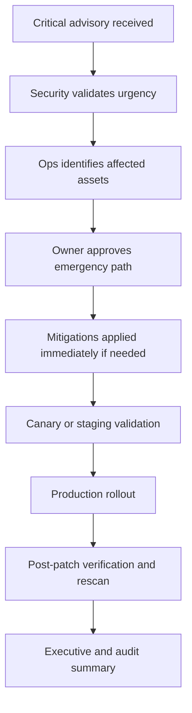

# Patching Study Notes and SLA Matrix

← Back to [17-patching-and-vulnerabilities.md](./17-patching-and-vulnerabilities.md)

Supplementary study notes, cadence guidance, and SLA planning material.

---

## 🧠 Supplementary Study Notes

### 📝 Testing philosophy

Testing philosophy note 1: Mature Linux operations teams document the expected behavior, validation method, rollback path, and ownership for this area so patching remains predictable at scale.
Testing philosophy note 2: Mature Linux operations teams document the expected behavior, validation method, rollback path, and ownership for this area so patching remains predictable at scale.
Testing philosophy note 3: Mature Linux operations teams document the expected behavior, validation method, rollback path, and ownership for this area so patching remains predictable at scale.
Testing philosophy note 4: Mature Linux operations teams document the expected behavior, validation method, rollback path, and ownership for this area so patching remains predictable at scale.
Testing philosophy note 5: Mature Linux operations teams document the expected behavior, validation method, rollback path, and ownership for this area so patching remains predictable at scale.
Testing philosophy note 6: Mature Linux operations teams document the expected behavior, validation method, rollback path, and ownership for this area so patching remains predictable at scale.
Testing philosophy note 7: Mature Linux operations teams document the expected behavior, validation method, rollback path, and ownership for this area so patching remains predictable at scale.
Testing philosophy note 8: Mature Linux operations teams document the expected behavior, validation method, rollback path, and ownership for this area so patching remains predictable at scale.
Testing philosophy note 9: Mature Linux operations teams document the expected behavior, validation method, rollback path, and ownership for this area so patching remains predictable at scale.
Testing philosophy note 10: Mature Linux operations teams document the expected behavior, validation method, rollback path, and ownership for this area so patching remains predictable at scale.
Testing philosophy note 11: Mature Linux operations teams document the expected behavior, validation method, rollback path, and ownership for this area so patching remains predictable at scale.
Testing philosophy note 12: Mature Linux operations teams document the expected behavior, validation method, rollback path, and ownership for this area so patching remains predictable at scale.
Testing philosophy note 13: Mature Linux operations teams document the expected behavior, validation method, rollback path, and ownership for this area so patching remains predictable at scale.
Testing philosophy note 14: Mature Linux operations teams document the expected behavior, validation method, rollback path, and ownership for this area so patching remains predictable at scale.
Testing philosophy note 15: Mature Linux operations teams document the expected behavior, validation method, rollback path, and ownership for this area so patching remains predictable at scale.
Testing philosophy note 16: Mature Linux operations teams document the expected behavior, validation method, rollback path, and ownership for this area so patching remains predictable at scale.
Testing philosophy note 17: Mature Linux operations teams document the expected behavior, validation method, rollback path, and ownership for this area so patching remains predictable at scale.
Testing philosophy note 18: Mature Linux operations teams document the expected behavior, validation method, rollback path, and ownership for this area so patching remains predictable at scale.
Testing philosophy note 19: Mature Linux operations teams document the expected behavior, validation method, rollback path, and ownership for this area so patching remains predictable at scale.
Testing philosophy note 20: Mature Linux operations teams document the expected behavior, validation method, rollback path, and ownership for this area so patching remains predictable at scale.

### 📝 Emergency change handling

Emergency change handling note 1: Mature Linux operations teams document the expected behavior, validation method, rollback path, and ownership for this area so patching remains predictable at scale.
Emergency change handling note 2: Mature Linux operations teams document the expected behavior, validation method, rollback path, and ownership for this area so patching remains predictable at scale.
Emergency change handling note 3: Mature Linux operations teams document the expected behavior, validation method, rollback path, and ownership for this area so patching remains predictable at scale.
Emergency change handling note 4: Mature Linux operations teams document the expected behavior, validation method, rollback path, and ownership for this area so patching remains predictable at scale.
Emergency change handling note 5: Mature Linux operations teams document the expected behavior, validation method, rollback path, and ownership for this area so patching remains predictable at scale.
Emergency change handling note 6: Mature Linux operations teams document the expected behavior, validation method, rollback path, and ownership for this area so patching remains predictable at scale.
Emergency change handling note 7: Mature Linux operations teams document the expected behavior, validation method, rollback path, and ownership for this area so patching remains predictable at scale.
Emergency change handling note 8: Mature Linux operations teams document the expected behavior, validation method, rollback path, and ownership for this area so patching remains predictable at scale.
Emergency change handling note 9: Mature Linux operations teams document the expected behavior, validation method, rollback path, and ownership for this area so patching remains predictable at scale.
Emergency change handling note 10: Mature Linux operations teams document the expected behavior, validation method, rollback path, and ownership for this area so patching remains predictable at scale.
Emergency change handling note 11: Mature Linux operations teams document the expected behavior, validation method, rollback path, and ownership for this area so patching remains predictable at scale.
Emergency change handling note 12: Mature Linux operations teams document the expected behavior, validation method, rollback path, and ownership for this area so patching remains predictable at scale.
Emergency change handling note 13: Mature Linux operations teams document the expected behavior, validation method, rollback path, and ownership for this area so patching remains predictable at scale.
Emergency change handling note 14: Mature Linux operations teams document the expected behavior, validation method, rollback path, and ownership for this area so patching remains predictable at scale.
Emergency change handling note 15: Mature Linux operations teams document the expected behavior, validation method, rollback path, and ownership for this area so patching remains predictable at scale.
Emergency change handling note 16: Mature Linux operations teams document the expected behavior, validation method, rollback path, and ownership for this area so patching remains predictable at scale.
Emergency change handling note 17: Mature Linux operations teams document the expected behavior, validation method, rollback path, and ownership for this area so patching remains predictable at scale.
Emergency change handling note 18: Mature Linux operations teams document the expected behavior, validation method, rollback path, and ownership for this area so patching remains predictable at scale.
Emergency change handling note 19: Mature Linux operations teams document the expected behavior, validation method, rollback path, and ownership for this area so patching remains predictable at scale.
Emergency change handling note 20: Mature Linux operations teams document the expected behavior, validation method, rollback path, and ownership for this area so patching remains predictable at scale.

### 📝 Package repository hygiene

Package repository hygiene note 1: Mature Linux operations teams document the expected behavior, validation method, rollback path, and ownership for this area so patching remains predictable at scale.
Package repository hygiene note 2: Mature Linux operations teams document the expected behavior, validation method, rollback path, and ownership for this area so patching remains predictable at scale.
Package repository hygiene note 3: Mature Linux operations teams document the expected behavior, validation method, rollback path, and ownership for this area so patching remains predictable at scale.
Package repository hygiene note 4: Mature Linux operations teams document the expected behavior, validation method, rollback path, and ownership for this area so patching remains predictable at scale.
Package repository hygiene note 5: Mature Linux operations teams document the expected behavior, validation method, rollback path, and ownership for this area so patching remains predictable at scale.
Package repository hygiene note 6: Mature Linux operations teams document the expected behavior, validation method, rollback path, and ownership for this area so patching remains predictable at scale.
Package repository hygiene note 7: Mature Linux operations teams document the expected behavior, validation method, rollback path, and ownership for this area so patching remains predictable at scale.
Package repository hygiene note 8: Mature Linux operations teams document the expected behavior, validation method, rollback path, and ownership for this area so patching remains predictable at scale.
Package repository hygiene note 9: Mature Linux operations teams document the expected behavior, validation method, rollback path, and ownership for this area so patching remains predictable at scale.
Package repository hygiene note 10: Mature Linux operations teams document the expected behavior, validation method, rollback path, and ownership for this area so patching remains predictable at scale.
Package repository hygiene note 11: Mature Linux operations teams document the expected behavior, validation method, rollback path, and ownership for this area so patching remains predictable at scale.
Package repository hygiene note 12: Mature Linux operations teams document the expected behavior, validation method, rollback path, and ownership for this area so patching remains predictable at scale.
Package repository hygiene note 13: Mature Linux operations teams document the expected behavior, validation method, rollback path, and ownership for this area so patching remains predictable at scale.
Package repository hygiene note 14: Mature Linux operations teams document the expected behavior, validation method, rollback path, and ownership for this area so patching remains predictable at scale.
Package repository hygiene note 15: Mature Linux operations teams document the expected behavior, validation method, rollback path, and ownership for this area so patching remains predictable at scale.
Package repository hygiene note 16: Mature Linux operations teams document the expected behavior, validation method, rollback path, and ownership for this area so patching remains predictable at scale.
Package repository hygiene note 17: Mature Linux operations teams document the expected behavior, validation method, rollback path, and ownership for this area so patching remains predictable at scale.
Package repository hygiene note 18: Mature Linux operations teams document the expected behavior, validation method, rollback path, and ownership for this area so patching remains predictable at scale.
Package repository hygiene note 19: Mature Linux operations teams document the expected behavior, validation method, rollback path, and ownership for this area so patching remains predictable at scale.
Package repository hygiene note 20: Mature Linux operations teams document the expected behavior, validation method, rollback path, and ownership for this area so patching remains predictable at scale.

### 📝 Reboot planning

Reboot planning note 1: Mature Linux operations teams document the expected behavior, validation method, rollback path, and ownership for this area so patching remains predictable at scale.
Reboot planning note 2: Mature Linux operations teams document the expected behavior, validation method, rollback path, and ownership for this area so patching remains predictable at scale.
Reboot planning note 3: Mature Linux operations teams document the expected behavior, validation method, rollback path, and ownership for this area so patching remains predictable at scale.
Reboot planning note 4: Mature Linux operations teams document the expected behavior, validation method, rollback path, and ownership for this area so patching remains predictable at scale.
Reboot planning note 5: Mature Linux operations teams document the expected behavior, validation method, rollback path, and ownership for this area so patching remains predictable at scale.
Reboot planning note 6: Mature Linux operations teams document the expected behavior, validation method, rollback path, and ownership for this area so patching remains predictable at scale.
Reboot planning note 7: Mature Linux operations teams document the expected behavior, validation method, rollback path, and ownership for this area so patching remains predictable at scale.
Reboot planning note 8: Mature Linux operations teams document the expected behavior, validation method, rollback path, and ownership for this area so patching remains predictable at scale.
Reboot planning note 9: Mature Linux operations teams document the expected behavior, validation method, rollback path, and ownership for this area so patching remains predictable at scale.
Reboot planning note 10: Mature Linux operations teams document the expected behavior, validation method, rollback path, and ownership for this area so patching remains predictable at scale.
Reboot planning note 11: Mature Linux operations teams document the expected behavior, validation method, rollback path, and ownership for this area so patching remains predictable at scale.
Reboot planning note 12: Mature Linux operations teams document the expected behavior, validation method, rollback path, and ownership for this area so patching remains predictable at scale.
Reboot planning note 13: Mature Linux operations teams document the expected behavior, validation method, rollback path, and ownership for this area so patching remains predictable at scale.
Reboot planning note 14: Mature Linux operations teams document the expected behavior, validation method, rollback path, and ownership for this area so patching remains predictable at scale.
Reboot planning note 15: Mature Linux operations teams document the expected behavior, validation method, rollback path, and ownership for this area so patching remains predictable at scale.
Reboot planning note 16: Mature Linux operations teams document the expected behavior, validation method, rollback path, and ownership for this area so patching remains predictable at scale.
Reboot planning note 17: Mature Linux operations teams document the expected behavior, validation method, rollback path, and ownership for this area so patching remains predictable at scale.
Reboot planning note 18: Mature Linux operations teams document the expected behavior, validation method, rollback path, and ownership for this area so patching remains predictable at scale.
Reboot planning note 19: Mature Linux operations teams document the expected behavior, validation method, rollback path, and ownership for this area so patching remains predictable at scale.
Reboot planning note 20: Mature Linux operations teams document the expected behavior, validation method, rollback path, and ownership for this area so patching remains predictable at scale.

### 📝 Audit evidence retention

Audit evidence retention note 1: Mature Linux operations teams document the expected behavior, validation method, rollback path, and ownership for this area so patching remains predictable at scale.
Audit evidence retention note 2: Mature Linux operations teams document the expected behavior, validation method, rollback path, and ownership for this area so patching remains predictable at scale.
Audit evidence retention note 3: Mature Linux operations teams document the expected behavior, validation method, rollback path, and ownership for this area so patching remains predictable at scale.
Audit evidence retention note 4: Mature Linux operations teams document the expected behavior, validation method, rollback path, and ownership for this area so patching remains predictable at scale.
Audit evidence retention note 5: Mature Linux operations teams document the expected behavior, validation method, rollback path, and ownership for this area so patching remains predictable at scale.
Audit evidence retention note 6: Mature Linux operations teams document the expected behavior, validation method, rollback path, and ownership for this area so patching remains predictable at scale.
Audit evidence retention note 7: Mature Linux operations teams document the expected behavior, validation method, rollback path, and ownership for this area so patching remains predictable at scale.
Audit evidence retention note 8: Mature Linux operations teams document the expected behavior, validation method, rollback path, and ownership for this area so patching remains predictable at scale.
Audit evidence retention note 9: Mature Linux operations teams document the expected behavior, validation method, rollback path, and ownership for this area so patching remains predictable at scale.
Audit evidence retention note 10: Mature Linux operations teams document the expected behavior, validation method, rollback path, and ownership for this area so patching remains predictable at scale.
Audit evidence retention note 11: Mature Linux operations teams document the expected behavior, validation method, rollback path, and ownership for this area so patching remains predictable at scale.
Audit evidence retention note 12: Mature Linux operations teams document the expected behavior, validation method, rollback path, and ownership for this area so patching remains predictable at scale.
Audit evidence retention note 13: Mature Linux operations teams document the expected behavior, validation method, rollback path, and ownership for this area so patching remains predictable at scale.
Audit evidence retention note 14: Mature Linux operations teams document the expected behavior, validation method, rollback path, and ownership for this area so patching remains predictable at scale.
Audit evidence retention note 15: Mature Linux operations teams document the expected behavior, validation method, rollback path, and ownership for this area so patching remains predictable at scale.
Audit evidence retention note 16: Mature Linux operations teams document the expected behavior, validation method, rollback path, and ownership for this area so patching remains predictable at scale.
Audit evidence retention note 17: Mature Linux operations teams document the expected behavior, validation method, rollback path, and ownership for this area so patching remains predictable at scale.
Audit evidence retention note 18: Mature Linux operations teams document the expected behavior, validation method, rollback path, and ownership for this area so patching remains predictable at scale.
Audit evidence retention note 19: Mature Linux operations teams document the expected behavior, validation method, rollback path, and ownership for this area so patching remains predictable at scale.
Audit evidence retention note 20: Mature Linux operations teams document the expected behavior, validation method, rollback path, and ownership for this area so patching remains predictable at scale.

### 📝 Stakeholder communication

Stakeholder communication note 1: Mature Linux operations teams document the expected behavior, validation method, rollback path, and ownership for this area so patching remains predictable at scale.
Stakeholder communication note 2: Mature Linux operations teams document the expected behavior, validation method, rollback path, and ownership for this area so patching remains predictable at scale.
Stakeholder communication note 3: Mature Linux operations teams document the expected behavior, validation method, rollback path, and ownership for this area so patching remains predictable at scale.
Stakeholder communication note 4: Mature Linux operations teams document the expected behavior, validation method, rollback path, and ownership for this area so patching remains predictable at scale.
Stakeholder communication note 5: Mature Linux operations teams document the expected behavior, validation method, rollback path, and ownership for this area so patching remains predictable at scale.
Stakeholder communication note 6: Mature Linux operations teams document the expected behavior, validation method, rollback path, and ownership for this area so patching remains predictable at scale.
Stakeholder communication note 7: Mature Linux operations teams document the expected behavior, validation method, rollback path, and ownership for this area so patching remains predictable at scale.
Stakeholder communication note 8: Mature Linux operations teams document the expected behavior, validation method, rollback path, and ownership for this area so patching remains predictable at scale.
Stakeholder communication note 9: Mature Linux operations teams document the expected behavior, validation method, rollback path, and ownership for this area so patching remains predictable at scale.
Stakeholder communication note 10: Mature Linux operations teams document the expected behavior, validation method, rollback path, and ownership for this area so patching remains predictable at scale.
Stakeholder communication note 11: Mature Linux operations teams document the expected behavior, validation method, rollback path, and ownership for this area so patching remains predictable at scale.
Stakeholder communication note 12: Mature Linux operations teams document the expected behavior, validation method, rollback path, and ownership for this area so patching remains predictable at scale.
Stakeholder communication note 13: Mature Linux operations teams document the expected behavior, validation method, rollback path, and ownership for this area so patching remains predictable at scale.
Stakeholder communication note 14: Mature Linux operations teams document the expected behavior, validation method, rollback path, and ownership for this area so patching remains predictable at scale.
Stakeholder communication note 15: Mature Linux operations teams document the expected behavior, validation method, rollback path, and ownership for this area so patching remains predictable at scale.
Stakeholder communication note 16: Mature Linux operations teams document the expected behavior, validation method, rollback path, and ownership for this area so patching remains predictable at scale.
Stakeholder communication note 17: Mature Linux operations teams document the expected behavior, validation method, rollback path, and ownership for this area so patching remains predictable at scale.
Stakeholder communication note 18: Mature Linux operations teams document the expected behavior, validation method, rollback path, and ownership for this area so patching remains predictable at scale.
Stakeholder communication note 19: Mature Linux operations teams document the expected behavior, validation method, rollback path, and ownership for this area so patching remains predictable at scale.
Stakeholder communication note 20: Mature Linux operations teams document the expected behavior, validation method, rollback path, and ownership for this area so patching remains predictable at scale.

### 📝 Cluster-aware patching

Cluster-aware patching note 1: Mature Linux operations teams document the expected behavior, validation method, rollback path, and ownership for this area so patching remains predictable at scale.
Cluster-aware patching note 2: Mature Linux operations teams document the expected behavior, validation method, rollback path, and ownership for this area so patching remains predictable at scale.
Cluster-aware patching note 3: Mature Linux operations teams document the expected behavior, validation method, rollback path, and ownership for this area so patching remains predictable at scale.
Cluster-aware patching note 4: Mature Linux operations teams document the expected behavior, validation method, rollback path, and ownership for this area so patching remains predictable at scale.
Cluster-aware patching note 5: Mature Linux operations teams document the expected behavior, validation method, rollback path, and ownership for this area so patching remains predictable at scale.
Cluster-aware patching note 6: Mature Linux operations teams document the expected behavior, validation method, rollback path, and ownership for this area so patching remains predictable at scale.
Cluster-aware patching note 7: Mature Linux operations teams document the expected behavior, validation method, rollback path, and ownership for this area so patching remains predictable at scale.
Cluster-aware patching note 8: Mature Linux operations teams document the expected behavior, validation method, rollback path, and ownership for this area so patching remains predictable at scale.
Cluster-aware patching note 9: Mature Linux operations teams document the expected behavior, validation method, rollback path, and ownership for this area so patching remains predictable at scale.
Cluster-aware patching note 10: Mature Linux operations teams document the expected behavior, validation method, rollback path, and ownership for this area so patching remains predictable at scale.
Cluster-aware patching note 11: Mature Linux operations teams document the expected behavior, validation method, rollback path, and ownership for this area so patching remains predictable at scale.
Cluster-aware patching note 12: Mature Linux operations teams document the expected behavior, validation method, rollback path, and ownership for this area so patching remains predictable at scale.
Cluster-aware patching note 13: Mature Linux operations teams document the expected behavior, validation method, rollback path, and ownership for this area so patching remains predictable at scale.
Cluster-aware patching note 14: Mature Linux operations teams document the expected behavior, validation method, rollback path, and ownership for this area so patching remains predictable at scale.
Cluster-aware patching note 15: Mature Linux operations teams document the expected behavior, validation method, rollback path, and ownership for this area so patching remains predictable at scale.
Cluster-aware patching note 16: Mature Linux operations teams document the expected behavior, validation method, rollback path, and ownership for this area so patching remains predictable at scale.
Cluster-aware patching note 17: Mature Linux operations teams document the expected behavior, validation method, rollback path, and ownership for this area so patching remains predictable at scale.
Cluster-aware patching note 18: Mature Linux operations teams document the expected behavior, validation method, rollback path, and ownership for this area so patching remains predictable at scale.
Cluster-aware patching note 19: Mature Linux operations teams document the expected behavior, validation method, rollback path, and ownership for this area so patching remains predictable at scale.
Cluster-aware patching note 20: Mature Linux operations teams document the expected behavior, validation method, rollback path, and ownership for this area so patching remains predictable at scale.

### 📝 Service health validation

Service health validation note 1: Mature Linux operations teams document the expected behavior, validation method, rollback path, and ownership for this area so patching remains predictable at scale.
Service health validation note 2: Mature Linux operations teams document the expected behavior, validation method, rollback path, and ownership for this area so patching remains predictable at scale.
Service health validation note 3: Mature Linux operations teams document the expected behavior, validation method, rollback path, and ownership for this area so patching remains predictable at scale.
Service health validation note 4: Mature Linux operations teams document the expected behavior, validation method, rollback path, and ownership for this area so patching remains predictable at scale.
Service health validation note 5: Mature Linux operations teams document the expected behavior, validation method, rollback path, and ownership for this area so patching remains predictable at scale.
Service health validation note 6: Mature Linux operations teams document the expected behavior, validation method, rollback path, and ownership for this area so patching remains predictable at scale.
Service health validation note 7: Mature Linux operations teams document the expected behavior, validation method, rollback path, and ownership for this area so patching remains predictable at scale.
Service health validation note 8: Mature Linux operations teams document the expected behavior, validation method, rollback path, and ownership for this area so patching remains predictable at scale.
Service health validation note 9: Mature Linux operations teams document the expected behavior, validation method, rollback path, and ownership for this area so patching remains predictable at scale.
Service health validation note 10: Mature Linux operations teams document the expected behavior, validation method, rollback path, and ownership for this area so patching remains predictable at scale.
Service health validation note 11: Mature Linux operations teams document the expected behavior, validation method, rollback path, and ownership for this area so patching remains predictable at scale.
Service health validation note 12: Mature Linux operations teams document the expected behavior, validation method, rollback path, and ownership for this area so patching remains predictable at scale.
Service health validation note 13: Mature Linux operations teams document the expected behavior, validation method, rollback path, and ownership for this area so patching remains predictable at scale.
Service health validation note 14: Mature Linux operations teams document the expected behavior, validation method, rollback path, and ownership for this area so patching remains predictable at scale.
Service health validation note 15: Mature Linux operations teams document the expected behavior, validation method, rollback path, and ownership for this area so patching remains predictable at scale.
Service health validation note 16: Mature Linux operations teams document the expected behavior, validation method, rollback path, and ownership for this area so patching remains predictable at scale.
Service health validation note 17: Mature Linux operations teams document the expected behavior, validation method, rollback path, and ownership for this area so patching remains predictable at scale.
Service health validation note 18: Mature Linux operations teams document the expected behavior, validation method, rollback path, and ownership for this area so patching remains predictable at scale.
Service health validation note 19: Mature Linux operations teams document the expected behavior, validation method, rollback path, and ownership for this area so patching remains predictable at scale.
Service health validation note 20: Mature Linux operations teams document the expected behavior, validation method, rollback path, and ownership for this area so patching remains predictable at scale.

### 📝 Backport verification

Backport verification note 1: Mature Linux operations teams document the expected behavior, validation method, rollback path, and ownership for this area so patching remains predictable at scale.
Backport verification note 2: Mature Linux operations teams document the expected behavior, validation method, rollback path, and ownership for this area so patching remains predictable at scale.
Backport verification note 3: Mature Linux operations teams document the expected behavior, validation method, rollback path, and ownership for this area so patching remains predictable at scale.
Backport verification note 4: Mature Linux operations teams document the expected behavior, validation method, rollback path, and ownership for this area so patching remains predictable at scale.
Backport verification note 5: Mature Linux operations teams document the expected behavior, validation method, rollback path, and ownership for this area so patching remains predictable at scale.
Backport verification note 6: Mature Linux operations teams document the expected behavior, validation method, rollback path, and ownership for this area so patching remains predictable at scale.
Backport verification note 7: Mature Linux operations teams document the expected behavior, validation method, rollback path, and ownership for this area so patching remains predictable at scale.
Backport verification note 8: Mature Linux operations teams document the expected behavior, validation method, rollback path, and ownership for this area so patching remains predictable at scale.
Backport verification note 9: Mature Linux operations teams document the expected behavior, validation method, rollback path, and ownership for this area so patching remains predictable at scale.
Backport verification note 10: Mature Linux operations teams document the expected behavior, validation method, rollback path, and ownership for this area so patching remains predictable at scale.
Backport verification note 11: Mature Linux operations teams document the expected behavior, validation method, rollback path, and ownership for this area so patching remains predictable at scale.
Backport verification note 12: Mature Linux operations teams document the expected behavior, validation method, rollback path, and ownership for this area so patching remains predictable at scale.
Backport verification note 13: Mature Linux operations teams document the expected behavior, validation method, rollback path, and ownership for this area so patching remains predictable at scale.
Backport verification note 14: Mature Linux operations teams document the expected behavior, validation method, rollback path, and ownership for this area so patching remains predictable at scale.
Backport verification note 15: Mature Linux operations teams document the expected behavior, validation method, rollback path, and ownership for this area so patching remains predictable at scale.
Backport verification note 16: Mature Linux operations teams document the expected behavior, validation method, rollback path, and ownership for this area so patching remains predictable at scale.
Backport verification note 17: Mature Linux operations teams document the expected behavior, validation method, rollback path, and ownership for this area so patching remains predictable at scale.
Backport verification note 18: Mature Linux operations teams document the expected behavior, validation method, rollback path, and ownership for this area so patching remains predictable at scale.
Backport verification note 19: Mature Linux operations teams document the expected behavior, validation method, rollback path, and ownership for this area so patching remains predictable at scale.
Backport verification note 20: Mature Linux operations teams document the expected behavior, validation method, rollback path, and ownership for this area so patching remains predictable at scale.

### 📝 Container and host alignment

Container and host alignment note 1: Mature Linux operations teams document the expected behavior, validation method, rollback path, and ownership for this area so patching remains predictable at scale.
Container and host alignment note 2: Mature Linux operations teams document the expected behavior, validation method, rollback path, and ownership for this area so patching remains predictable at scale.
Container and host alignment note 3: Mature Linux operations teams document the expected behavior, validation method, rollback path, and ownership for this area so patching remains predictable at scale.
Container and host alignment note 4: Mature Linux operations teams document the expected behavior, validation method, rollback path, and ownership for this area so patching remains predictable at scale.
Container and host alignment note 5: Mature Linux operations teams document the expected behavior, validation method, rollback path, and ownership for this area so patching remains predictable at scale.
Container and host alignment note 6: Mature Linux operations teams document the expected behavior, validation method, rollback path, and ownership for this area so patching remains predictable at scale.
Container and host alignment note 7: Mature Linux operations teams document the expected behavior, validation method, rollback path, and ownership for this area so patching remains predictable at scale.
Container and host alignment note 8: Mature Linux operations teams document the expected behavior, validation method, rollback path, and ownership for this area so patching remains predictable at scale.
Container and host alignment note 9: Mature Linux operations teams document the expected behavior, validation method, rollback path, and ownership for this area so patching remains predictable at scale.
Container and host alignment note 10: Mature Linux operations teams document the expected behavior, validation method, rollback path, and ownership for this area so patching remains predictable at scale.
Container and host alignment note 11: Mature Linux operations teams document the expected behavior, validation method, rollback path, and ownership for this area so patching remains predictable at scale.
Container and host alignment note 12: Mature Linux operations teams document the expected behavior, validation method, rollback path, and ownership for this area so patching remains predictable at scale.
Container and host alignment note 13: Mature Linux operations teams document the expected behavior, validation method, rollback path, and ownership for this area so patching remains predictable at scale.
Container and host alignment note 14: Mature Linux operations teams document the expected behavior, validation method, rollback path, and ownership for this area so patching remains predictable at scale.
Container and host alignment note 15: Mature Linux operations teams document the expected behavior, validation method, rollback path, and ownership for this area so patching remains predictable at scale.
Container and host alignment note 16: Mature Linux operations teams document the expected behavior, validation method, rollback path, and ownership for this area so patching remains predictable at scale.
Container and host alignment note 17: Mature Linux operations teams document the expected behavior, validation method, rollback path, and ownership for this area so patching remains predictable at scale.
Container and host alignment note 18: Mature Linux operations teams document the expected behavior, validation method, rollback path, and ownership for this area so patching remains predictable at scale.
Container and host alignment note 19: Mature Linux operations teams document the expected behavior, validation method, rollback path, and ownership for this area so patching remains predictable at scale.
Container and host alignment note 20: Mature Linux operations teams document the expected behavior, validation method, rollback path, and ownership for this area so patching remains predictable at scale.

### 📝 Cloud and on-prem differences

Cloud and on-prem differences note 1: Mature Linux operations teams document the expected behavior, validation method, rollback path, and ownership for this area so patching remains predictable at scale.
Cloud and on-prem differences note 2: Mature Linux operations teams document the expected behavior, validation method, rollback path, and ownership for this area so patching remains predictable at scale.
Cloud and on-prem differences note 3: Mature Linux operations teams document the expected behavior, validation method, rollback path, and ownership for this area so patching remains predictable at scale.
Cloud and on-prem differences note 4: Mature Linux operations teams document the expected behavior, validation method, rollback path, and ownership for this area so patching remains predictable at scale.
Cloud and on-prem differences note 5: Mature Linux operations teams document the expected behavior, validation method, rollback path, and ownership for this area so patching remains predictable at scale.
Cloud and on-prem differences note 6: Mature Linux operations teams document the expected behavior, validation method, rollback path, and ownership for this area so patching remains predictable at scale.
Cloud and on-prem differences note 7: Mature Linux operations teams document the expected behavior, validation method, rollback path, and ownership for this area so patching remains predictable at scale.
Cloud and on-prem differences note 8: Mature Linux operations teams document the expected behavior, validation method, rollback path, and ownership for this area so patching remains predictable at scale.
Cloud and on-prem differences note 9: Mature Linux operations teams document the expected behavior, validation method, rollback path, and ownership for this area so patching remains predictable at scale.
Cloud and on-prem differences note 10: Mature Linux operations teams document the expected behavior, validation method, rollback path, and ownership for this area so patching remains predictable at scale.
Cloud and on-prem differences note 11: Mature Linux operations teams document the expected behavior, validation method, rollback path, and ownership for this area so patching remains predictable at scale.
Cloud and on-prem differences note 12: Mature Linux operations teams document the expected behavior, validation method, rollback path, and ownership for this area so patching remains predictable at scale.
Cloud and on-prem differences note 13: Mature Linux operations teams document the expected behavior, validation method, rollback path, and ownership for this area so patching remains predictable at scale.
Cloud and on-prem differences note 14: Mature Linux operations teams document the expected behavior, validation method, rollback path, and ownership for this area so patching remains predictable at scale.
Cloud and on-prem differences note 15: Mature Linux operations teams document the expected behavior, validation method, rollback path, and ownership for this area so patching remains predictable at scale.
Cloud and on-prem differences note 16: Mature Linux operations teams document the expected behavior, validation method, rollback path, and ownership for this area so patching remains predictable at scale.
Cloud and on-prem differences note 17: Mature Linux operations teams document the expected behavior, validation method, rollback path, and ownership for this area so patching remains predictable at scale.
Cloud and on-prem differences note 18: Mature Linux operations teams document the expected behavior, validation method, rollback path, and ownership for this area so patching remains predictable at scale.
Cloud and on-prem differences note 19: Mature Linux operations teams document the expected behavior, validation method, rollback path, and ownership for this area so patching remains predictable at scale.
Cloud and on-prem differences note 20: Mature Linux operations teams document the expected behavior, validation method, rollback path, and ownership for this area so patching remains predictable at scale.

### 📝 Exception management

Exception management note 1: Mature Linux operations teams document the expected behavior, validation method, rollback path, and ownership for this area so patching remains predictable at scale.
Exception management note 2: Mature Linux operations teams document the expected behavior, validation method, rollback path, and ownership for this area so patching remains predictable at scale.
Exception management note 3: Mature Linux operations teams document the expected behavior, validation method, rollback path, and ownership for this area so patching remains predictable at scale.
Exception management note 4: Mature Linux operations teams document the expected behavior, validation method, rollback path, and ownership for this area so patching remains predictable at scale.
Exception management note 5: Mature Linux operations teams document the expected behavior, validation method, rollback path, and ownership for this area so patching remains predictable at scale.
Exception management note 6: Mature Linux operations teams document the expected behavior, validation method, rollback path, and ownership for this area so patching remains predictable at scale.
Exception management note 7: Mature Linux operations teams document the expected behavior, validation method, rollback path, and ownership for this area so patching remains predictable at scale.
Exception management note 8: Mature Linux operations teams document the expected behavior, validation method, rollback path, and ownership for this area so patching remains predictable at scale.
Exception management note 9: Mature Linux operations teams document the expected behavior, validation method, rollback path, and ownership for this area so patching remains predictable at scale.
Exception management note 10: Mature Linux operations teams document the expected behavior, validation method, rollback path, and ownership for this area so patching remains predictable at scale.
Exception management note 11: Mature Linux operations teams document the expected behavior, validation method, rollback path, and ownership for this area so patching remains predictable at scale.
Exception management note 12: Mature Linux operations teams document the expected behavior, validation method, rollback path, and ownership for this area so patching remains predictable at scale.
Exception management note 13: Mature Linux operations teams document the expected behavior, validation method, rollback path, and ownership for this area so patching remains predictable at scale.
Exception management note 14: Mature Linux operations teams document the expected behavior, validation method, rollback path, and ownership for this area so patching remains predictable at scale.
Exception management note 15: Mature Linux operations teams document the expected behavior, validation method, rollback path, and ownership for this area so patching remains predictable at scale.
Exception management note 16: Mature Linux operations teams document the expected behavior, validation method, rollback path, and ownership for this area so patching remains predictable at scale.
Exception management note 17: Mature Linux operations teams document the expected behavior, validation method, rollback path, and ownership for this area so patching remains predictable at scale.
Exception management note 18: Mature Linux operations teams document the expected behavior, validation method, rollback path, and ownership for this area so patching remains predictable at scale.
Exception management note 19: Mature Linux operations teams document the expected behavior, validation method, rollback path, and ownership for this area so patching remains predictable at scale.
Exception management note 20: Mature Linux operations teams document the expected behavior, validation method, rollback path, and ownership for this area so patching remains predictable at scale.

## 🗓️ Appendix F: Patching Cadence and SLA Matrix

This appendix gives operators a compact way to align vulnerability severity, host criticality, and maintenance rhythm.

### 📅 Example patch cadence by asset type

| Asset type | Typical cadence | Emergency trigger | Preferred method | Notes |
|---|---|---|---|---|
| Internet-facing web servers | Weekly review, monthly standard patching | Active exploitation or critical remote CVE | Rolling update with load balancer drain | Keep health checks and synthetic monitoring ready |
| Internal application servers | Monthly | High-risk middleware or auth-related flaw | Serial update by application tier | Coordinate with app owner for smoke tests |
| Database clusters | Monthly with strict sequencing | Critical data exposure or privilege escalation | Node-by-node patching with DBA oversight | Protect quorum and replication health |
| Jump hosts and bastions | Monthly, often accelerated | SSH, sudo, PAM, kernel, or auth flaw | Fast-track patching with canary | These systems are high-value admin paths |
| Build servers and CI workers | Monthly | Toolchain or credential-handling flaw | Image rebuild or blue/green worker rotation | Recreate ephemeral workers where possible |
| Container worker nodes | Monthly or image-driven | Kernel, container runtime, or cgroup flaw | Replace nodes from updated images | Prefer immutable rollout |
| DMZ proxies and gateways | Monthly, often weekly review | TLS, reverse proxy, or kernel flaw | One-at-a-time cutover | Validate certificates and routing |
| Audit-scope regulated hosts | Monthly with retained evidence | Auditor-directed urgent fix or critical CVE | Controlled change with detailed logging | Keep screenshots, logs, and approvals |

### ⏱️ Example remediation SLA matrix

| Severity / context | Example target | Typical handling approach |
|---|---|---|
| Critical + internet-facing + active exploitation | 24 to 72 hours | Emergency change, canary first if feasible, compensating controls immediately |
| Critical + internal only | 3 to 7 days | Accelerated maintenance, strong validation, potential segmentation while patching |
| High + internet-facing | 7 to 14 days | Prioritized within next patch window or earlier |
| High + internal | 14 to 30 days | Standard patch cycle with owner approval |
| Medium | 30 to 60 days | Routine backlog with exposure review |
| Low | Best-effort routine cycle | Bundle with normal lifecycle work |
| No patch available | Case-by-case exception | Document mitigation, monitoring, and expiry review |

### 👥 Stakeholder matrix

| Stakeholder | What they care about | Evidence they usually need |
|---|---|---|
| Linux operations | Safe execution and recovery | Runbooks, package logs, reboot status |
| Security team | Risk reduction and closure | CVE status, rescan results, exceptions |
| Application owner | Service continuity | Smoke tests, transaction results, downtime summary |
| Service desk / NOC | User impact and communication | Maintenance notice, status updates, completion summary |
| Audit / compliance | Control effectiveness | Change approvals, reports, retained evidence |
| Leadership | Trend and accountability | Dashboard metrics, SLA attainment, risk summaries |

### 🚨 Emergency patch communication flow

### 📌 Daily, weekly, and monthly operating rhythm

#### Daily review items

- Review newly published vendor security advisories.
- Check dashboards for hosts missing required reboot.
- Review scanner feeds for newly exploitable critical findings.
- Confirm repo synchronization jobs completed successfully.
- Verify no patch automation jobs failed overnight.
- Confirm exception records nearing expiry are being reviewed.
- Look for hosts that missed their scheduled maintenance wave.
- Check for package-manager lock or corruption alerts.
- Review emergency change backlog.
- Confirm business-critical services remain healthy after prior patch windows.

#### Weekly review items

- Validate patch group membership for newly onboarded hosts.
- Review age of critical and high findings by service owner.
- Confirm staging or canary environments reflect production baselines.
- Reconcile asset inventory against scanning coverage.
- Review Satellite sync and content view promotion health.
- Review AWX or Ansible job success trends.
- Confirm backups and snapshots are functioning for patch targets.
- Test rollback procedure on a non-production representative system.
- Verify monitoring checks still match service reality after application changes.
- Review exception trends for repeat problem packages.

#### Monthly review items

- Execute standard patch cycle across approved server groups.
- Publish and promote approved Satellite content views.
- Review vulnerability remediation SLA attainment.
- Update audit evidence packs for regulated systems.
- Confirm documented owners for every unpatched exception.
- Review kernel reboot backlog and reduce stale hosts.
- Validate CIS benchmark assessment schedule and drift reports.
- Identify packages causing repeated incident or regression patterns.
- Refine patching runbooks with lessons learned.
- Present summary metrics to operations and security leadership.

### 🧠 Practical interpretation notes

- A strong SLA is only credible if the team can prove discovery time, assignment time, remediation time, and closure time.
- Monthly patching is common, but it must be complemented by an emergency path for actively exploited or critical exposures.
- Patch cadence should reflect both asset criticality and recoverability.
- Immutable workloads often achieve better consistency through image rotation rather than ad hoc in-place updates.
- Exception volume is itself a metric. High exception counts usually signal weak ownership, poor testing, or unsupported platforms.

### ✅ Mini decision checklist

- [ ] Is the vulnerability exposed to untrusted networks?
- [ ] Is there active exploitation or reliable exploit code?
- [ ] Is a vendor-supported fix available now?
- [ ] Can a canary or staging system validate the patch quickly?
- [ ] Is the rollback path faster than the forward-fix path?
- [ ] Does the maintenance window need to be accelerated?
- [ ] Do we need to notify audit or compliance stakeholders?
- [ ] Are compensating controls active until patch completion?
- [ ] Has a post-patch rescan been scheduled?
- [ ] Has evidence retention been planned before the work starts?
