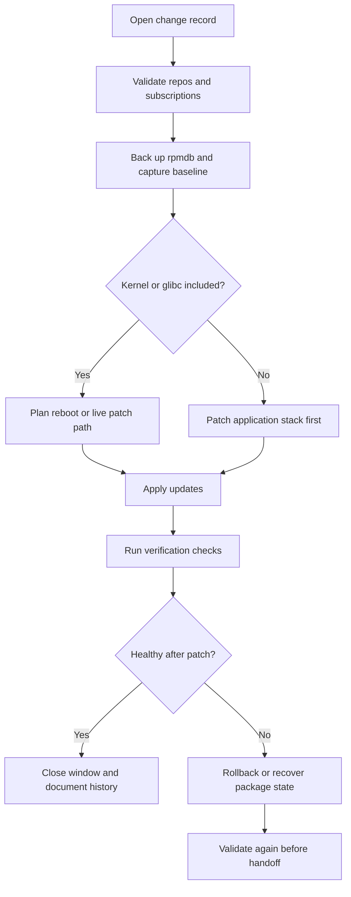
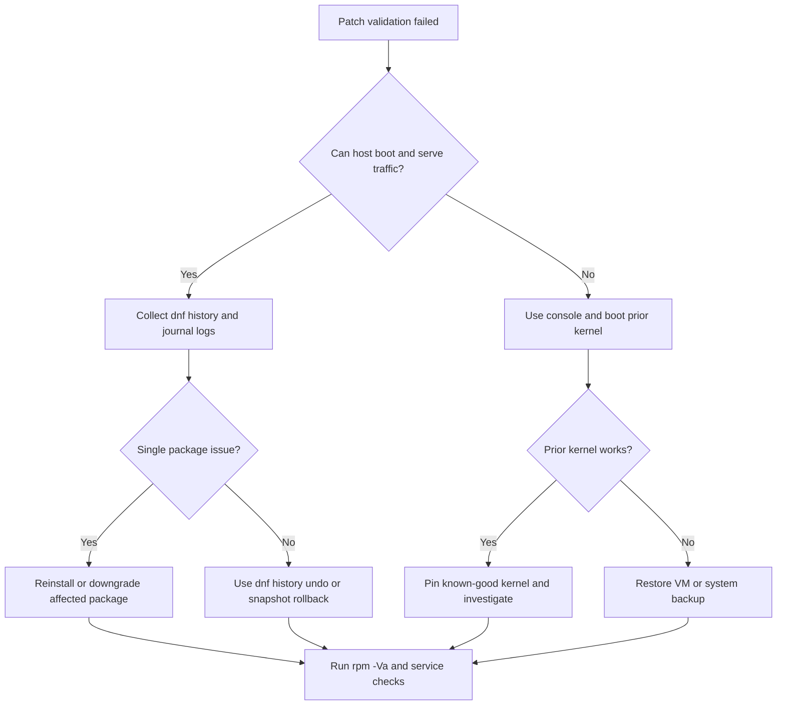

# Advanced RPM Patching

This chapter extends [17-patching-and-vulnerabilities.md](./17-patching-and-vulnerabilities.md) with deeper operational procedures for RPM-based platforms such as RHEL, Rocky Linux, AlmaLinux, Oracle Linux, CentOS Stream, and Fedora. Use it together with [13-Troubleshooting/09-package-issues.md](../13-Troubleshooting/09-package-issues.md) when patching fails, and with [13-Troubleshooting/15-production-incident-playbooks.md](../13-Troubleshooting/15-production-incident-playbooks.md) during live incidents.

## Scope

- Pre-patch preparation for production systems
- Safe workflows for single-server and fleet patching
- RPM internals that affect troubleshooting and change review
- Recovery from interrupted or failed patch cycles
- Satellite, Spacewalk, Katello, and compliance-driven patch management
- Live patching for low-downtime kernel maintenance

## 18.1 Pre-patch checklist

Before you patch anything, verify the basics. Most failed maintenance windows come from skipped preparation rather than from broken packages.

### Operational checklist

1. Confirm the maintenance window and rollback owner.
2. Confirm console access: IPMI, iLO, iDRAC, hypervisor console, or cloud serial console.
3. Snapshot or backup the VM if the platform supports consistent rollback.
4. Back up the RPM database.
5. Confirm free space in `/`, `/var`, and `/boot`.
6. Confirm repositories and subscription status.
7. Review pending errata and application compatibility notes.
8. Capture package and kernel baselines.
9. Stop or drain high-risk workloads if required.
10. Verify that monitoring and alerting are suppressed or annotated for the change window.

### Commands

```bash
sudo date
sudo uname -r
sudo rpm -qa --last | head -20
sudo dnf repolist -v
sudo subscription-manager status
sudo df -h /
sudo df -h /var
sudo df -h /boot
sudo free -h
sudo systemctl --failed
```

### Back up the RPM database

```bash
sudo mkdir -p /root/rpmdb-backups
sudo tar -C /var/lib -czf /root/rpmdb-backups/rpmdb-$(date +%F-%H%M).tar.gz rpm
```

### Capture package inventory

```bash
sudo rpm -qa --qf '%{NAME}-%{VERSION}-%{RELEASE}.%{ARCH}\n' | sort > /root/prepatch-rpm-list.txt
sudo dnf history list > /root/prepatch-dnf-history.txt
sudo grubby --default-kernel
```

## 18.2 Patching workflow overview



## 18.3 Single-server patching with a rollback plan

Use this workflow for standalone servers, jump hosts, utility nodes, or any system that cannot be rotated out of service.

### Step 1: Review what will change

```bash
sudo dnf check-update
sudo dnf updateinfo summary
sudo dnf updateinfo list security
sudo dnf repoquery --upgrades
```

### Step 2: Simulate the transaction

```bash
sudo dnf upgrade --assumeno
```

Look for:

- kernel, glibc, openssl, and systemd updates
- packages with `%pre`, `%post`, `%preun`, or trigger scriptlets that may restart services
- obsoletes or package replacements that may remove compatibility packages

### Step 3: Apply the patch set

```bash
sudo dnf -y upgrade
```

If only security errata are allowed:

```bash
sudo dnf -y upgrade-minimal --security
```

### Step 4: Verify health

```bash
sudo systemctl --failed
sudo dnf history info last
sudo journalctl -p err -b --no-pager
sudo rpm -Va --nomtime --nosize --nolinkto
```

### Step 5: Reboot if required

```bash
sudo needs-restarting -r
sudo reboot
```

### Step 6: Roll back if validation fails

Possible rollback options, in preferred order:

1. Hypervisor or cloud snapshot rollback
2. Restore from system backup
3. `dnf history undo <ID>` if the transaction is self-contained
4. Reinstall specific packages from known-good repositories
5. Boot the previous kernel from GRUB

Example:

```bash
sudo dnf history
sudo dnf history undo 145
sudo grubby --info=ALL | grep -E 'index=|kernel='
```

## 18.4 Rolling patching for multiple servers with Ansible

Rolling updates reduce blast radius. Patch a subset, validate, then continue.

### Design recommendations

- Patch by service tier or availability zone.
- Use `serial` to limit concurrency.
- Drain the node from the load balancer before patching.
- Run pre-checks and post-checks in the same playbook.
- Fail fast on package transaction errors.

### Example inventory

```ini
[web]
web01.example.com
web02.example.com
web03.example.com

[app]
app01.example.com
app02.example.com
```

### Example rolling update playbook

```yaml
---
- name: Rolling RPM patching
  hosts: web
  become: true
  serial: 1
  any_errors_fatal: true

  vars:
    patch_reboot_timeout: 1800

  pre_tasks:
    - name: Ensure enough boot space exists
      ansible.builtin.command: df -Pm /boot
      register: boot_df
      changed_when: false

    - name: Fail if /boot has less than 200 MB free
      ansible.builtin.assert:
        that:
          - (boot_df.stdout_lines[-1].split()[3] | int) > 200
        fail_msg: /boot does not have enough free space for kernel updates

    - name: Back up rpm database
      ansible.builtin.archive:
        path: /var/lib/rpm
        dest: /root/rpmdb-backup-{{ ansible_date_time.iso8601_basic_short }}.tar.gz
        format: gz

    - name: Drain node from load balancer
      ansible.builtin.command: /usr/local/bin/lbctl drain {{ inventory_hostname }}
      changed_when: true

  tasks:
    - name: Refresh metadata
      ansible.builtin.dnf:
        update_cache: true

    - name: Apply updates
      ansible.builtin.dnf:
        name: '*'
        state: latest
      register: patch_result

    - name: Check whether reboot is required
      ansible.builtin.command: needs-restarting -r
      register: reboot_required
      changed_when: false
      failed_when: reboot_required.rc not in [0, 1]

    - name: Reboot if required
      ansible.builtin.reboot:
        reboot_timeout: '{{ patch_reboot_timeout }}'
      when: reboot_required.rc == 1

    - name: Verify service health
      ansible.builtin.command: /usr/local/bin/healthcheck-web.sh
      changed_when: false

  post_tasks:
    - name: Return node to load balancer
      ansible.builtin.command: /usr/local/bin/lbctl undrain {{ inventory_hostname }}
      changed_when: true
```

### Useful Ansible ad hoc commands

```bash
ansible web -b -m dnf -a 'name=* state=latest update_cache=true'
ansible web -b -m command -a 'dnf history info last'
ansible web -b -m reboot
```

## 18.5 Satellite, Spacewalk, and Katello patching

Red Hat Satellite and the open-source Katello stack act as the closest Linux equivalent to WSUS: they mirror content, manage lifecycle environments, publish content views, and report compliance.

### Core concepts

- **Organization**: top-level tenant boundary
- **Location**: physical or logical grouping
- **Lifecycle environment**: Dev, Test, Stage, Prod progression
- **Content view**: curated repository and errata snapshot
- **Activation key**: repeatable host registration profile
- **Host collection**: grouping for bulk patch actions

### Typical workflow

1. Synchronize repositories from Red Hat CDN or upstream mirrors.
2. Filter or pin content into a content view.
3. Publish a new content view version.
4. Promote that version through lifecycle environments.
5. Attach hosts via activation keys and subscriptions.
6. Schedule errata installation or package updates.
7. Review compliance and drift reports.


### Common `hammer` commands

```bash
hammer organization list
hammer product list --organization 'Example Org'
hammer repository synchronize --id 24
hammer content-view publish --name 'RHEL9-Base' --organization 'Example Org'
hammer content-view version promote --content-view 'RHEL9-Base' --to-lifecycle-environment Production --organization 'Example Org'
hammer host errata list --host web01.example.com
hammer job-invocation create \
  --job-template 'Run Command - Script Default' \
  --search-query 'hostgroup = Web' \
  --inputs command='dnf -y update'
```

### Registration example

```bash
sudo subscription-manager register \
  --org='Example Org' \
  --activationkey='rhel9-prod'
```

### When Spacewalk still appears

Spacewalk is legacy and largely replaced by Satellite/Katello, but you may still see it in older environments. The same practical rules apply: controlled repository sync, staged rollout, and clear rollback points.

## 18.6 RPM internals that matter during patching

RPM packages are more than compressed files. Understanding package structure explains why transactions fail.

### Main components

- **Lead**: retained for historical compatibility
- **Signature**: package integrity and origin metadata
- **Header**: package metadata such as name, version, release, dependencies, file list, scripts
- **Payload**: the cpio archive containing files
- **Scriptlets and triggers**: shell or Lua snippets executed before or after install or erase actions

### Inspecting package metadata without installing

```bash
rpm -qpi httpd-2.4.57-5.el9.x86_64.rpm
rpm -qpl httpd-2.4.57-5.el9.x86_64.rpm
rpm -qpR httpd-2.4.57-5.el9.x86_64.rpm
rpm -qp --scripts httpd-2.4.57-5.el9.x86_64.rpm
rpm -Kv httpd-2.4.57-5.el9.x86_64.rpm
```

### Why scriptlets matter

Scriptlets can:

- create users or groups
- migrate config files
- run `systemctl daemon-reload`
- reload service caches
- rebuild icon, font, or linker caches
- invoke SELinux relabel actions

If a patch fails after files are unpacked but before post-install scripts finish, services may be half-upgraded.

## 18.7 Extracting package contents with rpm2cpio

Use `rpm2cpio` when you need a file from an RPM but do not want to install the package.

```bash
mkdir -p /root/rpm-extract/httpd
cd /root/rpm-extract/httpd
rpm2cpio /root/RPMS/httpd-2.4.57-5.el9.x86_64.rpm | cpio -idmv
```

Common use cases:

- recover a default configuration file
- compare a binary against the installed version
- inspect service units or scriptlets before approving deployment

## 18.8 Building custom RPMs

For internal software, RPM packaging gives you repeatable installation, clean upgrades, and verifiable ownership.

### Minimal build prerequisites

```bash
sudo dnf -y install rpm-build rpmdevtools gcc make
rpmdev-setuptree
```

### Example SPEC file

```spec
Name:           hello-ops
Version:        1.0
Release:        1%{?dist}
Summary:        Example operational tool
License:        GPLv3+
URL:            https://example.com/hello-ops
Source0:        %{name}-%{version}.tar.gz
BuildArch:      noarch

%description
Small example package that installs an operational helper script.

%prep
%setup -q

%build
# No compilation required for this example.

%install
mkdir -p %{buildroot}/usr/local/bin
install -m 0755 hello-ops.sh %{buildroot}/usr/local/bin/hello-ops

%files
/usr/local/bin/hello-ops

%changelog
* Thu Jan 16 2025 Ops Team <ops@example.com> - 1.0-1
- Initial package
```

### Build command

```bash
rpmbuild -ba ~/rpmbuild/SPECS/hello-ops.spec
```

## 18.9 RPM signing and verification

Signed packages help you trust both vendor and internal repositories.

### Verify installed and downloaded packages

```bash
rpm -q gpg-pubkey
rpm -Kv /root/RPMS/hello-ops-1.0-1.noarch.rpm
rpm -qi gpg-pubkey-$(rpm -q gpg-pubkey --qf '%{VERSION}-%{RELEASE}\n' | head -1)
```

### Sign an RPM

```bash
rpm --addsign ~/rpmbuild/RPMS/noarch/hello-ops-1.0-1.noarch.rpm
```

### Repository metadata signing reminder

If clients reject a repository even though package signatures are valid, verify `repomd.xml` signatures and imported repository keys. See [13-Troubleshooting/09-package-issues.md](../13-Troubleshooting/09-package-issues.md) for GPG key recovery procedures.

## 18.10 Handling mid-patch failures

Common interruption causes:

- power loss or hypervisor crash
- disk full in `/var`, `/boot`, or `/usr`
- OOM kill during `dnf` or `%post` script execution
- repository timeout in the middle of a large transaction
- accidental reboot or SSH disconnect during critical scriptlets

### Immediate response

1. Do not stack new changes on top of the failure.
2. Capture the last transaction and journal logs.
3. Check RPM database health.
4. Verify disk space and mount state.
5. Complete or repair the package transaction before rebooting again.

### Commands

```bash
sudo dnf history info last
sudo journalctl -b -1 -u dnf* --no-pager
sudo rpm --rebuilddb
sudo dnf check
sudo package-cleanup --problems
sudo package-cleanup --dupes
```

### Recover partial updates

```bash
sudo dnf distro-sync
sudo dnf reinstall <pkgname>
sudo rpm -Va
```

If the RPM database is damaged, jump to [13-Troubleshooting/09-package-issues.md](../13-Troubleshooting/09-package-issues.md#rpm-database-corruption--recovery).

## 18.11 Verifying installed packages with `rpm -Va`

`rpm -Va` compares installed files with package metadata.

Common verification markers:

- `S`: size differs
- `M`: mode differs
- `5`: checksum differs
- `D`: major or minor device number differs
- `L`: symlink path differs
- `U`: owner differs
- `G`: group differs
- `T`: mtime differs
- `P`: capabilities differ

Typical command:

```bash
sudo rpm -Va --nomtime --nosize --nolinkto
```

Use exceptions wisely. Configuration files, logs, and generated caches change legitimately.

## 18.12 Reinstalling corrupted packages

When a package verifies badly and you trust the repository source, reinstall it.

```bash
sudo dnf reinstall openssl-libs
sudo dnf reinstall systemd systemd-libs systemd-pam
sudo rpm -qf /usr/bin/sudo
sudo dnf reinstall sudo
```

For local files from a known-good RPM:

```bash
sudo rpm -Uvh --replacepkgs /root/RPMS/custom-agent-2.1-4.x86_64.rpm
```

## 18.13 Kernel panic after patching

Kernel updates need an explicit recovery path.

### Recovery actions

1. Use console access, not SSH.
2. Select the previous kernel in GRUB.
3. Confirm whether the panic is tied to storage, drivers, initramfs, or a third-party module.
4. Rebuild initramfs if required.
5. Remove or downgrade the broken kernel only after a known-good boot.

### Commands

```bash
sudo grubby --info=ALL
sudo lsinitrd /boot/initramfs-$(uname -r).img | head
sudo dracut -f /boot/initramfs-$(uname -r).img $(uname -r)
sudo dnf remove kernel-core-<bad-version>
```

Also review [12-kernel-management.md](./12-kernel-management.md) and [13-Troubleshooting/15-production-incident-playbooks.md](../13-Troubleshooting/15-production-incident-playbooks.md).

## 18.14 Patch management at scale

At scale, patching is a lifecycle and reporting problem, not just a command problem.

### Recommended practices

- Separate security-only cycles from feature-bearing updates.
- Patch non-production first using the same content view or mirror set.
- Maintain kernel canaries before broad rollout.
- Keep a clear exception process for packages on hold.
- Record errata IDs applied to every environment.

### Errata types

- **RHSA**: Red Hat Security Advisory
- **RHBA**: Red Hat Bug Fix Advisory
- **RHEA**: Red Hat Enhancement Advisory

### Example errata queries

```bash
sudo dnf updateinfo list security
sudo dnf updateinfo info RHSA-2025:1234
hammer erratum list --organization 'Example Org'
```

### Patch compliance reporting

Important reporting questions:

- Which hosts are missing critical or important advisories?
- Which hosts have drifted from the approved content view?
- Which hosts skipped the last maintenance window?
- Which packages were manually installed outside central management?

Satellite or Katello and external CMDB tooling can answer these through host collections, errata status, and compliance exports.

## 18.15 OpenSCAP integration

Use OpenSCAP to connect patch status with vulnerability and policy assessment.

### Install and run a basic scan

```bash
sudo dnf -y install openscap-scanner scap-security-guide
sudo oscap xccdf eval \
  --profile xccdf_org.ssgproject.content_profile_pci-dss \
  --results /root/oscap-results.xml \
  --report /root/oscap-report.html \
  /usr/share/xml/scap/ssg/content/ssg-rhel9-ds.xml
```

### Why it matters

OpenSCAP can show whether missing advisories, weak configuration, or disabled controls leave the host non-compliant even after a successful patch transaction.

## 18.16 Live patching

Live patching reduces reboot pressure for critical kernel fixes.

### Options

- **kpatch** on RHEL-derived distributions
- **Canonical Livepatch** on Ubuntu
- vendor-specific live patch programs from cloud or enterprise providers

### kpatch example

```bash
sudo dnf -y install kpatch kpatch-dnf
sudo systemctl enable --now kpatch.service
sudo kpatch list
sudo uname -r
```

### Operational caveats

- Live patching covers only selected kernel vulnerabilities and bug fixes.
- You still need periodic reboots for full kernel refresh.
- Track the relationship between the running kernel, installed kernel, and applied live patch module.

## 18.17 Rollback decision tree



## 18.18 Post-patch validation checklist

```bash
sudo systemctl --failed
sudo journalctl -p err -b --no-pager
sudo rpm -Va --nomtime --nosize --nolinkto
sudo dnf check
sudo needs-restarting -r
sudo ss -tulpn
```

Validate additionally:

- application login and primary transactions
- backup agent and monitoring agent connectivity
- kernel modules and storage paths
- certificate stores and outbound TLS connections
- cron, timers, and batch workloads

## 18.19 Common anti-patterns

Avoid these habits:

- patching directly in production without a tested rollback path
- ignoring `/boot` capacity before kernel updates
- mixing third-party repositories during maintenance windows
- forcing transactions with `rpm --nodeps` or `--force`
- taking snapshots after the transaction begins
- skipping service validation because `dnf` exited with code `0`

## 18.20 Quick reference

```bash
# metadata and update review
sudo dnf clean all
sudo dnf makecache
sudo dnf check-update
sudo dnf updateinfo summary

# package history
sudo dnf history
sudo dnf history info last
sudo dnf history undo <ID>

# rpm validation
sudo rpm -Va
sudo rpm -qf /path/to/file
sudo rpm -qp --scripts package.rpm

# repository and subscription validation
sudo subscription-manager status
sudo subscription-manager repos --list-enabled
sudo dnf repolist -v
```

## 18.21 Summary

Advanced patching is mostly about discipline: validate inputs, patch in controlled batches, verify outputs, and keep an immediate recovery path. Use this chapter for mature workflows, then use the troubleshooting guides when package state, boot state, or application state goes bad.
