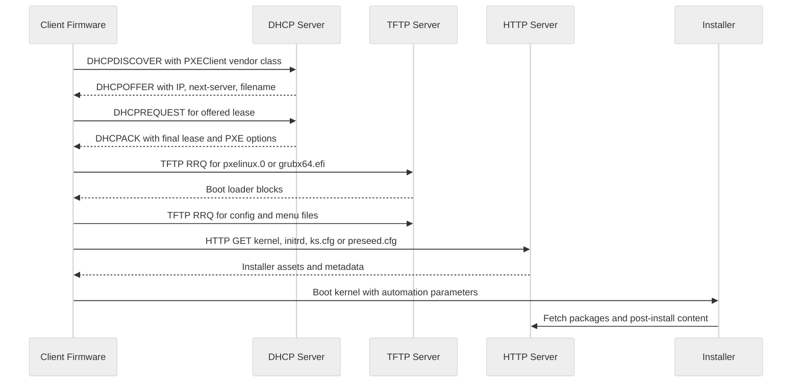
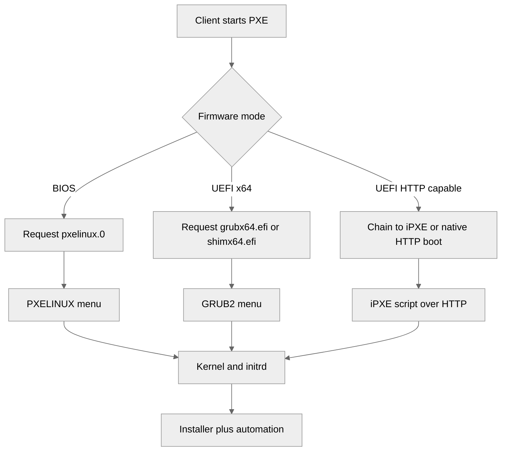
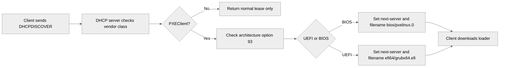
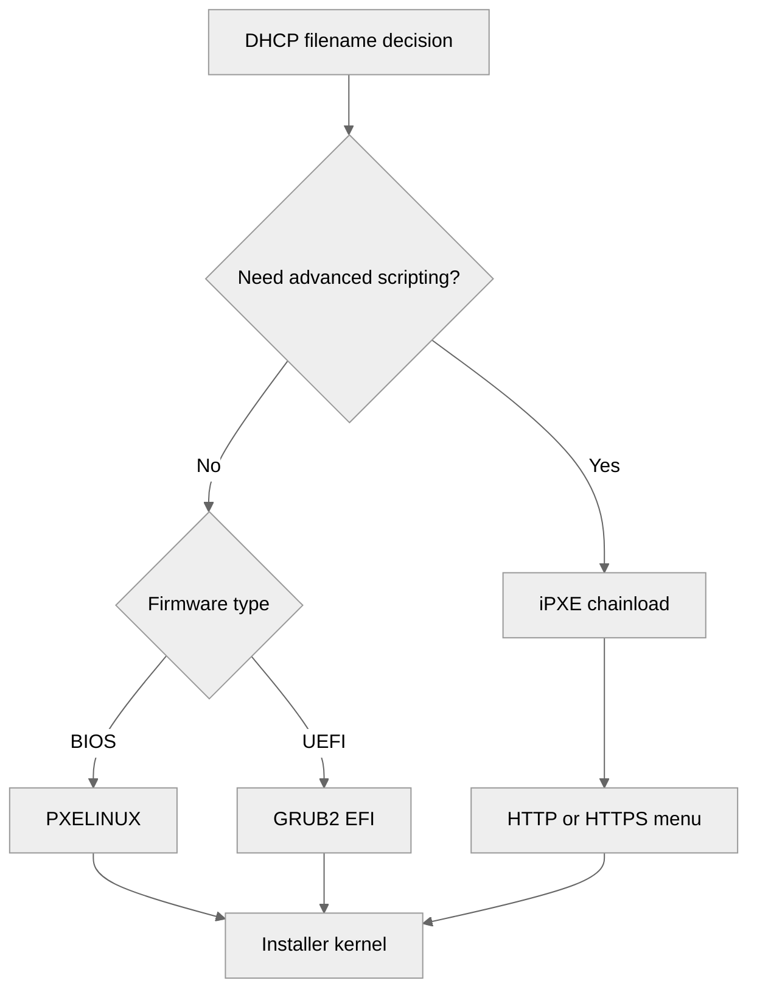
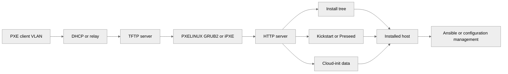
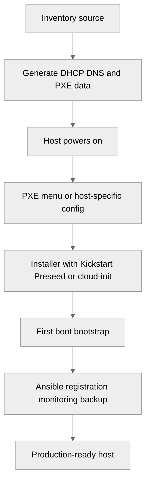

# PXE Boot and Network Installation Guide

---

<a id="pxe-boot-network-installation"></a>
## 🖧 PXE Boot and Network Installation Guide

This guide is the dedicated PXE and network installation reference for Shasi-Linux.
It expands on the DHCP basics in [16-dhcp-server.md](./16-dhcp-server.md), complements the DNS guidance in [14-dns-server.md](./14-dns-server.md), and builds on the automated installation notes in [../Physical-Setup/02-os-installation-and-hardening.md](../Physical-Setup/02-os-installation-and-hardening.md).

Use this file when you need repeatable bare-metal or VM provisioning at rack scale, remote branch scale, or lab scale.

## Scope

This guide covers:

- PXE fundamentals and packet flow.
- DHCP options required for PXE.
- TFTP service layout and validation.
- PXELINUX, GRUB2, and iPXE boot loaders.
- HTTP and FTP install trees.
- Automated provisioning with Kickstart and Preseed.
- Cloud-init integration for hybrid workflows.
- Multi-OS, WAN, imaging, and provisioning platform scenarios.
- Troubleshooting and scale-out operations.

## When PXE is the right tool

PXE is a strong choice when you need:

- Hands-off OS deployment for repeated builds.
- Consistent partitioning and package baselines.
- Fast rebuilds after hardware replacement.
- A central place to manage install media and automation.
- A bridge between bare-metal deployment and post-install configuration tools such as Ansible.

PXE is less attractive when:

- The network does not permit DHCP relay or boot traffic.
- Remote sites cannot reliably reach the provisioning network.
- You need internet-based installs with no TFTP support and should use iPXE plus HTTP only.

## PXE fundamentals

### What is PXE

PXE stands for Preboot Execution Environment.
It is a firmware-assisted boot process that lets a machine obtain network settings, download bootstrap code, and start an installer or imaging environment before any local operating system is present.

Core PXE building blocks:

- **DHCP** gives the client an address and tells it where to fetch boot files.
- **TFTP** commonly serves the first-stage boot loader.
- **HTTP or FTP** often serves large files such as kernels, initramfs images, package repositories, and automated install data.
- **Boot loaders** such as PXELINUX, GRUB2, or iPXE provide menus and kernel arguments.
- **Installer automation** such as Kickstart or Preseed makes the installation unattended.

### PXE boot process



### Step-by-step explanation

1. The NIC firmware starts in PXE mode.
2. The client broadcasts for DHCP.
3. The DHCP server or relay returns an address plus PXE boot information.
4. The client downloads a first-stage boot loader from `next-server` using `filename`.
5. The boot loader downloads configuration, menus, kernel, and initramfs.
6. The installer starts and reads automation data such as Kickstart, Preseed, or cloud-init metadata.
7. The system installs from HTTP, FTP, or NFS content.
8. The host reboots into the newly installed OS.

### BIOS versus UEFI PXE

| Topic | BIOS PXE | UEFI PXE |
|---|---|---|
| Common loader | `pxelinux.0` | `grubx64.efi`, `shimx64.efi`, `ipxe.efi` |
| Partition style | Often MBR | Usually GPT |
| Boot partition | `/boot` | `/boot/efi` with EFI System Partition |
| Secure Boot | Not available in the same modern sense | Supported with signed shim and GRUB |
| Architecture signaling | Legacy or architecture code `00:00` | Often `00:07`, `00:09`, `00:0b` |
| Config style | `pxelinux.cfg/default` or MAC-specific files | `grub.cfg`, per-host GRUB menu, or iPXE script |
| Long-term recommendation | Keep only for legacy hardware | Prefer for current platforms |

Practical advice:

- Standardize on UEFI for new hardware.
- Keep BIOS support only if older servers still require it.
- Test boot file selection with mixed firmware generations because vendors sometimes report architecture values differently.

### BIOS and UEFI decision points



## DHCP configuration for PXE

For DHCP fundamentals, review [16-dhcp-server.md](./16-dhcp-server.md).
This section adds PXE-specific directives and architecture-aware logic.

### Key DHCP directives for PXE

- `next-server` tells the client which server hosts boot files.
- `filename` tells the client which boot file to request first.
- DHCP option 66 maps to the TFTP server name or address.
- DHCP option 67 maps to the boot file name.
- Vendor-class and architecture detection allow different boot files for BIOS and UEFI.

### Option 66 and option 67 mapping

In many DHCP implementations:

- **Option 66** = boot server hostname or IP.
- **Option 67** = boot file path.

In ISC DHCP you usually express these as:

```conf
next-server 192.168.50.20;
filename "pxelinux.0";
```

### Full ISC DHCP server configuration with PXE options

Example `/etc/dhcp/dhcpd.conf` for a PXE VLAN:

```conf
authoritative;
default-lease-time 900;
max-lease-time 7200;
log-facility local7;
ddns-update-style none;
allow booting;
allow bootp;

option space PXE;
option PXE.mtftp-ip code 1 = ip-address;
option PXE.mtftp-cport code 2 = unsigned integer 16;
option PXE.mtftp-sport code 3 = unsigned integer 16;
option PXE.mtftp-tmout code 4 = unsigned integer 8;
option PXE.mtftp-delay code 5 = unsigned integer 8;
option arch code 93 = unsigned integer 16;
option vendor-class-identifier code 60 = text;

option domain-name "lab.example.internal";
option domain-name-servers 192.168.50.10, 192.168.50.11;
option ntp-servers 192.168.50.12;

class "pxeclients" {
    match if substring(option vendor-class-identifier, 0, 9) = "PXEClient";

    next-server 192.168.50.20;

    if option arch = 00:00 {
        filename "bios/pxelinux.0";
    } else if option arch = 00:06 {
        filename "efi32/grubia32.efi";
    } else if option arch = 00:07 {
        filename "efi64/grubx64.efi";
    } else if option arch = 00:09 {
        filename "efi64/grubx64.efi";
    } else if option arch = 00:0b {
        filename "aa64/grubaa64.efi";
    } else {
        filename "bios/pxelinux.0";
    }
}

subnet 192.168.50.0 netmask 255.255.255.0 {
    range 192.168.50.100 192.168.50.199;
    option routers 192.168.50.1;
    option subnet-mask 255.255.255.0;
    option broadcast-address 192.168.50.255;
    option domain-name "lab.example.internal";
    option domain-name-servers 192.168.50.10, 192.168.50.11;
    option ntp-servers 192.168.50.12;

    pool {
        allow members of "pxeclients";
        range 192.168.50.100 192.168.50.150;
    }

    pool {
        deny members of "pxeclients";
        range 192.168.50.151 192.168.50.199;
    }

    host web01 {
        hardware ethernet 52:54:00:10:10:01;
        fixed-address 192.168.50.21;
        option host-name "web01";
        if option arch = 00:07 or option arch = 00:09 {
            filename "efi64/grubx64.efi";
        } else {
            filename "bios/pxelinux.0";
        }
        next-server 192.168.50.20;
    }

    host db01 {
        hardware ethernet 52:54:00:10:10:02;
        fixed-address 192.168.50.22;
        option host-name "db01";
        if exists user-class and option user-class = "iPXE" {
            filename "http://192.168.50.20/ipxe/rocky9.ipxe";
        } else {
            filename "ipxe/undionly.kpxe";
        }
        next-server 192.168.50.20;
    }
}
```

### How the ISC DHCP example works

- The server is authoritative for the PXE VLAN.
- Clients advertising `PXEClient` enter a dedicated class.
- Architecture code 93 determines the loader.
- A host-specific block can override the generic menu.
- The `db01` example chainloads iPXE for HTTP-based provisioning.

### Validating ISC DHCP configuration

```bash
sudo dhcpd -t -cf /etc/dhcp/dhcpd.conf
sudo systemctl enable --now dhcpd
sudo journalctl -u dhcpd --since -30m
```

On Debian or Ubuntu, substitute `isc-dhcp-server` where appropriate:

```bash
sudo systemctl enable --now isc-dhcp-server
sudo journalctl -u isc-dhcp-server --since -30m
```

### UEFI and BIOS boot file selection notes

Common architecture code values you will see:

| Code | Meaning | Typical file |
|---|---|---|
| `00:00` | BIOS x86 | `bios/pxelinux.0` |
| `00:06` | UEFI IA32 | `efi32/grubia32.efi` |
| `00:07` | UEFI BC | `efi64/grubx64.efi` on some vendors |
| `00:09` | UEFI x86_64 | `efi64/grubx64.efi` |
| `00:0b` | UEFI ARM64 | `aa64/grubaa64.efi` |

Vendor firmware can be inconsistent.
Always capture a real DHCP exchange with `tcpdump` before finalizing production logic.

### DHCP PXE option flow



### DHCP relay considerations for PXE

If the PXE server is not on the same Layer 2 segment:

- Configure IP helper or DHCP relay on the router or switch SVI.
- Ensure the relay forwards DHCP broadcast traffic to the DHCP server.
- Permit UDP 67 and 68 through firewalls.
- Ensure the `next-server` is reachable from the client subnet.

Cisco-style example:

```text
interface Vlan150
 description PXE_CLIENTS
 ip address 192.168.150.1 255.255.255.0
 ip helper-address 192.168.50.5
```

Linux relay example with `dhcrelay`:

```bash
sudo dnf install -y dhcp-relay
sudo dhcrelay -d -i eno1 192.168.50.5
```

### dnsmasq as a lightweight PXE alternative

`dnsmasq` combines DHCP, TFTP, and optional DNS in a single lightweight service.
It is useful for labs, edge sites, and isolated build networks.

Install on a RHEL-family system:

```bash
sudo dnf install -y dnsmasq syslinux-tftpboot
```

Install on Debian or Ubuntu:

```bash
sudo apt update
sudo apt install -y dnsmasq pxelinux syslinux-common
```

Example `/etc/dnsmasq.d/pxe.conf`:

```conf
interface=eno1
bind-interfaces
port=0
log-dhcp

dhcp-range=192.168.60.100,192.168.60.199,255.255.255.0,12h
dhcp-option=option:router,192.168.60.1
dhcp-option=option:dns-server,192.168.50.10,192.168.50.11
dhcp-option=option:ntp-server,192.168.50.12

# Option 66 / next-server equivalent.
dhcp-boot=tag:bios,bios/pxelinux.0,pxeserver,192.168.60.20

enable-tftp
tftp-root=/var/lib/tftpboot

# Architecture tags.
dhcp-match=set:efi64,option:client-arch,9
dhcp-match=set:efi64,option:client-arch,7
dhcp-match=set:efi32,option:client-arch,6

# BIOS default.
dhcp-match=set:bios,option:client-arch,0

dhcp-boot=tag:efi64,efi64/grubx64.efi,pxeserver,192.168.60.20
dhcp-boot=tag:efi32,efi32/grubia32.efi,pxeserver,192.168.60.20
dhcp-boot=tag:bios,bios/pxelinux.0,pxeserver,192.168.60.20

pxe-service=tag:bios,X86PC,"Network Install",bios/pxelinux.0
pxe-service=tag:efi64,X86-64_EFI,"UEFI Network Install",efi64/grubx64.efi
```

Enable and inspect:

```bash
sudo systemctl enable --now dnsmasq
sudo journalctl -u dnsmasq --since -30m
```

When to choose `dnsmasq`:

- Small labs.
- Branch office imaging.
- Test networks.
- Disposable environments where full ISC DHCP or Kea is overkill.

When not to choose it:

- Complex enterprise failover needs.
- Heavy DDNS integration.
- Large multi-team networks with many change points.

## TFTP server setup

TFTP is usually only for the first-stage loader and small config files.
For larger payloads, prefer HTTP.

### Installing TFTP server packages

RHEL-family with systemd socket activation:

```bash
sudo dnf install -y tftp-server syslinux syslinux-tftpboot
```

Debian or Ubuntu:

```bash
sudo apt update
sudo apt install -y tftpd-hpa pxelinux syslinux-common
```

### TFTP directory structure

A practical layout under `/var/lib/tftpboot/`:

```text
/var/lib/tftpboot/
├── bios/
│   ├── pxelinux.0
│   ├── ldlinux.c32
│   ├── libcom32.c32
│   ├── libutil.c32
│   ├── menu.c32
│   ├── vesamenu.c32
│   └── pxelinux.cfg/
│       ├── default
│       ├── 01-52-54-00-10-10-01
│       └── C0A83215
├── efi64/
│   ├── grubx64.efi
│   ├── shimx64.efi
│   ├── grub.cfg
│   └── fonts/
├── ipxe/
│   ├── undionly.kpxe
│   ├── ipxe.efi
│   └── menu.ipxe
└── images/
    ├── rocky9/
    │   ├── vmlinuz
    │   └── initrd.img
    ├── rhel9/
    └── ubuntu2204/
```

### Copying required files into the TFTP root

RHEL-family example:

```bash
sudo mkdir -p /var/lib/tftpboot/bios/pxelinux.cfg /var/lib/tftpboot/efi64 /var/lib/tftpboot/ipxe
sudo cp /usr/share/syslinux/pxelinux.0 /var/lib/tftpboot/bios/
sudo cp /usr/share/syslinux/{ldlinux.c32,libcom32.c32,libutil.c32,menu.c32,vesamenu.c32} /var/lib/tftpboot/bios/
sudo cp /boot/efi/EFI/rocky/grubx64.efi /var/lib/tftpboot/efi64/
```

Debian or Ubuntu example:

```bash
sudo mkdir -p /srv/tftp/bios/pxelinux.cfg /srv/tftp/efi64
sudo cp /usr/lib/PXELINUX/pxelinux.0 /srv/tftp/bios/
sudo cp /usr/lib/syslinux/modules/bios/{ldlinux.c32,libcom32.c32,libutil.c32,menu.c32,vesamenu.c32} /srv/tftp/bios/
```

### RHEL-family TFTP using systemd socket

Enable socket activation:

```bash
sudo systemctl enable --now tftp.socket
sudo systemctl status tftp.socket
```

If your distribution ships `in.tftpd` with a dedicated service unit, verify the socket path and root directory using:

```bash
systemctl cat tftp.socket
systemctl cat tftp.service
```

### Legacy xinetd example

Older environments may still use xinetd.
Example `/etc/xinetd.d/tftp`:

```conf
service tftp
{
    socket_type             = dgram
    protocol                = udp
    wait                    = yes
    user                    = root
    server                  = /usr/sbin/in.tftpd
    server_args             = -s /var/lib/tftpboot
    disable                 = no
    per_source              = 11
    cps                     = 100 2
    flags                   = IPv4
}
```

Then enable xinetd:

```bash
sudo systemctl enable --now xinetd
```

### Debian or Ubuntu `tftpd-hpa` example

Example `/etc/default/tftpd-hpa`:

```bash
TFTP_USERNAME="tftp"
TFTP_DIRECTORY="/srv/tftp"
TFTP_ADDRESS=":69"
TFTP_OPTIONS="--secure --create --verbose"
```

Apply changes:

```bash
sudo systemctl restart tftpd-hpa
sudo systemctl enable tftpd-hpa
```

### Firewall and SELinux

Open TFTP on RHEL-family systems:

```bash
sudo firewall-cmd --permanent --add-service=tftp
sudo firewall-cmd --reload
```

Restore SELinux labels if using `/var/lib/tftpboot`:

```bash
sudo restorecon -Rv /var/lib/tftpboot
```

If you use a custom path, define the context first:

```bash
sudo semanage fcontext -a -t tftpdir_rw_t "/srv/tftp(/.*)?"
sudo restorecon -Rv /srv/tftp
```

### Permissions guidance

- Keep boot files world-readable.
- Avoid write access for regular users.
- Use root ownership for boot loaders and configs.
- If automation updates menus, grant write permission only to the deployment process account.

Example:

```bash
sudo chown -R root:root /var/lib/tftpboot
sudo find /var/lib/tftpboot -type d -exec chmod 755 {} \;
sudo find /var/lib/tftpboot -type f -exec chmod 644 {} \;
```

### Testing with a TFTP client

Install client packages if needed:

```bash
sudo dnf install -y tftp
sudo apt install -y tftp-hpa
```

Fetch a boot loader manually:

```bash
tftp 192.168.50.20 -c get bios/pxelinux.0
file pxelinux.0
```

Interactive test mode:

```bash
tftp 192.168.50.20
binary
get efi64/grubx64.efi
quit
```

A successful test proves:

- UDP 69 is reachable.
- The TFTP root path is correct.
- File permissions and SELinux are not blocking access.

## PXE boot loaders

### Choosing the right boot loader

| Loader | Best for | Notes |
|---|---|---|
| PXELINUX | BIOS fleets and simple menus | Mature, common, easy to troubleshoot |
| GRUB2 UEFI | Modern UEFI systems | Required for many current servers |
| iPXE | HTTP boot, scripting, WAN scenarios | Best for advanced automation and speed |

### PXELINUX for BIOS

PXELINUX reads `pxelinux.cfg/default` and optionally MAC-specific or IP-specific files.
Search order commonly includes:

- `01-<mac-address>`
- Hex representation of the client IP
- `default`

Example BIOS menu at `/var/lib/tftpboot/bios/pxelinux.cfg/default`:

```conf
DEFAULT vesamenu.c32
PROMPT 0
TIMEOUT 80
ONTIMEOUT local
MENU TITLE Shasi-Linux PXE Menu
MENU BACKGROUND splash.png
NOESCAPE 1
ALLOWOPTIONS 1
MENU COLOR title 1;36;44 #ffffffff #00000000 std
MENU COLOR sel 7;37;40 #ff000000 #ffffffff all

LABEL rocky9-minimal
    MENU LABEL Rocky Linux 9 - Minimal Kickstart
    KERNEL images/rocky9/vmlinuz
    APPEND initrd=images/rocky9/initrd.img inst.repo=http://192.168.50.20/os/rocky/9/BaseOS/x86_64 inst.ks=http://192.168.50.20/kickstart/ks-minimal.cfg ip=dhcp BOOTIF=01-${net0/mac}

LABEL rocky9-web
    MENU LABEL Rocky Linux 9 - Web Server
    KERNEL images/rocky9/vmlinuz
    APPEND initrd=images/rocky9/initrd.img inst.repo=http://192.168.50.20/os/rocky/9/BaseOS/x86_64 inst.ks=http://192.168.50.20/kickstart/ks-web.cfg ip=dhcp nameserver=192.168.50.10

LABEL rocky9-db
    MENU LABEL Rocky Linux 9 - Database Server
    KERNEL images/rocky9/vmlinuz
    APPEND initrd=images/rocky9/initrd.img inst.repo=http://192.168.50.20/os/rocky/9/BaseOS/x86_64 inst.ks=http://192.168.50.20/kickstart/ks-db.cfg ip=dhcp rd.neednet=1

LABEL rhel9-minimal
    MENU LABEL RHEL 9 - Minimal
    KERNEL images/rhel9/vmlinuz
    APPEND initrd=images/rhel9/initrd.img inst.repo=http://192.168.50.20/os/rhel/9/BaseOS/x86_64 inst.ks=http://192.168.50.20/kickstart/rhel9-minimal.cfg ip=dhcp

LABEL ubuntu2204
    MENU LABEL Ubuntu 22.04 - Preseed Install
    KERNEL images/ubuntu2204/linux
    APPEND initrd=images/ubuntu2204/initrd.gz auto=true priority=critical url=http://192.168.50.20/preseed/ubuntu2204.cfg ip=dhcp interface=auto netcfg/choose_interface=auto

LABEL ubuntu2404-live
    MENU LABEL Ubuntu 24.04 - HTTP Live Installer
    KERNEL images/ubuntu2404/vmlinuz
    APPEND initrd=images/ubuntu2404/initrd ip=dhcp url=http://192.168.50.20/os/ubuntu/24.04/casper/filesystem.squashfs autoinstall ds=nocloud-net\;s=http://192.168.50.20/cloud-init/ubuntu2404/

LABEL clonezilla
    MENU LABEL Clonezilla Live - Imaging
    KERNEL images/clonezilla/vmlinuz
    APPEND initrd=images/clonezilla/initrd.img boot=live union=overlay username=user config components noswap edd=on nomodeset netboot=http fetch=http://192.168.50.20/os/clonezilla/filesystem.squashfs ocs_live_run="ocs-live-general" ocs_live_batch="yes" locales=en_US.UTF-8 keyboard-layouts=us

LABEL firmware-tools
    MENU LABEL Hardware Tools
    KERNEL memdisk
    APPEND iso raw initrd=images/tools/hwdiag.iso

LABEL local
    MENU LABEL Boot from local disk
    LOCALBOOT 0
```

### Host-specific PXELINUX menus

For per-host automation, create a MAC-based file such as `/var/lib/tftpboot/bios/pxelinux.cfg/01-52-54-00-10-10-01`:

```conf
DEFAULT rocky9-web
PROMPT 0
TIMEOUT 20
MENU TITLE web01 dedicated build

LABEL rocky9-web
    MENU LABEL Install web01 from dedicated Kickstart
    KERNEL images/rocky9/vmlinuz
    APPEND initrd=images/rocky9/initrd.img inst.repo=http://192.168.50.20/os/rocky/9/BaseOS/x86_64 inst.ks=http://192.168.50.20/kickstart/hosts/web01.cfg ip=dhcp hostname=web01.lab.example.internal
```

### Syslinux menu tuning

Useful directives:

- `TIMEOUT 80` waits 8 seconds.
- `ONTIMEOUT local` falls back to local disk when nobody selects a menu entry.
- `MENU BACKGROUND splash.png` adds branding.
- `PROMPT 0` hides the boot prompt.
- `MENU DEFAULT` marks the default entry.

Example default entry:

```conf
LABEL rocky9-minimal
    MENU LABEL Rocky Linux 9 - Minimal Kickstart
    MENU DEFAULT
    KERNEL images/rocky9/vmlinuz
    APPEND initrd=images/rocky9/initrd.img inst.repo=http://192.168.50.20/os/rocky/9/BaseOS/x86_64 inst.ks=http://192.168.50.20/kickstart/ks-minimal.cfg ip=dhcp
```

### GRUB2 for UEFI PXE

GRUB2 is the standard choice for UEFI PXE.
Store `grubx64.efi` and `grub.cfg` in the TFTP tree.

Example `/var/lib/tftpboot/efi64/grub.cfg`:

```conf
set default=0
set timeout=10
set timeout_style=menu
set gfxpayload=keep
set menu_color_normal=white/black
set menu_color_highlight=black/light-gray

menuentry 'Rocky Linux 9 - Minimal Kickstart' {
    linuxefi /images/rocky9/vmlinuz ip=dhcp inst.repo=http://192.168.50.20/os/rocky/9/BaseOS/x86_64 inst.ks=http://192.168.50.20/kickstart/ks-minimal.cfg BOOTIF=${net_default_mac}
    initrdefi /images/rocky9/initrd.img
}

menuentry 'Rocky Linux 9 - Web Server' {
    linuxefi /images/rocky9/vmlinuz ip=dhcp inst.repo=http://192.168.50.20/os/rocky/9/BaseOS/x86_64 inst.ks=http://192.168.50.20/kickstart/ks-web.cfg
    initrdefi /images/rocky9/initrd.img
}

menuentry 'RHEL 9 - Minimal' {
    linuxefi /images/rhel9/vmlinuz ip=dhcp inst.repo=http://192.168.50.20/os/rhel/9/BaseOS/x86_64 inst.ks=http://192.168.50.20/kickstart/rhel9-minimal.cfg
    initrdefi /images/rhel9/initrd.img
}

menuentry 'Ubuntu 22.04 - Preseed' {
    linuxefi /images/ubuntu2204/linux ip=dhcp url=http://192.168.50.20/preseed/ubuntu2204.cfg auto=true priority=critical
    initrdefi /images/ubuntu2204/initrd.gz
}

menuentry 'Ubuntu 24.04 - Autoinstall with cloud-init' {
    linuxefi /images/ubuntu2404/vmlinuz ip=dhcp root=/dev/ram0 ramdisk_size=1500000 url=http://192.168.50.20/os/ubuntu/24.04/casper/filesystem.squashfs autoinstall ds=nocloud-net\;s=http://192.168.50.20/cloud-init/ubuntu2404/
    initrdefi /images/ubuntu2404/initrd
}

menuentry 'Local disk' {
    exit
}
```

### Secure Boot note for UEFI PXE

If Secure Boot is enabled, use a signed shim and signed GRUB binary.
Typical flow:

- DHCP hands out `shimx64.efi`.
- Shim verifies `grubx64.efi`.
- GRUB loads signed kernel and initramfs content.

### iPXE overview

iPXE extends PXE with:

- HTTP, HTTPS, iSCSI, and AoE support.
- Better scripting and menu logic.
- Faster transfers than TFTP for large payloads.
- Easier WAN-friendly designs.

Install common iPXE packages:

```bash
sudo dnf install -y ipxe-bootimgs-x86
sudo apt install -y ipxe
```

Common chainload pattern:

1. NIC firmware PXE boots via DHCP.
2. DHCP gives `undionly.kpxe` for BIOS or `ipxe.efi` for UEFI.
3. iPXE starts and downloads a script over HTTP.
4. The script loads the menu, kernel, initramfs, and automation config.

Example iPXE script at `http://192.168.50.20/ipxe/menu.ipxe`:

```ipxe
#!ipxe
set base-url http://192.168.50.20
menu Shasi-Linux iPXE Menu
item --gap -- ---------------- Linux Installers ----------------
item rocky9-minimal Rocky Linux 9 - Minimal
item rocky9-web Rocky Linux 9 - Web Server
item rocky9-db Rocky Linux 9 - Database Server
item ubuntu2204 Ubuntu 22.04 - Preseed
item ubuntu2404 Ubuntu 24.04 - Autoinstall
item clonezilla Clonezilla Live
item shell Drop to iPXE shell
choose --default rocky9-minimal --timeout 10000 target && goto ${target}

:rocky9-minimal
kernel ${base-url}/images/rocky9/vmlinuz ip=dhcp inst.repo=${base-url}/os/rocky/9/BaseOS/x86_64 inst.ks=${base-url}/kickstart/ks-minimal.cfg
initrd ${base-url}/images/rocky9/initrd.img
autoboot

:rocky9-web
kernel ${base-url}/images/rocky9/vmlinuz ip=dhcp inst.repo=${base-url}/os/rocky/9/BaseOS/x86_64 inst.ks=${base-url}/kickstart/ks-web.cfg
initrd ${base-url}/images/rocky9/initrd.img
autoboot

:rocky9-db
kernel ${base-url}/images/rocky9/vmlinuz ip=dhcp inst.repo=${base-url}/os/rocky/9/BaseOS/x86_64 inst.ks=${base-url}/kickstart/ks-db.cfg
initrd ${base-url}/images/rocky9/initrd.img
autoboot

:ubuntu2204
kernel ${base-url}/images/ubuntu2204/linux auto=true priority=critical url=${base-url}/preseed/ubuntu2204.cfg ip=dhcp
initrd ${base-url}/images/ubuntu2204/initrd.gz
boot

:ubuntu2404
kernel ${base-url}/images/ubuntu2404/vmlinuz ip=dhcp root=/dev/ram0 ramdisk_size=1500000 url=${base-url}/os/ubuntu/24.04/casper/filesystem.squashfs autoinstall ds=nocloud-net;s=${base-url}/cloud-init/ubuntu2404/
initrd ${base-url}/images/ubuntu2404/initrd
boot

:clonezilla
kernel ${base-url}/images/clonezilla/vmlinuz boot=live union=overlay fetch=${base-url}/os/clonezilla/filesystem.squashfs ip=dhcp
initrd ${base-url}/images/clonezilla/initrd.img
boot

:shell
shell
```

### Boot loader selection strategy



## HTTP or FTP server for install media

Large installer assets should be served over HTTP whenever possible.
TFTP is slow and chatty for big transfers.

### Why HTTP is preferred

- Faster than TFTP for large files.
- Easier to cache and protect.
- Supports HTTPS for integrity and confidentiality.
- Works naturally with iPXE.

### Apache setup for install trees

Install Apache:

```bash
sudo dnf install -y httpd createrepo_c
sudo apt install -y apache2 createrepo-c
```

Create directories:

```bash
sudo mkdir -p /var/www/html/os/rocky/9 /var/www/html/os/rhel/9 /var/www/html/os/ubuntu/22.04 /var/www/html/kickstart /var/www/html/preseed /var/www/html/cloud-init
```

Mount an ISO and copy content:

```bash
sudo mount -o loop Rocky-9.3-x86_64-dvd.iso /mnt
sudo rsync -avh /mnt/ /var/www/html/os/rocky/9/
sudo umount /mnt
```

Minimal Apache virtual host:

```apache
<VirtualHost *:80>
    ServerName pxe.lab.example.internal
    DocumentRoot /var/www/html

    <Directory /var/www/html>
        Options Indexes FollowSymLinks
        AllowOverride None
        Require all granted
    </Directory>

    ErrorLog /var/log/httpd/pxe_error.log
    CustomLog /var/log/httpd/pxe_access.log combined
</VirtualHost>
```

Enable and test:

```bash
sudo systemctl enable --now httpd
curl -I http://192.168.50.20/os/rocky/9/BaseOS/
```

Debian or Ubuntu service name:

```bash
sudo systemctl enable --now apache2
```

### Nginx as an alternative

Install Nginx:

```bash
sudo dnf install -y nginx
sudo apt install -y nginx
```

Example Nginx server block:

```nginx
server {
    listen 80;
    server_name pxe.lab.example.internal;
    root /var/www/html;
    autoindex on;

    location / {
        try_files $uri $uri/ =404;
    }

    location /kickstart/ {
        add_header Cache-Control "no-store";
    }
}
```

Enable and test:

```bash
sudo systemctl enable --now nginx
curl -I http://192.168.50.20/kickstart/ks-minimal.cfg
```

### FTP for legacy installers

If a legacy workflow requires FTP:

```bash
sudo dnf install -y vsftpd
sudo systemctl enable --now vsftpd
```

Installer boot parameters can then use:

```text
inst.repo=ftp://192.168.50.20/pub/rocky/9
```

HTTP remains the better default.

### Building a custom repository with `createrepo`

Use this when you add internal RPMs or override packages.

```bash
sudo mkdir -p /var/www/html/repos/internal/baseos
sudo cp /srv/packages/*.rpm /var/www/html/repos/internal/baseos/
sudo createrepo_c /var/www/html/repos/internal/baseos
```

Add the repository in Kickstart:

```kickstart
repo --name=internal-baseos --baseurl=http://192.168.50.20/repos/internal/baseos
```

### Complete PXE infrastructure



## Kickstart for RHEL, CentOS Stream, Rocky, and AlmaLinux

Kickstart is the preferred unattended install format for the RHEL family.
If you need automation patterns beyond the short examples in [../Physical-Setup/02-os-installation-and-hardening.md](../Physical-Setup/02-os-installation-and-hardening.md), use this section.

### Kickstart design principles

- Keep common directives in a shared base file.
- Separate storage profiles for LVM, standard partitions, and software RAID.
- Use HTTP repositories and versioned paths.
- Keep secrets out of publicly reachable web roots.
- Make post-install actions idempotent.

### Full example `ks.cfg`

The following example uses a `%pre` script to choose a storage profile, includes custom repositories, creates users, configures security defaults, and performs common post-install tasks.

```kickstart
#version=RHEL9
text
cmdline
lang en_US.UTF-8
keyboard us
timezone UTC --utc
network --bootproto=dhcp --device=link --activate --hostname=unprovisioned.lab.example.internal
rootpw --iscrypted $6$rounds=4096$ReplaceWithRealHash$ReplaceWithRealHashValue
firewall --enabled --service=ssh
selinux --enforcing
firstboot --disable
services --enabled=sshd,chronyd,NetworkManager
bootloader --location=boot --append="console=tty0 console=ttyS1,115200n8 audit=1 crashkernel=auto"
zerombr
clearpart --all --initlabel
skipx
reboot
url --url="http://192.168.50.20/os/rocky/9/BaseOS/x86_64"
repo --name=AppStream --baseurl=http://192.168.50.20/os/rocky/9/AppStream/x86_64
repo --name=internal-base --baseurl=http://192.168.50.20/repos/internal/baseos
repo --name=internal-tools --baseurl=http://192.168.50.20/repos/internal/tools

%pre --log=/tmp/ks-pre.log --interpreter=/bin/bash
set -eux
profile="${KS_STORAGE_PROFILE:-lvm}"
if grep -q 'storage=raid' /proc/cmdline; then
    profile="raid"
elif grep -q 'storage=standard' /proc/cmdline; then
    profile="standard"
fi

case "$profile" in
  lvm)
    cat > /tmp/storage.ks <<'STORAGE'
part /boot/efi --fstype=efi --size=600
part /boot --fstype=xfs --size=1024
part pv.01 --size=1 --grow
volgroup vg_sys pv.01
logvol / --fstype=xfs --name=lv_root --vgname=vg_sys --size=20480
logvol /var --fstype=xfs --name=lv_var --vgname=vg_sys --size=20480
logvol /var/log --fstype=xfs --name=lv_var_log --vgname=vg_sys --size=10240
logvol /tmp --fstype=xfs --name=lv_tmp --vgname=vg_sys --size=8192
logvol /home --fstype=xfs --name=lv_home --vgname=vg_sys --size=4096
logvol swap --fstype=swap --name=lv_swap --vgname=vg_sys --size=8192
STORAGE
    ;;
  standard)
    cat > /tmp/storage.ks <<'STORAGE'
part /boot/efi --fstype=efi --size=600
part /boot --fstype=xfs --size=1024
part / --fstype=xfs --size=20480 --grow
part /var --fstype=xfs --size=20480
part /var/log --fstype=xfs --size=10240
part /tmp --fstype=xfs --size=8192
part swap --fstype=swap --size=8192
STORAGE
    ;;
  raid)
    cat > /tmp/storage.ks <<'STORAGE'
part raid.01 --fstype=mdmember --ondisk=sda --size=1024
part raid.02 --fstype=mdmember --ondisk=sdb --size=1024
part raid.11 --fstype=mdmember --ondisk=sda --size=600
part raid.12 --fstype=mdmember --ondisk=sdb --size=600
part raid.21 --fstype=mdmember --ondisk=sda --size=1 --grow
part raid.22 --fstype=mdmember --ondisk=sdb --size=1 --grow
raid /boot --fstype=xfs --level=1 --device=md0 raid.01 raid.02
raid /boot/efi --fstype=efi --level=1 --device=md1 raid.11 raid.12
raid pv.01 --fstype=lvmpv --level=1 --device=md2 raid.21 raid.22
volgroup vg_sys pv.01
logvol / --fstype=xfs --name=lv_root --vgname=vg_sys --size=20480
logvol /var --fstype=xfs --name=lv_var --vgname=vg_sys --size=20480
logvol /var/log --fstype=xfs --name=lv_var_log --vgname=vg_sys --size=10240
logvol /srv --fstype=xfs --name=lv_srv --vgname=vg_sys --size=20480
logvol swap --fstype=swap --name=lv_swap --vgname=vg_sys --size=8192
STORAGE
    ;;
esac
%end

%include /tmp/storage.ks

authselect select sssd --force

%packages
@core
@base
chrony
curl
wget
vim-enhanced
bash-completion
openssh-server
firewalld
sudo
rsync
policycoreutils-python-utils
realmd
sssd
adcli
oddjob
oddjob-mkhomedir
%end

%addon com_redhat_kdump --enable --reserve-mb='auto'
%end

%post --log=/root/ks-post.log --interpreter=/bin/bash
set -eux

hostnamectl set-hostname "$(awk '/hostname=/{print $1}' /proc/cmdline | cut -d= -f2 || true)"

useradd -m -G wheel deploy || true
mkdir -p /home/deploy/.ssh
chmod 700 /home/deploy/.ssh
cat > /home/deploy/.ssh/authorized_keys <<'KEYS'
ssh-ed25519 AAAAC3NzaC1lZDI1NTE5AAAAIReplaceMeWithRealPublicKey deploy@lab
KEYS
chmod 600 /home/deploy/.ssh/authorized_keys
chown -R deploy:deploy /home/deploy/.ssh

echo '%wheel ALL=(ALL) NOPASSWD: ALL' > /etc/sudoers.d/90-wheel
chmod 440 /etc/sudoers.d/90-wheel

cat > /etc/yum.repos.d/internal-tools.repo <<'REPO'
[internal-tools]
name=Internal Tools
baseurl=http://192.168.50.20/repos/internal/tools
enabled=1
gpgcheck=0
REPO

systemctl enable sshd chronyd NetworkManager firewalld

firewall-cmd --permanent --add-service=ssh
firewall-cmd --reload

# Register to Red Hat Satellite when activation data is available.
if [ -f /root/satellite.env ]; then
    . /root/satellite.env
    /usr/sbin/subscription-manager register --org="$SATELLITE_ORG" --activationkey="$SATELLITE_KEY" || true
fi

# Join Active Directory if realm data was passed via kernel parameters.
if grep -q 'ad_domain=' /proc/cmdline; then
    AD_DOMAIN=$(sed -n 's/.*ad_domain=\([^ ]*\).*/\1/p' /proc/cmdline)
    realm join --membership-software=adcli --user=joiner "$AD_DOMAIN" || true
fi

# Optional hardening hooks.
sed -i 's/^#PermitRootLogin.*/PermitRootLogin no/' /etc/ssh/sshd_config
sed -i 's/^#PasswordAuthentication.*/PasswordAuthentication no/' /etc/ssh/sshd_config
restorecon -Rv /home/deploy/.ssh
systemctl restart sshd
%end
```

### Storage profile strategy

The `ks.cfg` example supports three storage modes:

- `lvm` for most general-purpose servers.
- `standard` for simple appliances or test nodes.
- `raid` for hosts that need mirrored local storage.

Example boot arguments to select a profile:

```text
inst.ks=http://192.168.50.20/kickstart/ks.cfg storage=lvm
inst.ks=http://192.168.50.20/kickstart/ks.cfg storage=standard
inst.ks=http://192.168.50.20/kickstart/ks.cfg storage=raid
```

### Package profile examples

#### Minimal server profile

```kickstart
%packages
@core
chrony
curl
vim-enhanced
%end
```

#### Web server profile

```kickstart
%packages
@core
@base
@web-server
chrony
firewalld
mod_ssl
php
mariadb
%end
```

#### Database server profile

```kickstart
%packages
@core
@base
postgresql-server
postgresql
chrony
lvm2
%end
```

### Common Kickstart tools

Install validation tools:

```bash
sudo dnf install -y pykickstart
ksvalidator /var/www/html/kickstart/ks.cfg
```

Useful tooling:

- `ksvalidator` for syntax checks.
- `pykickstart` for parser support.
- Foreman, Satellite, or Cobbler for templating and host association.
- `virt-install` and `virt-viewer` for lab testing.

### Kickstart profile layout recommendation

A maintainable tree looks like this:

```text
/var/www/html/kickstart/
├── common/
│   ├── base.cfg
│   ├── packages-minimal.cfg
│   ├── packages-web.cfg
│   ├── packages-db.cfg
│   └── storage/
│       ├── lvm.cfg
│       ├── standard.cfg
│       └── raid.cfg
├── hosts/
│   ├── web01.cfg
│   ├── web02.cfg
│   └── db01.cfg
├── ks-minimal.cfg
├── ks-web.cfg
└── ks-db.cfg
```

### Example host-specific Kickstart include

```kickstart
%include http://192.168.50.20/kickstart/common/base.cfg
%include http://192.168.50.20/kickstart/common/storage/lvm.cfg
%include http://192.168.50.20/kickstart/common/packages-web.cfg
network --bootproto=dhcp --device=link --activate --hostname=web01.lab.example.internal
repo --name=apps --baseurl=http://192.168.50.20/repos/apps/web
```

## Preseed for Debian and Ubuntu

Preseed remains important for Debian and older Ubuntu PXE deployments.
For newer Ubuntu LTS deployments, also review autoinstall and cloud-init patterns in [../Physical-Setup/02-os-installation-and-hardening.md](../Physical-Setup/02-os-installation-and-hardening.md).

### Full `preseed.cfg` example

```preseed
d-i debian-installer/locale string en_US.UTF-8
d-i console-setup/ask_detect boolean false
d-i keyboard-configuration/xkb-keymap select us
d-i netcfg/choose_interface select auto
d-i netcfg/get_hostname string debian-auto
d-i netcfg/get_domain string lab.example.internal
d-i hw-detect/load_firmware boolean true

d-i mirror/country string manual
d-i mirror/http/hostname string 192.168.50.20
d-i mirror/http/directory string /os/debian/12
d-i mirror/http/proxy string

d-i passwd/root-login boolean false
d-i passwd/make-user boolean true
d-i passwd/user-fullname string Deploy User
d-i passwd/username string deploy
d-i passwd/user-password-crypted password $6$rounds=4096$ReplaceMe$ReplaceMe

d-i clock-setup/utc boolean true
d-i time/zone string UTC
d-i clock-setup/ntp boolean true

d-i partman-auto/disk string /dev/sda
d-i partman-auto/method string lvm
d-i partman-lvm/device_remove_lvm boolean true
d-i partman-md/device_remove_md boolean true
d-i partman-lvm/confirm boolean true
d-i partman-lvm/confirm_nooverwrite boolean true
d-i partman-auto/choose_recipe select atomic

d-i partman-partitioning/confirm_write_new_label boolean true
d-i partman/choose_partition select finish
d-i partman/confirm boolean true
d-i partman/confirm_nooverwrite boolean true

d-i base-installer/install-recommends boolean false
tasksel tasksel/first multiselect standard, ssh-server

d-i pkgsel/include string curl wget vim sudo chrony rsync

d-i grub-installer/only_debian boolean true
d-i grub-installer/with_other_os boolean true

d-i preseed/late_command string \
    in-target usermod -aG sudo deploy; \
    in-target mkdir -p /home/deploy/.ssh; \
    in-target chmod 700 /home/deploy/.ssh; \
    in-target /bin/sh -c 'echo ssh-ed25519 AAAAC3NzaC1lZDI1NTE5AAAAIReplaceMe deploy@lab > /home/deploy/.ssh/authorized_keys'; \
    in-target chmod 600 /home/deploy/.ssh/authorized_keys; \
    in-target chown -R deploy:deploy /home/deploy/.ssh; \
    in-target sed -i 's/^#PermitRootLogin.*/PermitRootLogin no/' /etc/ssh/sshd_config; \
    in-target sed -i 's/^#PasswordAuthentication.*/PasswordAuthentication no/' /etc/ssh/sshd_config; \
    in-target systemctl enable ssh chrony || in-target systemctl enable ssh chronyd; \
    wget -O /target/usr/local/sbin/postinstall.sh http://192.168.50.20/scripts/debian-postinstall.sh; \
    chmod 0755 /target/usr/local/sbin/postinstall.sh
```

### Boot parameters for a Preseed install

```text
auto=true priority=critical url=http://192.168.50.20/preseed/debian12.cfg interface=auto netcfg/choose_interface=auto ipv6.disable=1
```

### Kickstart versus Preseed

| Feature | Kickstart | Preseed |
|---|---|---|
| Primary distros | RHEL, Rocky, Alma, CentOS Stream | Debian, older Ubuntu workflows |
| Syntax style | Directive-based | Debconf answers |
| Storage control | Strong and readable | Flexible but verbose |
| Post-install hooks | `%pre`, `%post` | `late_command`, preseed hooks |
| Validation tool | `ksvalidator` | No single equivalent; test with installer |
| Modern Ubuntu replacement | Still valid on RHEL family | Often superseded by autoinstall plus cloud-init |

## Cloud-init integration

Cloud-init can bridge bare-metal PXE and cloud-style instance customization.
This is especially useful when the OS installer supports autoinstall or when you want common userdata logic across VM and physical deployments.

### Why combine PXE with cloud-init

- Reuse the same userdata templates in virtual and physical environments.
- Inject hostnames, SSH keys, packages, and first-boot commands.
- Hand off application bootstrap to a familiar format.

### NoCloud data source with PXE

A common pattern is to provide `user-data` and `meta-data` from the PXE web server.
Boot parameters then reference the dataset.

Example kernel argument:

```text
autoinstall ds=nocloud-net;s=http://192.168.50.20/cloud-init/ubuntu2404/
```

Directory structure:

```text
/var/www/html/cloud-init/ubuntu2404/
├── meta-data
└── user-data
```

Example `meta-data`:

```yaml
instance-id: ubuntu2404-web01
local-hostname: web01.lab.example.internal
```

Example `user-data`:

```yaml
#cloud-config
package_update: true
package_upgrade: false
packages:
  - nginx
  - curl
  - chrony
users:
  - default
  - name: deploy
    sudo: ALL=(ALL) NOPASSWD:ALL
    groups: [sudo]
    shell: /bin/bash
    ssh_authorized_keys:
      - ssh-ed25519 AAAAC3NzaC1lZDI1NTE5AAAAIReplaceMe deploy@lab
write_files:
  - path: /etc/motd
    content: |
      Provisioned by PXE and cloud-init.
runcmd:
  - systemctl enable --now nginx
  - systemctl enable --now chrony || systemctl enable --now chronyd
  - hostnamectl set-hostname web01.lab.example.internal
```

### Hybrid provisioning model

A practical workflow is:

1. PXE boots the installer.
2. The installer lays down the base OS.
3. Cloud-init performs host customization.
4. Ansible or another config manager applies application roles.

## Advanced PXE scenarios

### Multi-OS PXE menu

A multi-OS environment often needs at least:

- RHEL 8.
- RHEL 9.
- Rocky Linux 9.
- Ubuntu 22.04.
- Ubuntu 24.04.
- Recovery or imaging tools.

Example GRUB menu excerpt:

```conf
menuentry 'RHEL 8 - Minimal' {
    linuxefi /images/rhel8/vmlinuz ip=dhcp inst.repo=http://192.168.50.20/os/rhel/8/BaseOS/x86_64 inst.ks=http://192.168.50.20/kickstart/rhel8-minimal.cfg
    initrdefi /images/rhel8/initrd.img
}

menuentry 'RHEL 9 - Minimal' {
    linuxefi /images/rhel9/vmlinuz ip=dhcp inst.repo=http://192.168.50.20/os/rhel/9/BaseOS/x86_64 inst.ks=http://192.168.50.20/kickstart/rhel9-minimal.cfg
    initrdefi /images/rhel9/initrd.img
}

menuentry 'Rocky Linux 9 - Minimal' {
    linuxefi /images/rocky9/vmlinuz ip=dhcp inst.repo=http://192.168.50.20/os/rocky/9/BaseOS/x86_64 inst.ks=http://192.168.50.20/kickstart/ks-minimal.cfg
    initrdefi /images/rocky9/initrd.img
}

menuentry 'Ubuntu 22.04 - Preseed' {
    linuxefi /images/ubuntu2204/linux auto=true priority=critical url=http://192.168.50.20/preseed/ubuntu2204.cfg ip=dhcp
    initrdefi /images/ubuntu2204/initrd.gz
}

menuentry 'Ubuntu 24.04 - Autoinstall' {
    linuxefi /images/ubuntu2404/vmlinuz ip=dhcp root=/dev/ram0 ramdisk_size=1500000 url=http://192.168.50.20/os/ubuntu/24.04/casper/filesystem.squashfs autoinstall ds=nocloud-net\;s=http://192.168.50.20/cloud-init/ubuntu2404/
    initrdefi /images/ubuntu2404/initrd
}
```

### PXE with VLAN support

PXE frequently depends on the right VLAN path.
Typical requirements:

- Access port or server-facing trunk configured correctly.
- DHCP relay on routed VLANs.
- Firewall rules that permit DHCP, TFTP, and HTTP.
- Consistent MTU and no path filtering that breaks fragmented TFTP transfers.

Switch-side checklist:

- Confirm access VLAN for new hosts.
- Confirm `ip helper-address` on the SVI.
- Confirm no ACL blocks UDP 67, 68, or 69.
- Confirm HTTP or HTTPS from client VLAN to the install server.

### PXE over WAN with iPXE and HTTP

TFTP performs poorly across high-latency links.
If remote sites require network boot:

- Chainload iPXE locally.
- Serve menus and installers via HTTP or HTTPS.
- Put a caching proxy at the remote site if installs are frequent.

Minimal WAN-friendly iPXE pattern:

```ipxe
#!ipxe
set site https://pxe.example.com/sites/blr1
kernel ${site}/rocky9/vmlinuz ip=dhcp inst.repo=${site}/repos/rocky/9/BaseOS/x86_64 inst.ks=${site}/kickstart/blr1-web.cfg
initrd ${site}/rocky9/initrd.img
boot
```

### Secure PXE

Security improvements for PXE environments include:

- Isolating the provisioning VLAN.
- Restricting DHCP to known relays or VLANs.
- Serving post-loader content over HTTPS.
- Using Secure Boot on UEFI hosts.
- Signing custom kernels or using vendor-signed boot chains.
- Protecting Kickstart or cloud-init endpoints with short-lived tokens when they contain secrets.

Example HTTPS enablement steps with Nginx:

```bash
sudo dnf install -y nginx mod_ssl
sudo openssl req -x509 -nodes -days 365 -newkey rsa:4096 -keyout /etc/pki/tls/private/pxe.key -out /etc/pki/tls/certs/pxe.crt -subj "/CN=pxe.lab.example.internal"
```

Then serve sensitive files over `https://pxe.lab.example.internal/`.

### PXE for disk imaging with Clonezilla

Clonezilla can be booted via PXE or iPXE for reimaging and capture workflows.
Typical uses:

- Lab resets.
- Golden image deployment.
- Hardware replacement.
- Rapid rollback of kiosks or VDI endpoints.

Example iPXE entry:

```ipxe
kernel http://192.168.50.20/images/clonezilla/vmlinuz boot=live union=overlay fetch=http://192.168.50.20/os/clonezilla/filesystem.squashfs ocs_live_run="ocs-sr -q2 -j2 -z1p -i 4096 -sc -p reboot restoredisk rocky9-golden sda" ip=dhcp
initrd http://192.168.50.20/images/clonezilla/initrd.img
boot
```

### Cobbler overview

Cobbler is a provisioning orchestration tool that manages:

- DHCP snippets.
- TFTP menus.
- Distro import.
- Profile-to-host mapping.
- Kickstart templating.

Basic Cobbler workflow:

```bash
sudo dnf install -y cobbler cobbler-web pykickstart rsync tftp-server dhcp-server httpd
sudo systemctl enable --now cobblerd httpd tftp.socket
sudo cobbler check
sudo cobbler import --path=/var/www/html/os/rocky/9 --name=rocky9-x86_64 --arch=x86_64
sudo cobbler profile add --name=rocky9-web --distro=rocky9-x86_64 --kickstart=/var/lib/cobbler/templates/rocky9-web.ks
sudo cobbler system add --name=web01 --profile=rocky9-web --mac=52:54:00:10:10:01 --ip-address=192.168.50.21 --hostname=web01.lab.example.internal
sudo cobbler sync
```

### Foreman and Smart Proxy overview

Foreman plus Smart Proxy provides lifecycle-aware provisioning with integrated:

- DHCP.
- TFTP.
- DNS.
- Puppet or Ansible hooks.
- Host groups and build templates.

Typical architecture:

- Foreman central server stores templates and host records.
- Smart Proxy handles DHCP, DNS, and TFTP close to the provisioning network.
- Hosts are assigned templates by host group or compute profile.

Foreman deployment notes:

- Use Smart Proxy on the same site as PXE services.
- Integrate with BIND and ISC DHCP only if Foreman is the source of truth.
- Keep template changes in version control.

## Troubleshooting PXE

PXE troubleshooting is easiest when you validate one layer at a time.

### Layered troubleshooting order

1. Link and VLAN.
2. DHCP and relay.
3. TFTP or HTTP reachability.
4. Boot loader path and architecture.
5. Kernel and initramfs loading.
6. Installer automation URL reachability.
7. Package repository access.

### Capture DHCP traffic with `tcpdump`

On the DHCP server:

```bash
sudo tcpdump -ni eno1 port 67 or port 68 -vv
```

On the PXE server for TFTP:

```bash
sudo tcpdump -ni eno1 port 69 -vv
```

For HTTP installer content:

```bash
sudo tcpdump -ni eno1 port 80 or port 443 -vv
```

### Firewall checks

Open required services on the PXE infrastructure host:

```bash
sudo firewall-cmd --permanent --add-service=dhcp
sudo firewall-cmd --permanent --add-service=tftp
sudo firewall-cmd --permanent --add-service=http
sudo firewall-cmd --permanent --add-service=https
sudo firewall-cmd --reload
```

### SELinux checks

Inspect denials:

```bash
sudo ausearch -m avc -ts recent
sudo journalctl -t setroubleshoot --since -30m
```

Restore contexts:

```bash
sudo restorecon -Rv /var/lib/tftpboot /var/www/html
```

### Boot loader not found

Common causes:

- Wrong `filename` in DHCP.
- Wrong case in the path.
- File copied to the wrong TFTP root.
- UEFI client given a BIOS-only loader.

Validate the file exists:

```bash
sudo ls -l /var/lib/tftpboot/bios/pxelinux.0 /var/lib/tftpboot/efi64/grubx64.efi
```

### Kickstart or Preseed not loading

Common causes:

- HTTP 404.
- Wrong path in `inst.ks=` or `url=`.
- DNS resolution failure in the installer.
- Firewall blocking HTTP or HTTPS.

Check web server logs:

```bash
sudo tail -f /var/log/httpd/pxe_access.log
sudo tail -f /var/log/nginx/access.log
```

Test from another host:

```bash
curl -I http://192.168.50.20/kickstart/ks.cfg
curl -I http://192.168.50.20/preseed/ubuntu2204.cfg
```

### Slow PXE boot

Likely causes:

- Large files still being served over TFTP.
- WAN latency.
- MTU or fragmentation issues.
- Busy web or storage backend.

Fixes:

- Use TFTP only for the first-stage loader.
- Move kernels, initramfs, and install trees to HTTP or HTTPS.
- Use iPXE for remote sites.
- Cache installers near large remote offices.

### UEFI Secure Boot issues

Symptoms include the firmware rejecting an unsigned loader or returning to the firmware menu.

Fixes:

- Serve `shimx64.efi` instead of `grubx64.efi` when Secure Boot is enabled.
- Use vendor-signed shim and GRUB binaries.
- Avoid unsigned custom EFI binaries unless you manage your own trust chain.

### Common error messages and fixes

| Error | Likely cause | Fix |
|---|---|---|
| `PXE-E51: No DHCP or proxyDHCP offers were received` | DHCP or relay missing | Verify relay, VLAN, UDP 67/68, DHCP service status |
| `PXE-E53: No boot filename received` | DHCP missing `filename` | Set `filename` or option 67 correctly |
| `PXE-E32: TFTP open timeout` | TFTP blocked or path wrong | Open UDP 69, verify root path, test with `tftp` client |
| `PXE-E23: Client received TFTP error from server` | File not found or permissions issue | Confirm exact file path and SELinux context |
| `NBP file downloaded successfully, but boot failed` | Wrong architecture or corrupt loader | Hand out correct BIOS or UEFI loader |
| `Could not find kernel image` | Menu path wrong | Fix `KERNEL` or `linuxefi` path |
| `Failed to load ldlinux.c32` | Missing Syslinux modules | Copy `ldlinux.c32` and related `.c32` files into TFTP root |
| `error: file '/images/.../vmlinuz' not found` | GRUB path mismatch | Verify `grub.cfg` paths and TFTP root |
| `dracut-initqueue timeout` | Installer cannot reach repo or network | Validate `inst.repo`, DHCP, DNS, and route |
| `Unable to download the kickstart file` | HTTP 404 or DNS issue | Use `curl`, inspect access logs, verify hostname or IP |
| `No such file or directory /run/install/repo` | Bad repo URL | Confirm install tree contents and path |
| `Failed to mount installation source` | ISO tree incomplete | Re-copy ISO contents and verify `images` and `repodata` |
| `bad shim signature` | Secure Boot trust mismatch | Use signed shim and signed GRUB/kernel |
| `grub>` prompt with no menu | `grub.cfg` not found | Place `grub.cfg` in the expected path or set prefix |
| `No route to host` during install | VLAN, ACL, or gateway issue | Verify gateway and relay path from installer network namespace |
| `No package chrony available` | AppStream or custom repo missing | Add the correct repo and verify metadata |
| `Device /dev/sdb not found` in Kickstart | Storage profile assumes disks that are absent | Adjust storage selection or use `%pre` hardware detection |
| `The following problem occurred on line ...` | Kickstart syntax error | Run `ksvalidator` before rollout |
| `No network interfaces found` | NIC driver or firmware issue | Validate firmware, boot media version, and driver support |
| `HTTP 403` for config file | Web directory permissions or SELinux | Fix web server ACLs and restore contexts |

### Fast triage checklist

Run these commands on the PXE infrastructure host:

```bash
sudo systemctl status dhcpd isc-dhcp-server dnsmasq tftp.socket xinetd httpd nginx --no-pager
sudo ss -lunp | egrep ':67|:69'
sudo ss -ltnp | egrep ':80|:443'
sudo ls -R /var/lib/tftpboot | head -100
sudo find /var/www/html -maxdepth 3 -type f | head -100
```

## Automation at scale

### Provisioning 100 or more servers

At larger scale, treat PXE as a service pipeline rather than a set of static files.

Key practices:

- Use versioned boot menus and Kickstart templates.
- Drive host records from CMDB, inventory, or Git-controlled data.
- Use MAC-based or serial-based host association.
- Tag racks, roles, and environments in the metadata.
- Hand off to Ansible immediately after first boot.

### MAC-based host-specific configs

PXELINUX looks for files such as:

```text
/var/lib/tftpboot/bios/pxelinux.cfg/01-52-54-00-10-10-01
```

GRUB or iPXE can do similar host mapping by querying inventory.
Example iPXE logic:

```ipxe
#!ipxe
chain http://192.168.50.20/ipxe/hosts/${net0/mac:hexhyp}.ipxe || chain http://192.168.50.20/ipxe/menu.ipxe
```

### Inventory management

A simple Git-driven inventory might use CSV or YAML.
Example `hosts.yaml` data model:

```yaml
hosts:
  - name: web01
    mac: 52:54:00:10:10:01
    role: web
    os: rocky9
    kickstart: ks-web.cfg
    ip: 192.168.50.21
    rack: r01-u12
  - name: db01
    mac: 52:54:00:10:10:02
    role: database
    os: rocky9
    kickstart: ks-db.cfg
    ip: 192.168.50.22
    rack: r01-u18
```

Template generation can then produce:

- DHCP host reservations.
- PXELINUX or GRUB host files.
- DNS records.
- Ansible inventory.

### Post-install Ansible integration

Common handoff patterns:

- First boot runs `ansible-pull`.
- Kickstart `%post` installs `ansible-core` and a systemd unit.
- Cloud-init invokes a bootstrap script that registers the host.
- Foreman or Cobbler triggers configuration management after build completion.

Example bootstrap unit created in `%post`:

```bash
cat > /etc/systemd/system/ansible-bootstrap.service <<'UNIT'
[Unit]
Description=Run Ansible bootstrap on first boot
After=network-online.target
Wants=network-online.target

[Service]
Type=oneshot
ExecStart=/usr/bin/ansible-pull -U http://192.168.50.20/git/infrastructure.git -C main -i localhost, site.yml --limit $(hostname -s)
ExecStartPost=/usr/bin/systemctl disable ansible-bootstrap.service
RemainAfterExit=yes

[Install]
WantedBy=multi-user.target
UNIT
systemctl enable ansible-bootstrap.service
```

### Large-scale provisioning workflow



### Operational safeguards at scale

- Do not expose build menus to production client VLANs.
- Use separate environments for dev, test, and production install trees.
- Require change control for DHCP and boot menu changes.
- Use health checks that validate DHCP, TFTP, HTTP, DNS, and repository metadata daily.
- Keep at least one rescue image and one memory test image in the menu.

## Validation checklist

Before declaring the PXE service ready, confirm:

- DHCP answers from the correct server.
- `next-server` and `filename` are correct for both BIOS and UEFI.
- TFTP can fetch loaders and menu files.
- HTTP or HTTPS serves kernels, initramfs, repos, and automation files.
- `ksvalidator` passes all Kickstart profiles.
- Test installs succeed for at least one BIOS and one UEFI client.
- Secure Boot behavior is documented for supported hardware.
- First-boot automation and Ansible registration complete successfully.

## Recommended file relationships in this repo

Use this guide with the following documents:

- DHCP foundation: [16-dhcp-server.md](./16-dhcp-server.md)
- DNS and BIND basics: [14-dns-server.md](./14-dns-server.md)
- Time synchronization for new builds: [17-time-synchronization.md](./17-time-synchronization.md)
- Hardening and OS installation planning: [../Physical-Setup/02-os-installation-and-hardening.md](../Physical-Setup/02-os-installation-and-hardening.md)

## Final operational advice

- Prefer UEFI plus GRUB2 or iPXE for new hardware.
- Use TFTP only for small first-stage assets.
- Serve installers and metadata over HTTP or HTTPS.
- Keep Kickstart and cloud-init content modular and versioned.
- Treat PXE as part of the provisioning platform, not as a one-off build trick.
