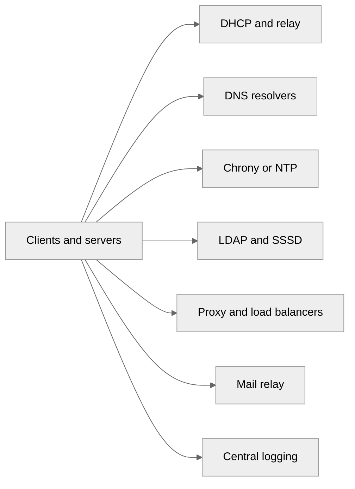
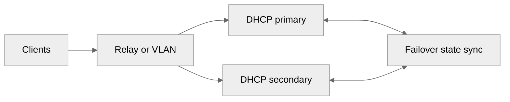
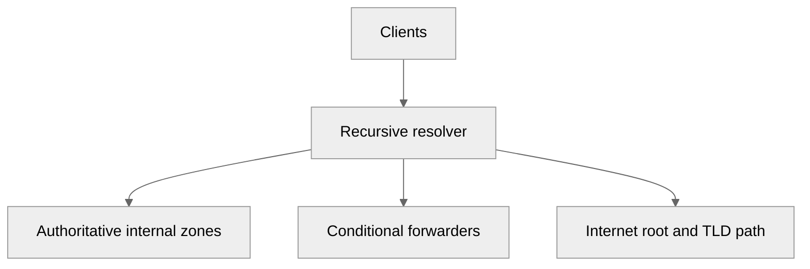
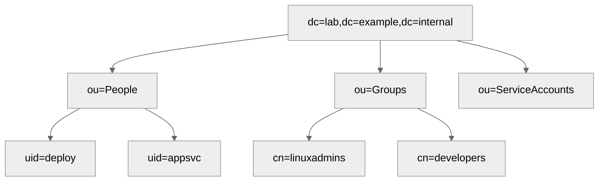
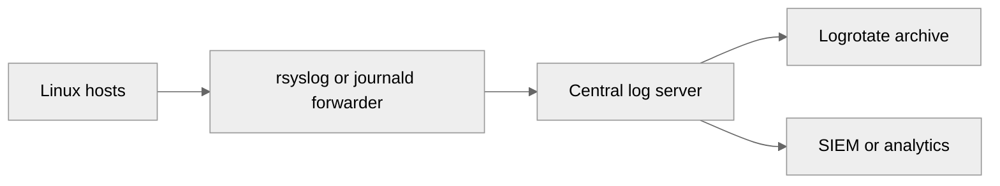

# Advanced Network Services for Linux Infrastructure

---

<a id="advanced-network-services-linux-infrastructure"></a>
## 🌐 Advanced Network Services for Linux Infrastructure

This guide extends the network-service topics already covered in:

- [14-dns-server.md](./14-dns-server.md)
- [16-dhcp-server.md](./16-dhcp-server.md)
- [17-time-synchronization.md](./17-time-synchronization.md)
- [15-system-hardening.md](./15-system-hardening.md)

Use it when you need highly available core services, internal identity, centralized logging, or controlled proxy and mail relay functions.

## Design goals

- Keep critical network services redundant.
- Separate authoritative, recursive, and client-facing roles where practical.
- Encrypt service-to-service traffic when credentials or logs traverse the network.
- Centralize configuration and inventory instead of maintaining ad hoc host files.

## Network services architecture



## DHCP advanced topics

### ISC DHCP failover

ISC DHCP failover provides a primary and secondary lease database relationship for IPv4.
It is a good fit for legacy environments still using ISC DHCP.

Key ideas:

- Both peers know about the lease state.
- One server is primary and the other secondary.
- Clients can still receive leases during peer outage windows.
- Use NTP or Chrony to keep clocks aligned.

#### Failover architecture



#### Primary server example

```conf
failover peer "dhcp-failover" {
    primary;
    address 192.168.70.11;
    port 647;
    peer address 192.168.70.12;
    peer port 647;
    max-response-delay 60;
    max-unacked-updates 10;
    load balance max seconds 3;
    mclt 3600;
    split 128;
}

subnet 192.168.70.0 netmask 255.255.255.0 {
    pool {
        failover peer "dhcp-failover";
        range 192.168.70.100 192.168.70.220;
    }
    option routers 192.168.70.1;
    option domain-name-servers 192.168.50.10, 192.168.50.11;
}
```

#### Secondary server example

```conf
failover peer "dhcp-failover" {
    secondary;
    address 192.168.70.12;
    port 647;
    peer address 192.168.70.11;
    peer port 647;
    max-response-delay 60;
    max-unacked-updates 10;
    load balance max seconds 3;
}

subnet 192.168.70.0 netmask 255.255.255.0 {
    pool {
        failover peer "dhcp-failover";
        range 192.168.70.100 192.168.70.220;
    }
    option routers 192.168.70.1;
    option domain-name-servers 192.168.50.10, 192.168.50.11;
}
```

Validate and monitor:

```bash
sudo dhcpd -t -cf /etc/dhcp/dhcpd.conf
sudo omshell
sudo journalctl -u dhcpd --since -30m
```

### DHCP relay agent

Use a relay when clients and servers live on different L3 networks.

Linux `dhcrelay` example:

```bash
sudo dnf install -y dhcp-relay
sudo dhcrelay -4 -i eno1 -i eno2 192.168.70.11 192.168.70.12
```

Systemd drop-in style service command example:

```bash
ExecStart=/usr/sbin/dhcrelay -4 -d -i eno1 -i eno2 192.168.70.11 192.168.70.12
```

### DHCP reservations at scale

Large reservation sets should be generated from inventory rather than edited by hand.
Keep host declarations in a separate include file.

Main config include:

```conf
include "/etc/dhcp/reservations.conf";
```

Example reservation block:

```conf
host app101 {
    hardware ethernet 52:54:00:aa:01:01;
    fixed-address 192.168.70.101;
    option host-name "app101";
}
```

Practical approaches:

- Generate `reservations.conf` from YAML or CMDB data.
- Keep reservation addresses outside dynamic pools.
- Pair reservations with DNS records and asset ownership.

### Dynamic DNS updates with DHCP and BIND

DDNS can keep forward and reverse zones current automatically.

Shared key example:

```bash
sudo tsig-keygen -a hmac-sha256 dhcpupdate
```

BIND snippet:

```conf
key "dhcpupdate" {
    algorithm hmac-sha256;
    secret "ReplaceWithRealSecret";
};

zone "lab.example.internal" {
    type master;
    file "/var/named/db.lab.example.internal";
    allow-update { key "dhcpupdate"; };
};

zone "70.168.192.in-addr.arpa" {
    type master;
    file "/var/named/db.192.168.70";
    allow-update { key "dhcpupdate"; };
};
```

ISC DHCP snippet:

```conf
ddns-updates on;
ddns-domainname "lab.example.internal.";
ddns-rev-domainname "in-addr.arpa.";
ignore client-updates;

key dhcpupdate {
    algorithm hmac-sha256;
    secret ReplaceWithRealSecret;
}

zone lab.example.internal. {
    primary 192.168.50.10;
    key dhcpupdate;
}

zone 70.168.192.in-addr.arpa. {
    primary 192.168.50.10;
    key dhcpupdate;
}
```

### Kea DHCP server

Kea is the modern ISC replacement with API-driven management and better extensibility.

Install:

```bash
sudo dnf install -y kea kea-dhcp4
sudo apt install -y kea-dhcp4-server
```

Example `/etc/kea/kea-dhcp4.conf`:

```json
{
  "Dhcp4": {
    "interfaces-config": {
      "interfaces": [ "eno1" ]
    },
    "lease-database": {
      "type": "memfile",
      "persist": true,
      "name": "/var/lib/kea/dhcp4.leases"
    },
    "valid-lifetime": 3600,
    "renew-timer": 900,
    "rebind-timer": 1800,
    "subnet4": [
      {
        "subnet": "192.168.80.0/24",
        "pools": [ { "pool": "192.168.80.100 - 192.168.80.220" } ],
        "option-data": [
          { "name": "routers", "data": "192.168.80.1" },
          { "name": "domain-name-servers", "data": "192.168.50.10, 192.168.50.11" },
          { "name": "domain-name", "data": "lab.example.internal" }
        ],
        "reservations": [
          {
            "hw-address": "52:54:00:aa:02:01",
            "ip-address": "192.168.80.21",
            "hostname": "api01"
          }
        ]
      }
    ],
    "loggers": [
      {
        "name": "kea-dhcp4",
        "severity": "INFO"
      }
    ]
  }
}
```

Apply and verify:

```bash
sudo kea-dhcp4 -t /etc/kea/kea-dhcp4.conf
sudo systemctl enable --now kea-dhcp4-server
sudo journalctl -u kea-dhcp4-server --since -30m
```

## DNS advanced topics

### BIND9 authoritative and recursive roles

For small environments, one BIND instance can be both authoritative for internal zones and recursive for internal clients.
For larger or security-sensitive environments, separate the roles.

Example BIND options:

```conf
acl internal-nets {
    127.0.0.1;
    192.168.0.0/16;
    10.0.0.0/8;
};

options {
    directory "/var/named";
    listen-on port 53 { 127.0.0.1; 192.168.50.10; };
    listen-on-v6 { none; };
    recursion yes;
    allow-recursion { internal-nets; };
    allow-query { any; };
    allow-transfer { none; };
    dnssec-validation auto;
    forwarders { 1.1.1.1; 9.9.9.9; };
    minimal-responses yes;
    version "not disclosed";
};
```

### Full forward zone example

```dns
$TTL 3600
@   IN SOA  ns1.lab.example.internal. dnsadmin.lab.example.internal. (
        2026060401
        3600
        900
        1209600
        300 )
    IN NS   ns1.lab.example.internal.
    IN NS   ns2.lab.example.internal.
ns1 IN A    192.168.50.10
ns2 IN A    192.168.50.11
ldap IN A   192.168.50.20
ntp  IN A   192.168.50.30
proxy IN A  192.168.50.40
mail IN A   192.168.50.50
web01 IN A  192.168.70.101
app01 IN A  192.168.70.111
api01 IN A  192.168.80.21
```

### Full reverse zone example

```dns
$TTL 3600
@   IN SOA  ns1.lab.example.internal. dnsadmin.lab.example.internal. (
        2026060401
        3600
        900
        1209600
        300 )
    IN NS   ns1.lab.example.internal.
    IN NS   ns2.lab.example.internal.
10  IN PTR  ns1.lab.example.internal.
11  IN PTR  ns2.lab.example.internal.
20  IN PTR  ldap.lab.example.internal.
30  IN PTR  ntp.lab.example.internal.
40  IN PTR  proxy.lab.example.internal.
50  IN PTR  mail.lab.example.internal.
```

Validate:

```bash
named-checkconf
named-checkzone lab.example.internal /var/named/db.lab.example.internal
named-checkzone 50.168.192.in-addr.arpa /var/named/db.192.168.50
```

### DNSSEC signing

Create keys and sign a zone:

```bash
cd /var/named
sudo dnssec-keygen -a ECDSAP256SHA256 -b 2048 -n ZONE lab.example.internal
sudo dnssec-keygen -f KSK -a ECDSAP256SHA256 -b 4096 -n ZONE lab.example.internal
sudo dnssec-signzone -S -o lab.example.internal -N increment db.lab.example.internal
```

Then point BIND at the signed zone file or use inline signing.
Example inline-signing stanza:

```conf
zone "lab.example.internal" {
    type master;
    file "/var/named/db.lab.example.internal";
    inline-signing yes;
    auto-dnssec maintain;
};
```

### Split-horizon DNS

Use BIND views when internal and external clients need different answers.

```conf
acl internal-nets {
    192.168.0.0/16;
    10.0.0.0/8;
};

view "internal" {
    match-clients { internal-nets; };
    recursion yes;
    zone "example.com" {
        type master;
        file "/var/named/db.example.com.internal";
    };
};

view "external" {
    match-clients { any; };
    recursion no;
    zone "example.com" {
        type master;
        file "/var/named/db.example.com.external";
    };
};
```

### Forwarders and conditional forwarding

Conditional forwarding is useful for AD, partner networks, or lab domains.

```conf
zone "corp.ad.example" {
    type forward;
    forward only;
    forwarders { 10.10.10.10; 10.10.10.11; };
};
```

### systemd-resolved client configuration

Example `/etc/systemd/resolved.conf`:

```conf
[Resolve]
DNS=192.168.50.10 192.168.50.11
Domains=lab.example.internal
FallbackDNS=1.1.1.1 9.9.9.9
DNSSEC=allow-downgrade
DNSOverTLS=opportunistic
```

Apply:

```bash
sudo systemctl restart systemd-resolved
resolvectl status
```

### Unbound as a recursive resolver

Install:

```bash
sudo dnf install -y unbound
sudo apt install -y unbound
```

Example `/etc/unbound/unbound.conf.d/internal.conf`:

```conf
server:
    interface: 0.0.0.0
    access-control: 127.0.0.0/8 allow
    access-control: 192.168.0.0/16 allow
    hide-identity: yes
    hide-version: yes
    qname-minimisation: yes
    prefetch: yes
    harden-glue: yes
    do-ip6: no

forward-zone:
    name: "."
    forward-tls-upstream: yes
    forward-addr: 1.1.1.1@853#cloudflare-dns.com
    forward-addr: 9.9.9.9@853#dns.quad9.net
```

Enable:

```bash
sudo unbound-checkconf
sudo systemctl enable --now unbound
```

### DNS hierarchy diagram



## NTP and Chrony

### Internal time hierarchy

Production designs commonly use:

- Stratum sourced from GPS, PTP, or trusted upstream pools.
- Two or more internal Chrony servers.
- Clients pointing only at internal time servers.

Example internal Chrony server config:

```conf
server time.cloudflare.com iburst
server time.google.com iburst
allow 192.168.0.0/16
local stratum 10
driftfile /var/lib/chrony/drift
makestep 1.0 3
rtcsync
logdir /var/log/chrony
```

### NTP pool versus internal hierarchy

Use public pools only on the time servers, not on every host.
Benefits:

- Predictable egress.
- Easier troubleshooting.
- Controlled upstream relationships.
- Lower rate of random internet dependency.

### Monitoring time sync

```bash
chronyc tracking
chronyc sources -v
chronyc sourcestats -v
chronyc activity
```

Watch for:

- `Leap status : Normal`
- Reachability of multiple sources.
- Low RMS offset.
- No persistent `?` or `x` status markers.

### PTP for high accuracy

Use Precision Time Protocol when NTP-level accuracy is not enough, such as for telecom, trading, or industrial control.

Packages and commands:

```bash
sudo dnf install -y linuxptp
sudo ptp4l -i eno1 -m
sudo phc2sys -a -r -m
```

Basic `/etc/ptp4l.conf` example:

```conf
[global]
twoStepFlag             1
priority1               128
priority2               128
domainNumber            24
slaveOnly               0
time_stamping           hardware
network_transport       UDPv4
delay_mechanism         E2E
```

## FTP and SFTP

### vsftpd secure configuration

Install:

```bash
sudo dnf install -y vsftpd
sudo apt install -y vsftpd
```

Example `/etc/vsftpd/vsftpd.conf`:

```conf
anonymous_enable=NO
local_enable=YES
write_enable=YES
local_umask=022
dirmessage_enable=YES
xferlog_enable=YES
connect_from_port_20=YES
chroot_local_user=YES
allow_writeable_chroot=YES
ssl_enable=YES
rsa_cert_file=/etc/pki/tls/certs/vsftpd.pem
rsa_private_key_file=/etc/pki/tls/private/vsftpd.key
force_local_data_ssl=YES
force_local_logins_ssl=YES
pasv_enable=YES
pasv_min_port=40000
pasv_max_port=40100
```

Open firewall for passive range as needed.

### SFTP-only with chroot

Add a group and directory ownership:

```bash
sudo groupadd sftpusers
sudo useradd -g sftpusers -d /upload -s /sbin/nologin sftpuser
sudo mkdir -p /sftp/sftpuser/upload
sudo chown root:root /sftp/sftpuser
sudo chown sftpuser:sftpusers /sftp/sftpuser/upload
```

Example `/etc/ssh/sshd_config` block:

```conf
Subsystem sftp internal-sftp

Match Group sftpusers
    ChrootDirectory /sftp/%u
    ForceCommand internal-sftp
    PasswordAuthentication yes
    X11Forwarding no
    AllowTcpForwarding no
```

Reload SSH:

```bash
sudo systemctl reload sshd
```

### ProFTPD overview

ProFTPD is useful when you need virtual users, more flexible module support, or advanced FTP policies.

Install and start:

```bash
sudo dnf install -y proftpd
sudo systemctl enable --now proftpd
```

## LDAP with OpenLDAP

### Server installation and initialization

Install:

```bash
sudo dnf install -y openldap-servers openldap-clients
sudo apt install -y slapd ldap-utils
```

Enable on RHEL-family:

```bash
sudo systemctl enable --now slapd
```

Base LDIF example `base.ldif`:

```ldif
dn: dc=lab,dc=example,dc=internal
objectClass: top
objectClass: dcObject
objectClass: organization
o: Lab Example Internal
DC: lab

dn: ou=People,dc=lab,dc=example,dc=internal
objectClass: organizationalUnit
ou: People

dn: ou=Groups,dc=lab,dc=example,dc=internal
objectClass: organizationalUnit
ou: Groups
```

Load data:

```bash
ldapadd -x -D "cn=admin,dc=lab,dc=example,dc=internal" -W -f base.ldif
```

### Schema management

Add commonly needed schemas such as `cosine`, `inetorgperson`, and `nis`.
On `cn=config` style deployments, use LDIF imports.

Example check:

```bash
ldapsearch -Y EXTERNAL -H ldapi:/// -b cn=schema,cn=config dn
```

### User and group management

User LDIF example:

```ldif
dn: uid=deploy,ou=People,dc=lab,dc=example,dc=internal
objectClass: inetOrgPerson
objectClass: posixAccount
objectClass: shadowAccount
cn: Deploy User
sn: User
uid: deploy
uidNumber: 10000
gidNumber: 10000
homeDirectory: /home/deploy
loginShell: /bin/bash
mail: deploy@lab.example.internal
userPassword: {SSHA}ReplaceWithHash
```

Group LDIF example:

```ldif
dn: cn=linuxadmins,ou=Groups,dc=lab,dc=example,dc=internal
objectClass: posixGroup
cn: linuxadmins
gidNumber: 10000
memberUid: deploy
```

Apply updates:

```bash
ldapadd -x -D "cn=admin,dc=lab,dc=example,dc=internal" -W -f users.ldif
ldapmodify -x -D "cn=admin,dc=lab,dc=example,dc=internal" -W -f changes.ldif
```

### TLS and STARTTLS

Create or install certificates and point LDAP at them.
Example TLS settings:

```ldif
dn: cn=config
changetype: modify
replace: olcTLSCertificateFile
olcTLSCertificateFile: /etc/openldap/certs/ldap.crt
-
replace: olcTLSCertificateKeyFile
olcTLSCertificateKeyFile: /etc/openldap/certs/ldap.key
-
replace: olcTLSCACertificateFile
olcTLSCACertificateFile: /etc/openldap/certs/ca.crt
```

Test StartTLS:

```bash
ldapsearch -x -ZZ -H ldap://ldap.lab.example.internal -b dc=lab,dc=example,dc=internal
```

### LDAP client configuration with SSSD

Install:

```bash
sudo dnf install -y sssd sssd-ldap oddjob-mkhomedir openldap-clients
sudo apt install -y sssd-ldap libnss-sss libpam-sss ldap-utils
```

Example `/etc/sssd/sssd.conf`:

```conf
[sssd]
services = nss, pam
config_file_version = 2
domains = LDAP

[domain/LDAP]
id_provider = ldap
auth_provider = ldap
ldap_uri = ldaps://ldap.lab.example.internal
ldap_search_base = dc=lab,dc=example,dc=internal
ldap_default_bind_dn = cn=readonly,dc=lab,dc=example,dc=internal
ldap_default_authtok = ReplaceWithSecret
cache_credentials = true
enumerate = false
ldap_tls_reqcert = demand
fallback_homedir = /home/%u
default_shell = /bin/bash
```

Set permissions and enable:

```bash
sudo chmod 600 /etc/sssd/sssd.conf
sudo systemctl enable --now sssd
sudo authselect select sssd with-mkhomedir --force
getent passwd deploy
```

### LDAP directory structure



## Proxy servers

### Squid forward proxy

Install:

```bash
sudo dnf install -y squid
sudo apt install -y squid
```

Example `/etc/squid/squid.conf`:

```conf
acl localnet src 192.168.0.0/16
acl Safe_ports port 80 443 21 70 210 1025-65535
acl SSL_ports port 443
acl blocked_domains dstdomain .example-bad.com .malware.test

http_access deny !Safe_ports
http_access deny CONNECT !SSL_ports
http_access deny blocked_domains
http_access allow localnet
http_access deny all

http_port 3128
cache_mem 512 MB
maximum_object_size 128 MB
cache_dir ufs /var/spool/squid 4096 16 256
access_log /var/log/squid/access.log
```

### Squid authentication with LDAP or AD

Install helper tools and configure:

```conf
auth_param basic program /usr/lib64/squid/basic_ldap_auth -b "dc=lab,dc=example,dc=internal" -D "cn=bind,dc=lab,dc=example,dc=internal" -w ReplaceWithSecret -f "uid=%s" -h ldap.lab.example.internal
acl ldap-auth proxy_auth REQUIRED
http_access allow ldap-auth localnet
```

### Content filtering patterns

- Block domains with `dstdomain` ACLs.
- Block categories by URL regex.
- Force proxy use through egress firewall policy.
- Log by username when auth is enabled.

### HAProxy for TCP and HTTP load balancing

Install:

```bash
sudo dnf install -y haproxy
sudo apt install -y haproxy
```

Example `/etc/haproxy/haproxy.cfg`:

```conf
global
    log /dev/log local0
    maxconn 5000
    daemon

defaults
    log global
    mode http
    option httplog
    timeout connect 5s
    timeout client 60s
    timeout server 60s

frontend fe_web
    bind *:80
    bind *:443 ssl crt /etc/haproxy/certs/site.pem
    default_backend be_web

backend be_web
    balance roundrobin
    option httpchk GET /healthz
    server web01 192.168.70.101:80 check
    server web02 192.168.70.102:80 check
```

TCP example for PostgreSQL:

```conf
frontend fe_pg
    bind *:5432
    mode tcp
    default_backend be_pg

backend be_pg
    mode tcp
    balance source
    option tcp-check
    server db01 192.168.70.201:5432 check
    server db02 192.168.70.202:5432 check backup
```

### Nginx reverse proxy with caching

Example `/etc/nginx/conf.d/cache.conf`:

```nginx
proxy_cache_path /var/cache/nginx levels=1:2 keys_zone=appcache:100m inactive=60m max_size=10g;

server {
    listen 443 ssl http2;
    server_name app.lab.example.internal;

    ssl_certificate /etc/pki/tls/certs/app.crt;
    ssl_certificate_key /etc/pki/tls/private/app.key;

    location / {
        proxy_pass http://192.168.70.111:8080;
        proxy_set_header Host $host;
        proxy_set_header X-Forwarded-For $proxy_add_x_forwarded_for;
        proxy_cache appcache;
        proxy_cache_valid 200 302 10m;
        proxy_cache_valid 404 1m;
    }
}
```

## Mail server basics

### Postfix relay or smarthost

Install:

```bash
sudo dnf install -y postfix mailx
sudo apt install -y postfix mailutils
```

Example `/etc/postfix/main.cf` for a relay host:

```conf
myhostname = relay.lab.example.internal
mydomain = lab.example.internal
myorigin = $mydomain
inet_interfaces = all
mydestination = localhost
relayhost = [smtp.provider.example]:587
smtp_sasl_auth_enable = yes
smtp_sasl_password_maps = hash:/etc/postfix/sasl_passwd
smtp_sasl_security_options = noanonymous
smtp_tls_security_level = encrypt
smtp_tls_CAfile = /etc/ssl/certs/ca-bundle.crt
mynetworks = 127.0.0.0/8 192.168.0.0/16
```

Credential map:

```bash
echo '[smtp.provider.example]:587 user:password' | sudo tee /etc/postfix/sasl_passwd
sudo postmap /etc/postfix/sasl_passwd
sudo chmod 600 /etc/postfix/sasl_passwd /etc/postfix/sasl_passwd.db
sudo systemctl enable --now postfix
```

### Aliases and forwarding

Example `/etc/aliases`:

```text
root: sysadmin@lab.example.internal
postmaster: sysadmin@lab.example.internal
noc: ops-team@lab.example.internal
```

Apply aliases:

```bash
sudo newaliases
```

### SPF, DKIM, and DMARC overview

- **SPF** defines which servers may send mail for a domain.
- **DKIM** signs mail headers and body hash material.
- **DMARC** publishes receiver policy and reporting guidance.

Minimal records:

```dns
example.com. IN TXT "v=spf1 ip4:203.0.113.20 include:_spf.provider.example -all"
_dmarc.example.com. IN TXT "v=DMARC1; p=quarantine; rua=mailto:dmarc@example.com"
selector1._domainkey.example.com. IN TXT "v=DKIM1; k=rsa; p=ReplaceWithPublicKey"
```

## Syslog and remote logging

### rsyslog server for centralized logs

Install:

```bash
sudo dnf install -y rsyslog rsyslog-gnutls
sudo apt install -y rsyslog rsyslog-gnutls
```

Example `/etc/rsyslog.d/10-listener.conf`:

```conf
module(load="imudp")
module(load="imtcp")
input(type="imudp" port="514")
input(type="imtcp" port="514")

template(name="RemotePerHost" type="string" string="/var/log/remote/%HOSTNAME%/%PROGRAMNAME%.log")
*.* ?RemotePerHost
```

Create directories and enable:

```bash
sudo mkdir -p /var/log/remote
sudo systemctl enable --now rsyslog
```

### TLS-encrypted log forwarding

Server-side TLS listener:

```conf
module(load="imtcp")
global(
  DefaultNetstreamDriver="gtls"
  DefaultNetstreamDriverCAFile="/etc/rsyslog/ca.crt"
  DefaultNetstreamDriverCertFile="/etc/rsyslog/server.crt"
  DefaultNetstreamDriverKeyFile="/etc/rsyslog/server.key"
)
input(type="imtcp" port="6514" StreamDriver.Name="gtls" StreamDriver.Mode="1" StreamDriver.AuthMode="x509/name")
```

Client-side forwarding example `/etc/rsyslog.d/90-forward.conf`:

```conf
*.* action(
  type="omfwd"
  protocol="tcp"
  target="log01.lab.example.internal"
  port="6514"
  StreamDriver="gtls"
  StreamDriverMode="1"
  StreamDriverAuthMode="x509/name"
  StreamDriverPermittedPeers="log01.lab.example.internal"
  queue.type="linkedlist"
  queue.filename="fwdRule1"
  action.resumeRetryCount="-1"
)
```

### Logrotate for remote logs

Example `/etc/logrotate.d/remote-logs`:

```conf
/var/log/remote/*/*.log {
    daily
    rotate 30
    missingok
    notifempty
    compress
    delaycompress
    sharedscripts
    create 0640 root adm
    postrotate
        /bin/systemctl reload rsyslog >/dev/null 2>&1 || true
    endscript
}
```

### journald remote streaming

Install and enable receiver:

```bash
sudo systemctl enable --now systemd-journal-remote.socket
sudo mkdir -p /var/log/journal/remote
```

Client upload example:

```bash
sudo systemctl enable --now systemd-journal-upload.service
```

Example `/etc/systemd/journal-upload.conf`:

```conf
[Upload]
URL=https://log01.lab.example.internal:19532
ServerKeyFile=/etc/ssl/private/journal-upload.key
ServerCertificateFile=/etc/ssl/certs/journal-upload.crt
TrustedCertificateFile=/etc/ssl/certs/ca-bundle.crt
```

### Centralized logging flow



## Operational checklist

Before promoting these services to production, validate:

- DHCP has relay coverage and tested failover behavior.
- DNS zones validate and recursion is restricted.
- Chrony sources are healthy and time drift is low.
- LDAP uses TLS and client caches are tested.
- Proxy logs capture identity where required.
- Mail relay credentials are protected and aliases work.
- Central logging is encrypted and rotates cleanly.

## Related reading in this repo

- Basic DNS: [14-dns-server.md](./14-dns-server.md)
- Basic DHCP: [16-dhcp-server.md](./16-dhcp-server.md)
- Time synchronization: [17-time-synchronization.md](./17-time-synchronization.md)
- Hardening foundations: [15-system-hardening.md](./15-system-hardening.md)
