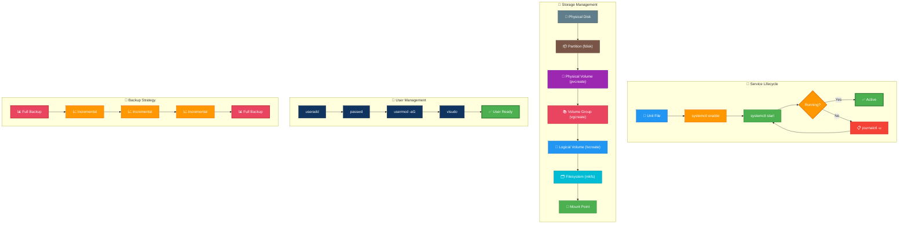

# Linux System Administration Guide

---

## 🎬 SysAdmin Daily Workflow — Animated

---

This guide has been split into smaller, topic-focused files. Reference material from the original monolithic guide has been merged into the relevant topic files.

## Table of Contents

1. [Package Management](./01-package-management.md)
2. [Service Management with systemd](./02-systemd.md)
3. [Process Management](./03-process-management.md)
4. [Disk and Storage Management](./04-disk-storage.md)
5. [Logical Volume Management (LVM)](./05-lvm.md)
6. [Software RAID with mdadm](./06-raid.md)
7. [Filesystems](./07-filesystems.md)
8. [Log Management](./08-log-management.md)
9. [Scheduled Tasks](./09-scheduled-tasks.md)
10. [System Monitoring](./10-monitoring.md)
11. [Backup and Recovery](./11-backup-recovery.md)
12. [Kernel Management](./12-kernel-management.md)
13. [NFS Setup](./13-nfs-setup.md)
14. [DNS Server (BIND9)](./14-dns-server.md)
15. [System Hardening](./15-system-hardening.md)
16. [Cloud Migration](./16-cloud-migration.md)
17. [DHCP Server](./16-dhcp-server.md)
18. [Patching and Vulnerabilities](./17-patching-and-vulnerabilities.md)
19. [Time Synchronization (NTP/Chrony)](./17-time-synchronization.md)

## Notes

- Bootloader and GRUB content is included in [Kernel Management](./12-kernel-management.md).
- The current source guide also contained DHCP and Chrony/NTP sections, so they were preserved as additional topic files.
