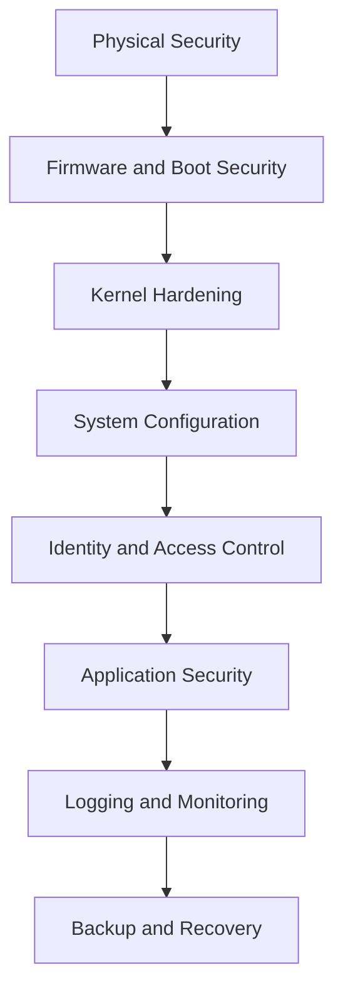

# Security Fundamentals

Linux security is the practice of reducing the probability and impact of compromise while preserving system availability for legitimate users and workloads.

Security is not a single feature.

It is a layered operating model built from policy, configuration, monitoring, patching, access control, and recovery planning.

### 1.1 Core Principles

#### Defense in depth

Defense in depth means deploying multiple overlapping safeguards.

If one control fails, another control reduces blast radius.

Examples:

- A firewall blocks unsolicited inbound access.
- SSH keys reduce password attack exposure.
- sudo limits admin rights to approved commands.
- SELinux or AppArmor confines processes after compromise.
- AIDE detects unauthorized file changes.
- Backups enable recovery after destructive events.

#### Least privilege

Least privilege means users, services, and applications receive only the permissions needed to perform approved work.

Key applications:

- Avoid shared admin accounts.
- Avoid running services as root unless technically required.
- Prefer narrow sudo rules instead of full root shells.
- Limit listening ports and exposed APIs.
- Use read-only mounts where writes are unnecessary.
- Remove unused packages and disable unused services.

#### Separation of duties

High-risk tasks should not depend on one person or one account.

Examples:

- One team approves firewall policy.
- Another team deploys application code.
- Security teams review privileged access and audit logs.

#### Fail secure

When a control fails, the default state should be restrictive.

Examples:

- Deny firewall traffic by default.
- Disable rather than ignore broken access controls.
- Reject unsigned or untrusted artifacts.

#### Keep it simple

Complexity creates blind spots.

A smaller, well-understood attack surface is easier to secure than a sprawling platform with undocumented exceptions.

### 1.2 CIA Triad

The CIA triad anchors most security decisions.

| Principle | Goal | Linux Examples | Common Threats |
| --- | --- | --- | --- |
| Confidentiality | Prevent unauthorized disclosure | File permissions, encryption, VPN, access controls | Data theft, eavesdropping, credential leaks |
| Integrity | Prevent unauthorized change | Checksums, AIDE, signed packages, immutable flags | Tampering, ransomware, malicious admin actions |
| Availability | Keep systems and services usable | Redundancy, rate limiting, monitoring, backups | DDoS, disk exhaustion, kernel panic, service crashes |

Balancing the triad matters.

A control that improves confidentiality but destroys availability may be unacceptable for production.

A control that increases availability but permits uncontrolled administrative access is also unacceptable.

### 1.3 Security Layers



Interpret the diagram from bottom impact and top dependency together.

If physical or boot security is weak, strong user policy alone is not enough.

If logging is absent, you may never know earlier layers failed.

### 1.4 Threat Modeling Basics

Before hardening a host, ask:

- What data lives on this system?
- What services does it expose?
- Who administers it?
- Who consumes it?
- What happens if it is offline for one hour?
- What happens if it is offline for one day?
- What happens if credentials are stolen?
- What happens if the root filesystem is modified?

Typical Linux threats include:

- Weak passwords or reused credentials.
- Publicly exposed services with poor configuration.
- Kernel or package vulnerabilities.
- Misconfigured sudo permissions.
- Insecure file permissions and world-writable paths.
- Lateral movement over SSH.
- Data exfiltration through scripts or backups.
- Log tampering after compromise.

### 1.5 Hardening Strategy

A practical hardening workflow often looks like this:

1. Inventory the system.
2. Remove unnecessary software.
3. Patch the OS and packages.
4. Lock down accounts and privileged access.
5. Harden network exposure.
6. Apply mandatory access control.
7. Centralize logs and alerts.
8. Baseline files and configuration.
9. Test backup and recovery.
10. Review regularly.

### 1.6 Baseline Discovery Commands

```bash
uname -a
cat /etc/os-release
ss -tulpn
systemctl list-unit-files --type=service --state=enabled
findmnt -D
sudo -l
getent passwd
getent group
rpm -qa | sort    # RHEL-like
# or
dpkg -l | cat     # Debian-like
```

What you are looking for:

- Unexpected listening ports.
- Unnecessary enabled services.
- Legacy packages.
- Shared accounts.
- Weak mount options.
- Overly broad sudo access.

### 1.7 Secure Configuration Lifecycle

| Phase | Objective | Example Activities |
| --- | --- | --- |
| Build | Start secure | Minimal install, secure partitioning, package selection |
| Deploy | Apply standards | SSH hardening, firewall rules, sudo policy |
| Operate | Detect drift | Audit rules, file integrity checks, patch cadence |
| Recover | Restore safely | Verified backups, incident playbooks, rekeying |
| Retire | Remove exposure | Wipe storage, revoke accounts, archive evidence |

### 1.8 Common Mistakes

- Treating security as a one-time checklist.
- Hardening only internet-facing systems.
- Ignoring internal lateral movement risks.
- Granting full sudo because narrow rules are inconvenient.
- Disabling SELinux instead of learning it.
- Leaving default passwords in lab or vendor software.
- Skipping restore tests for backups.
- Monitoring only CPU and memory but not auth and audit logs.

### 1.9 Secure Defaults Checklist

- Use supported Linux releases.
- Apply security updates quickly.
- Enforce strong authentication.
- Disable direct root SSH access.
- Restrict inbound network access.
- Use centralized logging.
- Use file integrity monitoring.
- Use MAC controls such as SELinux or AppArmor.
- Encrypt sensitive data at rest and in transit.
- Document exceptions and review them.

### 1.10 Quick Wins

If you only have one hour on a newly deployed host, do these first:

- Patch packages.
- Disable unused services.
- Configure the host firewall.
- Disable password SSH authentication if possible.
- Review sudo rules.
- Enable audit logging.
- Confirm backup enrollment.
- Verify time synchronization.

### 1.11 Security Mindset

Every change should answer three questions:

- What risk does this reduce?
- What operational cost does this introduce?
- How will we know if it stops working?

That mindset separates real hardening from checkbox hardening.

### 1.12 Control Categories

Most Linux controls fall into one or more categories.

#### Preventive controls

- firewall rules
- password policy
- SELinux or AppArmor policy
- LUKS encryption
- package allow lists

#### Detective controls

- auditd
- AIDE
- IDS alerts
- centralized logging
- certificate expiration monitoring

#### Corrective controls

- backups
- rebuild procedures
- credential rotation
- policy rollback
- incident runbooks

#### Deterrent controls

- user awareness
- monitoring banners where appropriate
- access approval workflows
- visible auditability

#### Compensating controls

- bastion hosts when direct hardening is limited
- network segmentation when an app cannot be patched immediately
- file monitoring when legacy software requires broad permissions temporarily

### 1.13 Risk Ranking Example

Use a simple method to prioritize hardening work.

| Issue | Likelihood | Impact | Priority |
| --- | --- | --- | --- |
| Public SSH with passwords | High | High | Critical |
| Missing audit rules on lab host | Medium | Medium | Moderate |
| Unused legacy package | Medium | Low | Moderate |
| No file integrity checks on payment app | Medium | High | High |
| Disabled SELinux on internet-facing host | High | High | Critical |

### 1.14 Change Management Considerations

Security changes should be introduced safely.

Good practice:

- record current state before change
- document expected impact
- define rollback steps
- test with a second session where remote access is involved
- monitor immediately after rollout

### 1.15 Summary

Security fundamentals are not abstract theory.

They shape every decision in the rest of this guide.

If you understand layered defense, least privilege, and the CIA triad, you can make better tradeoffs when configuring Linux under production pressure.

---

---

## Related Checklists, Command Reference, and Review Questions

### A.1 New Server Build Checklist

- Confirm OS version is supported.
- Apply all security updates.
- Remove unnecessary packages.
- Confirm time synchronization works.
- Set a restrictive default firewall policy.
- Disable unused services.
- Confirm SSH root login is disabled.
- Enforce key-based SSH authentication.
- Configure sudo for named users only.
- Review local account inventory.
- Set password policy and PAM quality controls.
- Set password aging and lockout settings.
- Confirm `umask` and `login.defs` are aligned to policy.
- Review partitioning and mount options.
- Encrypt sensitive disks or partitions.
- Enable SELinux or AppArmor in enforcing mode.
- Configure centralized logging.
- Configure auditd rules.
- Configure file integrity monitoring.
- Confirm backup enrollment.
- Record owner, purpose, and support contacts.

### A.14 Quick Monthly Review Checklist

- Review critical patches.
- Review privileged access.
- Review internet-exposed services.
- Review firewall exceptions.
- Review auth failures and anomalies.
- Review file integrity alerts.
- Review IDS alerts.
- Review certificate expiration windows.
- Review backup restore readiness.
- Review unresolved risk exceptions.

---

### B.14 Useful Files and Paths

| Path | Purpose |
| --- | --- |
| /etc/passwd | User database |
| /etc/shadow | Password hashes |
| /etc/group | Group database |
| /etc/sudoers | sudo policy |
| /etc/login.defs | Account defaults and aging |
| /etc/security/pwquality.conf | Password quality settings |
| /etc/pam.d/ | PAM configuration |
| /etc/ssh/sshd_config | SSH server configuration |
| /etc/fstab | Mount policy |
| /var/log/ | Log storage |
| /etc/selinux/ | SELinux configuration |
| /etc/apparmor.d/ | AppArmor profiles |
| /etc/audit/ | Audit rules and settings |

### B.15 Operational Note

Always test commands in a safe manner.

Some commands are read-only and investigative.

Others change system state and should be executed only through approved change control in production.

---

### C.1 Fundamentals

1. What is defense in depth?
2. Why is least privilege important?
3. How do confidentiality, integrity, and availability compete in real systems?
4. Why are secure defaults valuable?
5. Why is hardening not a one-time task?
6. What is an attack surface?
7. Why does documentation matter in security?
8. What is a compensating control?
9. Why should exceptions be reviewed regularly?
10. Why do backups belong in a security conversation?

### C.15 Final Reminder

Good Linux security is operational.

It depends on regular review, layered controls, and a willingness to validate assumptions repeatedly.
