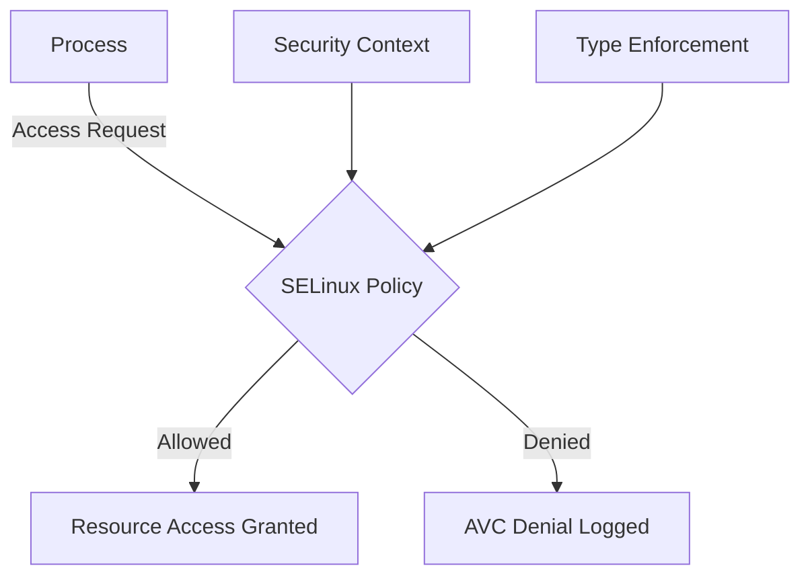
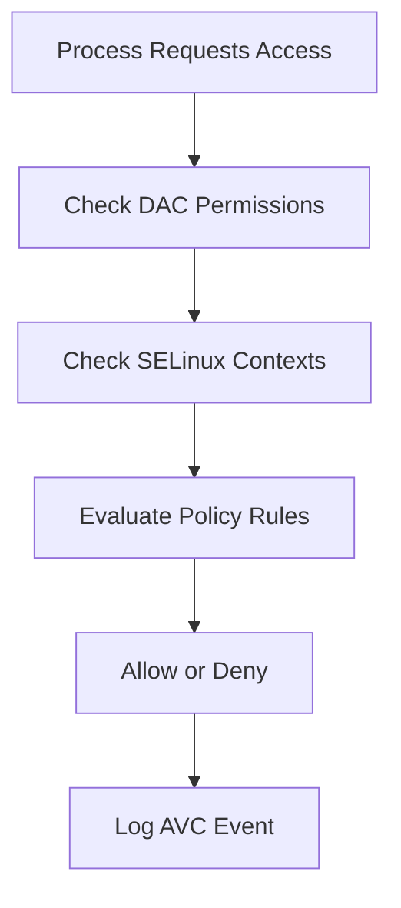

# SELinux

> **📌 Disclaimer**: Any third-party logos, screenshots, or diagrams referenced in this document are used for educational purposes only. All trademarks belong to their respective owners.


SELinux is a mandatory access control system that enforces security policy even when traditional Unix permissions would otherwise allow access.

It is one of the most powerful Linux security technologies and one of the most commonly disabled by frustrated administrators.

That is usually a mistake.

Learn it instead.

### 4.1 Why SELinux Matters

### 📸 SELinux Architecture

> *Source: Wikimedia Commons — SELinux administration overview*

Traditional permissions answer questions like:

- Is the file readable by this user or group?
- Is the process running as root?

SELinux answers additional questions like:

- Is this specific domain allowed to read that file type?
- Is this daemon allowed to bind that port?
- Is this process allowed to initiate network connections?
- Is this action allowed by policy regardless of DAC permissions?

This reduces damage from:

- application compromise
- local privilege abuse
- accidental misconfiguration
- service breakout from intended boundaries

### 4.2 SELinux Modes

| Mode | Behavior |
| --- | --- |
| Enforcing | Policy violations are blocked and logged |
| Permissive | Violations are allowed but logged |
| Disabled | SELinux is off |

Check status:

```bash
getenforce
sestatus
```

Temporarily change mode:

```bash
sudo setenforce 0
sudo setenforce 1
```

Persistent configuration is usually in `/etc/selinux/config`.

Guidance:

- Use `Enforcing` in production whenever possible.
- Use `Permissive` for short troubleshooting windows.
- Avoid `Disabled` unless you have a compelling reason and compensating controls.

### 4.3 Core Concepts

SELinux uses labels.

A label often includes:

- user
- role
- type
- level

Example context:

```text
system_u:object_r:httpd_sys_content_t:s0
```

In practice, the type component is often the most operationally important.

Examples:

- `httpd_t` for the web server process domain.
- `httpd_sys_content_t` for web-readable content.
- `httpd_sys_rw_content_t` for web-writable content.
- `ssh_port_t` for SSH-associated ports.

### 4.4 Context Inspection

Inspect contexts with:

```bash
ls -Z
ps -eZ | head
id -Z
semanage port -l | head
```

Examples:

```bash
ls -Zd /var/www/html
ps -eZ | grep httpd
```

Common troubleshooting pattern:

A file has normal Unix permissions.

The service still cannot read it.

Often the SELinux type is wrong.

### 4.5 SELinux Decision Flow



This means successful traditional permission checks do not guarantee access.

SELinux remains authoritative when enabled.

### 4.6 File Label Management

Use `restorecon` to reset files to expected policy labels.

Examples:

```bash
sudo restorecon -Rv /var/www/html
sudo restorecon -Rv /etc/ssh
```

Why `restorecon` matters:

- Manual copies can preserve bad labels.
- Custom deployment tools may write files with unexpected contexts.
- Mislabels are one of the most common SELinux issues.

Persistent custom labeling is typically done with `semanage fcontext`.

Examples:

```bash
sudo semanage fcontext -a -t httpd_sys_content_t '/srv/myapp/public(/.*)?'
sudo restorecon -Rv /srv/myapp/public

sudo semanage fcontext -a -t httpd_sys_rw_content_t '/srv/myapp/storage(/.*)?'
sudo restorecon -Rv /srv/myapp/storage
```

### 4.7 Port Label Management

Services may fail to bind non-standard ports unless the port type is permitted.

Inspect relevant ports:

```bash
sudo semanage port -l | grep ssh
sudo semanage port -l | grep http
```

Add a custom SSH port label example:

```bash
sudo semanage port -a -t ssh_port_t -p tcp 2222
```

Modify an existing mapping:

```bash
sudo semanage port -m -t http_port_t -p tcp 8080
```

### 4.8 Booleans

SELinux booleans toggle optional policy behavior without writing new policy.

List booleans:

```bash
getsebool -a | head
```

Inspect specific examples:

```bash
getsebool httpd_can_network_connect
getsebool nis_enabled
```

Set a boolean persistently:

```bash
sudo setsebool -P httpd_can_network_connect on
```

Important habit:

Prefer enabling a documented boolean over creating a custom allow rule if the boolean cleanly matches the requirement.

### 4.9 Policy Types and Modules

Most administrators interact with:

- targeted policy
- custom policy modules

Targeted policy confines selected services and roles.

Custom modules extend behavior for local requirements.

Policy module basics:

```bash
sudo semodule -l | head
sudo semodule -r mymodule
```

### 4.10 AVC Troubleshooting

SELinux denial messages often appear as AVC events.

Useful tools:

- `ausearch`
- `audit2why`
- `audit2allow`
- `journalctl`

Examples:

```bash
sudo ausearch -m avc -ts recent
sudo ausearch -m avc -ts today | audit2why
sudo ausearch -m avc -ts today | audit2allow -w
```

What `audit2why` helps answer:

- Why did SELinux deny this action?
- Was the issue a label mismatch, missing boolean, or policy restriction?

What `audit2allow` helps generate:

- Candidate allow rules based on observed denials.

Critical warning:

Never blindly install whatever `audit2allow` suggests.

Review each rule for least privilege.

### 4.11 Building a Local Policy Module

Example workflow:

```bash
sudo ausearch -m avc -ts today | audit2allow -M localfix
sudo semodule -i localfix.pp
```

Safer process:

1. Confirm the denial is legitimate.
2. Check file labels and booleans first.
3. Confirm the application design really requires the access.
4. Generate a candidate rule.
5. Review the `.te` policy source.
6. Install only approved minimal policy.

### 4.12 Typical Web Server Issues

Common cases:

- Web content copied from home directories inherits `user_home_t`.
- Upload directories need `httpd_sys_rw_content_t`.
- Reverse proxies need `httpd_can_network_connect` for backend connections.
- Custom listen ports need appropriate port types.

Quick example:

```bash
sudo semanage fcontext -a -t httpd_sys_content_t '/srv/site(/.*)?'
sudo restorecon -Rv /srv/site
sudo setsebool -P httpd_can_network_connect on
```

### 4.13 Typical Database and Application Issues

Common problems:

- App processes reading secrets from mislabeled directories.
- Queue workers attempting outbound connections without the correct policy.
- Databases binding to unexpected ports.
- Backup jobs denied reading application data.

Approach:

- inspect process domain
- inspect file contexts
- inspect port labels
- inspect booleans
- inspect AVC records

### 4.14 SELinux and Containers

SELinux also matters for containers.

Concepts include:

- MCS labeling
- container-specific types
- volume relabeling such as `:z` and `:Z` in some runtimes

Security value:

- A compromised container has reduced ability to access host files outside its allowed label boundaries.

### 4.15 Useful Commands Reference

```bash
getenforce
sestatus
ls -Z /path
ps -eZ
id -Z
restorecon -Rv /path
semanage fcontext -l | less
semanage port -l | less
getsebool -a | less
ausearch -m avc -ts recent
audit2why
audit2allow -w
audit2allow -M module_name
semodule -l
```

### 4.16 Operational Best Practices

- Keep SELinux in enforcing mode.
- Learn common labels for your services.
- Use `restorecon` before writing policy.
- Prefer `semanage` for persistent changes.
- Prefer booleans when they match the use case.
- Review AVCs rather than disabling enforcement.
- Version-control custom policy decisions.

### 4.17 Common Anti-Patterns

- Setting SELinux to disabled during application rollout and never restoring it.
- Running `chcon` manually without making the change persistent.
- Installing overbroad local allow modules.
- Ignoring AVC logs during deployments.
- Treating SELinux as optional rather than strategic.

### 4.18 Summary

SELinux enforces intent beyond traditional permissions.

When you understand contexts, booleans, ports, and AVC troubleshooting, it becomes a major defensive advantage rather than an obstacle.

---

---

## Related Checklists, Command Reference, and Review Questions

### A.4 SELinux Checklist

- Confirm SELinux is enabled.
- Confirm mode is enforcing in production.
- Review recent AVC denials.
- Run `restorecon` on key application paths after deployment.
- Use `semanage fcontext` for persistent labeling.
- Review custom port labels.
- Review required booleans.
- Review custom policy modules.
- Remove obsolete local modules.
- Document all exceptions.

### B.4 SELinux Commands

```bash
getenforce
sestatus
ls -Z /path
ps -eZ
id -Z
restorecon -Rv /path
semanage fcontext -l
semanage port -l
getsebool -a
setsebool -P httpd_can_network_connect on
ausearch -m avc -ts recent
audit2why
audit2allow -w
audit2allow -M localfix
semodule -l
```

### C.4 SELinux

41. What problem does SELinux solve beyond standard file permissions?
42. What are the three SELinux modes?
43. Why is permissive mode useful?
44. Why is disabled mode usually a bad long-term choice?
45. What is a context type?
46. What does `restorecon` do?
47. What is the purpose of `semanage fcontext`?
48. Why might a service fail to bind a non-standard port under SELinux?
49. What is a boolean in SELinux?
50. Why should you check booleans before writing policy?
51. What is an AVC denial?
52. What does `audit2why` help explain?
53. Why is blindly using `audit2allow` dangerous?
54. Why are file labels often the root cause of SELinux issues?
55. Why should custom policy be narrowly scoped?
