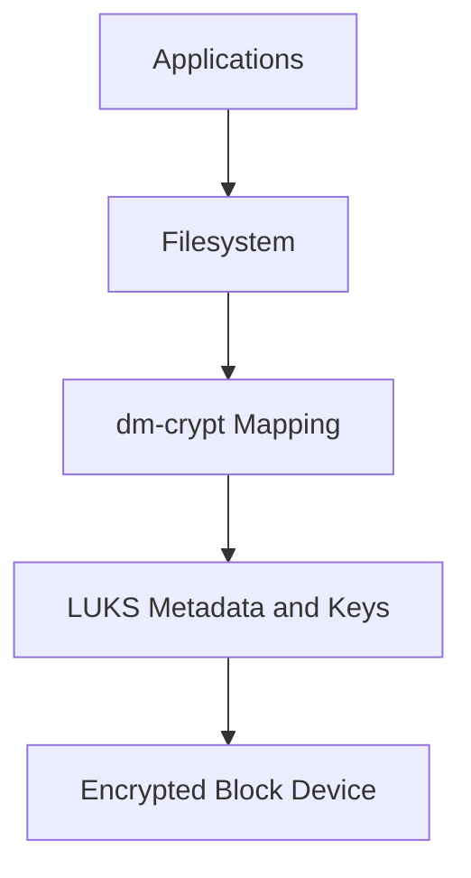

# Encryption

## Full Forms & Terminology

See the [master glossary](../00-glossary-and-full-forms.md) for the full cryptography glossary.

- **LUKS — Linux Unified Key Setup:** Standard Linux disk-encryption format.
- **GPG — GNU Privacy Guard:** Open-source implementation of the PGP standard.
- **PGP — Pretty Good Privacy:** File and email encryption standard.
- **TLS — Transport Layer Security:** Main protocol for encrypted network sessions.
- **AES — Advanced Encryption Standard:** Common symmetric cipher.
- **SHA — Secure Hash Algorithm:** Family of cryptographic hash functions.
- **MD5 — Message-Digest Algorithm 5:** Legacy hash that is insecure for security-sensitive use.
- **PKI / CA / CSR / OCSP / CRL:** Core certificate-management terms used in TLS deployments.


Encryption protects data confidentiality and, in some cases, integrity.

On Linux, encryption typically appears in three major places:

- data at rest
- data in transit
- selected files or messages

### 8.1 Encryption Overview

| Use Case | Technology |
| --- | --- |
| Full disk or partition encryption | LUKS, dm-crypt |
| File-level encryption | GPG |
| Network transport encryption | TLS, SSH, VPN |
| Secret storage and wrapping | GPG, hardware-backed key stores, vault systems |

### 8.2 LUKS Basics

LUKS stands for Linux Unified Key Setup.

It is the standard for block-device encryption on Linux.

Common use cases:

- laptop encryption
- encrypted data partitions
- encrypted swap
- protecting removable media

Benefits:

- strong encryption at rest
- support for multiple key slots
- better operational manageability than ad hoc dm-crypt usage alone

### 8.3 LUKS Encryption Layers



This layered view matters operationally.

Applications generally interact with a normal filesystem.

Encryption happens below that layer.

### 8.4 LUKS Workflow

Example high-level flow for a new disk:

```bash
sudo cryptsetup luksFormat /dev/sdb
sudo cryptsetup open /dev/sdb securedata
sudo mkfs.ext4 /dev/mapper/securedata
sudo mkdir -p /securedata
sudo mount /dev/mapper/securedata /securedata
```

Operational notes:

- verify the target device carefully before formatting
- record recovery procedures
- back up headers where appropriate
- protect key material separately from the data

### 8.5 Key Slots and Passphrases

LUKS supports multiple key slots.

That means:

- one passphrase can be for operations staff
- another can be a recovery key
- another can integrate with automated unlock systems in controlled environments

Example management commands:

```bash
sudo cryptsetup luksDump /dev/sdb
sudo cryptsetup luksAddKey /dev/sdb
sudo cryptsetup luksRemoveKey /dev/sdb
```

### 8.6 LUKS Header Backup

A damaged LUKS header can make data inaccessible.

Protect header backups carefully.

Example:

```bash
sudo cryptsetup luksHeaderBackup /dev/sdb --header-backup-file luks-header-backup.img
```

Security warning:

A header backup is sensitive.

Store it securely and separately.

### 8.7 dm-crypt

`dm-crypt` is the kernel subsystem enabling transparent block encryption.

LUKS sits on top of it and standardizes metadata and key management.

Why it matters:

- dm-crypt is the underlying mechanism
- LUKS is the operationally friendly format and tooling layer

### 8.8 Encrypting Swap

Unencrypted swap can leak sensitive memory content to disk.

Good options:

- use encrypted swap
- avoid swap where operationally acceptable and memory sizing supports it

### 8.9 GPG for File Encryption

GPG is useful for encrypting files, archives, secrets, and data exchanged between users or systems.

Common modes:

- symmetric encryption with a passphrase
- asymmetric encryption with public/private keys
- signing for integrity and authenticity

Examples:

```bash
gpg --symmetric secrets.txt
gpg --encrypt --recipient alice@example.com report.txt
gpg --decrypt report.txt.gpg
gpg --sign artifact.tar.gz
```

Operational guidance:

- protect private keys with strong passphrases
- back up keys securely
- verify fingerprints before trusting public keys
- document revocation procedures

### 8.10 GPG Key Hygiene

Best practices:

- generate keys with current algorithms and sizes appropriate to policy
- use subkeys where applicable
- protect secret keys offline when feasible
- publish or share fingerprints through trusted channels
- revoke lost or compromised keys promptly

### 8.11 TLS Certificates with OpenSSL

TLS secures web traffic, APIs, and many application protocols.

Useful `openssl` commands:

```bash
openssl req -new -newkey rsa:4096 -nodes -keyout server.key -out server.csr
openssl x509 -in cert.pem -text -noout
openssl s_client -connect example.com:443 -servername example.com
openssl verify -CAfile ca-chain.pem cert.pem
```

What to review in certificates:

- subject and subject alternative names
- validity dates
- issuing CA
- key usage and extended key usage
- chain completeness

### 8.12 Let's Encrypt and certbot

Let's Encrypt provides automated certificate issuance.

`certbot` simplifies certificate management for many common services.

Typical advantages:

- shorter-lived certs
- automated renewal
- reduced manual error

Operational checklist:

- test renewal before expiration windows
- monitor renewal failures
- protect private key permissions
- reload services after renewal when required

### 8.13 TLS Hardening Principles

- disable obsolete protocols where policy requires
- prefer strong ciphers and forward secrecy
- use proper certificate chains
- enable HSTS for web services where appropriate
- rotate keys when compromise is suspected
- avoid self-signed certificates in production except in tightly controlled internal PKI contexts

### 8.14 Protecting Private Keys

Private keys should be:

- owned by the correct service account or root as appropriate
- readable only by required identities
- backed up securely if necessary
- rotated through controlled procedures

Example permissions:

```bash
chmod 600 /etc/pki/tls/private/server.key
chown root:root /etc/pki/tls/private/server.key
```

### 8.15 Data-in-Transit Encryption Beyond HTTPS

Also secure:

- SSH sessions
- database connections
- message queues
- internal service-to-service APIs
- VPN tunnels
- backup replication traffic

Do not assume internal networks are trusted.

### 8.16 Secrets and Configuration Files

Encryption is not useful if secrets are left in plain text around the encrypted system.

Common mistakes:

- hardcoding passwords in shell scripts
- storing API tokens in world-readable config files
- copying decrypted secrets into logs
- emailing private keys

### 8.17 Certificate Lifecycle Management

Track:

- who requested the cert
- where the private key lives
- which services use the cert
- when it expires
- how it is rotated

Without lifecycle management, encryption becomes fragile and failure-prone.

### 8.18 Example Encryption Decision Table

| Requirement | Recommended Approach |
| --- | --- |
| Protect laptop data if stolen | Full-disk LUKS |
| Send a sensitive file to one user | GPG asymmetric encryption |
| Secure a web application | TLS with valid certificates |
| Protect secrets in swap | Encrypted swap |
| Protect a removable backup disk | LUKS on the removable device |

### 8.19 Summary

Linux encryption strategy should combine at-rest protection with LUKS and dm-crypt, selective file encryption with GPG, and strong transport encryption using TLS and SSH.

Encryption is strongest when paired with good key management, access control, and operational discipline.

---

---

## Related Checklists, Command Reference, and Review Questions

### A.8 Encryption Checklist

- Confirm LUKS on systems requiring at-rest protection.
- Back up LUKS headers securely where policy allows.
- Review key slot ownership and recovery process.
- Encrypt swap where needed.
- Review GPG key management for file transfer workflows.
- Review TLS certificate validity and chain health.
- Confirm automated certificate renewal.
- Review private key permissions.
- Confirm secrets are not stored unencrypted in config files.
- Review transport encryption for internal services.

### B.8 Encryption Commands

```bash
cryptsetup luksFormat /dev/sdb
cryptsetup open /dev/sdb securedata
cryptsetup luksDump /dev/sdb
cryptsetup luksAddKey /dev/sdb
cryptsetup luksHeaderBackup /dev/sdb --header-backup-file luks-header-backup.img
gpg --symmetric file.txt
gpg --encrypt --recipient user@example.com file.txt
openssl req -new -newkey rsa:4096 -nodes -keyout server.key -out server.csr
openssl s_client -connect example.com:443 -servername example.com
openssl verify -CAfile ca-chain.pem cert.pem
```

### C.8 Encryption

91. What does LUKS protect against?
92. What does LUKS not protect against when a system is already unlocked?
93. Why are LUKS header backups sensitive?
94. How does dm-crypt relate to LUKS?
95. When is GPG better than disk encryption alone?
96. Why should private TLS keys be tightly protected?
97. Why is certificate renewal monitoring important?
98. Why should internal service traffic be encrypted too?
99. Why are hardcoded secrets still a problem on encrypted systems?
100. Why is key lifecycle management critical?
