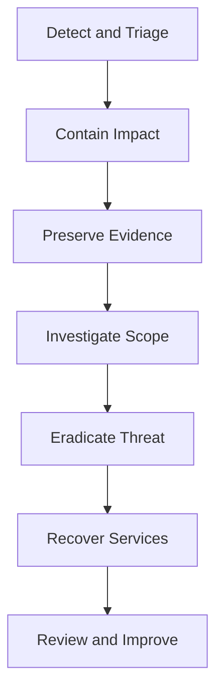

# Incident Response

Incident response is the disciplined process of detecting, containing, investigating, eradicating, and recovering from security events.

Linux responders need both technical skill and operational discipline.

### 13.1 Response Priorities

In most cases, prioritize:

1. safety and business impact
2. containment
3. evidence preservation
4. scope determination
5. eradication and recovery
6. lessons learned

### 13.2 Incident Response Process



### 13.3 Initial Triage Questions

- What happened?
- When did it start?
- Which systems are affected?
- Is the threat still active?
- What data or services are at risk?
- Are credentials suspected to be compromised?
- What containment options exist without destroying evidence?

### 13.4 Volatile Data Collection

Volatile data can disappear quickly.

Collect as early as practical.

Examples:

- current network connections
- running processes
- logged-in users
- memory-related indicators where tooling and policy allow
- ARP and routing information
- mounted filesystems
- kernel modules

Useful commands:

```bash
date -u
hostname
who
w
ps auxf
ss -tulpn
lsof -nP -i
ip addr
ip route
mount
lsmod
journalctl -n 200
```

### 13.5 Forensic Tools

Common Linux forensic and response tools may include:

- `dd`
- `dcfldd`
- `rsync` for controlled evidence copy workflows
- `tar` with metadata preservation where appropriate
- `sha256sum`
- Sleuth Kit tools
- Volatility for memory analysis in appropriate scenarios
- `ausearch` and `journalctl`

Guidance:

- use trusted tools from trusted media when possible
- hash collected evidence
- document chain of custody
- avoid unnecessary writes to the compromised system

### 13.6 Timeline Analysis

Timeline analysis helps reconstruct attacker behavior.

Useful evidence sources:

- file timestamps
- auth logs
- audit logs
- shell history
- cron changes
- package installation history
- web server logs
- EDR or SIEM data

Questions:

- When was initial access achieved?
- What privilege escalation occurred?
- What persistence was added?
- What data was touched or exfiltrated?
- When did defenders first have a signal?

### 13.7 Containment Strategies

Containment options depend on severity and business criticality.

Examples:

- isolate the host from the network
- revoke credentials
- block malicious destinations
- stop compromised services
- snapshot systems if supported and approved

Caution:

Do not immediately reboot a system unless necessary for safety or containment.

You may lose valuable volatile evidence.

### 13.8 Persistence Checks

Review common persistence locations:

- systemd unit files
- cron jobs
- `/etc/rc.local` where present
- user shell profiles
- SSH authorized keys
- kernel modules
- startup scripts
- timers

Examples:

```bash
systemctl list-unit-files --state=enabled
systemctl list-timers --all
find /etc/cron* -type f -maxdepth 2 -print
find /root/.ssh /home -name authorized_keys -print -exec cat {} \;
```

### 13.9 Credential Response

If compromise is suspected:

- rotate affected passwords
- revoke or replace SSH keys where needed
- rotate API tokens
- review sudo and service credentials
- invalidate sessions or certificates if required

### 13.10 Recovery Procedures

Recovery should be deliberate.

Preferred process:

1. understand root cause
2. remove persistence
3. patch the vulnerability
4. rebuild from trusted sources when risk is high
5. restore only clean data
6. monitor closely after return to service

Often, reimaging or rebuilding is safer than attempting to trust a deeply compromised host.

### 13.11 Post-Incident Review

A strong review covers:

- root cause
- detection gaps
- timeline accuracy
- response speed
- control failures
- what should change in architecture, monitoring, and process

### 13.12 Communication Discipline

During incidents:

- keep a timestamped action log
- separate facts from assumptions
- identify decision owners
- protect sensitive evidence
- coordinate legal and compliance reporting when required

### 13.13 Evidence Handling Checklist

- record system time and timezone
- record who collected what
- hash acquired files
- preserve original data
- store evidence securely
- limit access to investigators

### 13.14 Summary

Effective Linux incident response depends on calm triage, fast containment, disciplined evidence handling, careful timeline analysis, and trustworthy recovery.

Preparation before the incident is what makes good response possible during the incident.

---

---

## Related Checklists, Command Reference, and Review Questions

### A.13 Incident Response Preparation Checklist

- Maintain current incident contacts.
- Keep evidence collection procedures documented.
- Centralize logs.
- Test backups and restores.
- Keep forensics tooling available from trusted sources.
- Define host isolation procedures.
- Define credential rotation playbooks.
- Define communication and escalation paths.
- Train responders on Linux evidence sources.
- Conduct tabletop exercises.

### B.13 Incident Response Commands

```bash
date -u
hostname
who
w
ps auxf
ss -tulpn
lsof -nP -i
mount
lsmod
journalctl -n 200
sha256sum evidence.tar
```

### C.13 Incident Response

141. Why is volatile data collection time-sensitive?
142. Why can rebooting too early hurt an investigation?
143. Why is chain of custody important?
144. What is timeline analysis used for?
145. Why is rebuilding often safer than cleaning a deeply compromised host?
146. Why should credential rotation be part of response?
147. Why should responders keep a timestamped action log?
148. Why is communication discipline important during incidents?
149. Why should persistence mechanisms be checked systematically?
150. Why does good response depend on preparation before the incident?

### C.14 Practice Exercise Ideas

- Compare two hosts and identify which one has weaker SSH controls.
- Review a PAM stack and explain the role of each module.
- Create a list of files that should be monitored by AIDE.
- Explain how to troubleshoot a web app denied by SELinux.
- Draft a minimal AppArmor profile for a simple backup tool.
- Design a host firewall for a bastion server.
- Write an SSH hardening standard for admins.
- Map where LUKS is required in your environment.
- Build an auditd rule set for identity and sudo changes.
- Create a short incident response checklist for suspicious SSH activity.
