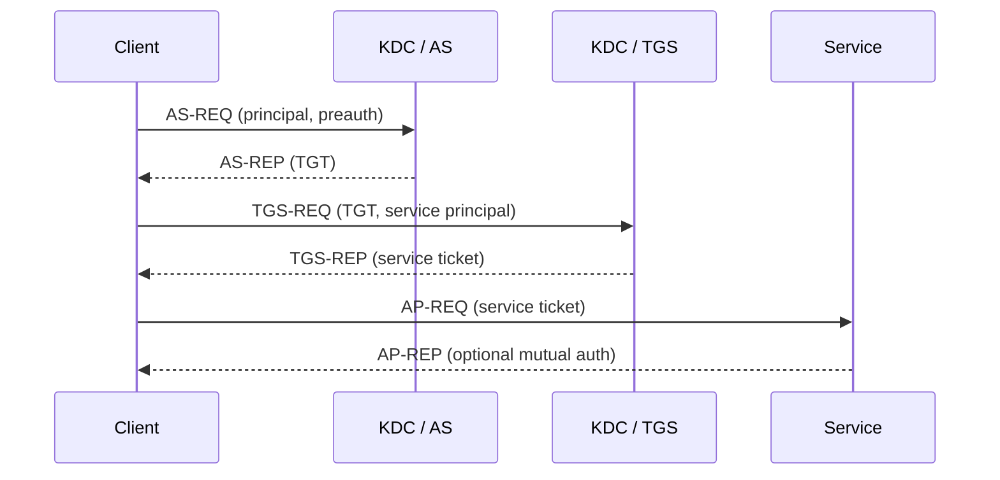
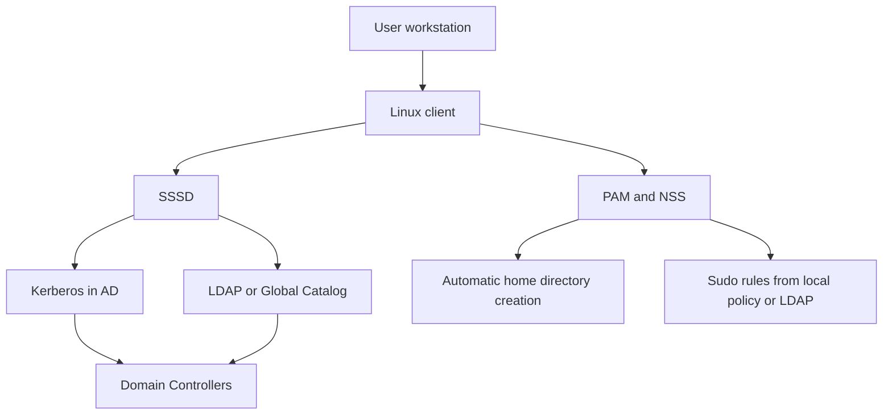
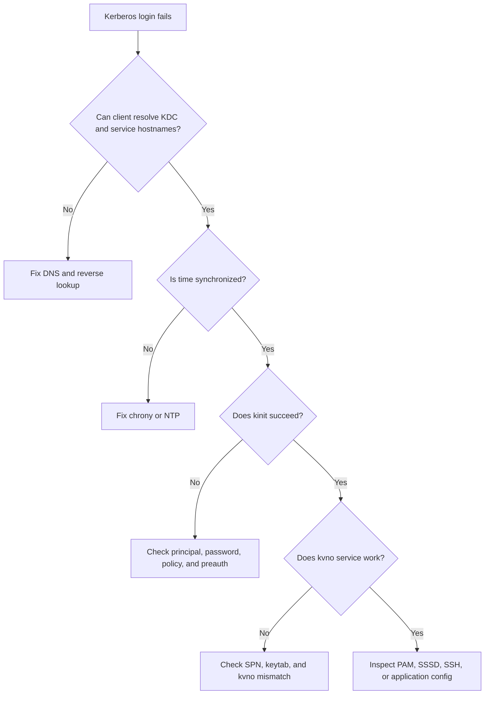

# Kerberos Authentication

Kerberos provides centralized, ticket-based authentication for users and services. It is foundational for enterprise Linux identity, especially where Linux systems integrate with Active Directory, FreeIPA, NFSv4, web single sign-on, and database platforms.

Use this chapter together with [07-ssh-hardening.md](./07-ssh-hardening.md), [09-auditing.md](./09-auditing.md), and [13-Troubleshooting/14-advanced-troubleshooting.md](../13-Troubleshooting/14-advanced-troubleshooting.md) when diagnosing identity failures.

## 14.1 Why Kerberos exists

Kerberos was designed to solve the problem of proving identity on an untrusted network without repeatedly sending reusable passwords.

### Compared with NTLM

- Kerberos uses time-limited tickets instead of password challenge responses tied to the server handshake.
- Kerberos supports delegated service authentication and mutual authentication more cleanly.
- Kerberos is generally preferred in modern AD environments because it scales better and reduces password exposure.

### Compared with LDAP simple bind

- LDAP simple bind often sends credentials to the LDAP server for direct verification.
- Kerberos separates authentication from directory lookup.
- LDAP often stores identity data, group membership, and policy, while Kerberos handles ticket issuance.

## 14.2 Core concepts

- **KDC**: the Key Distribution Center; logically includes the Authentication Service and Ticket Granting Service.
- **Realm**: the administrative trust boundary, usually written in uppercase such as `EXAMPLE.COM`.
- **Principal**: an identity in the realm, for example `alice@EXAMPLE.COM` or `HTTP/web01.example.com@EXAMPLE.COM`.
- **TGT**: Ticket Granting Ticket; the first ticket a user gets after authenticating.
- **TGS**: Ticket Granting Service; issues service tickets based on the TGT.
- **Keytab**: a file containing service keys so daemons can authenticate without interactive passwords.
- **SPN**: Service Principal Name; the service identity used by clients to request service tickets.

## 14.3 Kerberos authentication flow



### What happens in practice

1. The client proves knowledge of the user's secret or a cached credential.
2. The KDC returns a TGT encrypted for the KDC and session data for the client.
3. The client asks for a specific service ticket, such as `HTTP/web01.example.com`.
4. The client presents that service ticket to the target service.
5. The service verifies the ticket using its keytab.

## 14.4 DNS and time requirements

Kerberos depends on infrastructure correctness.

### DNS requirements

- forward lookups must resolve the KDC and service hosts correctly
- reverse DNS should match expected hostnames in many deployments
- SRV records may be used for service discovery

Example checks:

```bash
dig _kerberos._udp.example.com SRV
dig _kerberos._tcp.example.com SRV
dig web01.example.com A
dig -x 192.0.2.20 PTR
```

### Time requirements

Clock skew commonly breaks Kerberos. Keep NTP or chrony healthy on all KDCs and clients.

```bash
chronyc tracking
chronyc sources -v
timedatectl status
```

## 14.5 MIT Kerberos server installation

Examples below use a RHEL-style system.

### Install packages

```bash
sudo dnf -y install krb5-server krb5-workstation krb5-libs
```

### Main client and server configuration: `/etc/krb5.conf`

```ini
[logging]
 default = FILE:/var/log/krb5libs.log
 kdc = FILE:/var/log/krb5kdc.log
 admin_server = FILE:/var/log/kadmind.log

[libdefaults]
 default_realm = EXAMPLE.COM
 dns_lookup_realm = false
 dns_lookup_kdc = false
 ticket_lifetime = 24h
 renew_lifetime = 7d
 forwardable = true
 rdns = false
 udp_preference_limit = 1
 default_ccache_name = KEYRING:persistent:%{uid}

[realms]
 EXAMPLE.COM = {
  kdc = kdc01.example.com
  kdc = kdc02.example.com
  admin_server = kdc01.example.com
  default_domain = example.com
 }

[domain_realm]
 .example.com = EXAMPLE.COM
 example.com = EXAMPLE.COM

[appdefaults]
 pam = {
  debug = false
  ticket_lifetime = 24h
  renew_lifetime = 7d
  forwardable = true
 }
```

Explanation:

- `default_realm` defines the realm used when one is not specified.
- `dns_lookup_realm = false` avoids ambiguous realm discovery in tightly controlled environments.
- `udp_preference_limit = 1` pushes traffic to TCP, which helps avoid fragmentation issues.
- `default_ccache_name` stores credentials in the kernel keyring on modern Linux systems.

### KDC configuration: `/var/kerberos/krb5kdc/kdc.conf`

```ini
[kdcdefaults]
 kdc_ports = 88
 kdc_tcp_ports = 88

[realms]
 EXAMPLE.COM = {
  master_key_type = aes256-cts-hmac-sha1-96
  acl_file = /var/kerberos/krb5kdc/kadm5.acl
  dict_file = /usr/share/dict/words
  admin_keytab = /var/kerberos/krb5kdc/kadm5.keytab
  supported_enctypes = aes256-cts-hmac-sha1-96:normal aes128-cts-hmac-sha1-96:normal
  max_life = 24h 0m 0s
  max_renewable_life = 7d 0h 0m 0s
  default_principal_flags = +preauth
 }
```

### Initialize the Kerberos database

```bash
sudo kdb5_util create -s -r EXAMPLE.COM
```

The `-s` flag stashes the master key so services can start without interactive prompts.

### Create an administrative principal

```bash
sudo kadmin.local -q "addprinc admin/admin"
```

### Allow admin access in `kadm5.acl`

```text
admin/admin@EXAMPLE.COM    *
```

Write the ACL file:

```bash
echo 'admin/admin@EXAMPLE.COM    *' | sudo tee /var/kerberos/krb5kdc/kadm5.acl
```

### Start and enable the services

```bash
sudo systemctl enable --now krb5kdc
sudo systemctl enable --now kadmin
sudo systemctl status krb5kdc kadmin
```

## 14.6 Basic KDC administration

Use `kadmin.local` on the KDC or `kadmin` remotely as an authorized admin.

### Create user and service principals

```bash
sudo kadmin.local -q "addprinc alice"
sudo kadmin.local -q "addprinc -randkey host/web01.example.com"
sudo kadmin.local -q "addprinc -randkey HTTP/web01.example.com"
```

### Create a keytab for a host or service

```bash
sudo kadmin.local -q "ktadd -k /etc/krb5.keytab host/web01.example.com"
sudo kadmin.local -q "ktadd -k /etc/httpd/conf/http.keytab HTTP/web01.example.com"
sudo chmod 600 /etc/httpd/conf/http.keytab
```

### List principals and policies

```bash
sudo kadmin.local -q "listprincs"
sudo kadmin.local -q "getprinc alice"
sudo kadmin.local -q "getprinc HTTP/web01.example.com"
```

## 14.7 Client configuration and daily commands

Clients also rely on `/etc/krb5.conf`. In simple environments the same file used on the KDC can be deployed to clients with adjusted KDC lists.

### Acquire a ticket

```bash
kinit alice
klist
```

### Destroy the cache

```bash
kdestroy
```

### Use a keytab non-interactively

```bash
kinit -k -t /etc/krb5.keytab host/web01.example.com
klist
```

### Test a service ticket

```bash
kvno HTTP/web01.example.com
klist -e
```

### Ticket renewal

```bash
kinit -R
```

You can automate renewals with a systemd timer or a login session hook for long-running service accounts.

## 14.8 Managing keytabs with `ktutil`

`ktutil` helps inspect or merge keytabs.

Example session:

```bash
ktutil
ktutil:  read_kt /etc/krb5.keytab
ktutil:  list
ktutil:  write_kt /root/merged.keytab
ktutil:  quit
```

Keytab reminders:

- protect keytabs with strict permissions
- never email keytabs or place them in world-readable directories
- rotate keytabs after suspected compromise
- after changing a service key, deploy the new keytab everywhere that service authenticates

## 14.9 SSH with Kerberos

Kerberos can provide single sign-on to SSH through GSSAPI.

### Server-side settings in `/etc/ssh/sshd_config`

```text
GSSAPIAuthentication yes
GSSAPICleanupCredentials yes
UsePAM yes
```

### Client-side settings in `/etc/ssh/ssh_config`

```text
Host *.example.com
    GSSAPIAuthentication yes
    GSSAPIDelegateCredentials yes
```

### Test login

```bash
kinit alice
ssh web01.example.com
```

## 14.10 Apache and SPNEGO with `mod_auth_gssapi`

Install and configure the module:

```bash
sudo dnf -y install httpd mod_auth_gssapi
```

Example virtual host snippet:

```apache
<Location /secure>
    AuthType GSSAPI
    AuthName "Kerberos Login"
    GssapiCredStore keytab:/etc/httpd/conf/http.keytab
    GssapiUseSessions On
    Require valid-user
</Location>
```

Validation:

```bash
sudo apachectl configtest
sudo systemctl restart httpd
curl --negotiate -u : -I http://web01.example.com/secure
```

### Nginx note

Nginx typically uses SPNEGO through a dedicated module or a reverse proxy pattern. Apache with `mod_auth_gssapi` is often operationally simpler.

## 14.11 NFS with Kerberos

Kerberos secures both authentication and optionally integrity or privacy for NFSv4.

### Security modes

- `sec=krb5`: authentication only
- `sec=krb5i`: authentication plus integrity
- `sec=krb5p`: authentication plus privacy encryption

### Example export

```text
/projects  *(rw,sec=krb5p,sync)
```

### Client mount example

```bash
sudo mount -t nfs4 -o sec=krb5p nfs01.example.com:/projects /mnt/projects
```

Ensure the NFS service principal and keytabs exist on the server, commonly `nfs/server.example.com@REALM`.

## 14.12 LDAP and Kerberos, plus FreeIPA overview

LDAP stores identity data; Kerberos handles authentication. FreeIPA combines both and adds DNS, CA, policy, and management tooling.

### FreeIPA quick overview

FreeIPA provides:

- Kerberos KDC
- 389 Directory Server for LDAP
- Dogtag Certificate Authority
- integrated DNS option
- SSSD-friendly client enrollment

Quick install on a server:

```bash
sudo dnf -y install freeipa-server
sudo ipa-server-install
```

Client enrollment:

```bash
sudo dnf -y install freeipa-client
sudo ipa-client-install --mkhomedir
```

## 14.13 Database Kerberos authentication

### PostgreSQL

Example `pg_hba.conf` entries:

```text
host    all             all             .example.com            gss include_realm=1 krb_realm=EXAMPLE.COM
host    all             all             192.0.2.0/24            gss include_realm=1 krb_realm=EXAMPLE.COM
```

Example `postgresql.conf` setting:

```text
krb_server_keyfile = '/var/lib/pgsql/data/postgres.keytab'
```

### MySQL or MariaDB

Kerberos support depends on edition and plugin availability. In enterprise environments, verify the exact GSSAPI or authentication plugin shipped by your vendor before rollout.

## 14.14 Samba and CIFS with Kerberos

For SMB access to AD-backed shares, Kerberos is typically the preferred auth mechanism.

Useful checks:

```bash
kinit alice
smbclient -k //fileserver.example.com/shared
```

When Samba is joined to AD, ensure the machine account password, keytab, and DNS records remain aligned.

## 14.15 Active Directory integration with SSSD and `realmd`

AD integration is the most common Kerberos deployment pattern on Linux.

### Install required packages

```bash
sudo dnf -y install realmd sssd adcli oddjob oddjob-mkhomedir krb5-workstation samba-common-tools
```

### Discover the domain

```bash
realm discover example.com
```

### Join the domain

```bash
sudo realm join example.com -U Administrator
```

### Verify the join

```bash
realm list
id 'alice@example.com'
getent passwd 'alice@example.com'
kinit 'alice@example.com'
```

### Example `/etc/sssd/sssd.conf`

```ini
[sssd]
services = nss, pam, sudo, ssh
config_file_version = 2
domains = example.com

[domain/example.com]
id_provider = ad
auth_provider = ad
access_provider = ad
chpass_provider = ad
cache_credentials = true
krb5_store_password_if_offline = true
default_shell = /bin/bash
fallback_homedir = /home/%u
use_fully_qualified_names = false
ldap_id_mapping = true
ad_domain = example.com
krb5_realm = EXAMPLE.COM
realmd_tags = manages-system joined-with-adcli
```

Protect the file:

```bash
sudo chmod 600 /etc/sssd/sssd.conf
sudo systemctl enable --now sssd oddjobd
```

### PAM and automatic home directory creation

`realm join` usually updates PAM automatically. If not, enable home directory creation:

```bash
sudo authselect select sssd with-mkhomedir --force
sudo systemctl restart sssd
```

### `adcli` operations

```bash
sudo adcli info example.com
sudo adcli testjoin example.com
sudo adcli update --verbose
```

### Sudo for AD groups

Example sudoers rule:

```text
%linux-admins@example.com ALL=(ALL) ALL
```

Validate with `visudo -cf /etc/sudoers.d/ad-groups`.

## 14.16 AD integration architecture



## 14.17 Troubleshooting fundamentals

Start with four questions:

1. Is DNS correct?
2. Is time synchronized?
3. Does the principal exist and match the service hostname?
4. Does the keytab contain the right principal and key version?

### High-value commands

```bash
klist
klist -kte /etc/krb5.keytab
kdestroy
kinit alice
kvno HTTP/web01.example.com
realm list
sssctl domain-status example.com
journalctl -u sssd --no-pager
```

### Enable trace logging

```bash
export KRB5_TRACE=/dev/stderr
kinit alice
kvno HTTP/web01.example.com
```

This prints the exact KDC lookup, realm resolution, preauth negotiation, and ticket request path.

## 14.18 Common Kerberos errors and fixes

| Error | Likely cause | Fix |
|---|---|---|
| `Clock skew too great` | client and KDC time differ | fix NTP or chrony on both systems |
| `Client not found in Kerberos database` | wrong user principal | verify spelling and realm in `kadmin` |
| `Server not found in Kerberos database` | missing service principal | create the SPN and keytab |
| `KDC reply did not match expectations` | DNS alias or hostname mismatch | request the ticket using the canonical SPN |
| `Preauthentication failed` | wrong password or unsupported enctype | reset password or review encryption types |
| `Password incorrect while getting initial credentials` | user entered wrong password | retry or unlock account |
| `Cannot contact any KDC for realm` | DNS, firewall, or KDC outage | test SRV records and TCP or UDP 88 reachability |
| `Key table entry not found` | wrong keytab path or principal missing | inspect with `klist -kte` |
| `Decrypt integrity check failed` | keytab and KDC key version mismatch | regenerate and redeploy the keytab |
| `Credentials cache file not found` | no TGT present | run `kinit` |
| `Ticket expired` | TGT lifetime exceeded | renew with `kinit -R` or re-authenticate |
| `Client revoked` | account disabled or policy violation | inspect KDC or AD policy |
| `Integrity check on decrypted field failed` | stale keytab or duplicate SPN | rotate key and remove duplicates |
| `KDC has no support for encryption type` | weak or mismatched enctype policy | align server and client enctypes |
| `No credentials cache found` | wrong cache type or session cleanup | inspect `KRB5CCNAME` and login stack |
| `No key table entry found for host/...` | host principal absent | add host principal and run `ktadd` |
| `Connection refused while resolving KDC` | service not running on KDC | start `krb5kdc` and test firewall |
| `Cannot resolve network address for KDC` | DNS broken | fix A, PTR, or SRV records |
| `Included profile could not be read` | broken `krb5.conf` include | validate file permissions and syntax |
| `KDC policy rejects request` | password or principal policy blocks action | review KDC policy and principal flags |
| `Client's credentials have been revoked` | locked user or machine account | unlock in KDC, AD, or FreeIPA |
| `Clock skew too great while getting initial credentials` | resume from suspend or VM drift | resync time and retry |
| `Matching credential not found` | wrong cache selected | inspect keyring or cache environment |
| `Request ticket server HTTP/host... not found` | HTTP SPN missing | register service principal properly |
| `Generic preauthentication failure` | multi-factor or FAST mismatch | verify required preauth plugins and policy |

## 14.19 Troubleshooting decision tree



## 14.20 Key operational risks

- relying on DNS aliases without matching SPNs
- letting time drift on virtual machines or disconnected servers
- copying keytabs between hosts without tracking key version numbers
- failing to rotate service keys after compromise or rebuild
- using world-readable keytabs or backup archives that contain secrets

## 14.21 Quick validation checklist

```bash
# DNS and time
getent hosts kdc01.example.com
chronyc tracking

# user auth
kdestroy
kinit alice
klist

# service auth
kvno HTTP/web01.example.com
klist -kte /etc/httpd/conf/http.keytab

# AD or SSSD
realm list
sssctl domain-status example.com
id alice@example.com
```

## 14.22 Summary

Kerberos works well when naming, time, and key material are clean. Most failures come from DNS errors, clock skew, stale keytabs, or mismatched service principals rather than from the protocol itself. Build the KDC carefully, automate client enrollment, and troubleshoot with `KRB5_TRACE`, `klist`, `kvno`, `realm`, and `sssd` logs.
