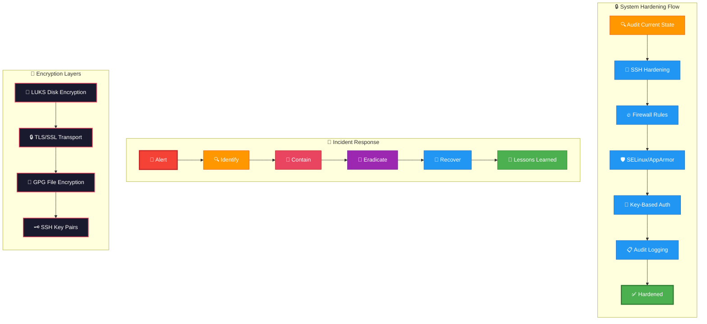

# Linux Security Guide

---

## 🎬 Security Hardening — Animated Workflow

---

A production-focused Linux security guide covering foundational controls, hardening, auditing, incident response, and advanced defensive techniques.

> Audience: Linux administrators, DevOps engineers, security engineers, SREs, students, and operators who need practical hardening guidance from basic to advanced.

> Scope: This guide is distribution-aware but intentionally generic. Validate package names, service names, and paths on your platform before rollout.

## Table of Contents

1. [Security Fundamentals](./01-security-fundamentals.md)
2. [User Security](./02-user-security.md)
3. [Filesystem Security](./03-filesystem-security.md)
4. [SELinux](./04-selinux.md)
5. [AppArmor](./05-apparmor.md)
6. [Firewall Security](./06-firewall-security.md)
7. [SSH Hardening](./07-ssh-hardening.md)
8. [Encryption](./08-encryption.md)
9. [Auditing](./09-auditing.md)
10. [Intrusion Detection](./10-intrusion-detection.md)
11. [Network Security](./11-network-security.md)
12. [Container Security](./12-container-security.md)
13. [Incident Response](./13-incident-response.md)

## Appendix Material

- Appendix A provides concise operational checklists you can adapt for build reviews, quarterly hardening audits, and pre-production approvals.
- Use this command reference as a quick lookup during hardening reviews and incident response.
- Use these questions for self-study, team training, or internal review sessions.
- Checklist, command reference, and review-question appendix material has been folded into the relevant chapter.
