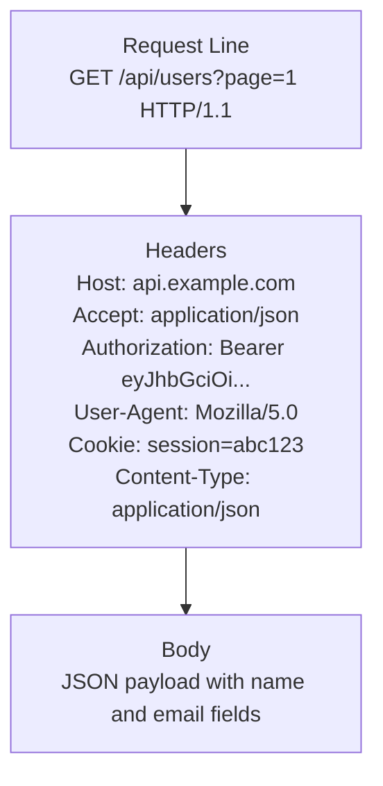
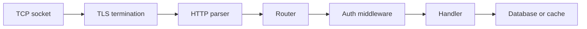
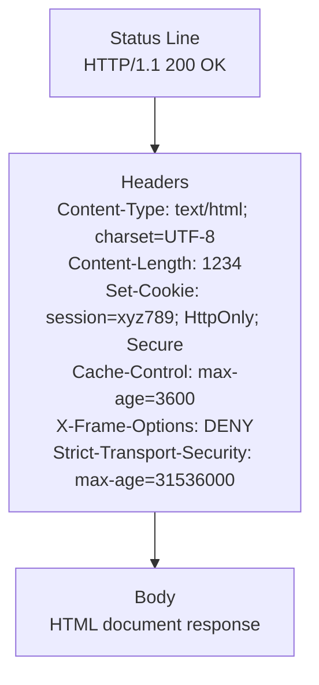
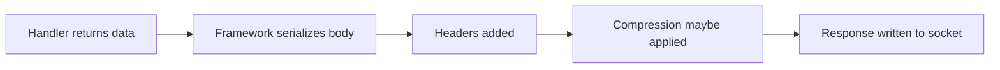
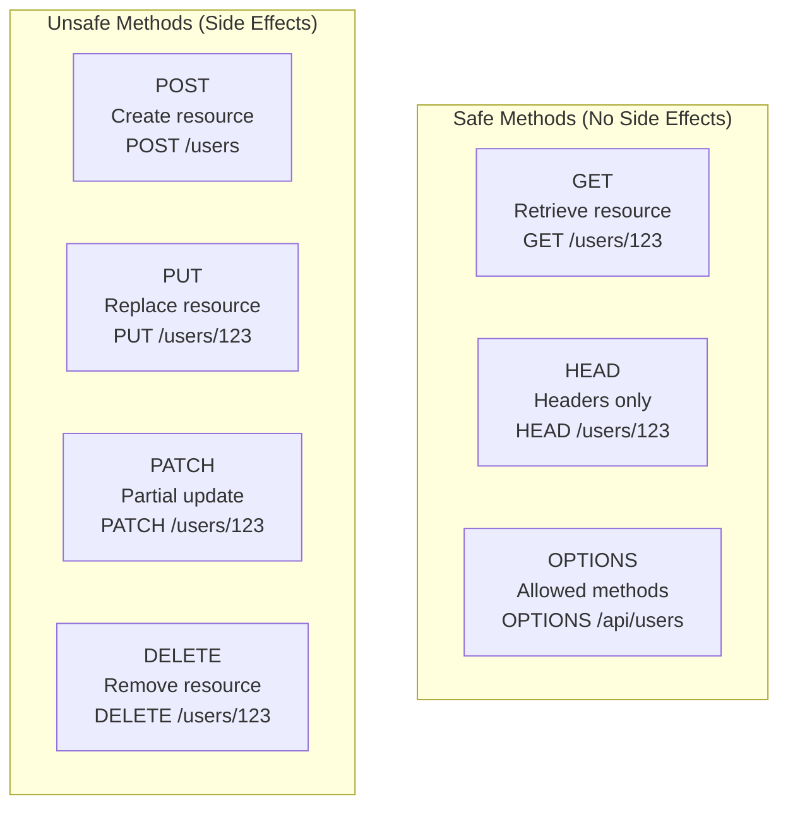
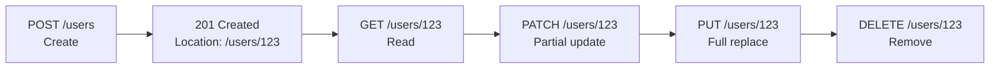

# HTTP Basics

← Back to [01-http-fundamentals.md](./01-http-fundamentals.md)

Core request and response structure, browser/server exchange, and HTTP method semantics.

---

## 2. HTTP Request Anatomy — Visual Breakdown

An HTTP request has three major parts.

- request line
- headers
- optional body

### 2.1 Visual code block

```text
┌─────────────────────────────────────────────────┐
│ Request Line                                     │
│ GET /api/users?page=1 HTTP/1.1                  │
│ ↑     ↑                  ↑                       │
│ Method  Path+Query    Version                    │
├─────────────────────────────────────────────────┤
│ Headers                                          │
│ Host: api.example.com                           │
│ Accept: application/json                         │
│ Authorization: Bearer eyJhbGciOi...             │
│ User-Agent: Mozilla/5.0                         │
│ Cookie: session=abc123                           │
│ Content-Type: application/json                   │
├─────────────────────────────────────────────────┤
│ Body (for POST/PUT/PATCH)                        │
│ {"name": "John", "email": "john@example.com"}  │
└─────────────────────────────────────────────────┘
```

### 2.2 Mermaid diagram of the same request



### 2.3 Raw HTTP example

```http
POST /api/users?page=1 HTTP/1.1
Host: api.example.com
Accept: application/json
Authorization: Bearer eyJhbGciOi...
User-Agent: Mozilla/5.0
Cookie: session=abc123
Content-Type: application/json
Content-Length: 45

{"name":"John","email":"john@example.com"}
```

### 2.4 Request line explained

The request line is:

```text
GET /api/users?page=1 HTTP/1.1
```

It contains:

- method
- target
- version

#### Method

The method tells the server what kind of action the client wants.

Examples:

- `GET` for read
- `POST` for create or submit
- `PUT` for replace
- `PATCH` for partial update
- `DELETE` for remove

#### Path and query

`/api/users?page=1`

The path identifies the resource.

The query string adds parameters.

Important rule:

A query string is not the same thing as the body.

#### Version

`HTTP/1.1`

This tells the server which HTTP protocol syntax and semantics the client expects.

### 2.5 Headers explained

Headers are metadata.

They describe the request.

Common request headers:

| Header | What it means | Why it matters |
|---|---|---|
| `Host` | target host | required in HTTP/1.1 |
| `Accept` | preferred response type | content negotiation |
| `Authorization` | credentials | API access control |
| `User-Agent` | client identity string | debugging and analytics |
| `Cookie` | browser state | sessions and preferences |
| `Content-Type` | body format | tells server how to parse body |
| `Content-Length` | byte size of body | framing in HTTP/1.1 |

### 2.6 Body explained

The body is optional.

It is commonly used with:

- `POST`
- `PUT`
- `PATCH`

Typical body formats:

- JSON
- form data
- multipart file upload
- XML
- plain text

### 2.7 Request example with curl

Command:

```bash
curl -i https://api.example.com/users \
  -H 'Accept: application/json' \
  -H 'Authorization: Bearer demo-token'
```

Representative request seen by the server:

```http
GET /users HTTP/1.1
Host: api.example.com
User-Agent: curl/8.7.1
Accept: application/json
Authorization: Bearer demo-token
```

### 2.8 Request example with JSON body

Command:

```bash
curl -i https://api.example.com/users \
  -X POST \
  -H 'Content-Type: application/json' \
  -d '{"name":"John","email":"john@example.com"}'
```

Representative request:

```http
POST /users HTTP/1.1
Host: api.example.com
User-Agent: curl/8.7.1
Accept: */*
Content-Type: application/json
Content-Length: 43

{"name":"John","email":"john@example.com"}
```

### 2.9 Common mistakes in requests

- missing `Host` header in HTTP/1.1
- wrong `Content-Type`
- wrong path
- wrong HTTP method
- invalid JSON body
- missing auth header
- huge cookies causing header size errors

### 2.10 Request processing path inside a server



---

## 3. HTTP Response Anatomy — Visual Breakdown

The response also has three major parts.

- status line
- headers
- optional body

### 3.1 Visual code block

```text
┌─────────────────────────────────────────────────┐
│ Status Line                                      │
│ HTTP/1.1 200 OK                                  │
│ ↑        ↑    ↑                                  │
│ Version  Code Reason                             │
├─────────────────────────────────────────────────┤
│ Headers                                          │
│ Content-Type: text/html; charset=UTF-8          │
│ Content-Length: 1234                              │
│ Set-Cookie: session=xyz789; HttpOnly; Secure    │
│ Cache-Control: max-age=3600                      │
│ X-Frame-Options: DENY                            │
│ Strict-Transport-Security: max-age=31536000     │
├─────────────────────────────────────────────────┤
│ Body                                             │
│ <!DOCTYPE html><html>...</html>                 │
└─────────────────────────────────────────────────┘
```

### 3.2 Mermaid diagram of the same response



### 3.3 Raw response example

```http
HTTP/1.1 200 OK
Content-Type: text/html; charset=UTF-8
Content-Length: 1234
Set-Cookie: session=xyz789; HttpOnly; Secure
Cache-Control: max-age=3600
X-Frame-Options: DENY
Strict-Transport-Security: max-age=31536000

<!DOCTYPE html>
<html>...</html>
```

### 3.4 Status line explained

The status line has:

- version
- status code
- reason phrase

`HTTP/1.1 200 OK`

Means:

- HTTP version is 1.1
- status code is 200
- reason is OK

The client mainly relies on the status code.

### 3.5 Response headers explained

Headers tell the client how to interpret the response.

| Header | Meaning | Why it matters |
|---|---|---|
| `Content-Type` | body MIME type | parsing behavior |
| `Content-Length` | body size | framing and progress |
| `Set-Cookie` | set cookie in browser | session or app state |
| `Cache-Control` | cache rules | browser and CDN behavior |
| `X-Frame-Options` | anti-clickjacking | browser security |
| `Strict-Transport-Security` | force future HTTPS | HTTPS hardening |

### 3.6 Response body explained

The body may contain:

- HTML
- JSON
- CSS
- JavaScript
- image bytes
- PDF data
- nothing at all for `204 No Content`

### 3.7 Example response from curl

Command:

```bash
curl -i https://www.example.com/
```

Representative output:

```http
HTTP/1.1 200 OK
Content-Type: text/html; charset=UTF-8
Content-Length: 1582
Cache-Control: no-cache
Server: nginx

<!DOCTYPE html>
<html>
<head><title>Example</title></head>
<body>Hello</body>
</html>
```

### 3.8 Example JSON response

```http
HTTP/1.1 200 OK
Content-Type: application/json
Content-Length: 56
Cache-Control: no-store

{"id":123,"name":"John","email":"john@example.com"}
```

### 3.9 Response generation path



---

## 4. HTTP Methods — Visual with Use Cases

Methods communicate intent.

### 📸 REST API Methods

> *Source: Wikimedia Commons — HTTP request example*

They do not magically enforce correctness.

But they are still central to good API design.



### 4.1 Safe vs unsafe

Safe means the method should not change server state.

Common safe methods:

- `GET`
- `HEAD`
- `OPTIONS`

Unsafe means it can change server state.

Common unsafe methods:

- `POST`
- `PUT`
- `PATCH`
- `DELETE`

### 4.2 Idempotent vs non-idempotent

Idempotent means:

repeating the same request leaves the resource in the same final state.

Examples:

- `GET` is idempotent
- `PUT` is usually idempotent
- `DELETE` is usually idempotent
- `POST` is usually not idempotent

### 4.3 Method summary table

| Method | Purpose | Safe | Idempotent | Common success code |
|---|---|---:|---:|---|
| `GET` | read | yes | yes | `200` |
| `HEAD` | read headers only | yes | yes | `200` |
| `OPTIONS` | capability discovery | yes | yes | `204` |
| `POST` | create or submit | no | no | `201` or `202` |
| `PUT` | replace | no | yes | `200` or `204` |
| `PATCH` | partial update | no | usually no | `200` or `204` |
| `DELETE` | remove | no | yes | `204` |

### 4.4 GET

Use `GET` to retrieve a resource.

Example use cases:

- fetch an HTML page
- fetch a JSON object
- fetch an image
- fetch a list of users

curl example:

```bash
curl -i https://api.example.com/users/123
```

Representative request:

```http
GET /users/123 HTTP/1.1
Host: api.example.com
User-Agent: curl/8.7.1
Accept: */*
```

Representative response:

```http
HTTP/1.1 200 OK
Content-Type: application/json
Content-Length: 52

{"id":123,"name":"John","email":"john@example.com"}
```

Key points:

- should not mutate state
- may be cached
- may be retried more safely than `POST`

### 4.5 HEAD

Use `HEAD` to ask for the same headers as `GET`,

but without the body.

Typical use cases:

- health checks
- checking file size
- checking `ETag`
- checking `Last-Modified`

curl example:

```bash
curl -I https://api.example.com/users/123
```

Representative response:

```http
HTTP/1.1 200 OK
Content-Type: application/json
Content-Length: 52
ETag: "u123-v5"
Last-Modified: Tue, 14 Jan 2025 08:00:00 GMT
```

### 4.6 OPTIONS

Use `OPTIONS` to ask what is allowed.

Typical use cases:

- API discovery
- browser CORS preflight
- checking allowed methods

curl example:

```bash
curl -i -X OPTIONS https://api.example.com/users
```

Representative response:

```http
HTTP/1.1 204 No Content
Allow: GET, POST, OPTIONS
Access-Control-Allow-Origin: https://app.example.com
Access-Control-Allow-Methods: GET, POST, OPTIONS
Access-Control-Allow-Headers: Authorization, Content-Type
```

### 4.7 POST

Use `POST` to create a new resource,

or submit data for processing.

curl example:

```bash
curl -i https://api.example.com/users \
  -X POST \
  -H 'Content-Type: application/json' \
  -d '{"name":"John","email":"john@example.com"}'
```

Representative request:

```http
POST /users HTTP/1.1
Host: api.example.com
Content-Type: application/json
Content-Length: 43

{"name":"John","email":"john@example.com"}
```

Representative response:

```http
HTTP/1.1 201 Created
Location: /users/123
Content-Type: application/json

{"id":123,"name":"John","email":"john@example.com"}
```

### 4.8 PUT

Use `PUT` to replace a resource representation.

If you send the same `PUT` again,

the final state should usually be the same.

curl example:

```bash
curl -i https://api.example.com/users/123 \
  -X PUT \
  -H 'Content-Type: application/json' \
  -d '{"name":"John Smith","email":"john@example.com","role":"editor"}'
```

Representative request:

```http
PUT /users/123 HTTP/1.1
Host: api.example.com
Content-Type: application/json
Content-Length: 64

{"name":"John Smith","email":"john@example.com","role":"editor"}
```

Representative response:

```http
HTTP/1.1 200 OK
Content-Type: application/json

{"id":123,"name":"John Smith","email":"john@example.com","role":"editor"}
```

### 4.9 PATCH

Use `PATCH` for partial updates.

You send only the changed fields.

curl example:

```bash
curl -i https://api.example.com/users/123 \
  -X PATCH \
  -H 'Content-Type: application/json' \
  -d '{"role":"admin"}'
```

Representative request:

```http
PATCH /users/123 HTTP/1.1
Host: api.example.com
Content-Type: application/json
Content-Length: 16

{"role":"admin"}
```

Representative response:

```http
HTTP/1.1 200 OK
Content-Type: application/json

{"id":123,"name":"John","email":"john@example.com","role":"admin"}
```

### 4.10 DELETE

Use `DELETE` to remove a resource.

curl example:

```bash
curl -i https://api.example.com/users/123 -X DELETE
```

Representative request:

```http
DELETE /users/123 HTTP/1.1
Host: api.example.com
User-Agent: curl/8.7.1
Accept: */*
```

Representative response:

```http
HTTP/1.1 204 No Content
```

### 4.11 TRACE and CONNECT

These are less common in everyday app APIs,

but still part of HTTP history and infrastructure.

#### TRACE

Purpose:

- diagnostic loopback
- server echoes the request

Why often disabled:

- security risk
- rarely needed in normal production apps

Example:

```bash
curl -i https://api.example.com/ -X TRACE
```

Possible response:

```http
HTTP/1.1 405 Method Not Allowed
Allow: GET, POST
```

#### CONNECT

Purpose:

- ask a proxy to open a tunnel
- common with HTTPS through proxies

Conceptual example:

```http
CONNECT api.example.com:443 HTTP/1.1
Host: api.example.com:443
```

Possible response:

```http
HTTP/1.1 200 Connection Established
```

### 4.12 Method selection cheat sheet

| If you want to... | Usually use |
|---|---|
| read a page | `GET` |
| read an API record | `GET` |
| inspect headers only | `HEAD` |
| ask what is allowed | `OPTIONS` |
| create a record | `POST` |
| replace a record | `PUT` |
| update one field | `PATCH` |
| remove a record | `DELETE` |

### 4.13 Visual lifecycle of methods in a REST API



---
