# HTTP/2, HTTP/3, and Request Lifecycle Context

← Back to [01-http-fundamentals.md](./01-http-fundamentals.md)

How a request reaches the server and how newer protocol versions improve transport behavior.

---

## 1. What Happens When You Type a URL — Complete Visual

A browser does much more than “send a GET request”.

### 📸 HTTP Request-Response Cycle
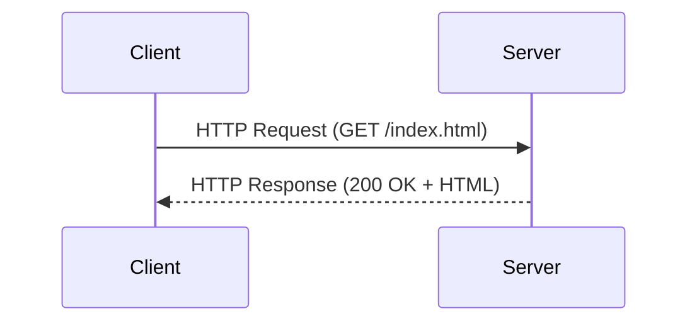
> *Source: Wikimedia Commons — HTTP request-response model*

A real page load is a chain of dependent events.

If any step fails,

the page fails.

The steps usually look like this.

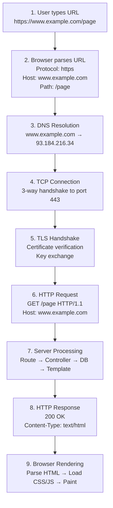

### 1.1 Step-by-step explanation

#### Step 1: User types a URL

Example:

```text
https://www.example.com/page
```

The browser receives a string.

It must decide:

- which protocol to use
- which host to contact
- which port to use
- which path to request
- whether there is a query string
- whether there is a fragment

#### Step 2: Browser parses the URL

For this URL:

```text
https://www.example.com:443/page?lang=en#intro
```

The pieces are:

- Scheme: `https`
- Host: `www.example.com`
- Port: `443`
- Path: `/page`
- Query string: `lang=en`
- Fragment: `intro`

Important note:

The fragment is not sent to the server.

It is handled by the browser.

#### Step 3: DNS resolution

The browser needs an IP address.

It may check:

- browser cache
- OS resolver cache
- local hosts file
- recursive DNS resolver
- authoritative DNS servers

Example lookup:

```bash
dig +short www.example.com
```

Example output:

```text
93.184.216.34
```

If DNS fails,

HTTP never starts.

#### Step 4: TCP connection

For HTTPS,

the browser usually connects to port `443`.

TCP uses a three-way handshake.

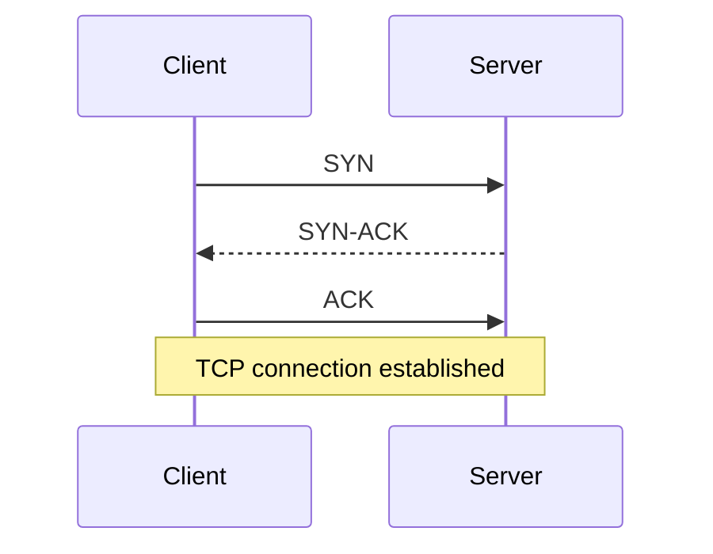

If the server is not listening,

you may see:

- connection refused
- timeout
- network unreachable

#### Step 5: TLS handshake

HTTPS means HTTP inside TLS.

The client and server negotiate:

- TLS version
- cipher suite
- certificate chain
- server identity
- session keys

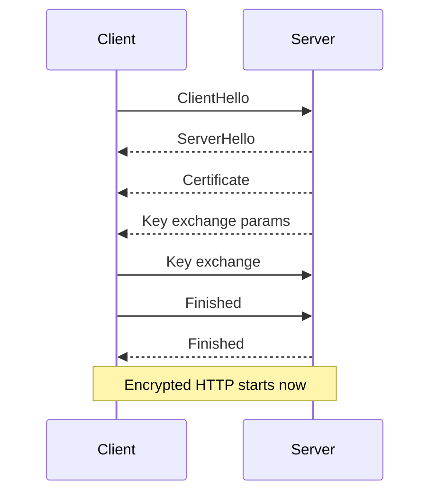

Common TLS failure reasons:

- expired certificate
- hostname mismatch
- untrusted CA
- unsupported TLS version
- SNI misconfiguration

#### Step 6: HTTP request

After the secure channel exists,

the browser sends the request.

Example:

```http
GET /page HTTP/1.1
Host: www.example.com
User-Agent: Mozilla/5.0
Accept: text/html
Accept-Encoding: gzip, br
Connection: keep-alive
```

#### Step 7: Server processing

A typical application path is:

- edge server accepts the request
- reverse proxy routes it
- application framework matches the route
- controller or handler runs
- cache may be checked
- database may be queried
- HTML or JSON is generated

#### Step 8: HTTP response

The server sends:

- status line
- headers
- body

Example:

```http
HTTP/1.1 200 OK
Content-Type: text/html; charset=UTF-8
Content-Length: 1582
Cache-Control: no-cache

<!DOCTYPE html>
<html>...</html>
```

#### Step 9: Browser rendering

The browser then:

- parses HTML
- builds the DOM
- discovers CSS, JS, images, fonts
- sends more HTTP requests
- parses CSS
- builds the CSSOM
- executes JavaScript
- performs layout
- paints pixels

### 1.2 Full end-to-end timeline

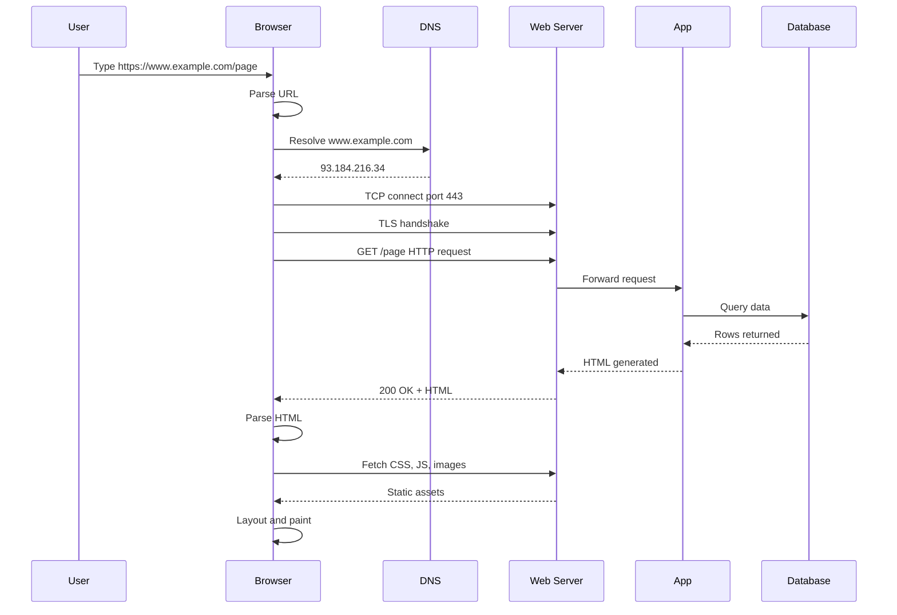

### 1.3 What can go wrong at each stage

| Stage | Typical symptom | Example cause |
|---|---|---|
| URL parse | bad URL error | malformed scheme |
| DNS | could not resolve host | missing DNS record |
| TCP | connection refused | server not listening |
| TCP | timeout | firewall drop |
| TLS | certificate error | wrong SAN or expired cert |
| HTTP routing | 404 | path not mapped |
| HTTP auth | 401 or 403 | missing token or denied user |
| Upstream app | 502 or 503 | crashed backend |
| Database | 500 or 504 | query failure or timeout |
| Browser render | blank page | broken JS bundle |

### 1.4 Mental model

Think in layers.

- DNS answers “where?”
- TCP answers “can we connect?”
- TLS answers “is it secure and who are you?”
- HTTP answers “what resource do you want?”
- HTML, CSS, and JS answer “what should the user see?”

---

## 6. HTTP/1.0 vs HTTP/1.1 vs HTTP/2 vs HTTP/3 — Visual Comparison

Each new version tried to reduce latency and improve efficiency.

### 📸 HTTP/1.1 vs HTTP/2 Multiplexing
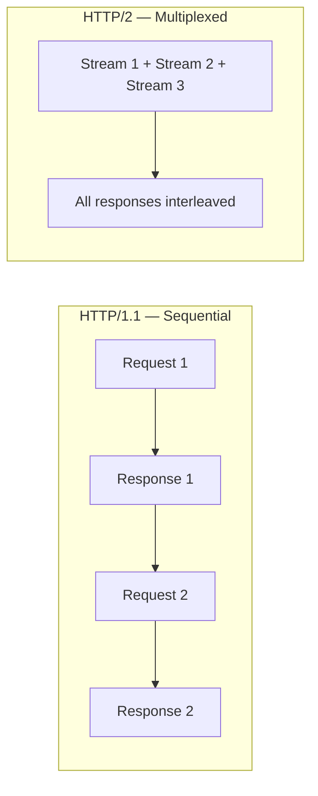
> *Source: Wikimedia Commons — HTTP/1.1 sequential vs HTTP/2 multiplexed requests*

```mermaid
graph TD
    subgraph HTTP10["HTTP/1.0 (1996)"]
        H10_1["New TCP connection<br/>for EVERY request"] --> H10_2["Close connection<br/>after response"]
    end
    
    subgraph HTTP11["HTTP/1.1 (1997)"]
        H11_1["Keep-Alive:<br/>reuse TCP connection"] --> H11_2["But: Head-of-Line blocking<br/>requests must be sequential"]
    end
    
    subgraph HTTP2["HTTP/2 (2015)"]
        H2_1["Multiplexing:<br/>parallel requests<br/>on single connection"] --> H2_2["Header compression<br/>(HPACK)"] --> H2_3["Server Push"]
    end
    
    subgraph HTTP3["HTTP/3 (2022)"]
        H3_1["QUIC protocol<br/>(UDP-based)"] --> H3_2["No head-of-line<br/>blocking at transport"] --> H3_3["0-RTT connection<br/>resumption"]
    end
```

### 6.1 High-level comparison table

| Version | Transport | Connection behavior | Main gain | Main pain point |
|---|---|---|---|---|
| HTTP/1.0 | TCP | one request per connection | simple | many connections |
| HTTP/1.1 | TCP | persistent connections | fewer handshakes | request serialization |
| HTTP/2 | TCP | multiplexed streams | parallelism | TCP packet loss still hurts all streams |
| HTTP/3 | QUIC over UDP | multiplexed streams with QUIC | better loss handling and faster resume | newer tooling and infrastructure complexity |

### 6.2 Timing diagram: HTTP/1.0

Six assets.

Six TCP connections.

Slow.

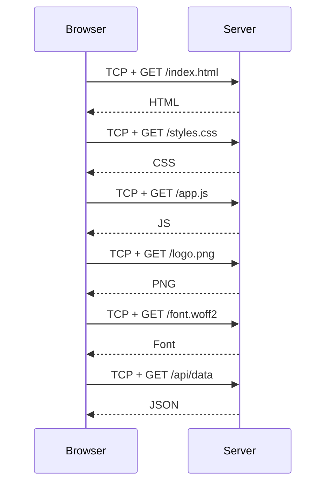

### 6.3 Timing diagram: HTTP/1.1

Six assets.

One TCP connection.

Sequential requests on a reused connection.

Better,

but still blocked by order.

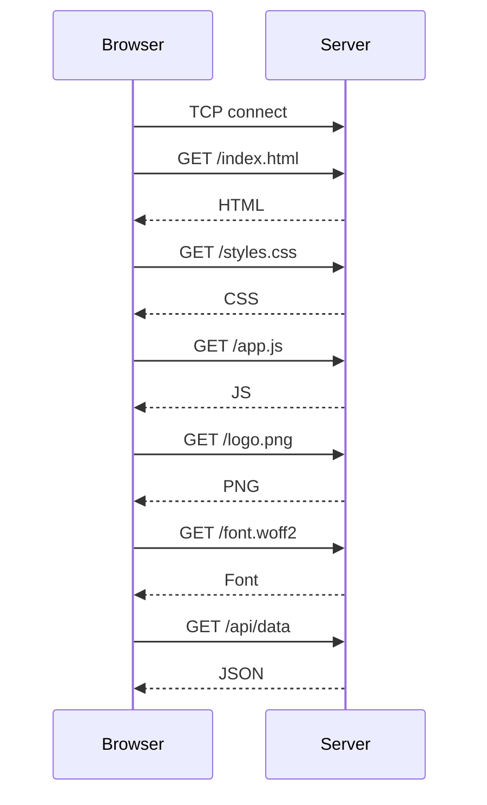

### 6.4 Timing diagram: HTTP/2

Six assets.

One TCP connection.

Parallel streams.

Fast.

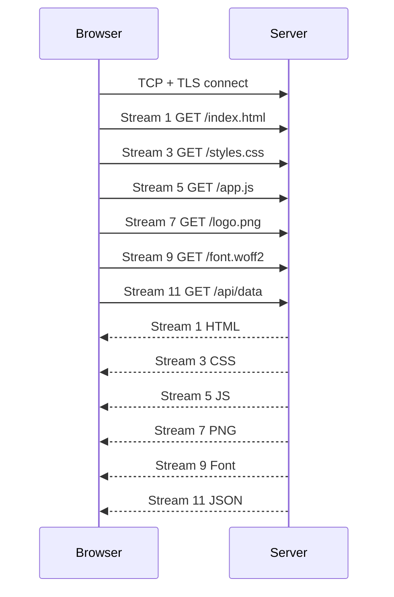

### 6.5 Timing diagram: HTTP/3

Six assets.

One QUIC connection.

Parallel streams.

No transport-level head-of-line blocking across streams.

Fastest under loss.

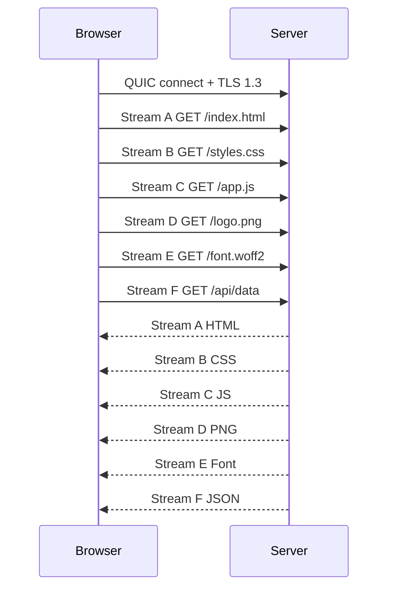

### 6.6 ASCII view of the same idea

```text
HTTP/1.0
[conn1 HTML] [conn2 CSS] [conn3 JS] [conn4 PNG] [conn5 Font] [conn6 API]

HTTP/1.1
[one TCP connection] -> HTML -> CSS -> JS -> PNG -> Font -> API

HTTP/2
[one TCP connection] -> HTML | CSS | JS | PNG | Font | API

HTTP/3
[one QUIC connection] -> HTML | CSS | JS | PNG | Font | API
(with better loss isolation)
```

### 6.7 Why HTTP/1.1 felt slow on asset-heavy pages

Because browsers had to do more connection management,

or queue requests.

That meant:

- more handshake overhead
- more socket churn
- more latency before assets started

### 6.8 Why HTTP/2 mattered

HTTP/2 introduced:

- multiplexing
- header compression
- binary framing
- prioritization

That reduced:

- redundant connection setup
- request queueing pain
- header bloat across repeated requests

### 6.9 Why HTTP/3 matters

HTTP/3 uses QUIC.

QUIC runs over UDP.

The big win is not “UDP is magically faster”.

The big win is better connection behavior under packet loss,

plus faster secure setup and stream independence.

### 6.10 Version testing with curl

```bash
curl --http1.0 -I https://example.com
curl --http1.1 -I https://example.com
curl --http2 -I https://example.com
curl --http3 -I https://example.com
```

### 6.11 Practical rule of thumb

- understand HTTP/1.1 deeply because infrastructure still uses it everywhere
- prefer HTTP/2 or HTTP/3 at the public edge when available
- test real latency rather than assuming a protocol upgrade fixes everything

---
