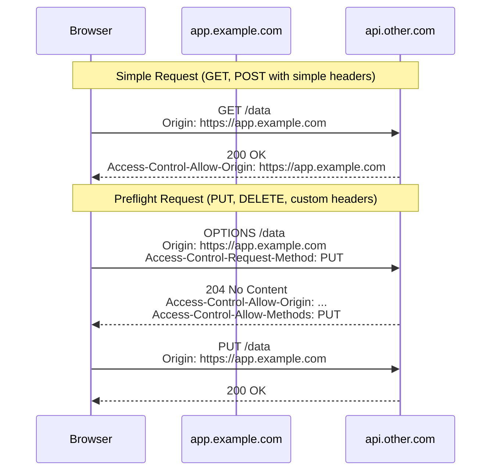
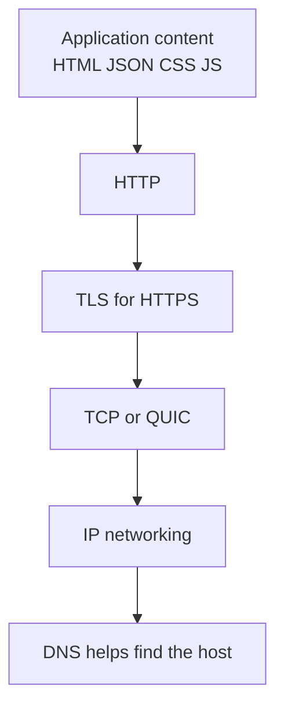
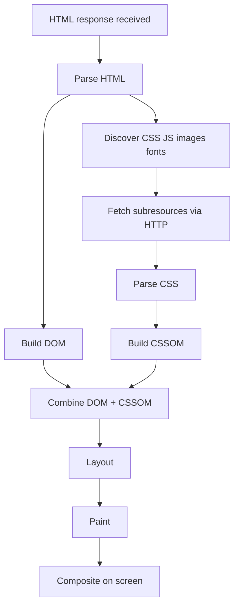
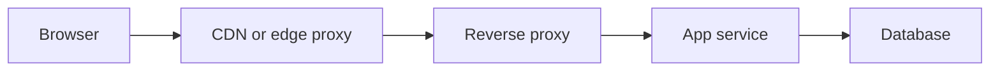

# HTTP Security Context

← Back to [01-http-fundamentals.md](./01-http-fundamentals.md)

Transport, CORS, proxy-aware delivery, and neighboring security-sensitive protocol behavior.

---

## 9. CORS — How Cross-Origin Requests Work

CORS matters only for browsers.

Server-to-server clients like `curl` do not enforce browser CORS rules.



### 9.1 What is an origin?

An origin is:

- scheme
- host
- port

These two are different origins:

- `https://app.example.com`
- `https://api.example.com`

These are also different origins:

- `https://app.example.com`
- `http://app.example.com`

### 9.2 Simple request example

Browser request:

```http
GET /data HTTP/1.1
Origin: https://app.example.com
```

Server response:

```http
HTTP/1.1 200 OK
Access-Control-Allow-Origin: https://app.example.com
Content-Type: application/json

{"message":"ok"}
```

### 9.3 Preflight request example

Browser sends preflight first:

```http
OPTIONS /data HTTP/1.1
Origin: https://app.example.com
Access-Control-Request-Method: PUT
Access-Control-Request-Headers: Authorization, Content-Type
```

Server replies:

```http
HTTP/1.1 204 No Content
Access-Control-Allow-Origin: https://app.example.com
Access-Control-Allow-Methods: GET, POST, PUT, DELETE
Access-Control-Allow-Headers: Authorization, Content-Type
Access-Control-Max-Age: 600
```

Then actual request is allowed.

### 9.4 Common CORS failures

- no `Access-Control-Allow-Origin`
- method missing from `Access-Control-Allow-Methods`
- custom header missing from `Access-Control-Allow-Headers`
- wildcard origin combined with credentials
- proxy strips `Origin`

### 9.5 curl testing for CORS

```bash
curl -i https://api.other.com/data \
  -H 'Origin: https://app.example.com'
```

Preflight test:

```bash
curl -i https://api.other.com/data \
  -X OPTIONS \
  -H 'Origin: https://app.example.com' \
  -H 'Access-Control-Request-Method: PUT' \
  -H 'Access-Control-Request-Headers: Authorization, Content-Type'
```

---

## 14. DNS, TCP, TLS, and HTTP Together

HTTP does not live alone.

It depends on lower layers.

### 14.1 Layered view



### 14.2 DNS refresher

DNS maps names to addresses.

Common record types:

- `A`
- `AAAA`
- `CNAME`
- `MX`
- `TXT`

Common commands:

```bash
dig example.com A
dig example.com AAAA
dig +short www.example.com
host www.example.com
```

### 14.3 TCP refresher

TCP gives:

- ordered delivery
- retransmission
- congestion control
- stream semantics

HTTP/1.0,
HTTP/1.1,
and HTTP/2

usually ride on TCP.

### 14.4 TLS refresher

TLS gives:

- encryption
- integrity
- authentication of the server

Common debugging command:

```bash
openssl s_client -connect www.example.com:443 -servername www.example.com
```

What you inspect:

- certificate subject
- SAN names
- issuer
- expiration
- negotiated TLS version
- cipher suite

### 14.5 Why HTTPS is not “application security” by itself

HTTPS protects data in transit.

It does not automatically fix:

- XSS
- CSRF
- SQL injection
- broken access control
- insecure session management

### 14.6 Seeing the layers in `curl -v`

Representative output sections:

- DNS resolved
- TCP connected
- TLS handshake succeeded
- HTTP request sent
- HTTP response received

That is why `curl -v` is so powerful.

---

## 15. Browser Rendering After the Response

Getting a `200 OK` is not the end.

It is the start of rendering work.

### 15.1 Rendering flow



### 15.2 Important consequence

One HTML response often causes many more HTTP requests.

Examples:

- CSS file
- JS bundle
- logo image
- font file
- API request for data

### 15.3 Why this matters for HTTP

Because page performance depends on:

- number of requests
- cacheability of subresources
- compression
- protocol version
- CDN placement
- render-blocking CSS and JS

### 15.4 Render-blocking resources

A CSS file in the `<head>` often blocks rendering.

A synchronous script can block parsing.

That is why:

- CSS delivery matters
- JS bundling and deferral matter
- caching static assets matters

---

## 16. Proxies, CDNs, and Reverse Proxies

Most production HTTP traffic touches intermediaries.

### 16.1 Forward proxy vs reverse proxy

| Type | Sits in front of | Used by |
|---|---|---|
| forward proxy | clients | enterprises, filtering, egress control |
| reverse proxy | servers | websites, APIs, edge control |

### 16.2 Reverse proxy jobs

- TLS termination
- static file serving
- routing to backends
- compression
- caching
- rate limiting
- header rewriting
- observability

### 16.3 CDN jobs

- cache static assets near users
- absorb traffic spikes
- terminate TLS globally
- provide edge security features
- lower latency worldwide

### 16.4 Reverse proxy visual



### 16.5 Why `Host` matters

A reverse proxy may host many domains on one IP.

The `Host` header tells it which site the client wants.

Example:

```http
Host: api.example.com
```

### 16.6 Why forwarding headers matter

Without forwarded headers,

the app may think:

- client IP is the proxy IP
- request scheme is HTTP not HTTPS
- original host is lost

That breaks:

- rate limiting
- audit logging
- redirect generation
- absolute URL generation
- secure cookie logic

---
