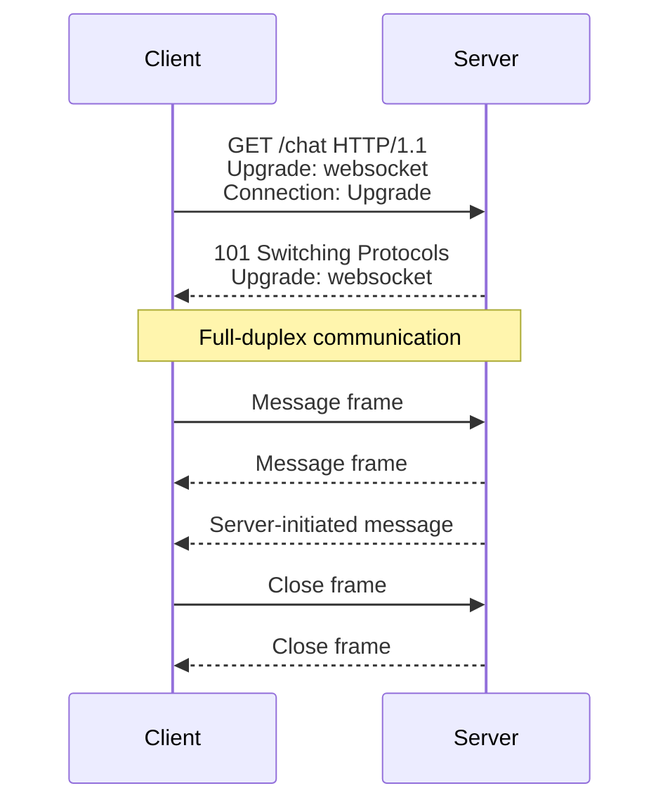

# HTTP Troubleshooting

← Back to [01-http-fundamentals.md](./01-http-fundamentals.md)

Hands-on curl workflows, debugging scenarios, worked examples, and practical design advice.

---

## 12. HTTP Debugging with curl

`curl` is one of the best HTTP learning and debugging tools.

### 12.1 `curl -v` for verbose protocol details

Command:

```bash
curl -v https://www.example.com/
```

What it shows:

- DNS resolution
- TCP connect
- TLS handshake
- negotiated protocol
- raw request headers
- raw response headers

Representative output:

```text
* Host www.example.com:443 was resolved.
*   Trying 93.184.216.34:443...
* Connected to www.example.com (93.184.216.34) port 443
* ALPN: curl offers h2,http/1.1
* SSL connection using TLSv1.3 / TLS_AES_256_GCM_SHA384
> GET / HTTP/2
> Host: www.example.com
> User-Agent: curl/8.7.1
> Accept: */*
< HTTP/2 200
< content-type: text/html; charset=UTF-8
< content-length: 1582
```

### 12.2 `curl -H` for custom headers

Command:

```bash
curl -i https://api.example.com/me \
  -H 'Authorization: Bearer demo-token' \
  -H 'Accept: application/json'
```

### 12.3 `curl -X POST -d` for sending data

Command:

```bash
curl -i https://api.example.com/users \
  -X POST \
  -H 'Content-Type: application/json' \
  -d '{"name":"John","email":"john@example.com"}'
```

Representative response:

```http
HTTP/1.1 201 Created
Location: /users/123
Content-Type: application/json

{"id":123,"name":"John","email":"john@example.com"}
```

### 12.4 `curl -o` to write response body to a file

Command:

```bash
curl -o homepage.html https://www.example.com/
```

Useful when:

- saving HTML for offline inspection
- downloading binary files
- avoiding binary output in the terminal

### 12.5 `curl --resolve` to test without real DNS changes

Command:

```bash
curl -i https://www.example.com/ \
  --resolve www.example.com:443:203.0.113.50
```

What it does:

- uses the given IP for that host and port
- still sends correct Host/SNI info

Great for:

- testing new server before DNS cutover
- validating TLS on a future target

### 12.6 `curl -w` for timing metrics

Command:

```bash
curl -o /dev/null -s -w 'dns=%{time_namelookup} connect=%{time_connect} tls=%{time_appconnect} ttfb=%{time_starttransfer} total=%{time_total}\n' https://www.example.com/
```

Representative output:

```text
dns=0.004 connect=0.023 tls=0.071 ttfb=0.132 total=0.181
```

### 12.7 `curl -k` to skip TLS verification

Command:

```bash
curl -k -i https://staging.internal.example/
```

Warning:

Use only for debugging.

It disables certificate verification.

Do not normalize insecure production habits with `-k`.

### 12.8 Curl cheat sheet

| Goal | Command pattern |
|---|---|
| verbose details | `curl -v URL` |
| show headers and body | `curl -i URL` |
| HEAD request | `curl -I URL` |
| custom header | `curl -H 'Header: value' URL` |
| custom method | `curl -X METHOD URL` |
| send JSON body | `curl -H 'Content-Type: application/json' -d '{}' URL` |
| save output | `curl -o file URL` |
| test DNS override | `curl --resolve host:443:IP URL` |
| measure timings | `curl -w '...' URL` |
| skip TLS verify | `curl -k URL` |

## 13. WebSocket — HTTP Upgrade Visual

WebSocket starts as HTTP.

### 📸 WebSocket Protocol

> *Source: Wikimedia Commons — WebSocket connection upgrade*

Then it upgrades.

After upgrade,

it becomes a persistent full-duplex protocol.



### 13.1 Why WebSocket exists

Normal HTTP is request/response.

That is fine for:

- pages
- normal APIs
- downloads

But for:

- chat
- live dashboards
- multiplayer state
- market feeds
- collaborative editing

it is often better to keep a connection open.

### 13.2 WebSocket handshake example

Request:

```http
GET /chat HTTP/1.1
Host: chat.example.com
Upgrade: websocket
Connection: Upgrade
Sec-WebSocket-Key: dGhlIHNhbXBsZSBub25jZQ==
Sec-WebSocket-Version: 13
Origin: https://app.example.com
```

Response:

```http
HTTP/1.1 101 Switching Protocols
Upgrade: websocket
Connection: Upgrade
Sec-WebSocket-Accept: s3pPLMBiTxaQ9kYGzzhZRbK+xOo=
```

### 13.3 Common proxy requirements for WebSocket

- forward `Upgrade`
- forward `Connection: Upgrade`
- keep connection timeouts long enough
- disable buffering when appropriate

### 13.4 Common WebSocket debugging questions

- did the server return `101`?
- did the proxy pass upgrade headers?
- is TLS terminating correctly?
- are idle timeouts too short?
- does load balancer need sticky sessions?

---

## 17. Hands-On Debugging Scenarios

This section focuses on practical reasoning.

### 17.1 Scenario: site does not load at all

Start with:

```bash
curl -v https://www.example.com/
```

Look for:

- DNS failure
- TCP timeout
- TLS error
- HTTP error

Interpretation guide:

- no DNS answer -> DNS issue
- connect timeout -> network or firewall issue
- cert verify failure -> TLS issue
- `502` -> proxy/upstream issue
- `200` but blank page in browser -> likely frontend/render issue

### 17.2 Scenario: API returns 401 unexpectedly

Checklist:

- send token?
- token expired?
- wrong signing key?
- wrong audience or issuer?
- clock skew?

Command:

```bash
curl -i https://api.example.com/me \
  -H 'Authorization: Bearer demo-token'
```

### 17.3 Scenario: browser shows CORS error

Checklist:

- did response include `Access-Control-Allow-Origin`?
- is `Origin` exactly allowed?
- did preflight succeed?
- are credentials involved?
- is proxy stripping headers?

Command:

```bash
curl -i https://api.other.com/data \
  -X OPTIONS \
  -H 'Origin: https://app.example.com' \
  -H 'Access-Control-Request-Method: PUT' \
  -H 'Access-Control-Request-Headers: Authorization, Content-Type'
```

### 17.4 Scenario: assets are slow

Checklist:

- using HTTP/2 or HTTP/3?
- assets compressed?
- long-lived cache headers?
- CDN in front?
- asset count too high?

Commands:

```bash
curl --http2 -I https://www.example.com/app.js
curl -I https://www.example.com/app.js
curl -o /dev/null -s -w 'total=%{time_total}\n' https://www.example.com/app.js
```

### 17.5 Scenario: users randomly get logged out

Checklist:

- `Set-Cookie` attributes stable?
- domain or path mismatch?
- `Secure` cookie over HTTP?
- session store expiring too fast?
- load balancer stickiness required?

Inspect:

```bash
curl -i https://app.example.com/login
```

### 17.6 Scenario: intermittent 502

Checklist:

- upstream healthy?
- wrong port configured?
- keep-alive mismatch?
- backend restarting?
- app returning invalid headers?

Useful steps:

- test backend directly
- inspect proxy error logs
- compare timeout settings

### 17.7 Scenario: intermittent 504

Checklist:

- slow database?
- slow external API?
- too much request fan-out?
- timeout mismatch between LB, proxy, and app?

Useful commands:

```bash
curl -o /dev/null -s -w 'ttfb=%{time_starttransfer} total=%{time_total}\n' https://app.example.com/report
```

### 17.8 Scenario: downloads cannot resume

Checklist:

- does server support `Range`?
- does response use `206 Partial Content`?
- is CDN preserving range requests?

Command:

```bash
curl -i https://cdn.example.com/bigfile.iso \
  -H 'Range: bytes=1000-1999'
```

### 17.9 Scenario: browser still sees old JS after deploy

Checklist:

- long max-age on unversioned asset?
- old service worker?
- CDN cache not purged?
- asset fingerprint not changed?

Best fix:

- use content-hashed filenames
- keep long cache only for versioned assets

---

## 20. Curl Practice Lab

### 20.1 Inspect only headers

```bash
curl -I https://www.example.com/
```

Look for:

- status code
- server
- content type
- cache-control
- location

### 20.2 Inspect full response

```bash
curl -i https://www.example.com/
```

Look for:

- headers first
- body second

### 20.3 Inspect verbose connection details

```bash
curl -v https://www.example.com/
```

Look for:

- resolved IP
- ALPN
- TLS version
- request line
- response headers

### 20.4 Force HTTP/1.1

```bash
curl --http1.1 -I https://www.example.com/
```

### 20.5 Force HTTP/2

```bash
curl --http2 -I https://www.example.com/
```

### 20.6 Send custom host testing traffic

```bash
curl -i https://www.example.com/ \
  --resolve www.example.com:443:203.0.113.50
```

### 20.7 Send JSON body

```bash
curl -i https://api.example.com/orders \
  -X POST \
  -H 'Content-Type: application/json' \
  -d '{"sku":"KB-100","qty":1}'
```

### 20.8 Simulate cache revalidation

```bash
curl -i https://cdn.example.com/app.js \
  -H 'If-None-Match: "appjs-v17"'
```

### 20.9 Simulate CORS preflight

```bash
curl -i https://api.other.com/data \
  -X OPTIONS \
  -H 'Origin: https://app.example.com' \
  -H 'Access-Control-Request-Method: PATCH' \
  -H 'Access-Control-Request-Headers: Authorization, Content-Type'
```

### 20.10 Measure timings

```bash
curl -o /dev/null -s -w 'dns=%{time_namelookup}\nconnect=%{time_connect}\ntls=%{time_appconnect}\nttfb=%{time_starttransfer}\ntotal=%{time_total}\n' https://www.example.com/
```

### 20.11 Download a file

```bash
curl -o image.png https://www.example.com/logo.png
```

### 20.12 Test a self-signed staging cert

```bash
curl -k -i https://staging.internal.example/
```

### 20.13 Send bearer token

```bash
curl -i https://api.example.com/me \
  -H 'Authorization: Bearer demo-token'
```

### 20.14 Send basic auth

```bash
curl -i https://api.example.com/admin \
  -u admin:secret
```

### 20.15 Ask for compressed content

```bash
curl -i https://www.example.com/app.js \
  -H 'Accept-Encoding: gzip, br'
```

---

## 21. Quick Reference Tables

### 21.1 Frequently used request headers

| Header | Typical example | Purpose |
|---|---|---|
| `Host` | `Host: api.example.com` | virtual host routing |
| `Accept` | `Accept: application/json` | desired response format |
| `Authorization` | `Authorization: Bearer ...` | auth credentials |
| `Content-Type` | `Content-Type: application/json` | request body format |
| `Content-Length` | `Content-Length: 123` | body size |
| `Cookie` | `Cookie: session=abc` | browser state |
| `Origin` | `Origin: https://app.example.com` | browser origin info |
| `If-None-Match` | `If-None-Match: "v1"` | cache revalidation |
| `If-Modified-Since` | date value | timestamp revalidation |
| `Range` | `Range: bytes=0-999` | partial request |

### 21.2 Frequently used response headers

| Header | Typical example | Purpose |
|---|---|---|
| `Content-Type` | `application/json` | response format |
| `Content-Length` | `1234` | size |
| `Cache-Control` | `public, max-age=3600` | caching policy |
| `ETag` | `"asset-v17"` | validator |
| `Last-Modified` | date value | timestamp validator |
| `Set-Cookie` | `session=xyz; HttpOnly; Secure` | browser cookie creation |
| `Location` | `/login` | redirect or creation target |
| `Strict-Transport-Security` | long max-age | HTTPS enforcement |
| `Content-Security-Policy` | `default-src 'self'` | browser security policy |
| `Access-Control-Allow-Origin` | `https://app.example.com` | CORS access |

### 21.3 Common status codes at a glance

| Code | Meaning | Usual next step |
|---|---|---|
| `200` | success | use body |
| `201` | created | note `Location` |
| `204` | success, no body | do not parse body |
| `301` | permanent redirect | follow new URL |
| `304` | not modified | use cached copy |
| `400` | bad request | fix request syntax/data |
| `401` | unauthenticated | send valid credentials |
| `403` | forbidden | check permissions/policy |
| `404` | not found | check path/id |
| `409` | conflict | resolve state/version issue |
| `415` | wrong media type | fix `Content-Type` |
| `422` | validation error | fix field values |
| `429` | too many requests | back off |
| `500` | server bug | inspect server logs |
| `502` | bad upstream response | inspect proxy/backend |
| `503` | unavailable | check health/load |
| `504` | upstream timeout | profile slow dependency |

---

## 22. End-to-End Worked Example

Suppose a user opens:

```text
https://shop.example.com/products/42
```

### 22.1 URL parse

- scheme: `https`
- host: `shop.example.com`
- path: `/products/42`

### 22.2 DNS

Browser resolves host.

### 22.3 TCP and TLS

Browser connects to `443`.

TLS validates certificate.

### 22.4 Initial HTTP request

```http
GET /products/42 HTTP/1.1
Host: shop.example.com
Accept: text/html
Accept-Encoding: gzip, br
User-Agent: Mozilla/5.0
```

### 22.5 Server handling

- reverse proxy receives request
- route goes to product page handler
- app checks cache
- app queries product database
- template engine renders HTML

### 22.6 Response

```http
HTTP/1.1 200 OK
Content-Type: text/html; charset=UTF-8
Cache-Control: no-cache
Content-Encoding: br

<!DOCTYPE html>
<html>...</html>
```

### 22.7 Browser discovers subresources

- `/assets/app.4f92ac7.js`
- `/assets/styles.2b8d1aa.css`
- `/images/products/42.webp`
- `/api/recommendations?product=42`

### 22.8 Asset caching example

Versioned JS response:

```http
HTTP/1.1 200 OK
Cache-Control: public, max-age=31536000, immutable
ETag: "app-4f92ac7"
Content-Type: application/javascript
```

### 22.9 API request example

```http
GET /api/recommendations?product=42 HTTP/1.1
Accept: application/json
```

### 22.10 API response example

```http
HTTP/1.1 200 OK
Content-Type: application/json
Cache-Control: private, no-cache

{"items":[{"id":87,"name":"Mouse"},{"id":91,"name":"Monitor"}]}
```

### 22.11 Final visible outcome

- HTML rendered
- CSS applied
- JS enhances interactions
- product image loaded
- recommendations appear

That is a realistic HTTP-driven page load.

---

## 23. Common Misconceptions

### 23.1 “HTTPS means the site is secure”

Not fully.

HTTPS protects transport.

Application bugs can still exist.

### 23.2 “GET can never change anything”

By convention it should not.

Poorly designed apps sometimes violate this.

That is bad design.

### 23.3 “401 means permission denied”

Not quite.

`401` means auth is missing or invalid.

`403` means auth may be present,

but access is denied.

### 23.4 “CORS protects my API from all misuse”

No.

CORS is enforced by browsers.

Non-browser clients can still call the API.

Use real authentication and authorization.

### 23.5 “304 means an error”

No.

It is a cache success signal.

### 23.6 “HTTP/3 is always faster in every situation”

Not always.

It often helps,

especially on lossy networks.

But application design,

payload size,

caching,

and backend latency still dominate many cases.

---

## 24. Practical Design Advice

### 24.1 For static assets

- fingerprint filenames
- compress with Brotli and gzip
- set long max-age
- use CDN where possible

### 24.2 For HTML pages

- keep cache policy deliberate
- avoid leaking private content into shared caches
- use CSP and HSTS

### 24.3 For JSON APIs

- use correct status codes
- document request and response schemas
- return machine-readable errors
- include request IDs for tracing

### 24.4 For auth

- use HTTPS only
- secure cookies with `HttpOnly` and `Secure`
- validate tokens carefully
- rotate secrets

### 24.5 For operations

- log status code and latency
- log upstream info at proxies
- expose health checks
- align timeouts across components

---
