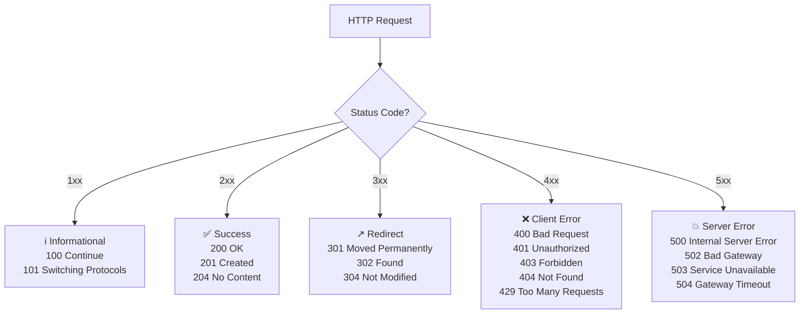

# HTTP Status Codes Reference I

← Back to [01-http-fundamentals.md](./01-http-fundamentals.md)

Reference guide for informational, success, redirect, and early client-error responses.

---

## 5. HTTP Status Codes — Visual Decision Tree

Status codes tell the client what happened.

They do not explain everything,

but they give the first big clue.



### 5.1 Family overview

| Family | Meaning | Typical interpretation |
|---|---|---|
| `1xx` | informational | request is in progress |
| `2xx` | success | request worked |
| `3xx` | redirection | client needs another step or can reuse cache |
| `4xx` | client error | request is invalid or not allowed |
| `5xx` | server error | server or upstream failed |

### 5.2 How to read a status code during debugging

Ask:

- did the request reach the server?
- did the server understand it?
- did auth pass?
- did routing succeed?
- did the app or upstream crash?
- did a cache or proxy alter the result?

### 5.3 100 Continue

When it occurs:

- client wants to send a large body
- client uses `Expect: 100-continue`
- server says “okay, send the body”

What it means:

- initial headers are acceptable
- continue uploading

How to fix it if broken:

- verify proxy supports `Expect`
- verify body size limits
- disable `Expect` if infrastructure mishandles it

curl example:

```bash
curl -i https://upload.example.com/files \
  -H 'Expect: 100-continue' \
  -T ./large-file.iso
```

Representative exchange:

```http
HTTP/1.1 100 Continue

HTTP/1.1 201 Created
Content-Type: application/json

{"status":"uploaded"}
```

### 5.4 101 Switching Protocols

When it occurs:

- protocol upgrade requested
- common with WebSocket

What it means:

- server agrees to switch protocols
- HTTP handshake ends
- new protocol takes over

How to fix it if broken:

- check `Upgrade` and `Connection` headers
- ensure reverse proxy passes upgrade headers
- verify backend supports WebSocket

curl example:

```bash
curl -i https://chat.example.com/ \
  -H 'Connection: Upgrade' \
  -H 'Upgrade: websocket'
```

Representative response:

```http
HTTP/1.1 101 Switching Protocols
Upgrade: websocket
Connection: Upgrade
```

### 5.5 200 OK

When it occurs:

- normal successful request
- page rendered
- API read succeeded
- update returned resource body

What it means:

- request succeeded
- body usually present

How to fix it if the wrong content is returned:

- verify route handler
- verify content negotiation
- inspect cache behavior
- inspect upstream response mapping

curl example:

```bash
curl -i https://api.example.com/users/123
```

Representative response:

```http
HTTP/1.1 200 OK
Content-Type: application/json

{"id":123,"name":"John"}
```

### 5.6 201 Created

When it occurs:

- successful resource creation
- common with `POST`

What it means:

- new resource exists now
- `Location` header is often included

How to fix incorrect behavior:

- ensure creation really happened once
- add idempotency keys for duplicate-sensitive flows
- return `Location` header when useful

curl example:

```bash
curl -i https://api.example.com/users \
  -X POST \
  -H 'Content-Type: application/json' \
  -d '{"name":"John"}'
```

Representative response:

```http
HTTP/1.1 201 Created
Location: /users/123
Content-Type: application/json

{"id":123,"name":"John"}
```

### 5.7 204 No Content

When it occurs:

- successful delete
- successful update with no response body
- successful preflight or health endpoint

What it means:

- request succeeded
- there is no body to parse

How to fix client-side issues:

- do not try to parse JSON from a `204`
- ensure frontend handles empty body correctly
- ensure API docs say body is empty

curl example:

```bash
curl -i https://api.example.com/users/123 -X DELETE
```

Representative response:

```http
HTTP/1.1 204 No Content
```

### 5.8 206 Partial Content

When it occurs:

- client asks for a byte range
- video playback
- resume download

What it means:

- only part of the resource is returned

How to fix issues:

- verify `Range` header parsing
- verify `Content-Range` correctness
- ensure CDN or proxy preserves range support

curl example:

```bash
curl -i https://cdn.example.com/video.mp4 \
  -H 'Range: bytes=0-999'
```

Representative response:

```http
HTTP/1.1 206 Partial Content
Content-Range: bytes 0-999/73400320
Content-Length: 1000
```

### 5.9 301 Moved Permanently

When it occurs:

- HTTP to HTTPS redirect
- non-canonical host redirect
- permanent URL migration

What it means:

- resource has a new permanent URL
- clients and search engines may cache the redirect

How to fix redirect problems:

- verify `Location` header
- avoid loops
- prefer permanent redirect only when stable
- test host and scheme rewrites carefully

curl example:

```bash
curl -i http://www.example.com/
```

Representative response:

```http
HTTP/1.1 301 Moved Permanently
Location: https://www.example.com/
```

### 5.10 302 Found

When it occurs:

- temporary redirect
- login flow redirect
- legacy framework redirect behavior

What it means:

- client should go somewhere else for now

How to fix bad behavior:

- use `307` or `308` if method preservation matters
- ensure temporary redirect is really temporary
- inspect repeated redirect chains

curl example:

```bash
curl -i https://app.example.com/private
```

Representative response:

```http
HTTP/1.1 302 Found
Location: /login
```

### 5.11 304 Not Modified

When it occurs:

- cache revalidation succeeds
- browser sends `If-None-Match` or `If-Modified-Since`

What it means:

- body not sent again
- client should use cached copy

How to fix cache issues:

- ensure validators are stable
- ensure `ETag` is correct
- ensure `Last-Modified` is meaningful
- add `Cache-Control` and `Vary` intentionally

curl example:

```bash
curl -i https://cdn.example.com/app.js \
  -H 'If-None-Match: "appjs-v17"'
```

Representative response:

```http
HTTP/1.1 304 Not Modified
ETag: "appjs-v17"
Cache-Control: public, max-age=31536000, immutable
```

### 5.12 307 Temporary Redirect

When it occurs:

- temporary redirect where method must stay the same
- upload moved temporarily

What it means:

- follow redirect
- preserve method and body

How to fix issues:

- choose `307` over `302` when preserving method matters
- verify clients follow redirects as expected

curl example:

```bash
curl -i https://upload.example.com/files \
  -X POST \
  -H 'Content-Type: application/json' \
  -d '{"name":"demo"}'
```

Representative response:

```http
HTTP/1.1 307 Temporary Redirect
Location: https://upload2.example.com/files
```

### 5.13 308 Permanent Redirect

When it occurs:

- permanent redirect where method must stay the same
- permanent API path migration

What it means:

- new canonical URL
- preserve method and body

How to fix issues:

- use only when the move is truly permanent
- verify clients and SDKs support `308`

curl example:

```bash
curl -i https://api.example.com/v1/orders \
  -X POST \
  -H 'Content-Type: application/json' \
  -d '{"sku":"KB-100"}'
```

Representative response:

```http
HTTP/1.1 308 Permanent Redirect
Location: https://api.example.com/v2/orders
```

### 5.14 400 Bad Request

When it occurs:

- malformed JSON
- missing required parameter
- invalid syntax
- body does not match parser expectations

What it means:

- server cannot process the request as sent

How to fix it:

- validate request schema
- verify JSON encoding
- verify required fields
- inspect server parser logs

curl example:

```bash
curl -i https://api.example.com/users \
  -X POST \
  -H 'Content-Type: application/json' \
  -d '{"name":"John"'
```

Representative response:

```http
HTTP/1.1 400 Bad Request
Content-Type: application/json

{"error":"invalid JSON payload"}
```

### 5.15 401 Unauthorized

When it occurs:

- no auth token
- invalid token
- expired token
- wrong credentials

What it means:

- authentication is required or failed

How to fix it:

- send correct `Authorization` header
- refresh expired token
- verify secret or public key config
- verify clock skew for JWT validation

curl example:

```bash
curl -i https://api.example.com/me
```

Representative response:

```http
HTTP/1.1 401 Unauthorized
WWW-Authenticate: Bearer realm="api"
Content-Type: application/json

{"error":"missing bearer token"}
```

### 5.16 403 Forbidden

When it occurs:

- user is authenticated but not allowed
- WAF blocks request
- IP blocked
- file permissions deny access

What it means:

- server understood the request
- server refuses to authorize it

How to fix it:

- verify RBAC or ACL policy
- verify filesystem permissions
- inspect WAF rules
- verify upstream authorization middleware

curl example:

```bash
curl -i https://api.example.com/admin \
  -H 'Authorization: Bearer user-token'
```

Representative response:

```http
HTTP/1.1 403 Forbidden
Content-Type: application/json

{"error":"insufficient permissions"}
```
