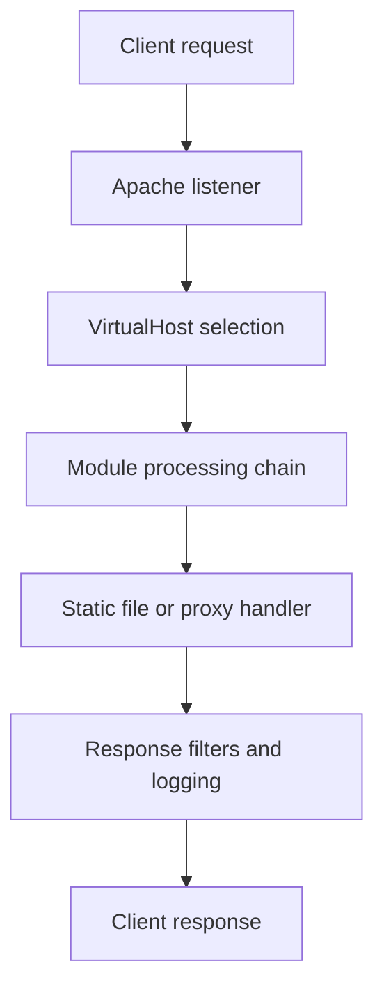

# Apache HTTP Server

## 2.1 Overview

Apache HTTP Server is a mature, modular, highly flexible web server.

Strengths:

- Broad module ecosystem
- Strong compatibility
- Per-directory configuration with `.htaccess`
- Reverse proxy support
- Multiple MPM models

Typical package names:

- Debian/Ubuntu: `apache2`
- RHEL/CentOS/Rocky/Alma: `httpd`

## 2.2 Key Directories

### Debian/Ubuntu

| Purpose | Path |
|---|---|
| Main config | `/etc/apache2/apache2.conf` |
| Ports | `/etc/apache2/ports.conf` |
| Sites available | `/etc/apache2/sites-available/` |
| Sites enabled | `/etc/apache2/sites-enabled/` |
| Mods available | `/etc/apache2/mods-available/` |
| Mods enabled | `/etc/apache2/mods-enabled/` |
| Logs | `/var/log/apache2/` |
| Web root | `/var/www/html/` |

### RHEL Family

| Purpose | Path |
|---|---|
| Main config | `/etc/httpd/conf/httpd.conf` |
| Extra configs | `/etc/httpd/conf.d/` |
| Modules | `/etc/httpd/modules/` |
| Logs | `/var/log/httpd/` |
| Web root | `/var/www/html/` |

## 2.3 Installation

### Debian/Ubuntu

```bash
sudo apt update
sudo apt install -y apache2
sudo systemctl enable --now apache2
```

### RHEL/Rocky/Alma

```bash
sudo dnf install -y httpd
sudo systemctl enable --now httpd
```

### Verify

```bash
systemctl status apache2
curl -I http://127.0.0.1
```

## 2.4 Apache Process Model

Apache supports Multi-Processing Modules (MPMs).

Main MPMs:

- prefork
- worker
- event

### 2.4.1 prefork

Characteristics:

- Process-based
- One thread per process
- Compatible with non-thread-safe modules
- Higher memory usage

Use when:

- Legacy modules require it
- Older PHP setups use `mod_php`

### 2.4.2 worker

Characteristics:

- Multi-process, multi-threaded
- Better memory efficiency than prefork
- Good for many concurrent connections

### 2.4.3 event

Characteristics:

- Similar to worker
- Better keep-alive handling
- Recommended in many modern deployments

### 2.4.4 Check Active MPM

```bash
apachectl -V | grep -i mpm
```

## 2.5 Basic Service Commands

```bash
sudo systemctl start apache2
sudo systemctl stop apache2
sudo systemctl restart apache2
sudo systemctl reload apache2
sudo apachectl configtest
sudo apachectl -S
```

## 2.6 Basic Virtual Host Example

Apache virtual hosts allow multiple sites on one server.

### Debian/Ubuntu Example

File:

```text
/etc/apache2/sites-available/example.com.conf
```

Content:

```apache
<VirtualHost *:80>
    ServerName example.com
    ServerAlias www.example.com
    DocumentRoot /var/www/example.com/public

    ErrorLog ${APACHE_LOG_DIR}/example.com-error.log
    CustomLog ${APACHE_LOG_DIR}/example.com-access.log combined

    <Directory /var/www/example.com/public>
        AllowOverride All
        Require all granted
        Options FollowSymLinks
    </Directory>
</VirtualHost>
```

Enable site:

```bash
sudo a2ensite example.com.conf
sudo apachectl configtest
sudo systemctl reload apache2
```

## 2.7 Name-Based Virtual Hosting

Apache uses the `Host` header to determine which virtual host should serve the request.

Best practices:

- Define explicit `ServerName`
- Add `ServerAlias` only when needed
- Create a catch-all default vhost

## 2.8 HTTPS Virtual Host Example

```apache
<VirtualHost *:443>
    ServerName example.com
    DocumentRoot /var/www/example.com/public

    SSLEngine on
    SSLCertificateFile /etc/letsencrypt/live/example.com/fullchain.pem
    SSLCertificateKeyFile /etc/letsencrypt/live/example.com/privkey.pem

    Protocols h2 http/1.1

    ErrorLog ${APACHE_LOG_DIR}/example.com-ssl-error.log
    CustomLog ${APACHE_LOG_DIR}/example.com-ssl-access.log combined

    <Directory /var/www/example.com/public>
        AllowOverride All
        Require all granted
    </Directory>
</VirtualHost>
```

Redirect HTTP to HTTPS:

```apache
<VirtualHost *:80>
    ServerName example.com
    Redirect permanent / https://example.com/
</VirtualHost>
```

## 2.9 Mermaid Diagram: Apache Request Processing



## 2.10 Important Apache Modules

| Module | Purpose |
|---|---|
| `mod_ssl` | TLS/SSL support |
| `mod_rewrite` | URL rewriting |
| `mod_proxy` | Reverse proxy core |
| `mod_proxy_http` | HTTP proxying |
| `mod_proxy_fcgi` | FastCGI proxy |
| `mod_headers` | Header manipulation |
| `mod_deflate` | Compression |
| `mod_brotli` | Brotli compression |
| `mod_expires` | Cache headers |
| `mod_status` | Server status |
| `mod_security2` | WAF integration |
| `mod_remoteip` | Real client IP handling |

### Enable Common Modules on Debian/Ubuntu

```bash
sudo a2enmod ssl rewrite headers expires proxy proxy_http proxy_fcgi status remoteip
sudo apachectl configtest
sudo systemctl reload apache2
```

## 2.11 mod_rewrite Basics

`mod_rewrite` is powerful but easy to misuse.

Typical uses:

- Redirect HTTP to HTTPS
- Remove trailing slashes
- Route all requests to a front controller
- Canonicalize domain names

Example front-controller rewrite:

```apache
<IfModule mod_rewrite.c>
    RewriteEngine On

    RewriteCond %{REQUEST_FILENAME} !-f
    RewriteCond %{REQUEST_FILENAME} !-d
    RewriteRule ^ index.php [L]
</IfModule>
```

Example force non-www to www:

```apache
RewriteEngine On
RewriteCond %{HTTP_HOST} ^example\.com$ [NC]
RewriteRule ^ https://www.example.com%{REQUEST_URI} [L,R=301]
```

## 2.12 .htaccess

`.htaccess` allows per-directory overrides.

Pros:

- Convenience in shared hosting
- No full server config access needed

Cons:

- Performance overhead
- Harder centralized management
- Potentially inconsistent security settings

Recommendation:

- Prefer central config when you control the server
- Use `.htaccess` only when necessary

### Example `.htaccess`

```apache
Options -Indexes

<IfModule mod_rewrite.c>
    RewriteEngine On
    RewriteRule ^old-page$ /new-page [R=301,L]
</IfModule>

<IfModule mod_headers.c>
    Header always set X-Content-Type-Options "nosniff"
</IfModule>
```

## 2.13 Directory Context Controls

Important directives:

- `AllowOverride`
- `Require`
- `Options`
- `DirectoryIndex`

Example:

```apache
<Directory /var/www/example.com/public>
    AllowOverride None
    Require all granted
    Options FollowSymLinks
    DirectoryIndex index.php index.html
</Directory>
```

## 2.14 Authentication in Apache

### Basic Auth Example

```bash
sudo apt install -y apache2-utils
sudo htpasswd -c /etc/apache2/.htpasswd admin
```

```apache
<Location /admin>
    AuthType Basic
    AuthName "Restricted Area"
    AuthUserFile /etc/apache2/.htpasswd
    Require valid-user
</Location>
```

## 2.15 Reverse Proxy with Apache

Example proxy to an application server:

```apache
<VirtualHost *:80>
    ServerName app.example.com

    ProxyPreserveHost On
    ProxyPass / http://127.0.0.1:3000/
    ProxyPassReverse / http://127.0.0.1:3000/

    RequestHeader set X-Forwarded-Proto "http"
    RequestHeader set X-Forwarded-Port "80"
</VirtualHost>
```

HTTPS reverse proxy example:

```apache
<VirtualHost *:443>
    ServerName app.example.com

    SSLEngine on
    SSLCertificateFile /etc/letsencrypt/live/app.example.com/fullchain.pem
    SSLCertificateKeyFile /etc/letsencrypt/live/app.example.com/privkey.pem

    ProxyPreserveHost On
    ProxyPass / http://127.0.0.1:3000/
    ProxyPassReverse / http://127.0.0.1:3000/

    RequestHeader set X-Forwarded-Proto "https"
    RequestHeader set X-Forwarded-Port "443"
</VirtualHost>
```

## 2.16 Apache as FastCGI Front End for PHP-FPM

Example:

```apache
<FilesMatch \.php$>
    SetHandler "proxy:unix:/run/php/php8.2-fpm.sock|fcgi://localhost/"
</FilesMatch>
```

Benefits of PHP-FPM over `mod_php`:

- Better isolation
- Better resource control
- Improved compatibility with threaded MPMs

## 2.17 Logging

### Access Log Formats

Common formats:

- `common`
- `combined`
- custom JSON-style lines

Example custom format:

```apache
LogFormat "%h %l %u %t \"%r\" %>s %b \"%{Referer}i\" \"%{User-Agent}i\" %D" vhost_combined
CustomLog ${APACHE_LOG_DIR}/example-access.log vhost_combined
```

### Error Logging

```apache
ErrorLog ${APACHE_LOG_DIR}/example-error.log
LogLevel warn
```

Useful log levels:

- emerg
- alert
- crit
- error
- warn
- notice
- info
- debug

## 2.18 Log Rotation

Linux systems commonly use `logrotate`.

Check:

```bash
cat /etc/logrotate.d/apache2
cat /etc/logrotate.d/httpd
```

Important settings:

- `daily`
- `rotate`
- `compress`
- `missingok`
- `notifempty`
- `postrotate`

## 2.19 Performance Tuning Fundamentals

Key directives depend on the MPM in use.

Common tuning areas:

- Max request workers
- Spare servers/threads
- KeepAlive settings
- Timeout values
- Compression
- Static asset caching
- Offloading dynamic work to app servers

### 2.19.1 Global Example

```apache
Timeout 60
KeepAlive On
MaxKeepAliveRequests 100
KeepAliveTimeout 2
ServerTokens Prod
ServerSignature Off
TraceEnable Off
```

### 2.19.2 prefork Tuning Example

```apache
<IfModule mpm_prefork_module>
    StartServers             4
    MinSpareServers          4
    MaxSpareServers          8
    MaxRequestWorkers      150
    MaxConnectionsPerChild 1000
</IfModule>
```

### 2.19.3 worker Tuning Example

```apache
<IfModule mpm_worker_module>
    StartServers             2
    MinSpareThreads         25
    MaxSpareThreads         75
    ThreadLimit             64
    ThreadsPerChild         25
    MaxRequestWorkers      400
    MaxConnectionsPerChild 1000
</IfModule>
```

### 2.19.4 event Tuning Example

```apache
<IfModule mpm_event_module>
    StartServers             2
    MinSpareThreads         25
    MaxSpareThreads         75
    ThreadLimit             64
    ThreadsPerChild         25
    MaxRequestWorkers      400
    MaxConnectionsPerChild 1000
</IfModule>
```

## 2.20 Compression

### Gzip via mod_deflate

```apache
<IfModule mod_deflate.c>
    AddOutputFilterByType DEFLATE text/html text/plain text/css application/javascript application/json application/xml
</IfModule>
```

### Brotli via mod_brotli

```apache
<IfModule mod_brotli.c>
    AddOutputFilterByType BROTLI_COMPRESS text/html text/plain text/css application/javascript application/json application/xml
</IfModule>
```

## 2.21 Cache Headers for Static Assets

```apache
<IfModule mod_expires.c>
    ExpiresActive On
    ExpiresByType text/css "access plus 30 days"
    ExpiresByType application/javascript "access plus 30 days"
    ExpiresByType image/png "access plus 90 days"
    ExpiresByType image/jpeg "access plus 90 days"
</IfModule>
```

## 2.22 Security Hardening

Checklist:

- Disable unnecessary modules
- Hide version details
- Disable TRACE
- Restrict filesystem access
- Use TLS 1.2 and 1.3 only when possible
- Add security headers
- Run ModSecurity if appropriate
- Monitor 4xx and 5xx spikes
- Protect admin paths with auth and IP allowlists

Example:

```apache
ServerTokens Prod
ServerSignature Off
TraceEnable Off
FileETag None
```

## 2.23 mod_status

Enable status endpoint carefully.

```apache
<Location /server-status>
    SetHandler server-status
    Require local
</Location>

ExtendedStatus On
```

Query:

```bash
curl http://127.0.0.1/server-status?auto
```

## 2.24 Real Client IP Behind Proxy

If Apache is behind another proxy or load balancer, configure `mod_remoteip`.

```apache
RemoteIPHeader X-Forwarded-For
RemoteIPTrustedProxy 10.0.0.10
```

## 2.25 SELinux Notes for RHEL Systems

Common actions:

```bash
getenforce
sudo setsebool -P httpd_can_network_connect 1
sudo restorecon -Rv /var/www/html
```

## 2.26 Firewall Notes

```bash
sudo ufw allow 80/tcp
sudo ufw allow 443/tcp
```

or:

```bash
sudo firewall-cmd --permanent --add-service=http
sudo firewall-cmd --permanent --add-service=https
sudo firewall-cmd --reload
```

## 2.27 Common Troubleshooting Commands

```bash
sudo apachectl configtest
sudo apachectl -S
sudo apachectl -M
sudo tail -f /var/log/apache2/error.log
sudo tail -f /var/log/httpd/error_log
curl -I http://127.0.0.1
ss -tulpn | grep ':80\|:443'
```

## 2.28 Example Production-Oriented Apache vHost

```apache
<VirtualHost *:443>
    ServerName www.example.com
    ServerAlias example.com
    DocumentRoot /var/www/example.com/public

    SSLEngine on
    SSLCertificateFile /etc/letsencrypt/live/www.example.com/fullchain.pem
    SSLCertificateKeyFile /etc/letsencrypt/live/www.example.com/privkey.pem
    SSLProtocol -all +TLSv1.2 +TLSv1.3
    SSLHonorCipherOrder Off
    Protocols h2 http/1.1

    ServerTokens Prod
    ServerSignature Off

    ErrorLog ${APACHE_LOG_DIR}/www-example-error.log
    CustomLog ${APACHE_LOG_DIR}/www-example-access.log combined

    <Directory /var/www/example.com/public>
        AllowOverride None
        Require all granted
        Options FollowSymLinks
    </Directory>

    <IfModule mod_headers.c>
        Header always set Strict-Transport-Security "max-age=31536000; includeSubDomains"
        Header always set X-Content-Type-Options "nosniff"
        Header always set X-Frame-Options "SAMEORIGIN"
        Header always set Referrer-Policy "strict-origin-when-cross-origin"
    </IfModule>

    <IfModule mod_expires.c>
        ExpiresActive On
        ExpiresByType text/css "access plus 30 days"
        ExpiresByType application/javascript "access plus 30 days"
        ExpiresByType image/png "access plus 90 days"
        ExpiresByType image/jpeg "access plus 90 days"
    </IfModule>
</VirtualHost>
```

## 2.29 Apache Best Practices Summary

- Prefer `event` MPM unless a dependency prevents it
- Use PHP-FPM instead of `mod_php` when practical
- Keep vhost configs clean and explicit
- Avoid excessive `.htaccess` usage
- Test config with `apachectl configtest`
- Use separate logs per site when needed
- Monitor worker exhaustion and timeouts

---

### 12.2 New Apache Site Checklist

- Create document root
- Create vhost config
- Set `ServerName`
- Set logs
- Define directory permissions
- Enable required modules
- Test with `apachectl configtest`
- Enable site
- Reload service
- Validate HTTP and HTTPS

### 13.2 Apache Troubleshooting

```bash
apachectl configtest
apachectl -S
apachectl -M
journalctl -u apache2 -xe
```

Look for:

- Syntax errors
- Wrong vhost match
- Missing modules
- Permission or SELinux issues
- Backend connection failures

### 15.2 Scenario: PHP App on Apache with PHP-FPM

Requirements:

- Legacy app
- Rewrite rules
- TLS
- Good compatibility

Example:

```apache
<VirtualHost *:443>
    ServerName legacy.example.com
    DocumentRoot /var/www/legacy/public

    SSLEngine on
    SSLCertificateFile /etc/letsencrypt/live/legacy.example.com/fullchain.pem
    SSLCertificateKeyFile /etc/letsencrypt/live/legacy.example.com/privkey.pem

    <Directory /var/www/legacy/public>
        AllowOverride None
        Require all granted
    </Directory>

    RewriteEngine On
    RewriteCond %{REQUEST_FILENAME} !-f
    RewriteCond %{REQUEST_FILENAME} !-d
    RewriteRule ^ index.php [L]

    <FilesMatch \.php$>
        SetHandler "proxy:unix:/run/php/php8.2-fpm.sock|fcgi://localhost/"
    </FilesMatch>
</VirtualHost>
```

### 19.2 Apache Reinforcement

- Apache excels at flexibility.
- Apache can serve static content and proxy dynamic apps.
- `mod_rewrite` is powerful but can become hard to maintain.
- Keep rewrite rules minimal and explicit.
- Prefer central configs over scattered `.htaccess` when possible.
- Separate logs per site if operationally helpful.
- Disable unnecessary modules to reduce risk.
- Test every config change with `apachectl configtest`.
- Use `event` MPM for modern workloads where compatible.
- Move PHP handling to PHP-FPM for better isolation.
- Protect status endpoints.
- Watch for worker exhaustion under traffic spikes.
- Keep timeouts reasonable.
- Avoid revealing server version details.
- Validate TLS chain after certificate renewals.

### 20.1 Apache Commands

```bash
apachectl -V
apachectl -M
apachectl -S
apachectl configtest
systemctl reload apache2
```

### 22.1 Validate Apache

```bash
apachectl configtest
apachectl -S
curl -H 'Host: example.com' http://127.0.0.1/
```

### 24.2 Apache Redirect Canonical Host

```apache
<VirtualHost *:80>
    ServerName example.com
    Redirect permanent / https://www.example.com/
</VirtualHost>
```

### 24.4 Apache Deny by Default for Sensitive Path

```apache
<Directory /var/www/example.com/private>
    Require all denied
</Directory>
```

### 24.6 Apache Custom Error Pages

```apache
ErrorDocument 404 /404.html
ErrorDocument 500 /50x.html
```

### 24.8 Apache Request Body Limit

```apache
LimitRequestBody 20971520
```
