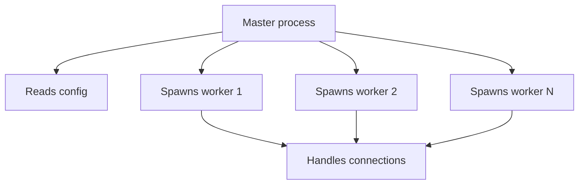
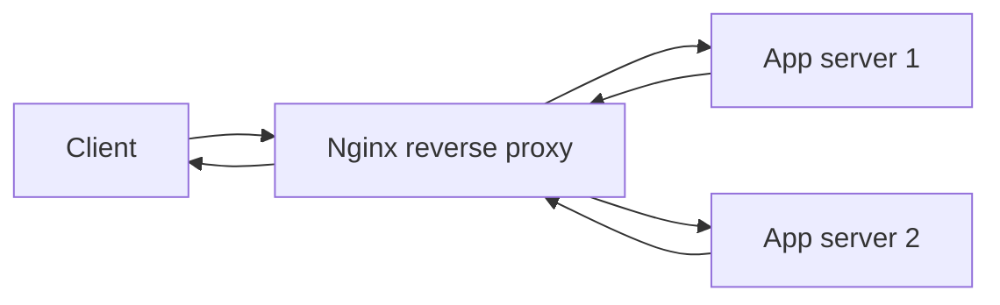
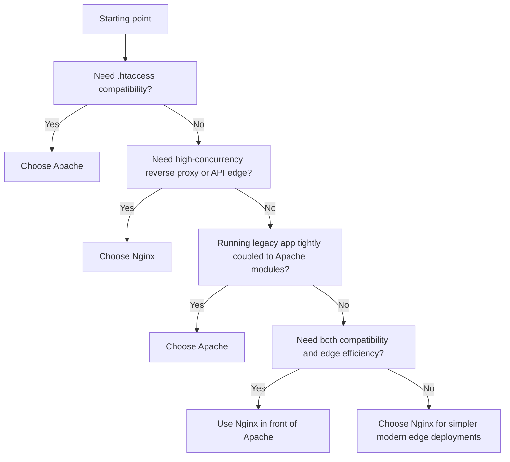

# Nginx

## 3.1 Overview

Nginx is a high-performance web server, reverse proxy, and load balancer.

Strengths:

- Event-driven architecture
- Excellent reverse proxy performance
- Efficient memory usage
- Strong TLS support
- Common choice for API and static asset delivery

## 3.2 Key Directories

### Debian/Ubuntu

| Purpose | Path |
|---|---|
| Main config | `/etc/nginx/nginx.conf` |
| Sites available | `/etc/nginx/sites-available/` |
| Sites enabled | `/etc/nginx/sites-enabled/` |
| Snippets | `/etc/nginx/snippets/` |
| Logs | `/var/log/nginx/` |
| Web root | `/var/www/html/` |

### RHEL Family

| Purpose | Path |
|---|---|
| Main config | `/etc/nginx/nginx.conf` |
| Extra configs | `/etc/nginx/conf.d/` |
| Logs | `/var/log/nginx/` |
| Web root | `/usr/share/nginx/html/` |

## 3.3 Installation

### Debian/Ubuntu

```bash
sudo apt update
sudo apt install -y nginx
sudo systemctl enable --now nginx
```

### RHEL/Rocky/Alma

```bash
sudo dnf install -y nginx
sudo systemctl enable --now nginx
```

### Verify

```bash
nginx -v
sudo nginx -t
curl -I http://127.0.0.1
```

## 3.4 Nginx Architecture

### 📸 Nginx Architecture

> *Nginx — high-performance web server and reverse proxy*

Nginx uses:

- One master process
- Multiple worker processes
- Event-driven non-blocking I/O

### Mermaid Diagram: Nginx Architecture



## 3.5 Basic Commands

```bash
sudo systemctl start nginx
sudo systemctl stop nginx
sudo systemctl restart nginx
sudo systemctl reload nginx
sudo nginx -t
sudo nginx -T
```

## 3.6 Understanding Nginx Contexts

Common contexts:

- `main`
- `events`
- `http`
- `server`
- `location`
- `upstream`

Example skeleton:

```nginx
user www-data;
worker_processes auto;

error_log /var/log/nginx/error.log warn;
pid /run/nginx.pid;

events {
    worker_connections 1024;
}

http {
    include /etc/nginx/mime.types;
    default_type application/octet-stream;

    sendfile on;
    keepalive_timeout 65;

    server {
        listen 80;
        server_name example.com;
        root /var/www/example.com/public;

        location / {
            try_files $uri $uri/ =404;
        }
    }
}
```

## 3.7 Server Blocks

A server block is similar to an Apache virtual host.

Example:

```nginx
server {
    listen 80;
    server_name example.com www.example.com;
    root /var/www/example.com/public;
    index index.html index.htm index.php;

    access_log /var/log/nginx/example-access.log;
    error_log /var/log/nginx/example-error.log warn;

    location / {
        try_files $uri $uri/ /index.html;
    }
}
```

Enable on Debian/Ubuntu:

```bash
sudo ln -s /etc/nginx/sites-available/example.com /etc/nginx/sites-enabled/
sudo nginx -t
sudo systemctl reload nginx
```

## 3.8 Location Matching

Nginx location matching is critical to understand.

Types:

- Prefix match: `location /images/`
- Exact match: `location = /health`
- Regex match: `location ~ \.php$`
- Case-insensitive regex: `location ~* \.(jpg|png)$`
- Preferential prefix: `location ^~ /static/`

Example:

```nginx
location = /health {
    access_log off;
    return 200 'ok';
}

location ^~ /static/ {
    expires 30d;
    add_header Cache-Control "public, immutable";
}

location ~* \.(jpg|jpeg|png|gif|ico|css|js)$ {
    expires 30d;
}
```

## 3.9 Basic Static Site Example

```nginx
server {
    listen 80;
    server_name static.example.com;
    root /var/www/static.example.com/public;
    index index.html;

    location / {
        try_files $uri $uri/ =404;
    }
}
```

## 3.10 HTTPS Server Block Example

```nginx
server {
    listen 443 ssl http2;
    server_name example.com www.example.com;

    root /var/www/example.com/public;
    index index.html index.php;

    ssl_certificate /etc/letsencrypt/live/example.com/fullchain.pem;
    ssl_certificate_key /etc/letsencrypt/live/example.com/privkey.pem;
    ssl_protocols TLSv1.2 TLSv1.3;
    ssl_session_timeout 1d;
    ssl_session_cache shared:SSL:10m;
    ssl_session_tickets off;

    add_header Strict-Transport-Security "max-age=31536000; includeSubDomains" always;
    add_header X-Content-Type-Options nosniff always;
    add_header X-Frame-Options SAMEORIGIN always;
    add_header Referrer-Policy strict-origin-when-cross-origin always;

    location / {
        try_files $uri $uri/ /index.html;
    }
}

server {
    listen 80;
    server_name example.com www.example.com;
    return 301 https://$host$request_uri;
}
```

## 3.11 Reverse Proxy Basics

Example proxy to an upstream application:

```nginx
server {
    listen 80;
    server_name app.example.com;

    location / {
        proxy_pass http://127.0.0.1:3000;
        proxy_http_version 1.1;
        proxy_set_header Host $host;
        proxy_set_header X-Real-IP $remote_addr;
        proxy_set_header X-Forwarded-For $proxy_add_x_forwarded_for;
        proxy_set_header X-Forwarded-Proto $scheme;
        proxy_set_header Connection "";
    }
}
```

## 3.12 Mermaid Diagram: Reverse Proxy Flow



## 3.13 PHP with Nginx and PHP-FPM

```nginx
server {
    listen 80;
    server_name php.example.com;
    root /var/www/php.example.com/public;
    index index.php index.html;

    location / {
        try_files $uri $uri/ /index.php?$query_string;
    }

    location ~ \.php$ {
        include snippets/fastcgi-php.conf;
        fastcgi_pass unix:/run/php/php8.2-fpm.sock;
        fastcgi_param SCRIPT_FILENAME $document_root$fastcgi_script_name;
    }
}
```

## 3.14 Upstreams and Load Balancing

Basic upstream block:

```nginx
upstream app_backend {
    server 10.0.0.11:8080;
    server 10.0.0.12:8080;
    server 10.0.0.13:8080;
}
```

Use it:

```nginx
server {
    listen 80;
    server_name api.example.com;

    location / {
        proxy_pass http://app_backend;
        proxy_set_header Host $host;
        proxy_set_header X-Forwarded-For $proxy_add_x_forwarded_for;
        proxy_set_header X-Forwarded-Proto $scheme;
    }
}
```

### 3.14.1 Load-Balancing Algorithms

#### Round Robin

Default behavior.

```nginx
upstream app_backend {
    server 10.0.0.11:8080;
    server 10.0.0.12:8080;
}
```

#### Least Connections

```nginx
upstream app_backend {
    least_conn;
    server 10.0.0.11:8080;
    server 10.0.0.12:8080;
}
```

#### IP Hash

```nginx
upstream app_backend {
    ip_hash;
    server 10.0.0.11:8080;
    server 10.0.0.12:8080;
}
```

#### Weighted Servers

```nginx
upstream app_backend {
    server 10.0.0.11:8080 weight=3;
    server 10.0.0.12:8080 weight=1;
}
```

## 3.15 Passive Health Checks

Open-source Nginx mainly provides passive health checking.

Example tuning:

```nginx
upstream app_backend {
    server 10.0.0.11:8080 max_fails=3 fail_timeout=30s;
    server 10.0.0.12:8080 max_fails=3 fail_timeout=30s;
}
```

## 3.16 Timeouts

Key directives:

- `client_header_timeout`
- `client_body_timeout`
- `keepalive_timeout`
- `send_timeout`
- `proxy_connect_timeout`
- `proxy_send_timeout`
- `proxy_read_timeout`

Example:

```nginx
http {
    client_header_timeout 10s;
    client_body_timeout 10s;
    keepalive_timeout 15s;
    send_timeout 30s;
}
```

## 3.17 Buffering

Useful proxy buffering directives:

- `proxy_buffering`
- `proxy_buffers`
- `proxy_buffer_size`
- `proxy_busy_buffers_size`
- `proxy_max_temp_file_size`

Example:

```nginx
location / {
    proxy_pass http://app_backend;
    proxy_buffering on;
    proxy_buffer_size 8k;
    proxy_buffers 16 8k;
}
```

## 3.18 Nginx Caching

Define cache zone:

```nginx
proxy_cache_path /var/cache/nginx levels=1:2 keys_zone=app_cache:100m max_size=5g inactive=60m use_temp_path=off;
```

Use it:

```nginx
location /api/ {
    proxy_pass http://app_backend;
    proxy_cache app_cache;
    proxy_cache_valid 200 1m;
    proxy_cache_valid 404 30s;
    proxy_cache_use_stale error timeout updating http_500 http_502 http_503 http_504;
    add_header X-Cache-Status $upstream_cache_status always;
}
```

## 3.19 Cache Bypass Example

```nginx
map $http_cache_control $skip_cache {
    default 0;
    ~*no-cache 1;
}

location /api/ {
    proxy_pass http://app_backend;
    proxy_cache app_cache;
    proxy_no_cache $skip_cache;
    proxy_cache_bypass $skip_cache;
}
```

## 3.20 Rate Limiting

Define zones:

```nginx
limit_req_zone $binary_remote_addr zone=api_limit:10m rate=10r/s;
limit_conn_zone $binary_remote_addr zone=conn_limit:10m;
```

Use them:

```nginx
location /api/ {
    limit_req zone=api_limit burst=20 nodelay;
    limit_conn conn_limit 20;
    proxy_pass http://app_backend;
}
```

## 3.21 Static Asset Optimization

```nginx
location ~* \.(css|js|jpg|jpeg|png|gif|svg|ico|woff|woff2)$ {
    expires 30d;
    add_header Cache-Control "public, max-age=2592000, immutable";
    access_log off;
}
```

## 3.22 Gzip Compression

```nginx
gzip on;
gzip_vary on;
gzip_proxied any;
gzip_comp_level 5;
gzip_types text/plain text/css application/json application/javascript application/xml+rss application/xml image/svg+xml;
```

## 3.23 Brotli Compression

If Brotli module is installed:

```nginx
brotli on;
brotli_comp_level 5;
brotli_types text/plain text/css application/javascript application/json application/xml image/svg+xml;
```

## 3.24 Access Logging

Default combined-style logging is common.

Custom JSON-ish format example:

```nginx
log_format structured escape=json
    '{'
        '"time":"$time_iso8601",'
        '"remote_addr":"$remote_addr",'
        '"request":"$request",'
        '"status":$status,'
        '"body_bytes_sent":$body_bytes_sent,'
        '"referer":"$http_referer",'
        '"user_agent":"$http_user_agent",'
        '"request_time":$request_time,'
        '"upstream_time":"$upstream_response_time"'
    '}';

access_log /var/log/nginx/access.log structured;
```

## 3.25 Error Logging

```nginx
error_log /var/log/nginx/error.log warn;
```

Log levels:

- debug
- info
- notice
- warn
- error
- crit
- alert
- emerg

## 3.26 Worker Tuning

Important directives:

- `worker_processes`
- `worker_connections`
- `worker_rlimit_nofile`
- `multi_accept`
- `use epoll` on Linux where applicable

Example:

```nginx
worker_processes auto;
worker_rlimit_nofile 65535;

events {
    worker_connections 4096;
    multi_accept on;
}
```

Approximate max connections:

```text
worker_processes × worker_connections
```

Real capacity is lower because upstreams and system limits also matter.

## 3.27 Open File and Kernel Tuning Notes

Useful system tuning often accompanies Nginx:

- `ulimit -n`
- `net.core.somaxconn`
- `net.ipv4.ip_local_port_range`
- `net.ipv4.tcp_tw_reuse`
- `fs.file-max`

Example sysctl snippet:

```conf
net.core.somaxconn = 65535
net.ipv4.tcp_max_syn_backlog = 8192
fs.file-max = 1000000
```

## 3.28 Real IP Configuration Behind Load Balancer

```nginx
set_real_ip_from 10.0.0.10;
real_ip_header X-Forwarded-For;
real_ip_recursive on;
```

## 3.29 Security Hardening

Baseline ideas:

- Hide version with `server_tokens off`
- Restrict methods where possible
- Disable autoindex
- Add security headers
- Limit upload size
- Protect internal locations
- Restrict admin paths

Example:

```nginx
server_tokens off;
client_max_body_size 10m;
autoindex off;
```

### Restrict Methods Example

```nginx
location /api/ {
    limit_except GET POST {
        deny all;
    }
    proxy_pass http://app_backend;
}
```

### Internal Location Example

```nginx
location /internal/ {
    internal;
    alias /srv/private-downloads/;
}
```

## 3.30 HTTP/2

Benefits:

- Multiplexing
- Header compression
- Better use of a single connection

Enable in `listen` directive:

```nginx
listen 443 ssl http2;
```

## 3.31 OCSP Stapling Example

```nginx
ssl_stapling on;
ssl_stapling_verify on;
resolver 1.1.1.1 8.8.8.8 valid=300s;
resolver_timeout 5s;
```

## 3.32 WebSocket Proxying

```nginx
location /ws/ {
    proxy_pass http://app_backend;
    proxy_http_version 1.1;
    proxy_set_header Upgrade $http_upgrade;
    proxy_set_header Connection "upgrade";
    proxy_set_header Host $host;
}
```

## 3.33 Health Endpoint Example

```nginx
location = /health {
    access_log off;
    default_type text/plain;
    return 200 'ok';
}
```

## 3.34 Production Reverse Proxy Example

```nginx
upstream api_backend {
    least_conn;
    server 10.0.1.11:8080 max_fails=3 fail_timeout=30s;
    server 10.0.1.12:8080 max_fails=3 fail_timeout=30s;
    keepalive 64;
}

server {
    listen 443 ssl http2;
    server_name api.example.com;

    ssl_certificate /etc/letsencrypt/live/api.example.com/fullchain.pem;
    ssl_certificate_key /etc/letsencrypt/live/api.example.com/privkey.pem;
    ssl_protocols TLSv1.2 TLSv1.3;
    ssl_session_timeout 1d;
    ssl_session_cache shared:SSL:10m;
    ssl_session_tickets off;

    server_tokens off;

    add_header Strict-Transport-Security "max-age=31536000; includeSubDomains" always;
    add_header X-Content-Type-Options nosniff always;
    add_header X-Frame-Options SAMEORIGIN always;

    location / {
        proxy_pass http://api_backend;
        proxy_http_version 1.1;
        proxy_set_header Host $host;
        proxy_set_header X-Real-IP $remote_addr;
        proxy_set_header X-Forwarded-For $proxy_add_x_forwarded_for;
        proxy_set_header X-Forwarded-Proto $scheme;
        proxy_connect_timeout 5s;
        proxy_send_timeout 30s;
        proxy_read_timeout 30s;
    }

    location = /health {
        access_log off;
        return 200 'ok';
    }
}
```

## 3.35 Common Troubleshooting Commands

```bash
sudo nginx -t
sudo nginx -T | less
sudo tail -f /var/log/nginx/error.log
sudo tail -f /var/log/nginx/access.log
curl -I http://127.0.0.1
curl -I https://127.0.0.1 --insecure
ss -tulpn | grep ':80\|:443'
```

## 3.36 Nginx Best Practices Summary

- Keep configs modular and predictable
- Use `try_files` carefully
- Always test with `nginx -t`
- Tune timeouts deliberately
- Forward essential headers to upstreams
- Add observability with structured logs
- Use rate limiting on public APIs
- Cache only cache-safe content

## 3.37 Nginx Production Configuration

This section consolidates the earlier Nginx examples into a production-oriented baseline suitable for a modern web application or API edge.

### 3.37.1 Production Goals

A production-grade Nginx configuration should:

- Use all CPU cores sensibly
- Reuse connections efficiently
- Terminate TLS safely
- Add security headers consistently
- Rate-limit abusive traffic
- Cache safe responses
- Proxy WebSocket traffic correctly
- Expose a health endpoint
- Produce logs that are useful during incidents

### 3.37.2 Full Production `nginx.conf`

```nginx
user www-data;
worker_processes auto;
worker_rlimit_nofile 200000;
pid /run/nginx.pid;
error_log /var/log/nginx/error.log warn;

include /etc/nginx/modules-enabled/*.conf;

events {
    worker_connections 8192;
    multi_accept on;
    use epoll;
}

http {
    include /etc/nginx/mime.types;
    default_type application/octet-stream;

    log_format main_ext escape=json
        '{'
            '"time":"$time_iso8601",'
            '"remote_addr":"$remote_addr",'
            '"request_id":"$request_id",'
            '"host":"$host",'
            '"method":"$request_method",'
            '"uri":"$request_uri",'
            '"status":$status,'
            '"bytes_sent":$body_bytes_sent,'
            '"request_time":$request_time,'
            '"upstream_time":"$upstream_response_time",'
            '"upstream_addr":"$upstream_addr",'
            '"referer":"$http_referer",'
            '"user_agent":"$http_user_agent"'
        '}';

    access_log /var/log/nginx/access.log main_ext;

    sendfile on;
    tcp_nopush on;
    tcp_nodelay on;
    types_hash_max_size 4096;
    server_tokens off;
    keepalive_timeout 20s;
    keepalive_requests 1000;
    client_body_timeout 15s;
    client_header_timeout 15s;
    send_timeout 30s;
    client_max_body_size 20m;
    reset_timedout_connection on;

    include /etc/nginx/conf.d/*.conf;

    gzip on;
    gzip_comp_level 5;
    gzip_min_length 1024;
    gzip_proxied any;
    gzip_vary on;
    gzip_types
        text/plain
        text/css
        text/xml
        application/json
        application/javascript
        application/xml
        application/rss+xml
        image/svg+xml;

    proxy_cache_path /var/cache/nginx/app_cache levels=1:2 keys_zone=app_cache:256m max_size=10g inactive=60m use_temp_path=off;

    limit_req_zone $binary_remote_addr zone=api_req_limit:20m rate=20r/s;
    limit_conn_zone $binary_remote_addr zone=perip_conn_limit:20m;

    map $http_upgrade $connection_upgrade {
        default upgrade;
        ''      close;
    }

    upstream app_backend {
        least_conn;
        keepalive 128;
        server 10.0.1.21:8000 max_fails=3 fail_timeout=10s;
        server 10.0.1.22:8000 max_fails=3 fail_timeout=10s;
        server 10.0.1.23:8000 backup;
    }

    server {
        listen 80;
        listen [::]:80;
        server_name app.example.com;

        location /.well-known/acme-challenge/ {
            root /var/www/letsencrypt;
        }

        location / {
            return 301 https://$host$request_uri;
        }
    }

    server {
        listen 443 ssl http2;
        listen [::]:443 ssl http2;
        server_name app.example.com;

        root /srv/app/current/public;
        index index.html;

        ssl_certificate /etc/letsencrypt/live/app.example.com/fullchain.pem;
        ssl_certificate_key /etc/letsencrypt/live/app.example.com/privkey.pem;
        ssl_protocols TLSv1.2 TLSv1.3;
        ssl_session_timeout 1d;
        ssl_session_cache shared:SSL:50m;
        ssl_session_tickets off;
        ssl_prefer_server_ciphers off;
        ssl_stapling on;
        ssl_stapling_verify on;
        resolver 1.1.1.1 1.0.0.1 8.8.8.8 8.8.4.4 valid=300s ipv6=off;
        resolver_timeout 5s;

        add_header Strict-Transport-Security "max-age=31536000; includeSubDomains" always;
        add_header X-Frame-Options "SAMEORIGIN" always;
        add_header X-Content-Type-Options "nosniff" always;
        add_header Referrer-Policy "strict-origin-when-cross-origin" always;
        add_header Permissions-Policy "camera=(), microphone=(), geolocation=()" always;
        add_header Cross-Origin-Opener-Policy "same-origin" always;
        add_header Cross-Origin-Resource-Policy "same-origin" always;
        add_header Content-Security-Policy "default-src 'self'; img-src 'self' data: https:; style-src 'self' 'unsafe-inline'; script-src 'self'; connect-src 'self' https://api.example.com; frame-ancestors 'self'; base-uri 'self'; form-action 'self'; upgrade-insecure-requests" always;

        access_log /var/log/nginx/app-example-access.log main_ext;
        error_log /var/log/nginx/app-example-error.log warn;

        limit_conn perip_conn_limit 40;

        location = /health {
            access_log off;
            default_type text/plain;
            return 200 'ok';
        }

        location /static/ {
            alias /srv/app/current/static/;
            expires 30d;
            add_header Cache-Control "public, max-age=2592000, immutable" always;
            access_log off;
        }

        location /media/ {
            alias /srv/app/shared/media/;
            expires 1h;
            add_header Cache-Control "public, max-age=3600" always;
        }

        location /api/ {
            limit_req zone=api_req_limit burst=40 nodelay;
            proxy_pass http://app_backend;
            proxy_http_version 1.1;
            proxy_set_header Host $host;
            proxy_set_header X-Real-IP $remote_addr;
            proxy_set_header X-Forwarded-For $proxy_add_x_forwarded_for;
            proxy_set_header X-Forwarded-Proto $scheme;
            proxy_set_header X-Request-ID $request_id;
            proxy_connect_timeout 5s;
            proxy_send_timeout 30s;
            proxy_read_timeout 30s;
            proxy_buffering on;
            proxy_buffer_size 16k;
            proxy_buffers 16 16k;
            proxy_busy_buffers_size 64k;
            proxy_cache app_cache;
            proxy_cache_methods GET HEAD;
            proxy_cache_valid 200 1m;
            proxy_cache_valid 404 30s;
            proxy_cache_bypass $http_authorization;
            proxy_no_cache $http_authorization;
            proxy_cache_use_stale error timeout updating http_500 http_502 http_503 http_504;
            add_header X-Cache-Status $upstream_cache_status always;
        }

        location /ws/ {
            proxy_pass http://app_backend;
            proxy_http_version 1.1;
            proxy_set_header Upgrade $http_upgrade;
            proxy_set_header Connection $connection_upgrade;
            proxy_set_header Host $host;
            proxy_set_header X-Real-IP $remote_addr;
            proxy_set_header X-Forwarded-For $proxy_add_x_forwarded_for;
            proxy_set_header X-Forwarded-Proto $scheme;
            proxy_read_timeout 300s;
            proxy_send_timeout 300s;
            proxy_buffering off;
        }

        location / {
            try_files $uri @app;
        }

        location @app {
            proxy_pass http://app_backend;
            proxy_http_version 1.1;
            proxy_set_header Host $host;
            proxy_set_header X-Real-IP $remote_addr;
            proxy_set_header X-Forwarded-For $proxy_add_x_forwarded_for;
            proxy_set_header X-Forwarded-Proto $scheme;
            proxy_set_header X-Request-ID $request_id;
            proxy_connect_timeout 5s;
            proxy_send_timeout 30s;
            proxy_read_timeout 30s;
        }

        location ~ /\. {
            deny all;
            access_log off;
            log_not_found off;
        }
    }
}
```

### 3.37.3 Why Each Block Exists

| Directive or block | Why it exists | What goes wrong if omitted |
|---|---|---|
| `worker_processes auto` | Uses available CPU cores | Single worker can bottleneck throughput |
| `worker_connections 8192` | Raises concurrent socket capacity | Busy sites can run out of connections |
| `worker_rlimit_nofile` | Raises usable file descriptors | High-concurrency workloads hit OS limits |
| `keepalive_timeout 20s` | Reuses sockets without keeping them forever | Too low wastes handshakes, too high wastes memory |
| `gzip` | Reduces text payload size | Slower downloads and higher bandwidth usage |
| `limit_req_zone` | Throttles abusive request rates | Login and API endpoints are easier to abuse |
| `proxy_cache_path` | Enables reverse-proxy caching | Every cacheable request hits the app |
| `upstream ... keepalive` | Reuses upstream connections | More TCP churn between proxy and app |
| `ssl_stapling on` | Speeds revocation checks | Slower TLS validation in some clients |
| `add_header Strict-Transport-Security` | Locks browsers to HTTPS | Users can still downgrade on later visits |
| `proxy_set_header X-Forwarded-Proto` | Tells app original scheme | Apps generate wrong callback URLs or insecure links |
| `location /ws/` WebSocket settings | Preserves upgrade behavior | WebSocket handshakes fail or disconnect early |

### 3.37.4 Worker Processes and Connection Tuning

A simple sizing model:

```text
max_client_connections ≈ worker_processes × worker_connections
```

But that is not the full story because:

- Upstream sockets also count
- Idle keep-alives still consume descriptors
- Open files and logs count too
- Kernel backlog, ephemeral ports, and application worker limits still matter

Production tuning checklist:

1. Set `worker_processes auto`.
2. Raise `ulimit -n` for the Nginx service.
3. Set `worker_rlimit_nofile` to match realistic fd needs.
4. Check `sysctl net.core.somaxconn` for backlog pressure.
5. Load-test before raising values further.

### 3.37.5 Gzip Compression Guidelines

Good candidates for gzip:

- HTML
- CSS
- JavaScript
- JSON
- XML
- SVG

Usually avoid gzip for:

- JPEG
- PNG
- MP4
- ZIP
- Already-compressed archives

Compression rules of thumb:

- `gzip_comp_level 4` to `6` is often a good production balance.
- Higher levels burn more CPU for diminishing bandwidth savings.
- Always send `Vary: Accept-Encoding` for compressible assets.

### 3.37.6 Security Headers Baseline

Recommended browser-facing baseline:

```nginx
add_header Strict-Transport-Security "max-age=31536000; includeSubDomains" always;
add_header X-Frame-Options "SAMEORIGIN" always;
add_header X-Content-Type-Options "nosniff" always;
add_header Referrer-Policy "strict-origin-when-cross-origin" always;
add_header Permissions-Policy "camera=(), microphone=(), geolocation=()" always;
```

Notes:

- Use HSTS only after HTTPS is known-good everywhere.
- Prefer CSP over `X-XSS-Protection`; modern browsers largely ignore the latter.
- `X-Frame-Options` can be replaced or complemented by `frame-ancestors` in CSP.

### 3.37.7 Rate Limiting Patterns

Burst-friendly API protection:

```nginx
limit_req_zone $binary_remote_addr zone=login_limit:10m rate=5r/m;

location /login/ {
    limit_req zone=login_limit burst=10 nodelay;
    proxy_pass http://app_backend;
}
```

Good uses for rate limiting:

- Login endpoints
- Password reset endpoints
- Public APIs
- Expensive search endpoints
- File upload APIs

Avoid being too aggressive on:

- Health checks
- Internal service mesh traffic
- Admin bulk operations unless separately designed

### 3.37.8 SSL Configuration for an A+-Style Baseline

A practical Nginx TLS baseline today is:

- TLS 1.2 and TLS 1.3 only
- Valid full chain
- HSTS enabled intentionally
- OCSP stapling enabled
- Session tickets disabled unless you manage keys carefully
- Strong certificates and modern OpenSSL

Example reusable snippet:

```nginx
ssl_protocols TLSv1.2 TLSv1.3;
ssl_session_timeout 1d;
ssl_session_cache shared:SSL:50m;
ssl_session_tickets off;
ssl_prefer_server_ciphers off;
ssl_stapling on;
ssl_stapling_verify on;
```

### 3.37.9 Upstream Load Balancing Patterns

| Strategy | Good for | Example |
|---|---|---|
| Round robin | Similar nodes | Default behavior |
| `least_conn` | Uneven request duration | APIs with mixed latency |
| `ip_hash` | Session affinity | Legacy stateful apps |
| Weighted servers | Canary or stronger nodes | `server 10.0.1.21:8000 weight=3;` |
| Backup server | Standby capacity | `server 10.0.1.23:8000 backup;` |

Production advice:

- Prefer stateless apps over sticky routing.
- Use a backup server for emergency overflow, not as a hidden primary.
- Monitor upstream latency, not just status code.

### 3.37.10 Caching Configuration Notes

Only cache when all of the following are true:

- Response is safe to reuse
- Authentication does not personalize the payload
- Vary dimensions are understood
- Expiration or revalidation policy is explicit

Good cache candidates:

- Public API GET responses
- Documentation pages
- Computed but anonymous catalog pages
- Expensive upstream responses with short TTLs

Bad cache candidates unless carefully keyed:

- Authenticated dashboards
- Session-dependent HTML
- Responses that vary by Authorization or Cookie

### 3.37.11 WebSocket Proxy Requirements

WebSocket proxying breaks if you forget any of these:

- `proxy_http_version 1.1`
- `Upgrade` header
- `Connection` header
- Long enough read timeout
- Buffering disabled when appropriate

Diagnostic command:

```bash
curl -i -N \
  -H 'Connection: Upgrade' \
  -H 'Upgrade: websocket' \
  -H 'Host: app.example.com' \
  -H 'Origin: https://app.example.com' \
  https://app.example.com/ws/
```

### 3.37.12 Production Validation Commands

```bash
sudo nginx -t
sudo nginx -T | grep -E 'ssl_|limit_req|proxy_cache|upstream|http2'
systemctl status nginx --no-pager
curl -I http://app.example.com
curl -I https://app.example.com
curl -vk https://app.example.com/health
openssl s_client -connect app.example.com:443 -servername app.example.com </dev/null
```

### 3.38 Apache vs Nginx Decision Guide

Both are excellent. The right answer depends on traffic shape, application model, operations habits, and how much you value flexibility versus efficiency.

### 3.38.1 Detailed Comparison Table

| Decision area | Apache | Nginx | Practical takeaway |
|---|---|---|---|
| Core model | Process or thread based depending on MPM | Event-driven, non-blocking | Nginx is usually more memory-efficient at high concurrency |
| Static file serving | Good | Excellent | Nginx is often preferred at the edge |
| Reverse proxy performance | Strong | Excellent | Nginx is a very common API and TLS front end |
| `.htaccess` support | Yes | No | Apache is useful when per-directory overrides are required |
| Dynamic module flexibility | Very mature module ecosystem | Strong, but different operational style | Apache can be easier for legacy app stacks |
| PHP traditional hosting | Historically dominant | Usually via PHP-FPM | Apache still appears often in shared hosting |
| Config inheritance | Rich directory and vhost model | Explicit block-based routing | Nginx tends to be more predictable once learned |
| Memory use under many idle connections | Higher | Lower | Nginx usually scales better for many concurrent keep-alives |
| Learning curve | Familiar to many admins | Simpler concepts, but matching rules matter | Depends on team background |
| WebSocket and API edge use | Good | Excellent | Nginx is the common default here |
| Legacy application compatibility | Excellent | Sometimes requires adaptation | Apache wins for some older apps |
| Container-era edge proxy role | Less common but viable | Very common | Nginx is a standard ingress-style choice |
| Fine-grained per-directory overrides | Strong | Weak by design | Apache if delegating config to app owners |
| High-concurrency TLS termination | Good | Excellent | Nginx typically wins |
| Shared hosting environments | Very common | Less common | Apache remains popular |

### 3.38.2 Quick Decision Rules

Choose Apache first when:

- You need `.htaccess` compatibility.
- You run older apps built around Apache behavior.
- Your team already has deep Apache operational knowledge.
- You want rich per-directory overrides on multi-tenant systems.

Choose Nginx first when:

- You need a reverse proxy or API gateway.
- You expect high concurrency with many idle keep-alives.
- You want a lightweight TLS terminator in front of app servers.
- You serve a lot of static assets.

Use both together when:

- Nginx handles TLS, static files, caching, and rate limiting.
- Apache sits behind it for app compatibility or existing vhost logic.

### 3.38.3 Mermaid Decision Tree



### 3.38.4 Common Deployment Patterns

| Pattern | Description | Good fit |
|---|---|---|
| Apache only | Apache serves app directly | Legacy LAMP app, shared hosting |
| Nginx only | Nginx serves static files and proxies app | Modern Django, Node.js, Go, API stack |
| Nginx in front of Apache | Nginx handles TLS and static delivery, Apache handles app | Migration path for older Apache apps |
| Nginx plus app runtime | Nginx with Gunicorn, uWSGI, Node.js, or Java upstream | Most modern Linux web stacks |

### 3.38.5 Final Recommendation Cheat Sheet

- For new greenfield API and app deployments: start with Nginx unless there is a specific Apache dependency.
- For legacy CMS or apps using `.htaccess`: Apache may be the lower-risk option.
- For internet-facing performance and TLS edge concerns: Nginx usually has the operational advantage.
- For migrations: put Nginx in front first, then reduce Apache responsibilities over time.

---

### 12.3 New Nginx Site Checklist

- Create server block
- Set `server_name`
- Set root or proxy upstream
- Add logs
- Add TLS settings if needed
- Test with `nginx -t`
- Enable config
- Reload service
- Validate headers and redirects

### 13.3 Nginx Troubleshooting

```bash
nginx -t
nginx -T
journalctl -u nginx -xe
```

Look for:

- Syntax errors
- Duplicate directives
- Wrong `server_name`
- Bad `proxy_pass`
- File permission issues
- Upstream timeout or connection refused

### 15.1 Scenario: Static Website on Nginx

Requirements:

- Public website
- TLS enabled
- Static assets cached
- Minimal maintenance

Example config:

```nginx
server {
    listen 80;
    server_name docs.example.com;
    return 301 https://$host$request_uri;
}

server {
    listen 443 ssl http2;
    server_name docs.example.com;
    root /var/www/docs.example.com/public;
    index index.html;

    ssl_certificate /etc/letsencrypt/live/docs.example.com/fullchain.pem;
    ssl_certificate_key /etc/letsencrypt/live/docs.example.com/privkey.pem;
    ssl_protocols TLSv1.2 TLSv1.3;

    location / {
        try_files $uri $uri/ =404;
    }

    location ~* \.(css|js|png|jpg|jpeg|svg|woff2)$ {
        expires 30d;
        add_header Cache-Control "public, immutable";
        access_log off;
    }
}
```

### 19.3 Nginx Reinforcement

- Nginx is efficient for many concurrent connections.
- `server` and `location` matching logic must be understood precisely.
- `try_files` is central to many static and framework setups.
- Forward `Host` and `X-Forwarded-*` headers for proxied apps.
- Use upstream keepalive where appropriate.
- Rate limiting protects public services from bursts and abuse.
- Passive health checks are not a full replacement for active checks.
- `nginx -t` should be part of every change workflow.
- Cache carefully and expose cache status headers when debugging.
- Use `server_tokens off` in production.
- Monitor error logs for upstream failures and client abuse patterns.
- Avoid giant unbounded request body sizes.
- Ensure both HA nodes have the same certificates if using VIP failover.

### 20.2 Nginx Commands

```bash
nginx -v
nginx -V
nginx -t
nginx -T
systemctl reload nginx
```

### 22.2 Validate Nginx

```bash
nginx -t
curl -H 'Host: example.com' http://127.0.0.1/
curl -kI https://127.0.0.1 -H 'Host: example.com'
```

### 24.1 Nginx Redirect Canonical Host

```nginx
server {
    listen 80;
    server_name example.com;
    return 301 https://www.example.com$request_uri;
}
```

### 24.3 Nginx Basic Auth Protected Location

```nginx
location /admin/ {
    auth_basic "Restricted";
    auth_basic_user_file /etc/nginx/.htpasswd;
    proxy_pass http://admin_pool;
}
```

### 24.5 Nginx Custom Error Pages

```nginx
error_page 404 /404.html;
error_page 500 502 503 504 /50x.html;

location = /404.html {
    internal;
}
```

### 24.7 Nginx Client Upload Limit

```nginx
client_max_body_size 20m;
```
