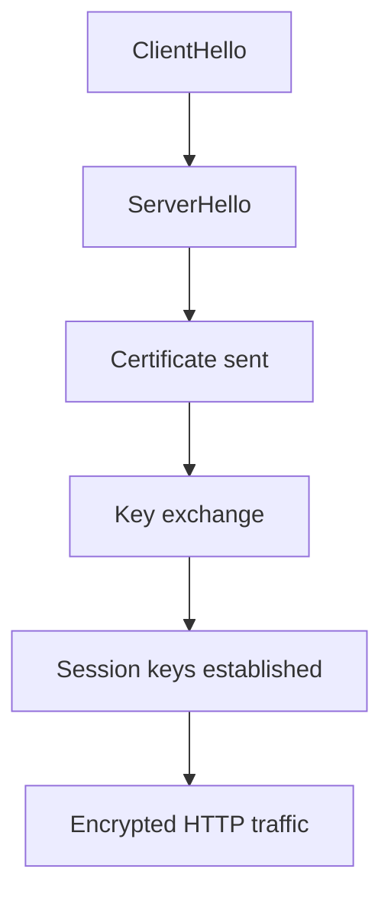
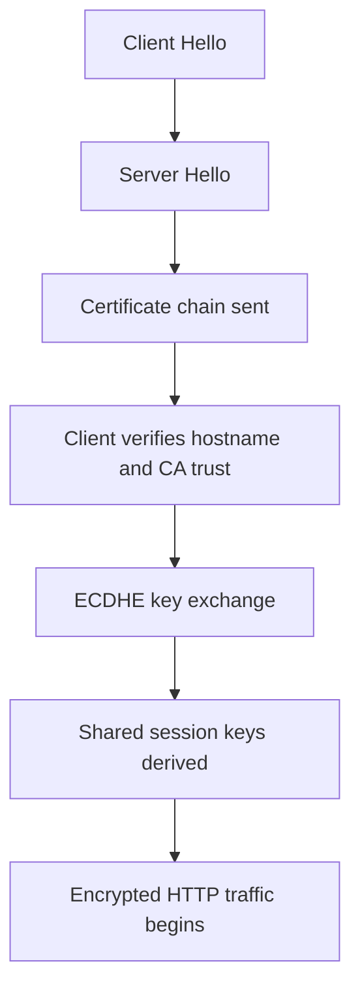

# SSL/TLS

## 4.1 Overview

TLS secures communications between clients and servers.

Goals:

- Confidentiality
- Integrity
- Authentication

TLS replaced SSL, but the term SSL is still widely used in practice.

## 4.2 Key Terms

| Term | Meaning |
|---|---|
| Certificate | Public identity document for a host or entity |
| Private key | Secret key corresponding to certificate |
| CSR | Certificate Signing Request |
| CA | Certificate Authority |
| SAN | Subject Alternative Name |
| Cipher suite | Set of algorithms used in TLS |
| OCSP | Online Certificate Status Protocol |
| Stapling | Server includes OCSP proof in handshake |

## 4.3 Certificate Types

| Type | Description |
|---|---|
| Self-signed | Signed by same entity that created it |
| DV | Domain Validation |
| OV | Organization Validation |
| EV | Extended Validation |
| Wildcard | Covers subdomains like `*.example.com` |
| Multi-domain | Covers multiple SANs |

## 4.4 Private Key Types

Common key algorithms:

- RSA
- ECDSA

### RSA

Pros:

- Broad compatibility

Cons:

- Larger key sizes
- More CPU overhead than ECDSA in many cases

### ECDSA

Pros:

- Smaller keys
- Efficient performance

Cons:

- Legacy compatibility can be weaker in very old clients

## 4.5 TLS Handshake Explained

### Steps

1. ClientHello
2. ServerHello
3. Certificate exchange
4. Key exchange
5. Session keys established
6. Encrypted application data begins

### Mermaid Diagram: TLS Handshake



## 4.6 Generate a Private Key and CSR

RSA example:

```bash
openssl genrsa -out example.com.key 4096
openssl req -new -key example.com.key -out example.com.csr
```

ECDSA example:

```bash
openssl ecparam -name prime256v1 -genkey -noout -out example.com-ecdsa.key
openssl req -new -key example.com-ecdsa.key -out example.com-ecdsa.csr
```

## 4.7 Inspect CSR

```bash
openssl req -in example.com.csr -noout -text
```

## 4.8 Generate Self-Signed Certificate

```bash
openssl req -x509 -nodes -days 365 -newkey rsa:2048 \
  -keyout selfsigned.key \
  -out selfsigned.crt
```

Use cases:

- Internal labs
- Development
- Temporary testing

Avoid for public production sites.

## 4.9 Verify Certificate Details

```bash
openssl x509 -in fullchain.pem -noout -text
openssl x509 -in fullchain.pem -noout -dates
openssl x509 -in fullchain.pem -noout -issuer -subject
```

## 4.10 Test Remote TLS

```bash
openssl s_client -connect example.com:443 -servername example.com
```

Useful flags:

```bash
openssl s_client -connect example.com:443 -servername example.com -showcerts
openssl s_client -connect example.com:443 -servername example.com -tls1_2
```

## 4.11 Let's Encrypt Overview

Let's Encrypt provides free DV certificates.

Common client:

- Certbot

Benefits:

- Free
- Automated renewals
- Broad ecosystem support

## 4.12 Install Certbot

### Debian/Ubuntu

```bash
sudo apt update
sudo apt install -y certbot python3-certbot-nginx python3-certbot-apache
```

### RHEL/Rocky/Alma

```bash
sudo dnf install -y certbot python3-certbot-nginx python3-certbot-apache
```

## 4.13 Request Certificate for Nginx

```bash
sudo certbot --nginx -d example.com -d www.example.com
```

## 4.14 Request Certificate for Apache

```bash
sudo certbot --apache -d example.com -d www.example.com
```

## 4.15 Standalone Mode

Useful when no web server plugin is available.

```bash
sudo certbot certonly --standalone -d example.com
```

## 4.16 Webroot Mode

```bash
sudo certbot certonly --webroot -w /var/www/example.com/public -d example.com -d www.example.com
```

## 4.17 Test Renewal

```bash
sudo certbot renew --dry-run
```

## 4.18 Let's Encrypt File Layout

| Purpose | Path |
|---|---|
| Live certs | `/etc/letsencrypt/live/` |
| Archived certs | `/etc/letsencrypt/archive/` |
| Renewal configs | `/etc/letsencrypt/renewal/` |

## 4.19 Recommended TLS Versions

Production baseline today usually means:

- TLS 1.2
- TLS 1.3

Disable:

- SSLv2
- SSLv3
- TLS 1.0
- TLS 1.1

## 4.20 Cipher Suites

TLS 1.3 uses modern cipher handling.

Focus on:

- Keeping software updated
- Disabling obsolete protocols
- Avoiding manual over-tuning unless justified

## 4.21 OCSP Stapling

OCSP stapling improves certificate revocation checking performance.

### Nginx Example

```nginx
ssl_stapling on;
ssl_stapling_verify on;
resolver 1.1.1.1 8.8.8.8 valid=300s;
resolver_timeout 5s;
```

### Apache Example

```apache
SSLUseStapling On
SSLStaplingCache shmcb:/var/run/ocsp(128000)
```

## 4.22 HSTS

HTTP Strict Transport Security tells browsers to use HTTPS only.

Example:

```http
Strict-Transport-Security: max-age=31536000; includeSubDomains; preload
```

Use carefully:

- Confirm HTTPS works for all subdomains before `includeSubDomains`
- Understand preload implications before submitting to preload lists

## 4.23 Mutual TLS

Mutual TLS requires clients to present certificates.

Common use cases:

- Internal APIs
- Service-to-service auth
- Administrative interfaces

### Nginx Example

```nginx
ssl_client_certificate /etc/nginx/client-ca.crt;
ssl_verify_client on;
```

### Apache Example

```apache
SSLVerifyClient require
SSLVerifyDepth 2
SSLCACertificateFile /etc/apache2/client-ca.crt
```

## 4.24 SSL Labs Scoring Considerations

The SSL Labs report commonly evaluates:

- Supported protocols
- Key exchange quality
- Cipher strength
- Certificate chain
- HSTS
- Vulnerability exposure

Ways to improve score:

- Use current TLS versions only
- Configure full certificate chain properly
- Enable HSTS carefully
- Remove weak ciphers and protocols
- Keep software patched

## 4.25 Common TLS Mistakes

- Missing intermediate certificates
- Expired certificates
- Wrong certificate for hostname
- Outdated protocols enabled
- Not reloading service after renewal
- Using weak private key sizes
- Forgetting SAN entries

## 4.26 Troubleshooting Certificate Problems

```bash
openssl s_client -connect example.com:443 -servername example.com -showcerts
curl -Iv https://example.com/
openssl verify -CAfile chain.pem fullchain.pem
journalctl -u nginx -xe
journalctl -u apache2 -xe
```

## 4.27 Certificate Renewal Hooks

Example post-renew hook:

```bash
sudo certbot renew --deploy-hook "systemctl reload nginx"
```

or:

```bash
sudo certbot renew --deploy-hook "systemctl reload apache2"
```

## 4.28 Example Hardened Nginx TLS Snippet

```nginx
ssl_protocols TLSv1.2 TLSv1.3;
ssl_session_timeout 1d;
ssl_session_cache shared:SSL:10m;
ssl_session_tickets off;
ssl_prefer_server_ciphers off;
ssl_stapling on;
ssl_stapling_verify on;
resolver 1.1.1.1 8.8.8.8 valid=300s;
resolver_timeout 5s;
```

## 4.29 Example Hardened Apache TLS Snippet

```apache
SSLProtocol -all +TLSv1.2 +TLSv1.3
SSLHonorCipherOrder Off
SSLUseStapling On
SSLStaplingCache shmcb:/var/run/ocsp(128000)
Protocols h2 http/1.1
```

## 4.30 TLS Operational Checklist

- Certificate matches hostname
- Private key permissions are restricted
- Renewal is automated
- Service reload after renew is tested
- HSTS is set intentionally
- OCSP stapling works
- TLS 1.2 and 1.3 only
- Monitoring tracks certificate expiration

## 4.31 🔐 SSL/TLS — Complete Guide

This section expands the earlier TLS material into a production-oriented reference focused on security posture, certificate lifecycle, and day-2 operations.

### 4.31.1 History: SSL vs TLS

#### SSL 2.0

- Very old and insecure
- Lacks modern handshake protections
- Should never be enabled

#### SSL 3.0

- Important historically, but deprecated
- Vulnerable to POODLE-style downgrade attacks
- Must be disabled everywhere

#### TLS 1.0 and TLS 1.1

- Successors to SSL
- Improved on SSL, but no longer acceptable for modern public production
- Deprecated by major platforms and compliance baselines

#### TLS 1.2

- Long-standing production standard
- Still widely deployed
- Supports strong cipher suites and good interoperability

#### TLS 1.3

- Current preferred version
- Faster handshake
- Removes many legacy options
- Improves security and simplifies configuration

#### Protocol Timeline Summary

| Protocol | Current status | Why it matters |
|---|---|---|
| SSL 2.0 | Dead | Broken and obsolete |
| SSL 3.0 | Dead | Vulnerable and deprecated |
| TLS 1.0 | Deprecated | Too old for modern baselines |
| TLS 1.1 | Deprecated | Same problem as TLS 1.0 |
| TLS 1.2 | Supported and widely used | Safe baseline when configured correctly |
| TLS 1.3 | Preferred | Best default for current deployments |

### 4.31.2 How TLS Works Step by Step

A useful mental model is: asymmetric cryptography is used to establish trust and shared secrets, then symmetric cryptography carries the actual application data efficiently.

#### Step 1: Client Hello

The client sends:

- Supported TLS versions
- Supported cipher suites
- Supported key exchange groups
- Random number
- Extensions such as SNI and ALPN

Why you care:

- SNI decides which certificate multi-tenant servers return.
- ALPN helps negotiate HTTP/1.1 versus HTTP/2.
- Cipher support affects both security and compatibility.

#### Step 2: Server Hello

The server replies with:

- Selected TLS version
- Selected cipher suite
- Server random number
- Certificate chain
- ALPN selection when applicable

Why you care:

- You can confirm whether TLS 1.3 is actually in use.
- A wrong certificate often means wrong SNI routing or wrong vhost.

#### Step 3: Certificate Verification

The client checks:

- Certificate subject or SAN matches the hostname
- Certificate is within validity dates
- Certificate chain leads to a trusted root CA
- Certificate has not been revoked or obviously invalid

If this fails, you see:

- Browser certificate warnings
- `curl` certificate validation errors
- TLS handshake failures in strict clients

#### Step 4: Key Exchange

Modern deployments usually use ECDHE.

That means:

- The server and client derive a shared secret
- The private key signs or authenticates the exchange rather than directly encrypting all traffic
- Sessions get Perfect Forward Secrecy when configured normally

#### Step 5: Symmetric Encryption Begins

Once handshake completes:

- Both sides use symmetric session keys
- HTTP data becomes encrypted application data
- The rest of the session is much faster than the asymmetric setup phase



### 4.31.3 Chain of Trust Explained

A public certificate is rarely trusted by itself.

Typical chain:

1. Server certificate
2. Intermediate CA certificate
3. Root CA certificate trusted by the operating system or browser

Operational consequences:

- If you install only the leaf certificate and omit the intermediate, many clients fail.
- That is why Nginx commonly uses `fullchain.pem` instead of the leaf certificate alone.

### 4.31.4 Certificate Types

| Type | What it verifies | Typical use |
|---|---|---|
| DV | Domain control only | Standard websites, APIs, automated issuance |
| OV | Domain plus organization details | Businesses wanting stronger identity assertions |
| EV | Extended validation | Historically used for visible identity, less emphasized by browsers now |
| Wildcard | One subdomain pattern such as `*.example.com` | Many subdomains under one zone |
| SAN | Multiple names in one certificate | `example.com`, `www.example.com`, `api.example.com` |

#### DV: Domain Validation

- Fastest and easiest to automate
- Standard for Let's Encrypt
- Good fit for most modern deployments

#### OV: Organization Validation

- Includes business verification by CA
- More paperwork than DV
- Less common for general-purpose internet properties today

#### EV: Extended Validation

- Historically showed a stronger visual browser identity signal
- Modern browsers largely removed the special green-bar treatment
- Usually not worth the extra cost for most teams now

#### Wildcard Certificates

Example:

```text
*.example.com
```

Covers:

- `api.example.com`
- `app.example.com`
- `cdn.example.com`

Does not cover:

- `example.com`
- `a.b.example.com`

#### SAN Certificates

Example SAN set:

```text
example.com
www.example.com
api.example.com
admin.example.com
```

Good when:

- One service or load balancer serves many hostnames
- You want one cert per application boundary instead of many individual certs

### 4.31.5 Let's Encrypt Setup Complete

Install Certbot on Debian or Ubuntu:

```bash
sudo apt update
sudo apt install certbot python3-certbot-nginx python3-certbot-apache
```

Issue a certificate for Nginx:

```bash
sudo certbot --nginx -d example.com -d www.example.com
```

Test auto-renewal:

```bash
sudo certbot renew --dry-run
```

Cron example if needed:

```cron
0 12 * * * /usr/bin/certbot renew --quiet
```

Practical notes:

- On many systems, a systemd timer already handles renewal.
- Always test that renewal also reloads Nginx or Apache safely.
- Make sure port 80 is reachable for HTTP-01 unless you use DNS-01.

#### Typical File Layout

| Path | Purpose |
|---|---|
| `/etc/letsencrypt/live/example.com/fullchain.pem` | Leaf plus intermediate chain |
| `/etc/letsencrypt/live/example.com/privkey.pem` | Private key |
| `/etc/letsencrypt/renewal/example.com.conf` | Renewal metadata |
| `/var/log/letsencrypt/` | Certbot logs |

### 4.31.6 Self-Signed Certificates for Dev and Internal Use

Create a self-signed certificate:

```bash
openssl req -x509 -nodes -days 365 -newkey rsa:2048 \
  -keyout /etc/ssl/private/selfsigned.key \
  -out /etc/ssl/certs/selfsigned.crt
```

Good fits:

- Local development
- Internal labs
- Temporary internal services where your own CA is trusted

Poor fits:

- Public production websites
- Partner-facing APIs unless they explicitly trust your CA

### 4.31.7 OpenSSL Commands Cheat Sheet

#### Generate a Private Key

RSA:

```bash
openssl genrsa -out server.key 4096
```

ECDSA:

```bash
openssl ecparam -name prime256v1 -genkey -noout -out server-ecdsa.key
```

#### Generate a CSR

```bash
openssl req -new -key server.key -out server.csr
```

#### View Certificate Details

```bash
openssl x509 -in server.crt -noout -text
openssl x509 -in server.crt -noout -issuer -subject -dates
```

#### Test an SSL Connection

```bash
openssl s_client -connect example.com:443 -servername example.com
```

#### Show Full Presented Chain

```bash
openssl s_client -connect example.com:443 -servername example.com -showcerts
```

#### Verify a Certificate Chain

```bash
openssl verify -CAfile ca-bundle.pem fullchain.pem
```

#### Convert PEM to DER

```bash
openssl x509 -in server.crt -outform der -out server.der
```

#### Convert DER to PEM

```bash
openssl x509 -inform der -in server.der -out server.pem
```

#### Export PKCS#12 Bundle

```bash
openssl pkcs12 -export -out server.p12 -inkey server.key -in server.crt -certfile chain.pem
```

#### Inspect PKCS#12 Bundle

```bash
openssl pkcs12 -info -in server.p12
```

### 4.31.8 TLS 1.2 vs TLS 1.3 Operational Differences

| Area | TLS 1.2 | TLS 1.3 |
|---|---|---|
| Handshake | More round trips | Reduced handshake overhead |
| Cipher flexibility | More legacy complexity | Simpler and safer set of options |
| Performance | Good | Better first-connection latency in many cases |
| Misconfiguration risk | Higher | Lower because weak options were removed |
| Forward secrecy | Common with ECDHE | Standard design expectation |

In real operations, TLS 1.3 often gives:

- Slightly lower handshake latency
- Cleaner configuration
- Fewer legacy cipher decisions
- Better default security posture

### 4.31.9 Certificate Deployment in Nginx and Apache

#### Nginx Example

```nginx
server {
    listen 443 ssl http2;
    server_name example.com;

    ssl_certificate /etc/letsencrypt/live/example.com/fullchain.pem;
    ssl_certificate_key /etc/letsencrypt/live/example.com/privkey.pem;
}
```

#### Apache Example

```apache
<VirtualHost *:443>
    ServerName example.com
    SSLEngine on
    SSLCertificateFile /etc/letsencrypt/live/example.com/fullchain.pem
    SSLCertificateKeyFile /etc/letsencrypt/live/example.com/privkey.pem
</VirtualHost>
```

### 4.31.10 SSL/TLS Best Practices

- Disable SSLv3, TLS 1.0, and TLS 1.1.
- Prefer TLS 1.2 and TLS 1.3 only.
- Use strong keys and modern OpenSSL.
- Use `fullchain.pem`, not only the leaf certificate.
- Protect private key file permissions.
- Enable HSTS once HTTPS is stable.
- Enable OCSP stapling.
- Prefer ECDHE-based modern defaults.
- Rotate and monitor certificates before expiry.
- Test from the outside, not only from localhost.

### 4.31.11 Strong Nginx TLS Baseline

```nginx
ssl_protocols TLSv1.2 TLSv1.3;
ssl_session_timeout 1d;
ssl_session_cache shared:SSL:50m;
ssl_session_tickets off;
ssl_prefer_server_ciphers off;
ssl_stapling on;
ssl_stapling_verify on;
resolver 1.1.1.1 1.0.0.1 8.8.8.8 8.8.4.4 valid=300s ipv6=off;
resolver_timeout 5s;
add_header Strict-Transport-Security "max-age=31536000; includeSubDomains" always;
```

Why it helps:

- Limits protocols to modern versions
- Enables stapling for faster revocation checks
- Disables session tickets unless you manage rotation centrally
- Enables HSTS for browser HTTPS enforcement

### 4.31.12 OCSP Stapling

OCSP stapling means the server includes revocation proof during the handshake.

Benefits:

- Faster client validation
- Less client dependency on direct CA responder availability
- Better overall TLS user experience

Nginx:

```nginx
ssl_stapling on;
ssl_stapling_verify on;
resolver 1.1.1.1 8.8.8.8 valid=300s;
resolver_timeout 5s;
```

Apache:

```apache
SSLUseStapling On
SSLStaplingCache shmcb:/var/run/ocsp(128000)
```

### 4.31.13 HSTS

HSTS tells browsers to remember that a host must be contacted with HTTPS only.

Example:

```http
Strict-Transport-Security: max-age=31536000; includeSubDomains
```

Use carefully because:

- Browsers cache this policy
- Bad HTTPS after rollout can lock users out until fixed
- `includeSubDomains` affects every subdomain

### 4.31.14 Perfect Forward Secrecy

Perfect Forward Secrecy means that compromising the server private key later does not decrypt old captured sessions.

You get this in practice by using modern ephemeral key exchange such as ECDHE.

This matters because:

- Long-term key compromise does less historical damage
- It is part of a modern TLS baseline expectation

### 4.31.15 SSL Labs A+ Configuration Mindset for Nginx

An A+ style score usually depends on:

- Valid certificate chain
- TLS 1.2 and TLS 1.3 only
- Strong protocol and key configuration
- No obvious weak legacy ciphers
- HSTS enabled
- Good server behavior under scan

That should be treated as a helpful target, not the only goal. Real production success also depends on renewal reliability, certificate monitoring, and no surprise regressions during deploys.

### 4.31.16 Common TLS Failure Modes

| Symptom | Likely cause | First check |
|---|---|---|
| Browser says cert does not match host | Wrong SAN or wrong vhost/SNI route | `openssl s_client -servername host ...` |
| Some clients fail, others work | Missing intermediate or legacy client issue | Verify full chain |
| `curl: (60) SSL certificate problem` | CA trust or hostname mismatch | Compare hostname and chain |
| TLS handshake timeout | Firewall, packet inspection, or overloaded service | Test from another network and inspect logs |
| `ERR_SSL_PROTOCOL_ERROR` | Bad protocol mix or broken server block | Check enabled protocols and listener config |
| OCSP stapling warnings | Resolver or stapling fetch issue | Check DNS resolver and OpenSSL logs |
| Renewals succeed but site still serves old cert | Service reload missing | Add deploy hook or timer reload |

### 4.31.17 Certificate Renewal Workflow

A production renewal flow should include:

1. Renewal attempt
2. Validation that new files exist
3. Safe reload of Nginx or Apache
4. External verification that the new certificate is served
5. Alerting if expiry is within your threshold

Deploy hook example:

```bash
sudo certbot renew \
  --deploy-hook "systemctl reload nginx"
```

### 4.31.18 Useful Validation Commands

```bash
openssl s_client -connect example.com:443 -servername example.com </dev/null
openssl s_client -connect example.com:443 -servername example.com -showcerts </dev/null
curl -Iv https://example.com
sudo nginx -t
sudo apachectl configtest
```

### 4.31.19 Practical TLS Operations Checklist

- DNS points to the correct edge host.
- The certificate SAN includes every served hostname.
- Nginx or Apache references `fullchain.pem` and the right private key.
- Private key permissions are restricted.
- TLS 1.0 and 1.1 are disabled.
- HSTS is enabled intentionally, not accidentally.
- OCSP stapling is on and working.
- Renewal is automated.
- Renewal triggers reload correctly.
- Expiry is monitored with alerts.

---

### 12.4 TLS Checklist

- Correct SAN names requested
- Renewal automation configured
- Intermediate chain correct
- HTTP to HTTPS redirect working
- HSTS set intentionally
- Monitoring expiry alert configured

### 13.4 TLS Troubleshooting

```bash
openssl s_client -connect example.com:443 -servername example.com
curl -Iv https://example.com/
```

Look for:

- Hostname mismatch
- Expired certificate
- Missing intermediate chain
- Wrong key pair
- OCSP or HSTS issues

### 19.4 TLS Reinforcement

- Certificate automation reduces outage risk.
- Renewal without reload is incomplete.
- HSTS should be enabled intentionally, not casually.
- Self-signed certs are not appropriate for public production.
- Missing SAN entries are a common mistake.
- RSA remains broadly compatible.
- ECDSA can provide performance and smaller keys.
- Track certificate expiration in monitoring.
- Validate chain and hostname with `openssl s_client`.
- Disable old protocols.
- Keep cryptographic policy current by patching software.

### 20.3 TLS Commands

```bash
openssl s_client -connect example.com:443 -servername example.com
openssl x509 -in cert.pem -noout -dates
openssl req -new -newkey rsa:2048 -nodes -keyout key.pem -out req.csr
```

### 22.3 Validate TLS

```bash
openssl s_client -connect example.com:443 -servername example.com </dev/null
```
