# SSL/TLS Deep Dive — How HTTPS Actually Works

> **📌 Disclaimer**: Any third-party logos, screenshots, or diagrams referenced in this document are used for educational purposes only. All trademarks belong to their respective owners.


> A comprehensive, visual, step-by-step reference for understanding SSL/TLS, certificates, HTTPS, ACME, mTLS, and production-grade server configuration.

> Audience: Linux admins, backend engineers, DevOps engineers, SREs, security learners, and anyone who wants to understand what happens between typing `https://example.com` and seeing a padlock.

---

## Table of Contents

- 1. Why SSL/TLS exists
- 2. SSL/TLS history timeline
- 3. How HTTPS works — complete browser-to-server flow
- 4. Cryptography building blocks used by TLS
- 5. TLS 1.2 handshake — detailed step by step
- 6. TLS 1.3 handshake — faster and cleaner
- 7. TLS 1.2 vs TLS 1.3 visual comparison
- 8. Certificate chain of trust
- 9. Certificates, identities, and validation rules
- 10. Cipher suite breakdown
- 11. Common TLS attacks and defenses
- 12. Certificate management commands with OpenSSL
- 13. Let's Encrypt, Certbot, and the ACME protocol
- 14. SSL Labs A+ Nginx configuration
- 15. mTLS — mutual TLS
- 16. HSTS, OCSP stapling, and Certificate Transparency
- 17. Performance topics: resumption, ALPN, HTTP/2, 0-RTT
- 18. Troubleshooting playbook
- 19. Practical deployment checklists
- 20. FAQ and quick answers
- 21. Lab exercises and practice drills
- 22. Appendix: command cookbook and reference tables

---

## 1. Why SSL/TLS Exists

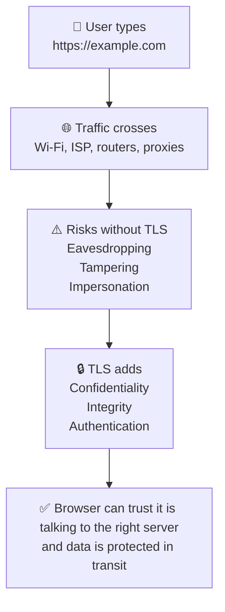

SSL/TLS exists to solve three core problems on untrusted networks:

- Confidentiality: outsiders should not be able to read sensitive data such as passwords, cookies, tokens, or payment details.
- Integrity: outsiders should not be able to silently modify traffic in transit.
- Authentication: the client should be able to verify that it is actually talking to the intended server and not an impostor.

### 1.1 What TLS does not do

- It does not make an insecure application secure by itself.
- It does not protect data once it reaches the server application.
- It does not stop phishing domains that look similar to the real domain.
- It does not guarantee that the server itself is honest or uncompromised.

### 1.2 The mental model

- TCP creates a reliable connection.
- TLS authenticates the server and establishes shared session keys.
- HTTP runs inside the encrypted TLS tunnel.
- After the handshake, symmetric encryption protects the bulk traffic because it is fast.

---

## 2. SSL/TLS History Timeline

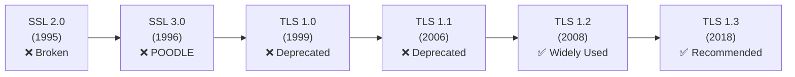

### 2.1 Why the history matters

- Security protocols evolve because attackers keep finding weaknesses in old designs.
- Many configuration mistakes come from preserving old compatibility for too long.
- Modern TLS guidance is mostly about removing unsafe legacy behavior.

### 2.2 SSL 2.0 (1995)

- Had serious design flaws.
- Should never be enabled anywhere.
- Modern clients and servers do not support it.

### 2.3 SSL 3.0 (1996)

- Important historically, but obsolete.
- Known for the POODLE attack path.
- Must be disabled in any modern environment.

### 2.4 TLS 1.0 (1999)

- Successor to SSL.
- No longer acceptable for modern internet-facing services.
- Disabled by default in many modern stacks.

### 2.5 TLS 1.1 (2006)

- Incremental improvement over TLS 1.0.
- Still deprecated today.
- Usually removed to meet compliance baselines.

### 2.6 TLS 1.2 (2008)

- Long-time production standard.
- Supports strong cipher suites such as AES-GCM and ECDHE.
- Still broadly compatible with real-world clients.

### 2.7 TLS 1.3 (2018)

- Simplifies the protocol.
- Removes many dangerous legacy options.
- Reduces handshake latency and is the recommended default.

### 2.8 Recommended production baseline

- Allow TLS 1.2 and TLS 1.3.
- Prefer TLS 1.3 when both sides support it.
- Disable SSLv2, SSLv3, TLS 1.0, and TLS 1.1.
- Patch OpenSSL, nginx, Apache, HAProxy, load balancers, and operating systems regularly.

---

## 3. How HTTPS Works — Complete Browser to Server Flow

### 📸 HTTPS Connection

> *Source: Wikimedia Commons — HTTPS secure connection*

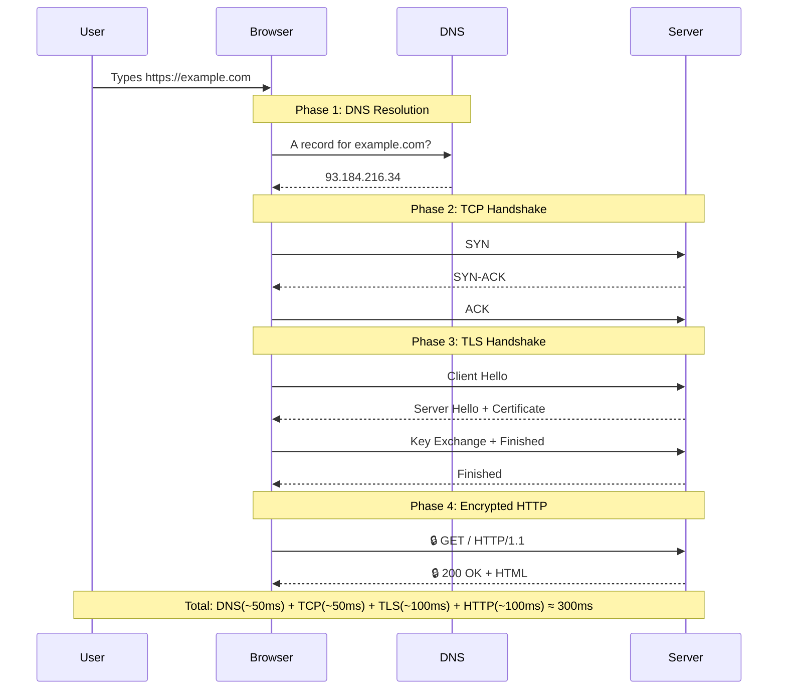

### 3.1 Phase 1: DNS resolution

- The browser needs an IP address before it can open a network connection.
- The browser may query the OS cache, browser cache, recursive resolver, and authoritative DNS servers.
- DNS answers can include A, AAAA, CNAME, and sometimes HTTPS/SVCB records in modern deployments.

### 3.2 Phase 2: TCP handshake

- TCP establishes a reliable byte stream using SYN, SYN-ACK, and ACK.
- Only after TCP is established can TLS messages be exchanged on port 443.
- Packet loss, firewall blocks, or overloaded load balancers can delay or prevent this phase.

### 3.3 Phase 3: TLS handshake

- The client and server agree on protocol parameters.
- The server proves its identity with a certificate chain.
- Both sides derive shared session keys.
- Finished messages confirm that the handshake transcript has not been tampered with.

### 3.4 Phase 4: encrypted HTTP

- Once keys exist, HTTP requests and responses are carried as TLS application data records.
- Anyone observing the network can still see metadata such as IPs, timing, and sometimes SNI in classic TLS, but not the plaintext HTTP body.
- The server application still sees the decrypted HTTP request after TLS terminates.

### 3.5 Practical commands

```bash
dig +short example.com
curl -Iv https://example.com
openssl s_client -connect example.com:443 -servername example.com
```

---

## 4. Cryptography Building Blocks Used by TLS

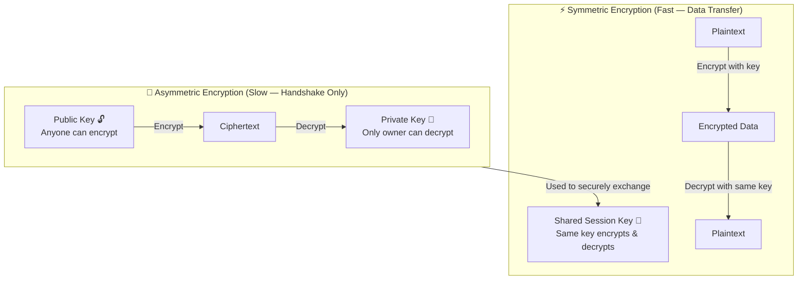

### 4.1 Why TLS mixes two cryptographic styles

- Asymmetric cryptography solves the identity and key-establishment problem.
- Symmetric cryptography solves the performance problem because it is much faster for large amounts of traffic.
- Modern TLS uses the handshake to derive short-lived symmetric session keys and then uses those keys for application data.

### 4.2 Symmetric encryption

- One shared secret key is used for both encryption and decryption.
- Examples inside TLS include AES-GCM and ChaCha20-Poly1305.
- This is the reason encrypted web traffic can still be fast at scale.

### 4.3 Asymmetric cryptography

- Public keys can be shared freely.
- Private keys must remain secret.
- Certificates bind identities such as hostnames to public keys.
- In modern TLS, the server certificate usually authenticates the handshake instead of directly encrypting all traffic.

### 📸 Public Key Cryptography

> *Source: Wikimedia Commons — Public key encryption concept*

### 📸 Diffie-Hellman Key Exchange

> *Source: Wikimedia Commons — Diffie-Hellman key exchange visualization*

### 4.4 Hashes, MACs, and AEAD

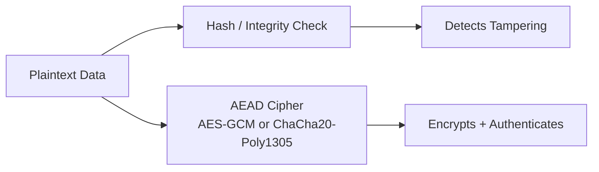

- Old TLS versions often described encryption and MAC separately.
- Modern TLS prefers AEAD ciphers because they provide encryption and integrity together.
- If integrity protection fails, the record is rejected instead of partially accepted.

### 4.5 Perfect Forward Secrecy

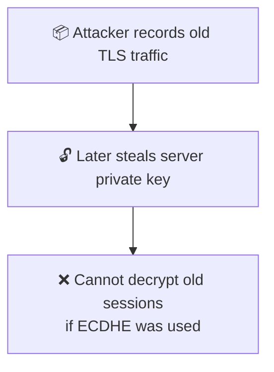

- Perfect Forward Secrecy means past traffic remains safe even if the server private key is stolen later.
- ECDHE provides this property because each session uses ephemeral keys.
- This is one reason modern TLS configurations prefer ECDHE and TLS 1.3.

---

## 5. TLS 1.2 Handshake — Detailed Step by Step

### 📸 TLS 1.2 Handshake

> *Source: Wikimedia Commons — Full TLS 1.2 handshake sequence*

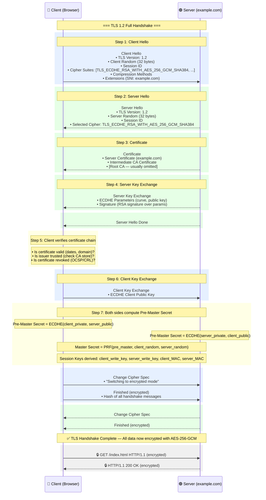

### 5.1 Before the first byte of the handshake

- TCP must already be established.
- The client must know the hostname it is connecting to.
- The server must have access to a private key and matching certificate chain.
- Both sides need at least one compatible protocol version and cipher suite.

### 5.2 Step 1: Client Hello

#### What is being sent and why

- The client sends the highest TLS version it supports for the handshake context.
- The client random is a fresh 32-byte random value used later in key derivation.
- The cipher suite list tells the server which combinations of key exchange, authentication, and encryption the client can use.
- Extensions include SNI so the server knows which hostname certificate to present on multi-tenant infrastructure.
- Extensions may also include ALPN so the client can negotiate HTTP/2 or HTTP/1.1.
- In many environments the Client Hello is the first place where you can see compatibility problems.

#### What happens if this step fails

- If the server finds no overlapping TLS version or cipher suite, the handshake stops immediately.
- If SNI is missing or wrong, the server may present the wrong certificate.
- If the message is malformed, the server usually sends an alert and closes the connection.

#### How an attacker could try to exploit this stage

- A downgrade attacker may try to force weaker protocol versions or weaker ciphers.
- Passive observers can often see SNI in classic TLS, which leaks the requested hostname even though HTTP data stays encrypted.
- Fingerprinting systems can identify client software by the exact ordering of ciphers and extensions.

#### Practical commands and observation points

- `openssl s_client -connect example.com:443 -servername example.com -tls1_2`
- `curl -Iv --tlsv1.2 https://example.com`

### 5.3 Step 2: Server Hello

#### What is being sent and why

- The server selects the actual TLS version for this connection.
- The server random contributes entropy to the later key derivation process.
- The server chooses one cipher suite from the client list that it supports and is willing to use.
- The selected session ID can be used in some resumption models.
- The server response is the first sign of the server policy in action.

#### What happens if this step fails

- If the server chooses a version or cipher the client did not offer, the client will reject the handshake.
- If no overlap exists, the server sends a handshake failure alert.
- If the server sends inconsistent extension values, modern clients abort.

#### How an attacker could try to exploit this stage

- A downgrade attack tries to influence the negotiated version or cipher.
- Weak server policy can keep old, unsafe suites enabled for legacy reasons.
- Middleboxes that tamper with the hello messages can break negotiation.

#### Practical commands and observation points

- `openssl s_client -connect example.com:443 -servername example.com -cipher ECDHE-RSA-AES256-GCM-SHA384`
- `nmap --script ssl-enum-ciphers -p 443 example.com`

### 5.4 Step 3: Certificate

#### What is being sent and why

- The server sends its leaf certificate and usually one or more intermediate certificates.
- The leaf certificate contains the subject public key and names in the Subject Alternative Name extension.
- The root CA is usually omitted because the client already has trusted roots installed locally.
- The certificate proves identity only if the client trusts the issuing chain and the hostname matches.

#### What happens if this step fails

- If the hostname does not match, the browser shows a certificate warning or blocks the connection.
- If the certificate is expired or not yet valid, validation fails.
- If the intermediate chain is missing, some clients cannot build trust and the handshake fails.

#### How an attacker could try to exploit this stage

- A MITM attacker can present a fake certificate, but the browser should reject it if the chain is not trusted.
- A stolen but still-valid certificate can be abused until it expires or is revoked.
- Misissued certificates are one reason Certificate Transparency logs matter.

#### Practical commands and observation points

- `openssl s_client -connect example.com:443 -servername example.com -showcerts`
- `openssl x509 -in cert.pem -noout -text`

### 5.5 Step 4: Server Key Exchange

#### What is being sent and why

- For ECDHE suites, the server sends ephemeral key exchange parameters such as the curve and the server ephemeral public key.
- The server signs these parameters using the private key associated with the certificate.
- This binds the ephemeral key exchange to the authenticated server identity.
- This message is critical for Perfect Forward Secrecy.

#### What happens if this step fails

- If the signature does not verify, the client aborts because the key exchange cannot be trusted.
- If unsupported curves are used, the client may reject the handshake.
- Malformed parameters also cause alerts and immediate termination.

#### How an attacker could try to exploit this stage

- A MITM attacker would love to substitute different ECDHE parameters, but the server signature is designed to stop that.
- Weak curve choices or buggy implementations can create cryptographic risk.
- Implementation bugs in curve handling have historically caused serious vulnerabilities.

#### Practical commands and observation points

- `openssl s_client -connect example.com:443 -servername example.com -msg`
- `openssl ecparam -list_curves | head`

### 5.6 Step 5: Client verifies certificate chain

#### What is being sent and why

- No network message is required for the core verification logic; the client performs local validation.
- The client checks the current time against certificate validity dates.
- The client checks the requested hostname against SAN entries.
- The client builds a chain to a trusted root in the local trust store.
- The client may check revocation status using OCSP or CRL mechanisms.

#### What happens if this step fails

- Any failure usually produces a browser warning, a hard block in strict clients, or an API connection error.
- If the trust anchor is missing, enterprise or private PKI deployments fail until the root is installed.
- If revocation checks fail in strict environments, the connection may be rejected.

#### How an attacker could try to exploit this stage

- Attackers may try to rely on user click-through behavior when a browser shows a certificate warning.
- Compromised or rogue CAs can issue certificates that appear valid unless additional controls detect them.
- Private trust stores on corporate devices can intentionally intercept TLS for inspection, which changes the trust model.

#### Practical commands and observation points

- `openssl verify -CAfile chain.pem fullchain.pem`
- `security find-certificate -a -p /System/Library/Keychains/SystemRootCertificates.keychain | head`

### 5.7 Step 6: Client Key Exchange

#### What is being sent and why

- The client sends its ephemeral ECDHE public key to the server.
- The server combines the client public key with its ephemeral private key to derive the same shared secret.
- The client combines the server public key with its ephemeral private key to derive the same shared secret.
- The shared secret itself is never sent over the network.

#### What happens if this step fails

- If either side cannot process the peer public key, the handshake fails.
- If the implementation mishandles ephemeral keys, the derived secret will not match and the Finished step will fail.
- If the peer uses unsupported groups, negotiation aborts.

#### How an attacker could try to exploit this stage

- An attacker observing traffic only sees public keys, not the shared secret.
- Implementation vulnerabilities in elliptic curve math can break security even if the protocol design is sound.
- Weak randomness during ephemeral key generation can catastrophically undermine the session.

#### Practical commands and observation points

- `openssl rand -hex 32`
- `openssl s_client -connect example.com:443 -servername example.com -state`

### 5.8 Step 7: Both sides compute the pre-master secret and session keys

#### What is being sent and why

- Using the ECDHE shared secret plus the client and server random values, both peers derive the master secret.
- From the master secret they derive symmetric encryption keys, IVs, and record-protection material.
- At this point, both sides know they should have the same keying material if everything so far is valid.

#### What happens if this step fails

- If the derived values differ, the Finished verification fails.
- If either side uses incorrect transcript data or randoms, the session cannot continue.
- A mismatch here usually looks like an encrypted handshake failure or decrypt error.

#### How an attacker could try to exploit this stage

- A passive attacker still cannot derive the keys without the ephemeral private keys.
- A broken pseudo-random function implementation can lead to interop failures or worse.
- Side-channel attacks may target key derivation or memory handling in weak implementations.

#### Practical commands and observation points

- `openssl s_client -connect example.com:443 -servername example.com -debug`
- `sslyze --regular example.com:443`

### 5.9 Step 8: Change Cipher Spec and Finished from client

#### What is being sent and why

- The client signals that future records will be protected with the newly derived keys.
- The client sends an encrypted Finished message containing a hash over the handshake transcript.
- This proves the client derived the same keys and saw the same handshake messages.

#### What happens if this step fails

- If the server cannot decrypt or validate the Finished message, it closes the connection.
- Any tampering with earlier handshake messages is detected here.
- A bad transcript hash usually means key mismatch or active interference.

#### How an attacker could try to exploit this stage

- Active attackers hate the Finished message because it detects transcript manipulation.
- Downgrade or tampering attempts often become visible at this point.
- Implementation flaws around state transitions have historically caused bugs.

#### Practical commands and observation points

- `openssl s_client -connect example.com:443 -servername example.com -msg -state`

### 5.10 Step 9: Change Cipher Spec and Finished from server

#### What is being sent and why

- The server now switches its outbound records to encrypted mode.
- The server sends its own encrypted Finished message.
- Once the client verifies it, both sides know the handshake completed successfully.

#### What happens if this step fails

- If the client cannot validate the server Finished message, the connection is aborted.
- This often indicates a problem in key derivation, transcript handling, or packet corruption.
- No application data is trusted until this check succeeds.

#### How an attacker could try to exploit this stage

- MITM attempts that alter the handshake are exposed here because the transcript hashes no longer match.
- Broken middleboxes sometimes cause weird encrypted alert failures that appear only after this stage.
- State-machine implementation bugs have been a recurring source of TLS vulnerabilities.

#### Practical commands and observation points

- `tcpdump -i any port 443`
- `wireshark`

### 5.11 Step 10: Encrypted application data

#### What is being sent and why

- The browser can finally send `GET /` or any other HTTP request as encrypted application data.
- Cookies, authorization headers, HTML, JSON, and API payloads are now carried inside TLS records.
- At this point the expensive asymmetric part is done and the fast symmetric part takes over.

#### What happens if this step fails

- If later record decryption fails, the connection is closed and the request is lost.
- Large transfers may still fail due to network issues, timeouts, or application-level errors.
- TLS success does not guarantee application success; the server can still return HTTP 500.

#### How an attacker could try to exploit this stage

- Attackers can still observe metadata such as packet sizes, timing, and IP addresses.
- If the endpoint itself is compromised, encrypted transport no longer helps.
- Session cookies remain valuable targets, so secure cookie settings still matter.

#### Practical commands and observation points

- `curl --http1.1 -Iv https://example.com`
- `curl --http2 -Iv https://example.com`

### 5.12 Why TLS 1.2 was a big improvement

- It brought broad support for modern authenticated encryption modes such as AES-GCM.
- It enabled robust deployments with ECDHE for forward secrecy.
- It became the default security baseline for internet services for many years.

### 5.13 Why TLS 1.2 is still not the end of the story

- TLS 1.2 still contains legacy negotiation complexity.
- Server operators still have to think carefully about ciphers and old clients.
- TLS 1.3 simplified many of these choices and removed unsafe options.

---

## 6. TLS 1.3 Handshake — Faster (1-RTT)

### 📸 TLS 1.3 Handshake (Faster)

> *Source: Wikimedia Commons — TLS 1.3 reduced round-trip handshake*

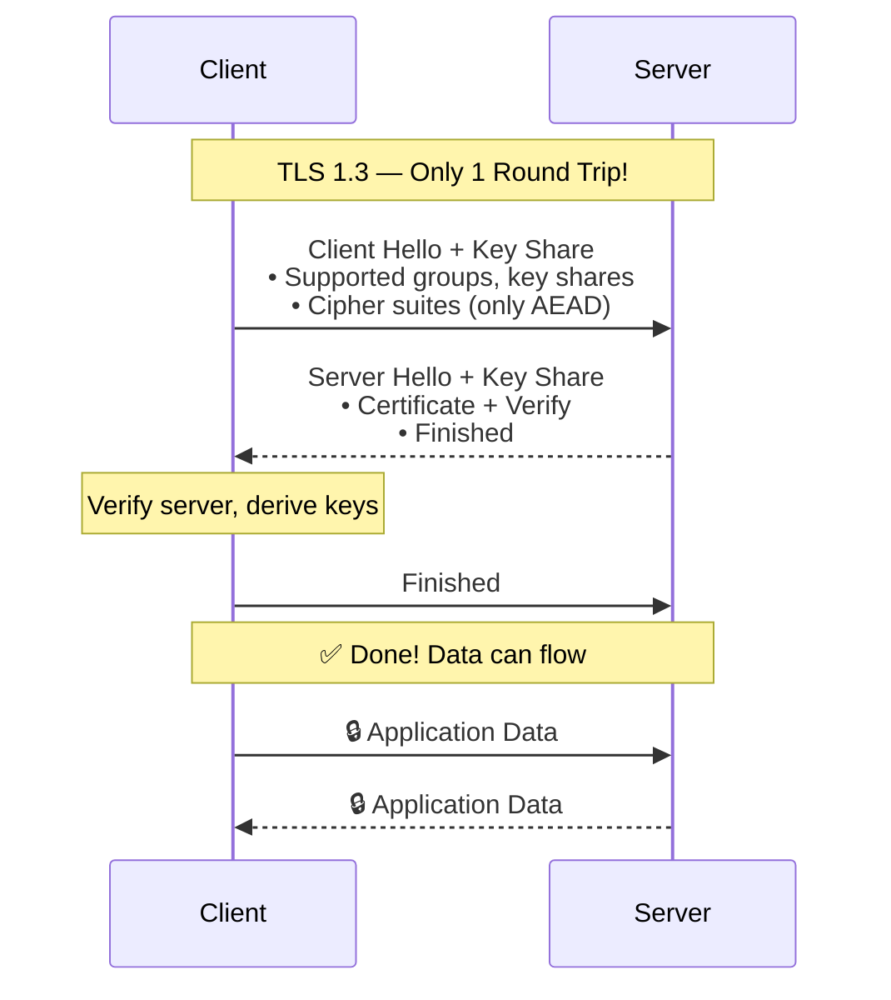

### 6.1 What changed in TLS 1.3

- The protocol removes many legacy handshake choices that made TLS 1.2 harder to configure safely.
- Key exchange happens earlier because the client sends key shares immediately.
- The handshake usually completes in one round trip for a fresh connection.
- Only modern cipher constructions are allowed.

### 6.2 TLS 1.3 message flow

- Client Hello already contains a key share, which saves a round trip.
- The server replies with its own key share, certificate, CertificateVerify, and Finished.
- The client verifies everything, derives traffic secrets, and sends Finished.
- Application data can begin immediately after.

### 6.3 Why TLS 1.3 is faster

- Fewer message exchanges reduce latency on high-round-trip networks.
- The removal of fragile legacy features simplifies implementations.
- Session resumption can also become faster and more efficient.

### 6.4 Practical commands

```bash
openssl s_client -connect example.com:443 -servername example.com -tls1_3
curl --tlsv1.3 -Iv https://example.com
```

### 6.5 0-RTT warning

- TLS 1.3 supports optional 0-RTT data for resumed sessions, but it is replayable.
- Do not use 0-RTT for non-idempotent actions like payments or state-changing POST requests unless you fully understand the replay risks.
- Many applications safely restrict 0-RTT usage or disable it entirely.

---

## 7. TLS 1.2 vs TLS 1.3 — Visual Comparison

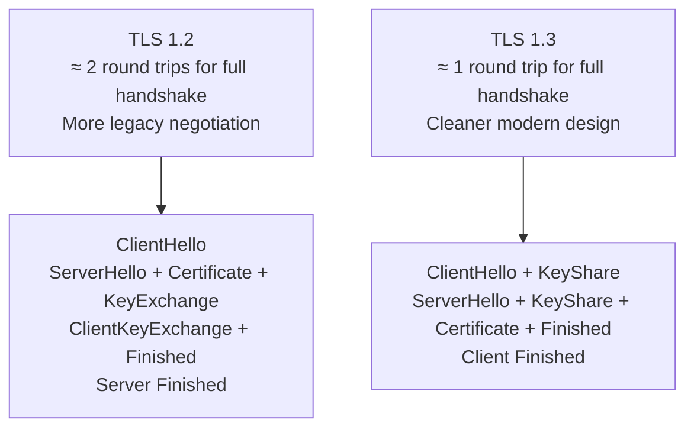

### 7.1 Side-by-side table

| Area | TLS 1.2 | TLS 1.3 |
|---|---|---|
| Round trips | Typically more | Typically fewer |
| Cipher handling | More legacy complexity | Simpler and safer defaults |
| Forward secrecy | Strong when ECDHE is used | Core expectation |
| Performance | Good | Better handshake latency |
| Misconfiguration risk | Higher | Lower |
| Legacy compatibility | Broader | Slightly narrower, but modern |

### 7.2 Operational takeaway

- Keep TLS 1.2 enabled for compatibility if needed.
- Prefer TLS 1.3 where supported.
- Avoid hand-tuning obscure cipher lists unless you have a measured reason.

---

## 8. Certificate Chain of Trust — Visual

### 📸 Certificate Chain of Trust

> *Source: Wikimedia Commons — X.509 certificate chain of trust*

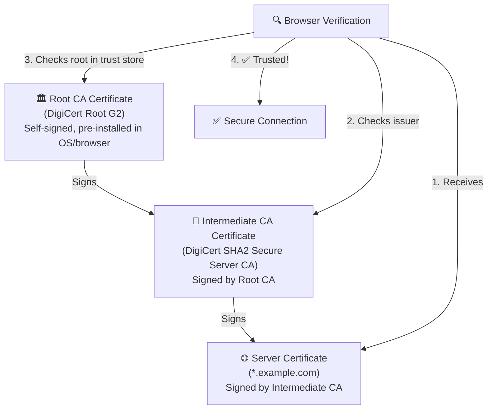

### 8.1 What a chain really means

- The browser trusts a small set of root CAs already installed in its trust store.
- Root CAs usually sign intermediate CAs, and intermediates sign server certificates.
- Servers normally send the leaf certificate and intermediate certificates, but not the root.
- Clients build a path from the leaf to a trusted root.

### 8.2 Why intermediates exist

- They reduce exposure because root keys can stay offline most of the time.
- They let CAs delegate issuance responsibilities safely.
- They make large PKI ecosystems easier to manage and rotate.

### 8.3 Validation checklist used by browsers

- Does the hostname match a SAN entry?
- Is the certificate within its validity dates?
- Is the signature chain intact from leaf to trusted root?
- Is the key usage appropriate for server authentication?
- Is revocation status acceptable?
- Is the certificate free from policy or algorithm problems?

### 8.4 Common chain mistakes

- Serving only the leaf certificate instead of the full chain.
- Using the wrong intermediate for the certificate.
- Installing a certificate whose SAN does not include the requested hostname.
- Forgetting to reload the web server after replacing certificate files.

### 8.5 Commands

```bash
openssl s_client -connect example.com:443 -servername example.com -showcerts
openssl verify -CAfile chain.pem fullchain.pem
```

---

## 9. Certificates, Identities, and Validation Rules

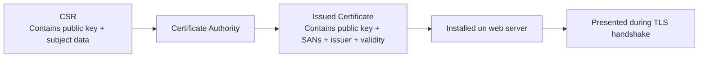

### 9.1 What is inside a certificate

- Subject public key.
- Subject Alternative Names (SANs).
- Issuer information.
- Validity dates.
- Signature by the issuing CA.
- Extensions such as key usage and extended key usage.

### 9.2 Common certificate types

| Type | Meaning | Typical use |
|---|---|---|
| Self-signed | Signed by itself | Local dev, internal experiments |
| DV | Domain Validation | Standard public websites and APIs |
| OV | Organization Validation | Some businesses wanting extra identity checks |
| EV | Extended Validation | Specialized cases; not visually special in most browsers now |
| Wildcard | Covers `*.example.com` | Many subdomains under one zone |
| SAN / Multi-domain | Covers several specific names | Multi-host applications |

### 9.3 SAN beats Common Name

- Modern clients validate hostnames primarily using the Subject Alternative Name extension.
- Relying on the Common Name alone is obsolete.
- If the SAN is wrong, the connection fails even if the Common Name looks right.

### 9.4 CSR generation examples

```bash
openssl genrsa -out example.com.key 4096
openssl req -new -key example.com.key -out example.com.csr

openssl ecparam -name prime256v1 -genkey -noout -out example.com-ecdsa.key
openssl req -new -key example.com-ecdsa.key -out example.com-ecdsa.csr
```

### 9.5 CSR inspection

```bash
openssl req -in example.com.csr -noout -text
```

### 9.6 Self-signed certificate example

```bash
openssl req -x509 -nodes -days 365 -newkey rsa:2048 \
  -keyout selfsigned.key \
  -out selfsigned.crt
```

### 9.7 When self-signed is okay

- Local development.
- Internal labs where your own CA is trusted.
- Temporary testing where browser warnings are acceptable.

### 9.8 When self-signed is not okay

- Public production websites.
- Consumer-facing mobile apps without private trust bootstrapping.
- Partner integrations that expect public CA trust.

---

## 10. Cipher Suite Breakdown

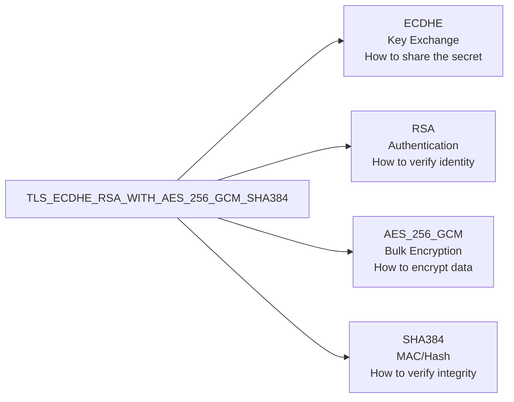

### 10.1 Reading the name from left to right

- ECDHE: ephemeral elliptic-curve Diffie-Hellman for key exchange and forward secrecy.
- RSA: the server certificate uses RSA for authentication and signatures.
- AES_256_GCM: AES with a 256-bit key in GCM mode protects the application data.
- SHA384: hash function associated with parts of the suite definition in TLS 1.2.

### 10.2 Important note for TLS 1.3

- TLS 1.3 changed cipher naming and removed some of the old suite complexity.
- Key exchange and certificate authentication are negotiated more cleanly instead of being baked into one long suite name.
- That is why TLS 1.3 configuration usually feels simpler.

### 10.3 Recommended mindset

- Prefer modern defaults from maintained servers and libraries.
- Avoid enabling weak suites for compatibility unless you have a very specific requirement.
- Regularly test with SSL Labs, sslyze, or nmap cipher enumeration.

---

## 11. Common TLS Attacks — Visual

### 11.1 MITM attack and how TLS blocks it

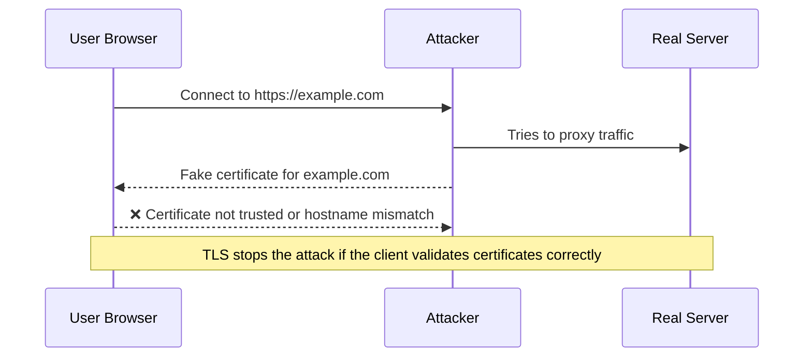

TLS prevents a basic man-in-the-middle attack because the attacker usually cannot present a certificate chain trusted for the real hostname.

#### What defeats this defense

- Users clicking through certificate warnings.
- Compromised trust stores or rogue enterprise roots.
- Misissued certificates from compromised or abusive CAs.
- Endpoint compromise rather than network compromise.

### 11.2 Certificate pinning

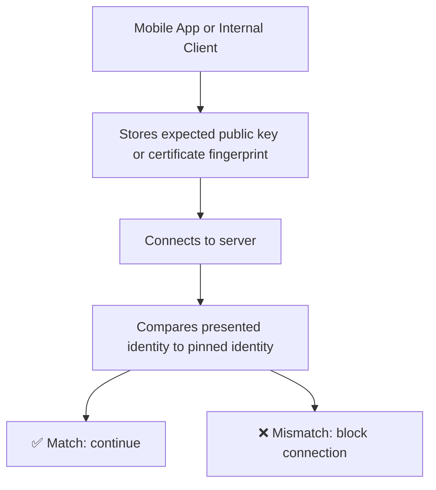

Pinning means the client expects a very specific certificate or public key, not just any public CA-issued certificate for the hostname.

#### Pros

- Reduces reliance on the entire public CA ecosystem.
- Can be useful in tightly controlled internal environments.
- Makes MITM much harder when the attacker only has CA-based trust tricks.

#### Cons

- Operationally risky because certificate rotation can brick clients if the pin is outdated.
- Public HPKP was effectively abandoned because it created too much recovery risk.
- Modern practice favors Certificate Transparency monitoring and good PKI hygiene instead of browser-level HPKP.

### 11.3 Downgrade attacks

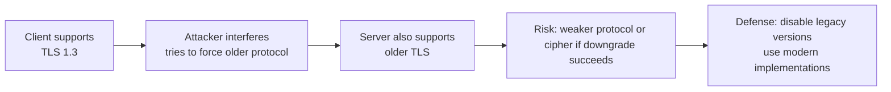

A downgrade attack tries to push the connection onto an older, weaker protocol version or weaker cipher suite.

#### Defenses

- Disable SSLv3, TLS 1.0, and TLS 1.1.
- Use up-to-date TLS libraries that implement downgrade protections correctly.
- Prefer TLS 1.3 and strong TLS 1.2 suites only.

### 11.4 Other attack themes worth knowing

- Protocol downgrade attempts.
- Certificate mis-issuance or trust store abuse.
- Weak random number generation.
- Implementation bugs such as Heartbleed-style memory issues.
- Application-layer token theft even after transport encryption succeeds.
- Replay risk with 0-RTT in TLS 1.3.
- Traffic analysis based on size and timing even when content is encrypted.

---

## 12. Certificate Management Commands — OpenSSL Reference

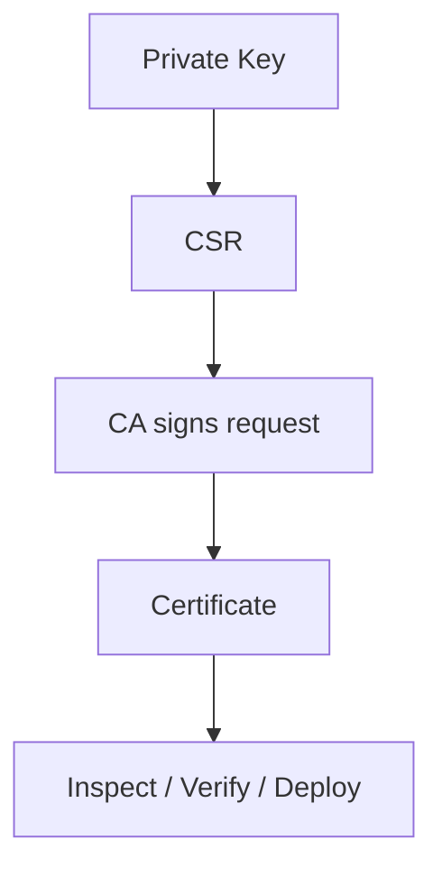

This section is intentionally command-heavy so it can be used as a field reference.

### 12.1 Generate an RSA private key

```bash
openssl genrsa -out server.key 4096
```
Use RSA when broad compatibility matters most.
Restrict permissions on the private key immediately after creation.

### 12.2 Generate an ECDSA private key

```bash
openssl ecparam -name prime256v1 -genkey -noout -out server-ecdsa.key
```
ECDSA uses smaller keys and can be efficient.
Compatibility with extremely old clients may be weaker than RSA.

### 12.3 Generate a CSR

```bash
openssl req -new -key server.key -out server.csr
```
The CSR includes the public key and subject information.
The private key never leaves the server during CSR generation.

### 12.4 Generate a CSR with SAN via config file

```bash
openssl req -new -key server.key -out server.csr -config openssl-san.cnf
```
Use this when you need explicit SAN values in the request.
Always inspect the CSR before submitting it.

### 12.5 Inspect a CSR

```bash
openssl req -in server.csr -noout -text
```
Confirm SAN, subject, and public key details.
This catches mistakes before issuance.

### 12.6 Create a self-signed certificate

```bash
openssl req -x509 -nodes -days 365 -newkey rsa:2048 -keyout selfsigned.key -out selfsigned.crt
```
Useful for labs and quick internal testing.
Do not use for public production internet services.

### 12.7 View certificate details

```bash
openssl x509 -in fullchain.pem -noout -text
openssl x509 -in fullchain.pem -noout -issuer -subject -dates
```
Inspect validity, issuer, SANs, and key usage.
Great first step in any certificate investigation.

### 12.8 View only certificate fingerprint

```bash
openssl x509 -in fullchain.pem -noout -fingerprint -sha256
```
Useful for manual verification and pinning workflows.
Be careful not to confuse SHA-1 and SHA-256 fingerprints.

### 12.9 Verify a certificate chain

```bash
openssl verify -CAfile chain.pem fullchain.pem
```
Verifies chain building using the supplied CA file.
If verification fails, inspect intermediates and hostname separately.

### 12.10 Test a remote TLS connection

```bash
openssl s_client -connect example.com:443 -servername example.com
```
Shows the negotiated protocol, cipher, and presented certificates.
Always include `-servername` for SNI-aware servers.

### 12.11 Show the full presented certificate chain

```bash
openssl s_client -connect example.com:443 -servername example.com -showcerts
```
This is one of the fastest ways to detect a missing intermediate.
Capture the output and inspect each certificate block carefully.

### 12.12 Force TLS 1.2 for testing

```bash
openssl s_client -connect example.com:443 -servername example.com -tls1_2
```
Useful when debugging legacy-client compatibility.
If this fails while TLS 1.3 works, the issue is likely TLS 1.2 policy or cipher overlap.

### 12.13 Force TLS 1.3 for testing

```bash
openssl s_client -connect example.com:443 -servername example.com -tls1_3
```
Confirms TLS 1.3 support on the target.
Helpful during hardening reviews.

### 12.14 Convert PEM to DER

```bash
openssl x509 -in server.crt -outform der -out server.der
```
Some tooling and platforms prefer DER.
PEM is Base64 text; DER is binary.

### 12.15 Convert DER to PEM

```bash
openssl x509 -inform der -in server.der -out server.pem
```
Useful when migrating files between systems.
PEM is usually easier to inspect manually.

### 12.16 Export a PKCS#12 bundle

```bash
openssl pkcs12 -export -out server.p12 -inkey server.key -in server.crt -certfile chain.pem
```
Common for Windows, Java, and appliance imports.
Protect the export password carefully.

### 12.17 Inspect a PKCS#12 bundle

```bash
openssl pkcs12 -info -in server.p12
```
Shows certificates and key material contained in the bundle.
Do this before importing into production systems.

### 12.18 Match a private key to a certificate

```bash
openssl x509 -noout -modulus -in server.crt | openssl md5
openssl rsa -noout -modulus -in server.key | openssl md5
```
The digests should match for RSA material.
This catches one of the most common deployment mistakes.

### 12.19 Check certificate expiration quickly

```bash
openssl x509 -in server.crt -noout -enddate
```
Ideal for scripts and monitoring probes.
Automate alerts well before expiry.

### 12.20 Curl and browser-adjacent checks

```bash
curl -Iv https://example.com
curl --tlsv1.2 -Iv https://example.com
curl --tlsv1.3 -Iv https://example.com
```

### 12.21 Troubleshooting tips for OpenSSL output

- Look for `Verify return code: 0 (ok)`.
- Confirm the negotiated protocol is TLSv1.2 or TLSv1.3.
- Confirm the cipher matches your policy.
- Inspect the certificate chain carefully when clients report trust errors.
- Always include `-servername` when checking name-based virtual hosts.

---

## 13. Let's Encrypt / Certbot — How ACME Protocol Works

### 📸 ACME Protocol (Let's Encrypt)

> *Source: Wikimedia Commons — Let's Encrypt*

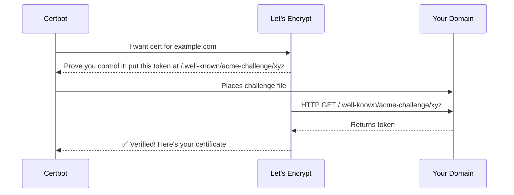

### 13.1 What ACME is

- ACME is the automated protocol used by Let's Encrypt and many other CAs to issue certificates.
- Instead of manually emailing CSRs and downloading files, software can request, validate, issue, and renew automatically.
- Certbot is one of the most common ACME clients.

### 13.2 Typical issuance flow

- Generate an account key and order a certificate.
- Choose an authorization challenge such as HTTP-01 or DNS-01.
- Prove control over the requested domain.
- Receive the certificate and install it on the server.
- Renew automatically before expiry.

### 13.3 Challenge types

| Challenge | How it works | Best for |
|---|---|---|
| HTTP-01 | Serve a token under `/.well-known/acme-challenge/` on port 80 | Standard web servers |
| DNS-01 | Publish a TXT record under `_acme-challenge` | Wildcards and complex edge environments |
| TLS-ALPN-01 | Serve a validation response over TLS with ALPN | Specialized setups |

### 13.4 Certbot installation examples

```bash
sudo apt update
sudo apt install -y certbot python3-certbot-nginx python3-certbot-apache
```

### 13.5 Request a certificate for Nginx

```bash
sudo certbot --nginx -d example.com -d www.example.com
```

### 13.6 Request a certificate for Apache

```bash
sudo certbot --apache -d example.com -d www.example.com
```

### 13.7 Standalone mode

```bash
sudo certbot certonly --standalone -d example.com
```

### 13.8 Webroot mode

```bash
sudo certbot certonly --webroot -w /var/www/example.com/public -d example.com -d www.example.com
```

### 13.9 DNS challenge example

```bash
sudo certbot certonly --manual --preferred-challenges dns -d example.com -d *.example.com
```

### 13.10 Renewal testing

```bash
sudo certbot renew --dry-run
```

### 13.11 Important file locations

| Purpose | Path |
|---|---|
| Live certs | `/etc/letsencrypt/live/` |
| Archived certs | `/etc/letsencrypt/archive/` |
| Renewal configs | `/etc/letsencrypt/renewal/` |
| Logs | `/var/log/letsencrypt/` |

### 13.12 Operational tips

- Make sure port 80 is reachable for HTTP-01 unless you use DNS-01.
- For wildcard certificates, use DNS-01.
- Automate service reloads after successful renewals.
- Monitor certificate expiration anyway; automation can fail silently.

### 13.13 Deploy hook examples

```bash
sudo certbot renew --deploy-hook "systemctl reload nginx"
sudo certbot renew --deploy-hook "systemctl reload apache2"
```

---

## 14. SSL Labs A+ Configuration

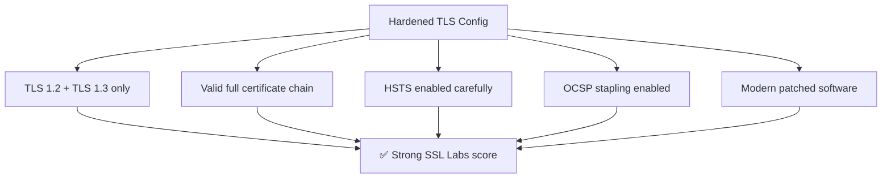

### 14.1 Example hardened Nginx server block

```nginx
server {
    listen 443 ssl http2;
    listen [::]:443 ssl http2;
    server_name example.com www.example.com;

    ssl_certificate     /etc/letsencrypt/live/example.com/fullchain.pem;
    ssl_certificate_key /etc/letsencrypt/live/example.com/privkey.pem;

    ssl_protocols TLSv1.2 TLSv1.3;
    ssl_session_timeout 1d;
    ssl_session_cache shared:SSL:50m;
    ssl_session_tickets off;
    ssl_prefer_server_ciphers off;

    ssl_stapling on;
    ssl_stapling_verify on;
    resolver 1.1.1.1 1.0.0.1 8.8.8.8 8.8.4.4 valid=300s ipv6=off;
    resolver_timeout 5s;

    add_header Strict-Transport-Security "max-age=31536000; includeSubDomains; preload" always;
    add_header X-Content-Type-Options "nosniff" always;
    add_header X-Frame-Options "SAMEORIGIN" always;
    add_header Referrer-Policy "strict-origin-when-cross-origin" always;

    location / {
        proxy_pass http://127.0.0.1:8080;
        proxy_set_header Host $host;
        proxy_set_header X-Forwarded-For $proxy_add_x_forwarded_for;
        proxy_set_header X-Forwarded-Proto https;
    }
}

server {
    listen 80;
    listen [::]:80;
    server_name example.com www.example.com;
    return 301 https://$host$request_uri;
}
```

### 14.2 Why each directive matters

- `ssl_protocols TLSv1.2 TLSv1.3;`: Disables obsolete protocols and keeps only modern versions.
- `ssl_session_tickets off;`: Avoids ticket-key rotation pitfalls unless you manage them centrally.
- `ssl_stapling on;`: Improves revocation checking behavior and performance.
- `Strict-Transport-Security`: Tells browsers to use HTTPS automatically in the future.
- `fullchain.pem`: Ensures the intermediate chain is presented correctly.
- `resolver`: Allows nginx to resolve OCSP responder and upstream names reliably.

### 14.3 Test commands

```bash
sudo nginx -t
sudo systemctl reload nginx
curl -Iv https://example.com
openssl s_client -connect example.com:443 -servername example.com
```

### 14.4 Important caveat

A high SSL Labs score is useful, but the real goal is a safe and reliable production system with working renewals, accurate monitoring, and no client-breaking surprises.

---

## 15. mTLS (Mutual TLS) — Visual

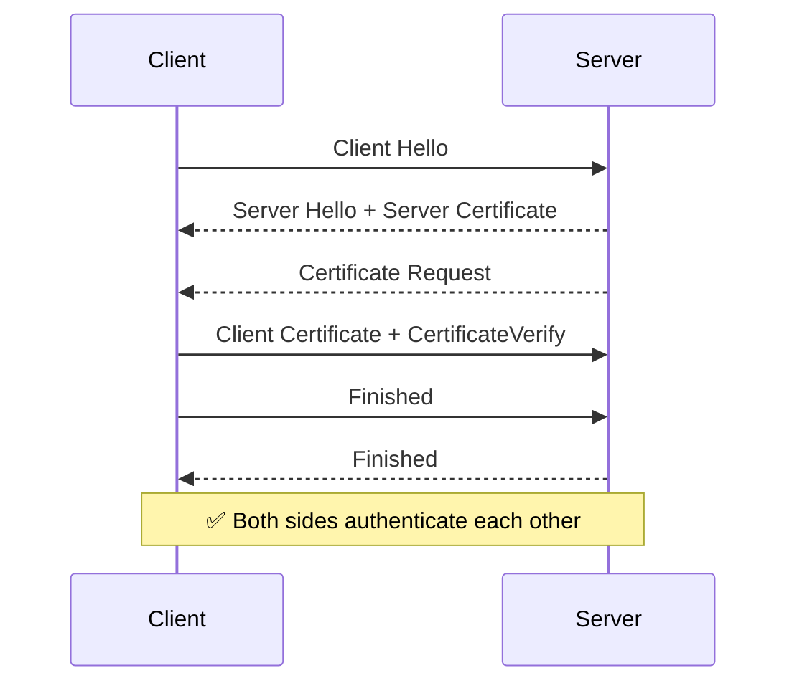

### 15.1 What mTLS adds

- Normal HTTPS authenticates the server to the client.
- mTLS also authenticates the client to the server using client certificates.
- This is common in internal APIs, service meshes, B2B integrations, and admin interfaces.

### 15.2 Benefits

- Strong machine identity without shared passwords.
- Useful for service-to-service authentication.
- Can work well with zero-trust network models.

### 15.3 Challenges

- Certificate issuance and rotation become more complex.
- Revocation and trust distribution must be planned carefully.
- Debugging failures is harder than simple bearer-token auth.

### 15.4 Nginx example

```nginx
ssl_client_certificate /etc/nginx/client-ca.crt;
ssl_verify_client on;
```

### 15.5 Apache example

```apache
SSLVerifyClient require
SSLVerifyDepth 2
SSLCACertificateFile /etc/apache2/client-ca.crt
```

### 15.6 Troubleshooting mTLS

- Confirm the client certificate chains to a CA trusted by the server.
- Check Extended Key Usage for client authentication.
- Inspect handshake logs because failures often happen before any HTTP request appears in app logs.

---

## 16. HSTS, OCSP Stapling, Certificate Transparency

### 16.1 HSTS

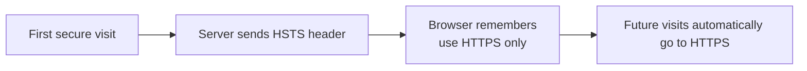

HSTS tells the browser to remember that a site must be contacted over HTTPS only.

#### Example header

```http
Strict-Transport-Security: max-age=31536000; includeSubDomains; preload
```

#### Why it helps

- Prevents protocol downgrade to HTTP after the browser has learned the policy.
- Protects against some forms of SSL stripping on future visits.
- Improves user safety for frequent visitors.

#### Risks

- Browsers cache the policy, so broken HTTPS can lock users out until fixed.
- Using `includeSubDomains` affects every subdomain.
- Using `preload` should be done only after careful validation.

### 16.2 OCSP Stapling

```mermaid
sequenceDiagram
    participant B as Browser
    participant S as Server
    participant CA as CA OCSP Responder

    S->>CA: Fetch OCSP status for its certificate
    CA-->>S: Signed OCSP response
    B->>S: TLS handshake
    S-->>B: Certificate + stapled OCSP response
    B-->>B: Faster revocation check
```

OCSP stapling lets the server attach proof of revocation status to the handshake so clients do not always have to query the CA directly.

#### Nginx example

```nginx
ssl_stapling on;
ssl_stapling_verify on;
resolver 1.1.1.1 8.8.8.8 valid=300s;
resolver_timeout 5s;
```

#### Apache example

```apache
SSLUseStapling On
SSLStaplingCache shmcb:/var/run/ocsp(128000)
```

### 16.3 Certificate Transparency

```mermaid
graph TD
    CA["CA issues certificate"] --> CT["Certificate logged to public CT logs"]
    CT --> BROWSER["Browsers require SCT proof"]
    CT --> MONITOR["Domain owners monitor logs for mis-issuance"]
```

Certificate Transparency creates public append-only logs of issued certificates.

#### Why it matters

- It makes secret certificate mis-issuance much harder.
- Browsers can require proof that the certificate was logged.
- Security teams can monitor CT logs for unexpected certificates for their domains.

#### Monitoring tip

- Set alerts for newly issued certificates containing your domain or brand names.
- Investigate unexpected certificates quickly; they may indicate test environments, vendor activity, or something suspicious.

---

## 17. Performance Topics: Resumption, ALPN, HTTP/2, and 0-RTT

### 17.1 Session resumption

```mermaid
sequenceDiagram
    participant C as Client
    participant S as Server

    C->>S: Previous session ticket / resumption data
    S-->>C: Accepts resumption parameters
    Note over C,S: Faster reconnect than a full handshake
```

- Session resumption reduces handshake overhead for returning clients.
- Tickets must be managed carefully on load-balanced fleets.
- If ticket keys are mishandled, security or consistency problems can follow.

### 17.2 ALPN

```mermaid
graph LR
    CH["Client Hello<br/>ALPN: h2, http/1.1"] --> SH["Server selects<br/>h2"]
    SH --> RESULT["HTTP/2 over TLS"]
```

- ALPN lets client and server agree on the application protocol inside the TLS handshake.
- Without ALPN, protocol negotiation would be clumsier and slower.
- HTTP/2 selection via ALPN is standard on modern secure web stacks.

### 17.3 0-RTT in resumed TLS 1.3 sessions

```mermaid
graph TD
    RESUME["Resumed TLS 1.3 session"] --> ZERO["Client sends early data"]
    ZERO --> REPLAY["⚠️ Early data can be replayed"]
    REPLAY --> SAFE["Use only for idempotent requests or disable"]
```

- 0-RTT can cut latency further for resumed sessions.
- The tradeoff is replay risk, so treat it with care.
- Use it only for requests that are safe to replay or disable it.

---

## 18. Troubleshooting Playbook

```mermaid
graph TD
    START["TLS problem appears"] --> CHECK1["Can DNS resolve?"]
    CHECK1 --> CHECK2["Can TCP 443 connect?"]
    CHECK2 --> CHECK3["Does certificate match hostname?"]
    CHECK3 --> CHECK4["Is full chain served?"]
    CHECK4 --> CHECK5["Are TLS versions compatible?"]
    CHECK5 --> CHECK6["Does server log reveal alerts?"]
```

### 18.1 First-response commands

```bash
dig +short example.com
nc -vz example.com 443
curl -Iv https://example.com
openssl s_client -connect example.com:443 -servername example.com -showcerts
sudo nginx -t
sudo apachectl configtest
```

### 18.2 Troubleshooting case 1

- Symptom: Browser says the certificate is not valid for this host
- Likely cause: The SAN list does not include the requested hostname, or SNI is routing to the wrong virtual host.
- First action: Check the SAN field with `openssl x509 -in cert.pem -noout -text` and test with `openssl s_client -servername host`.

### 18.3 Troubleshooting case 2

- Symptom: Some clients work but others fail
- Likely cause: The server may be missing an intermediate certificate or relying on client-side caching.
- First action: Serve `fullchain.pem` and retest from a clean environment.

### 18.4 Troubleshooting case 3

- Symptom: Only very old clients fail
- Likely cause: You may have disabled legacy protocols or ciphers they require.
- First action: Decide whether compatibility or security matters more; do not weaken production blindly.

### 18.5 Troubleshooting case 4

- Symptom: Handshake times out
- Likely cause: Firewall rules, load balancer issues, or packet inspection devices may be blocking or delaying traffic.
- First action: Verify TCP reachability and inspect edge device logs.

### 18.6 Troubleshooting case 5

- Symptom: Curl reports certificate problem
- Likely cause: Chain trust, hostname mismatch, or local CA trust issues are likely.
- First action: Use verbose curl and `openssl s_client` to separate hostname problems from trust problems.

### 18.7 Troubleshooting case 6

- Symptom: Renewal succeeded but users still see the old certificate
- Likely cause: The web server was not reloaded after renewal.
- First action: Add and test a Certbot deploy hook.

### 18.8 Troubleshooting case 7

- Symptom: OCSP stapling warning appears
- Likely cause: Resolver config or outbound access to the CA responder may be broken.
- First action: Check resolver settings and confirm the server can reach the OCSP responder.

### 18.9 Troubleshooting case 8

- Symptom: mTLS client is rejected
- Likely cause: The server does not trust the client CA or the client certificate is missing proper EKU.
- First action: Check server trust config and inspect the client certificate text output.

### 18.10 Troubleshooting case 9

- Symptom: HTTP works but HTTPS does not
- Likely cause: Port 443 listener or certificate configuration is broken.
- First action: Verify listeners, server blocks, and certificate file paths.

### 18.11 Troubleshooting case 10

- Symptom: SSL Labs score dropped unexpectedly
- Likely cause: A chain, protocol, HSTS, or patching regression likely occurred.
- First action: Compare current scanner output to the last known good configuration.

### 18.12 Log locations and server-side clues

- nginx error log often reveals certificate file or OCSP issues.
- Apache error log can show handshake and client-cert validation failures.
- Load balancer logs are essential when TLS terminates before the web server.
- Application logs will not help if the handshake fails before HTTP starts.

### 18.13 Wireshark usage tip

- Capture the handshake and follow the TLS record flow.
- Verify message order and alert timing.
- If you control the client and have session secrets, some troubleshooting workflows can decrypt captures for inspection.

---

## 19. Practical Deployment Checklists

```mermaid
graph TD
    PREP["Before go-live"] --> CERT["Correct certificate + SANs"]
    PREP --> KEY["Private key protected"]
    PREP --> RENEW["Renewal automation tested"]
    PREP --> REDIRECT["HTTP redirects to HTTPS"]
    PREP --> MONITOR["Expiry monitoring in place"]
```

### 19.1 Pre-deployment checklist

- DNS points to the correct edge host.
- Certificate SAN includes every required hostname.
- Private key permissions are restricted.
- Server is configured to serve the full chain.
- TLS 1.2 and TLS 1.3 are enabled.
- Legacy protocols are disabled.
- HTTP redirects to HTTPS as intended.

### 19.2 Post-deployment checklist

- External `curl -Iv` succeeds.
- External `openssl s_client` shows the right certificate.
- Browser padlock appears without warning.
- OCSP stapling works if enabled.
- HSTS header appears if intended.
- Monitoring confirms the new certificate expiry date.

### 19.3 Renewal checklist

- Dry-run renewal succeeds.
- Deploy hook reloads the service cleanly.
- Service continues serving valid certificates after reload.
- Monitoring threshold gives enough warning before expiry.
- On-call instructions exist for manual recovery.

### 19.4 Security checklist

- No plaintext admin endpoints remain exposed.
- Secrets are not stored in certificate deployment scripts.
- CT monitoring is configured.
- Ticket-key handling is understood if session tickets are enabled.
- Private CA roots are documented if used internally.

---

## 20. FAQ and Quick Answers

```mermaid
graph LR
    Q["Questions"] --> A["Answers"]
    A --> PRACTICE["Practical commands"]
    PRACTICE --> UNDERSTAND["Better operational understanding"]
```

### 20.1 Is SSL the same as TLS?

People still say SSL in conversation, but modern secure deployments use TLS, not the old SSL protocols.

### 20.2 Why does everyone still say SSL certificate?

Because the term survived historically, even though the certificate is used by TLS today.

### 20.3 Why is the padlock not enough?

The padlock means transport security is present, not that the website itself is trustworthy or safe from application bugs.

### 20.4 What is the biggest reason for browser certificate warnings?

Hostname mismatch, expiration, and missing trust chain are the most common causes.

### 20.5 Why is SNI important?

It allows one IP and one port to host many TLS sites by telling the server which hostname the client wants.

### 20.6 What is ALPN?

It negotiates the application protocol such as HTTP/2 during the TLS handshake.

### 20.7 Why do we use fullchain.pem?

Because clients need the intermediate chain to validate trust correctly.

### 20.8 Why not just trust self-signed certificates everywhere?

Because public clients do not already trust them, and distributing trust manually is hard and risky at scale.

### 20.9 What is the difference between DV and EV?

DV proves domain control; EV adds organization vetting, but browsers do not emphasize EV visually like they used to.

### 20.10 Does TLS hide everything?

No. It protects content, but metadata such as IPs, timing, and some handshake information may still be visible.

### 20.11 Why does TLS switch to symmetric encryption?

Because symmetric encryption is far faster for carrying large volumes of application data.

### 20.12 What gives forward secrecy?

Ephemeral key exchange such as ECDHE.

### 20.13 Can a stolen private key decrypt old traffic?

Not if those old sessions used proper forward secrecy with ephemeral key exchange.

### 20.14 What is OCSP stapling in one sentence?

The server attaches revocation proof during the handshake to help clients validate faster.

### 20.15 What is HSTS in one sentence?

The server tells browsers to remember to use HTTPS only for future visits.

### 20.16 What is Certificate Transparency in one sentence?

It is a public logging system that makes certificate issuance visible and auditable.

### 20.17 Why do wildcard certificates not cover the apex domain?

Because `*.example.com` matches one label under the domain, not the bare `example.com` itself.

### 20.18 When should I use DNS-01?

When you need wildcard certificates or when HTTP-01 is hard to route through your edge.

### 20.19 Is TLS 1.2 still okay?

Yes, when properly configured, but TLS 1.3 is preferred where available.

### 20.20 What is the fastest way to inspect a live site?

Use `openssl s_client -connect host:443 -servername host -showcerts` and `curl -Iv https://host`.

### 20.21 Why do SSL Labs scores matter?

They provide a quick external view of your TLS posture, but they are not the whole story.

### 20.22 Can mTLS replace API tokens?

Sometimes, especially for machine-to-machine traffic, but operational complexity increases.

### 20.23 Why does TLS 1.3 feel easier to configure?

Because it removed a lot of legacy protocol baggage and unsafe options.

### 20.24 What is 0-RTT?

It is early data in resumed TLS 1.3 sessions, offering lower latency but replay risk.

### 20.25 What is the most common deployment mistake?

Serving the wrong certificate or incomplete chain, then forgetting to reload the service.

### 20.26 What file permissions should private keys have?

Restrictive ownership and permissions so only the service account or root can read them.

### 20.27 Why does curl need `-k` sometimes?

It disables certificate validation, which is useful only for testing and unsafe for real trust decisions.

### 20.28 Should I use RSA or ECDSA?

RSA offers broad compatibility; ECDSA is efficient and modern; many sites serve both depending on stack support.

### 20.29 Do I need OCSP stapling for every site?

It is recommended when supported, but it is one part of a larger TLS posture.

### 20.30 What if my site is behind a CDN?

The CDN may terminate TLS at the edge, so inspect both edge and origin certificate behavior.

### 20.31 What if I terminate TLS at a load balancer?

Then the load balancer owns the public certificate, and origin security becomes a separate design question.

### 20.32 Does HTTPS protect against XSS?

No. XSS is an application-layer vulnerability and must be addressed separately.

### 20.33 Does HTTPS protect against SQL injection?

No. TLS only protects data in transit.

### 20.34 How often should I scan my environment?

Continuously or at least as part of deployment, renewal, and routine security checks.

### 20.35 Can two servers share the same certificate?

Yes, if operationally necessary, but private key distribution risk increases.

### 20.36 Should I preload HSTS immediately?

No. First confirm every subdomain is HTTPS-ready and stable.

### 20.37 What if CT monitoring shows an unknown cert?

Investigate quickly; it may be legitimate issuance, shadow IT, or something malicious.

### 20.38 Why does the browser still show not secure on an HTTPS page?

Mixed content or application issues can still trigger warnings even when the page itself is loaded over HTTPS.

### 20.39 What is mixed content?

An HTTPS page loading HTTP resources such as scripts or images, which weakens page security.

### 20.40 Can internal services use a private CA?

Yes, and many organizations do, but trust distribution and rotation must be managed well.

### 20.41 Do browsers trust my internal CA automatically?

No, not unless that root is installed into the client trust store.

### 20.42 What is the shortest useful TLS checklist?

Right certificate, right hostname, right chain, modern protocol versions, tested renewal, monitored expiry.

### 20.43 Why do I care about session tickets?

They affect resumption behavior and require safe key management across servers.

### 20.44 What is a leaf certificate?

The end-entity certificate presented by the server for the hostname.

### 20.45 Why do some scanners mention weak cipher order?

Because bad ordering or legacy suites can increase downgrade or compatibility risk.

### 20.46 Should I hard-code giant cipher lists from old blog posts?

Usually no; modern defaults from current servers are safer than outdated copy-paste tuning.

### 20.47 What is the first thing to do after certificate renewal?

Verify the site actually serves the new certificate externally.

### 20.48 Why should I test from outside the host?

Because local checks can miss load balancer, CDN, DNS, or network-policy problems.

### 20.49 What matters most operationally?

Reliable automation, visibility, monitoring, and clear recovery procedures.

---

## 21. Lab Exercises and Practice Drills

```mermaid
graph TD
    LEARN["Read the theory"] --> LAB["Run commands in a lab"]
    LAB --> OBSERVE["Observe handshake details"]
    OBSERVE --> HARDEN["Apply safer configuration"]
```

- Lab 1: Inspect a public website with `openssl s_client` and identify the negotiated protocol and cipher.
- Lab 2: Generate an RSA key, create a CSR, and inspect the CSR contents.
- Lab 3: Generate an ECDSA key and compare file sizes and output.
- Lab 4: Create a self-signed certificate and view it in a browser for local testing.
- Lab 5: Use `curl -Iv` to compare TLS 1.2 and TLS 1.3 negotiation on the same host.
- Lab 6: Capture a TLS handshake with Wireshark and label each major message.
- Lab 7: Configure nginx with `fullchain.pem` and verify the full chain is served.
- Lab 8: Break the chain intentionally by serving only the leaf certificate and observe the failure.
- Lab 9: Enable HSTS in a test environment and verify the response header.
- Lab 10: Enable OCSP stapling and confirm it appears in external testing tools.
- Lab 11: Run a Certbot dry run and verify logs and renewal behavior.
- Lab 12: Set up a DNS-01 challenge in a sandbox domain and request a wildcard certificate.
- Lab 13: Configure mTLS in a lab and test client rejection with an untrusted client certificate.
- Lab 14: Rotate a certificate and verify the service reload is required to serve the new one.
- Lab 15: Use SSL Labs or sslyze to compare a weak and hardened configuration.
- Lab 16: Observe the effect of HTTP-to-HTTPS redirects and explain why HSTS still matters.
- Lab 17: Compare ALPN results for HTTP/1.1 vs HTTP/2 on a real service.
- Lab 18: Build a simple troubleshooting runbook based on your own lab failures.
- Lab 19: Document which parts of TLS protect against network attackers and which do not.
- Lab 20: Explain the entire browser-to-server HTTPS journey out loud without notes.

---

## 22. Appendix: Command Cookbook and Reference Tables

### 22.1 Quick command cookbook

- Show certificate chain from live host: `openssl s_client -connect example.com:443 -servername example.com -showcerts`
- Show only certificate dates: `openssl x509 -in server.crt -noout -dates`
- Generate RSA key: `openssl genrsa -out server.key 4096`
- Generate CSR: `openssl req -new -key server.key -out server.csr`
- Check expiry from a live host: `echo | openssl s_client -connect example.com:443 -servername example.com 2>/dev/null | openssl x509 -noout -dates`
- Test nginx config: `sudo nginx -t`
- Reload nginx: `sudo systemctl reload nginx`
- Dry-run renewal: `sudo certbot renew --dry-run`
- Inspect SAN values: `openssl x509 -in server.crt -noout -text | grep -A2 "Subject Alternative Name"`
- Check HTTP headers: `curl -I https://example.com`

### 22.2 Reference table: what to check when something breaks

| Symptom | Check first |
|---|---|
| Handshake fails immediately | Protocol compatibility, TCP reachability, SNI. |
| Browser hostname warning | SAN values and virtual host routing. |
| Only some clients fail | Intermediate chain and legacy compatibility. |
| Renewed cert not visible | Service reload and edge cache layers. |
| OCSP stapling missing | Resolver and outbound CA access. |
| mTLS client rejected | Client cert chain, EKU, and trusted client CA. |

### 22.3 Extended operational notes

#### Operational note 1

- Remember that TLS is only one layer; note 1 is a reminder to connect transport security with DNS, server configuration, logging, certificate lifecycle, and application security.
- During incident response item 1, verify both the cryptographic posture and the practical deployment details such as reload behavior, trust-store assumptions, edge devices, and monitoring signals.

#### Operational note 2

- Remember that TLS is only one layer; note 2 is a reminder to connect transport security with DNS, server configuration, logging, certificate lifecycle, and application security.
- During incident response item 2, verify both the cryptographic posture and the practical deployment details such as reload behavior, trust-store assumptions, edge devices, and monitoring signals.

#### Operational note 3

- Remember that TLS is only one layer; note 3 is a reminder to connect transport security with DNS, server configuration, logging, certificate lifecycle, and application security.
- During incident response item 3, verify both the cryptographic posture and the practical deployment details such as reload behavior, trust-store assumptions, edge devices, and monitoring signals.

#### Operational note 4

- Remember that TLS is only one layer; note 4 is a reminder to connect transport security with DNS, server configuration, logging, certificate lifecycle, and application security.
- During incident response item 4, verify both the cryptographic posture and the practical deployment details such as reload behavior, trust-store assumptions, edge devices, and monitoring signals.

#### Operational note 5

- Remember that TLS is only one layer; note 5 is a reminder to connect transport security with DNS, server configuration, logging, certificate lifecycle, and application security.
- During incident response item 5, verify both the cryptographic posture and the practical deployment details such as reload behavior, trust-store assumptions, edge devices, and monitoring signals.

#### Operational note 6

- Remember that TLS is only one layer; note 6 is a reminder to connect transport security with DNS, server configuration, logging, certificate lifecycle, and application security.
- During incident response item 6, verify both the cryptographic posture and the practical deployment details such as reload behavior, trust-store assumptions, edge devices, and monitoring signals.

#### Operational note 7

- Remember that TLS is only one layer; note 7 is a reminder to connect transport security with DNS, server configuration, logging, certificate lifecycle, and application security.
- During incident response item 7, verify both the cryptographic posture and the practical deployment details such as reload behavior, trust-store assumptions, edge devices, and monitoring signals.

#### Operational note 8

- Remember that TLS is only one layer; note 8 is a reminder to connect transport security with DNS, server configuration, logging, certificate lifecycle, and application security.
- During incident response item 8, verify both the cryptographic posture and the practical deployment details such as reload behavior, trust-store assumptions, edge devices, and monitoring signals.

#### Operational note 9

- Remember that TLS is only one layer; note 9 is a reminder to connect transport security with DNS, server configuration, logging, certificate lifecycle, and application security.
- During incident response item 9, verify both the cryptographic posture and the practical deployment details such as reload behavior, trust-store assumptions, edge devices, and monitoring signals.

#### Operational note 10

- Remember that TLS is only one layer; note 10 is a reminder to connect transport security with DNS, server configuration, logging, certificate lifecycle, and application security.
- During incident response item 10, verify both the cryptographic posture and the practical deployment details such as reload behavior, trust-store assumptions, edge devices, and monitoring signals.

#### Operational note 11

- Remember that TLS is only one layer; note 11 is a reminder to connect transport security with DNS, server configuration, logging, certificate lifecycle, and application security.
- During incident response item 11, verify both the cryptographic posture and the practical deployment details such as reload behavior, trust-store assumptions, edge devices, and monitoring signals.

#### Operational note 12

- Remember that TLS is only one layer; note 12 is a reminder to connect transport security with DNS, server configuration, logging, certificate lifecycle, and application security.
- During incident response item 12, verify both the cryptographic posture and the practical deployment details such as reload behavior, trust-store assumptions, edge devices, and monitoring signals.

#### Operational note 13

- Remember that TLS is only one layer; note 13 is a reminder to connect transport security with DNS, server configuration, logging, certificate lifecycle, and application security.
- During incident response item 13, verify both the cryptographic posture and the practical deployment details such as reload behavior, trust-store assumptions, edge devices, and monitoring signals.

#### Operational note 14

- Remember that TLS is only one layer; note 14 is a reminder to connect transport security with DNS, server configuration, logging, certificate lifecycle, and application security.
- During incident response item 14, verify both the cryptographic posture and the practical deployment details such as reload behavior, trust-store assumptions, edge devices, and monitoring signals.

#### Operational note 15

- Remember that TLS is only one layer; note 15 is a reminder to connect transport security with DNS, server configuration, logging, certificate lifecycle, and application security.
- During incident response item 15, verify both the cryptographic posture and the practical deployment details such as reload behavior, trust-store assumptions, edge devices, and monitoring signals.

#### Operational note 16

- Remember that TLS is only one layer; note 16 is a reminder to connect transport security with DNS, server configuration, logging, certificate lifecycle, and application security.
- During incident response item 16, verify both the cryptographic posture and the practical deployment details such as reload behavior, trust-store assumptions, edge devices, and monitoring signals.

#### Operational note 17

- Remember that TLS is only one layer; note 17 is a reminder to connect transport security with DNS, server configuration, logging, certificate lifecycle, and application security.
- During incident response item 17, verify both the cryptographic posture and the practical deployment details such as reload behavior, trust-store assumptions, edge devices, and monitoring signals.

#### Operational note 18

- Remember that TLS is only one layer; note 18 is a reminder to connect transport security with DNS, server configuration, logging, certificate lifecycle, and application security.
- During incident response item 18, verify both the cryptographic posture and the practical deployment details such as reload behavior, trust-store assumptions, edge devices, and monitoring signals.

#### Operational note 19

- Remember that TLS is only one layer; note 19 is a reminder to connect transport security with DNS, server configuration, logging, certificate lifecycle, and application security.
- During incident response item 19, verify both the cryptographic posture and the practical deployment details such as reload behavior, trust-store assumptions, edge devices, and monitoring signals.

#### Operational note 20

- Remember that TLS is only one layer; note 20 is a reminder to connect transport security with DNS, server configuration, logging, certificate lifecycle, and application security.
- During incident response item 20, verify both the cryptographic posture and the practical deployment details such as reload behavior, trust-store assumptions, edge devices, and monitoring signals.

#### Operational note 21

- Remember that TLS is only one layer; note 21 is a reminder to connect transport security with DNS, server configuration, logging, certificate lifecycle, and application security.
- During incident response item 21, verify both the cryptographic posture and the practical deployment details such as reload behavior, trust-store assumptions, edge devices, and monitoring signals.

#### Operational note 22

- Remember that TLS is only one layer; note 22 is a reminder to connect transport security with DNS, server configuration, logging, certificate lifecycle, and application security.
- During incident response item 22, verify both the cryptographic posture and the practical deployment details such as reload behavior, trust-store assumptions, edge devices, and monitoring signals.

#### Operational note 23

- Remember that TLS is only one layer; note 23 is a reminder to connect transport security with DNS, server configuration, logging, certificate lifecycle, and application security.
- During incident response item 23, verify both the cryptographic posture and the practical deployment details such as reload behavior, trust-store assumptions, edge devices, and monitoring signals.

#### Operational note 24

- Remember that TLS is only one layer; note 24 is a reminder to connect transport security with DNS, server configuration, logging, certificate lifecycle, and application security.
- During incident response item 24, verify both the cryptographic posture and the practical deployment details such as reload behavior, trust-store assumptions, edge devices, and monitoring signals.

#### Operational note 25

- Remember that TLS is only one layer; note 25 is a reminder to connect transport security with DNS, server configuration, logging, certificate lifecycle, and application security.
- During incident response item 25, verify both the cryptographic posture and the practical deployment details such as reload behavior, trust-store assumptions, edge devices, and monitoring signals.

#### Operational note 26

- Remember that TLS is only one layer; note 26 is a reminder to connect transport security with DNS, server configuration, logging, certificate lifecycle, and application security.
- During incident response item 26, verify both the cryptographic posture and the practical deployment details such as reload behavior, trust-store assumptions, edge devices, and monitoring signals.

#### Operational note 27

- Remember that TLS is only one layer; note 27 is a reminder to connect transport security with DNS, server configuration, logging, certificate lifecycle, and application security.
- During incident response item 27, verify both the cryptographic posture and the practical deployment details such as reload behavior, trust-store assumptions, edge devices, and monitoring signals.

#### Operational note 28

- Remember that TLS is only one layer; note 28 is a reminder to connect transport security with DNS, server configuration, logging, certificate lifecycle, and application security.
- During incident response item 28, verify both the cryptographic posture and the practical deployment details such as reload behavior, trust-store assumptions, edge devices, and monitoring signals.

#### Operational note 29

- Remember that TLS is only one layer; note 29 is a reminder to connect transport security with DNS, server configuration, logging, certificate lifecycle, and application security.
- During incident response item 29, verify both the cryptographic posture and the practical deployment details such as reload behavior, trust-store assumptions, edge devices, and monitoring signals.

#### Operational note 30

- Remember that TLS is only one layer; note 30 is a reminder to connect transport security with DNS, server configuration, logging, certificate lifecycle, and application security.
- During incident response item 30, verify both the cryptographic posture and the practical deployment details such as reload behavior, trust-store assumptions, edge devices, and monitoring signals.

#### Operational note 31

- Remember that TLS is only one layer; note 31 is a reminder to connect transport security with DNS, server configuration, logging, certificate lifecycle, and application security.
- During incident response item 31, verify both the cryptographic posture and the practical deployment details such as reload behavior, trust-store assumptions, edge devices, and monitoring signals.

#### Operational note 32

- Remember that TLS is only one layer; note 32 is a reminder to connect transport security with DNS, server configuration, logging, certificate lifecycle, and application security.
- During incident response item 32, verify both the cryptographic posture and the practical deployment details such as reload behavior, trust-store assumptions, edge devices, and monitoring signals.

#### Operational note 33

- Remember that TLS is only one layer; note 33 is a reminder to connect transport security with DNS, server configuration, logging, certificate lifecycle, and application security.
- During incident response item 33, verify both the cryptographic posture and the practical deployment details such as reload behavior, trust-store assumptions, edge devices, and monitoring signals.

#### Operational note 34

- Remember that TLS is only one layer; note 34 is a reminder to connect transport security with DNS, server configuration, logging, certificate lifecycle, and application security.
- During incident response item 34, verify both the cryptographic posture and the practical deployment details such as reload behavior, trust-store assumptions, edge devices, and monitoring signals.

#### Operational note 35

- Remember that TLS is only one layer; note 35 is a reminder to connect transport security with DNS, server configuration, logging, certificate lifecycle, and application security.
- During incident response item 35, verify both the cryptographic posture and the practical deployment details such as reload behavior, trust-store assumptions, edge devices, and monitoring signals.

#### Operational note 36

- Remember that TLS is only one layer; note 36 is a reminder to connect transport security with DNS, server configuration, logging, certificate lifecycle, and application security.
- During incident response item 36, verify both the cryptographic posture and the practical deployment details such as reload behavior, trust-store assumptions, edge devices, and monitoring signals.

#### Operational note 37

- Remember that TLS is only one layer; note 37 is a reminder to connect transport security with DNS, server configuration, logging, certificate lifecycle, and application security.
- During incident response item 37, verify both the cryptographic posture and the practical deployment details such as reload behavior, trust-store assumptions, edge devices, and monitoring signals.

#### Operational note 38

- Remember that TLS is only one layer; note 38 is a reminder to connect transport security with DNS, server configuration, logging, certificate lifecycle, and application security.
- During incident response item 38, verify both the cryptographic posture and the practical deployment details such as reload behavior, trust-store assumptions, edge devices, and monitoring signals.

#### Operational note 39

- Remember that TLS is only one layer; note 39 is a reminder to connect transport security with DNS, server configuration, logging, certificate lifecycle, and application security.
- During incident response item 39, verify both the cryptographic posture and the practical deployment details such as reload behavior, trust-store assumptions, edge devices, and monitoring signals.

#### Operational note 40

- Remember that TLS is only one layer; note 40 is a reminder to connect transport security with DNS, server configuration, logging, certificate lifecycle, and application security.
- During incident response item 40, verify both the cryptographic posture and the practical deployment details such as reload behavior, trust-store assumptions, edge devices, and monitoring signals.

#### Operational note 41

- Remember that TLS is only one layer; note 41 is a reminder to connect transport security with DNS, server configuration, logging, certificate lifecycle, and application security.
- During incident response item 41, verify both the cryptographic posture and the practical deployment details such as reload behavior, trust-store assumptions, edge devices, and monitoring signals.

#### Operational note 42

- Remember that TLS is only one layer; note 42 is a reminder to connect transport security with DNS, server configuration, logging, certificate lifecycle, and application security.
- During incident response item 42, verify both the cryptographic posture and the practical deployment details such as reload behavior, trust-store assumptions, edge devices, and monitoring signals.

#### Operational note 43

- Remember that TLS is only one layer; note 43 is a reminder to connect transport security with DNS, server configuration, logging, certificate lifecycle, and application security.
- During incident response item 43, verify both the cryptographic posture and the practical deployment details such as reload behavior, trust-store assumptions, edge devices, and monitoring signals.

#### Operational note 44

- Remember that TLS is only one layer; note 44 is a reminder to connect transport security with DNS, server configuration, logging, certificate lifecycle, and application security.
- During incident response item 44, verify both the cryptographic posture and the practical deployment details such as reload behavior, trust-store assumptions, edge devices, and monitoring signals.

#### Operational note 45

- Remember that TLS is only one layer; note 45 is a reminder to connect transport security with DNS, server configuration, logging, certificate lifecycle, and application security.
- During incident response item 45, verify both the cryptographic posture and the practical deployment details such as reload behavior, trust-store assumptions, edge devices, and monitoring signals.

#### Operational note 46

- Remember that TLS is only one layer; note 46 is a reminder to connect transport security with DNS, server configuration, logging, certificate lifecycle, and application security.
- During incident response item 46, verify both the cryptographic posture and the practical deployment details such as reload behavior, trust-store assumptions, edge devices, and monitoring signals.

#### Operational note 47

- Remember that TLS is only one layer; note 47 is a reminder to connect transport security with DNS, server configuration, logging, certificate lifecycle, and application security.
- During incident response item 47, verify both the cryptographic posture and the practical deployment details such as reload behavior, trust-store assumptions, edge devices, and monitoring signals.

#### Operational note 48

- Remember that TLS is only one layer; note 48 is a reminder to connect transport security with DNS, server configuration, logging, certificate lifecycle, and application security.
- During incident response item 48, verify both the cryptographic posture and the practical deployment details such as reload behavior, trust-store assumptions, edge devices, and monitoring signals.

#### Operational note 49

- Remember that TLS is only one layer; note 49 is a reminder to connect transport security with DNS, server configuration, logging, certificate lifecycle, and application security.
- During incident response item 49, verify both the cryptographic posture and the practical deployment details such as reload behavior, trust-store assumptions, edge devices, and monitoring signals.

#### Operational note 50

- Remember that TLS is only one layer; note 50 is a reminder to connect transport security with DNS, server configuration, logging, certificate lifecycle, and application security.
- During incident response item 50, verify both the cryptographic posture and the practical deployment details such as reload behavior, trust-store assumptions, edge devices, and monitoring signals.

#### Operational note 51

- Remember that TLS is only one layer; note 51 is a reminder to connect transport security with DNS, server configuration, logging, certificate lifecycle, and application security.
- During incident response item 51, verify both the cryptographic posture and the practical deployment details such as reload behavior, trust-store assumptions, edge devices, and monitoring signals.

#### Operational note 52

- Remember that TLS is only one layer; note 52 is a reminder to connect transport security with DNS, server configuration, logging, certificate lifecycle, and application security.
- During incident response item 52, verify both the cryptographic posture and the practical deployment details such as reload behavior, trust-store assumptions, edge devices, and monitoring signals.

#### Operational note 53

- Remember that TLS is only one layer; note 53 is a reminder to connect transport security with DNS, server configuration, logging, certificate lifecycle, and application security.
- During incident response item 53, verify both the cryptographic posture and the practical deployment details such as reload behavior, trust-store assumptions, edge devices, and monitoring signals.

#### Operational note 54

- Remember that TLS is only one layer; note 54 is a reminder to connect transport security with DNS, server configuration, logging, certificate lifecycle, and application security.
- During incident response item 54, verify both the cryptographic posture and the practical deployment details such as reload behavior, trust-store assumptions, edge devices, and monitoring signals.

#### Operational note 55

- Remember that TLS is only one layer; note 55 is a reminder to connect transport security with DNS, server configuration, logging, certificate lifecycle, and application security.
- During incident response item 55, verify both the cryptographic posture and the practical deployment details such as reload behavior, trust-store assumptions, edge devices, and monitoring signals.

#### Operational note 56

- Remember that TLS is only one layer; note 56 is a reminder to connect transport security with DNS, server configuration, logging, certificate lifecycle, and application security.
- During incident response item 56, verify both the cryptographic posture and the practical deployment details such as reload behavior, trust-store assumptions, edge devices, and monitoring signals.

#### Operational note 57

- Remember that TLS is only one layer; note 57 is a reminder to connect transport security with DNS, server configuration, logging, certificate lifecycle, and application security.
- During incident response item 57, verify both the cryptographic posture and the practical deployment details such as reload behavior, trust-store assumptions, edge devices, and monitoring signals.

#### Operational note 58

- Remember that TLS is only one layer; note 58 is a reminder to connect transport security with DNS, server configuration, logging, certificate lifecycle, and application security.
- During incident response item 58, verify both the cryptographic posture and the practical deployment details such as reload behavior, trust-store assumptions, edge devices, and monitoring signals.

#### Operational note 59

- Remember that TLS is only one layer; note 59 is a reminder to connect transport security with DNS, server configuration, logging, certificate lifecycle, and application security.
- During incident response item 59, verify both the cryptographic posture and the practical deployment details such as reload behavior, trust-store assumptions, edge devices, and monitoring signals.

#### Operational note 60

- Remember that TLS is only one layer; note 60 is a reminder to connect transport security with DNS, server configuration, logging, certificate lifecycle, and application security.
- During incident response item 60, verify both the cryptographic posture and the practical deployment details such as reload behavior, trust-store assumptions, edge devices, and monitoring signals.

#### Operational note 61

- Remember that TLS is only one layer; note 61 is a reminder to connect transport security with DNS, server configuration, logging, certificate lifecycle, and application security.
- During incident response item 61, verify both the cryptographic posture and the practical deployment details such as reload behavior, trust-store assumptions, edge devices, and monitoring signals.

#### Operational note 62

- Remember that TLS is only one layer; note 62 is a reminder to connect transport security with DNS, server configuration, logging, certificate lifecycle, and application security.
- During incident response item 62, verify both the cryptographic posture and the practical deployment details such as reload behavior, trust-store assumptions, edge devices, and monitoring signals.

#### Operational note 63

- Remember that TLS is only one layer; note 63 is a reminder to connect transport security with DNS, server configuration, logging, certificate lifecycle, and application security.
- During incident response item 63, verify both the cryptographic posture and the practical deployment details such as reload behavior, trust-store assumptions, edge devices, and monitoring signals.

#### Operational note 64

- Remember that TLS is only one layer; note 64 is a reminder to connect transport security with DNS, server configuration, logging, certificate lifecycle, and application security.
- During incident response item 64, verify both the cryptographic posture and the practical deployment details such as reload behavior, trust-store assumptions, edge devices, and monitoring signals.

#### Operational note 65

- Remember that TLS is only one layer; note 65 is a reminder to connect transport security with DNS, server configuration, logging, certificate lifecycle, and application security.
- During incident response item 65, verify both the cryptographic posture and the practical deployment details such as reload behavior, trust-store assumptions, edge devices, and monitoring signals.

#### Operational note 66

- Remember that TLS is only one layer; note 66 is a reminder to connect transport security with DNS, server configuration, logging, certificate lifecycle, and application security.
- During incident response item 66, verify both the cryptographic posture and the practical deployment details such as reload behavior, trust-store assumptions, edge devices, and monitoring signals.

#### Operational note 67

- Remember that TLS is only one layer; note 67 is a reminder to connect transport security with DNS, server configuration, logging, certificate lifecycle, and application security.
- During incident response item 67, verify both the cryptographic posture and the practical deployment details such as reload behavior, trust-store assumptions, edge devices, and monitoring signals.

#### Operational note 68

- Remember that TLS is only one layer; note 68 is a reminder to connect transport security with DNS, server configuration, logging, certificate lifecycle, and application security.
- During incident response item 68, verify both the cryptographic posture and the practical deployment details such as reload behavior, trust-store assumptions, edge devices, and monitoring signals.

#### Operational note 69

- Remember that TLS is only one layer; note 69 is a reminder to connect transport security with DNS, server configuration, logging, certificate lifecycle, and application security.
- During incident response item 69, verify both the cryptographic posture and the practical deployment details such as reload behavior, trust-store assumptions, edge devices, and monitoring signals.

#### Operational note 70

- Remember that TLS is only one layer; note 70 is a reminder to connect transport security with DNS, server configuration, logging, certificate lifecycle, and application security.
- During incident response item 70, verify both the cryptographic posture and the practical deployment details such as reload behavior, trust-store assumptions, edge devices, and monitoring signals.

#### Operational note 71

- Remember that TLS is only one layer; note 71 is a reminder to connect transport security with DNS, server configuration, logging, certificate lifecycle, and application security.
- During incident response item 71, verify both the cryptographic posture and the practical deployment details such as reload behavior, trust-store assumptions, edge devices, and monitoring signals.

#### Operational note 72

- Remember that TLS is only one layer; note 72 is a reminder to connect transport security with DNS, server configuration, logging, certificate lifecycle, and application security.
- During incident response item 72, verify both the cryptographic posture and the practical deployment details such as reload behavior, trust-store assumptions, edge devices, and monitoring signals.

#### Operational note 73

- Remember that TLS is only one layer; note 73 is a reminder to connect transport security with DNS, server configuration, logging, certificate lifecycle, and application security.
- During incident response item 73, verify both the cryptographic posture and the practical deployment details such as reload behavior, trust-store assumptions, edge devices, and monitoring signals.

#### Operational note 74

- Remember that TLS is only one layer; note 74 is a reminder to connect transport security with DNS, server configuration, logging, certificate lifecycle, and application security.
- During incident response item 74, verify both the cryptographic posture and the practical deployment details such as reload behavior, trust-store assumptions, edge devices, and monitoring signals.

#### Operational note 75

- Remember that TLS is only one layer; note 75 is a reminder to connect transport security with DNS, server configuration, logging, certificate lifecycle, and application security.
- During incident response item 75, verify both the cryptographic posture and the practical deployment details such as reload behavior, trust-store assumptions, edge devices, and monitoring signals.

#### Operational note 76

- Remember that TLS is only one layer; note 76 is a reminder to connect transport security with DNS, server configuration, logging, certificate lifecycle, and application security.
- During incident response item 76, verify both the cryptographic posture and the practical deployment details such as reload behavior, trust-store assumptions, edge devices, and monitoring signals.

#### Operational note 77

- Remember that TLS is only one layer; note 77 is a reminder to connect transport security with DNS, server configuration, logging, certificate lifecycle, and application security.
- During incident response item 77, verify both the cryptographic posture and the practical deployment details such as reload behavior, trust-store assumptions, edge devices, and monitoring signals.

#### Operational note 78

- Remember that TLS is only one layer; note 78 is a reminder to connect transport security with DNS, server configuration, logging, certificate lifecycle, and application security.
- During incident response item 78, verify both the cryptographic posture and the practical deployment details such as reload behavior, trust-store assumptions, edge devices, and monitoring signals.

#### Operational note 79

- Remember that TLS is only one layer; note 79 is a reminder to connect transport security with DNS, server configuration, logging, certificate lifecycle, and application security.
- During incident response item 79, verify both the cryptographic posture and the practical deployment details such as reload behavior, trust-store assumptions, edge devices, and monitoring signals.

#### Operational note 80

- Remember that TLS is only one layer; note 80 is a reminder to connect transport security with DNS, server configuration, logging, certificate lifecycle, and application security.
- During incident response item 80, verify both the cryptographic posture and the practical deployment details such as reload behavior, trust-store assumptions, edge devices, and monitoring signals.

#### Operational note 81

- Remember that TLS is only one layer; note 81 is a reminder to connect transport security with DNS, server configuration, logging, certificate lifecycle, and application security.
- During incident response item 81, verify both the cryptographic posture and the practical deployment details such as reload behavior, trust-store assumptions, edge devices, and monitoring signals.

#### Operational note 82

- Remember that TLS is only one layer; note 82 is a reminder to connect transport security with DNS, server configuration, logging, certificate lifecycle, and application security.
- During incident response item 82, verify both the cryptographic posture and the practical deployment details such as reload behavior, trust-store assumptions, edge devices, and monitoring signals.

#### Operational note 83

- Remember that TLS is only one layer; note 83 is a reminder to connect transport security with DNS, server configuration, logging, certificate lifecycle, and application security.
- During incident response item 83, verify both the cryptographic posture and the practical deployment details such as reload behavior, trust-store assumptions, edge devices, and monitoring signals.

#### Operational note 84

- Remember that TLS is only one layer; note 84 is a reminder to connect transport security with DNS, server configuration, logging, certificate lifecycle, and application security.
- During incident response item 84, verify both the cryptographic posture and the practical deployment details such as reload behavior, trust-store assumptions, edge devices, and monitoring signals.

#### Operational note 85

- Remember that TLS is only one layer; note 85 is a reminder to connect transport security with DNS, server configuration, logging, certificate lifecycle, and application security.
- During incident response item 85, verify both the cryptographic posture and the practical deployment details such as reload behavior, trust-store assumptions, edge devices, and monitoring signals.

#### Operational note 86

- Remember that TLS is only one layer; note 86 is a reminder to connect transport security with DNS, server configuration, logging, certificate lifecycle, and application security.
- During incident response item 86, verify both the cryptographic posture and the practical deployment details such as reload behavior, trust-store assumptions, edge devices, and monitoring signals.

#### Operational note 87

- Remember that TLS is only one layer; note 87 is a reminder to connect transport security with DNS, server configuration, logging, certificate lifecycle, and application security.
- During incident response item 87, verify both the cryptographic posture and the practical deployment details such as reload behavior, trust-store assumptions, edge devices, and monitoring signals.

#### Operational note 88

- Remember that TLS is only one layer; note 88 is a reminder to connect transport security with DNS, server configuration, logging, certificate lifecycle, and application security.
- During incident response item 88, verify both the cryptographic posture and the practical deployment details such as reload behavior, trust-store assumptions, edge devices, and monitoring signals.

#### Operational note 89

- Remember that TLS is only one layer; note 89 is a reminder to connect transport security with DNS, server configuration, logging, certificate lifecycle, and application security.
- During incident response item 89, verify both the cryptographic posture and the practical deployment details such as reload behavior, trust-store assumptions, edge devices, and monitoring signals.

#### Operational note 90

- Remember that TLS is only one layer; note 90 is a reminder to connect transport security with DNS, server configuration, logging, certificate lifecycle, and application security.
- During incident response item 90, verify both the cryptographic posture and the practical deployment details such as reload behavior, trust-store assumptions, edge devices, and monitoring signals.

#### Operational note 91

- Remember that TLS is only one layer; note 91 is a reminder to connect transport security with DNS, server configuration, logging, certificate lifecycle, and application security.
- During incident response item 91, verify both the cryptographic posture and the practical deployment details such as reload behavior, trust-store assumptions, edge devices, and monitoring signals.

#### Operational note 92

- Remember that TLS is only one layer; note 92 is a reminder to connect transport security with DNS, server configuration, logging, certificate lifecycle, and application security.
- During incident response item 92, verify both the cryptographic posture and the practical deployment details such as reload behavior, trust-store assumptions, edge devices, and monitoring signals.

#### Operational note 93

- Remember that TLS is only one layer; note 93 is a reminder to connect transport security with DNS, server configuration, logging, certificate lifecycle, and application security.
- During incident response item 93, verify both the cryptographic posture and the practical deployment details such as reload behavior, trust-store assumptions, edge devices, and monitoring signals.

#### Operational note 94

- Remember that TLS is only one layer; note 94 is a reminder to connect transport security with DNS, server configuration, logging, certificate lifecycle, and application security.
- During incident response item 94, verify both the cryptographic posture and the practical deployment details such as reload behavior, trust-store assumptions, edge devices, and monitoring signals.

#### Operational note 95

- Remember that TLS is only one layer; note 95 is a reminder to connect transport security with DNS, server configuration, logging, certificate lifecycle, and application security.
- During incident response item 95, verify both the cryptographic posture and the practical deployment details such as reload behavior, trust-store assumptions, edge devices, and monitoring signals.

#### Operational note 96

- Remember that TLS is only one layer; note 96 is a reminder to connect transport security with DNS, server configuration, logging, certificate lifecycle, and application security.
- During incident response item 96, verify both the cryptographic posture and the practical deployment details such as reload behavior, trust-store assumptions, edge devices, and monitoring signals.

#### Operational note 97

- Remember that TLS is only one layer; note 97 is a reminder to connect transport security with DNS, server configuration, logging, certificate lifecycle, and application security.
- During incident response item 97, verify both the cryptographic posture and the practical deployment details such as reload behavior, trust-store assumptions, edge devices, and monitoring signals.

#### Operational note 98

- Remember that TLS is only one layer; note 98 is a reminder to connect transport security with DNS, server configuration, logging, certificate lifecycle, and application security.
- During incident response item 98, verify both the cryptographic posture and the practical deployment details such as reload behavior, trust-store assumptions, edge devices, and monitoring signals.

#### Operational note 99

- Remember that TLS is only one layer; note 99 is a reminder to connect transport security with DNS, server configuration, logging, certificate lifecycle, and application security.
- During incident response item 99, verify both the cryptographic posture and the practical deployment details such as reload behavior, trust-store assumptions, edge devices, and monitoring signals.

#### Operational note 100

- Remember that TLS is only one layer; note 100 is a reminder to connect transport security with DNS, server configuration, logging, certificate lifecycle, and application security.
- During incident response item 100, verify both the cryptographic posture and the practical deployment details such as reload behavior, trust-store assumptions, edge devices, and monitoring signals.

#### Operational note 101

- Remember that TLS is only one layer; note 101 is a reminder to connect transport security with DNS, server configuration, logging, certificate lifecycle, and application security.
- During incident response item 101, verify both the cryptographic posture and the practical deployment details such as reload behavior, trust-store assumptions, edge devices, and monitoring signals.

#### Operational note 102

- Remember that TLS is only one layer; note 102 is a reminder to connect transport security with DNS, server configuration, logging, certificate lifecycle, and application security.
- During incident response item 102, verify both the cryptographic posture and the practical deployment details such as reload behavior, trust-store assumptions, edge devices, and monitoring signals.

#### Operational note 103

- Remember that TLS is only one layer; note 103 is a reminder to connect transport security with DNS, server configuration, logging, certificate lifecycle, and application security.
- During incident response item 103, verify both the cryptographic posture and the practical deployment details such as reload behavior, trust-store assumptions, edge devices, and monitoring signals.

#### Operational note 104

- Remember that TLS is only one layer; note 104 is a reminder to connect transport security with DNS, server configuration, logging, certificate lifecycle, and application security.
- During incident response item 104, verify both the cryptographic posture and the practical deployment details such as reload behavior, trust-store assumptions, edge devices, and monitoring signals.

#### Operational note 105

- Remember that TLS is only one layer; note 105 is a reminder to connect transport security with DNS, server configuration, logging, certificate lifecycle, and application security.
- During incident response item 105, verify both the cryptographic posture and the practical deployment details such as reload behavior, trust-store assumptions, edge devices, and monitoring signals.

#### Operational note 106

- Remember that TLS is only one layer; note 106 is a reminder to connect transport security with DNS, server configuration, logging, certificate lifecycle, and application security.
- During incident response item 106, verify both the cryptographic posture and the practical deployment details such as reload behavior, trust-store assumptions, edge devices, and monitoring signals.

#### Operational note 107

- Remember that TLS is only one layer; note 107 is a reminder to connect transport security with DNS, server configuration, logging, certificate lifecycle, and application security.
- During incident response item 107, verify both the cryptographic posture and the practical deployment details such as reload behavior, trust-store assumptions, edge devices, and monitoring signals.

#### Operational note 108

- Remember that TLS is only one layer; note 108 is a reminder to connect transport security with DNS, server configuration, logging, certificate lifecycle, and application security.
- During incident response item 108, verify both the cryptographic posture and the practical deployment details such as reload behavior, trust-store assumptions, edge devices, and monitoring signals.

#### Operational note 109

- Remember that TLS is only one layer; note 109 is a reminder to connect transport security with DNS, server configuration, logging, certificate lifecycle, and application security.
- During incident response item 109, verify both the cryptographic posture and the practical deployment details such as reload behavior, trust-store assumptions, edge devices, and monitoring signals.

#### Operational note 110

- Remember that TLS is only one layer; note 110 is a reminder to connect transport security with DNS, server configuration, logging, certificate lifecycle, and application security.
- During incident response item 110, verify both the cryptographic posture and the practical deployment details such as reload behavior, trust-store assumptions, edge devices, and monitoring signals.

#### Operational note 111

- Remember that TLS is only one layer; note 111 is a reminder to connect transport security with DNS, server configuration, logging, certificate lifecycle, and application security.
- During incident response item 111, verify both the cryptographic posture and the practical deployment details such as reload behavior, trust-store assumptions, edge devices, and monitoring signals.

#### Operational note 112

- Remember that TLS is only one layer; note 112 is a reminder to connect transport security with DNS, server configuration, logging, certificate lifecycle, and application security.
- During incident response item 112, verify both the cryptographic posture and the practical deployment details such as reload behavior, trust-store assumptions, edge devices, and monitoring signals.

#### Operational note 113

- Remember that TLS is only one layer; note 113 is a reminder to connect transport security with DNS, server configuration, logging, certificate lifecycle, and application security.
- During incident response item 113, verify both the cryptographic posture and the practical deployment details such as reload behavior, trust-store assumptions, edge devices, and monitoring signals.

#### Operational note 114

- Remember that TLS is only one layer; note 114 is a reminder to connect transport security with DNS, server configuration, logging, certificate lifecycle, and application security.
- During incident response item 114, verify both the cryptographic posture and the practical deployment details such as reload behavior, trust-store assumptions, edge devices, and monitoring signals.

#### Operational note 115

- Remember that TLS is only one layer; note 115 is a reminder to connect transport security with DNS, server configuration, logging, certificate lifecycle, and application security.
- During incident response item 115, verify both the cryptographic posture and the practical deployment details such as reload behavior, trust-store assumptions, edge devices, and monitoring signals.

#### Operational note 116

- Remember that TLS is only one layer; note 116 is a reminder to connect transport security with DNS, server configuration, logging, certificate lifecycle, and application security.
- During incident response item 116, verify both the cryptographic posture and the practical deployment details such as reload behavior, trust-store assumptions, edge devices, and monitoring signals.

#### Operational note 117

- Remember that TLS is only one layer; note 117 is a reminder to connect transport security with DNS, server configuration, logging, certificate lifecycle, and application security.
- During incident response item 117, verify both the cryptographic posture and the practical deployment details such as reload behavior, trust-store assumptions, edge devices, and monitoring signals.

#### Operational note 118

- Remember that TLS is only one layer; note 118 is a reminder to connect transport security with DNS, server configuration, logging, certificate lifecycle, and application security.
- During incident response item 118, verify both the cryptographic posture and the practical deployment details such as reload behavior, trust-store assumptions, edge devices, and monitoring signals.

#### Operational note 119

- Remember that TLS is only one layer; note 119 is a reminder to connect transport security with DNS, server configuration, logging, certificate lifecycle, and application security.
- During incident response item 119, verify both the cryptographic posture and the practical deployment details such as reload behavior, trust-store assumptions, edge devices, and monitoring signals.

#### Operational note 120

- Remember that TLS is only one layer; note 120 is a reminder to connect transport security with DNS, server configuration, logging, certificate lifecycle, and application security.
- During incident response item 120, verify both the cryptographic posture and the practical deployment details such as reload behavior, trust-store assumptions, edge devices, and monitoring signals.

#### Operational note 121

- Remember that TLS is only one layer; note 121 is a reminder to connect transport security with DNS, server configuration, logging, certificate lifecycle, and application security.
- During incident response item 121, verify both the cryptographic posture and the practical deployment details such as reload behavior, trust-store assumptions, edge devices, and monitoring signals.

#### Operational note 122

- Remember that TLS is only one layer; note 122 is a reminder to connect transport security with DNS, server configuration, logging, certificate lifecycle, and application security.
- During incident response item 122, verify both the cryptographic posture and the practical deployment details such as reload behavior, trust-store assumptions, edge devices, and monitoring signals.

#### Operational note 123

- Remember that TLS is only one layer; note 123 is a reminder to connect transport security with DNS, server configuration, logging, certificate lifecycle, and application security.
- During incident response item 123, verify both the cryptographic posture and the practical deployment details such as reload behavior, trust-store assumptions, edge devices, and monitoring signals.

#### Operational note 124

- Remember that TLS is only one layer; note 124 is a reminder to connect transport security with DNS, server configuration, logging, certificate lifecycle, and application security.
- During incident response item 124, verify both the cryptographic posture and the practical deployment details such as reload behavior, trust-store assumptions, edge devices, and monitoring signals.

#### Operational note 125

- Remember that TLS is only one layer; note 125 is a reminder to connect transport security with DNS, server configuration, logging, certificate lifecycle, and application security.
- During incident response item 125, verify both the cryptographic posture and the practical deployment details such as reload behavior, trust-store assumptions, edge devices, and monitoring signals.

#### Operational note 126

- Remember that TLS is only one layer; note 126 is a reminder to connect transport security with DNS, server configuration, logging, certificate lifecycle, and application security.
- During incident response item 126, verify both the cryptographic posture and the practical deployment details such as reload behavior, trust-store assumptions, edge devices, and monitoring signals.

#### Operational note 127

- Remember that TLS is only one layer; note 127 is a reminder to connect transport security with DNS, server configuration, logging, certificate lifecycle, and application security.
- During incident response item 127, verify both the cryptographic posture and the practical deployment details such as reload behavior, trust-store assumptions, edge devices, and monitoring signals.

#### Operational note 128

- Remember that TLS is only one layer; note 128 is a reminder to connect transport security with DNS, server configuration, logging, certificate lifecycle, and application security.
- During incident response item 128, verify both the cryptographic posture and the practical deployment details such as reload behavior, trust-store assumptions, edge devices, and monitoring signals.

#### Operational note 129

- Remember that TLS is only one layer; note 129 is a reminder to connect transport security with DNS, server configuration, logging, certificate lifecycle, and application security.
- During incident response item 129, verify both the cryptographic posture and the practical deployment details such as reload behavior, trust-store assumptions, edge devices, and monitoring signals.

#### Operational note 130

- Remember that TLS is only one layer; note 130 is a reminder to connect transport security with DNS, server configuration, logging, certificate lifecycle, and application security.
- During incident response item 130, verify both the cryptographic posture and the practical deployment details such as reload behavior, trust-store assumptions, edge devices, and monitoring signals.

#### Operational note 131

- Remember that TLS is only one layer; note 131 is a reminder to connect transport security with DNS, server configuration, logging, certificate lifecycle, and application security.
- During incident response item 131, verify both the cryptographic posture and the practical deployment details such as reload behavior, trust-store assumptions, edge devices, and monitoring signals.

#### Operational note 132

- Remember that TLS is only one layer; note 132 is a reminder to connect transport security with DNS, server configuration, logging, certificate lifecycle, and application security.
- During incident response item 132, verify both the cryptographic posture and the practical deployment details such as reload behavior, trust-store assumptions, edge devices, and monitoring signals.

#### Operational note 133

- Remember that TLS is only one layer; note 133 is a reminder to connect transport security with DNS, server configuration, logging, certificate lifecycle, and application security.
- During incident response item 133, verify both the cryptographic posture and the practical deployment details such as reload behavior, trust-store assumptions, edge devices, and monitoring signals.

#### Operational note 134

- Remember that TLS is only one layer; note 134 is a reminder to connect transport security with DNS, server configuration, logging, certificate lifecycle, and application security.
- During incident response item 134, verify both the cryptographic posture and the practical deployment details such as reload behavior, trust-store assumptions, edge devices, and monitoring signals.

#### Operational note 135

- Remember that TLS is only one layer; note 135 is a reminder to connect transport security with DNS, server configuration, logging, certificate lifecycle, and application security.
- During incident response item 135, verify both the cryptographic posture and the practical deployment details such as reload behavior, trust-store assumptions, edge devices, and monitoring signals.

#### Operational note 136

- Remember that TLS is only one layer; note 136 is a reminder to connect transport security with DNS, server configuration, logging, certificate lifecycle, and application security.
- During incident response item 136, verify both the cryptographic posture and the practical deployment details such as reload behavior, trust-store assumptions, edge devices, and monitoring signals.

#### Operational note 137

- Remember that TLS is only one layer; note 137 is a reminder to connect transport security with DNS, server configuration, logging, certificate lifecycle, and application security.
- During incident response item 137, verify both the cryptographic posture and the practical deployment details such as reload behavior, trust-store assumptions, edge devices, and monitoring signals.

#### Operational note 138

- Remember that TLS is only one layer; note 138 is a reminder to connect transport security with DNS, server configuration, logging, certificate lifecycle, and application security.
- During incident response item 138, verify both the cryptographic posture and the practical deployment details such as reload behavior, trust-store assumptions, edge devices, and monitoring signals.

#### Operational note 139

- Remember that TLS is only one layer; note 139 is a reminder to connect transport security with DNS, server configuration, logging, certificate lifecycle, and application security.
- During incident response item 139, verify both the cryptographic posture and the practical deployment details such as reload behavior, trust-store assumptions, edge devices, and monitoring signals.

#### Operational note 140

- Remember that TLS is only one layer; note 140 is a reminder to connect transport security with DNS, server configuration, logging, certificate lifecycle, and application security.
- During incident response item 140, verify both the cryptographic posture and the practical deployment details such as reload behavior, trust-store assumptions, edge devices, and monitoring signals.

#### Operational note 141

- Remember that TLS is only one layer; note 141 is a reminder to connect transport security with DNS, server configuration, logging, certificate lifecycle, and application security.
- During incident response item 141, verify both the cryptographic posture and the practical deployment details such as reload behavior, trust-store assumptions, edge devices, and monitoring signals.

#### Operational note 142

- Remember that TLS is only one layer; note 142 is a reminder to connect transport security with DNS, server configuration, logging, certificate lifecycle, and application security.
- During incident response item 142, verify both the cryptographic posture and the practical deployment details such as reload behavior, trust-store assumptions, edge devices, and monitoring signals.

#### Operational note 143

- Remember that TLS is only one layer; note 143 is a reminder to connect transport security with DNS, server configuration, logging, certificate lifecycle, and application security.
- During incident response item 143, verify both the cryptographic posture and the practical deployment details such as reload behavior, trust-store assumptions, edge devices, and monitoring signals.

#### Operational note 144

- Remember that TLS is only one layer; note 144 is a reminder to connect transport security with DNS, server configuration, logging, certificate lifecycle, and application security.
- During incident response item 144, verify both the cryptographic posture and the practical deployment details such as reload behavior, trust-store assumptions, edge devices, and monitoring signals.

#### Operational note 145

- Remember that TLS is only one layer; note 145 is a reminder to connect transport security with DNS, server configuration, logging, certificate lifecycle, and application security.
- During incident response item 145, verify both the cryptographic posture and the practical deployment details such as reload behavior, trust-store assumptions, edge devices, and monitoring signals.

#### Operational note 146

- Remember that TLS is only one layer; note 146 is a reminder to connect transport security with DNS, server configuration, logging, certificate lifecycle, and application security.
- During incident response item 146, verify both the cryptographic posture and the practical deployment details such as reload behavior, trust-store assumptions, edge devices, and monitoring signals.

#### Operational note 147

- Remember that TLS is only one layer; note 147 is a reminder to connect transport security with DNS, server configuration, logging, certificate lifecycle, and application security.
- During incident response item 147, verify both the cryptographic posture and the practical deployment details such as reload behavior, trust-store assumptions, edge devices, and monitoring signals.

#### Operational note 148

- Remember that TLS is only one layer; note 148 is a reminder to connect transport security with DNS, server configuration, logging, certificate lifecycle, and application security.
- During incident response item 148, verify both the cryptographic posture and the practical deployment details such as reload behavior, trust-store assumptions, edge devices, and monitoring signals.

#### Operational note 149

- Remember that TLS is only one layer; note 149 is a reminder to connect transport security with DNS, server configuration, logging, certificate lifecycle, and application security.
- During incident response item 149, verify both the cryptographic posture and the practical deployment details such as reload behavior, trust-store assumptions, edge devices, and monitoring signals.

#### Operational note 150

- Remember that TLS is only one layer; note 150 is a reminder to connect transport security with DNS, server configuration, logging, certificate lifecycle, and application security.
- During incident response item 150, verify both the cryptographic posture and the practical deployment details such as reload behavior, trust-store assumptions, edge devices, and monitoring signals.

### 22.4 Expanded troubleshooting matrix

- Matrix item 1: If a TLS issue appears intermittent, compare client type, protocol version, SNI value, certificate chain path, load balancer route, OCSP behavior, and renewal history before assuming the cause is random.
- Matrix item 2: If a TLS issue appears intermittent, compare client type, protocol version, SNI value, certificate chain path, load balancer route, OCSP behavior, and renewal history before assuming the cause is random.
- Matrix item 3: If a TLS issue appears intermittent, compare client type, protocol version, SNI value, certificate chain path, load balancer route, OCSP behavior, and renewal history before assuming the cause is random.
- Matrix item 4: If a TLS issue appears intermittent, compare client type, protocol version, SNI value, certificate chain path, load balancer route, OCSP behavior, and renewal history before assuming the cause is random.
- Matrix item 5: If a TLS issue appears intermittent, compare client type, protocol version, SNI value, certificate chain path, load balancer route, OCSP behavior, and renewal history before assuming the cause is random.
- Matrix item 6: If a TLS issue appears intermittent, compare client type, protocol version, SNI value, certificate chain path, load balancer route, OCSP behavior, and renewal history before assuming the cause is random.
- Matrix item 7: If a TLS issue appears intermittent, compare client type, protocol version, SNI value, certificate chain path, load balancer route, OCSP behavior, and renewal history before assuming the cause is random.
- Matrix item 8: If a TLS issue appears intermittent, compare client type, protocol version, SNI value, certificate chain path, load balancer route, OCSP behavior, and renewal history before assuming the cause is random.
- Matrix item 9: If a TLS issue appears intermittent, compare client type, protocol version, SNI value, certificate chain path, load balancer route, OCSP behavior, and renewal history before assuming the cause is random.
- Matrix item 10: If a TLS issue appears intermittent, compare client type, protocol version, SNI value, certificate chain path, load balancer route, OCSP behavior, and renewal history before assuming the cause is random.
- Matrix item 11: If a TLS issue appears intermittent, compare client type, protocol version, SNI value, certificate chain path, load balancer route, OCSP behavior, and renewal history before assuming the cause is random.
- Matrix item 12: If a TLS issue appears intermittent, compare client type, protocol version, SNI value, certificate chain path, load balancer route, OCSP behavior, and renewal history before assuming the cause is random.
- Matrix item 13: If a TLS issue appears intermittent, compare client type, protocol version, SNI value, certificate chain path, load balancer route, OCSP behavior, and renewal history before assuming the cause is random.
- Matrix item 14: If a TLS issue appears intermittent, compare client type, protocol version, SNI value, certificate chain path, load balancer route, OCSP behavior, and renewal history before assuming the cause is random.
- Matrix item 15: If a TLS issue appears intermittent, compare client type, protocol version, SNI value, certificate chain path, load balancer route, OCSP behavior, and renewal history before assuming the cause is random.
- Matrix item 16: If a TLS issue appears intermittent, compare client type, protocol version, SNI value, certificate chain path, load balancer route, OCSP behavior, and renewal history before assuming the cause is random.
- Matrix item 17: If a TLS issue appears intermittent, compare client type, protocol version, SNI value, certificate chain path, load balancer route, OCSP behavior, and renewal history before assuming the cause is random.
- Matrix item 18: If a TLS issue appears intermittent, compare client type, protocol version, SNI value, certificate chain path, load balancer route, OCSP behavior, and renewal history before assuming the cause is random.
- Matrix item 19: If a TLS issue appears intermittent, compare client type, protocol version, SNI value, certificate chain path, load balancer route, OCSP behavior, and renewal history before assuming the cause is random.
- Matrix item 20: If a TLS issue appears intermittent, compare client type, protocol version, SNI value, certificate chain path, load balancer route, OCSP behavior, and renewal history before assuming the cause is random.
- Matrix item 21: If a TLS issue appears intermittent, compare client type, protocol version, SNI value, certificate chain path, load balancer route, OCSP behavior, and renewal history before assuming the cause is random.
- Matrix item 22: If a TLS issue appears intermittent, compare client type, protocol version, SNI value, certificate chain path, load balancer route, OCSP behavior, and renewal history before assuming the cause is random.
- Matrix item 23: If a TLS issue appears intermittent, compare client type, protocol version, SNI value, certificate chain path, load balancer route, OCSP behavior, and renewal history before assuming the cause is random.
- Matrix item 24: If a TLS issue appears intermittent, compare client type, protocol version, SNI value, certificate chain path, load balancer route, OCSP behavior, and renewal history before assuming the cause is random.
- Matrix item 25: If a TLS issue appears intermittent, compare client type, protocol version, SNI value, certificate chain path, load balancer route, OCSP behavior, and renewal history before assuming the cause is random.
- Matrix item 26: If a TLS issue appears intermittent, compare client type, protocol version, SNI value, certificate chain path, load balancer route, OCSP behavior, and renewal history before assuming the cause is random.
- Matrix item 27: If a TLS issue appears intermittent, compare client type, protocol version, SNI value, certificate chain path, load balancer route, OCSP behavior, and renewal history before assuming the cause is random.
- Matrix item 28: If a TLS issue appears intermittent, compare client type, protocol version, SNI value, certificate chain path, load balancer route, OCSP behavior, and renewal history before assuming the cause is random.
- Matrix item 29: If a TLS issue appears intermittent, compare client type, protocol version, SNI value, certificate chain path, load balancer route, OCSP behavior, and renewal history before assuming the cause is random.
- Matrix item 30: If a TLS issue appears intermittent, compare client type, protocol version, SNI value, certificate chain path, load balancer route, OCSP behavior, and renewal history before assuming the cause is random.
- Matrix item 31: If a TLS issue appears intermittent, compare client type, protocol version, SNI value, certificate chain path, load balancer route, OCSP behavior, and renewal history before assuming the cause is random.
- Matrix item 32: If a TLS issue appears intermittent, compare client type, protocol version, SNI value, certificate chain path, load balancer route, OCSP behavior, and renewal history before assuming the cause is random.
- Matrix item 33: If a TLS issue appears intermittent, compare client type, protocol version, SNI value, certificate chain path, load balancer route, OCSP behavior, and renewal history before assuming the cause is random.
- Matrix item 34: If a TLS issue appears intermittent, compare client type, protocol version, SNI value, certificate chain path, load balancer route, OCSP behavior, and renewal history before assuming the cause is random.
- Matrix item 35: If a TLS issue appears intermittent, compare client type, protocol version, SNI value, certificate chain path, load balancer route, OCSP behavior, and renewal history before assuming the cause is random.
- Matrix item 36: If a TLS issue appears intermittent, compare client type, protocol version, SNI value, certificate chain path, load balancer route, OCSP behavior, and renewal history before assuming the cause is random.
- Matrix item 37: If a TLS issue appears intermittent, compare client type, protocol version, SNI value, certificate chain path, load balancer route, OCSP behavior, and renewal history before assuming the cause is random.
- Matrix item 38: If a TLS issue appears intermittent, compare client type, protocol version, SNI value, certificate chain path, load balancer route, OCSP behavior, and renewal history before assuming the cause is random.
- Matrix item 39: If a TLS issue appears intermittent, compare client type, protocol version, SNI value, certificate chain path, load balancer route, OCSP behavior, and renewal history before assuming the cause is random.
- Matrix item 40: If a TLS issue appears intermittent, compare client type, protocol version, SNI value, certificate chain path, load balancer route, OCSP behavior, and renewal history before assuming the cause is random.
- Matrix item 41: If a TLS issue appears intermittent, compare client type, protocol version, SNI value, certificate chain path, load balancer route, OCSP behavior, and renewal history before assuming the cause is random.
- Matrix item 42: If a TLS issue appears intermittent, compare client type, protocol version, SNI value, certificate chain path, load balancer route, OCSP behavior, and renewal history before assuming the cause is random.
- Matrix item 43: If a TLS issue appears intermittent, compare client type, protocol version, SNI value, certificate chain path, load balancer route, OCSP behavior, and renewal history before assuming the cause is random.
- Matrix item 44: If a TLS issue appears intermittent, compare client type, protocol version, SNI value, certificate chain path, load balancer route, OCSP behavior, and renewal history before assuming the cause is random.
- Matrix item 45: If a TLS issue appears intermittent, compare client type, protocol version, SNI value, certificate chain path, load balancer route, OCSP behavior, and renewal history before assuming the cause is random.
- Matrix item 46: If a TLS issue appears intermittent, compare client type, protocol version, SNI value, certificate chain path, load balancer route, OCSP behavior, and renewal history before assuming the cause is random.
- Matrix item 47: If a TLS issue appears intermittent, compare client type, protocol version, SNI value, certificate chain path, load balancer route, OCSP behavior, and renewal history before assuming the cause is random.
- Matrix item 48: If a TLS issue appears intermittent, compare client type, protocol version, SNI value, certificate chain path, load balancer route, OCSP behavior, and renewal history before assuming the cause is random.
- Matrix item 49: If a TLS issue appears intermittent, compare client type, protocol version, SNI value, certificate chain path, load balancer route, OCSP behavior, and renewal history before assuming the cause is random.
- Matrix item 50: If a TLS issue appears intermittent, compare client type, protocol version, SNI value, certificate chain path, load balancer route, OCSP behavior, and renewal history before assuming the cause is random.
- Matrix item 51: If a TLS issue appears intermittent, compare client type, protocol version, SNI value, certificate chain path, load balancer route, OCSP behavior, and renewal history before assuming the cause is random.
- Matrix item 52: If a TLS issue appears intermittent, compare client type, protocol version, SNI value, certificate chain path, load balancer route, OCSP behavior, and renewal history before assuming the cause is random.
- Matrix item 53: If a TLS issue appears intermittent, compare client type, protocol version, SNI value, certificate chain path, load balancer route, OCSP behavior, and renewal history before assuming the cause is random.
- Matrix item 54: If a TLS issue appears intermittent, compare client type, protocol version, SNI value, certificate chain path, load balancer route, OCSP behavior, and renewal history before assuming the cause is random.
- Matrix item 55: If a TLS issue appears intermittent, compare client type, protocol version, SNI value, certificate chain path, load balancer route, OCSP behavior, and renewal history before assuming the cause is random.
- Matrix item 56: If a TLS issue appears intermittent, compare client type, protocol version, SNI value, certificate chain path, load balancer route, OCSP behavior, and renewal history before assuming the cause is random.
- Matrix item 57: If a TLS issue appears intermittent, compare client type, protocol version, SNI value, certificate chain path, load balancer route, OCSP behavior, and renewal history before assuming the cause is random.
- Matrix item 58: If a TLS issue appears intermittent, compare client type, protocol version, SNI value, certificate chain path, load balancer route, OCSP behavior, and renewal history before assuming the cause is random.
- Matrix item 59: If a TLS issue appears intermittent, compare client type, protocol version, SNI value, certificate chain path, load balancer route, OCSP behavior, and renewal history before assuming the cause is random.
- Matrix item 60: If a TLS issue appears intermittent, compare client type, protocol version, SNI value, certificate chain path, load balancer route, OCSP behavior, and renewal history before assuming the cause is random.
- Matrix item 61: If a TLS issue appears intermittent, compare client type, protocol version, SNI value, certificate chain path, load balancer route, OCSP behavior, and renewal history before assuming the cause is random.
- Matrix item 62: If a TLS issue appears intermittent, compare client type, protocol version, SNI value, certificate chain path, load balancer route, OCSP behavior, and renewal history before assuming the cause is random.
- Matrix item 63: If a TLS issue appears intermittent, compare client type, protocol version, SNI value, certificate chain path, load balancer route, OCSP behavior, and renewal history before assuming the cause is random.
- Matrix item 64: If a TLS issue appears intermittent, compare client type, protocol version, SNI value, certificate chain path, load balancer route, OCSP behavior, and renewal history before assuming the cause is random.
- Matrix item 65: If a TLS issue appears intermittent, compare client type, protocol version, SNI value, certificate chain path, load balancer route, OCSP behavior, and renewal history before assuming the cause is random.
- Matrix item 66: If a TLS issue appears intermittent, compare client type, protocol version, SNI value, certificate chain path, load balancer route, OCSP behavior, and renewal history before assuming the cause is random.
- Matrix item 67: If a TLS issue appears intermittent, compare client type, protocol version, SNI value, certificate chain path, load balancer route, OCSP behavior, and renewal history before assuming the cause is random.
- Matrix item 68: If a TLS issue appears intermittent, compare client type, protocol version, SNI value, certificate chain path, load balancer route, OCSP behavior, and renewal history before assuming the cause is random.
- Matrix item 69: If a TLS issue appears intermittent, compare client type, protocol version, SNI value, certificate chain path, load balancer route, OCSP behavior, and renewal history before assuming the cause is random.
- Matrix item 70: If a TLS issue appears intermittent, compare client type, protocol version, SNI value, certificate chain path, load balancer route, OCSP behavior, and renewal history before assuming the cause is random.
- Matrix item 71: If a TLS issue appears intermittent, compare client type, protocol version, SNI value, certificate chain path, load balancer route, OCSP behavior, and renewal history before assuming the cause is random.
- Matrix item 72: If a TLS issue appears intermittent, compare client type, protocol version, SNI value, certificate chain path, load balancer route, OCSP behavior, and renewal history before assuming the cause is random.
- Matrix item 73: If a TLS issue appears intermittent, compare client type, protocol version, SNI value, certificate chain path, load balancer route, OCSP behavior, and renewal history before assuming the cause is random.
- Matrix item 74: If a TLS issue appears intermittent, compare client type, protocol version, SNI value, certificate chain path, load balancer route, OCSP behavior, and renewal history before assuming the cause is random.
- Matrix item 75: If a TLS issue appears intermittent, compare client type, protocol version, SNI value, certificate chain path, load balancer route, OCSP behavior, and renewal history before assuming the cause is random.
- Matrix item 76: If a TLS issue appears intermittent, compare client type, protocol version, SNI value, certificate chain path, load balancer route, OCSP behavior, and renewal history before assuming the cause is random.
- Matrix item 77: If a TLS issue appears intermittent, compare client type, protocol version, SNI value, certificate chain path, load balancer route, OCSP behavior, and renewal history before assuming the cause is random.
- Matrix item 78: If a TLS issue appears intermittent, compare client type, protocol version, SNI value, certificate chain path, load balancer route, OCSP behavior, and renewal history before assuming the cause is random.
- Matrix item 79: If a TLS issue appears intermittent, compare client type, protocol version, SNI value, certificate chain path, load balancer route, OCSP behavior, and renewal history before assuming the cause is random.
- Matrix item 80: If a TLS issue appears intermittent, compare client type, protocol version, SNI value, certificate chain path, load balancer route, OCSP behavior, and renewal history before assuming the cause is random.
- Matrix item 81: If a TLS issue appears intermittent, compare client type, protocol version, SNI value, certificate chain path, load balancer route, OCSP behavior, and renewal history before assuming the cause is random.
- Matrix item 82: If a TLS issue appears intermittent, compare client type, protocol version, SNI value, certificate chain path, load balancer route, OCSP behavior, and renewal history before assuming the cause is random.
- Matrix item 83: If a TLS issue appears intermittent, compare client type, protocol version, SNI value, certificate chain path, load balancer route, OCSP behavior, and renewal history before assuming the cause is random.
- Matrix item 84: If a TLS issue appears intermittent, compare client type, protocol version, SNI value, certificate chain path, load balancer route, OCSP behavior, and renewal history before assuming the cause is random.
- Matrix item 85: If a TLS issue appears intermittent, compare client type, protocol version, SNI value, certificate chain path, load balancer route, OCSP behavior, and renewal history before assuming the cause is random.
- Matrix item 86: If a TLS issue appears intermittent, compare client type, protocol version, SNI value, certificate chain path, load balancer route, OCSP behavior, and renewal history before assuming the cause is random.
- Matrix item 87: If a TLS issue appears intermittent, compare client type, protocol version, SNI value, certificate chain path, load balancer route, OCSP behavior, and renewal history before assuming the cause is random.
- Matrix item 88: If a TLS issue appears intermittent, compare client type, protocol version, SNI value, certificate chain path, load balancer route, OCSP behavior, and renewal history before assuming the cause is random.
- Matrix item 89: If a TLS issue appears intermittent, compare client type, protocol version, SNI value, certificate chain path, load balancer route, OCSP behavior, and renewal history before assuming the cause is random.
- Matrix item 90: If a TLS issue appears intermittent, compare client type, protocol version, SNI value, certificate chain path, load balancer route, OCSP behavior, and renewal history before assuming the cause is random.
- Matrix item 91: If a TLS issue appears intermittent, compare client type, protocol version, SNI value, certificate chain path, load balancer route, OCSP behavior, and renewal history before assuming the cause is random.
- Matrix item 92: If a TLS issue appears intermittent, compare client type, protocol version, SNI value, certificate chain path, load balancer route, OCSP behavior, and renewal history before assuming the cause is random.
- Matrix item 93: If a TLS issue appears intermittent, compare client type, protocol version, SNI value, certificate chain path, load balancer route, OCSP behavior, and renewal history before assuming the cause is random.
- Matrix item 94: If a TLS issue appears intermittent, compare client type, protocol version, SNI value, certificate chain path, load balancer route, OCSP behavior, and renewal history before assuming the cause is random.
- Matrix item 95: If a TLS issue appears intermittent, compare client type, protocol version, SNI value, certificate chain path, load balancer route, OCSP behavior, and renewal history before assuming the cause is random.
- Matrix item 96: If a TLS issue appears intermittent, compare client type, protocol version, SNI value, certificate chain path, load balancer route, OCSP behavior, and renewal history before assuming the cause is random.
- Matrix item 97: If a TLS issue appears intermittent, compare client type, protocol version, SNI value, certificate chain path, load balancer route, OCSP behavior, and renewal history before assuming the cause is random.
- Matrix item 98: If a TLS issue appears intermittent, compare client type, protocol version, SNI value, certificate chain path, load balancer route, OCSP behavior, and renewal history before assuming the cause is random.
- Matrix item 99: If a TLS issue appears intermittent, compare client type, protocol version, SNI value, certificate chain path, load balancer route, OCSP behavior, and renewal history before assuming the cause is random.
- Matrix item 100: If a TLS issue appears intermittent, compare client type, protocol version, SNI value, certificate chain path, load balancer route, OCSP behavior, and renewal history before assuming the cause is random.
- Matrix item 101: If a TLS issue appears intermittent, compare client type, protocol version, SNI value, certificate chain path, load balancer route, OCSP behavior, and renewal history before assuming the cause is random.
- Matrix item 102: If a TLS issue appears intermittent, compare client type, protocol version, SNI value, certificate chain path, load balancer route, OCSP behavior, and renewal history before assuming the cause is random.
- Matrix item 103: If a TLS issue appears intermittent, compare client type, protocol version, SNI value, certificate chain path, load balancer route, OCSP behavior, and renewal history before assuming the cause is random.
- Matrix item 104: If a TLS issue appears intermittent, compare client type, protocol version, SNI value, certificate chain path, load balancer route, OCSP behavior, and renewal history before assuming the cause is random.
- Matrix item 105: If a TLS issue appears intermittent, compare client type, protocol version, SNI value, certificate chain path, load balancer route, OCSP behavior, and renewal history before assuming the cause is random.
- Matrix item 106: If a TLS issue appears intermittent, compare client type, protocol version, SNI value, certificate chain path, load balancer route, OCSP behavior, and renewal history before assuming the cause is random.
- Matrix item 107: If a TLS issue appears intermittent, compare client type, protocol version, SNI value, certificate chain path, load balancer route, OCSP behavior, and renewal history before assuming the cause is random.
- Matrix item 108: If a TLS issue appears intermittent, compare client type, protocol version, SNI value, certificate chain path, load balancer route, OCSP behavior, and renewal history before assuming the cause is random.
- Matrix item 109: If a TLS issue appears intermittent, compare client type, protocol version, SNI value, certificate chain path, load balancer route, OCSP behavior, and renewal history before assuming the cause is random.
- Matrix item 110: If a TLS issue appears intermittent, compare client type, protocol version, SNI value, certificate chain path, load balancer route, OCSP behavior, and renewal history before assuming the cause is random.
- Matrix item 111: If a TLS issue appears intermittent, compare client type, protocol version, SNI value, certificate chain path, load balancer route, OCSP behavior, and renewal history before assuming the cause is random.
- Matrix item 112: If a TLS issue appears intermittent, compare client type, protocol version, SNI value, certificate chain path, load balancer route, OCSP behavior, and renewal history before assuming the cause is random.
- Matrix item 113: If a TLS issue appears intermittent, compare client type, protocol version, SNI value, certificate chain path, load balancer route, OCSP behavior, and renewal history before assuming the cause is random.
- Matrix item 114: If a TLS issue appears intermittent, compare client type, protocol version, SNI value, certificate chain path, load balancer route, OCSP behavior, and renewal history before assuming the cause is random.
- Matrix item 115: If a TLS issue appears intermittent, compare client type, protocol version, SNI value, certificate chain path, load balancer route, OCSP behavior, and renewal history before assuming the cause is random.
- Matrix item 116: If a TLS issue appears intermittent, compare client type, protocol version, SNI value, certificate chain path, load balancer route, OCSP behavior, and renewal history before assuming the cause is random.
- Matrix item 117: If a TLS issue appears intermittent, compare client type, protocol version, SNI value, certificate chain path, load balancer route, OCSP behavior, and renewal history before assuming the cause is random.
- Matrix item 118: If a TLS issue appears intermittent, compare client type, protocol version, SNI value, certificate chain path, load balancer route, OCSP behavior, and renewal history before assuming the cause is random.
- Matrix item 119: If a TLS issue appears intermittent, compare client type, protocol version, SNI value, certificate chain path, load balancer route, OCSP behavior, and renewal history before assuming the cause is random.
- Matrix item 120: If a TLS issue appears intermittent, compare client type, protocol version, SNI value, certificate chain path, load balancer route, OCSP behavior, and renewal history before assuming the cause is random.

### 22.5 Expanded glossary

- **AEAD**: Authenticated Encryption with Associated Data; modern ciphers such as AES-GCM provide confidentiality and integrity together.
- **ALPN**: Application-Layer Protocol Negotiation; used to select HTTP/2 or HTTP/1.1 during the handshake.
- **CA**: Certificate Authority; an entity trusted to issue certificates.
- **Certificate chain**: The linked path from a leaf certificate through intermediates to a trusted root.
- **CSR**: Certificate Signing Request; includes the public key and subject information sent to a CA.
- **ECDHE**: Ephemeral Elliptic Curve Diffie-Hellman; key exchange method that provides forward secrecy.
- **HSTS**: HTTP Strict Transport Security; tells browsers to use HTTPS only for future visits.
- **mTLS**: Mutual TLS; both client and server authenticate with certificates.
- **OCSP**: Online Certificate Status Protocol; a method for checking certificate revocation status.
- **SAN**: Subject Alternative Name; the modern place where hostnames are listed in a certificate.
- **SNI**: Server Name Indication; tells a server which hostname the client wants during the handshake.
- **TLS**: Transport Layer Security; the modern protocol family that replaced SSL.
- **0-RTT**: Early data in resumed TLS 1.3 sessions; lower latency but replayable.

### 22.6 Final review questions

- Can you explain why the server certificate alone is not enough without a trusted issuing chain?
- Can you explain why the client random and server random both matter in key derivation?
- Can you explain why the Finished message is so important in detecting tampering?
- Can you explain why TLS uses asymmetric cryptography only for the setup phase?
- Can you explain why HSTS and HTTPS redirects are related but not identical controls?
- Can you explain why OCSP stapling improves both privacy and performance in many cases?
- Can you explain why TLS 1.3 is not just “TLS 1.2 but faster” but also structurally simpler?
- Can you explain why certificate expiration monitoring is still necessary even with auto-renewal?
- Can you explain why mTLS is powerful but operationally heavier than bearer tokens?
- Can you explain why transport security does not eliminate application-layer vulnerabilities?

## Final Takeaway

TLS is not magic; it is a carefully sequenced set of identity checks, ephemeral key exchange steps, transcript verification, and fast symmetric encryption that turns plain HTTP into HTTPS. If you can explain the browser-to-server flow, the certificate chain, the TLS 1.2 and TLS 1.3 handshakes, the role of ACME automation, and the operational checks that keep certificates valid in production, you understand the core of modern web transport security.
