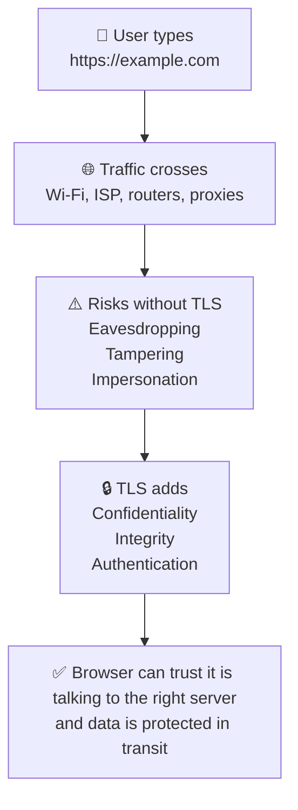
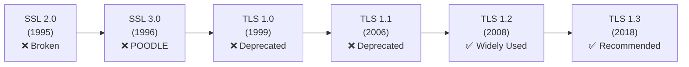
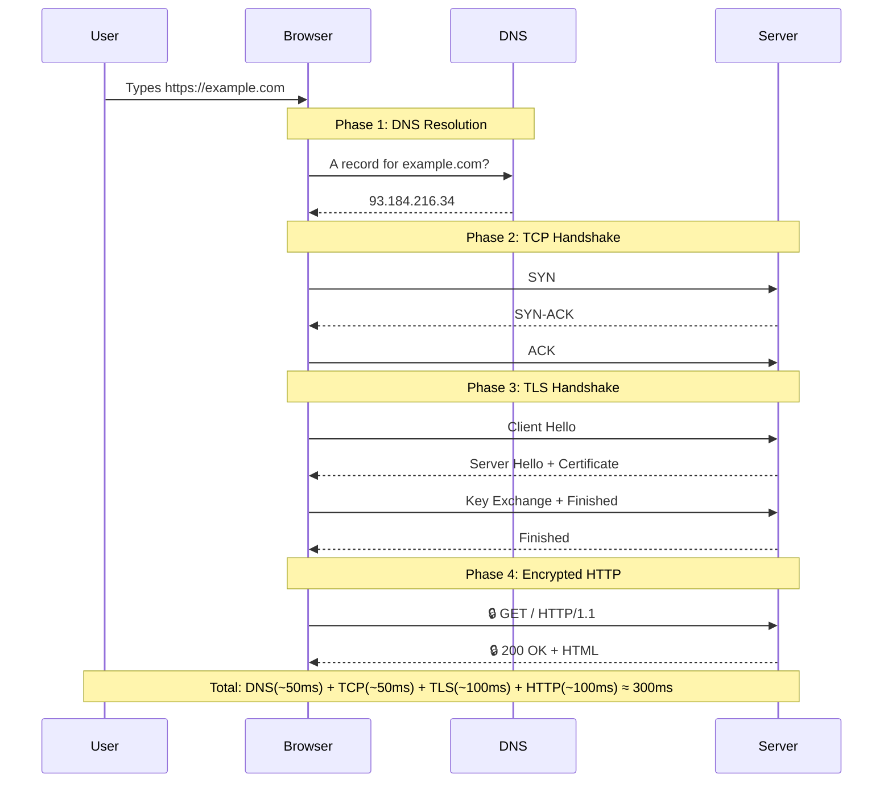
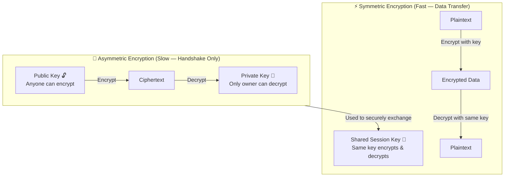
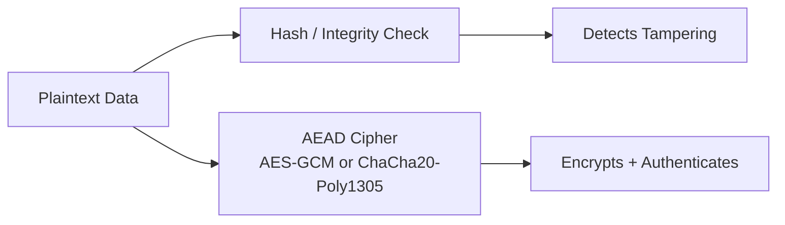
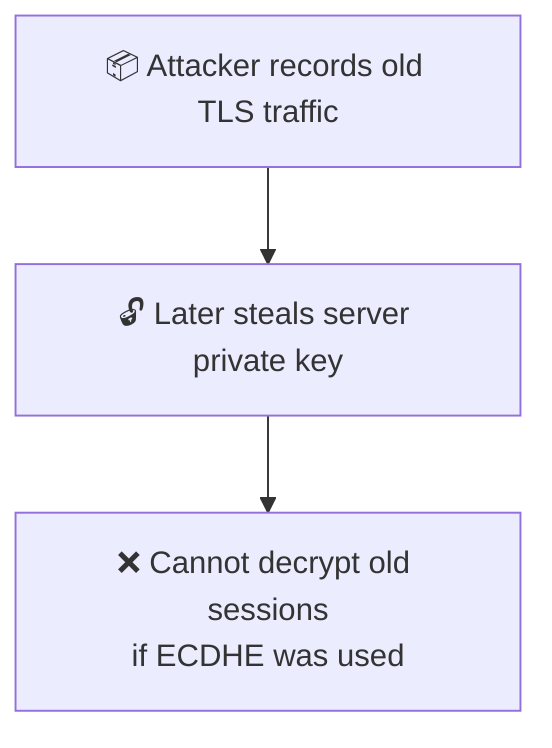
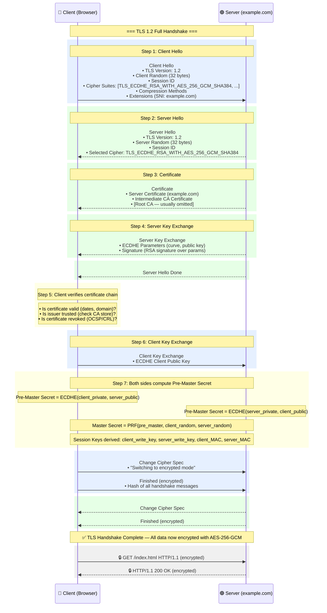
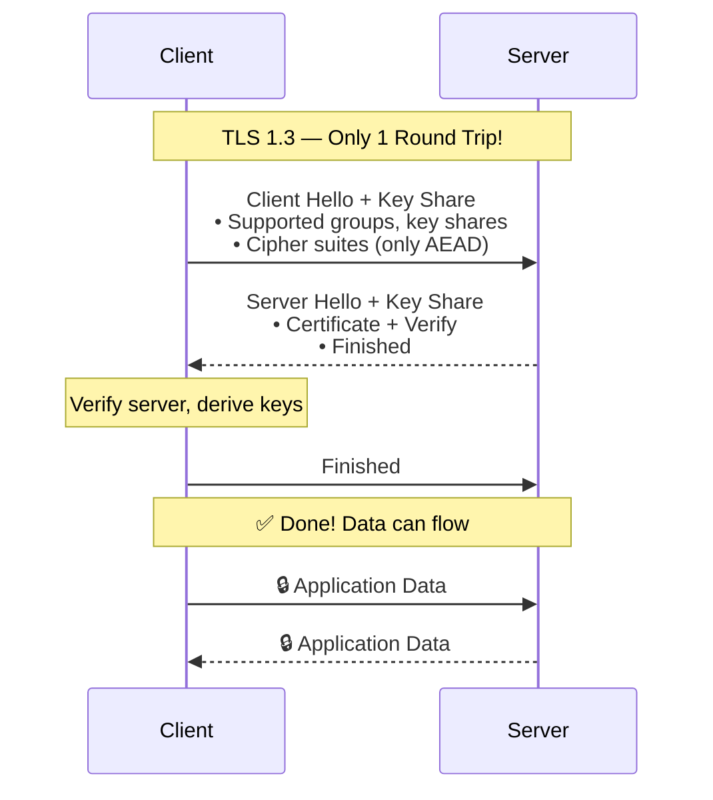
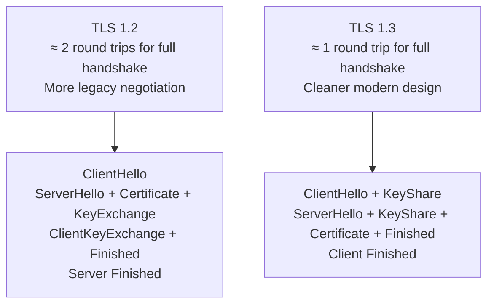
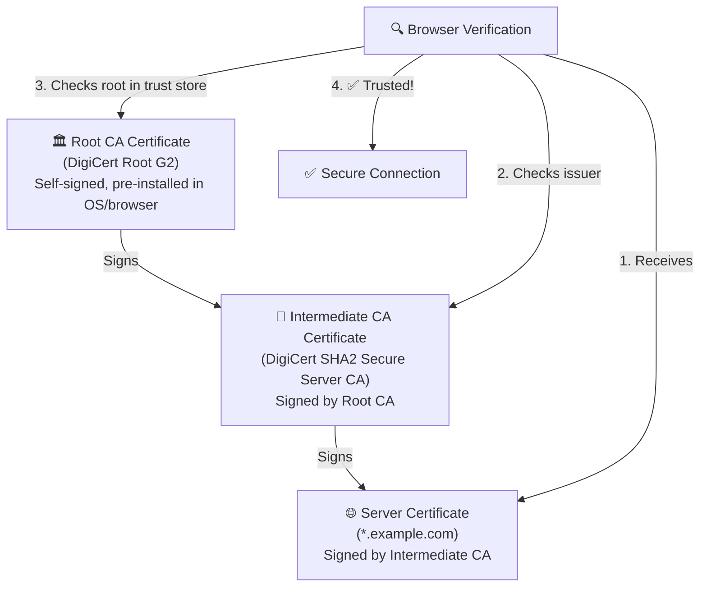

# TLS Fundamentals

← Back to [04-ssl-tls.md](./04-ssl-tls.md)

Why TLS exists, how HTTPS works, the TLS 1.2/1.3 handshake, and certificate trust basics.

---

## 1. Why SSL/TLS Exists



SSL/TLS exists to solve three core problems on untrusted networks:

- Confidentiality: outsiders should not be able to read sensitive data such as passwords, cookies, tokens, or payment details.
- Integrity: outsiders should not be able to silently modify traffic in transit.
- Authentication: the client should be able to verify that it is actually talking to the intended server and not an impostor.

### 1.1 What TLS does not do

- It does not make an insecure application secure by itself.
- It does not protect data once it reaches the server application.
- It does not stop phishing domains that look similar to the real domain.
- It does not guarantee that the server itself is honest or uncompromised.

### 1.2 The mental model

- TCP creates a reliable connection.
- TLS authenticates the server and establishes shared session keys.
- HTTP runs inside the encrypted TLS tunnel.
- After the handshake, symmetric encryption protects the bulk traffic because it is fast.

---

## 2. SSL/TLS History Timeline



### 2.1 Why the history matters

- Security protocols evolve because attackers keep finding weaknesses in old designs.
- Many configuration mistakes come from preserving old compatibility for too long.
- Modern TLS guidance is mostly about removing unsafe legacy behavior.

### 2.2 SSL 2.0 (1995)

- Had serious design flaws.
- Should never be enabled anywhere.
- Modern clients and servers do not support it.

### 2.3 SSL 3.0 (1996)

- Important historically, but obsolete.
- Known for the POODLE attack path.
- Must be disabled in any modern environment.

### 2.4 TLS 1.0 (1999)

- Successor to SSL.
- No longer acceptable for modern internet-facing services.
- Disabled by default in many modern stacks.

### 2.5 TLS 1.1 (2006)

- Incremental improvement over TLS 1.0.
- Still deprecated today.
- Usually removed to meet compliance baselines.

### 2.6 TLS 1.2 (2008)

- Long-time production standard.
- Supports strong cipher suites such as AES-GCM and ECDHE.
- Still broadly compatible with real-world clients.

### 2.7 TLS 1.3 (2018)

- Simplifies the protocol.
- Removes many dangerous legacy options.
- Reduces handshake latency and is the recommended default.

### 2.8 Recommended production baseline

- Allow TLS 1.2 and TLS 1.3.
- Prefer TLS 1.3 when both sides support it.
- Disable SSLv2, SSLv3, TLS 1.0, and TLS 1.1.
- Patch OpenSSL, nginx, Apache, HAProxy, load balancers, and operating systems regularly.

---

## 3. How HTTPS Works — Complete Browser to Server Flow

### 📸 HTTPS Connection

> *Source: Wikimedia Commons — HTTPS secure connection*



### 3.1 Phase 1: DNS resolution

- The browser needs an IP address before it can open a network connection.
- The browser may query the OS cache, browser cache, recursive resolver, and authoritative DNS servers.
- DNS answers can include A, AAAA, CNAME, and sometimes HTTPS/SVCB records in modern deployments.

### 3.2 Phase 2: TCP handshake

- TCP establishes a reliable byte stream using SYN, SYN-ACK, and ACK.
- Only after TCP is established can TLS messages be exchanged on port 443.
- Packet loss, firewall blocks, or overloaded load balancers can delay or prevent this phase.

### 3.3 Phase 3: TLS handshake

- The client and server agree on protocol parameters.
- The server proves its identity with a certificate chain.
- Both sides derive shared session keys.
- Finished messages confirm that the handshake transcript has not been tampered with.

### 3.4 Phase 4: encrypted HTTP

- Once keys exist, HTTP requests and responses are carried as TLS application data records.
- Anyone observing the network can still see metadata such as IPs, timing, and sometimes SNI in classic TLS, but not the plaintext HTTP body.
- The server application still sees the decrypted HTTP request after TLS terminates.

### 3.5 Practical commands

```bash
dig +short example.com
curl -Iv https://example.com
openssl s_client -connect example.com:443 -servername example.com
```

---

## 4. Cryptography Building Blocks Used by TLS



### 4.1 Why TLS mixes two cryptographic styles

- Asymmetric cryptography solves the identity and key-establishment problem.
- Symmetric cryptography solves the performance problem because it is much faster for large amounts of traffic.
- Modern TLS uses the handshake to derive short-lived symmetric session keys and then uses those keys for application data.

### 4.2 Symmetric encryption

- One shared secret key is used for both encryption and decryption.
- Examples inside TLS include AES-GCM and ChaCha20-Poly1305.
- This is the reason encrypted web traffic can still be fast at scale.

### 4.3 Asymmetric cryptography

- Public keys can be shared freely.
- Private keys must remain secret.
- Certificates bind identities such as hostnames to public keys.
- In modern TLS, the server certificate usually authenticates the handshake instead of directly encrypting all traffic.

### 📸 Public Key Cryptography

> *Source: Wikimedia Commons — Public key encryption concept*

### 📸 Diffie-Hellman Key Exchange

> *Source: Wikimedia Commons — Diffie-Hellman key exchange visualization*

### 4.4 Hashes, MACs, and AEAD



- Old TLS versions often described encryption and MAC separately.
- Modern TLS prefers AEAD ciphers because they provide encryption and integrity together.
- If integrity protection fails, the record is rejected instead of partially accepted.

### 4.5 Perfect Forward Secrecy



- Perfect Forward Secrecy means past traffic remains safe even if the server private key is stolen later.
- ECDHE provides this property because each session uses ephemeral keys.
- This is one reason modern TLS configurations prefer ECDHE and TLS 1.3.

---

## 5. TLS 1.2 Handshake — Detailed Step by Step

### 📸 TLS 1.2 Handshake

> *Source: Wikimedia Commons — Full TLS 1.2 handshake sequence*



### 5.1 Before the first byte of the handshake

- TCP must already be established.
- The client must know the hostname it is connecting to.
- The server must have access to a private key and matching certificate chain.
- Both sides need at least one compatible protocol version and cipher suite.

### 5.2 Step 1: Client Hello

#### What is being sent and why

- The client sends the highest TLS version it supports for the handshake context.
- The client random is a fresh 32-byte random value used later in key derivation.
- The cipher suite list tells the server which combinations of key exchange, authentication, and encryption the client can use.
- Extensions include SNI so the server knows which hostname certificate to present on multi-tenant infrastructure.
- Extensions may also include ALPN so the client can negotiate HTTP/2 or HTTP/1.1.
- In many environments the Client Hello is the first place where you can see compatibility problems.

#### What happens if this step fails

- If the server finds no overlapping TLS version or cipher suite, the handshake stops immediately.
- If SNI is missing or wrong, the server may present the wrong certificate.
- If the message is malformed, the server usually sends an alert and closes the connection.

#### How an attacker could try to exploit this stage

- A downgrade attacker may try to force weaker protocol versions or weaker ciphers.
- Passive observers can often see SNI in classic TLS, which leaks the requested hostname even though HTTP data stays encrypted.
- Fingerprinting systems can identify client software by the exact ordering of ciphers and extensions.

#### Practical commands and observation points

- `openssl s_client -connect example.com:443 -servername example.com -tls1_2`
- `curl -Iv --tlsv1.2 https://example.com`

### 5.3 Step 2: Server Hello

#### What is being sent and why

- The server selects the actual TLS version for this connection.
- The server random contributes entropy to the later key derivation process.
- The server chooses one cipher suite from the client list that it supports and is willing to use.
- The selected session ID can be used in some resumption models.
- The server response is the first sign of the server policy in action.

#### What happens if this step fails

- If the server chooses a version or cipher the client did not offer, the client will reject the handshake.
- If no overlap exists, the server sends a handshake failure alert.
- If the server sends inconsistent extension values, modern clients abort.

#### How an attacker could try to exploit this stage

- A downgrade attack tries to influence the negotiated version or cipher.
- Weak server policy can keep old, unsafe suites enabled for legacy reasons.
- Middleboxes that tamper with the hello messages can break negotiation.

#### Practical commands and observation points

- `openssl s_client -connect example.com:443 -servername example.com -cipher ECDHE-RSA-AES256-GCM-SHA384`
- `nmap --script ssl-enum-ciphers -p 443 example.com`

### 5.4 Step 3: Certificate

#### What is being sent and why

- The server sends its leaf certificate and usually one or more intermediate certificates.
- The leaf certificate contains the subject public key and names in the Subject Alternative Name extension.
- The root CA is usually omitted because the client already has trusted roots installed locally.
- The certificate proves identity only if the client trusts the issuing chain and the hostname matches.

#### What happens if this step fails

- If the hostname does not match, the browser shows a certificate warning or blocks the connection.
- If the certificate is expired or not yet valid, validation fails.
- If the intermediate chain is missing, some clients cannot build trust and the handshake fails.

#### How an attacker could try to exploit this stage

- A MITM attacker can present a fake certificate, but the browser should reject it if the chain is not trusted.
- A stolen but still-valid certificate can be abused until it expires or is revoked.
- Misissued certificates are one reason Certificate Transparency logs matter.

#### Practical commands and observation points

- `openssl s_client -connect example.com:443 -servername example.com -showcerts`
- `openssl x509 -in cert.pem -noout -text`

### 5.5 Step 4: Server Key Exchange

#### What is being sent and why

- For ECDHE suites, the server sends ephemeral key exchange parameters such as the curve and the server ephemeral public key.
- The server signs these parameters using the private key associated with the certificate.
- This binds the ephemeral key exchange to the authenticated server identity.
- This message is critical for Perfect Forward Secrecy.

#### What happens if this step fails

- If the signature does not verify, the client aborts because the key exchange cannot be trusted.
- If unsupported curves are used, the client may reject the handshake.
- Malformed parameters also cause alerts and immediate termination.

#### How an attacker could try to exploit this stage

- A MITM attacker would love to substitute different ECDHE parameters, but the server signature is designed to stop that.
- Weak curve choices or buggy implementations can create cryptographic risk.
- Implementation bugs in curve handling have historically caused serious vulnerabilities.

#### Practical commands and observation points

- `openssl s_client -connect example.com:443 -servername example.com -msg`
- `openssl ecparam -list_curves | head`

### 5.6 Step 5: Client verifies certificate chain

#### What is being sent and why

- No network message is required for the core verification logic; the client performs local validation.
- The client checks the current time against certificate validity dates.
- The client checks the requested hostname against SAN entries.
- The client builds a chain to a trusted root in the local trust store.
- The client may check revocation status using OCSP or CRL mechanisms.

#### What happens if this step fails

- Any failure usually produces a browser warning, a hard block in strict clients, or an API connection error.
- If the trust anchor is missing, enterprise or private PKI deployments fail until the root is installed.
- If revocation checks fail in strict environments, the connection may be rejected.

#### How an attacker could try to exploit this stage

- Attackers may try to rely on user click-through behavior when a browser shows a certificate warning.
- Compromised or rogue CAs can issue certificates that appear valid unless additional controls detect them.
- Private trust stores on corporate devices can intentionally intercept TLS for inspection, which changes the trust model.

#### Practical commands and observation points

- `openssl verify -CAfile chain.pem fullchain.pem`
- `security find-certificate -a -p /System/Library/Keychains/SystemRootCertificates.keychain | head`

### 5.7 Step 6: Client Key Exchange

#### What is being sent and why

- The client sends its ephemeral ECDHE public key to the server.
- The server combines the client public key with its ephemeral private key to derive the same shared secret.
- The client combines the server public key with its ephemeral private key to derive the same shared secret.
- The shared secret itself is never sent over the network.

#### What happens if this step fails

- If either side cannot process the peer public key, the handshake fails.
- If the implementation mishandles ephemeral keys, the derived secret will not match and the Finished step will fail.
- If the peer uses unsupported groups, negotiation aborts.

#### How an attacker could try to exploit this stage

- An attacker observing traffic only sees public keys, not the shared secret.
- Implementation vulnerabilities in elliptic curve math can break security even if the protocol design is sound.
- Weak randomness during ephemeral key generation can catastrophically undermine the session.

#### Practical commands and observation points

- `openssl rand -hex 32`
- `openssl s_client -connect example.com:443 -servername example.com -state`

### 5.8 Step 7: Both sides compute the pre-master secret and session keys

#### What is being sent and why

- Using the ECDHE shared secret plus the client and server random values, both peers derive the master secret.
- From the master secret they derive symmetric encryption keys, IVs, and record-protection material.
- At this point, both sides know they should have the same keying material if everything so far is valid.

#### What happens if this step fails

- If the derived values differ, the Finished verification fails.
- If either side uses incorrect transcript data or randoms, the session cannot continue.
- A mismatch here usually looks like an encrypted handshake failure or decrypt error.

#### How an attacker could try to exploit this stage

- A passive attacker still cannot derive the keys without the ephemeral private keys.
- A broken pseudo-random function implementation can lead to interop failures or worse.
- Side-channel attacks may target key derivation or memory handling in weak implementations.

#### Practical commands and observation points

- `openssl s_client -connect example.com:443 -servername example.com -debug`
- `sslyze --regular example.com:443`

### 5.9 Step 8: Change Cipher Spec and Finished from client

#### What is being sent and why

- The client signals that future records will be protected with the newly derived keys.
- The client sends an encrypted Finished message containing a hash over the handshake transcript.
- This proves the client derived the same keys and saw the same handshake messages.

#### What happens if this step fails

- If the server cannot decrypt or validate the Finished message, it closes the connection.
- Any tampering with earlier handshake messages is detected here.
- A bad transcript hash usually means key mismatch or active interference.

#### How an attacker could try to exploit this stage

- Active attackers hate the Finished message because it detects transcript manipulation.
- Downgrade or tampering attempts often become visible at this point.
- Implementation flaws around state transitions have historically caused bugs.

#### Practical commands and observation points

- `openssl s_client -connect example.com:443 -servername example.com -msg -state`

### 5.10 Step 9: Change Cipher Spec and Finished from server

#### What is being sent and why

- The server now switches its outbound records to encrypted mode.
- The server sends its own encrypted Finished message.
- Once the client verifies it, both sides know the handshake completed successfully.

#### What happens if this step fails

- If the client cannot validate the server Finished message, the connection is aborted.
- This often indicates a problem in key derivation, transcript handling, or packet corruption.
- No application data is trusted until this check succeeds.

#### How an attacker could try to exploit this stage

- MITM attempts that alter the handshake are exposed here because the transcript hashes no longer match.
- Broken middleboxes sometimes cause weird encrypted alert failures that appear only after this stage.
- State-machine implementation bugs have been a recurring source of TLS vulnerabilities.

#### Practical commands and observation points

- `tcpdump -i any port 443`
- `wireshark`

### 5.11 Step 10: Encrypted application data

#### What is being sent and why

- The browser can finally send `GET /` or any other HTTP request as encrypted application data.
- Cookies, authorization headers, HTML, JSON, and API payloads are now carried inside TLS records.
- At this point the expensive asymmetric part is done and the fast symmetric part takes over.

#### What happens if this step fails

- If later record decryption fails, the connection is closed and the request is lost.
- Large transfers may still fail due to network issues, timeouts, or application-level errors.
- TLS success does not guarantee application success; the server can still return HTTP 500.

#### How an attacker could try to exploit this stage

- Attackers can still observe metadata such as packet sizes, timing, and IP addresses.
- If the endpoint itself is compromised, encrypted transport no longer helps.
- Session cookies remain valuable targets, so secure cookie settings still matter.

#### Practical commands and observation points

- `curl --http1.1 -Iv https://example.com`
- `curl --http2 -Iv https://example.com`

### 5.12 Why TLS 1.2 was a big improvement

- It brought broad support for modern authenticated encryption modes such as AES-GCM.
- It enabled robust deployments with ECDHE for forward secrecy.
- It became the default security baseline for internet services for many years.

### 5.13 Why TLS 1.2 is still not the end of the story

- TLS 1.2 still contains legacy negotiation complexity.
- Server operators still have to think carefully about ciphers and old clients.
- TLS 1.3 simplified many of these choices and removed unsafe options.

---

## 6. TLS 1.3 Handshake — Faster (1-RTT)

### 📸 TLS 1.3 Handshake (Faster)

> *Source: Wikimedia Commons — TLS 1.3 reduced round-trip handshake*



### 6.1 What changed in TLS 1.3

- The protocol removes many legacy handshake choices that made TLS 1.2 harder to configure safely.
- Key exchange happens earlier because the client sends key shares immediately.
- The handshake usually completes in one round trip for a fresh connection.
- Only modern cipher constructions are allowed.

### 6.2 TLS 1.3 message flow

- Client Hello already contains a key share, which saves a round trip.
- The server replies with its own key share, certificate, CertificateVerify, and Finished.
- The client verifies everything, derives traffic secrets, and sends Finished.
- Application data can begin immediately after.

### 6.3 Why TLS 1.3 is faster

- Fewer message exchanges reduce latency on high-round-trip networks.
- The removal of fragile legacy features simplifies implementations.
- Session resumption can also become faster and more efficient.

### 6.4 Practical commands

```bash
openssl s_client -connect example.com:443 -servername example.com -tls1_3
curl --tlsv1.3 -Iv https://example.com
```

### 6.5 0-RTT warning

- TLS 1.3 supports optional 0-RTT data for resumed sessions, but it is replayable.
- Do not use 0-RTT for non-idempotent actions like payments or state-changing POST requests unless you fully understand the replay risks.
- Many applications safely restrict 0-RTT usage or disable it entirely.

---

## 7. TLS 1.2 vs TLS 1.3 — Visual Comparison



### 7.1 Side-by-side table

| Area | TLS 1.2 | TLS 1.3 |
|---|---|---|
| Round trips | Typically more | Typically fewer |
| Cipher handling | More legacy complexity | Simpler and safer defaults |
| Forward secrecy | Strong when ECDHE is used | Core expectation |
| Performance | Good | Better handshake latency |
| Misconfiguration risk | Higher | Lower |
| Legacy compatibility | Broader | Slightly narrower, but modern |

### 7.2 Operational takeaway

- Keep TLS 1.2 enabled for compatibility if needed.
- Prefer TLS 1.3 where supported.
- Avoid hand-tuning obscure cipher lists unless you have a measured reason.

---

## 8. Certificate Chain of Trust — Visual

### 📸 Certificate Chain of Trust

> *Source: Wikimedia Commons — X.509 certificate chain of trust*



### 8.1 What a chain really means

- The browser trusts a small set of root CAs already installed in its trust store.
- Root CAs usually sign intermediate CAs, and intermediates sign server certificates.
- Servers normally send the leaf certificate and intermediate certificates, but not the root.
- Clients build a path from the leaf to a trusted root.

### 8.2 Why intermediates exist

- They reduce exposure because root keys can stay offline most of the time.
- They let CAs delegate issuance responsibilities safely.
- They make large PKI ecosystems easier to manage and rotate.

### 8.3 Validation checklist used by browsers

- Does the hostname match a SAN entry?
- Is the certificate within its validity dates?
- Is the signature chain intact from leaf to trusted root?
- Is the key usage appropriate for server authentication?
- Is revocation status acceptable?
- Is the certificate free from policy or algorithm problems?

### 8.4 Common chain mistakes

- Serving only the leaf certificate instead of the full chain.
- Using the wrong intermediate for the certificate.
- Installing a certificate whose SAN does not include the requested hostname.
- Forgetting to reload the web server after replacing certificate files.

### 8.5 Commands

```bash
openssl s_client -connect example.com:443 -servername example.com -showcerts
openssl verify -CAfile chain.pem fullchain.pem
```

---
