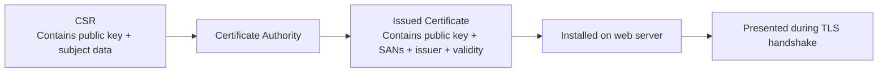
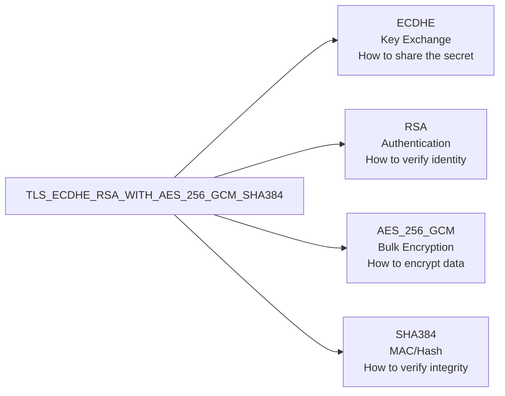
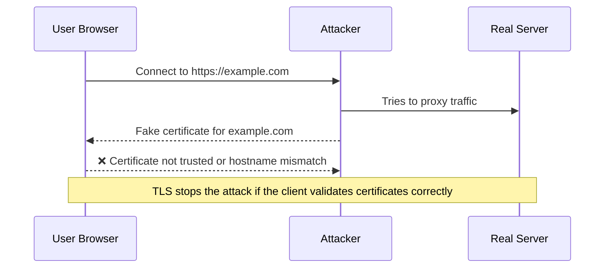
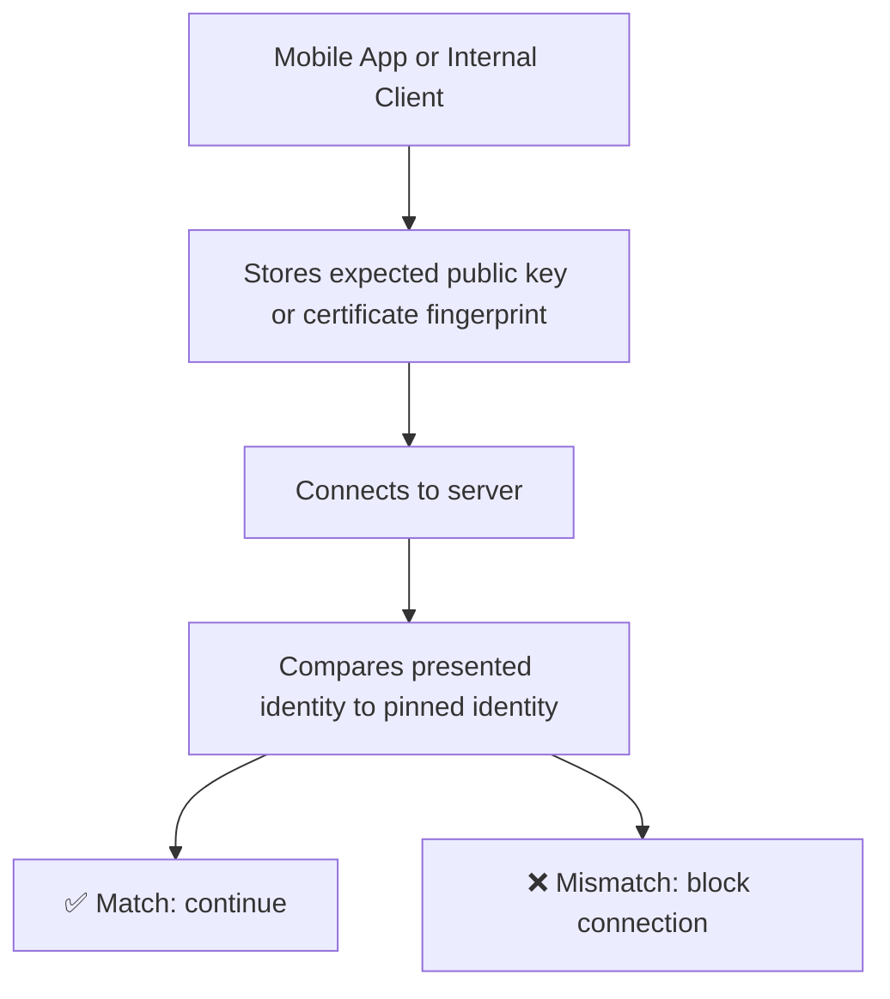
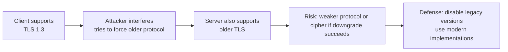
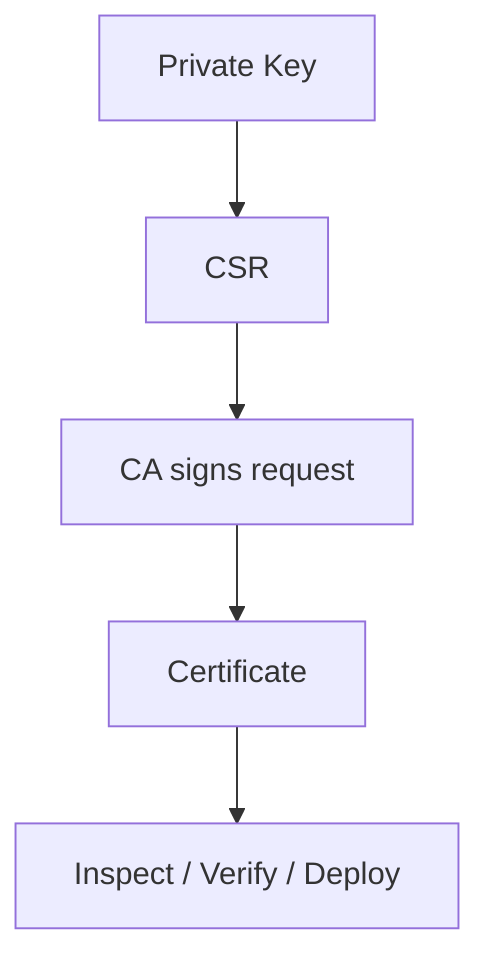
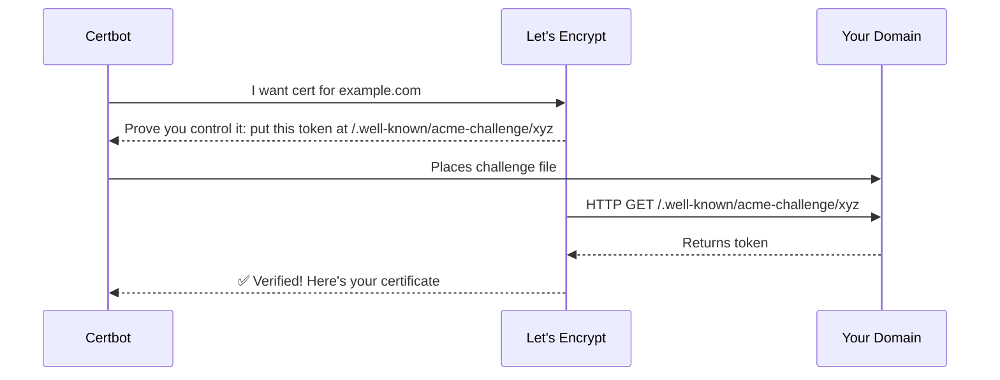

# Certificate Management

← Back to [04-ssl-tls.md](./04-ssl-tls.md)

Certificate structure, CSRs, OpenSSL commands, ACME, and renewal operations.

---

## 9. Certificates, Identities, and Validation Rules



### 9.1 What is inside a certificate

- Subject public key.
- Subject Alternative Names (SANs).
- Issuer information.
- Validity dates.
- Signature by the issuing CA.
- Extensions such as key usage and extended key usage.

### 9.2 Common certificate types

| Type | Meaning | Typical use |
|---|---|---|
| Self-signed | Signed by itself | Local dev, internal experiments |
| DV | Domain Validation | Standard public websites and APIs |
| OV | Organization Validation | Some businesses wanting extra identity checks |
| EV | Extended Validation | Specialized cases; not visually special in most browsers now |
| Wildcard | Covers `*.example.com` | Many subdomains under one zone |
| SAN / Multi-domain | Covers several specific names | Multi-host applications |

### 9.3 SAN beats Common Name

- Modern clients validate hostnames primarily using the Subject Alternative Name extension.
- Relying on the Common Name alone is obsolete.
- If the SAN is wrong, the connection fails even if the Common Name looks right.

### 9.4 CSR generation examples

```bash
openssl genrsa -out example.com.key 4096
openssl req -new -key example.com.key -out example.com.csr

openssl ecparam -name prime256v1 -genkey -noout -out example.com-ecdsa.key
openssl req -new -key example.com-ecdsa.key -out example.com-ecdsa.csr
```

### 9.5 CSR inspection

```bash
openssl req -in example.com.csr -noout -text
```

### 9.6 Self-signed certificate example

```bash
openssl req -x509 -nodes -days 365 -newkey rsa:2048 \
  -keyout selfsigned.key \
  -out selfsigned.crt
```

### 9.7 When self-signed is okay

- Local development.
- Internal labs where your own CA is trusted.
- Temporary testing where browser warnings are acceptable.

### 9.8 When self-signed is not okay

- Public production websites.
- Consumer-facing mobile apps without private trust bootstrapping.
- Partner integrations that expect public CA trust.

---

## 10. Cipher Suite Breakdown



### 10.1 Reading the name from left to right

- ECDHE: ephemeral elliptic-curve Diffie-Hellman for key exchange and forward secrecy.
- RSA: the server certificate uses RSA for authentication and signatures.
- AES_256_GCM: AES with a 256-bit key in GCM mode protects the application data.
- SHA384: hash function associated with parts of the suite definition in TLS 1.2.

### 10.2 Important note for TLS 1.3

- TLS 1.3 changed cipher naming and removed some of the old suite complexity.
- Key exchange and certificate authentication are negotiated more cleanly instead of being baked into one long suite name.
- That is why TLS 1.3 configuration usually feels simpler.

### 10.3 Recommended mindset

- Prefer modern defaults from maintained servers and libraries.
- Avoid enabling weak suites for compatibility unless you have a very specific requirement.
- Regularly test with SSL Labs, sslyze, or nmap cipher enumeration.

---

## 11. Common TLS Attacks — Visual

### 11.1 MITM attack and how TLS blocks it



TLS prevents a basic man-in-the-middle attack because the attacker usually cannot present a certificate chain trusted for the real hostname.

#### What defeats this defense

- Users clicking through certificate warnings.
- Compromised trust stores or rogue enterprise roots.
- Misissued certificates from compromised or abusive CAs.
- Endpoint compromise rather than network compromise.

### 11.2 Certificate pinning



Pinning means the client expects a very specific certificate or public key, not just any public CA-issued certificate for the hostname.

#### Pros

- Reduces reliance on the entire public CA ecosystem.
- Can be useful in tightly controlled internal environments.
- Makes MITM much harder when the attacker only has CA-based trust tricks.

#### Cons

- Operationally risky because certificate rotation can brick clients if the pin is outdated.
- Public HPKP was effectively abandoned because it created too much recovery risk.
- Modern practice favors Certificate Transparency monitoring and good PKI hygiene instead of browser-level HPKP.

### 11.3 Downgrade attacks



A downgrade attack tries to push the connection onto an older, weaker protocol version or weaker cipher suite.

#### Defenses

- Disable SSLv3, TLS 1.0, and TLS 1.1.
- Use up-to-date TLS libraries that implement downgrade protections correctly.
- Prefer TLS 1.3 and strong TLS 1.2 suites only.

### 11.4 Other attack themes worth knowing

- Protocol downgrade attempts.
- Certificate mis-issuance or trust store abuse.
- Weak random number generation.
- Implementation bugs such as Heartbleed-style memory issues.
- Application-layer token theft even after transport encryption succeeds.
- Replay risk with 0-RTT in TLS 1.3.
- Traffic analysis based on size and timing even when content is encrypted.

---

## 12. Certificate Management Commands — OpenSSL Reference



This section is intentionally command-heavy so it can be used as a field reference.

### 12.1 Generate an RSA private key

```bash
openssl genrsa -out server.key 4096
```
Use RSA when broad compatibility matters most.
Restrict permissions on the private key immediately after creation.

### 12.2 Generate an ECDSA private key

```bash
openssl ecparam -name prime256v1 -genkey -noout -out server-ecdsa.key
```
ECDSA uses smaller keys and can be efficient.
Compatibility with extremely old clients may be weaker than RSA.

### 12.3 Generate a CSR

```bash
openssl req -new -key server.key -out server.csr
```
The CSR includes the public key and subject information.
The private key never leaves the server during CSR generation.

### 12.4 Generate a CSR with SAN via config file

```bash
openssl req -new -key server.key -out server.csr -config openssl-san.cnf
```
Use this when you need explicit SAN values in the request.
Always inspect the CSR before submitting it.

### 12.5 Inspect a CSR

```bash
openssl req -in server.csr -noout -text
```
Confirm SAN, subject, and public key details.
This catches mistakes before issuance.

### 12.6 Create a self-signed certificate

```bash
openssl req -x509 -nodes -days 365 -newkey rsa:2048 -keyout selfsigned.key -out selfsigned.crt
```
Useful for labs and quick internal testing.
Do not use for public production internet services.

### 12.7 View certificate details

```bash
openssl x509 -in fullchain.pem -noout -text
openssl x509 -in fullchain.pem -noout -issuer -subject -dates
```
Inspect validity, issuer, SANs, and key usage.
Great first step in any certificate investigation.

### 12.8 View only certificate fingerprint

```bash
openssl x509 -in fullchain.pem -noout -fingerprint -sha256
```
Useful for manual verification and pinning workflows.
Be careful not to confuse SHA-1 and SHA-256 fingerprints.

### 12.9 Verify a certificate chain

```bash
openssl verify -CAfile chain.pem fullchain.pem
```
Verifies chain building using the supplied CA file.
If verification fails, inspect intermediates and hostname separately.

### 12.10 Test a remote TLS connection

```bash
openssl s_client -connect example.com:443 -servername example.com
```
Shows the negotiated protocol, cipher, and presented certificates.
Always include `-servername` for SNI-aware servers.

### 12.11 Show the full presented certificate chain

```bash
openssl s_client -connect example.com:443 -servername example.com -showcerts
```
This is one of the fastest ways to detect a missing intermediate.
Capture the output and inspect each certificate block carefully.

### 12.12 Force TLS 1.2 for testing

```bash
openssl s_client -connect example.com:443 -servername example.com -tls1_2
```
Useful when debugging legacy-client compatibility.
If this fails while TLS 1.3 works, the issue is likely TLS 1.2 policy or cipher overlap.

### 12.13 Force TLS 1.3 for testing

```bash
openssl s_client -connect example.com:443 -servername example.com -tls1_3
```
Confirms TLS 1.3 support on the target.
Helpful during hardening reviews.

### 12.14 Convert PEM to DER

```bash
openssl x509 -in server.crt -outform der -out server.der
```
Some tooling and platforms prefer DER.
PEM is Base64 text; DER is binary.

### 12.15 Convert DER to PEM

```bash
openssl x509 -inform der -in server.der -out server.pem
```
Useful when migrating files between systems.
PEM is usually easier to inspect manually.

### 12.16 Export a PKCS#12 bundle

```bash
openssl pkcs12 -export -out server.p12 -inkey server.key -in server.crt -certfile chain.pem
```
Common for Windows, Java, and appliance imports.
Protect the export password carefully.

### 12.17 Inspect a PKCS#12 bundle

```bash
openssl pkcs12 -info -in server.p12
```
Shows certificates and key material contained in the bundle.
Do this before importing into production systems.

### 12.18 Match a private key to a certificate

```bash
openssl x509 -noout -modulus -in server.crt | openssl md5
openssl rsa -noout -modulus -in server.key | openssl md5
```
The digests should match for RSA material.
This catches one of the most common deployment mistakes.

### 12.19 Check certificate expiration quickly

```bash
openssl x509 -in server.crt -noout -enddate
```
Ideal for scripts and monitoring probes.
Automate alerts well before expiry.

### 12.20 Curl and browser-adjacent checks

```bash
curl -Iv https://example.com
curl --tlsv1.2 -Iv https://example.com
curl --tlsv1.3 -Iv https://example.com
```

### 12.21 Troubleshooting tips for OpenSSL output

- Look for `Verify return code: 0 (ok)`.
- Confirm the negotiated protocol is TLSv1.2 or TLSv1.3.
- Confirm the cipher matches your policy.
- Inspect the certificate chain carefully when clients report trust errors.
- Always include `-servername` when checking name-based virtual hosts.

---

## 13. Let's Encrypt / Certbot — How ACME Protocol Works

### 📸 ACME Protocol (Let's Encrypt)

> *Source: Wikimedia Commons — Let's Encrypt*



### 13.1 What ACME is

- ACME is the automated protocol used by Let's Encrypt and many other CAs to issue certificates.
- Instead of manually emailing CSRs and downloading files, software can request, validate, issue, and renew automatically.
- Certbot is one of the most common ACME clients.

### 13.2 Typical issuance flow

- Generate an account key and order a certificate.
- Choose an authorization challenge such as HTTP-01 or DNS-01.
- Prove control over the requested domain.
- Receive the certificate and install it on the server.
- Renew automatically before expiry.

### 13.3 Challenge types

| Challenge | How it works | Best for |
|---|---|---|
| HTTP-01 | Serve a token under `/.well-known/acme-challenge/` on port 80 | Standard web servers |
| DNS-01 | Publish a TXT record under `_acme-challenge` | Wildcards and complex edge environments |
| TLS-ALPN-01 | Serve a validation response over TLS with ALPN | Specialized setups |

### 13.4 Certbot installation examples

```bash
sudo apt update
sudo apt install -y certbot python3-certbot-nginx python3-certbot-apache
```

### 13.5 Request a certificate for Nginx

```bash
sudo certbot --nginx -d example.com -d www.example.com
```

### 13.6 Request a certificate for Apache

```bash
sudo certbot --apache -d example.com -d www.example.com
```

### 13.7 Standalone mode

```bash
sudo certbot certonly --standalone -d example.com
```

### 13.8 Webroot mode

```bash
sudo certbot certonly --webroot -w /var/www/example.com/public -d example.com -d www.example.com
```

### 13.9 DNS challenge example

```bash
sudo certbot certonly --manual --preferred-challenges dns -d example.com -d *.example.com
```

### 13.10 Renewal testing

```bash
sudo certbot renew --dry-run
```

### 13.11 Important file locations

| Purpose | Path |
|---|---|
| Live certs | `/etc/letsencrypt/live/` |
| Archived certs | `/etc/letsencrypt/archive/` |
| Renewal configs | `/etc/letsencrypt/renewal/` |
| Logs | `/var/log/letsencrypt/` |

### 13.12 Operational tips

- Make sure port 80 is reachable for HTTP-01 unless you use DNS-01.
- For wildcard certificates, use DNS-01.
- Automate service reloads after successful renewals.
- Monitor certificate expiration anyway; automation can fail silently.

### 13.13 Deploy hook examples

```bash
sudo certbot renew --deploy-hook "systemctl reload nginx"
sudo certbot renew --deploy-hook "systemctl reload apache2"
```

---
