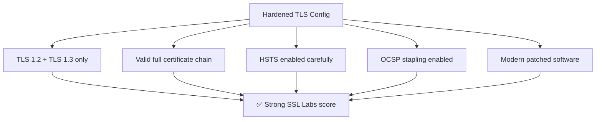
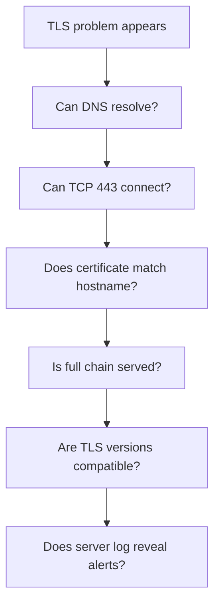
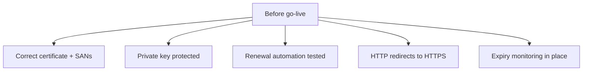

# TLS Server Configuration

← Back to [04-ssl-tls.md](./04-ssl-tls.md)

Practical web-server TLS configuration, hardening, troubleshooting, and deployment checks.

---

## 14. SSL Labs A+ Configuration



### 14.1 Example hardened Nginx server block

```nginx
server {
    listen 443 ssl http2;
    listen [::]:443 ssl http2;
    server_name example.com www.example.com;

    ssl_certificate     /etc/letsencrypt/live/example.com/fullchain.pem;
    ssl_certificate_key /etc/letsencrypt/live/example.com/privkey.pem;

    ssl_protocols TLSv1.2 TLSv1.3;
    ssl_session_timeout 1d;
    ssl_session_cache shared:SSL:50m;
    ssl_session_tickets off;
    ssl_prefer_server_ciphers off;

    ssl_stapling on;
    ssl_stapling_verify on;
    resolver 1.1.1.1 1.0.0.1 8.8.8.8 8.8.4.4 valid=300s ipv6=off;
    resolver_timeout 5s;

    add_header Strict-Transport-Security "max-age=31536000; includeSubDomains; preload" always;
    add_header X-Content-Type-Options "nosniff" always;
    add_header X-Frame-Options "SAMEORIGIN" always;
    add_header Referrer-Policy "strict-origin-when-cross-origin" always;

    location / {
        proxy_pass http://127.0.0.1:8080;
        proxy_set_header Host $host;
        proxy_set_header X-Forwarded-For $proxy_add_x_forwarded_for;
        proxy_set_header X-Forwarded-Proto https;
    }
}

server {
    listen 80;
    listen [::]:80;
    server_name example.com www.example.com;
    return 301 https://$host$request_uri;
}
```

### 14.2 Why each directive matters

- `ssl_protocols TLSv1.2 TLSv1.3;`: Disables obsolete protocols and keeps only modern versions.
- `ssl_session_tickets off;`: Avoids ticket-key rotation pitfalls unless you manage them centrally.
- `ssl_stapling on;`: Improves revocation checking behavior and performance.
- `Strict-Transport-Security`: Tells browsers to use HTTPS automatically in the future.
- `fullchain.pem`: Ensures the intermediate chain is presented correctly.
- `resolver`: Allows nginx to resolve OCSP responder and upstream names reliably.

### 14.3 Test commands

```bash
sudo nginx -t
sudo systemctl reload nginx
curl -Iv https://example.com
openssl s_client -connect example.com:443 -servername example.com
```

### 14.4 Important caveat

A high SSL Labs score is useful, but the real goal is a safe and reliable production system with working renewals, accurate monitoring, and no client-breaking surprises.

---

## 18. Troubleshooting Playbook



### 18.1 First-response commands

```bash
dig +short example.com
nc -vz example.com 443
curl -Iv https://example.com
openssl s_client -connect example.com:443 -servername example.com -showcerts
sudo nginx -t
sudo apachectl configtest
```

### 18.2 Troubleshooting case 1

- Symptom: Browser says the certificate is not valid for this host
- Likely cause: The SAN list does not include the requested hostname, or SNI is routing to the wrong virtual host.
- First action: Check the SAN field with `openssl x509 -in cert.pem -noout -text` and test with `openssl s_client -servername host`.

### 18.3 Troubleshooting case 2

- Symptom: Some clients work but others fail
- Likely cause: The server may be missing an intermediate certificate or relying on client-side caching.
- First action: Serve `fullchain.pem` and retest from a clean environment.

### 18.4 Troubleshooting case 3

- Symptom: Only very old clients fail
- Likely cause: You may have disabled legacy protocols or ciphers they require.
- First action: Decide whether compatibility or security matters more; do not weaken production blindly.

### 18.5 Troubleshooting case 4

- Symptom: Handshake times out
- Likely cause: Firewall rules, load balancer issues, or packet inspection devices may be blocking or delaying traffic.
- First action: Verify TCP reachability and inspect edge device logs.

### 18.6 Troubleshooting case 5

- Symptom: Curl reports certificate problem
- Likely cause: Chain trust, hostname mismatch, or local CA trust issues are likely.
- First action: Use verbose curl and `openssl s_client` to separate hostname problems from trust problems.

### 18.7 Troubleshooting case 6

- Symptom: Renewal succeeded but users still see the old certificate
- Likely cause: The web server was not reloaded after renewal.
- First action: Add and test a Certbot deploy hook.

### 18.8 Troubleshooting case 7

- Symptom: OCSP stapling warning appears
- Likely cause: Resolver config or outbound access to the CA responder may be broken.
- First action: Check resolver settings and confirm the server can reach the OCSP responder.

### 18.9 Troubleshooting case 8

- Symptom: mTLS client is rejected
- Likely cause: The server does not trust the client CA or the client certificate is missing proper EKU.
- First action: Check server trust config and inspect the client certificate text output.

### 18.10 Troubleshooting case 9

- Symptom: HTTP works but HTTPS does not
- Likely cause: Port 443 listener or certificate configuration is broken.
- First action: Verify listeners, server blocks, and certificate file paths.

### 18.11 Troubleshooting case 10

- Symptom: SSL Labs score dropped unexpectedly
- Likely cause: A chain, protocol, HSTS, or patching regression likely occurred.
- First action: Compare current scanner output to the last known good configuration.

### 18.12 Log locations and server-side clues

- nginx error log often reveals certificate file or OCSP issues.
- Apache error log can show handshake and client-cert validation failures.
- Load balancer logs are essential when TLS terminates before the web server.
- Application logs will not help if the handshake fails before HTTP starts.

### 18.13 Wireshark usage tip

- Capture the handshake and follow the TLS record flow.
- Verify message order and alert timing.
- If you control the client and have session secrets, some troubleshooting workflows can decrypt captures for inspection.

---

## 19. Practical Deployment Checklists



### 19.1 Pre-deployment checklist

- DNS points to the correct edge host.
- Certificate SAN includes every required hostname.
- Private key permissions are restricted.
- Server is configured to serve the full chain.
- TLS 1.2 and TLS 1.3 are enabled.
- Legacy protocols are disabled.
- HTTP redirects to HTTPS as intended.

### 19.2 Post-deployment checklist

- External `curl -Iv` succeeds.
- External `openssl s_client` shows the right certificate.
- Browser padlock appears without warning.
- OCSP stapling works if enabled.
- HSTS header appears if intended.
- Monitoring confirms the new certificate expiry date.

### 19.3 Renewal checklist

- Dry-run renewal succeeds.
- Deploy hook reloads the service cleanly.
- Service continues serving valid certificates after reload.
- Monitoring threshold gives enough warning before expiry.
- On-call instructions exist for manual recovery.

### 19.4 Security checklist

- No plaintext admin endpoints remain exposed.
- Secrets are not stored in certificate deployment scripts.
- CT monitoring is configured.
- Ticket-key handling is understood if session tickets are enabled.
- Private CA roots are documented if used internally.

---
