# mTLS and Advanced TLS Topics

← Back to [04-ssl-tls.md](./04-ssl-tls.md)

Mutual TLS, attacks, modern features, FAQ guidance, and advanced operational considerations.

---

## 11. Common TLS Attacks — Visual

### 11.1 MITM attack and how TLS blocks it

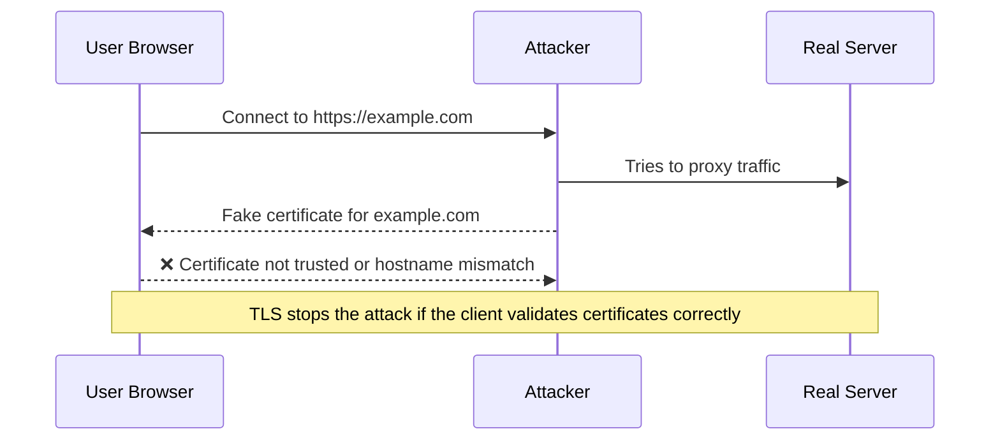

TLS prevents a basic man-in-the-middle attack because the attacker usually cannot present a certificate chain trusted for the real hostname.

#### What defeats this defense

- Users clicking through certificate warnings.
- Compromised trust stores or rogue enterprise roots.
- Misissued certificates from compromised or abusive CAs.
- Endpoint compromise rather than network compromise.

### 11.2 Certificate pinning

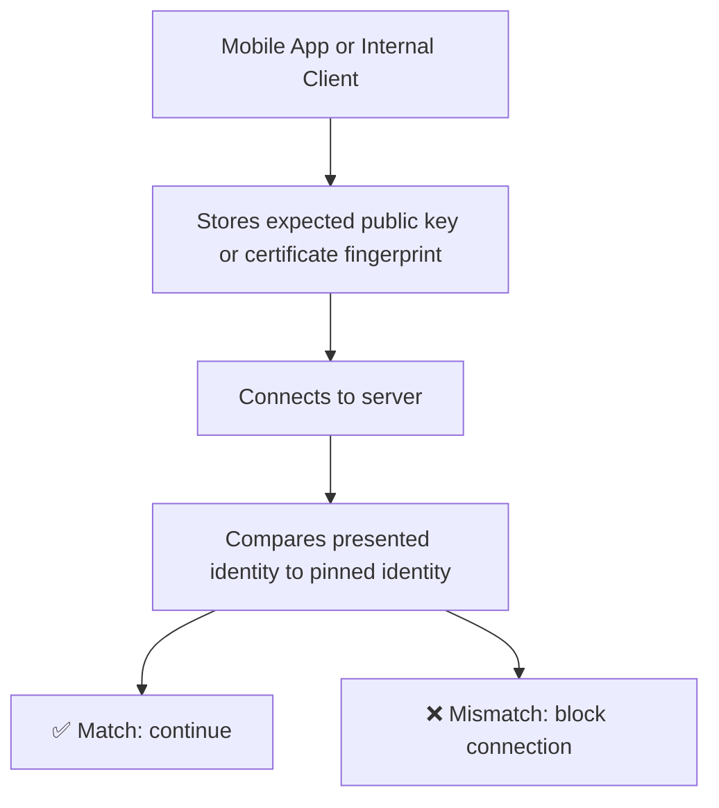

Pinning means the client expects a very specific certificate or public key, not just any public CA-issued certificate for the hostname.

#### Pros

- Reduces reliance on the entire public CA ecosystem.
- Can be useful in tightly controlled internal environments.
- Makes MITM much harder when the attacker only has CA-based trust tricks.

#### Cons

- Operationally risky because certificate rotation can brick clients if the pin is outdated.
- Public HPKP was effectively abandoned because it created too much recovery risk.
- Modern practice favors Certificate Transparency monitoring and good PKI hygiene instead of browser-level HPKP.

### 11.3 Downgrade attacks

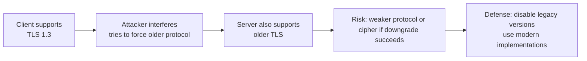

A downgrade attack tries to push the connection onto an older, weaker protocol version or weaker cipher suite.

#### Defenses

- Disable SSLv3, TLS 1.0, and TLS 1.1.
- Use up-to-date TLS libraries that implement downgrade protections correctly.
- Prefer TLS 1.3 and strong TLS 1.2 suites only.

### 11.4 Other attack themes worth knowing

- Protocol downgrade attempts.
- Certificate mis-issuance or trust store abuse.
- Weak random number generation.
- Implementation bugs such as Heartbleed-style memory issues.
- Application-layer token theft even after transport encryption succeeds.
- Replay risk with 0-RTT in TLS 1.3.
- Traffic analysis based on size and timing even when content is encrypted.

---

## 15. mTLS (Mutual TLS) — Visual

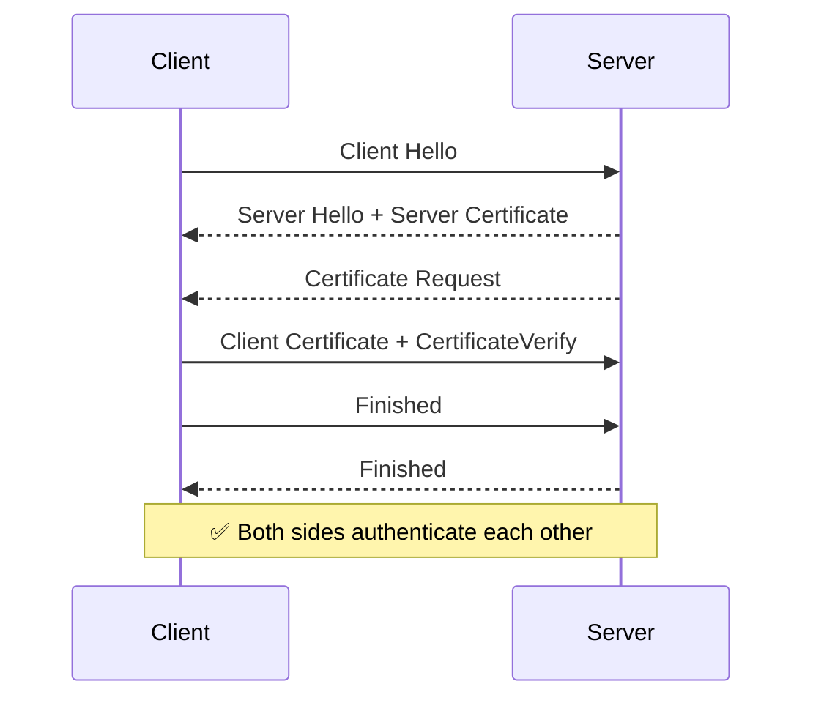

### 15.1 What mTLS adds

- Normal HTTPS authenticates the server to the client.
- mTLS also authenticates the client to the server using client certificates.
- This is common in internal APIs, service meshes, B2B integrations, and admin interfaces.

### 15.2 Benefits

- Strong machine identity without shared passwords.
- Useful for service-to-service authentication.
- Can work well with zero-trust network models.

### 15.3 Challenges

- Certificate issuance and rotation become more complex.
- Revocation and trust distribution must be planned carefully.
- Debugging failures is harder than simple bearer-token auth.

### 15.4 Nginx example

```nginx
ssl_client_certificate /etc/nginx/client-ca.crt;
ssl_verify_client on;
```

### 15.5 Apache example

```apache
SSLVerifyClient require
SSLVerifyDepth 2
SSLCACertificateFile /etc/apache2/client-ca.crt
```

### 15.6 Troubleshooting mTLS

- Confirm the client certificate chains to a CA trusted by the server.
- Check Extended Key Usage for client authentication.
- Inspect handshake logs because failures often happen before any HTTP request appears in app logs.

---

## 16. HSTS, OCSP Stapling, Certificate Transparency

### 16.1 HSTS

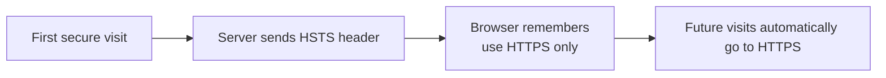

HSTS tells the browser to remember that a site must be contacted over HTTPS only.

#### Example header

```http
Strict-Transport-Security: max-age=31536000; includeSubDomains; preload
```

#### Why it helps

- Prevents protocol downgrade to HTTP after the browser has learned the policy.
- Protects against some forms of SSL stripping on future visits.
- Improves user safety for frequent visitors.

#### Risks

- Browsers cache the policy, so broken HTTPS can lock users out until fixed.
- Using `includeSubDomains` affects every subdomain.
- Using `preload` should be done only after careful validation.

### 16.2 OCSP Stapling

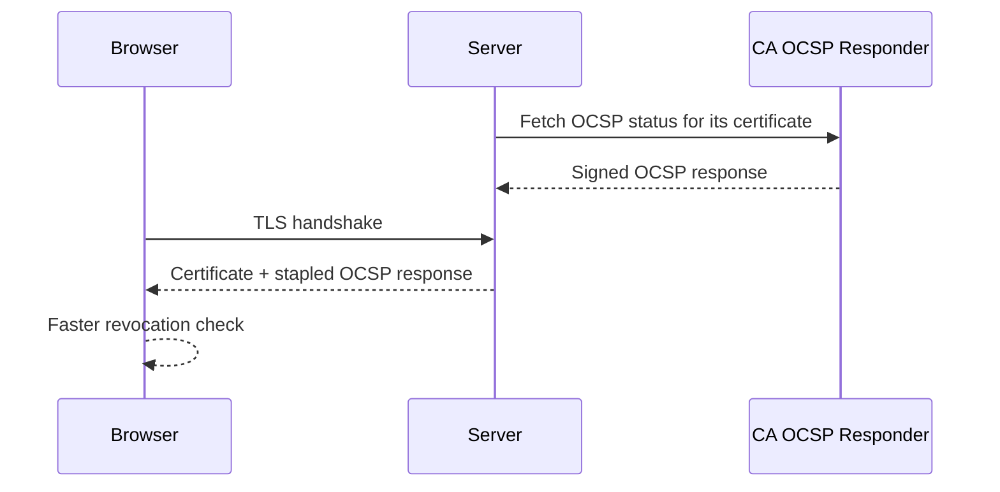

OCSP stapling lets the server attach proof of revocation status to the handshake so clients do not always have to query the CA directly.

#### Nginx example

```nginx
ssl_stapling on;
ssl_stapling_verify on;
resolver 1.1.1.1 8.8.8.8 valid=300s;
resolver_timeout 5s;
```

#### Apache example

```apache
SSLUseStapling On
SSLStaplingCache shmcb:/var/run/ocsp(128000)
```

### 16.3 Certificate Transparency

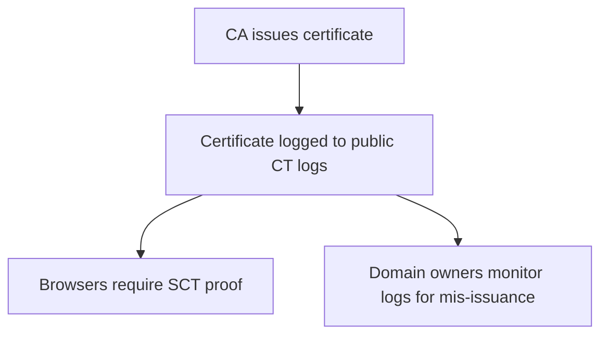

Certificate Transparency creates public append-only logs of issued certificates.

#### Why it matters

- It makes secret certificate mis-issuance much harder.
- Browsers can require proof that the certificate was logged.
- Security teams can monitor CT logs for unexpected certificates for their domains.

#### Monitoring tip

- Set alerts for newly issued certificates containing your domain or brand names.
- Investigate unexpected certificates quickly; they may indicate test environments, vendor activity, or something suspicious.

---

## 17. Performance Topics: Resumption, ALPN, HTTP/2, and 0-RTT

### 17.1 Session resumption

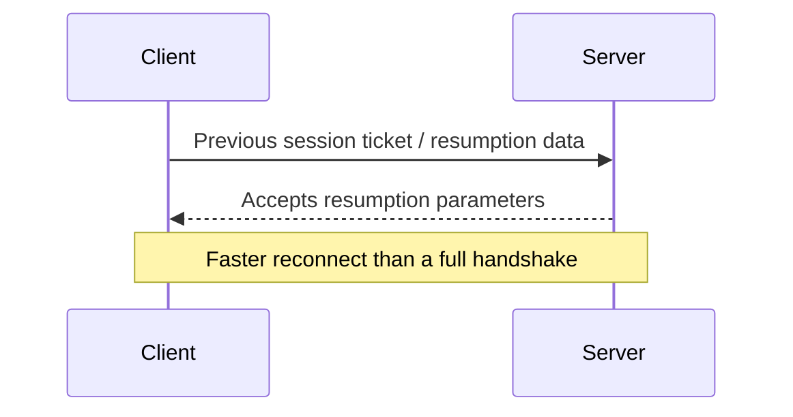

- Session resumption reduces handshake overhead for returning clients.
- Tickets must be managed carefully on load-balanced fleets.
- If ticket keys are mishandled, security or consistency problems can follow.

### 17.2 ALPN

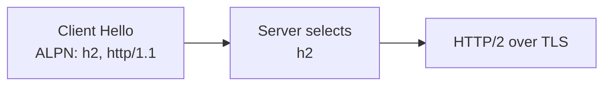

- ALPN lets client and server agree on the application protocol inside the TLS handshake.
- Without ALPN, protocol negotiation would be clumsier and slower.
- HTTP/2 selection via ALPN is standard on modern secure web stacks.

### 17.3 0-RTT in resumed TLS 1.3 sessions

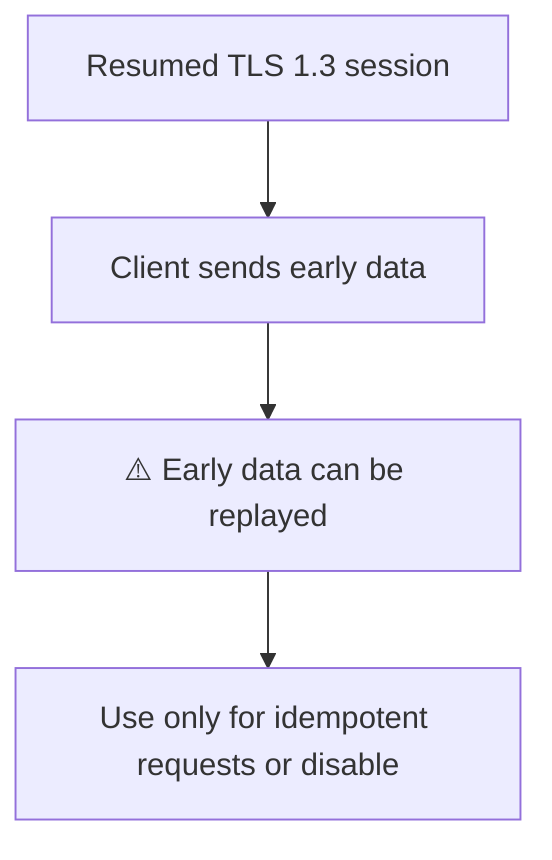

- 0-RTT can cut latency further for resumed sessions.
- The tradeoff is replay risk, so treat it with care.
- Use it only for requests that are safe to replay or disable it.

---

## 20. FAQ and Quick Answers

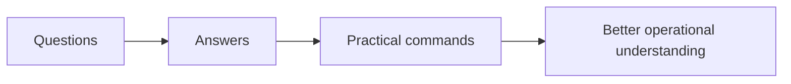

### 20.1 Is SSL the same as TLS?

People still say SSL in conversation, but modern secure deployments use TLS, not the old SSL protocols.

### 20.2 Why does everyone still say SSL certificate?

Because the term survived historically, even though the certificate is used by TLS today.

### 20.3 Why is the padlock not enough?

The padlock means transport security is present, not that the website itself is trustworthy or safe from application bugs.

### 20.4 What is the biggest reason for browser certificate warnings?

Hostname mismatch, expiration, and missing trust chain are the most common causes.

### 20.5 Why is SNI important?

It allows one IP and one port to host many TLS sites by telling the server which hostname the client wants.

### 20.6 What is ALPN?

It negotiates the application protocol such as HTTP/2 during the TLS handshake.

### 20.7 Why do we use fullchain.pem?

Because clients need the intermediate chain to validate trust correctly.

### 20.8 Why not just trust self-signed certificates everywhere?

Because public clients do not already trust them, and distributing trust manually is hard and risky at scale.

### 20.9 What is the difference between DV and EV?

DV proves domain control; EV adds organization vetting, but browsers do not emphasize EV visually like they used to.

### 20.10 Does TLS hide everything?

No. It protects content, but metadata such as IPs, timing, and some handshake information may still be visible.

### 20.11 Why does TLS switch to symmetric encryption?

Because symmetric encryption is far faster for carrying large volumes of application data.

### 20.12 What gives forward secrecy?

Ephemeral key exchange such as ECDHE.

### 20.13 Can a stolen private key decrypt old traffic?

Not if those old sessions used proper forward secrecy with ephemeral key exchange.

### 20.14 What is OCSP stapling in one sentence?

The server attaches revocation proof during the handshake to help clients validate faster.

### 20.15 What is HSTS in one sentence?

The server tells browsers to remember to use HTTPS only for future visits.

### 20.16 What is Certificate Transparency in one sentence?

It is a public logging system that makes certificate issuance visible and auditable.

### 20.17 Why do wildcard certificates not cover the apex domain?

Because `*.example.com` matches one label under the domain, not the bare `example.com` itself.

### 20.18 When should I use DNS-01?

When you need wildcard certificates or when HTTP-01 is hard to route through your edge.

### 20.19 Is TLS 1.2 still okay?

Yes, when properly configured, but TLS 1.3 is preferred where available.

### 20.20 What is the fastest way to inspect a live site?

Use `openssl s_client -connect host:443 -servername host -showcerts` and `curl -Iv https://host`.

### 20.21 Why do SSL Labs scores matter?

They provide a quick external view of your TLS posture, but they are not the whole story.

### 20.22 Can mTLS replace API tokens?

Sometimes, especially for machine-to-machine traffic, but operational complexity increases.

### 20.23 Why does TLS 1.3 feel easier to configure?

Because it removed a lot of legacy protocol baggage and unsafe options.

### 20.24 What is 0-RTT?

It is early data in resumed TLS 1.3 sessions, offering lower latency but replay risk.

### 20.25 What is the most common deployment mistake?

Serving the wrong certificate or incomplete chain, then forgetting to reload the service.

### 20.26 What file permissions should private keys have?

Restrictive ownership and permissions so only the service account or root can read them.

### 20.27 Why does curl need `-k` sometimes?

It disables certificate validation, which is useful only for testing and unsafe for real trust decisions.

### 20.28 Should I use RSA or ECDSA?

RSA offers broad compatibility; ECDSA is efficient and modern; many sites serve both depending on stack support.

### 20.29 Do I need OCSP stapling for every site?

It is recommended when supported, but it is one part of a larger TLS posture.

### 20.30 What if my site is behind a CDN?

The CDN may terminate TLS at the edge, so inspect both edge and origin certificate behavior.

### 20.31 What if I terminate TLS at a load balancer?

Then the load balancer owns the public certificate, and origin security becomes a separate design question.

### 20.32 Does HTTPS protect against XSS?

No. XSS is an application-layer vulnerability and must be addressed separately.

### 20.33 Does HTTPS protect against SQL injection?

No. TLS only protects data in transit.

### 20.34 How often should I scan my environment?

Continuously or at least as part of deployment, renewal, and routine security checks.

### 20.35 Can two servers share the same certificate?

Yes, if operationally necessary, but private key distribution risk increases.

### 20.36 Should I preload HSTS immediately?

No. First confirm every subdomain is HTTPS-ready and stable.

### 20.37 What if CT monitoring shows an unknown cert?

Investigate quickly; it may be legitimate issuance, shadow IT, or something malicious.

### 20.38 Why does the browser still show not secure on an HTTPS page?

Mixed content or application issues can still trigger warnings even when the page itself is loaded over HTTPS.

### 20.39 What is mixed content?

An HTTPS page loading HTTP resources such as scripts or images, which weakens page security.

### 20.40 Can internal services use a private CA?

Yes, and many organizations do, but trust distribution and rotation must be managed well.

### 20.41 Do browsers trust my internal CA automatically?

No, not unless that root is installed into the client trust store.

### 20.42 What is the shortest useful TLS checklist?

Right certificate, right hostname, right chain, modern protocol versions, tested renewal, monitored expiry.

### 20.43 Why do I care about session tickets?

They affect resumption behavior and require safe key management across servers.

### 20.44 What is a leaf certificate?

The end-entity certificate presented by the server for the hostname.

### 20.45 Why do some scanners mention weak cipher order?

Because bad ordering or legacy suites can increase downgrade or compatibility risk.

### 20.46 Should I hard-code giant cipher lists from old blog posts?

Usually no; modern defaults from current servers are safer than outdated copy-paste tuning.

### 20.47 What is the first thing to do after certificate renewal?

Verify the site actually serves the new certificate externally.

### 20.48 Why should I test from outside the host?

Because local checks can miss load balancer, CDN, DNS, or network-policy problems.

### 20.49 What matters most operationally?

Reliable automation, visibility, monitoring, and clear recovery procedures.

---
