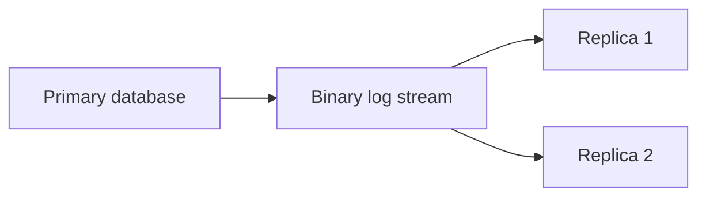

# Database Servers

## 7.1 Overview

Web stacks usually rely on databases for persistent data.

Focus here:

- MySQL/MariaDB
- PostgreSQL

## 7.2 General Database Design Considerations

- Choose correct data types
- Create appropriate indexes
- Normalize where sensible
- Denormalize deliberately when justified
- Size memory settings according to workload
- Back up regularly and test restores
- Secure network access

## 7.3 MySQL vs MariaDB vs PostgreSQL

| Database | Strengths |
|---|---|
| MySQL | Broad ecosystem, common in LAMP stacks |
| MariaDB | MySQL fork with compatible tooling in many cases |
| PostgreSQL | Powerful SQL features, strong extensibility, robust concurrency |

## 7.4 MySQL/MariaDB Installation

### Debian/Ubuntu

```bash
sudo apt update
sudo apt install -y mariadb-server
sudo systemctl enable --now mariadb
```

or:

```bash
sudo apt install -y mysql-server
```

### RHEL/Rocky/Alma

```bash
sudo dnf install -y mariadb-server
sudo systemctl enable --now mariadb
```

## 7.5 Initial Hardening for MySQL/MariaDB

```bash
sudo mysql_secure_installation
```

Typical actions:

- Set root password or auth method
- Remove anonymous users
- Disallow remote root login
- Remove test database
- Reload privilege tables

## 7.6 Basic MySQL Commands

```bash
mysql -u root -p
mysql -e "SHOW DATABASES;"
mysqladmin -u root -p status
```

## 7.7 Important MySQL Configuration Files

| Distro Family | Common Files |
|---|---|
| Debian/Ubuntu | `/etc/mysql/my.cnf`, `/etc/mysql/mariadb.conf.d/` |
| RHEL family | `/etc/my.cnf`, `/etc/my.cnf.d/` |

## 7.8 Basic MySQL Configuration Concepts

Key settings:

- `bind-address`
- `max_connections`
- `innodb_buffer_pool_size`
- `innodb_log_file_size`
- `slow_query_log`
- `long_query_time`

Example:

```ini
[mysqld]
bind-address = 127.0.0.1
max_connections = 300
innodb_buffer_pool_size = 1G
slow_query_log = 1
long_query_time = 1
```

## 7.9 Create Database and User

```sql
CREATE DATABASE appdb CHARACTER SET utf8mb4 COLLATE utf8mb4_unicode_ci;
CREATE USER 'appuser'@'10.%' IDENTIFIED BY 'StrongPasswordHere';
GRANT ALL PRIVILEGES ON appdb.* TO 'appuser'@'10.%';
FLUSH PRIVILEGES;
```

## 7.10 MySQL Backup Basics

### Logical Backup

```bash
mysqldump -u root -p --single-transaction --routines --triggers appdb > appdb.sql
```

### Restore

```bash
mysql -u root -p appdb < appdb.sql
```

## 7.11 MySQL Replication Concepts

Common topology:

- Primary/replica
- Semi-synchronous variants
- Group replication for advanced use cases

### Mermaid Diagram: Master-Slave Replication



## 7.12 Basic MySQL Replication Steps

On primary:

- Enable binary logging
- Set unique server ID
- Create replication user
- Take consistent backup
- Record binlog position

Primary example:

```ini
[mysqld]
server-id = 1
log_bin = mysql-bin
binlog_format = ROW
```

Create replication user:

```sql
CREATE USER 'repl'@'10.%' IDENTIFIED BY 'StrongReplPassword';
GRANT REPLICATION SLAVE ON *.* TO 'repl'@'10.%';
FLUSH PRIVILEGES;
```

On replica:

```ini
[mysqld]
server-id = 2
relay_log = relay-bin
read_only = 1
```

Then configure source connection using modern syntax appropriate to version.

## 7.13 MySQL Performance Tuning Basics

Watch:

- Buffer pool hit ratio
- Slow query log
- Temporary tables on disk
- Lock waits
- Connection count
- Replication lag

Best practice:

- Fix queries before over-tuning memory
- Add indexes carefully
- Avoid `SELECT *` in hot paths

## 7.14 PostgreSQL Installation

### Debian/Ubuntu

```bash
sudo apt update
sudo apt install -y postgresql postgresql-contrib
sudo systemctl enable --now postgresql
```

### RHEL/Rocky/Alma

```bash
sudo dnf install -y postgresql-server postgresql-contrib
sudo postgresql-setup --initdb
sudo systemctl enable --now postgresql
```

## 7.15 Basic PostgreSQL Commands

```bash
sudo -u postgres psql
sudo -u postgres psql -c "\l"
sudo -u postgres psql -c "SELECT version();"
```

## 7.16 PostgreSQL Key Files

| Purpose | Common Path |
|---|---|
| Main config | `/etc/postgresql/*/main/postgresql.conf` or data dir |
| Client auth | `pg_hba.conf` |
| Data directory | `/var/lib/postgresql/` or `/var/lib/pgsql/` |
| Logs | Distribution dependent |

## 7.17 PostgreSQL Access Control

Two major controls:

- `listen_addresses` in `postgresql.conf`
- host auth rules in `pg_hba.conf`

Example:

```conf
listen_addresses = '127.0.0.1,10.0.0.10'
max_connections = 300
shared_buffers = 1GB
work_mem = 16MB
maintenance_work_mem = 256MB
log_min_duration_statement = 1000
```

Example `pg_hba.conf` entry:

```conf
host    appdb    appuser    10.0.0.0/24    scram-sha-256
```

## 7.18 Create PostgreSQL Database and User

```sql
CREATE ROLE appuser LOGIN PASSWORD 'StrongPasswordHere';
CREATE DATABASE appdb OWNER appuser;
GRANT ALL PRIVILEGES ON DATABASE appdb TO appuser;
```

## 7.19 PostgreSQL Backup Basics

### Logical Backup

```bash
pg_dump -U appuser -F c -d appdb -f appdb.dump
```

### Restore

```bash
pg_restore -U appuser -d appdb appdb.dump
```

## 7.20 PostgreSQL Replication Concepts

Options include:

- Streaming replication
- Logical replication
- Replication slots
- WAL archiving

## 7.21 Basic PostgreSQL Streaming Replication Outline

Primary settings example:

```conf
wal_level = replica
max_wal_senders = 10
max_replication_slots = 10
hot_standby = on
```

Create replication user:

```sql
CREATE ROLE replicator WITH REPLICATION LOGIN PASSWORD 'StrongReplPassword';
```

## 7.22 PostgreSQL Performance Tuning Basics

Common areas:

- `shared_buffers`
- `work_mem`
- `maintenance_work_mem`
- `effective_cache_size`
- autovacuum tuning
- checkpoint tuning

Always validate changes with workload-specific benchmarks.

## 7.23 Security Best Practices for Databases

- Bind only to required interfaces
- Restrict access with firewalls
- Use strong authentication
- Rotate credentials
- Encrypt backups
- Patch regularly
- Avoid app use of admin accounts
- Audit access where required

## 7.24 Connection Pooling

Why pool connections:

- Databases dislike excessive connection churn
- Pools improve app efficiency
- Pools smooth spikes

Popular poolers:

- MySQL: ProxySQL, app-layer pools
- PostgreSQL: PgBouncer

### PgBouncer Example Concept

- Applications connect to PgBouncer
- PgBouncer manages backend PostgreSQL sessions

## 7.25 Slow Query Analysis

MySQL:

- Enable slow query log
- Use `mysqldumpslow` or Percona tools

PostgreSQL:

- Use `log_min_duration_statement`
- Use `pg_stat_statements`

## 7.26 Database Monitoring Metrics

Track:

- Queries per second
- Connections
- Slow queries
- Replication lag
- Buffer hit rate
- Lock waits
- Disk space
- Backup success
- Checkpoint frequency

## 7.27 Backup Strategy Guidance

Follow 3-2-1 thinking where appropriate:

- 3 copies of data
- 2 media types
- 1 offsite copy

Always test restore procedures.

## 7.28 Example Web App Database Security Pattern

- App user has only needed schema permissions
- Separate migration user if needed
- Replica used for read-heavy reporting
- Backups encrypted and shipped offsite

## 7.29 Database Best Practices Summary

- Tune from measurements, not guesses
- Backup and restore test regularly
- Keep network exposure minimal
- Use replication intentionally, not as a backup substitute
- Monitor lag, disk, and slow query growth

---

### 12.6 Database Checklist

- Binds only on required addresses
- App user has least privilege
- Backups scheduled
- Restore test completed
- Slow query logging enabled
- Disk free space monitored
- Replication monitored if used

### 13.5 Database Troubleshooting

MySQL/MariaDB:

```bash
mysqladmin -u root -p ping
mysql -e 'SHOW PROCESSLIST;'
```

PostgreSQL:

```bash
sudo -u postgres pg_isready
sudo -u postgres psql -c 'SELECT now();'
```

### 17.4 Database Comparison

| Database | Good Fit |
|---|---|
| MySQL/MariaDB | Traditional web apps, many CMS stacks |
| PostgreSQL | Feature-rich SQL, complex applications |

### 19.7 Database Reinforcement

- Replication is not a backup.
- Backups are not valid until restore is tested.
- Least-privilege database users reduce blast radius.
- Connection pooling can stabilize application behavior.
- Slow query logs guide optimization.
- Indexes help reads but can slow writes.
- Measure before tuning buffers.
- Watch disk growth on WAL, binlogs, and backups.

### 20.5 Database Commands

```bash
mysql -e 'SHOW DATABASES;'
mysqladmin ping
sudo -u postgres psql -c 'SELECT version();'
pg_isready
```

### 22.6 Validate Database

```bash
mysqladmin ping
sudo -u postgres pg_isready
```

### 24.9 PostgreSQL HBA Example for App and Replica

```conf
host    appdb          appuser       10.0.0.0/24      scram-sha-256
host    replication    replicator    10.0.1.0/24      scram-sha-256
```

### 24.10 MySQL Bind and Logging Example

```ini
[mysqld]
bind-address = 10.0.0.10
slow_query_log = 1
slow_query_log_file = /var/log/mysql/slow.log
```
