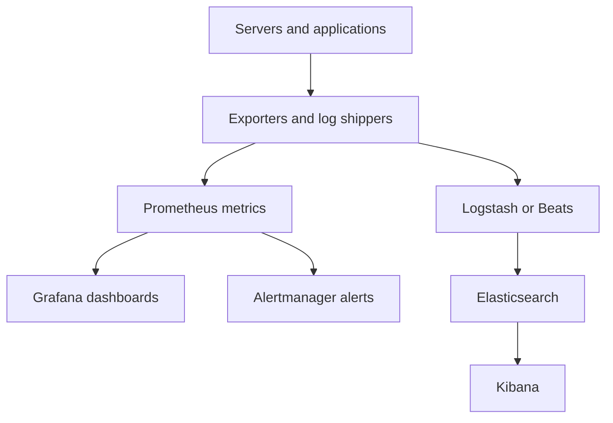

# Monitoring Services

## 10.1 Overview

Monitoring is essential for reliability, capacity planning, and incident response.

Three pillars:

- Metrics
- Logs
- Traces

Core goals:

- Detect failures quickly
- Understand performance trends
- Troubleshoot incidents efficiently
- Alert on meaningful conditions

## 10.2 Prometheus Overview

Prometheus is a pull-based metrics collection and alerting system.

Strengths:

- Powerful time-series storage
- Flexible PromQL querying
- Common exporters ecosystem
- Alertmanager integration

## 10.3 Grafana Overview

Grafana visualizes metrics, logs, and traces in dashboards.

## 10.4 Nagios and Zabbix Overview

### Nagios

- Plugin-based checks
- Traditional infrastructure monitoring

### Zabbix

- Agent-based and agentless monitoring
- Integrated dashboards and alerting

## 10.5 ELK Stack Overview

ELK means:

- Elasticsearch
- Logstash
- Kibana

Often modernized as Elastic Stack including Beats.

## 10.6 Mermaid Diagram: Monitoring Architecture



## 10.7 Prometheus Installation Concept

### Debian/Ubuntu Example

Use packaged or vendor release depending on standards.

```bash
sudo apt update
sudo apt install -y prometheus
sudo systemctl enable --now prometheus
```

## 10.8 Prometheus Basic Configuration

Example `/etc/prometheus/prometheus.yml`:

```yaml
global:
  scrape_interval: 15s
  evaluation_interval: 15s

scrape_configs:
  - job_name: prometheus
    static_configs:
      - targets:
          - localhost:9090

  - job_name: node
    static_configs:
      - targets:
          - 10.0.0.11:9100
          - 10.0.0.12:9100

  - job_name: nginx
    static_configs:
      - targets:
          - 10.0.0.11:9113
```

## 10.9 Exporters

Common exporters:

- node_exporter
- mysqld_exporter
- postgres_exporter
- blackbox_exporter
- nginx exporter
- apache exporter
- redis exporter

## 10.10 Example Alerts

High CPU alert:

```yaml
groups:
  - name: node-alerts
    rules:
      - alert: HighCPUUsage
        expr: 100 - (avg by(instance)(irate(node_cpu_seconds_total{mode="idle"}[5m])) * 100) > 85
        for: 10m
        labels:
          severity: warning
        annotations:
          summary: "High CPU usage on {{ $labels.instance }}"
```

Low disk space alert:

```yaml
      - alert: LowDiskSpace
        expr: (node_filesystem_avail_bytes{fstype!~"tmpfs|overlay"} / node_filesystem_size_bytes{fstype!~"tmpfs|overlay"}) * 100 < 15
        for: 10m
        labels:
          severity: critical
        annotations:
          summary: "Low disk space on {{ $labels.instance }}"
```

## 10.11 Grafana Deployment Notes

Basic install example:

```bash
sudo apt update
sudo apt install -y grafana
sudo systemctl enable --now grafana-server
```

Default web port:

- `3000`

Common tasks:

- Add data sources
- Import dashboards
- Create alert rules
- Use folders and permissions

## 10.12 Web Server Monitoring Metrics

Track for Apache/Nginx:

- Requests per second
- Active connections
- Response time
- Status code rates
- Upstream errors
- TLS handshake failures
- 4xx/5xx spikes
- Worker saturation

## 10.13 Database Monitoring Metrics

Track:

- Connection usage
- Query latency
- Slow queries
- Replication lag
- Buffer/cache hit rate
- Locks and deadlocks
- Disk and WAL/binlog growth

## 10.14 Mail and DNS Monitoring Metrics

Mail:

- Queue length
- Deferred mail count
- TLS negotiation failures
- Auth failures

DNS:

- Query rate
- SERVFAIL rate
- Response time
- Zone transfer failures
- Recursion abuse signs

## 10.15 Blackbox Monitoring

Blackbox checks probe services externally.

Examples:

- HTTP GET /health
- TLS certificate expiry
- ICMP ping
- TCP connect on ports
- DNS query validation

## 10.16 Log Collection Basics

Common sources:

- `/var/log/nginx/access.log`
- `/var/log/nginx/error.log`
- `/var/log/apache2/access.log`
- `/var/log/apache2/error.log`
- database logs
- mail logs
- DNS logs
- system journal

## 10.17 Structured Logging Benefits

Why use it:

- Easier parsing
- Better filtering
- Stronger correlation
- Faster dashboards and alerts

## 10.18 Elastic Stack Pipeline Concept

Flow:

1. Filebeat or agent reads logs.
2. Logstash parses/enriches.
3. Elasticsearch stores/indexes.
4. Kibana visualizes/searches.

## 10.19 Nagios Use Cases

Good for:

- Traditional host/service checks
- Explicit state-based monitoring
- Mature plugin ecosystem

## 10.20 Zabbix Use Cases

Good for:

- Unified infrastructure monitoring
- Agent-driven metrics collection
- Templates for common services

## 10.21 Alerting Best Practices

- Alert on symptoms and causes
- Avoid noisy flapping alerts
- Set reasonable `for:` durations
- Route by severity and ownership
- Include runbook links
- Test alert delivery paths

## 10.22 Sample SLI Ideas

Possible service-level indicators:

- Availability percentage
- p95 latency
- Error rate
- Successful request ratio
- Freshness of data pipeline

## 10.23 Monitoring Security

- Restrict dashboards and admin interfaces
- Use TLS for exporters where needed
- Protect metrics endpoints
- Avoid exposing internals publicly
- Scrub secrets from logs

## 10.24 Basic Monitoring Rollout Plan

1. Node health metrics
2. Web server metrics
3. Database metrics
4. Blackbox checks
5. Centralized logs
6. Alert tuning
7. Capacity dashboards

## 10.25 Monitoring Best Practices Summary

- Start small but consistent
- Prefer useful alerts over many alerts
- Correlate metrics and logs
- Monitor dependencies, not just servers
- Track certificate expiration and backups

---

### 12.9 Monitoring Checklist

- Node metrics collected
- Web metrics collected
- Database metrics collected
- Blackbox checks active
- Logs centralized
- Alerts routed to team
- Dashboards reviewed

### 13.9 Logs to Check

- `/var/log/nginx/error.log`
- `/var/log/nginx/access.log`
- `/var/log/apache2/error.log`
- `/var/log/apache2/access.log`
- `/var/log/mysql/error.log`
- PostgreSQL log path per distro
- `/var/log/mail.log`
- journal via `journalctl`

### 15.6 Scenario: Prometheus Monitoring for Web Tier

```yaml
global:
  scrape_interval: 15s

scrape_configs:
  - job_name: node
    static_configs:
      - targets:
          - web1.example.internal:9100
          - web2.example.internal:9100

  - job_name: nginx
    static_configs:
      - targets:
          - web1.example.internal:9113
          - web2.example.internal:9113
```

---

### 17.5 Monitoring Stack Comparison

| Tool | Good Fit |
|---|---|
| Prometheus | Metrics and alerting |
| Grafana | Dashboards and visualization |
| Nagios | Traditional service checks |
| Zabbix | Unified infra monitoring |
| ELK | Centralized logs and search |

---

### 19.10 Monitoring Reinforcement

- Alert quality matters more than alert count.
- Metrics, logs, and traces solve different questions.
- Monitor from both inside and outside where possible.
- Blackbox checks catch issues that internal metrics may miss.
- Capacity dashboards help prevent incidents.

### 20.6 Monitoring Commands

```bash
curl -s http://127.0.0.1:9090/-/ready
curl -s http://127.0.0.1:3000/api/health
```

### 22.7 Validate Monitoring

```bash
curl -s http://127.0.0.1:9090/-/ready
curl -s http://127.0.0.1:3000/api/health
```

### 24.14 Prometheus Blackbox Target Example

```yaml
scrape_configs:
  - job_name: blackbox-http
    metrics_path: /probe
    params:
      module: [http_2xx]
    static_configs:
      - targets:
          - https://www.example.com
    relabel_configs:
      - source_labels: [__address__]
        target_label: __param_target
      - source_labels: [__param_target]
        target_label: instance
      - target_label: __address__
        replacement: blackbox-exporter:9115
```

### 24.15 Log Rotation Reminder

If logs grow without rotation:

- disk fills
- services may fail
- monitoring becomes noisy
- incident response becomes harder

---
