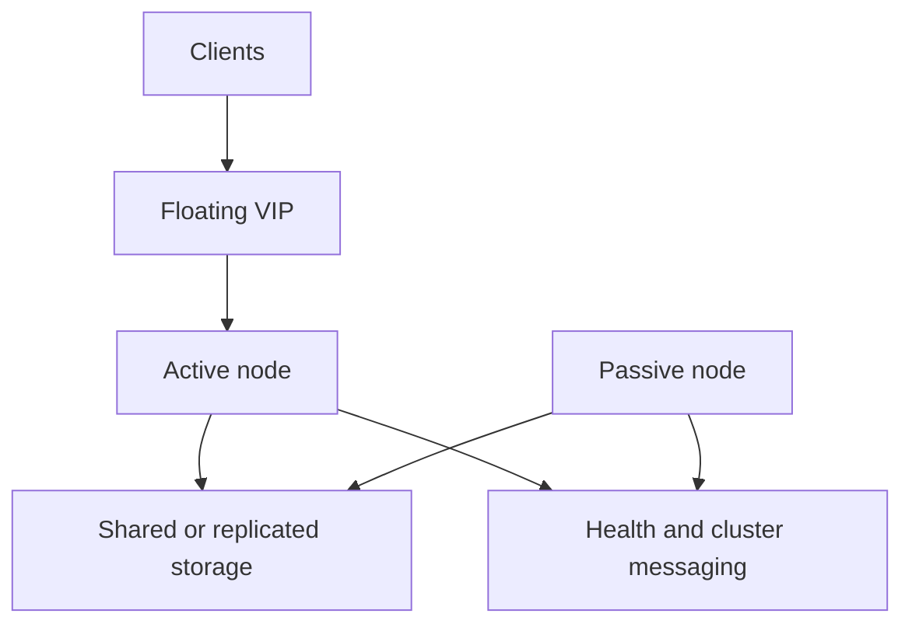

# High Availability

## 11.1 Overview

High availability reduces downtime through redundancy and failover.

Common goals:

- Remove single points of failure
- Automate failover
- Preserve service continuity
- Support maintenance with minimal downtime

## 11.2 HA Concepts

| Concept | Meaning |
|---|---|
| Active-passive | One node serves, another waits |
| Active-active | Multiple nodes serve simultaneously |
| VIP | Virtual IP address moved during failover |
| Quorum | Minimum votes required for cluster action |
| Fencing | Isolating a faulty node |
| Split brain | Cluster nodes diverge without coordination |

## 11.3 Mermaid Diagram: HA Cluster Architecture



## 11.4 Active-Passive vs Active-Active

### Active-Passive

Pros:

- Simpler design
- Easier consistency management

Cons:

- Standby capacity may sit idle

### Active-Active

Pros:

- Better resource utilization
- Potentially higher throughput

Cons:

- More complexity
- Greater need for state coordination

## 11.5 Keepalived Overview

Keepalived commonly provides:

- VRRP-based floating IP failover
- Health tracking scripts
- Lightweight HA for front-end nodes

## 11.6 Keepalived Installation

### Debian/Ubuntu

```bash
sudo apt update
sudo apt install -y keepalived
sudo systemctl enable --now keepalived
```

### RHEL/Rocky/Alma

```bash
sudo dnf install -y keepalived
sudo systemctl enable --now keepalived
```

## 11.7 Keepalived Example

Primary node config:

```conf
vrrp_script chk_nginx {
    script "pidof nginx"
    interval 2
    weight -20
}

vrrp_instance VI_1 {
    state MASTER
    interface eth0
    virtual_router_id 51
    priority 150
    advert_int 1
    authentication {
        auth_type PASS
        auth_pass StrongPass123
    }
    virtual_ipaddress {
        10.0.0.100/24
    }
    track_script {
        chk_nginx
    }
}
```

Secondary node config changes:

- `state BACKUP`
- lower `priority`

## 11.8 Pacemaker and Corosync Overview

Used for more advanced clustering.

### Corosync

- Cluster messaging and membership

### Pacemaker

- Resource management and failover orchestration

Use cases:

- VIP failover
- Service failover
- Storage-aware clustering
- Complex dependency orchestration

## 11.9 DRBD Overview

DRBD replicates block devices between servers.

Use case:

- Active-passive replicated storage for certain workloads

Important caution:

- Storage-level HA is complex
- Application-level replication is often safer for databases when supported

## 11.10 Fencing and STONITH

STONITH means:

- Shoot The Other Node In The Head

It ensures a failed or isolated node is forcefully fenced to prevent split-brain corruption.

For serious clusters, fencing is not optional.

## 11.11 Floating IP Concepts

A floating IP or VIP is moved between nodes during failover.

Common uses:

- Load balancer HA
- Single-service endpoint HA
- Database VIP for active-passive pair

## 11.12 HAProxy with Keepalived Pattern

Common front-end HA pattern:

- Two HAProxy nodes
- Keepalived advertises one VIP
- VIP moves if active node fails

Benefits:

- Simple
- Effective for reverse proxy layer

## 11.13 Database HA Considerations

For databases, HA must consider:

- Replication lag
- Automatic failover logic
- Read/write role changes
- Connection endpoint changes
- Backup continuity
- Split-brain prevention

## 11.14 Web Tier HA Considerations

Stateless web layers are easiest to scale and make highly available.

Best practices:

- Keep session state external
- Store assets centrally or deploy immutably
- Health-check nodes continuously
- Use graceful drain during maintenance

## 11.15 Example HA Web Architecture

- Two Nginx load balancers with Keepalived VIP
- Multiple app servers behind them
- Database primary with replica
- Shared monitoring and centralized logs

## 11.16 Maintenance and Failover Testing

Never assume HA works until tested.

Runbook tests:

- Stop active service
- Simulate node failure
- Validate VIP movement
- Validate app and DB connectivity
- Confirm alerting fired
- Confirm recovery steps

## 11.17 Common HA Failure Modes

- Split brain
- Stale health check logic
- Shared storage bottleneck
- Unreplicated sessions
- Certificate mismatch after failover
- DNS pointing at non-HA endpoint
- Monitoring not tracking standby health

## 11.18 Example Keepalived + Nginx Checklist

- Same Nginx config on both nodes
- Certificates present on both nodes
- Health script validated
- VRRP traffic allowed in firewall/network
- VIP subnet and interface correct
- Failover tested from client perspective

## 11.19 Example Pacemaker Resource Concepts

Possible resources:

- Virtual IP
- Filesystem mount
- Database service
- Web service
- Health monitor scripts

## 11.20 HA Best Practices Summary

- Prefer stateless app tiers
- Use explicit fencing for serious clusters
- Test failover regularly
- Monitor both active and standby nodes
- Document manual recovery steps

---

### 12.10 HA Checklist

- No single point of failure in entry path
- VIP or DNS failover strategy defined
- Health checks validated
- Fencing considered for cluster designs
- Failover tested recently
- Runbook documented

---

### 19.11 HA Reinforcement

- HA adds complexity.
- Complexity without testing creates false confidence.
- VIP failover is simple for edge tiers.
- Databases require stricter split-brain prevention.
- Fencing matters in clustered stateful services.
- Runbooks should include manual failback decisions.

---

### 22.8 Validate HA

- Simulate node service stop.
- Confirm VIP or routing failover.
- Confirm client connectivity.
- Confirm alerts fired.
- Confirm no split-brain symptoms.

---

### 24.13 Keepalived Script Considerations

- Script should be quick.
- Script should reflect actual service readiness.
- Script failure should meaningfully reduce priority.
- Script path and permissions must be correct.
