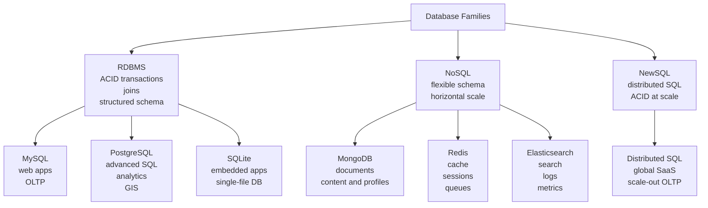

# Database Fundamentals

This file groups core concepts, architecture patterns, and example stack-selection guidance from the original guide.
# Databases on Linux

A production-focused guide to administering databases on Linux systems. It covers relational, document, key-value, search, and embedded databases with practical commands, architecture patterns, performance guidance, backup strategies, security controls, container deployments, and troubleshooting playbooks.

> Scope: Linux-first operations for self-managed, VM-based, and containerized environments.
> Audience: Sysadmins, SREs, DBAs, backend engineers, and platform teams.
> Distros: Ubuntu/Debian and RHEL/CentOS/Alma/Rocky examples are included where practical.

---

## Guide Map

1. [Database Fundamentals](01-fundamentals.md#1-database-fundamentals)
2. [MySQL / MariaDB](02-mysql-mariadb.md)
3. [PostgreSQL](03-postgresql.md)
4. [MongoDB](04-mongodb.md)
5. [Redis](05-redis.md)
6. [Elasticsearch](06-elasticsearch.md)
7. [SQLite](07-sqlite.md)
8. [Database Administration](08-administration.md)
9. [Database Security](09-security.md)
10. [Database in Containers](10-containers.md)
11. [Troubleshooting](11-troubleshooting.md)

---
# 1. Database Fundamentals

## 1.1 What a database administrator does on Linux

A Linux database administrator typically owns or contributes to:

- Package installation and lifecycle management.
- Service startup, shutdown, restart, and boot persistence.
- Disk and filesystem sizing.
- User and role administration.
- Schema and data change governance.
- Backup and restore validation.
- Replication and high availability operations.
- Performance tuning and capacity planning.
- Security hardening and auditability.
- Incident response and recovery.

## 1.2 Core database categories

### RDBMS

Relational database management systems store data in tables with rows and columns and enforce schemas.

Common strengths:

- Strong consistency.
- Rich SQL support.
- Mature transactions.
- Powerful joins and aggregations.
- Referential integrity.

Common workloads:

- OLTP systems.
- ERP and CRM platforms.
- Financial systems.
- Inventory and order management.
- Multi-table reporting.

Examples:

- MySQL
- MariaDB
- PostgreSQL
- SQLite

### NoSQL

NoSQL is a broad class that includes document, key-value, wide-column, and graph databases.

Common strengths:

- Flexible schema models.
- Horizontal scale-out patterns.
- High write throughput in many designs.
- Natural fit for semi-structured data.

Common workloads:

- Content management.
- User profiles and event storage.
- Caching.
- Session management.
- Search and observability pipelines.

Examples:

- MongoDB
- Redis
- Elasticsearch
- Cassandra

### NewSQL

NewSQL systems aim to preserve SQL and ACID properties while scaling horizontally like distributed systems.

Common strengths:

- SQL compatibility.
- Strong transactional guarantees.
- Distributed architecture.
- Online scale-out.

Common workloads:

- Cloud-native transactional platforms.
- Global SaaS applications.
- High scale services needing SQL semantics.

Examples:

- CockroachDB
- YugabyteDB
- TiDB
- SingleStore

## 1.3 RDBMS vs NoSQL vs NewSQL

| Characteristic | RDBMS | NoSQL | NewSQL |
|---|---|---|---|
| Data model | Tables | Flexible or specialized | Relational |
| Schema | Usually strict | Often flexible | Strict relational |
| Transactions | Strong ACID | Varies by engine | Strong ACID |
| Scaling | Vertical first, some horizontal | Horizontal first | Horizontal with SQL |
| Query language | SQL | Engine-specific APIs/query DSLs | SQL |
| Joins | Excellent | Often limited or avoided | Supported |
| Operational complexity | Moderate | Moderate to high | Often high |
| Best fit | Structured transactional data | Semi-structured or extreme scale patterns | Distributed SQL workloads |

## 1.4 ACID properties

ACID defines transaction guarantees.

### Atomicity

A transaction succeeds entirely or fails entirely.

Example:

- Debit one account.
- Credit another account.
- If the credit fails, the debit must roll back.

### Consistency

A transaction moves the database from one valid state to another valid state.

Examples:

- Foreign keys remain valid.
- Check constraints remain satisfied.
- Unique keys remain unique.

### Isolation

Concurrent transactions should not interfere in invalid ways.

Common isolation levels:

| Isolation level | Prevents | Typical caveat |
|---|---|---|
| Read Uncommitted | Almost nothing | Dirty reads possible |
| Read Committed | Dirty reads | Non-repeatable reads possible |
| Repeatable Read | Dirty and non-repeatable reads | Phantom reads may still occur depending on engine |
| Serializable | Most anomalies | Reduced concurrency |

### Durability

Once committed, data survives crashes according to the engine's durability design.

Typical durability mechanisms:

- Write-ahead logging.
- Redo logs.
- fsync or equivalent flush behavior.
- Replication to secondary nodes.
- Snapshot and archival backups.

## 1.5 CAP theorem

CAP discusses trade-offs in distributed systems.

- Consistency: every read gets the latest write.
- Availability: every request receives a response.
- Partition Tolerance: the system continues despite network partitions.

Because partitions are unavoidable in distributed systems, designers usually trade between:

- CP systems: favor consistency over availability.
- AP systems: favor availability over immediate consistency.

### Practical CAP interpretation

- PostgreSQL single primary replication tends to prioritize consistency.
- Cassandra-like systems often emphasize availability with tunable consistency.
- MongoDB replica sets can vary behavior depending on read/write concerns.
- Redis Sentinel deployments often favor quick failover with application-level tolerance considerations.

## 1.6 OLTP vs OLAP

| Dimension | OLTP | OLAP |
|---|---|---|
| Goal | Fast transactions | Analytical queries |
| Query pattern | Small reads/writes | Large scans/aggregations |
| Data freshness | Real-time | Near real-time or batch |
| Schema style | Normalized | Often denormalized/star schema |
| Example engines | MySQL, PostgreSQL | ClickHouse, Redshift, BigQuery |

## 1.7 Row store vs column store

| Model | Best for | Example |
|---|---|---|
| Row store | Frequent small transactions | MySQL, PostgreSQL |
| Column store | Large analytics scans | ClickHouse, Parquet-based engines |

## 1.8 Database selection decision tree

Use the following decision process when choosing a database.

1. Do you need multi-row ACID transactions and joins?
   - Yes: choose an RDBMS or NewSQL.
   - No: continue.
2. Do you need flexible JSON-like documents with variable fields?
   - Yes: consider MongoDB.
   - No: continue.
3. Do you need sub-millisecond caching, counters, or ephemeral state?
   - Yes: consider Redis.
   - No: continue.
4. Do you need full-text search, log analytics, or inverted indexing?
   - Yes: consider Elasticsearch.
   - No: continue.
5. Do you need embedded local storage with zero server management?
   - Yes: consider SQLite.
   - No: continue.
6. Do you need distributed SQL with horizontal scale and ACID?
   - Yes: consider a NewSQL engine.
   - No: a traditional RDBMS is usually simpler.

## 1.9 Decision table

| Requirement | Recommended starting point |
|---|---|
| Web application with transactions | PostgreSQL or MySQL |
| GIS and geospatial | PostgreSQL + PostGIS |
| Embedded app or edge device | SQLite |
| Flexible product catalog documents | MongoDB |
| Cache and sessions | Redis |
| Log search and observability | Elasticsearch |
| Distributed SQL at scale | NewSQL platform |

## 1.10 Mermaid diagram: Database types and use cases



## 1.11 Storage engine concepts

Important terms across database engines:

- Page: fixed-size unit of disk I/O.
- Buffer cache: in-memory pages used to reduce disk reads.
- WAL or redo log: sequential log for durability and crash recovery.
- Checkpoint: point where dirty pages are flushed and recovery work is reduced.
- Vacuum or purge: cleanup of obsolete versions or undo data.
- Index: auxiliary structure to accelerate lookups.

## 1.12 Linux fundamentals that affect databases

### CPU

Database workloads are sensitive to:

- Single-thread performance for some query types.
- Core count for concurrency.
- NUMA behavior on large servers.

Useful commands:

```bash
lscpu
numactl --hardware
mpstat -P ALL 1
```

### Memory

Memory determines cache effectiveness and sort/hash working space.

Useful commands:

```bash
free -h
vmstat 1
cat /proc/meminfo | head
```

### Disk and filesystem

Database performance depends heavily on latency, throughput, queue depth, and fsync characteristics.

Useful commands:

```bash
lsblk
fio --name=randread --filename=/data/testfile --size=1G --bs=4k --rw=randread --iodepth=32
iostat -xz 1
```

Recommended practices:

- Use SSD/NVMe for primary data paths.
- Separate data, logs, and backups where justified.
- Monitor inode usage and free space.
- Choose filesystem options carefully.

### Network

Replication, clustering, and client access depend on stable latency.

Useful commands:

```bash
ss -tulpn
ip addr
ethtool eth0
sar -n DEV 1
```

## 1.13 Filesystem layout examples

| Component | Common mount |
|---|---|
| Database data | /var/lib/mysql or /var/lib/pgsql or /var/lib/mongodb |
| Logs | /var/log/mysql or journald or /var/log/postgresql |
| Backups | /backup or mounted object-storage gateway |
| WAL/binlogs | Dedicated fast volume in larger deployments |

## 1.14 Service management with systemd

Common commands:

```bash
sudo systemctl status mysql
sudo systemctl restart postgresql
sudo systemctl enable mongod
sudo journalctl -u redis -n 200 --no-pager
```

## 1.15 Packaging models

You may install databases using:

- Native distro repositories.
- Vendor repositories.
- Tarball or binary packages.
- Container images.
- Operators in Kubernetes.

General advice:

- Prefer vendor repositories for production features and patch cadence.
- Pin versions intentionally.
- Coordinate upgrades with backup verification and rollback plans.

---

---

# 21. Database Architecture Patterns

## 21.1 Single primary with replicas

Good for:

- Most transactional systems.
- Clear write path.
- Simple failover models.

Trade-off:

- Writes scale vertically unless sharded or re-architected.

## 21.2 Multi-primary

Good only when justified by workload and conflict model.

Trade-offs:

- Higher operational complexity.
- Conflict handling.
- More careful application semantics.

## 21.3 Shared-nothing sharding

Good for:

- Large scale-out systems.
- Tenant partitioning.
- Very large write volumes.

Trade-offs:

- Application awareness.
- Complex rebalancing.
- Cross-shard queries and transactions may be harder.

## 21.4 CQRS and read replicas

Pattern:

- Primary handles writes.
- Read replicas serve reporting/search/API reads.

Caution:

- Replica lag means stale reads.

## 21.5 Search sidecar pattern

Common design:

- PostgreSQL or MySQL is source of truth.
- Changes are replicated to Elasticsearch for search.

Benefit:

- Each engine serves what it is best at.

## 21.6 Cache-aside pattern

With Redis:

1. App reads cache.
2. On miss, app reads DB.
3. App populates cache.
4. App invalidates or updates cache on write.

Main challenge:

- Cache invalidation correctness.

## 21.7 Event sourcing and append-only logs

Useful when:

- Full audit trail is essential.
- Reconstruction of state matters.

Caution:

- Querying current state usually needs projections or materialized views.

## 21.8 Data tiering

Separate hot and cold data by:

- Partitioning.
- Different storage classes.
- Archival tables or indices.

## 21.9 Blue-green database migration concepts

Common pattern:

- Build new target environment.
- Replicate data.
- Validate.
- Cut over traffic.
- Keep rollback window.

## 21.10 Architecture review checklist

- Are read/write paths explicit?
- Is failure mode understood?
- Is backup/restore aligned to topology?
- Are latency and consistency requirements documented?
- Is cost growth predictable?

---

---

# 25. Practical Examples

## 25.1 Example: designing a web app stack

Recommended stack:

- PostgreSQL for transactional source of truth.
- Redis for caching and sessions.
- Elasticsearch for search.
- PgBouncer for pooling.
- Patroni for PostgreSQL HA.

Why:

- Strong relational core.
- Fast cache layer.
- Dedicated search engine.
- Operationally mature components.

## 25.2 Example: content platform with flexible schema

Recommended stack:

- MongoDB for primary content documents.
- Redis for cache.
- Elasticsearch for search and discovery.

Watchouts:

- Enforce schema validation.
- Design shard key early if growth is expected.
- Keep search indexing pipeline reliable.

## 25.3 Example: small internal utility

Recommended stack:

- SQLite for local persistence.

Why:

- Minimal operational overhead.
- Simple deployment.
- Adequate for single-user or low-write concurrency.

## 25.4 Example: high-read ecommerce platform

Recommended stack:

- MySQL or PostgreSQL primary.
- Read replicas.
- Redis cache.
- Elasticsearch product search.

Operational notes:

- Watch replica lag.
- Cache hot product pages.
- Keep search index rebuild strategy ready.

---

---
