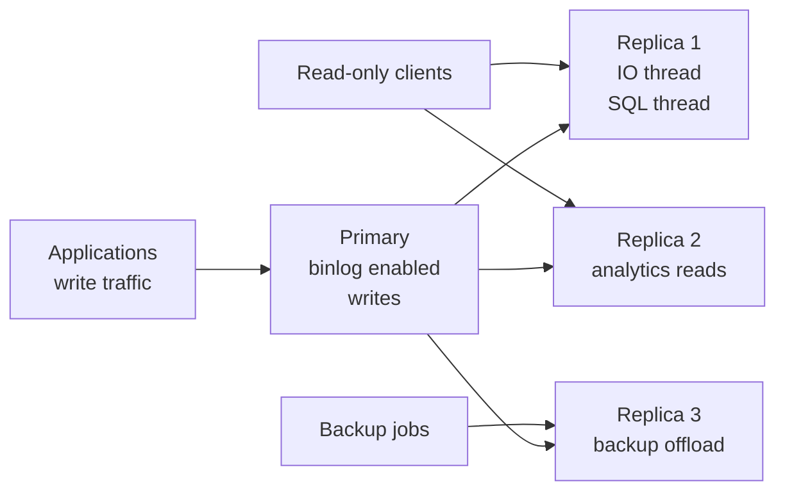
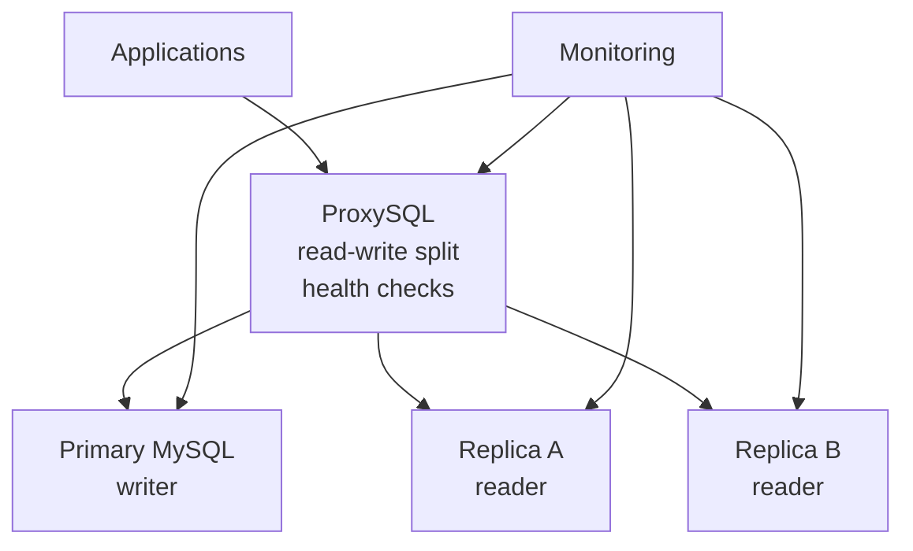

# MySQL / MariaDB

Installation, configuration, operations, replication, backup, tuning, and HA guidance for MySQL-family databases.
# 2. MySQL / MariaDB

## 2.1 Overview

MySQL and MariaDB are popular relational databases for web applications and general OLTP workloads.

Common Linux service names:

- mysql
- mysqld
- mariadb

Default data paths commonly include:

- /var/lib/mysql
- /etc/mysql/
- /etc/my.cnf
- /etc/mysql/my.cnf

## 2.2 Installation on Ubuntu

### MySQL

```bash
sudo apt update
sudo apt install -y mysql-server
sudo systemctl enable --now mysql
sudo mysql_secure_installation
```

### MariaDB

```bash
sudo apt update
sudo apt install -y mariadb-server
sudo systemctl enable --now mariadb
sudo mysql_secure_installation
```

## 2.3 Installation on CentOS/RHEL/Alma/Rocky

### MySQL using vendor repo

```bash
sudo dnf install -y https://dev.mysql.com/get/mysql84-community-release-el9-1.noarch.rpm
sudo dnf module disable -y mysql
sudo dnf install -y mysql-community-server
sudo systemctl enable --now mysqld
sudo grep 'temporary password' /var/log/mysqld.log
```

### MariaDB using distro or vendor repo

```bash
sudo dnf install -y mariadb-server
sudo systemctl enable --now mariadb
```

## 2.4 Post-install verification

```bash
systemctl status mysql --no-pager
ss -tulpn | grep 3306
mysql -uroot -p -e 'SELECT VERSION();'
```

## 2.5 Important directories and files

| Purpose | Common path |
|---|---|
| Main config | /etc/mysql/my.cnf or /etc/my.cnf |
| Additional config | /etc/mysql/conf.d/ or /etc/my.cnf.d/ |
| Data directory | /var/lib/mysql |
| Socket | /var/run/mysqld/mysqld.sock |
| Error log | journald or /var/log/mysql/error.log |

## 2.6 Configuration basics

Example `/etc/mysql/my.cnf` fragment:

```ini
[mysqld]
user = mysql
bind-address = 0.0.0.0
port = 3306
socket = /var/run/mysqld/mysqld.sock
pid-file = /run/mysqld/mysqld.pid
datadir = /var/lib/mysql
max_connections = 300
max_connect_errors = 1000
skip_name_resolve = 1
character-set-server = utf8mb4
collation-server = utf8mb4_unicode_ci
innodb_buffer_pool_size = 8G
innodb_log_file_size = 1G
innodb_flush_log_at_trx_commit = 1
innodb_file_per_table = 1
tmp_table_size = 256M
max_heap_table_size = 256M
sort_buffer_size = 4M
join_buffer_size = 4M
read_buffer_size = 2M
read_rnd_buffer_size = 4M
thread_cache_size = 100
table_open_cache = 4000
open_files_limit = 65535
slow_query_log = 1
slow_query_log_file = /var/log/mysql/slow.log
long_query_time = 1
log_error_verbosity = 2
log_bin = /var/lib/mysql/mysql-bin
binlog_format = ROW
server_id = 1
expire_logs_days = 7
```

## 2.7 Key MySQL parameters explained

| Parameter | Purpose | General guidance |
|---|---|---|
| innodb_buffer_pool_size | Main InnoDB cache | 50 to 75 percent of RAM on dedicated servers |
| max_connections | Concurrent sessions limit | Size conservatively; too high causes memory pressure |
| query_cache_size | Legacy query cache | Disable on modern MySQL; MariaDB usage depends on workload |
| tmp_table_size | In-memory temp tables | Increase for sorts/grouping if justified |
| table_open_cache | Open table descriptors | Increase for many active tables |
| innodb_flush_log_at_trx_commit | Durability/performance trade-off | 1 for strongest durability |
| sync_binlog | Binlog durability | 1 for strict durability |
| long_query_time | Slow log threshold | Often 0.5 to 2 seconds |
| max_allowed_packet | Max packet size | Increase for large rows or bulk ops |
| innodb_log_file_size | Redo capacity | Larger values improve write-heavy workloads |

## 2.8 Query cache note

- MySQL 8 removed the query cache.
- MariaDB may still support it.
- In modern deployments, query cache is usually avoided because it can add contention and poor scalability.

## 2.9 Secure initial configuration

Checklist:

- Set strong root/admin authentication.
- Remove anonymous users.
- Remove test database.
- Restrict network exposure.
- Use TLS for remote clients.
- Use least-privilege accounts.
- Disable DNS lookups with `skip_name_resolve` when appropriate.

## 2.10 Basic service administration

```bash
sudo systemctl start mysql
sudo systemctl stop mysql
sudo systemctl restart mysql
sudo systemctl reload mysql
sudo systemctl enable mysql
sudo journalctl -u mysql -n 200 --no-pager
```

## 2.11 User management

### Create user

```sql
CREATE USER 'appuser'@'10.%' IDENTIFIED BY 'StrongPasswordHere';
```

### Grant privileges

```sql
GRANT SELECT, INSERT, UPDATE, DELETE ON appdb.* TO 'appuser'@'10.%';
FLUSH PRIVILEGES;
```

### Revoke privileges

```sql
REVOKE DELETE ON appdb.* FROM 'appuser'@'10.%';
```

### Drop user

```sql
DROP USER 'appuser'@'10.%';
```

### Inspect grants

```sql
SHOW GRANTS FOR 'appuser'@'10.%';
```

## 2.12 Role-based access

In engines that support roles:

```sql
CREATE ROLE 'readonly_role';
GRANT SELECT ON reporting.* TO 'readonly_role';
GRANT 'readonly_role' TO 'reporter'@'%';
SET DEFAULT ROLE 'readonly_role' TO 'reporter'@'%';
```

## 2.13 Password and auth policies

Useful controls:

- Password validation plugin/component.
- Password expiration.
- Failed login lockout where supported.
- Auth plugins such as caching_sha2_password.

## 2.14 Database operations

### Create database

```sql
CREATE DATABASE appdb CHARACTER SET utf8mb4 COLLATE utf8mb4_unicode_ci;
```

### Create table

```sql
USE appdb;
CREATE TABLE customers (
    id BIGINT UNSIGNED AUTO_INCREMENT PRIMARY KEY,
    email VARCHAR(255) NOT NULL UNIQUE,
    name VARCHAR(255) NOT NULL,
    created_at TIMESTAMP NOT NULL DEFAULT CURRENT_TIMESTAMP
) ENGINE=InnoDB;
```

### Show databases and tables

```sql
SHOW DATABASES;
SHOW TABLES FROM appdb;
```

## 2.15 Import and export basics

### Dump one database

```bash
mysqldump -u root -p --single-transaction --routines --triggers appdb > appdb.sql
```

### Dump all databases

```bash
mysqldump -u root -p --single-transaction --routines --triggers --events --all-databases > full.sql
```

### Restore

```bash
mysql -u root -p appdb < appdb.sql
```

### Compressed backup

```bash
mysqldump -u backup -p --single-transaction appdb | gzip > appdb-$(date +%F).sql.gz
```

### Restore compressed backup

```bash
gunzip -c appdb-2025-01-01.sql.gz | mysql -u root -p appdb
```

## 2.16 Binary log basics

Binary logs enable:

- Replication.
- Point-in-time recovery.
- Change data capture integrations.

Check status:

```sql
SHOW BINARY LOG STATUS;
SHOW BINARY LOGS;
```

## 2.17 Replication concepts

Replication modes include:

- Asynchronous replication.
- Semi-synchronous replication.
- Group replication.
- Galera synchronous certification model for MariaDB/MySQL-compatible clusters.

Key terms:

- Source or primary.
- Replica or secondary.
- Relay log.
- GTID.
- Binlog position.

## 2.18 Traditional source-replica setup

### Primary settings

```ini
[mysqld]
server_id = 1
log_bin = /var/lib/mysql/mysql-bin
binlog_format = ROW
gtid_mode = ON
enforce_gtid_consistency = ON
```

Create replication user:

```sql
CREATE USER 'repl'@'10.%' IDENTIFIED BY 'StrongReplicationPassword';
GRANT REPLICATION SLAVE, REPLICATION CLIENT ON *.* TO 'repl'@'10.%';
FLUSH PRIVILEGES;
```

Take a consistent backup and note GTID or binlog coordinates.

### Replica settings

```ini
[mysqld]
server_id = 2
relay_log = /var/lib/mysql/relay-bin
read_only = ON
super_read_only = ON
gtid_mode = ON
enforce_gtid_consistency = ON
```

Configure replica:

```sql
CHANGE REPLICATION SOURCE TO
  SOURCE_HOST='10.0.0.10',
  SOURCE_USER='repl',
  SOURCE_PASSWORD='StrongReplicationPassword',
  SOURCE_AUTO_POSITION=1;
START REPLICA;
SHOW REPLICA STATUS\G
```

## 2.19 Master-master considerations

Master-master setups can work but require discipline.

Common concerns:

- Auto-increment collisions.
- Conflict handling.
- Split-brain risks.
- Accidental circular replication complexity.

Typical mitigations:

```ini
server_id = 1
auto_increment_increment = 2
auto_increment_offset = 1
log_slave_updates = ON
```

On the other node:

```ini
server_id = 2
auto_increment_increment = 2
auto_increment_offset = 2
log_slave_updates = ON
```

Production guidance:

- Prefer single-writer patterns unless multi-writer is required.
- Use managed clustering technologies or write routing to avoid conflicts.

## 2.20 GTID-based replication

GTID simplifies failover and topology changes.

Benefits:

- Easier replica promotion.
- Less dependence on exact file/position tracking.
- Better automation compatibility.

Important checks:

```sql
SHOW VARIABLES LIKE 'gtid_mode';
SHOW VARIABLES LIKE 'enforce_gtid_consistency';
```

## 2.21 Replication monitoring

Key fields in `SHOW REPLICA STATUS\G`:

- Replica_IO_Running
- Replica_SQL_Running
- Seconds_Behind_Source
- Last_IO_Error
- Last_SQL_Error
- Retrieved_Gtid_Set
- Executed_Gtid_Set

## 2.22 Common replication problems

| Problem | Symptom | Typical fix |
|---|---|---|
| Network block | IO thread down | Fix firewall, routes, DNS, TLS |
| Missing binlog | Replica cannot continue | Re-clone or restore from fresh backup |
| Duplicate key on replica | SQL thread stops | Fix data divergence, then resume |
| Long lag | Seconds behind source grows | Tune queries, parallel apply, hardware, workload |

## 2.23 Backup strategies

### Logical backups with mysqldump

Best for:

- Small to medium datasets.
- Object-level portability.
- Human-readable backups.

Pros:

- Flexible restore.
- Easy single-schema export.

Cons:

- Slow for very large datasets.
- Restore time can be long.

### mysqlpump

Can parallelize some export tasks.

```bash
mysqlpump -u root -p --default-parallelism=4 --databases appdb > appdb-pump.sql
```

### Physical backups with Percona XtraBackup

Best for:

- Large InnoDB datasets.
- Hot backups with low impact.
- Faster restore objectives.

Conceptual steps:

```bash
xtrabackup --backup --target-dir=/backup/xtrabackup/base
xtrabackup --prepare --target-dir=/backup/xtrabackup/base
xtrabackup --copy-back --target-dir=/backup/xtrabackup/base
chown -R mysql:mysql /var/lib/mysql
```

### Binlog-based PITR

Strategy:

1. Take a full backup.
2. Retain binary logs.
3. Restore the backup.
4. Replay binlogs to a target time or position.

## 2.24 Cron-based backup example

```cron
0 2 * * * /usr/bin/mysqldump -u backup -p'StrongPassword' --single-transaction --all-databases | gzip > /backup/mysql/full-$(date +\%F).sql.gz
```

Better production approach:

- Use a root-owned script with credentials from a protected option file.
- Rotate backups.
- Verify restore regularly.
- Encrypt backup artifacts.

Example script pattern:

```bash
#!/usr/bin/env bash
set -euo pipefail
umask 077
STAMP=$(date +%F-%H%M)
BACKUP_DIR=/backup/mysql
mkdir -p "$BACKUP_DIR"
mysqldump --defaults-extra-file=/root/.my-backup.cnf --single-transaction --all-databases | gzip > "$BACKUP_DIR/full-$STAMP.sql.gz"
find "$BACKUP_DIR" -type f -mtime +7 -delete
```

## 2.25 Restore testing checklist

- Provision isolated restore host.
- Restore latest backup.
- Apply binlogs if required.
- Run integrity checks.
- Run application smoke tests.
- Measure recovery time.
- Document gaps.

## 2.26 Performance tuning principles

Primary goals:

- Reduce disk I/O.
- Improve index effectiveness.
- Keep transactions short.
- Size caches properly.
- Eliminate inefficient queries.

## 2.27 EXPLAIN usage

```sql
EXPLAIN SELECT * FROM orders WHERE customer_id = 42 ORDER BY created_at DESC LIMIT 20;
```

Key columns to read:

| Column | Meaning |
|---|---|
| type | Access type, such as const, ref, range, ALL |
| possible_keys | Candidate indexes |
| key | Actual chosen index |
| rows | Estimated rows examined |
| Extra | Extra info such as Using filesort |

### EXPLAIN ANALYZE

Use when available for actual execution timing.

```sql
EXPLAIN ANALYZE SELECT * FROM orders WHERE customer_id = 42;
```

## 2.28 Slow query log

Enable and analyze:

```ini
slow_query_log = 1
slow_query_log_file = /var/log/mysql/slow.log
long_query_time = 1
log_queries_not_using_indexes = 0
```

Then summarize:

```bash
mysqldumpslow -s t -t 20 /var/log/mysql/slow.log
```

Alternative tooling:

- pt-query-digest
- PMM
- Grafana dashboards

## 2.29 Indexing strategies

Good index design principles:

- Index predicates used frequently in WHERE clauses.
- Support sort order when possible.
- Avoid indexing every column.
- Favor selective columns.
- Use composite index leftmost-prefix logic intentionally.

Example:

```sql
CREATE INDEX idx_orders_customer_created ON orders (customer_id, created_at DESC);
```

This can help:

- `WHERE customer_id = ?`
- `WHERE customer_id = ? ORDER BY created_at DESC`

## 2.30 Query anti-patterns

Avoid:

- `SELECT *` in hot paths.
- Functions on indexed columns in predicates.
- Leading wildcard searches like `%term`.
- Huge transactions when not required.
- N+1 query patterns from applications.

## 2.31 InnoDB tuning notes

| Area | Consideration |
|---|---|
| Buffer pool | Largest performance lever for working set caching |
| Log file size | Helps write-heavy workloads and checkpoint spacing |
| Flushing | Balance durability and latency |
| IO threads | Tune for storage concurrency |
| File per table | Easier space reclaim and management |

## 2.32 Table maintenance

Useful operations:

```sql
ANALYZE TABLE orders;
OPTIMIZE TABLE orders;
CHECK TABLE orders;
```

Notes:

- `OPTIMIZE TABLE` can be disruptive.
- InnoDB behavior depends on version and table format.
- Prefer online schema tools for production changes.

## 2.33 Online schema change tools

Popular tools:

- pt-online-schema-change
- gh-ost

Use when adding indexes or altering large tables with minimal downtime.

## 2.34 High availability options

### MySQL InnoDB Cluster

Components:

- Group Replication.
- MySQL Shell for cluster admin.
- MySQL Router for routing.

Use cases:

- Integrated vendor-supported HA patterns.
- Single-primary or multi-primary cluster modes.

### Galera Cluster

Common in MariaDB and Percona ecosystems.

Characteristics:

- Virtually synchronous replication.
- Multi-writer capability.
- Certification-based conflict checks.

Requirements:

- Low-latency networks.
- Careful flow-control monitoring.

### ProxySQL

ProxySQL adds:

- Query routing.
- Read/write split.
- Connection multiplexing.
- Hostgroup-based failover patterns.

## 2.35 Mermaid diagram: MySQL replication architecture



## 2.36 Mermaid diagram: MySQL HA architecture



## 2.37 Linux operational checklist for MySQL

- Verify open files limit.
- Verify data volume mount options.
- Monitor inode usage.
- Capture slow log trends.
- Watch replication lag.
- Rotate and ship logs.
- Test backup restore monthly.
- Rehearse failover.

## 2.38 Common MySQL admin commands

```bash
mysqladmin -uroot -p status
mysqladmin -uroot -p variables
mysql -uroot -p -e "SHOW PROCESSLIST;"
mysql -uroot -p -e "SHOW ENGINE INNODB STATUS\G"
```

## 2.39 Example health queries

```sql
SHOW GLOBAL STATUS LIKE 'Threads_connected';
SHOW GLOBAL STATUS LIKE 'Threads_running';
SHOW GLOBAL STATUS LIKE 'Innodb_buffer_pool_read%';
SHOW GLOBAL STATUS LIKE 'Slow_queries';
SHOW GLOBAL VARIABLES LIKE 'max_connections';
```

## 2.40 Upgrade guidance

Before upgrade:

- Read release notes.
- Verify plugin and auth compatibility.
- Test schema and application behavior.
- Confirm backup and rollback strategy.

After upgrade:

- Run post-upgrade checks.
- Watch slow log and error log.
- Validate replication and backup tooling.

---

---

# 2. Extended MySQL Command Cookbook
## 2.1 Server introspection
```sql
SHOW VARIABLES;
SHOW STATUS;
SHOW FULL PROCESSLIST;
SHOW ENGINE INNODB STATUS\G
```

## 2.2 Session troubleshooting
```sql
SELECT * FROM performance_schema.threads LIMIT 10;
SELECT * FROM performance_schema.events_statements_summary_by_digest ORDER BY SUM_TIMER_WAIT DESC LIMIT 10;
```

## 2.3 Table size report
```sql
SELECT table_schema,
       table_name,
       ROUND((data_length + index_length) / 1024 / 1024, 2) AS size_mb
FROM information_schema.tables
ORDER BY size_mb DESC
LIMIT 20;
```

## 2.4 Index inspection
```sql
SHOW INDEX FROM appdb.customers;
```

## 2.5 Find long-running queries
```sql
SELECT ID, USER, HOST, DB, COMMAND, TIME, STATE, INFO
FROM information_schema.PROCESSLIST
WHERE COMMAND <> 'Sleep'
ORDER BY TIME DESC;
```

## 2.6 Transaction and lock investigation tips
- Review InnoDB status for lock waits.
- Use Performance Schema tables when enabled.
- Correlate with application request IDs.
- Check whether missing indexes are widening lock scope.

## 2.7 Sample `my.cnf` profiles
### Small VM profile

```ini
[mysqld]
innodb_buffer_pool_size = 1G
max_connections = 100
slow_query_log = 1
long_query_time = 1
```

### Medium application server profile

```ini
[mysqld]
innodb_buffer_pool_size = 8G
max_connections = 300
table_open_cache = 4000
thread_cache_size = 100
```

### Large dedicated server profile

```ini
[mysqld]
innodb_buffer_pool_size = 48G
innodb_log_file_size = 4G
max_connections = 500
open_files_limit = 65535
```

## 2.8 Backup media strategy
- Local fast restore copies for immediate recovery.
- Remote encrypted copies for disaster recovery.
- Immutable backup tier where supported.
- Separate retention for daily, weekly, monthly backups.

## 2.9 MySQL replication pre-flight checklist
- Unique `server_id` on every node.
- Binary logging enabled on source.
- Time synchronized with NTP.
- Same major version compatibility validated.
- Firewall open on 3306.
- Replication user tested.
- Backup seeded correctly.

## 2.10 MySQL failover considerations
- Confirm replica fully caught up.
- Freeze application writes if needed.
- Promote chosen replica.
- Redirect clients using proxy or DNS.
- Rebuild old primary as replica.
- Document exact GTID or position state.

---

---
