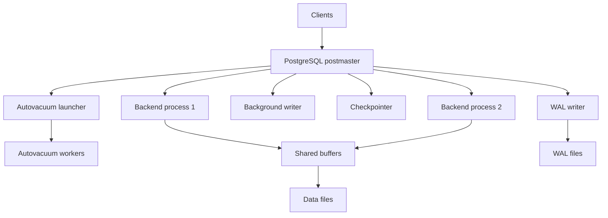
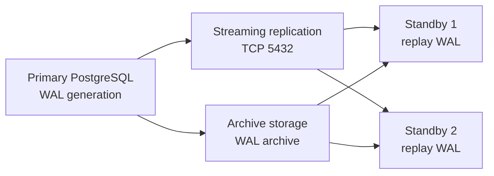

# PostgreSQL

Installation, configuration, replication, backup, tuning, extensions, and HA guidance for PostgreSQL.
# 3. PostgreSQL

## 3.1 Overview

PostgreSQL is an advanced open-source relational database with strong SQL support, extensibility, and a broad ecosystem.

Common Linux paths:

- /var/lib/postgresql/
- /var/lib/pgsql/
- /etc/postgresql/
- /var/lib/pgsql/data/

## 3.2 Installation on Ubuntu

```bash
sudo apt update
sudo apt install -y postgresql postgresql-contrib
sudo systemctl enable --now postgresql
```

To install a specific major version from official repositories, add the PGDG repo as appropriate for your distro policy.

## 3.3 Installation on RHEL-family systems

```bash
sudo dnf install -y https://download.postgresql.org/pub/repos/yum/reporpms/EL-9-x86_64/pgdg-redhat-repo-latest.noarch.rpm
sudo dnf -qy module disable postgresql
sudo dnf install -y postgresql16-server postgresql16
sudo /usr/pgsql-16/bin/postgresql-16-setup initdb
sudo systemctl enable --now postgresql-16
```

## 3.4 Initial verification

```bash
sudo -u postgres psql -c 'SELECT version();'
systemctl status postgresql --no-pager
ss -tulpn | grep 5432
```

## 3.5 Important files

| File | Purpose |
|---|---|
| postgresql.conf | Main server configuration |
| pg_hba.conf | Client authentication rules |
| pg_ident.conf | User mapping for auth methods |
| pg_wal/ | WAL files |
| base/ | Main data files |

## 3.6 `postgresql.conf` essentials

Example settings:

```conf
listen_addresses = '*'
port = 5432
max_connections = 300
shared_buffers = 8GB
effective_cache_size = 24GB
work_mem = 16MB
maintenance_work_mem = 1GB
wal_level = replica
max_wal_senders = 10
max_replication_slots = 10
wal_keep_size = 4GB
archive_mode = on
archive_command = 'test ! -f /archive/%f && cp %p /archive/%f'
checkpoint_timeout = 15min
checkpoint_completion_target = 0.9
random_page_cost = 1.1
effective_io_concurrency = 200
shared_preload_libraries = 'pg_stat_statements'
log_min_duration_statement = 1000
log_checkpoints = on
log_connections = on
log_disconnections = on
```

## 3.7 Key PostgreSQL parameters explained

| Parameter | Purpose | General guidance |
|---|---|---|
| shared_buffers | Main shared cache | Often 25 percent of RAM on dedicated servers |
| effective_cache_size | Planner estimate of OS cache | Often 50 to 75 percent of RAM |
| work_mem | Per-operation work area | Set carefully; multiplied by concurrent operations |
| maintenance_work_mem | Vacuum/index build memory | Larger for maintenance tasks |
| wal_level | WAL detail for replication/logical decoding | replica or logical as needed |
| max_connections | Backend processes | Keep moderate; use pooling |
| checkpoint_completion_target | Checkpoint smoothing | Usually 0.7 to 0.9 |
| random_page_cost | Planner storage model | Lower on SSD |

## 3.8 `pg_hba.conf` examples

Local peer auth:

```conf
local   all             postgres                                peer
```

Password auth for app subnet:

```conf
host    appdb           appuser         10.0.0.0/24            scram-sha-256
```

Replication user:

```conf
host    replication     repl            10.0.0.0/24            scram-sha-256
```

After changes:

```bash
sudo systemctl reload postgresql
```

## 3.9 Initial role and database setup

```bash
sudo -u postgres createuser --interactive
sudo -u postgres createdb appdb
```

Using SQL:

```sql
CREATE ROLE appuser LOGIN PASSWORD 'StrongPassword';
CREATE DATABASE appdb OWNER appuser;
```

## 3.10 User and role management

### Create role

```sql
CREATE ROLE analyst LOGIN PASSWORD 'StrongPassword';
```

### Grant database connection and schema privileges

```sql
GRANT CONNECT ON DATABASE appdb TO analyst;
\c appdb
GRANT USAGE ON SCHEMA public TO analyst;
GRANT SELECT ON ALL TABLES IN SCHEMA public TO analyst;
ALTER DEFAULT PRIVILEGES IN SCHEMA public GRANT SELECT ON TABLES TO analyst;
```

### Role inheritance

```sql
CREATE ROLE reporting_readonly;
GRANT SELECT ON ALL TABLES IN SCHEMA public TO reporting_readonly;
GRANT reporting_readonly TO analyst;
```

## 3.11 Database operations

### Create schema and table

```sql
CREATE SCHEMA sales AUTHORIZATION appuser;
CREATE TABLE sales.orders (
    id BIGSERIAL PRIMARY KEY,
    customer_id BIGINT NOT NULL,
    total_amount NUMERIC(12,2) NOT NULL,
    created_at TIMESTAMPTZ NOT NULL DEFAULT now()
);
```

### Basic maintenance SQL

```sql
VACUUM (VERBOSE, ANALYZE) sales.orders;
REINDEX TABLE sales.orders;
```

## 3.12 Service administration

```bash
sudo systemctl start postgresql
sudo systemctl stop postgresql
sudo systemctl restart postgresql
sudo systemctl reload postgresql
sudo journalctl -u postgresql -n 200 --no-pager
```

## 3.13 Replication overview

Major PostgreSQL replication styles:

- Physical streaming replication.
- Logical replication.
- WAL shipping.
- Cascading replication.

## 3.14 Streaming replication setup

### Primary configuration

In `postgresql.conf`:

```conf
wal_level = replica
max_wal_senders = 10
max_replication_slots = 10
wal_keep_size = 4GB
archive_mode = on
archive_command = 'test ! -f /archive/%f && cp %p /archive/%f'
```

In `pg_hba.conf`:

```conf
host replication repl 10.0.0.0/24 scram-sha-256
```

Create replication role:

```sql
CREATE ROLE repl WITH REPLICATION LOGIN PASSWORD 'StrongReplicationPassword';
```

### Standby creation with `pg_basebackup`

```bash
sudo -u postgres pg_basebackup -h 10.0.0.10 -D /var/lib/postgresql/16/main -U repl -P -R -X stream -C -S standby1
```

Notes:

- `-R` writes standby connection settings.
- `-C -S standby1` creates a replication slot.

## 3.15 Replication monitoring

On primary:

```sql
SELECT pid, usename, application_name, client_addr, state, sync_state, write_lag, flush_lag, replay_lag
FROM pg_stat_replication;
```

On standby:

```sql
SELECT pg_is_in_recovery();
SELECT pg_last_wal_receive_lsn(), pg_last_wal_replay_lsn(), now() - pg_last_xact_replay_timestamp() AS replay_delay;
```

## 3.16 Logical replication

Use when:

- Replicating a subset of tables.
- Upgrading between major versions with minimal downtime.
- Feeding downstream analytics or microservices.

### Publisher

```sql
CREATE PUBLICATION app_pub FOR TABLE sales.orders;
```

### Subscriber

```sql
CREATE SUBSCRIPTION app_sub
CONNECTION 'host=10.0.0.10 dbname=appdb user=repl password=StrongReplicationPassword'
PUBLICATION app_pub;
```

## 3.17 WAL archiving

WAL archiving supports PITR and disaster recovery.

Example:

```conf
archive_mode = on
archive_command = 'test ! -f /archive/%f && cp %p /archive/%f'
archive_timeout = 60
```

Best practices:

- Archive to durable storage.
- Monitor failures aggressively.
- Retain enough WAL for recovery objectives.

## 3.18 Backup methods

### Logical backup with `pg_dump`

```bash
pg_dump -U postgres -Fc appdb > appdb.dump
```

Restore:

```bash
createdb -U postgres appdb_restored
pg_restore -U postgres -d appdb_restored appdb.dump
```

### Full cluster logical dump

```bash
pg_dumpall -U postgres > full-cluster.sql
```

### Physical base backup

```bash
pg_basebackup -h 10.0.0.10 -U repl -D /backup/pg/base -P -X stream
```

### pgBackRest

Highly recommended for production PostgreSQL backup management.

Benefits:

- Full, differential, incremental backup support.
- WAL archiving integration.
- Restore automation.
- Compression and retention control.

Conceptual example:

```bash
pgbackrest --stanza=main stanza-create
pgbackrest --stanza=main backup
pgbackrest --stanza=main restore
```

## 3.19 Point-in-time recovery workflow

1. Restore a base backup.
2. Provide WAL archives.
3. Set recovery target time or LSN.
4. Start server in recovery.
5. Promote after reaching target.

Recovery settings approach varies by PostgreSQL major version, but the concept remains the same.

## 3.20 Performance tuning principles

Key areas:

- Shared memory sizing.
- Query plan quality.
- Index design.
- Vacuum health.
- WAL and checkpoint tuning.
- Connection management.

## 3.21 EXPLAIN and EXPLAIN ANALYZE

```sql
EXPLAIN SELECT * FROM sales.orders WHERE customer_id = 42 ORDER BY created_at DESC LIMIT 20;
EXPLAIN ANALYZE SELECT * FROM sales.orders WHERE customer_id = 42 ORDER BY created_at DESC LIMIT 20;
```

What to inspect:

- Sequential scan vs index scan.
- Rows estimated vs actual rows.
- Buffers read and hit.
- Sort methods and temp disk usage.
- Hash join size and spills.

## 3.22 `pg_stat_statements`

Enable in `shared_preload_libraries` and create extension:

```sql
CREATE EXTENSION IF NOT EXISTS pg_stat_statements;
SELECT query, calls, total_exec_time, mean_exec_time, rows
FROM pg_stat_statements
ORDER BY total_exec_time DESC
LIMIT 20;
```

## 3.23 Vacuum and autovacuum

PostgreSQL uses MVCC, which means dead tuples must be cleaned.

Watch for:

- Table bloat.
- Transaction ID wraparound risk.
- Under-provisioned autovacuum.

Useful queries:

```sql
SELECT relname, n_live_tup, n_dead_tup, last_autovacuum, last_autoanalyze
FROM pg_stat_user_tables
ORDER BY n_dead_tup DESC
LIMIT 20;
```

## 3.24 Indexing strategies

Types:

- B-tree for equality and range lookups.
- GIN for arrays, JSONB, full-text search.
- GiST for geometric and nearest-neighbor cases.
- BRIN for very large naturally ordered tables.
- Hash in niche scenarios.

Examples:

```sql
CREATE INDEX idx_orders_customer_created ON sales.orders (customer_id, created_at DESC);
CREATE INDEX idx_events_payload_gin ON events USING GIN (payload jsonb_path_ops);
```

## 3.25 Partitioning

Use declarative partitioning for large time-based or key-based datasets.

Example:

```sql
CREATE TABLE metrics (
    ts timestamptz NOT NULL,
    value numeric NOT NULL
) PARTITION BY RANGE (ts);
```

Why partition:

- Faster retention deletion.
- Improved maintenance windows.
- Better planner pruning for large tables.

## 3.26 Connection pooling with PgBouncer

Why it matters:

- PostgreSQL backend processes are relatively heavy.
- Thousands of app connections can harm memory and throughput.

Pool modes:

- session
- transaction
- statement

Typical recommendation:

- Use transaction pooling for stateless apps when compatible.

## 3.27 HA setup options

### Patroni + etcd

A common HA stack uses:

- PostgreSQL nodes.
- Patroni for orchestration.
- etcd or Consul as distributed configuration store.
- HAProxy or similar for routing.

Benefits:

- Automated failover.
- Cluster state coordination.
- Better operational predictability.

### pgpool-II

Features:

- Connection pooling.
- Query routing.
- Some failover support.
- Load balancing for reads.

### Citus

Citus extends PostgreSQL for distributed scale-out workloads.

Best fit:

- Multi-tenant SaaS.
- Large distributed analytical or mixed workloads.

## 3.28 Extensions

### PostGIS

Adds advanced geospatial types and functions.

```sql
CREATE EXTENSION postgis;
```

### pg_partman

Automates partition maintenance.

```sql
CREATE EXTENSION pg_partman;
```

### TimescaleDB

Optimized for time-series workloads.

```sql
CREATE EXTENSION timescaledb;
```

### Other useful extensions

- pg_trgm
- hstore
- uuid-ossp
- citext

## 3.29 Logs and observability

Important log options:

- `log_min_duration_statement`
- `log_checkpoints`
- `log_temp_files`
- `log_lock_waits`
- `deadlock_timeout`

Example:

```conf
log_min_duration_statement = 500
log_temp_files = 0
log_lock_waits = on
deadlock_timeout = 1s
```

## 3.30 Mermaid diagram: PostgreSQL architecture



## 3.31 Mermaid diagram: WAL-based replication



## 3.32 Common PostgreSQL admin commands

```bash
sudo -u postgres psql
sudo -u postgres psql -c '\l'
sudo -u postgres psql -c '\du'
sudo -u postgres psql -d appdb -c '\dt+'
sudo -u postgres vacuumdb --all --analyze-in-stages
```

## 3.33 Example monitoring queries

### Long-running queries

```sql
SELECT pid, usename, state, now() - query_start AS age, query
FROM pg_stat_activity
WHERE state <> 'idle'
ORDER BY age DESC;
```

### Blocking locks

```sql
SELECT blocked.pid AS blocked_pid,
       blocked.query AS blocked_query,
       blocker.pid AS blocker_pid,
       blocker.query AS blocker_query
FROM pg_stat_activity blocked
JOIN pg_locks blocked_locks ON blocked.pid = blocked_locks.pid AND NOT blocked_locks.granted
JOIN pg_locks blocker_locks ON blocker_locks.locktype = blocked_locks.locktype
    AND blocker_locks.database IS NOT DISTINCT FROM blocked_locks.database
    AND blocker_locks.relation IS NOT DISTINCT FROM blocked_locks.relation
    AND blocker_locks.page IS NOT DISTINCT FROM blocked_locks.page
    AND blocker_locks.tuple IS NOT DISTINCT FROM blocked_locks.tuple
    AND blocker_locks.classid IS NOT DISTINCT FROM blocked_locks.classid
    AND blocker_locks.objid IS NOT DISTINCT FROM blocked_locks.objid
    AND blocker_locks.objsubid IS NOT DISTINCT FROM blocked_locks.objsubid
    AND blocker_locks.pid <> blocked_locks.pid
JOIN pg_stat_activity blocker ON blocker.pid = blocker_locks.pid
WHERE blocker_locks.granted;
```

## 3.34 Upgrade approaches

Options:

- In-place package upgrade when supported by distro packaging rules.
- `pg_upgrade` for fast major upgrade.
- Logical replication for minimal-downtime migration.
- Dump and restore for smaller environments.

## 3.35 Production checklist

- WAL archiving tested.
- Backup restore tested.
- Autovacuum monitored.
- Connection pool deployed.
- TLS enforced.
- Failover rehearsed.
- Extension compatibility verified.

---

---

# 14. Extended PostgreSQL Command Cookbook

## 14.1 Useful psql meta-commands

```sql
\l
\du
\dn
\dt+
\d+ sales.orders
\x
\timing on
```

## 14.2 Database size reports

```sql
SELECT datname, pg_size_pretty(pg_database_size(datname))
FROM pg_database
ORDER BY pg_database_size(datname) DESC;
```

## 14.3 Table and index size reports

```sql
SELECT schemaname,
       relname,
       pg_size_pretty(pg_total_relation_size(relid)) AS total_size
FROM pg_catalog.pg_statio_user_tables
ORDER BY pg_total_relation_size(relid) DESC
LIMIT 20;
```

## 14.4 Cache hit ratio approximation

```sql
SELECT sum(blks_hit) / nullif(sum(blks_hit) + sum(blks_read), 0)::numeric AS cache_hit_ratio
FROM pg_stat_database;
```

## 14.5 Vacuum diagnostics

```sql
SELECT relname,
       last_vacuum,
       last_autovacuum,
       n_dead_tup
FROM pg_stat_user_tables
ORDER BY n_dead_tup DESC
LIMIT 20;
```

## 14.6 Connection pressure diagnostics

```sql
SELECT state, count(*)
FROM pg_stat_activity
GROUP BY state
ORDER BY count(*) DESC;
```

## 14.7 WAL generation estimate

```sql
SELECT pg_size_pretty(pg_wal_lsn_diff(pg_current_wal_lsn(), '0/0'));
```

## 14.8 Replication slot review

```sql
SELECT slot_name, slot_type, active, restart_lsn
FROM pg_replication_slots;
```

## 14.9 Postgres tuning heuristics

- Increase `shared_buffers` carefully.
- Keep `work_mem` moderate due to concurrency multiplication.
- Lower `random_page_cost` for SSD.
- Enable `pg_stat_statements` early.
- Use PgBouncer before raising `max_connections` too far.

## 14.10 Failover checklist

- Confirm standby health.
- Check replay lag.
- Promote standby.
- Repoint clients or load balancer.
- Verify writes and backups.
- Recreate replication for old primary.

---

---
