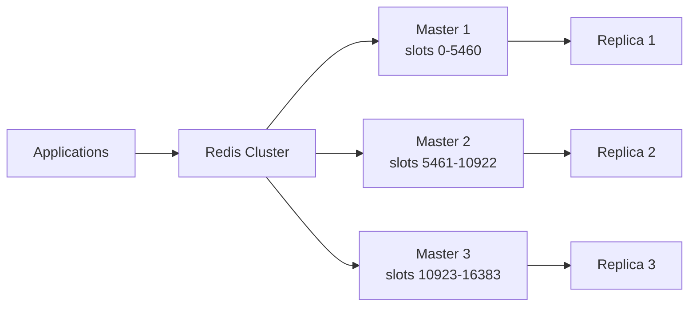

# Redis

Installation, data types, persistence, replication, cluster, and operational guidance for Redis.
# 5. Redis

## 5.1 Overview

Redis is an in-memory data structure store used for caching, session storage, streaming, pub/sub, leaderboards, queues, and lightweight coordination.

## 5.2 Installation on Ubuntu

```bash
sudo apt update
sudo apt install -y redis-server
sudo systemctl enable --now redis-server
```

## 5.3 Installation on RHEL-family systems

```bash
sudo dnf install -y redis
sudo systemctl enable --now redis
```

## 5.4 Verification

```bash
redis-cli ping
systemctl status redis --no-pager
ss -tulpn | grep 6379
```

## 5.5 Configuration basics

Common config file:

- `/etc/redis/redis.conf`

Important settings:

```conf
bind 0.0.0.0
port 6379
timeout 0
tcp-keepalive 300
supervised systemd
loglevel notice
databases 16
maxmemory 8gb
maxmemory-policy allkeys-lru
appendonly yes
appendfsync everysec
save 900 1
save 300 10
save 60 10000
requirepass StrongPassword
```

## 5.6 Data types and commands

### Strings

```bash
redis-cli SET site:name linuxdbguide
redis-cli GET site:name
```

### Hashes

```bash
redis-cli HSET user:100 name Alice email alice@example.com
redis-cli HGETALL user:100
```

### Lists

```bash
redis-cli LPUSH jobs pending1 pending2
redis-cli BRPOP jobs 5
```

### Sets

```bash
redis-cli SADD tags redis cache session
redis-cli SMEMBERS tags
```

### Sorted sets

```bash
redis-cli ZADD leaderboard 100 user1 200 user2
redis-cli ZREVRANGE leaderboard 0 9 WITHSCORES
```

### Streams

```bash
redis-cli XADD orders '*' customer_id 42 amount 19.99
redis-cli XRANGE orders - + COUNT 10
```

## 5.7 Persistence modes

### RDB snapshots

Advantages:

- Compact snapshot files.
- Faster restarts for some cases.
- Lower write amplification than AOF.

Disadvantages:

- Risk of more data loss between snapshots.

### AOF

Advantages:

- Better durability.
- Replay-based restoration.

Disadvantages:

- Larger files.
- More write overhead.

### Hybrid approach

Many production environments use both or rely on modern AOF rewrite behavior depending on Redis version and objectives.

## 5.8 Replication

Simple replica config example:

```conf
replicaof 10.0.0.10 6379
masterauth StrongPassword
```

Check replication:

```bash
redis-cli INFO replication
```

## 5.9 Redis Sentinel

Sentinel provides:

- Monitoring.
- Primary discovery.
- Automatic failover.
- Notification hooks.

Example sentinel config fragment:

```conf
sentinel monitor mymaster 10.0.0.10 6379 2
sentinel auth-pass mymaster StrongPassword
sentinel down-after-milliseconds mymaster 5000
sentinel failover-timeout mymaster 60000
```

## 5.10 Redis Cluster

Redis Cluster provides:

- Data sharding.
- Replication for each master shard.
- Slot-based partitioning.

Example cluster creation concept:

```bash
redis-cli --cluster create \
  10.0.0.11:6379 10.0.0.12:6379 10.0.0.13:6379 \
  10.0.0.14:6379 10.0.0.15:6379 10.0.0.16:6379 \
  --cluster-replicas 1
```

## 5.11 Use cases

| Use case | Why Redis fits |
|---|---|
| Caching | Extremely fast reads and writes |
| Sessions | TTL support and simple key model |
| Queues | Lists and streams |
| Rate limiting | Atomic counters and expiry |
| Pub/Sub | Native publish-subscribe primitives |
| Leaderboards | Sorted sets |

## 5.12 Memory management

Key concepts:

- `maxmemory`
- eviction policy
- fragmentation
- key TTL hygiene

Common policies:

- noeviction
- allkeys-lru
- volatile-lru
- allkeys-lfu

## 5.13 Performance tuning

- Keep values reasonably sized.
- Avoid huge keys and gigantic hash/list/set members.
- Pipeline commands from applications.
- Use Lua or transactions for atomic multi-step logic where needed.
- Monitor memory fragmentation ratio.

## 5.14 Backup and restore

Copying `dump.rdb` or AOF files is the basic mechanism, but production-safe backups should coordinate with persistence and replication status.

Operational ideas:

- Snapshot from a replica when possible.
- Verify RDB/AOF integrity.
- Store encrypted off-host backups.

## 5.15 Security notes

- Do not expose Redis directly to the internet.
- Use `bind` and firewall rules.
- Use ACLs or passwords depending on version.
- Consider TLS support.
- Rename or disable dangerous commands when appropriate.

## 5.16 Mermaid diagram: Redis Cluster architecture



## 5.17 Operational checklist

- Set explicit `maxmemory`.
- Choose eviction policy intentionally.
- Monitor persistence latency.
- Validate Sentinel or Cluster failover.
- Track keyspace hit ratio.
- Review oversized keys.

---

---

# 16. Extended Redis Operations Guide

## 16.1 Key inspection

```bash
redis-cli DBSIZE
redis-cli INFO memory
redis-cli INFO stats
redis-cli INFO keyspace
```

## 16.2 Slow log review

```bash
redis-cli SLOWLOG LEN
redis-cli SLOWLOG GET 20
```

## 16.3 Latency diagnostics

```bash
redis-cli LATENCY DOCTOR
redis-cli LATENCY LATEST
```

## 16.4 ACL example

```bash
redis-cli ACL SETUSER appuser on >StrongPassword ~app:* +@read +@write -FLUSHALL -FLUSHDB
```

## 16.5 Persistence checklist

- Decide RDB, AOF, or hybrid.
- Measure fsync latency.
- Validate restart time from persistence files.
- Back up persistence files off-host.

## 16.6 Eviction policy decision hints

| Pattern | Policy |
|---|---|
| Pure cache | allkeys-lru or allkeys-lfu |
| Cache with TTL-managed keys | volatile-lru |
| No data loss allowed | noeviction with proper app handling |

## 16.7 Queue design caution

Redis is convenient for queues but not a universal message broker replacement.

Consider:

- Consumer acknowledgment model.
- Persistence needs.
- Ordering guarantees.
- Replay requirements.

## 16.8 Operational anti-patterns

- Running with unlimited memory.
- Exposing instance publicly.
- Storing very large binary blobs.
- Using `KEYS *` in production.
- Forgetting TTLs on cache keys.

## 16.9 Safe key scanning

```bash
redis-cli SCAN 0 MATCH app:* COUNT 100
```

## 16.10 Replication monitoring hints

- Monitor replication offset gaps.
- Track failover event history in Sentinel.
- Confirm client libraries support Sentinel or Cluster discovery.

---

---
