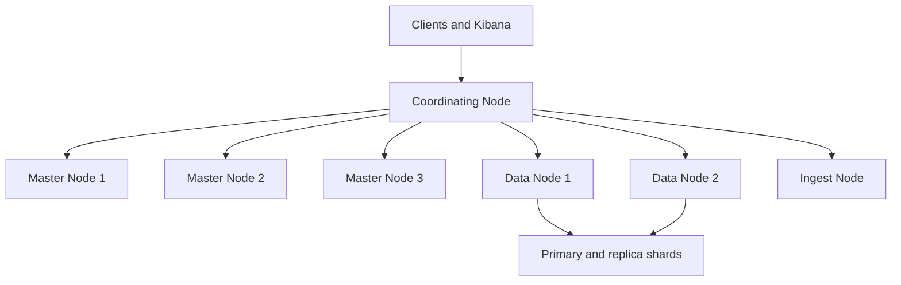

# Elasticsearch

Installation, indexing, mapping, queries, cluster operations, snapshots, and ELK/EFK guidance for Elasticsearch.
# 6. Elasticsearch

## 6.1 Overview

Elasticsearch is a distributed search and analytics engine built around inverted indexes and JSON documents.

Typical use cases:

- Full-text search.
- Log analytics.
- Observability pipelines.
- Product search.
- Security event analysis.

## 6.2 Installation concepts

Elasticsearch is commonly installed from vendor packages or containers. JVM sizing and kernel settings are critical.

Ubuntu-style example:

```bash
sudo apt update
sudo apt install -y apt-transport-https openjdk-17-jdk
# Add Elastic repository according to current vendor guidance.
sudo apt install -y elasticsearch
sudo systemctl enable --now elasticsearch
```

RHEL-style example:

```bash
sudo dnf install -y java-17-openjdk
# Add Elastic repository according to current vendor guidance.
sudo dnf install -y elasticsearch
sudo systemctl enable --now elasticsearch
```

## 6.3 Important Linux settings

Set memory map and file limits as required.

Example:

```bash
sudo sysctl -w vm.max_map_count=262144
ulimit -n 65535
```

Persist sysctl:

```conf
vm.max_map_count = 262144
```

## 6.4 Single-node configuration

Common file:

- `/etc/elasticsearch/elasticsearch.yml`

Example:

```yaml
cluster.name: prod-search
node.name: es1
path.data: /var/lib/elasticsearch
path.logs: /var/log/elasticsearch
network.host: 0.0.0.0
http.port: 9200
discovery.type: single-node
xpack.security.enabled: true
```

## 6.5 Cluster configuration basics

Example:

```yaml
cluster.name: prod-search
node.name: es1
node.roles: [ master, data, ingest ]
network.host: 10.0.0.11
http.port: 9200
discovery.seed_hosts: ["10.0.0.11", "10.0.0.12", "10.0.0.13"]
cluster.initial_master_nodes: ["es1", "es2", "es3"]
path.data: /var/lib/elasticsearch
path.logs: /var/log/elasticsearch
```

## 6.6 Verify cluster health

```bash
curl -u elastic:password -k https://localhost:9200/_cluster/health?pretty
curl -u elastic:password -k https://localhost:9200/_cat/nodes?v
curl -u elastic:password -k https://localhost:9200/_cat/indices?v
```

## 6.7 Index management

### Create index

```bash
curl -u elastic:password -k -X PUT https://localhost:9200/products -H 'Content-Type: application/json' -d '
{
  "settings": {
    "number_of_shards": 3,
    "number_of_replicas": 1
  }
}'
```

### Delete index

```bash
curl -u elastic:password -k -X DELETE https://localhost:9200/products
```

### Index a document

```bash
curl -u elastic:password -k -X POST https://localhost:9200/products/_doc/1 -H 'Content-Type: application/json' -d '
{
  "name": "Laptop",
  "price": 999,
  "category": "electronics"
}'
```

## 6.8 Mapping and queries

Explicit mapping example:

```bash
curl -u elastic:password -k -X PUT https://localhost:9200/products -H 'Content-Type: application/json' -d '
{
  "mappings": {
    "properties": {
      "name": { "type": "text" },
      "category": { "type": "keyword" },
      "price": { "type": "double" },
      "created_at": { "type": "date" }
    }
  }
}'
```

Search example:

```bash
curl -u elastic:password -k -X GET https://localhost:9200/products/_search -H 'Content-Type: application/json' -d '
{
  "query": {
    "bool": {
      "must": [
        { "match": { "name": "laptop" } }
      ],
      "filter": [
        { "term": { "category": "electronics" } },
        { "range": { "price": { "lte": 1200 } } }
      ]
    }
  }
}'
```

## 6.9 Index lifecycle management

ILM helps automate:

- Hot/warm/cold movement.
- Rollover.
- Retention deletion.
- Force merge.

Especially important for log and metrics indices.

## 6.10 Cluster management

Key concepts:

- Primary shards.
- Replica shards.
- Node roles.
- Cluster state.
- Rebalancing.

Watch for:

- Unassigned shards.
- Heap pressure.
- Large cluster state.
- Slow merges.
- Long garbage collection pauses.

## 6.11 Backup with snapshots

Elasticsearch backups should use snapshots, not filesystem copies of live data directories.

Register a repository example:

```bash
curl -u elastic:password -k -X PUT https://localhost:9200/_snapshot/fsrepo -H 'Content-Type: application/json' -d '
{
  "type": "fs",
  "settings": {
    "location": "/backup/elasticsearch"
  }
}'
```

Create snapshot:

```bash
curl -u elastic:password -k -X PUT https://localhost:9200/_snapshot/fsrepo/snap-2025-01-01?wait_for_completion=true
```

Restore snapshot:

```bash
curl -u elastic:password -k -X POST https://localhost:9200/_snapshot/fsrepo/snap-2025-01-01/_restore -H 'Content-Type: application/json' -d '{}'
```

## 6.12 Performance tuning basics

Key areas:

- JVM heap sizing.
- Shard count discipline.
- Mapping correctness.
- Bulk indexing strategies.
- Refresh interval tuning.
- Query cache and filesystem cache effectiveness.

Rules of thumb:

- Avoid too many tiny shards.
- Keep heap under compressed OOPs threshold where applicable.
- Use bulk indexing for ingestion.
- Prefer filters for exact matches.

## 6.13 ELK and EFK integration

Common stacks:

- ELK: Elasticsearch + Logstash + Kibana.
- EFK: Elasticsearch + Fluentd/Fluent Bit + Kibana.

Use cases:

- Application logging.
- Infrastructure logs.
- Security analytics.
- Trace and metric correlation.

## 6.14 Security essentials

- Enable x-pack security.
- Use TLS for HTTP and transport layers.
- Restrict roles and index privileges.
- Protect snapshot repositories.
- Avoid public exposure of node endpoints.

## 6.15 Mermaid diagram: Elasticsearch cluster architecture



## 6.16 Operational checklist

- Validate `vm.max_map_count`.
- Monitor JVM GC and heap usage.
- Keep shard count sane.
- Enforce snapshot success monitoring.
- Review hot threads during incidents.
- Track indexing and search latency separately.

---

---

# 17. Extended Elasticsearch Operations Guide

## 17.1 Cat APIs

```bash
curl -u elastic:password -k https://localhost:9200/_cat/health?v
curl -u elastic:password -k https://localhost:9200/_cat/nodes?v
curl -u elastic:password -k https://localhost:9200/_cat/shards?v
curl -u elastic:password -k https://localhost:9200/_cat/indices?v
```

## 17.2 Shard sizing guidance

General advice:

- Avoid many tiny shards.
- Avoid oversized shards that slow relocation and recovery.
- Align shard count with node count and growth patterns.

## 17.3 Bulk indexing example

```bash
curl -u elastic:password -k -X POST https://localhost:9200/_bulk -H 'Content-Type: application/x-ndjson' -d '
{ "index": { "_index": "products", "_id": "1" } }
{ "name": "Laptop", "category": "electronics" }
{ "index": { "_index": "products", "_id": "2" } }
{ "name": "Phone", "category": "electronics" }
'
```

## 17.4 Search performance tips

- Use keyword fields for exact filters and aggregations.
- Avoid expensive wildcard queries on large text fields.
- Use index templates for consistent mappings.
- Tune refresh interval during heavy ingestion.

## 17.5 Snapshot policy ideas

- Hourly snapshots for critical search platforms if RPO requires it.
- Daily retention tiers for older snapshots.
- Replicate snapshot repositories across regions when needed.

## 17.6 Recovery considerations

- Snapshot restore is preferred for disaster recovery.
- Reindex from source systems may be viable for derived search data.
- Maintain mapping templates in version control.

## 17.7 JVM and GC notes

- Monitor old generation pressure.
- Avoid swap.
- Right-size heap and keep room for filesystem cache.
- Review long GC pauses during incidents.

## 17.8 Index template example

```bash
curl -u elastic:password -k -X PUT https://localhost:9200/_index_template/logs-template -H 'Content-Type: application/json' -d '
{
  "index_patterns": ["logs-*"] ,
  "template": {
    "settings": {
      "number_of_shards": 3,
      "number_of_replicas": 1
    },
    "mappings": {
      "properties": {
        "@timestamp": { "type": "date" },
        "level": { "type": "keyword" },
        "message": { "type": "text" }
      }
    }
  }
}'
```

## 17.9 Common pitfalls

- Treating Elasticsearch as primary source of truth for transactional data.
- Dynamic mappings exploding field counts.
- Oversharding small clusters.
- Ignoring snapshot restore tests.

## 17.10 Rolling restart basics

- Disable shard allocation if appropriate.
- Restart one node at a time.
- Wait for cluster to stabilize.
- Re-enable allocation.
- Verify shard recovery completion.

---

---
