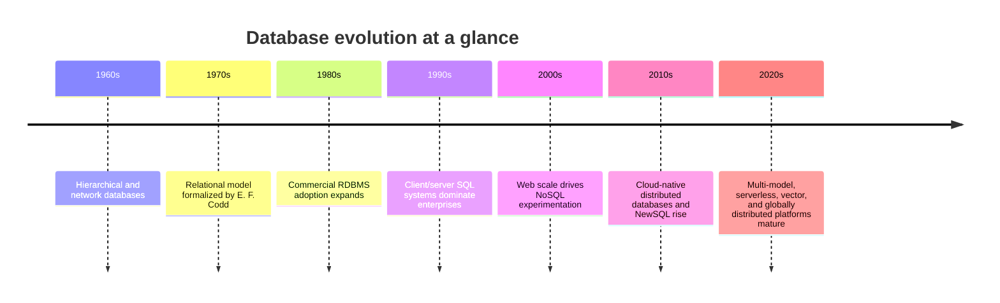
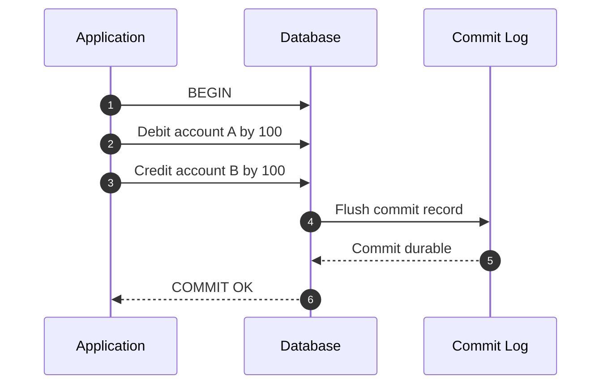
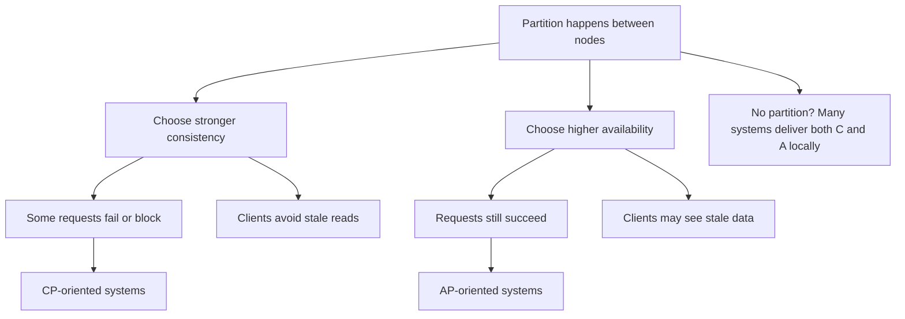
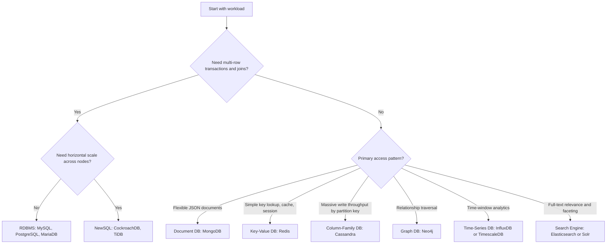

# Database Concepts

← Back to [12-database-essentials.md](./12-database-essentials.md)

Database foundations, types, ACID/CAP trade-offs, and database-selection concepts.

---

## 1. What Are Databases?

### 1.1 Definition and purpose

A database is an organized system for storing, retrieving, updating, and protecting data.

A database management system (DBMS) provides the software layer that helps applications:
- Store information in a structured or semi-structured form.
- Query data efficiently without reading entire files by hand.
- Protect data integrity through constraints, transactions, and permissions.
- Handle many users and workloads concurrently.
- Recover from failures using logs, checkpoints, backups, or replicas.
- Scale from a laptop demo to a multi-node production deployment.

Without databases, teams often end up building fragile file-based systems with weak validation, poor concurrency control, and no reliable recovery path.

### 1.2 Why databases matter

1. They keep critical business data durable beyond process restarts and machine crashes.
2. They provide predictable query patterns for applications, analytics, and operations.
3. They allow multiple services and users to share the same source of truth safely.
4. They reduce application complexity by moving indexing, locking, filtering, sorting, and aggregation into a dedicated engine.
5. They provide guardrails such as unique keys, foreign keys, schema validation, ACLs, and audit trails.
6. They make disaster recovery possible because data and metadata can be backed up, replicated, and restored consistently.

### 1.3 History and evolution

Database technology evolved in waves as storage media, hardware economics, and application needs changed.



### Key milestones
- **Hierarchical systems** stored data in tree-like structures and worked well for rigid parent-child records.
- **Network databases** expanded relationships but still required application logic to understand storage paths.
- **Relational databases** popularized tables, SQL, declarative querying, and normalized design.
- **Data warehousing** introduced columnar analytics engines and large-scale reporting patterns.
- **NoSQL systems** addressed flexible schemas, extreme write volume, distributed storage, and specialized access patterns.
- **NewSQL systems** attempted to combine SQL and strong transactions with horizontal scalability.
- **Cloud platforms** added managed backups, autoscaling, global replication, and API-driven operations.

### 1.4 Core database responsibilities

| Responsibility | What it means in practice | Example |
|---|---|---|
| Storage | Persisting data on disk or memory with an engine-specific format | InnoDB pages, PostgreSQL heap files, Redis in-memory structures |
| Indexing | Building data structures that make reads fast | B-tree on customer_id |
| Concurrency control | Allowing many sessions to work safely at once | MVCC in PostgreSQL |
| Transactions | Grouping related writes into a unit of work | Bank transfer of debit and credit |
| Security | Controlling who can connect and what they can do | Read-only analyst role |
| Recovery | Replaying logs or restoring from backups after failure | WAL replay after crash |
| Replication | Sending changes to replicas for scale or resilience | Primary to standby streaming |
| Optimization | Choosing efficient plans for queries | Index scan instead of full table scan |

### 1.5 ACID properties explained with examples

ACID describes transaction guarantees commonly associated with relational systems and some distributed databases.



#### Atomicity

Atomicity means a transaction is all-or-nothing.

**Bank transfer example:**
- Step 1: subtract $100 from checking account A.
- Step 2: add $100 to savings account B.
- If step 2 fails, step 1 must also be rolled back.
- The database should never leave money “lost in transit.”

#### Consistency

Consistency means every committed transaction moves the database from one valid state to another valid state.

**Order system example:**
- An order row cannot reference a non-existent customer if a foreign key exists.
- A username marked UNIQUE cannot be inserted twice.
- A CHECK constraint can prevent a negative quantity for inventory_on_hand.

#### Isolation

Isolation means concurrent transactions should not see each other in unsafe ways.

| Isolation level | What it prevents | Typical risk that may remain | Example |
|---|---|---|---|
| Read Uncommitted | Almost nothing | Dirty reads | Session B sees uncommitted price change from Session A |
| Read Committed | Dirty reads | Non-repeatable reads | Row value changes between two SELECTs |
| Repeatable Read | Dirty and many non-repeatable reads | Phantoms depending on engine | New matching rows appear in a range query |
| Serializable | Most anomalies | Lower concurrency and more retries | Concurrent booking workflow turns into ordered transactions |

**Practical example:** two workers attempting to reserve the last available seat should not both succeed.

#### Durability

Durability means committed data survives crashes according to the system design.

**Practical example:**
- A checkout transaction is committed.
- The server loses power five seconds later.
- After restart, the committed order should still exist because the commit record was flushed to durable storage or replicated safely.

### 1.6 ACID in SQL example

```sql
BEGIN;
UPDATE accounts SET balance = balance - 100 WHERE id = 10;
UPDATE accounts SET balance = balance + 100 WHERE id = 20;
INSERT INTO transfers(from_account, to_account, amount, created_at)
VALUES (10, 20, 100, NOW());
COMMIT;
```

If any statement fails, the application should issue `ROLLBACK;` so partial state is not committed.

### 1.7 CAP theorem explained

CAP theorem describes trade-offs in distributed systems when a network partition occurs.

- **Consistency (C):** every read receives the latest write or an error.
- **Availability (A):** every request receives a non-error response, even if it may not reflect the newest data.
- **Partition tolerance (P):** the system continues operating even when network links fail between nodes.

In real distributed systems, partition tolerance is usually mandatory, so the practical choice during a partition is often between stronger consistency and higher availability.



### 1.8 CAP examples by workload

| Workload | Usually favors | Why |
|---|---|---|
| Bank ledger | Consistency | Incorrect balances are worse than temporary unavailability |
| Shopping cart cache | Availability | A stale cart is tolerable for a short time |
| Global configuration store | Consistency | Split-brain config can break systems |
| Social feed counters | Availability | Slight lag is acceptable if the app keeps serving users |
| Distributed SQL checkout flow | Consistency | Orders and payments must line up exactly |

### 1.9 Databases vs files vs object storage

| System | Best at | Weakness |
|---|---|---|
| Flat files | Small local configs and ad hoc exports | Poor concurrency and indexing |
| Object storage | Large blobs, backups, media, archives | Not a transactional query engine |
| Database | Structured retrieval, updates, integrity, concurrent workloads | Operational overhead compared with plain files |

### 1.10 Summary of the fundamentals

- Databases exist to provide durable, queryable, multi-user data management.
- Relational systems emphasize integrity and SQL power.
- NoSQL systems emphasize flexible models and specialized workloads.
- Distributed databases force trade-offs around consistency, availability, and partitions.
- Operational quality matters as much as schema design: backups, monitoring, and security are part of the database story.

---

## 2. Types of Databases

### 2.1 Relational databases (RDBMS)

Relational databases store data in tables made of rows and columns, with schemas, keys, joins, and transactions.

- **MySQL** is common for web applications, SaaS platforms, and general OLTP.
- **PostgreSQL** is favored when SQL features, extensibility, and analytical richness matter.
- **MariaDB** is a MySQL-family engine with community-driven features and compatible tooling in many cases.
- **Oracle Database** dominates some large enterprise and legacy environments.
- **SQL Server** is strong in Microsoft-centric shops and hybrid enterprise estates.

### 2.2 NoSQL databases

NoSQL is not one product category. It includes multiple specialized models.

#### Document databases

- Store JSON-like documents.
- Useful when application objects do not fit cleanly into many normalized tables.
- Example: MongoDB.

#### Key-value stores

- Store values by key with extremely fast lookup.
- Great for caching, sessions, rate limiting, counters, and queues.
- Example: Redis.

#### Column-family / wide-column stores

- Designed for massive scale-out writes and large distributed datasets.
- Optimize around partition keys and denormalized access paths.
- Example: Cassandra.

#### Graph databases

- Model nodes, edges, and properties.
- Good for fraud graphs, social relationships, recommendations, and network maps.
- Example: Neo4j.

### 2.3 NewSQL databases

- **CockroachDB** offers distributed SQL with strong consistency and PostgreSQL-compatible tooling for many workflows.
- **TiDB** provides MySQL-compatible distributed SQL with separation of compute and storage.
- NewSQL systems target globally distributed or horizontally scalable transactional workloads without abandoning SQL.

### 2.4 Time-series databases

- **InfluxDB** is designed for timestamped metrics, events, and IoT workloads.
- **TimescaleDB** builds time-series capabilities on top of PostgreSQL.
- Time-series systems optimize ingestion, retention, downsampling, and time-window analytics.

### 2.5 Search engines

- **Elasticsearch** powers full-text search, observability, security analytics, and log indexing.
- **Solr** is another Lucene-based search platform used for enterprise search and content indexing.
- Search engines prioritize inverted indexes, text relevance, faceting, and flexible query DSLs.

### 2.6 Comparison table of major database types

| Type | Examples | Data model | Strengths | Trade-offs | Common use cases |
|---|---|---|---|---|---|
| Relational | MySQL, PostgreSQL, MariaDB, Oracle, SQL Server | Tables and relations | ACID, SQL, joins, constraints | Schema changes require planning | OLTP, ERP, billing, inventory |
| Document | MongoDB | JSON/BSON documents | Flexible schema, developer-friendly objects | Joins are weaker or avoided | Catalogs, profiles, content |
| Key-Value | Redis | Key to value | Very fast, simple access, cache-friendly | Limited ad hoc querying | Caching, sessions, queues |
| Column-Family | Cassandra | Partitioned wide rows | High write throughput, scale-out | Query model must be designed up front | Events, telemetry, large-scale writes |
| Graph | Neo4j | Nodes and edges | Relationship traversals are natural | Not ideal for every OLTP workload | Fraud, identity, network topology |
| NewSQL | CockroachDB, TiDB | Relational and distributed | SQL plus horizontal scale | Operational complexity and cost | Global SaaS, distributed transactions |
| Time-Series | InfluxDB, TimescaleDB | Timestamp-centric | Retention, compression, rollups | Specialized around time data | Metrics, IoT, monitoring |
| Search | Elasticsearch, Solr | Documents plus inverted index | Full-text search and analytics | Not a drop-in transactional source of truth | Search boxes, logs, SIEM |

### 2.7 Choosing the right database

Ask these questions before selecting a technology:
1. Is the source of truth highly structured with strong consistency requirements?
2. Do you need flexible schema and document-shaped records?
3. Is the workload mostly cache lookups or ephemeral state?
4. Do you need full-text relevance scoring or faceted search?
5. Will you write time-stamped events continuously and query by time windows?
6. Do you need distributed SQL across regions with ACID guarantees?
7. What is the operational skill level of the team running the platform?

### 2.8 Decision tree: when to use which type



### 2.9 Quick selection matrix

| If you need... | Prefer... | Because... |
|---|---|---|
| Financial correctness and referential integrity | PostgreSQL or MySQL | ACID and mature relational tooling |
| A flexible product catalog with changing attributes | MongoDB | Documents absorb schema variation well |
| Microsecond cache lookups and short-lived data | Redis | In-memory key-value design |
| Global SQL writes with scale-out | CockroachDB or TiDB | Distributed SQL |
| Metrics retention and downsampling | InfluxDB or TimescaleDB | Time-centric storage and queries |
| Search relevance, autocomplete, and faceting | Elasticsearch or Solr | Inverted index and DSL |
| Graph traversals such as “friends of friends” | Neo4j | Edges are first-class citizens |

### 2.10 Anti-patterns to avoid

- Using Redis as the only persistent source of truth for critical financial data without careful durability design.
- Using Elasticsearch as the only write path for transactional records that need strict consistency.
- Choosing Cassandra before the team understands partition-key-led query design.
- Forcing graph problems into a relational schema when deep traversals dominate latency.
- Choosing distributed SQL when a single-node PostgreSQL instance would easily meet scale and simplicity requirements.

---
