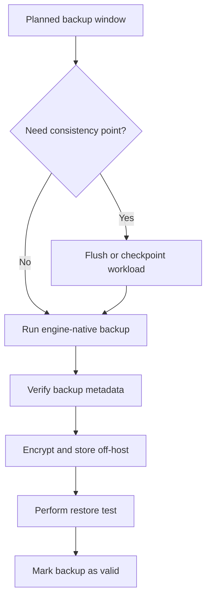

# Database Operations Reference

← Back to [12-database-essentials.md](./12-database-essentials.md)

Schema, indexing, recovery playbooks, glossary, and structured practice material.

---

## 11. Operational Appendices

These appendices turn the high-level guide into day-to-day operational playbooks.

### 11.1 Query lifecycle by engine

#### MySQL / MariaDB

1. Client sends SQL text to the server.
2. The parser validates syntax and resolves identifiers.
3. The optimizer compares plans and index choices.
4. InnoDB reads pages from buffer pool or disk.
5. Locks or MVCC rules control visibility.
6. The server returns rows and status metadata.

#### PostgreSQL

1. Client sends SQL through the wire protocol.
2. Parser and rewriter normalize the statement.
3. Planner estimates row counts and costs.
4. Executor uses MVCC snapshots to read visible tuples.
5. Buffers, WAL, and background workers support execution.
6. Results return to the client and statistics update.

#### MongoDB

1. Client sends a command or query document.
2. The query layer validates namespace and auth.
3. Indexes and collection metadata are consulted.
4. The storage engine reads documents and applies filters.
5. Replication logs the change if the operation is a write.
6. The BSON result returns to the client.

#### Redis

1. Client sends a RESP command.
2. Redis parses the command on the event loop.
3. The keyspace lookup finds the target value.
4. The in-memory structure is updated or read.
5. Persistence may append to AOF or trigger an RDB snapshot later.
6. A reply is written back over the socket.

#### Elasticsearch

1. Client sends an HTTP request.
2. The coordinating node parses the JSON DSL.
3. Relevant shards are selected and queried.
4. Shard-level results are scored or aggregated.
5. Replica and primary shard rules apply to writes.
6. The coordinating node merges results and returns JSON.

#### SQLite

1. The application opens the database file.
2. SQLite parses SQL inside the process.
3. The query planner selects indexes or table scans.
4. The pager reads pages from the database file.
5. A journal or WAL file protects transactional writes.
6. Results return directly to the calling process.

### 11.2 Schema design playbook

- Model business entities first: users, orders, invoices, sessions, products, devices, logs, and permissions.
- Write down the read paths and write paths separately.
- Identify natural keys, surrogate keys, and external IDs.
- Decide which relationships must be enforced by the database versus the application.
- Create retention rules before data volume becomes painful.
- Document who owns each table, collection, index, or pipeline.

| Question | Why it matters | Example |
|---|---|---|
| What is the primary key? | Determines uniqueness and many access paths | order_id as bigint or UUID |
| How large can rows/documents get? | Affects IO, cache efficiency, and replication | product documents with many attributes |
| Which fields are queried together? | Drives composite index design | customer_id + created_at |
| What is immutable? | Makes auditing and partitioning easier | invoice line items after finalization |
| What expires? | Controls TTL, archiving, and storage cost | sessions older than 30 days |
| What is security-sensitive? | Guides encryption and access design | PII, tokens, payroll data |

#### Relational design checklist

- Use explicit primary keys everywhere.
- Name foreign keys and indexes consistently.
- Keep data types precise: avoid generic text when a boolean, numeric, or timestamp fits better.
- Use CHECK constraints when the business rule is stable enough to enforce centrally.
- Avoid nullable columns for values that the application always requires.
- Track created_at and updated_at for operational visibility.

#### Document design checklist

- Embed small child objects when they are always read with the parent.
- Reference large or independently changing substructures.
- Avoid unbounded arrays in frequently updated documents.
- Design shard keys and indexes before write volume explodes.
- Be clear about which fields must exist even in a flexible schema.

#### Cache and key design checklist

- Use descriptive key prefixes such as `user:123:profile`.
- Set TTLs intentionally rather than leaving stale data forever.
- Decide whether cache misses should fall back to the database or fail fast.
- Avoid storing values that are too large or too hot for the chosen memory budget.
- Track hit ratio, eviction rate, and key cardinality.

### 11.3 Normalization and denormalization

Normalization improves correctness and reduces duplication; denormalization improves read performance or simplifies access patterns when applied deliberately.

| Pattern | Best use | Risk if overused |
|---|---|---|
| 1NF and 3NF tables | Transactional sources of truth | Extra joins may appear in read-heavy paths |
| Materialized summary table | Dashboards and reports | Staleness if refresh logic is weak |
| Embedded document | Read-mostly aggregates | Large writes and duplicated subdocuments |
| Precomputed cache value | Fast landing pages and hot lookups | Cache invalidation complexity |
| Search index projection | Text search and faceting | Dual-write drift if indexing pipeline breaks |

#### When to denormalize

1. The read path is far hotter than the write path.
2. The duplication can be rebuilt safely from the source of truth.
3. The business can tolerate slight staleness.
4. The team has monitoring for projection lag or refresh failures.
5. The storage overhead is acceptable compared with performance gain.

### 11.4 Index design patterns

| Pattern | Use it when | Example |
|---|---|---|
| Single-column B-tree | One filter dominates | Find user by email |
| Composite B-tree | Multiple predicates appear together | customer_id + created_at |
| Covering index | You can satisfy the query from the index alone | status + created_at + total |
| Partial index | Only a subset of rows matters | orders where status = open |
| GIN / full-text | Search inside text or JSON structures | PostgreSQL JSONB search |
| TTL index | Data should expire automatically | MongoDB session collection |
| Inverted index | Search relevance matters | Elasticsearch terms and analyzers |

#### Index review questions

1. Does the index match the WHERE clause order and selectivity?
2. Will the index help sorting and pagination?
3. Does the index duplicate another wider index?
4. What is the write penalty for every insert or update?
5. Does the optimizer actually choose the index in practice?
6. Have you measured the before and after impact?

### 11.5 Change-management patterns

#### Expand-contract migrations

1. Add the new column or structure first.
2. Deploy application code that writes both old and new representations if needed.
3. Backfill historical rows or documents in small batches.
4. Switch reads to the new representation.
5. Remove the old column only after verification and rollback planning.

#### Zero-downtime migration habits

- Avoid long blocking DDL during peak traffic.
- Batch large backfills to keep replication healthy.
- Measure lock duration in staging with production-like sizes.
- Use feature flags when application changes and schema changes must overlap.
- Keep a rollback story for both data and code.

#### Migration preflight checklist

- Recent backup exists.
- Replica lag is healthy.
- Disk free space covers temp files and index builds.
- On-call engineer knows how to pause or reverse the rollout.
- Observability dashboards are open before the change starts.

### 11.6 Backup and recovery workflow diagram

### 11.7 Disaster recovery tabletop scenarios

#### Primary host lost due to hardware failure

1. Confirm whether replicas are current enough for failover.
2. Promote the best replica or run orchestrated failover.
3. Redirect applications through DNS, VIP, or pooler.
4. Capture the failed node for forensics if possible.
5. Rebuild a new replica after service is stable.

#### Application accidentally dropped a table or collection

1. Stop destructive automation quickly.
2. Confirm last known good backup and binlog/WAL/oplog position.
3. Restore into an isolated environment first.
4. Extract only the required object or rows when possible.
5. Review permissions and deployment controls afterward.

#### Disk filled up on the database host

1. Identify which filesystem is full.
2. Remove safe temporary files or extend storage.
3. Check whether WAL, binlog, snapshots, or logs grew unexpectedly.
4. Validate database integrity after reclaiming space.
5. Add alerts and retention controls to prevent recurrence.

#### Credential leak suspected

1. Rotate the exposed credential immediately.
2. Review audit logs for unusual logins and queries.
3. Invalidate cached secrets in applications and CI/CD.
4. Issue new certificates or passwords from the secret store.
5. Document the incident and tighten least-privilege rules.

#### Replica lag spikes during a migration

1. Pause the migration or backfill job.
2. Measure write rate, IO pressure, and lock behavior.
3. Determine whether replicas are CPU-bound, disk-bound, or network-bound.
4. Catch replicas up before the next phase.
5. Adjust batch sizes and maintenance windows for the retry.

### 11.8 First 15 minutes runbooks

#### MySQL / MariaDB

1. Run `mysqladmin ping`.
2. Inspect `SHOW PROCESSLIST;` for blocked sessions.
3. Check disk space and InnoDB status.
4. Confirm replication status if replicas exist.
5. Review recent DDL or deployment events.

#### PostgreSQL

1. Run `pg_isready`.
2. Inspect `pg_stat_activity` and lock waits.
3. Check `pg_stat_replication` for lag.
4. Review `postgresql.log` for crashes or checkpoints.
5. Confirm pooler health if PgBouncer is in front.

#### MongoDB

1. Run `db.serverStatus()`.
2. Check `rs.status()` if using a replica set.
3. Verify free disk and oplog window.
4. Look for slow operations or long-running index builds.
5. Confirm the primary and secondaries are reachable.

#### Redis

1. Run `PING` and `INFO`.
2. Check memory pressure and eviction rate.
3. Confirm persistence files and last save status.
4. Review Sentinel or Cluster state if applicable.
5. Identify whether a hot key or command storm is occurring.

#### Elasticsearch

1. Query `_cluster/health`.
2. Check unassigned shards.
3. Inspect JVM heap pressure and node availability.
4. Confirm ingest pipelines or index templates were not changed badly.
5. Review disk watermarks and pending tasks.

#### SQLite

1. Check file existence and permissions.
2. Run `PRAGMA integrity_check;`.
3. Confirm the application has not placed the file on an unsafe network share.
4. Review WAL and journal files.
5. Consider whether concurrency demands exceeded SQLite's design.

### 11.9 Maintenance calendar example

| Cadence | Tasks |
|---|---|
| Daily | Backup verification, failed login review, disk free space check, replication health review |
| Weekly | Restore test, slow query review, capacity trend review, certificate expiry check |
| Monthly | Privilege audit, index review, failover rehearsal, patch planning |
| Quarterly | Architecture review, DR tabletop exercise, retention policy validation, secret rotation |
| Yearly | Major version upgrade planning, hardware refresh review, compliance evidence refresh |

### 11.10 Study and interview questions

1. What is the difference between a backup and a replica?
2. Why can a unique index be both a correctness tool and a performance tool?
3. When would you choose PostgreSQL over MySQL, and when would the reverse be true?
4. Why is Elasticsearch a poor sole system of record for financial transactions?
5. What makes Redis excellent for caches but risky as the only store for critical data?
6. How does WAL or binlog-based recovery help after a crash?
7. What does MVCC solve, and what does it not solve?
8. Why do network partitions matter more in distributed systems than on a single host?
9. What is the difference between logical and physical backups?
10. Why are partial or filtered indexes useful?
11. How does connection pooling improve reliability?
12. What is the safest way to expose a database to an administrator over the internet?
13. Why are restore tests more important than backup job success logs?
14. What signs show that SQLite has outgrown the workload?
15. How do TTLs, retention policies, and archival strategies differ?
16. Why should application accounts rarely have DDL privileges?
17. What is a shard key and why is it hard to change later?
18. What happens if your failover plan ignores replica lag?
19. Why is least privilege an operational reliability feature as well as a security feature?
20. What database type best fits search relevance, time-series rollups, and graph traversals respectively?

## 12. Glossary

- **ACID:** Atomicity, consistency, isolation, and durability transaction guarantees.
- **Arbiter:** A MongoDB voting member that does not store data.
- **Availability:** The ability of a system to return a response to requests.
- **Backup:** A copy of data that can be restored after loss or corruption.
- **B-tree:** A balanced tree index structure used by many relational engines.
- **CAP theorem:** A model describing consistency, availability, and partition-tolerance trade-offs.
- **Checkpoint:** A point where dirty data or logs are synchronized for recovery purposes.
- **Cluster:** A set of cooperating database nodes.
- **Collection:** A MongoDB grouping of documents, roughly analogous to a table.
- **Composite index:** An index on multiple columns or fields in order.
- **Connection pool:** A reusable set of open connections managed by an app or proxy.
- **Constraint:** A rule enforced by the database, such as UNIQUE or FOREIGN KEY.
- **Consistency:** In CAP, reads reflect the most recent write or an error is returned.
- **Durability:** Committed data survives failure according to the system design.
- **Failover:** Promoting or switching to a healthy node after failure.
- **Foreign key:** A relational constraint tying a child row to a parent row.
- **Full-text search:** Searching analyzed text for relevance-ranked matches.
- **GIN index:** A PostgreSQL index useful for arrays, JSONB, and full-text search.
- **High availability:** Architecture and operations designed to minimize downtime.
- **Hot key:** A frequently accessed cache key that can create imbalance.
- **Index selectivity:** How effectively an indexed value narrows down matching rows.
- **Isolation level:** A rule defining visibility behavior between concurrent transactions.
- **Journal:** A file or log used to protect or recover transactional changes.
- **Keyspace:** A namespace concept in some NoSQL systems; in Redis it often refers to the set of keys.
- **Least privilege:** Granting only the permissions required for a task.
- **MVCC:** Multi-version concurrency control; readers can see a stable snapshot while writers progress.
- **Node:** A server or process participating in a database cluster.
- **Normalization:** Reducing duplication by organizing relational data into well-structured tables.
- **Oplog:** MongoDB replication log.
- **Partition:** A horizontal slice of data or a network split between nodes, depending on context.
- **Partition tolerance:** The ability of a distributed system to continue despite network splits.
- **Primary:** The write leader in many replicated architectures.
- **Projection:** A derived copy of data shaped for a specific read path.
- **Quorum:** The minimum number of votes or nodes needed for a decision.
- **Read replica:** A node that receives replicated changes and serves read traffic.
- **Recovery point objective:** Maximum acceptable data loss window.
- **Recovery time objective:** Maximum acceptable service restoration time.
- **Replica set:** A MongoDB replication group.
- **Retention policy:** Rules controlling how long data is kept.
- **Schema:** The structure, types, and relationships of stored data.
- **Shard:** A partition of data distributed across nodes.
- **Snapshot:** A point-in-time copy of data or storage blocks.
- **Source of truth:** The authoritative data system from which other copies are derived.
- **Standby:** A replica prepared to take over as primary.
- **TLS:** Transport Layer Security for encrypted connections.
- **Transaction:** A unit of work that is committed or rolled back as one whole.
- **TTL:** Time to live; automatic expiration for cache entries or documents.
- **VACUUM:** Space reclamation or file-compaction operation, depending on engine.
- **WAL:** Write-ahead log used for crash recovery and replication in many systems.
- **Working set:** The portion of data actively used and ideally kept in memory.
- **Write amplification:** Extra physical writes caused by internal maintenance beyond the logical change.

### 13.5 Elasticsearch index operations

**Objective:** Practice search-oriented operations instead of generic database habits.

**Tasks:**
1. Create an index with explicit shard and replica settings.
2. Index sample documents.
3. Run a term query and a full-text match query.
4. Check `_cluster/health` and `_cat/shards`.
5. Take and restore a snapshot in a lab repository.

**Success criteria:**
- You can distinguish document indexing from relational writes.
- You can explain why replicas are not backups.
- You can identify cluster health colors and their meaning.

### 13.6 SQLite WAL mode and integrity checks

**Objective:** Learn the limits and strengths of embedded databases.

**Tasks:**
1. Create a local database file.
2. Enable WAL mode.
3. Open concurrent reader and writer sessions.
4. Run `.backup` and `PRAGMA integrity_check;`.
5. Move the workload to PostgreSQL on paper and identify why you would migrate.

**Success criteria:**
- You understand how SQLite handles local concurrency.
- You know how to back it up safely.
- You can articulate when a server database is the better choice.

### 13.7 Suggested weekly practice rotation

| Week | Focus area | Deliverable |
|---|---|---|
| Week 1 | Install and local connectivity | CLI connection screenshots or command transcript |
| Week 2 | Remote access and TLS | Working tunnel or TLS-enabled connection |
| Week 3 | Backup and restore | Successful restore into a clean target |
| Week 4 | Monitoring and failover | Short runbook and observed metrics |
| Week 5 | Security review | Least-privilege matrix per application |
| Week 6 | Containers | Compose stack with persistent volumes |

### 13.8 Cross-engine mastery checklist

- I can install the engine on Linux and start the service.
- I know the default port and how to restrict it with a firewall.
- I can create a database or equivalent namespace and a non-admin user.
- I can connect locally and remotely using CLI tools.
- I can enable or describe TLS for the engine.
- I can take a backup and perform a restore test.
- I can check basic health, storage, and replication status.
- I can explain one good use case and one anti-pattern for the engine.
- I know whether the engine is a source of truth, cache, index, or embedded store in my architecture.
- I have documented the first-response commands for an outage.
