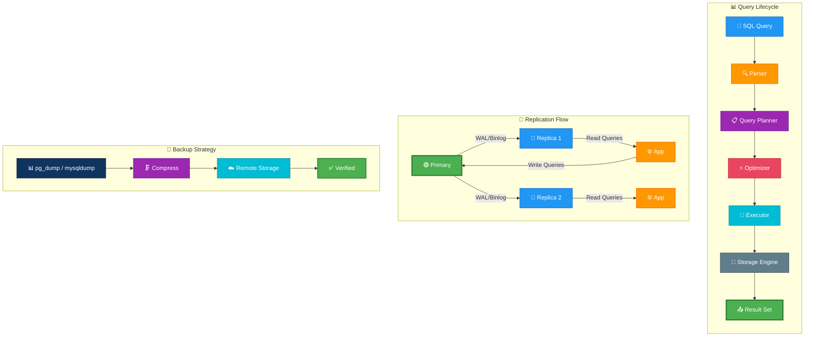

# Databases on Linux

---

## 🎬 Database Operations — Animated Workflow

---

This guide has been split into smaller, topic-focused files for easier navigation.

## Table of Contents

1. [Fundamentals](01-fundamentals.md) — RDBMS vs NoSQL, ACID, CAP, architecture patterns, and stack-selection examples
2. [MySQL / MariaDB](02-mysql-mariadb.md) — Install, config, users, replication, tuning, backup, HA, and command cookbook
3. [PostgreSQL](03-postgresql.md) — Install, config, replication, tuning, backup, extensions, HA, and command cookbook
4. [MongoDB](04-mongodb.md) — Install, CRUD, replica sets, sharding, backup, and operations guidance
5. [Redis](05-redis.md) — Install, data types, persistence, replication, Sentinel, Cluster, and operations guidance
6. [Elasticsearch](06-elasticsearch.md) — Install, indexes, mapping, queries, cluster operations, snapshots, and ELK/EFK guidance
7. [SQLite](07-sqlite.md) — When to use it, CLI basics, backup, WAL mode, and performance tips
8. [Administration](08-administration.md) — Monitoring, pooling, migrations, backups, performance, Linux playbooks, and operational references
9. [Security](09-security.md) — Auth, encryption, secret handling, SQL injection prevention, and audit guidance
10. [Containers](10-containers.md) — Docker, Compose, Kubernetes StatefulSets, operators, and container backup concerns
11. [Troubleshooting](11-troubleshooting.md) — Connection issues, slow queries, replication lag, corruption recovery, and runbook summaries
