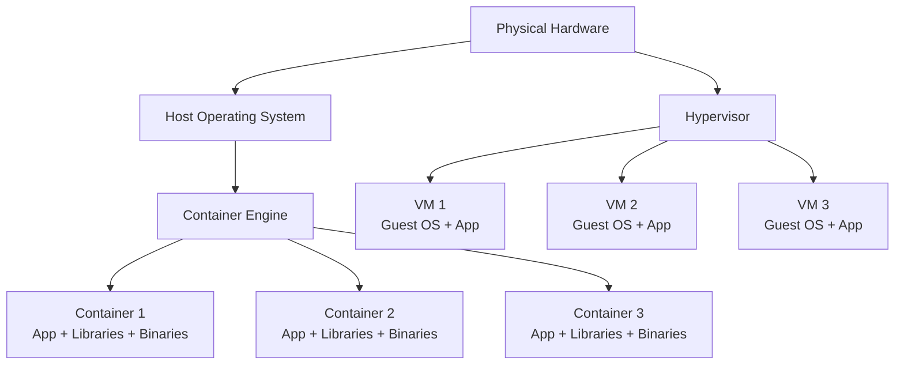

# 1. Container Fundamentals

> **📌 Disclaimer**: Any third-party logos, screenshots, or diagrams referenced in this document are used for educational purposes only. All trademarks belong to their respective owners.


## 1.1 What Is a Container?

A container is a lightweight, isolated execution environment that packages:

- An application
- Its runtime
- Its libraries
- Its dependencies
- Its configuration

Unlike a virtual machine, a container does **not** include a full guest operating system kernel.
Containers share the host kernel while isolating processes, filesystems, networking, and resources.

A practical definition:

- A container is a process or set of processes
- Running with Linux kernel isolation primitives
- Often using a layered filesystem
- Often packaged as an OCI-compatible image

Containers are popular because they:

- Improve portability
- Reduce “works on my machine” problems
- Start quickly
- Use fewer resources than VMs
- Simplify CI/CD and deployment pipelines

## 1.2 Why Containers Exist

Before containers, teams often deployed applications directly on servers.
That created problems:

- Dependency conflicts between apps
- Environment drift between dev, test, and prod
- Hard rollbacks
- Difficult scaling
- Long provisioning times

Containers address these issues by standardizing the application package and its runtime environment.

## 1.3 Core Container Properties

A good containerized workload usually has these characteristics:

| Property | Meaning | Why It Matters |
|---|---|---|
| Isolated | Separated process, network, and mount view | Limits interference between workloads |
| Portable | Runs consistently across systems with compatible runtimes | Simplifies deployment |
| Immutable | Image contents do not change at runtime | Predictable behavior |
| Ephemeral | Containers can be replaced instead of patched in place | Safer operations |
| Declarative | Built and run from code/config | Easier automation |

## 1.4 Container vs Virtual Machine

### 📸 Containers vs Virtual Machines

> *Source: Wikimedia Commons — Container vs VM architecture comparison*

Containers and VMs both provide isolation, but they operate at different layers.

### Containers

- Share the host kernel
- Package application + userspace dependencies
- Start fast
- Usually smaller images
- Higher density on the same hardware

### Virtual Machines

- Virtualize hardware
- Each VM runs its own guest OS kernel
- Stronger isolation boundary in many cases
- Heavier footprint
- Slower startup

## 1.5 Container vs VM Comparison Table

| Area | Containers | Virtual Machines |
|---|---|---|
| Isolation layer | OS-level | Hardware-level via hypervisor |
| Kernel | Shared with host | Separate guest kernel per VM |
| Startup time | Seconds or less | Seconds to minutes |
| Image size | Often MB to low GB | Often GBs |
| Density | High | Lower |
| Portability | Very good within compatible architectures/kernels | Good but heavier |
| Security boundary | Good but kernel-sharing matters | Usually stronger boundary |
| Use cases | Microservices, CI, batch jobs, dev environments | Full OS isolation, legacy apps, strong tenancy |

## 1.6 Mermaid Diagram: Container vs VM Architecture



## 1.7 What Containers Are Not

Containers are not:

- Magic security boundaries
- Replacements for good OS hardening
- Always stateless by default
- Always smaller than VMs in every workload
- Limited only to microservices

You can run many workload types in containers:

- Web services
- Batch jobs
- CI tasks
- Message consumers
- Databases in some scenarios
- Developer tooling

## 1.8 The OCI Standard

OCI stands for **Open Container Initiative**.
It defines standards that let different tools interoperate.

Key OCI specifications:

| Spec | Purpose |
|---|---|
| OCI Image Spec | Defines container image format |
| OCI Runtime Spec | Defines how a runtime should run a container |
| OCI Distribution Spec | Standardizes image distribution APIs |

Why OCI matters:

- Images built by one tool can often run in another
- Vendors can innovate without locking you into a single format
- Ecosystem tools can target shared standards

## 1.9 OCI Image Basics

An OCI image typically contains:

- Metadata
- Configuration
- One or more layers
- Content-addressable digests

Important image terms:

| Term | Meaning |
|---|---|
| Layer | Immutable filesystem delta |
| Manifest | Metadata describing layers and config |
| Digest | Content hash, usually SHA-256 |
| Tag | Human-friendly mutable name |

## 1.10 OCI Runtime Basics

The OCI runtime spec describes how a runtime launches containers.
A low-level runtime like `runc` receives a bundle and creates a container using Linux kernel features.

## 1.11 Containers as Processes

A crucial concept:

**A container is fundamentally a process on the host.**

You can often inspect container processes using normal Linux tools:

```bash
ps aux
ps -ef
pstree -a
```

This matters because debugging containers often means debugging processes, namespaces, cgroups, and mounts.

## 1.12 Images vs Containers

These terms are often confused.

| Term | Meaning |
|---|---|
| Image | Read-only template used to create containers |
| Container | Running or stopped instance created from an image |

Analogy:

- Image = class blueprint
- Container = object instance

## 1.13 Layered Filesystem Concept

Most container images use layered filesystems.
Each Dockerfile instruction can create a new layer.
At runtime, the container gets a writable layer on top.

Benefits:

- Efficient storage reuse
- Fast pulls when layers are cached
- Easier incremental builds

Trade-offs:

- Too many layers can hurt clarity
- Large layers can slow pull/push/build time
- Deleting files later does not always shrink prior layers

## 1.14 Stateless vs Stateful Containers

A common principle:

- Put mutable data outside the container writable layer
- Use volumes, bind mounts, or external services for persistence

Stateless examples:

- API services
- Frontend servers
- Workers that read/write external storage

Stateful examples:

- Databases
- Queues
- Stateful batch tools

## 1.15 Immutable Infrastructure Mindset

With containers, prefer:

- Rebuild image for changes
- Redeploy new image
- Replace old containers

Avoid:

- SSH into running containers to patch software
- Manual hot-fixes inside containers
- Treating containers like pets

## 1.16 Typical Container Workflow

1. Write application code
2. Define Dockerfile
3. Build image
4. Push image to registry
5. Run container locally or in orchestration platform
6. Monitor, update, and replace when needed

## 1.17 Common Use Cases

- Developer environments
- Continuous integration runners
- Packaging CLI tools
- Blue/green deployments
- Scalable microservices
- Reproducible data processing jobs

## 1.18 Advantages of Containers

- Fast startup
- Efficient resource usage
- Reproducible environments
- Easy dependency packaging
- Simplified deployment pipelines
- Better scaling patterns

## 1.19 Limitations of Containers

- Shared-kernel security model
- Need Linux kernel compatibility concepts
- Complex networking at scale
- Persistent storage requires careful design
- Debugging minimal images can be harder

## 1.20 When to Use Containers

Use containers when you want:

- Consistent deployment artifacts
- Automated build and release flows
- Environment isolation
- Efficient packaging of dependencies
- Scalable service deployment

## 1.21 When Not to Use Containers Blindly

Containers may not be ideal when:

- You need strong VM-level isolation for hostile multi-tenancy
- You have very low-level kernel-coupled software requirements
- The operational complexity exceeds the value for a tiny static deployment

## 1.22 Example: Running a Simple Container

```bash
docker run --rm hello-world
```

What happens conceptually:

1. Docker checks for the image locally
2. Pulls it if missing
3. Creates container metadata
4. Sets up filesystem, namespaces, cgroups, and networking
5. Starts the configured process
6. Streams output
7. Removes container when finished because of `--rm`

## 1.23 Example: Interactive Shell Container

```bash
docker run --rm -it ubuntu:24.04 bash
```

Flags explained:

| Flag | Meaning |
|---|---|
| `--rm` | Remove container after exit |
| `-i` | Keep STDIN open |
| `-t` | Allocate a pseudo-TTY |

## 1.24 Basic Terms You Must Know

| Term | Short Definition |
|---|---|
| Registry | Image storage/distribution service |
| Repository | Collection of image tags |
| Tag | Mutable image reference |
| Digest | Immutable content hash |
| Runtime | Software that runs containers |
| Namespace | Isolation primitive |
| cgroup | Resource control/accounting primitive |
| Volume | Persistent data storage mechanism |
| Entrypoint | Main process definition |

## 1.25 Container Lifecycle

Typical states:

- Created
- Running
- Paused
- Exited
- Removed

## 1.26 Why PID 1 Matters

Inside a container, the main process often becomes PID 1 in that container namespace.
PID 1 has special signal-handling and zombie-reaping behavior.
If your app is PID 1, you must think about:

- SIGTERM handling
- Graceful shutdown
- Child process reaping

## 1.27 Single Process Per Container?

Best practice often says one main concern per container.
That does **not** literally mean exactly one OS process at all times.
It means:

- One primary responsibility
- Clear lifecycle ownership
- Avoid bundling unrelated services together

## 1.28 Container Misconceptions

Misconception: containers are just lightweight VMs.

Better view:

- Containers are isolated processes with packaged userspace
- They feel VM-like operationally, but work differently technically

## 1.29 Production Guidelines from the Start

- Pin image versions
- Use non-root users where possible
- Keep images small
- Prefer immutable deployments
- Externalize config
- Add health checks carefully
- Set CPU and memory limits
- Log to stdout/stderr

## 1.30 Summary

Containers package applications efficiently by leveraging kernel isolation and layered images.
Understanding that they are isolated processes rather than mini-VMs is the foundation for everything else in this guide.

---

# 14. Glossary

## 14.1 Terms

| Term | Definition |
|---|---|
| OCI | Open Container Initiative |
| Image | Immutable container template |
| Container | Runnable instance of an image |
| Registry | Remote image storage |
| Repository | Named collection of image tags |
| Layer | Immutable filesystem delta |
| Digest | Content-addressable hash |
| Namespace | Kernel isolation mechanism |
| cgroup | Kernel resource control/accounting mechanism |
| Capability | Fine-grained Linux privilege |
| seccomp | Syscall filtering mechanism |
| OverlayFS | Layered union filesystem |
| Rootless | Running without host-root privileges |
| Sidecar | Helper container next to main workload |
| Entrypoint | Main executable configured for container |
| Health check | Command used to judge container health |

---

# Appendix A: Extended Notes by Topic

---

## Appendix A.1 Container Fundamentals Quick Reference

- Containers share the host kernel
- Images are immutable templates
- Containers are isolated processes
- OCI enables interoperability
- Layered filesystems improve reuse

---

# Appendix B: 250 Practical Q&A Items

---

## B.1 Fundamentals Q&A

### Q1. What is the main difference between a container and a VM?
A1. A container shares the host kernel; a VM runs its own guest kernel.

### Q2. Why are containers usually faster to start?
A2. They do not boot a full guest OS.

### Q3. Are containers always more secure than VMs?
A3. Not necessarily; containers share the host kernel, so the security model differs.

### Q4. What standard defines container image format interoperability?
A4. The OCI image spec.

### Q5. Is an image the same as a container?
A5. No. An image is a template; a container is an instance.

### Q6. Why are containers described as immutable?
A6. Because images are built once and ideally replaced rather than modified in place.

### Q7. What is a registry?
A7. A service that stores and distributes container images.

### Q8. What is a tag?
A8. A mutable label that points to an image.

### Q9. Why are digests more reproducible than tags?
A9. A digest identifies exact content, while a tag can be moved.

### Q10. What does OCI stand for?
A10. Open Container Initiative.

### Q11. Why do containers help reduce “works on my machine” issues?
A11. They package dependencies and runtime consistently.

### Q12. Is a container just one process?
A12. Usually one main concern, but there can be multiple processes.

### Q13. What is PID 1 inside a container?
A13. The main process in that PID namespace.

### Q14. Why does PID 1 need special attention?
A14. It handles signals and zombie reaping differently.

### Q15. What is layered filesystem storage?
A15. A model where image layers stack to form the runtime view.

### Q16. What is copy-on-write?
A16. Modifying a lower-layer file creates a copy in the writable layer.

### Q17. Why should mutable data live outside the container layer?
A17. Because container writable layers are ephemeral and operationally awkward for persistence.

### Q18. What is immutable infrastructure in the container world?
A18. Rebuilding and redeploying artifacts instead of patching them in place.

### Q19. What kind of workloads fit containers well?
A19. Web apps, APIs, workers, CI jobs, and many batch workloads.

### Q20. Do containers eliminate the need to understand Linux?
A20. No; deep troubleshooting often requires Linux knowledge.
