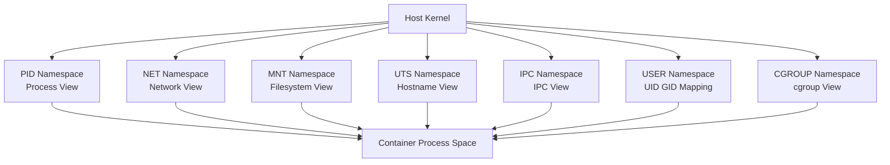

# 2. Linux Kernel Features

## 2.1 Why Kernel Features Matter

Containers are enabled by Linux kernel primitives.
Docker and other runtimes orchestrate these primitives; they do not invent isolation from scratch.

The most important container-related kernel features are:

- Namespaces
- cgroups
- Capabilities
- seccomp
- Union/overlay filesystems
- LSMs such as AppArmor and SELinux

## 2.2 Namespaces Overview

Namespaces provide isolated views of system resources.
Each namespace type isolates a specific aspect of the system.

Main namespace types used by containers:

| Namespace | Purpose |
|---|---|
| PID | Process ID isolation |
| NET | Network stack isolation |
| MNT | Mount point isolation |
| UTS | Hostname and domain isolation |
| IPC | Inter-process communication isolation |
| USER | User/group ID mapping |
| CGROUP | cgroup view isolation |

## 2.3 PID Namespace

A PID namespace gives a container its own process numbering space.
Inside the container, the main process may appear as PID 1.

Benefits:

- Process lists are isolated
- Signals and supervision behave more predictably inside the container

Example concept:

- Host sees container process as PID 12345
- Container sees same process as PID 1

## 2.4 NET Namespace

A network namespace provides isolated network devices, routes, firewall rules, and ports.
Each container can have its own:

- Interfaces
- IP addresses
- Routing table
- ARP table
- iptables/nftables view

This is why multiple containers can each listen on port 80 internally.

## 2.5 MNT Namespace

The mount namespace isolates filesystem mount points.
A container can see its own root filesystem and mounted volumes without exposing all host mounts.

## 2.6 UTS Namespace

The UTS namespace isolates hostname and NIS domain name.
A container can have its own hostname independent of the host.

## 2.7 IPC Namespace

The IPC namespace isolates System V IPC and POSIX message queues/shared memory objects.
This helps prevent unrelated workloads from interfering through shared IPC resources.

## 2.8 USER Namespace

User namespaces map container user IDs to host user IDs.
This is foundational for rootless containers and stronger privilege separation.

Example:

- Container UID 0 may map to an unprivileged host UID range
- Container “root” is not host root

## 2.9 CGROUP Namespace

The cgroup namespace isolates the view of cgroup paths.
This is more about visibility and consistency than the primary enforcement itself.

## 2.10 Mermaid Diagram: Namespace Isolation Layers



## 2.11 cgroups Overview

Control groups, or cgroups, control and measure resource usage.
They are essential for:

- CPU limits
- Memory limits
- I/O controls
- Process count limits
- Accounting and monitoring

Without cgroups, containers would isolate views but not necessarily constrain resource consumption.

## 2.12 What cgroups Can Control

Typical resources:

| Resource | Example Control |
|---|---|
| CPU | Shares, quotas, cpuset |
| Memory | Hard limit, swap behavior |
| PIDs | Max process count |
| Block I/O | Weight or throttling |
| Huge pages | Reservation/limits |

## 2.13 cgroups v1 vs v2

cgroups v1 and v2 differ significantly.
Modern Linux distributions increasingly prefer v2.

### cgroups v1

- Multiple independent hierarchies
- Separate controllers often mounted separately
- More fragmented model

### cgroups v2

- Unified hierarchy
- More consistent semantics
- Better delegation model
- Preferred for many modern systems

## 2.14 cgroups v1 vs v2 Table

| Feature | v1 | v2 |
|---|---|---|
| Hierarchy | Multiple | Unified |
| Controller model | Independent | Unified and stricter |
| Delegation | Harder | Improved |
| Modern recommendation | Legacy but still common | Preferred when supported |

## 2.15 Memory Limits

Memory control is one of the most important production settings.
Without memory limits:

- A container may exhaust host memory
- The kernel OOM killer may terminate arbitrary processes

Example Docker run:

```bash
docker run --memory=512m --memory-swap=1g nginx:stable
```

## 2.16 CPU Limits

You can constrain CPU access using quotas or shares.

Examples:

```bash
docker run --cpus=1.5 nginx:stable
```

```bash
docker run --cpu-shares=512 nginx:stable
```

Use cases:

- Prevent noisy neighbors
- Reserve performance-sensitive capacity
- Improve fairness

## 2.17 PID Limits

PID limits prevent fork bombs and runaway process creation.

```bash
docker run --pids-limit=200 myapp:latest
```

## 2.18 Capabilities Overview

Traditional Unix has a binary model:

- Root can do almost everything
- Non-root can do much less

Linux capabilities split root privileges into fine-grained units.
This lets runtimes drop dangerous privileges while keeping only what an app needs.

## 2.19 Common Linux Capabilities

| Capability | Meaning |
|---|---|
| `CAP_NET_BIND_SERVICE` | Bind to ports below 1024 |
| `CAP_NET_ADMIN` | Change network configuration |
| `CAP_SYS_ADMIN` | Very broad administrative power |
| `CAP_CHOWN` | Change file ownership |
| `CAP_SETUID` | Set user IDs |
| `CAP_SETGID` | Set group IDs |

## 2.20 Capability Best Practice

- Drop all capabilities you do not need
- Avoid privileged containers
- Add back only specific capabilities when required

Example:

```bash
docker run --cap-drop=ALL --cap-add=NET_BIND_SERVICE myweb:latest
```

## 2.21 Why `CAP_SYS_ADMIN` Is Dangerous

`CAP_SYS_ADMIN` is often called the “new root” because it unlocks many sensitive kernel operations.
Grant it only when absolutely necessary.

## 2.22 seccomp Overview

seccomp filters restrict which syscalls a process can make.
This reduces kernel attack surface.

Container engines often provide a default seccomp profile that blocks risky syscalls.

Benefits:

- Defense in depth
- Limits exploit options
- Helps enforce least privilege

## 2.23 seccomp Modes

At a high level:

- Strict mode: very restrictive
- Filter mode: BPF-based syscall filtering

In practice, container runtimes typically use filter-based profiles.

## 2.24 Example seccomp Use

```bash
docker run --security-opt seccomp=default.json myapp:latest
```

You can also disable it, but that is rarely recommended:

```bash
docker run --security-opt seccomp=unconfined myapp:latest
```

## 2.25 AppArmor and SELinux

These are Linux Security Modules that provide mandatory access control.
They can restrict:

- File access
- Network access
- Capabilities
- Process interactions

Container security on many systems relies on these controls in addition to namespaces and cgroups.

## 2.26 Overlay Filesystem Overview

Overlay filesystems make image layering practical.
A common Linux implementation is `overlay2`.

Conceptually:

- Lower layers are read-only image layers
- Upper layer is container writable layer
- Merged view is presented as container filesystem

## 2.27 Why Overlay Filesystems Matter

They enable:

- Layer reuse across images
- Efficient image pulls
- Faster builds with caching
- Minimal duplication of unchanged files

## 2.28 Overlay Filesystem Terms

| Term | Meaning |
|---|---|
| Lowerdir | Read-only base layers |
| Upperdir | Writable container layer |
| Workdir | Internal overlay work area |
| Merged | Unified view presented to container |

## 2.29 Copy-on-Write Behavior

If a container modifies a file from a lower read-only layer:

1. The file is copied into the upper writable layer
2. Changes apply there
3. Lower layer remains unchanged

This is copy-on-write.

## 2.30 Whiteouts

When files are deleted from upper layers, special markers called whiteouts may hide files from lower layers.
This explains why deleting files in later Dockerfile layers does not necessarily shrink earlier layer storage.

## 2.31 Mount Propagation Considerations

Advanced storage and nested container scenarios may require understanding mount propagation modes:

- private
- shared
- slave
- recursive variants

This matters more in Kubernetes, privileged debugging, and advanced bind mount setups.

## 2.32 User Namespaces and Rootless Containers

Rootless containers rely on user namespaces to avoid host-root privileges.
This improves safety but can add constraints around:

- Port binding
- Filesystem permissions
- Some networking modes
- Device access

## 2.33 Inspecting Namespaces on Linux

Useful commands:

```bash
lsns
```

```bash
readlink /proc/<pid>/ns/*
```

```bash
nsenter --target <pid> --mount --uts --ipc --net --pid
```

## 2.34 Inspecting cgroups

Useful paths and commands:

```bash
mount | grep cgroup
```

```bash
cat /proc/self/cgroup
```

```bash
systemd-cgls
```

## 2.35 Why Containers Need Multiple Layers of Control

No single primitive is enough.

- Namespaces isolate views
- cgroups constrain resources
- Capabilities reduce privilege
- seccomp filters syscalls
- LSMs constrain access further
- Overlay filesystems provide packaging efficiency

## 2.36 Example Mental Model

Think of a container as:

- A process tree
- In isolated namespaces
- Attached to resource-controlled cgroups
- Running with filtered privileges
- Seeing a merged layered filesystem

## 2.37 Common Kernel-Feature Failures

- Container cannot bind to low port due to missing capability
- App crashes under seccomp because it needs blocked syscall
- Rootless container cannot access host-owned files
- OOM kill due to tight memory limit
- Mount visibility issues due to namespace/propagation configuration

## 2.38 Production Recommendations

- Prefer cgroups v2 on modern hosts when compatible
- Use default seccomp and LSM profiles unless you have a reason not to
- Avoid privileged mode
- Limit CPU, memory, and pids
- Understand how your storage driver works

## 2.39 Summary

Linux containers are built on kernel features, not magic.
Understanding namespaces, cgroups, capabilities, seccomp, and overlay filesystems turns container behavior from mysterious to debuggable.

---

## Appendix A.2 Kernel Features Quick Reference

- Namespaces isolate views
- cgroups control resources
- Capabilities split root privileges
- seccomp filters syscalls
- OverlayFS enables layered images

---

## B.2 Linux Kernel Q&A

### Q21. What kernel feature isolates process IDs?
A21. The PID namespace.

### Q22. What isolates network interfaces and routes?
A22. The NET namespace.

### Q23. What isolates mount points?
A23. The MNT namespace.

### Q24. What isolates hostnames?
A24. The UTS namespace.

### Q25. What isolates IPC resources?
A25. The IPC namespace.

### Q26. What maps container IDs to host IDs?
A26. The USER namespace.

### Q27. What enforces CPU and memory limits?
A27. cgroups.

### Q28. What is the difference between cgroups and namespaces?
A28. Namespaces isolate views; cgroups constrain and account for resources.

### Q29. Why are capabilities useful?
A29. They split root privilege into smaller units.

### Q30. What does seccomp do?
A30. It filters syscalls to reduce kernel attack surface.

### Q31. Why is `CAP_SYS_ADMIN` dangerous?
A31. It grants broad administrative powers and is often treated as near-root.

### Q32. What does OverlayFS provide?
A32. Efficient layered filesystem support.

### Q33. Why can deleting files in later layers fail to shrink the image?
A33. Because earlier layers still contain the data.

### Q34. What is cgroups v2 known for?
A34. A unified hierarchy and improved consistency.

### Q35. What can `--pids-limit` protect against?
A35. Fork bombs and runaway process creation.

### Q36. Why do rootless containers rely on user namespaces?
A36. To map container root to unprivileged host IDs.

### Q37. What tool can list namespaces?
A37. `lsns`.

### Q38. What tool can enter another process's namespaces?
A38. `nsenter`.

### Q39. Are AppArmor and SELinux the same as seccomp?
A39. No; they are broader mandatory access control systems.

### Q40. Why do containers need multiple kernel features together?
A40. No single feature provides full isolation, control, and hardening.

---

# Appendix F: Minimal Reference Tables

---

## F.1 Namespace Summary

| Namespace | Isolates |
|---|---|
| PID | Process IDs |
| NET | Network stack |
| MNT | Mount points |
| UTS | Hostname/domain |
| IPC | IPC objects |
| USER | UID/GID mappings |
| CGROUP | cgroup view |
