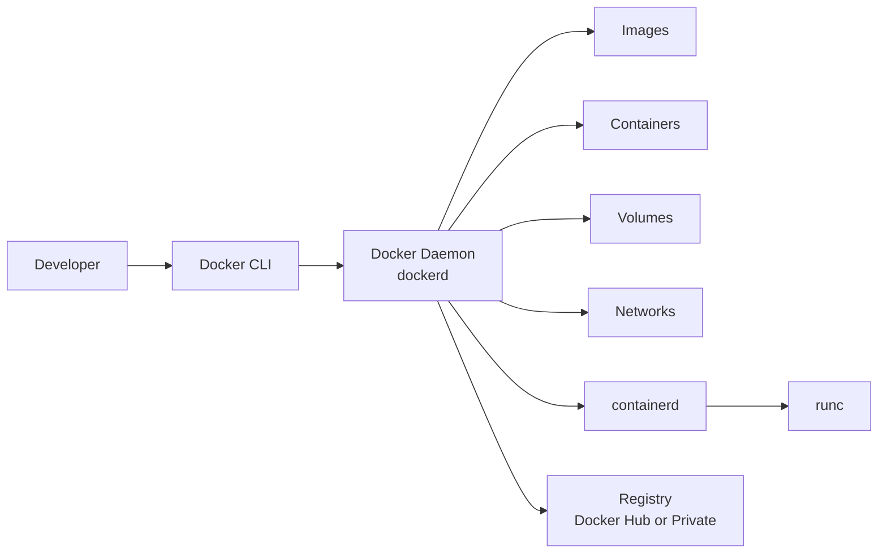

# 3. Docker

## 3.1 What Is Docker?

Docker is a platform and ecosystem for building, shipping, and running containers.
It popularized developer-friendly container workflows through:

- Docker CLI
- Docker Engine
- Dockerfile
- Registry integration
- Compose

Docker is not the only container tool, but it remains the most widely recognized.

## 3.2 Docker Components at a Glance

| Component | Role |
|---|---|
| Docker CLI | User-facing command tool |
| Docker Engine | Daemon/API that manages containers |
| Dockerfile | Image build recipe |
| Docker Hub or registry | Stores and distributes images |
| BuildKit | Modern image build backend |

## 3.3 Docker Architecture

### 📸 Docker Architecture

> *Docker — Build, ship, run containers*

Docker typically follows a client-server model.

- CLI sends commands
- Daemon performs image/container operations
- Registry stores images

## 3.4 Mermaid Diagram: Docker Architecture



## 3.5 Docker Engine Internals Simplified

Modern Docker Engine commonly uses:

- `dockerd` for management/API
- `containerd` for container lifecycle management
- `runc` as low-level OCI runtime

## 3.6 Docker Installation on Ubuntu

Example approach using Docker's package repository:

```bash
sudo apt-get update
sudo apt-get install -y ca-certificates curl gnupg
sudo install -m 0755 -d /etc/apt/keyrings
curl -fsSL https://download.docker.com/linux/ubuntu/gpg | sudo gpg --dearmor -o /etc/apt/keyrings/docker.gpg
sudo chmod a+r /etc/apt/keyrings/docker.gpg
echo \
  "deb [arch=$(dpkg --print-architecture) signed-by=/etc/apt/keyrings/docker.gpg] https://download.docker.com/linux/ubuntu \
  $(. /etc/os-release && echo "$VERSION_CODENAME") stable" | \
  sudo tee /etc/apt/sources.list.d/docker.list > /dev/null
sudo apt-get update
sudo apt-get install -y docker-ce docker-ce-cli containerd.io docker-buildx-plugin docker-compose-plugin
```

## 3.7 Post-Install Steps

Add your user to the `docker` group if appropriate:

```bash
sudo usermod -aG docker $USER
newgrp docker
```

Caution:

- Membership in the `docker` group effectively grants root-equivalent access on many systems
- Prefer rootless Docker where security requirements demand it

## 3.8 Verify Docker Installation

```bash
docker version
```

```bash
docker info
```

```bash
docker run --rm hello-world
```

## 3.9 Common Docker Objects

| Object | Description |
|---|---|
| Image | Immutable template |
| Container | Runnable instance of image |
| Volume | Managed persistent storage |
| Network | Connectivity abstraction |
| Registry | Remote image storage |
| Context | Named target endpoint for Docker CLI |

## 3.10 Docker Images

Images are the blueprint for containers.
They contain:

- Base OS userspace or minimal runtime
- App binaries
- Dependencies
- Metadata

Useful commands:

```bash
docker image ls
```

```bash
docker image inspect nginx:stable
```

```bash
docker pull alpine:3.20
```

## 3.11 Tags vs Digests

Tags are convenient but mutable.
Digests are immutable content references.

Examples:

```bash
docker pull nginx:1.27
```

```bash
docker pull nginx@sha256:<digest>
```

Production guidance:

- Prefer digests for strict reproducibility
- Use carefully controlled tags in CI/CD when needed

## 3.12 Docker Containers

A container is created from an image and runs a configured command.

Basic commands:

```bash
docker container ls
```

```bash
docker container ls -a
```

```bash
docker run -d --name web nginx:stable
```

```bash
docker stop web
```

```bash
docker rm web
```

## 3.13 `docker run` Anatomy

A typical `docker run` command may define:

- Name
- Detached or interactive mode
- Port mappings
- Environment variables
- Volumes
- Network
- Resource limits
- User
- Security options

Example:

```bash
docker run -d \
  --name api \
  -p 8080:8080 \
  --memory=512m \
  --cpus=1 \
  --read-only \
  --tmpfs /tmp \
  -e APP_ENV=production \
  myorg/api:1.0.0
```

## 3.14 Detached vs Foreground Mode

| Mode | Use Case |
|---|---|
| Foreground | Interactive testing, one-shot commands |
| Detached | Background services |

Commands:

```bash
docker run --rm ubuntu:24.04 echo hello
```

```bash
docker run -d nginx:stable
```

## 3.15 Docker Logs

Containers should generally log to stdout/stderr.
Then use:

```bash
docker logs web
```

```bash
docker logs -f web
```

## 3.16 Docker Exec

Use `docker exec` to run commands in a running container.

```bash
docker exec -it web sh
```

Prefer this for debugging instead of SSH.

## 3.17 Restart Policies

Docker supports restart policies such as:

- `no`
- `on-failure`
- `always`
- `unless-stopped`

Example:

```bash
docker run -d --restart unless-stopped nginx:stable
```

## 3.18 Port Publishing

Port mapping syntax:

```bash
docker run -p HOST_PORT:CONTAINER_PORT nginx:stable
```

Example:

```bash
docker run -d -p 8080:80 nginx:stable
```

## 3.19 Environment Variables

Set environment variables with `-e` or `--env-file`.

```bash
docker run -e APP_ENV=prod -e LOG_LEVEL=info myapp:latest
```

```bash
docker run --env-file .env myapp:latest
```

Do not use environment variables for highly sensitive secrets unless you understand the exposure risks.

## 3.20 Volumes Overview in Docker

Docker supports:

- Named volumes
- Bind mounts
- tmpfs mounts

We cover these deeply later.

## 3.21 Networks Overview in Docker

Common drivers:

- bridge
- host
- none
- overlay
- macvlan

We cover these deeply later.

## 3.22 Docker Hub and Registries

Registries store and distribute images.
Common options:

- Docker Hub
- GitHub Container Registry
- Amazon ECR
- Google Artifact Registry
- Azure Container Registry
- Self-hosted registries

## 3.23 Registry Naming Example

```text
registry.example.com/team/myapp:1.2.3
```

Parts:

| Part | Meaning |
|---|---|
| `registry.example.com` | Registry host |
| `team/myapp` | Repository path |
| `1.2.3` | Tag |

## 3.24 Push and Pull Example

```bash
docker login registry.example.com
```

```bash
docker build -t registry.example.com/team/myapp:1.2.3 .
```

```bash
docker push registry.example.com/team/myapp:1.2.3
```

```bash
docker pull registry.example.com/team/myapp:1.2.3
```

## 3.25 Image Build Basics

```bash
docker build -t myapp:dev .
```

Important build context reminder:

- Docker sends the build context to the daemon/build backend
- Large contexts slow builds and can leak unnecessary files
- Use `.dockerignore`

## 3.26 Docker BuildKit

BuildKit is the modern build engine with improvements like:

- Better caching
- Parallel build steps
- Secret mounts
- SSH forwarding
- Build output improvements

Enable explicitly when needed:

```bash
DOCKER_BUILDKIT=1 docker build -t myapp:dev .
```

## 3.27 Docker CLI Categories

| Category | Example Commands |
|---|---|
| Build | `docker build`, `docker image build` |
| Run | `docker run`, `docker start`, `docker stop` |
| Inspect | `docker inspect`, `docker stats`, `docker logs` |
| Cleanup | `docker rm`, `docker image prune`, `docker system prune` |
| Network | `docker network ls`, `docker network inspect` |
| Volume | `docker volume ls`, `docker volume inspect` |

## 3.28 Docker Contexts

Docker contexts let the CLI target different environments.

```bash
docker context ls
```

```bash
docker context use default
```

Useful for:

- Remote engines
- Local vs cloud environments
- Multiple clusters/endpoints

## 3.29 Common Docker Workflow for Developers

1. Write code
2. Build image locally
3. Run container locally
4. Test functionality
5. Push image to registry
6. Deploy to target environment

## 3.30 Cleaning Up Docker Resources

Useful commands:

```bash
docker ps -aq
```

```bash
docker container prune
```

```bash
docker image prune
```

```bash
docker volume prune
```

```bash
docker system prune
```

Use cleanup commands carefully in shared environments.

## 3.31 Docker Info Worth Checking

`docker info` reveals:

- Storage driver
- cgroup version
- Rootless mode
- Logging driver
- Security options
- Default runtimes

## 3.32 Docker Desktop vs Docker Engine

Docker Desktop is a packaged desktop experience for macOS/Windows/Linux.
Docker Engine is the Linux server/daemon foundation.
In Linux server environments, Engine is usually the more relevant layer.

## 3.33 Common Mistakes with Docker

- Using `latest` everywhere
- Running everything as root
- Putting secrets in images
- Ignoring health and shutdown behavior
- Shipping giant build contexts
- Treating containers like mutable servers

## 3.34 Summary

Docker makes container workflows accessible by combining build, distribution, and runtime management into a cohesive toolchain.

---

## Appendix A.3 Docker Quick Reference

- `dockerd` manages lifecycle
- CLI talks to daemon
- Registry stores images
- BuildKit improves builds

---

## B.3 Docker Q&A

### Q41. What daemon usually powers Docker Engine?
A41. `dockerd`.

### Q42. What runtime manager commonly sits under Docker?
A42. `containerd`.

### Q43. What low-level runtime commonly executes OCI containers?
A43. `runc`.

### Q44. What command verifies Docker installation quickly?
A44. `docker run --rm hello-world`.

### Q45. What command lists running containers?
A45. `docker ps`.

### Q46. What command lists all containers including exited ones?
A46. `docker ps -a`.

### Q47. What command runs a container in detached mode?
A47. `docker run -d ...`.

### Q48. What command shows container logs?
A48. `docker logs <name>`.

### Q49. What command runs a command inside a running container?
A49. `docker exec`.

### Q50. What command inspects container low-level config?
A50. `docker inspect`.

### Q51. What does `--rm` do in `docker run`?
A51. It removes the container after it exits.

### Q52. Why should you avoid `latest` in production?
A52. It is mutable and harms reproducibility.

### Q53. What is BuildKit?
A53. Docker's modern build backend with better caching and build features.

### Q54. Why is the `docker` group security-sensitive?
A54. Because it often grants root-equivalent control over the daemon.

### Q55. What command shows Docker daemon and environment info?
A55. `docker info`.

### Q56. What does `docker image ls` show?
A56. Local images.

### Q57. What does `docker container prune` do?
A57. Removes stopped containers.

### Q58. What command shows real-time container resource usage?
A58. `docker stats`.

### Q59. Why use a registry?
A59. To share and deploy images across systems.

### Q60. What is the relationship between CLI and daemon?
A60. The CLI sends requests to the daemon API.
