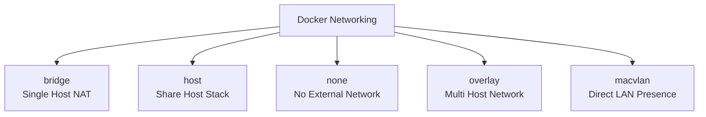

# 5. Docker Networking

## 5.1 Networking Overview

Docker networking determines how containers communicate:

- With each other
- With the host
- With external systems

Docker abstracts networking through drivers and network objects.

## 5.2 Common Network Drivers

| Driver | Typical Use |
|---|---|
| bridge | Default single-host container networking |
| host | Share host network stack |
| none | No networking |
| overlay | Multi-host swarm-style networking |
| macvlan | Direct attachment to physical network |

## 5.3 Default Bridge Network

When you run a container without specifying a network, Docker usually connects it to the default bridge network.

Characteristics:

- NAT to outside world
- Basic isolation
- Less ideal than user-defined bridge for service discovery

## 5.4 User-Defined Bridge Networks

A user-defined bridge network is often better than the default bridge.

Benefits:

- Built-in DNS resolution by container name
- Better isolation between stacks
- Easier organization

Example:

```bash
docker network create app-net
```

```bash
docker run -d --name db --network app-net postgres:16
```

```bash
docker run -d --name api --network app-net myapi:latest
```

Now `api` can often reach `db` via hostname `db`.

## 5.5 Host Network Mode

Host mode shares the host network namespace.
The container does not get its own virtual network stack.

Example:

```bash
docker run --network host myservice:latest
```

Pros:

- Low overhead
- No port publishing required

Cons:

- Reduced isolation
- Port conflicts with host services
- Less portable behavior

## 5.6 None Network Mode

`none` gives the container no network interfaces beyond loopback.
Useful for:

- Isolated batch jobs
- Strongly restricted processing
- Testing offline behavior

```bash
docker run --network none myjob:latest
```

## 5.7 Overlay Networks

Overlay networks span multiple Docker hosts, commonly in Docker Swarm environments.
They enable service-to-service connectivity across nodes.

## 5.8 Macvlan Networks

Macvlan assigns containers their own MAC addresses on the physical network.
This can make containers appear as first-class devices on the LAN.

Use cases:

- Legacy network monitoring systems
- Apps requiring direct L2 presence

Trade-offs:

- More complex setup
- Host-to-container communication may require extra configuration

## 5.9 Mermaid Diagram: Docker Network Types



## 5.10 Port Publishing and NAT

With bridge networking, Docker usually uses NAT and port publishing.

Example:

```bash
docker run -d -p 8080:80 nginx:stable
```

Meaning:

- Host port `8080`
- Container port `80`

## 5.11 Binding Addresses

You can bind only to localhost if needed:

```bash
docker run -d -p 127.0.0.1:8080:80 nginx:stable
```

This is safer than exposing to all host interfaces when only local access is required.

## 5.12 Exposed Ports vs Published Ports

| Concept | Meaning |
|---|---|
| `EXPOSE` in Dockerfile | Documentation/metadata |
| `-p` in `docker run` | Actual host port publication |

## 5.13 DNS Resolution in Docker Networks

On user-defined bridge networks, Docker provides embedded DNS.
Containers can often resolve each other by:

- Container name
- Network alias
- Service name in Compose/Swarm

## 5.14 Network Aliases

Example:

```bash
docker run -d --name postgres-db --network app-net --network-alias db postgres:16
```

Other containers on `app-net` can resolve `db`.

## 5.15 Multiple Networks per Container

A container can join multiple networks.
This is useful for network segmentation.

Example:

- Frontend joins `public-net`
- API joins both `public-net` and `private-net`
- Database joins only `private-net`

## 5.16 Example: Segmented Architecture

```bash
docker network create public-net
```

```bash
docker network create private-net
```

```bash
docker run -d --name frontend --network public-net myfrontend:latest
```

```bash
docker run -d --name api --network public-net myapi:latest
```

```bash
docker network connect private-net api
```

```bash
docker run -d --name db --network private-net postgres:16
```

## 5.17 Inspecting Networks

```bash
docker network ls
```

```bash
docker network inspect app-net
```

## 5.18 Container-to-Host Access

Methods vary by platform.
On Linux, common approaches include:

- Publishing host ports and connecting to host IP
- Special host gateway mappings
- Host network mode when appropriate

Example:

```bash
docker run --add-host=host.docker.internal:host-gateway myapp:latest
```

## 5.19 Custom Subnets

You can define custom IPAM settings.

```bash
docker network create \
  --driver bridge \
  --subnet 172.28.0.0/16 \
  --gateway 172.28.0.1 \
  custom-net
```

Use with caution to avoid subnet overlap.

## 5.20 IPv6 Considerations

Docker can be configured for IPv6, but this requires deliberate daemon/network configuration.
Ensure your infrastructure and firewall policies actually support it.

## 5.21 Name Resolution Order

Inside containers, name resolution may involve:

- `/etc/hosts`
- Embedded Docker DNS
- Upstream resolvers configured by the engine

Understanding this helps debug strange DNS issues.

## 5.22 Common Networking Problems

- App listening on `127.0.0.1` inside container instead of `0.0.0.0`
- Port published incorrectly
- Using default bridge and expecting automatic DNS by container name
- Firewall blocking host port
- Conflicting subnets
- Wrong network attachment

## 5.23 Example: App Must Listen on All Interfaces

Bad application config in container:

```text
listen=127.0.0.1:8080
```

Better:

```text
listen=0.0.0.0:8080
```

## 5.24 Testing Connectivity

Useful tools:

```bash
docker exec -it api sh
```

```bash
ping db
```

```bash
nc -zv db 5432
```

```bash
curl http://api:8080/health
```

Minimal images may not include these tools, so you may use debug sidecars or temporary diagnostics containers.

## 5.25 Advanced: Internal Networks

Compose supports internal networks where external connectivity is restricted.
This reduces accidental exposure for sensitive back-end services.

## 5.26 Service Discovery Strategy

Recommended patterns:

- Use service names, not hardcoded IPs
- Keep application config environment-driven
- Avoid assumptions about static container IPs

## 5.27 Security Guidance for Networking

- Publish only required ports
- Bind sensitive ports to localhost or private interfaces when possible
- Segment networks by trust zone
- Avoid host network mode unless needed
- Audit exposed surfaces regularly

## 5.28 Summary

Docker networking combines Linux namespace isolation with virtual networking abstractions.
Using user-defined networks, proper port binding, and service-name-based discovery leads to cleaner and safer deployments.

---

## Appendix A.5 Networking Quick Reference

- Prefer user-defined bridge networks
- Use service names instead of IPs
- Publish only needed ports
- Segment networks by trust boundary

---

## B.5 Networking Q&A

### Q81. What is the default single-host network driver?
A81. Bridge.

### Q82. Why prefer a user-defined bridge network over the default bridge?
A82. Better service discovery and cleaner isolation.

### Q83. What does host mode do?
A83. Shares the host network namespace.

### Q84. What does `none` mode do?
A84. Disables external networking for the container.

### Q85. What is overlay networking used for?
A85. Multi-host networking, commonly in Swarm.

### Q86. What is macvlan used for?
A86. Giving containers direct L2 presence on the physical network.

### Q87. What does `-p 8080:80` mean?
A87. Host port 8080 maps to container port 80.

### Q88. Does `EXPOSE 80` publish port 80?
A88. No.

### Q89. Why must an app listen on `0.0.0.0` inside a container?
A89. So it is reachable via the container network interface, not only loopback.

### Q90. How do containers resolve service names on a user-defined network?
A90. Through Docker's embedded DNS.

### Q91. Can a container join multiple networks?
A91. Yes.

### Q92. Why avoid hardcoded container IPs?
A92. They are not stable and hurt portability.

### Q93. What command lists networks?
A93. `docker network ls`.

### Q94. What command inspects a network?
A94. `docker network inspect <name>`.

### Q95. What is a network alias?
A95. An alternate DNS name for a container on a network.

### Q96. Why bind ports to `127.0.0.1` sometimes?
A96. To limit exposure to the local host only.

### Q97. What is a common reason published ports still fail?
A97. The app is listening only on `127.0.0.1` inside the container.

### Q98. Why can firewall rules still matter with Docker?
A98. Because host-level packet filtering can block traffic to published ports.

### Q99. What does a segmented network design achieve?
A99. Reduced exposure between tiers.

### Q100. Why is service-name-based discovery recommended?
A100. It decouples applications from unstable addressing.
