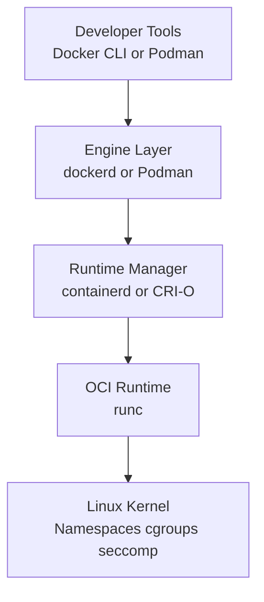

# 8. Container Runtimes

## 8.1 Why Container Runtimes Matter

The container ecosystem has multiple layers.
Docker is not the only runtime interface.
Modern systems often involve specialized components.

## 8.2 Runtime Stack Overview

At a high level:

- High-level tools manage UX and lifecycle
- Mid-level runtimes manage images and containers
- Low-level runtimes talk to the kernel

## 8.3 Key Tools and Runtimes

| Component | Category | Purpose |
|---|---|---|
| `runc` | Low-level OCI runtime | Creates/runs containers per OCI spec |
| `containerd` | Container runtime | Manages images, snapshots, container lifecycle |
| `CRI-O` | Kubernetes-focused runtime | Implements Kubernetes CRI |
| `Podman` | Docker-like daemonless tool | Builds and runs containers |
| `Buildah` | Build tool | Builds OCI images without requiring Docker daemon |
| `Skopeo` | Image utility | Copies/inspects images between registries |

## 8.4 `runc`

`runc` is a low-level OCI runtime.
It takes an OCI bundle and uses Linux primitives to start the container.

It is not usually the interface most developers interact with directly every day.

## 8.5 `containerd`

`containerd` is an industry-standard container runtime.
It manages:

- Image transfer/storage
- Snapshotters
- Container lifecycle
- Task execution

Docker uses `containerd` internally in common setups.
Kubernetes can also use `containerd` directly.

## 8.6 Snapshotters

Snapshotters manage filesystem snapshots/layers for containers.
Examples include overlayfs-based snapshotters.
This is part of how images become runnable root filesystems.

## 8.7 `CRI-O`

`CRI-O` is designed specifically as a Kubernetes CRI implementation.
It focuses on being:

- Lightweight
- Kubernetes-native
- OCI-compliant

## 8.8 Podman

Podman is a daemonless container engine with a Docker-like CLI.
It is popular because it:

- Works well rootless
- Integrates with systemd
- Does not require a central daemon in the same way Docker does

Basic comparison:

| Feature | Docker | Podman |
|---|---|---|
| Daemon | Usually yes | No central daemon |
| Rootless support | Good | Strong focus |
| CLI similarity | Native | Intentionally similar |

## 8.9 Buildah

Buildah focuses on building OCI images.
It is useful in automation and environments that want fine-grained image build control without relying on Docker Engine.

## 8.10 Skopeo

Skopeo works with container images and registries without necessarily pulling images into a local daemon store.
Common uses:

- Inspect image metadata
- Copy images between registries
- Sync images

## 8.11 Mermaid Diagram: Container Runtime Stack



## 8.12 Kubernetes and Runtime Evolution

Historically, Kubernetes supported Docker via dockershim.
Modern Kubernetes typically uses:

- `containerd`
- `CRI-O`

This is why understanding runtime layers beyond Docker is important.

## 8.13 OCI Compliance in Practice

OCI standards let images and runtimes interoperate.
Examples:

- Build image with Buildah
- Copy with Skopeo
- Run via Podman or containerd-backed system

## 8.14 Example: Inspect Image with Skopeo

```bash
skopeo inspect docker://docker.io/library/nginx:stable
```

## 8.15 Example: Build with Buildah

```bash
buildah bud -t myapp:latest .
```

## 8.16 Example: Run with Podman

```bash
podman run --rm -p 8080:80 nginx:stable
```

## 8.17 Rootless Runtime Benefits

Rootless/container daemonless approaches reduce attack surface by:

- Avoiding host-root daemon privileges
- Using user namespaces
- Limiting blast radius of user-level operations

## 8.18 Runtime Selection Criteria

Choose based on:

- Orchestrator requirements
- Security model
- Rootless needs
- Ecosystem compatibility
- Operational tooling
- Team skillset

## 8.19 Common Confusion to Avoid

People sometimes use “Docker” to mean any container runtime.
Technically, the stack is more nuanced.
It is better to distinguish:

- Build tool
- Engine
- Runtime manager
- Low-level runtime
- Registry tooling

## 8.20 Summary

Container runtimes form a layered ecosystem.
Docker remains important, but `containerd`, `runc`, `CRI-O`, Podman, Buildah, and Skopeo each play distinct roles in modern container platforms.

---

## B.8 Runtime Q&A

### Q141. What is `runc`?
A141. A low-level OCI runtime.

### Q142. What is `containerd`?
A142. A container runtime manager for image and lifecycle operations.

### Q143. What is `CRI-O`?
A143. A Kubernetes-focused container runtime implementing CRI.

### Q144. What is Podman known for?
A144. Docker-like daemonless containers with strong rootless support.

### Q145. What is Buildah for?
A145. Building OCI images.

### Q146. What is Skopeo for?
A146. Inspecting and copying container images across registries.

### Q147. Does Kubernetes require Docker Engine today?
A147. No; modern clusters usually use `containerd` or `CRI-O`.

### Q148. Why does OCI matter in runtime tooling?
A148. It enables interoperability across build and runtime tools.

### Q149. What is a snapshotter?
A149. A component that manages filesystem snapshots/layers.

### Q150. Why might someone choose Podman over Docker?
A150. Rootless and daemonless operation.

### Q151. Why might someone choose `containerd` directly?
A151. It integrates well with orchestration platforms and lower-level tooling.

### Q152. Why is runtime layering often hidden from users?
A152. High-level tools abstract the complexity.

### Q153. Are Docker images usually OCI-compatible today?
A153. Often yes in practical terms, though tooling details matter.

### Q154. Why is Buildah useful in CI?
A154. It can build images without requiring a Docker daemon.

### Q155. Why is Skopeo useful in air-gap or registry sync workflows?
A155. It can move images between registries without a local daemon store.

### Q156. What is CRI?
A156. Kubernetes' Container Runtime Interface.

### Q157. Can Podman often run Docker-style commands?
A157. Many commands are intentionally similar.

### Q158. What role does `runc` play compared to Docker CLI?
A158. `runc` directly launches containers; CLI is high-level UX.

### Q159. What does daemonless mean in Podman context?
A159. There is no long-lived central daemon managing all containers in the same model as Docker.

### Q160. Why should Docker users still learn about other runtimes?
A160. Modern platforms often rely on them underneath or instead.

---

## F.5 Runtime Tool Summary

| Tool | Focus |
|---|---|
| Docker | Full developer workflow |
| containerd | Runtime management |
| runc | OCI execution |
| CRI-O | Kubernetes runtime |
| Podman | Daemonless engine |
| Buildah | OCI image builds |
| Skopeo | Registry/image operations |

---
