# Linux Containers Guide

> The original monolithic containers guide has been split into focused topic files. All original content has been retained across the files below.

---

## 🎬 Container Lifecycle — Animated Workflow

```mermaid
graph TD
    subgraph BUILD["🏗️ Image Build Pipeline"]
        direction LR
        D1["📝 Dockerfile"]:::file --> D2["🔧 docker build"]:::build
        D2 --> D3["📦 Layer 1: Base"]:::layer
        D3 --> D4["📦 Layer 2: Deps"]:::layer
        D4 --> D5["📦 Layer 3: App"]:::layer
        D5 --> D6["🏷️ Tagged Image"]:::image
    end

    subgraph LIFECYCLE["🔄 Container Lifecycle"]
        direction TB
        C1["📦 Image"]:::image --> C2["🚀 docker run"]:::run
        C2 --> C3["🟢 Running"]:::running
        C3 --> C4{"Action?"}:::decision
        C4 -->|Stop| C5["🔴 Stopped"]:::stopped
        C4 -->|Exec| C6["🐚 Shell In"]:::exec
        C4 -->|Logs| C7["📋 docker logs"]:::logs
        C5 --> C8["🗑️ docker rm"]:::remove
        C5 -->|Restart| C3
    end

    subgraph NETWORK["🌐 Container Networking"]
        direction LR
        N1["🐳 Container A"]:::container --> BR["🌉 Bridge Network"]:::bridge
        N2["🐳 Container B"]:::container --> BR
        BR --> HOST["🖥️ Host Network"]:::host
        HOST --> EXT["🌍 External"]:::external
    end

    subgraph COMPOSE["🎼 Docker Compose Stack"]
        direction TB
        DC1["📝 docker-compose.yml"]:::file --> DC2["🌐 Web Service"]:::web
        DC1 --> DC3["🗄️ DB Service"]:::db
        DC1 --> DC4["⚡ Cache Service"]:::cache
        DC2 -.-> DC3
        DC2 -.-> DC4
    end

    classDef file fill:#2196F3,stroke:#1565C0,color:#fff
    classDef build fill:#FF9800,stroke:#E65100,color:#fff
    classDef layer fill:#9C27B0,stroke:#6A1B9A,color:#fff
    classDef image fill:#0f3460,stroke:#16213e,color:#fff,stroke-width:2px
    classDef run fill:#4CAF50,stroke:#2E7D32,color:#fff
    classDef running fill:#4CAF50,stroke:#2E7D32,color:#fff,stroke-width:3px
    classDef decision fill:#FF9800,stroke:#E65100,color:#fff
    classDef stopped fill:#F44336,stroke:#C62828,color:#fff
    classDef exec fill:#00BCD4,stroke:#00838F,color:#fff
    classDef logs fill:#795548,stroke:#4E342E,color:#fff
    classDef remove fill:#607D8B,stroke:#37474F,color:#fff
    classDef container fill:#0f3460,stroke:#e94560,color:#fff
    classDef bridge fill:#FF9800,stroke:#E65100,color:#fff
    classDef host fill:#607D8B,stroke:#37474F,color:#fff
    classDef external fill:#4CAF50,stroke:#2E7D32,color:#fff
    classDef web fill:#e94560,stroke:#b71c1c,color:#fff
    classDef db fill:#2196F3,stroke:#1565C0,color:#fff
    classDef cache fill:#00BCD4,stroke:#00838F,color:#fff
```

---

## Table of Contents

1. [01-fundamentals.md](01-fundamentals.md) — containers vs VMs, OCI standards, glossary, fundamentals reference, fundamentals Q&A
2. [02-kernel-features.md](02-kernel-features.md) — namespaces, cgroups, capabilities, seccomp, overlayfs, kernel reference tables
3. [03-docker-basics.md](03-docker-basics.md) — installation, architecture, images, containers, lifecycle, Docker Q&A
4. [04-dockerfile.md](04-dockerfile.md) — instructions, multi-stage builds, optimization, best practices, Dockerfile Q&A
5. [05-docker-networking.md](05-docker-networking.md) — bridge, host, overlay, macvlan, service discovery, networking Q&A
6. [06-docker-storage.md](06-docker-storage.md) — volumes, bind mounts, tmpfs, drivers, storage reference tables
7. [07-docker-compose.md](07-docker-compose.md) — Compose syntax, services, networks, volumes, profiles, Compose Q&A
8. [08-container-runtimes.md](08-container-runtimes.md) — containerd, runc, CRI-O, Podman, Buildah, Skopeo
9. [09-container-security.md](09-container-security.md) — rootless, scanning, signing, secrets, hardening, security flags
10. [10-orchestration.md](10-orchestration.md) — Docker Swarm and Kubernetes basics
11. [11-troubleshooting.md](11-troubleshooting.md) — logs, inspect, stats, nsenter, command cheat sheets, scenarios, common commands
12. [12-patterns.md](12-patterns.md) — sidecars, ambassadors, init containers, graceful shutdown, further reading, advanced checklists
