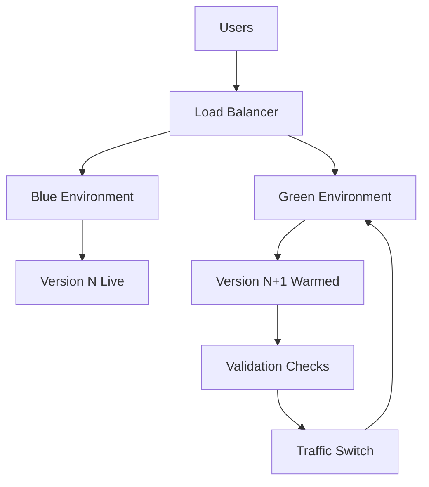
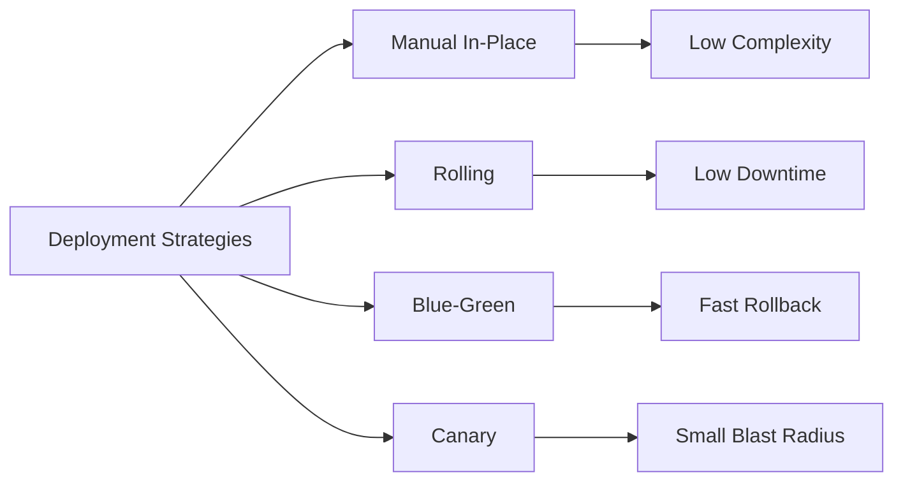

# Deployment Strategies

[Back to guide index](README.md)

## 9.1 Deployment Goals

A deployment strategy should optimize for:

- Reliability
- Repeatability
- Speed
- Rollback simplicity
- Minimal downtime
- Observability
- Controlled blast radius

## 9.2 Manual Deployment Checklist

Use this even when automation exists.

### Pre-deployment

- Confirm target version and artifact checksum
- Confirm maintenance window or traffic conditions if required
- Confirm database migration plan
- Confirm rollback plan
- Confirm secrets/config available
- Confirm disk space and memory headroom
- Confirm monitoring dashboards are ready

### Deployment

- Upload artifact
- Extract into new release directory
- Apply config symlink or environment file
- Run migrations if safe and required
- Switch symlink or update service target
- Restart or reload process manager
- Validate health checks

### Post-deployment

- Check application logs
- Check error rate
- Check latency and throughput
- Confirm background jobs are running
- Verify key business transactions
- Retain previous release for rollback

## 9.3 Release-Based Directory Strategy

A common Linux deployment layout:

```text
/opt/myapp/
├── current -> /opt/myapp/releases/2025-01-15_120000/
├── releases/
│   ├── 2025-01-10_090000/
│   └── 2025-01-15_120000/
└── shared/
    ├── config/
    ├── logs/
    └── uploads/
```

Benefits:

- Easy rollback
- Immutable release directories
- Clean separation of code and persistent data

## 9.4 Automated Deployment Script Example

```bash
#!/usr/bin/env bash
set -euo pipefail

APP_DIR=/opt/myapp
RELEASE_ID=$(date +%Y-%m-%d_%H%M%S)
RELEASE_DIR="$APP_DIR/releases/$RELEASE_ID"
ARTIFACT=/srv/deployments/myapp.tar.gz

mkdir -p "$RELEASE_DIR"
tar -xzf "$ARTIFACT" -C "$RELEASE_DIR"
ln -sfn "$APP_DIR/shared/config/.env" "$RELEASE_DIR/.env"
ln -sfn "$RELEASE_DIR" "$APP_DIR/current"
systemctl restart myapp
curl -fsS http://127.0.0.1:8080/health
```

## 9.5 Blue-Green Deployments

Blue-green deployment keeps two production environments.

- Blue is active
- Green is idle or staging the new version
- Traffic switches only after validation

Benefits:

- Near-instant rollback
- Minimal downtime
- Clear separation of old and new versions

Trade-offs:

- Requires double infrastructure capacity
- Stateful dependencies still need careful handling

## 9.6 Mermaid Diagram: Blue-Green Deployment Flow



## 9.7 Canary Deployments

Canary deployments expose a new version to a small subset of traffic first.

Example rollout steps:

- 1% traffic to canary
- 5% traffic
- 25% traffic
- 50% traffic
- 100% traffic

Benefits:

- Reduced blast radius
- Real production feedback before full rollout

Requirements:

- Traffic routing controls
- Good metrics and alerting
- Fast rollback process

## 9.8 Rolling Deployments

Rolling deployment updates instances gradually.

Example:

- Remove one instance from rotation
- Deploy new version
- Health check
- Return to rotation
- Repeat for remaining instances

Benefits:

- No need for full duplicate environment
- Lower resource overhead than blue-green

Trade-offs:

- Mixed-version fleet during rollout
- Harder rollbacks if incompatible changes exist

## 9.9 Zero-Downtime Deployments

Zero-downtime goals require:

- Multiple instances
- Load balancer health checks
- Graceful shutdown support
- Backward-compatible DB changes
- Session management considerations

Typical requirements:

- No in-flight request drops
- No forced cache invalidation surprises
- No schema changes that break old or new versions mid-rollout

## 9.10 Strategy Comparison Table

| Strategy | Downtime | Rollback Speed | Cost | Complexity | Best Use |
|---|---|---|---|---|---|
| Manual in-place | Often some | Moderate | Low | Low | Small internal apps |
| Rolling | Low | Moderate | Moderate | Moderate | Multi-instance stateless services |
| Blue-green | Very low | Very fast | High | Moderate | Critical services |
| Canary | Very low | Fast | Moderate to high | High | Large user-facing apps |

## 9.11 Mermaid Diagram: Deployment Strategies Comparison



## 9.12 Handling Database Migrations Safely

Migration rules:

- Prefer backward-compatible schema changes first
- Deploy code that works with both old and new schema during transition
- Avoid destructive changes during live cutover
- Separate expand and contract migrations

Pattern:

1. Add new column/table/index
2. Deploy code that writes both paths if needed
3. Backfill data
4. Switch reads
5. Remove old structures later

## 9.13 Deployment Verification Checks

Verify:

- Health endpoint returns success
- Key pages or endpoints respond correctly
- Error rate is normal
- CPU and memory are stable
- Logs show expected startup sequence
- Background jobs still process
- Queue consumers reconnected

## 9.14 Rollback Strategy

Rollback should be documented before each release.

Rollback options:

- Repoint symlink to prior release
- Restart previous container image
- Switch traffic back in blue-green
- Reduce canary to 0%

Rollback verification:

- Health returns normal
- Errors stop increasing
- DB compatibility preserved

## 9.15 Deployment Script Hardening Tips

- Use `set -euo pipefail`
- Validate artifact checksum
- Abort on failed health checks
- Keep previous releases
- Log each step
- Avoid editing live files in place
- Use absolute paths

## 9.16 Sample Rolling Deployment Logic

```bash
for host in app1 app2 app3; do
  echo "Deploying to $host"
  ssh "$host" "sudo systemctl stop myapp && sudo tar -xzf /srv/myapp.tar.gz -C /opt/myapp/current && sudo systemctl start myapp"
  curl -fsS "http://$host:8080/health"
done
```

Real deployments should drain instances from the load balancer first.

## 9.17 Common Deployment Anti-Patterns

- Building directly on production hosts
- Manual edits inside release directories
- No rollback path
- Environment-specific code branches
- Changing config and code without tracking both
- Releasing without health checks or observability

---

---

# Appendix B. Example End-to-End Deployment Flows

## B.1 Java Spring Boot Flow

1. Build JAR with Maven.
2. Upload JAR or tarball artifact.
3. Place release under `/opt/springapp/releases/`.
4. Link shared config.
5. Restart systemd service.
6. Validate `/actuator/health`.
7. Monitor GC, memory, and error rate.

## B.2 Python Django Flow

1. Build or package app source.
2. Create or update venv.
3. Install pinned dependencies.
4. Run migrations.
5. Run `collectstatic`.
6. Restart Gunicorn service.
7. Reload Nginx if config changed.
8. Validate health and admin login.

## B.3 Node.js API Flow

1. `npm ci`
2. `npm test`
3. `npm run build`
4. Package `dist/` plus production dependencies.
5. Deploy new release.
6. Restart systemd or PM2.
7. Validate `/health` and WebSocket if used.

## B.4 Go API Flow

1. `go test ./...`
2. `CGO_ENABLED=0 go build -o myapp ./cmd/myapp`
3. Package binary and config template.
4. Deploy to release directory.
5. Restart systemd.
6. Validate `/health`.

## B.5 ASP.NET Core Flow

1. `dotnet restore`
2. `dotnet test`
3. `dotnet publish -c Release -o publish`
4. Package publish output.
5. Deploy new release.
6. Restart systemd.
7. Validate readiness endpoint.

---

---

# Appendix C. Reference Tables

## C.1 Default Local Bind Ports in Examples

| Stack | Example Port |
|---|---|
| Java | `8080` |
| Python Gunicorn | `8000` |
| Node.js | `3000` |
| Go | `8080` |
| ASP.NET Core | `5000` |

## C.2 Common Artifact Types

| Ecosystem | Artifact |
|---|---|
| C/C++ | Binary, `.so`, `.a` |
| Java | `.jar`, `.war`, `.ear` |
| Python | `.whl`, `.tar.gz` |
| Node.js | Bundled `dist/`, package tarball |
| Go | Native binary |
| .NET | Published DLL set or self-contained output |

## C.3 Common Health Endpoint Names

| Name | Typical Purpose |
|---|---|
| `/health` | Basic health |
| `/live` | Liveness |
| `/ready` | Readiness |
| `/metrics` | Metrics scraping |

---

---

# Appendix D. Operational Principles

## D.1 Build Once, Deploy Many

This principle reduces drift.

It improves traceability.

It simplifies rollback.

## D.2 Prefer Immutable Releases

Do not edit live code in place.

Create a new release directory.

Switch traffic or symlink.

Retain the previous release.

## D.3 Separate Code, Config, and Data

Keep code immutable.

Keep config externalized.

Keep persistent data outside releases.

## D.4 Design for Restartability

Every service should be restart-safe.

That means:

- Idempotent startup
- Graceful shutdown
- Fast readiness reporting
- Dependency retry logic

## D.5 Observe Before You Need It

Monitoring and logs should exist before incidents.

Add:

- Health endpoints
- Metrics
- Structured logs
- Deployment version visibility

---

---

# Appendix E. Detailed Command Reference by Ecosystem

## E.1 Native Build Tools

```bash
$ gcc --version
$ g++ --version
$ make -j$(nproc)
$ cmake -S . -B build -DCMAKE_BUILD_TYPE=Release
$ cmake --build build --parallel
```

## E.2 Java Commands

```bash
$ java -version
$ javac -version
$ mvn -B -ntp clean verify
$ ./gradlew clean build
$ java -jar app.jar
```

## E.3 Python Commands

```bash
$ python3 -m venv .venv
$ source .venv/bin/activate
$ pip install -r requirements.txt
$ python -m build
$ gunicorn --bind 127.0.0.1:8000 app:app
```

## E.4 Node.js Commands

```bash
$ node -v
$ npm ci
$ npm test
$ npm run build
$ pm2 start dist/server.js --name mynodeapp
```

## E.5 Go Commands

```bash
$ go version
$ go mod tidy
$ go test ./...
$ CGO_ENABLED=0 go build -o myapp ./cmd/myapp
```

## E.6 .NET Commands

```bash
$ dotnet --info
$ dotnet restore
$ dotnet test -c Release
$ dotnet publish -c Release -o publish
```

---

---

# Appendix I. Sample Deployment Runbooks

## I.1 Minimal Runbook Template

### Objective

Deploy version `X.Y.Z` of the application safely to production.

### Preconditions

- Artifact available
- Monitoring dashboards open
- Rollback artifact available
- Database migration approved

### Steps

1. Announce deployment start.
2. Confirm traffic and alert state.
3. Deploy to target.
4. Validate health.
5. Validate critical transactions.
6. Watch metrics for 15 minutes.
7. Mark deployment complete.

### Rollback

1. Revert to previous release.
2. Restart service or switch traffic.
3. Verify health and error rates.
4. Document incident.

---

---

# Appendix K. Final Recommendations

## K.1 If You Need the Simplest Linux Deployment Path

A practical default stack is:

- Build in CI
- Package artifact
- Deploy to `/opt/<app>/releases/`
- Use `current` symlink
- Run under systemd
- Front with Nginx
- Expose `/health`
- Centralize logs and metrics

## K.2 If You Need Higher Safety

Add:

- Blue-green or rolling deployment
- Automated smoke tests
- Artifact signing
- Stronger secret management
- SLO-based alerting
- Deployment approval gates

## K.3 If You Need Better Operability

Standardize:

- Directory layouts
- systemd unit conventions
- Reverse proxy templates
- Health endpoint names
- Logging fields
- CI/CD stages
- Rollback procedures

## K.4 If You Need Better Scale

Adopt:

- Load balancing
- Horizontal scaling
- Stateless service design
- External session stores
- Queue-driven async processing
- Gradual rollout strategies

## K.5 Closing Summary

Reliable Linux application delivery is not only about building code.

It is about combining:

- Deterministic builds
- Clean artifact packaging
- Secure configuration handling
- Predictable service management
- Safe deployment strategies
- Effective monitoring
- Fast troubleshooting

When these practices are combined, teams get:

- Faster releases
- Safer changes
- Easier rollbacks
- Better uptime
- More confidence in production

---
