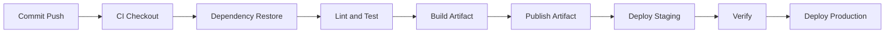

# CI/CD Integration

[Back to guide index](README.md)

## 10.1 CI/CD Goals

CI/CD should enable:

- Fast feedback
- Reproducible builds
- Automated testing
- Consistent artifact creation
- Controlled deployment
- Auditability

## 10.2 Typical Pipeline Stages

1. Checkout
2. Restore dependencies
3. Lint and static analysis
4. Unit/integration tests
5. Build/package
6. Publish artifacts
7. Deploy to staging
8. Verify
9. Promote to production

## 10.3 Mermaid Diagram: CI/CD Pipeline



## 10.4 GitHub Actions Basics

GitHub Actions uses YAML workflows stored in:

```text
.github/workflows/
```

Triggers include:

- `push`
- `pull_request`
- `workflow_dispatch`
- `schedule`

## 10.5 GitHub Actions Workflow for Maven

```yaml
name: Java CI

on:
  push:
    branches: [ main ]
  pull_request:

jobs:
  build:
    runs-on: ubuntu-latest
    steps:
      - uses: actions/checkout@v4
      - uses: actions/setup-java@v4
        with:
          distribution: temurin
          java-version: '17'
          cache: maven
      - name: Build
        run: mvn -B -ntp clean verify
      - name: Upload artifact
        uses: actions/upload-artifact@v4
        with:
          name: java-app
          path: target/*.jar
```

## 10.6 GitHub Actions Workflow for Python

```yaml
name: Python CI

on:
  push:
    branches: [ main ]
  pull_request:

jobs:
  test:
    runs-on: ubuntu-latest
    steps:
      - uses: actions/checkout@v4
      - uses: actions/setup-python@v5
        with:
          python-version: '3.12'
      - name: Install
        run: |
          python -m pip install --upgrade pip
          pip install -r requirements.txt
      - name: Test
        run: pytest
      - name: Build package
        run: python -m build
```

## 10.7 GitHub Actions Workflow for Node.js

```yaml
name: Node CI

on:
  push:
    branches: [ main ]
  pull_request:

jobs:
  build:
    runs-on: ubuntu-latest
    steps:
      - uses: actions/checkout@v4
      - uses: actions/setup-node@v4
        with:
          node-version: '20'
          cache: 'npm'
      - name: Install
        run: npm ci
      - name: Test
        run: npm test
      - name: Build
        run: npm run build
```

## 10.8 GitHub Actions Workflow for Go

```yaml
name: Go CI

on:
  push:
    branches: [ main ]
  pull_request:

jobs:
  test:
    runs-on: ubuntu-latest
    steps:
      - uses: actions/checkout@v4
      - uses: actions/setup-go@v5
        with:
          go-version: '1.22'
      - name: Test
        run: go test ./...
      - name: Build
        run: go build -o myapp ./cmd/myapp
```

## 10.9 GitHub Actions Workflow for .NET

```yaml
name: Dotnet CI

on:
  push:
    branches: [ main ]
  pull_request:

jobs:
  build:
    runs-on: ubuntu-latest
    steps:
      - uses: actions/checkout@v4
      - uses: actions/setup-dotnet@v4
        with:
          dotnet-version: '8.0.x'
      - name: Restore
        run: dotnet restore
      - name: Build
        run: dotnet build -c Release --no-restore
      - name: Test
        run: dotnet test -c Release --no-build
      - name: Publish
        run: dotnet publish -c Release -o publish --no-build
```

## 10.10 Deployment Job with SSH Example

```yaml
name: Deploy

on:
  workflow_dispatch:

jobs:
  deploy:
    runs-on: ubuntu-latest
    steps:
      - uses: actions/checkout@v4
      - name: Copy artifact
        run: |
          scp build/myapp.tar.gz deploy@app.example.com:/srv/deployments/
      - name: Deploy remotely
        run: |
          ssh deploy@app.example.com 'sudo /usr/local/bin/deploy-myapp.sh'
```

Use secrets for:

- SSH keys
- Repository credentials
- Cloud credentials
- Artifact repository tokens

## 10.11 Jenkins Pipeline Basics

A `Jenkinsfile` defines the pipeline.

Declarative example for Java:

```groovy
pipeline {
  agent any

  stages {
    stage('Checkout') {
      steps {
        checkout scm
      }
    }

    stage('Build') {
      steps {
        sh 'mvn -B -ntp clean verify'
      }
    }

    stage('Archive') {
      steps {
        archiveArtifacts artifacts: 'target/*.jar', fingerprint: true
      }
    }
  }
}
```

## 10.12 Jenkins Pipeline for Node.js

```groovy
pipeline {
  agent any

  stages {
    stage('Install') {
      steps {
        sh 'npm ci'
      }
    }

    stage('Test') {
      steps {
        sh 'npm test'
      }
    }

    stage('Build') {
      steps {
        sh 'npm run build'
      }
    }
  }
}
```

## 10.13 GitLab CI Example

```yaml
stages:
  - test
  - build
  - deploy

python-test:
  stage: test
  image: python:3.12
  script:
    - pip install -r requirements.txt
    - pytest

python-build:
  stage: build
  image: python:3.12
  script:
    - pip install build
    - python -m build
  artifacts:
    paths:
      - dist/

python-deploy:
  stage: deploy
  script:
    - scp dist/*.whl deploy@app.example.com:/srv/deployments/
```

## 10.14 Artifact Management

Artifact repositories include:

- Nexus
- Artifactory
- GitHub Packages
- GitLab Package Registry
- S3-compatible storage

Store:

- JAR/WAR files
- Python wheels
- npm packages
- Binary tarballs
- Docker images

Best practices:

- Tag artifacts with commit SHA and version
- Store metadata and checksums
- Separate snapshots from releases
- Retain rollback candidates

## 10.15 Promotion vs Rebuild

Prefer promotion.

That means:

- Build once in CI
- Test the built artifact
- Promote the same artifact to higher environments

Do not rebuild from the same commit for each environment unless policy demands it.

## 10.16 Secrets in CI/CD

Never store plaintext secrets in:

- Git repositories
- Build scripts
- Dockerfiles
- Public logs

Use:

- GitHub Actions secrets
- Jenkins credentials store
- GitLab protected variables
- Vault or cloud secret stores

## 10.17 CI/CD Pipeline Hardening

- Use ephemeral runners where possible
- Pin action versions
- Restrict deployment environments
- Require approvals for production
- Sign or verify artifacts
- Limit secret scope
- Audit who deployed what and when

## 10.18 Deployment Gates

Useful production gates:

- Manual approval
- Change window validation
- Automated smoke tests
- Error budget checks
- Database migration completion checks

## 10.19 Common CI/CD Mistakes

- Deploying from a developer workstation instead of CI
- Not caching dependencies wisely
- Leaking secrets in logs
- Building different artifacts per environment unintentionally
- Missing rollback automation
- No post-deploy verification step

---
